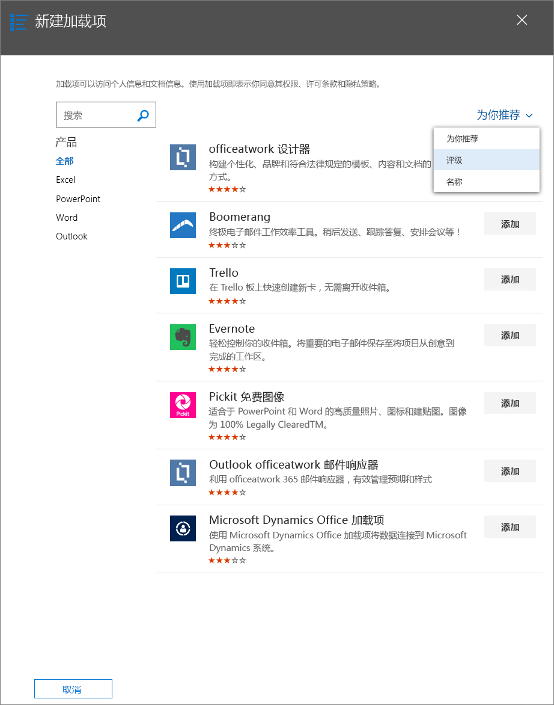

# 通过 Microsoft 365 管理中心使用集中部署发布 Office 加载项Publish Office Add-ins using Centralized Deployment via the Microsoft 365 admin center

Microsoft 365 管理中心使管理员能够轻松地将 Office 加载项部署到其组织内的用户和组。The Microsoft 365 admin center makes it easy for an administrator to deploy Office Add-ins to users and groups within their organization. 通过管理中心部署加载项后，用户可立即在其 Office 应用程序中使用此加载项，而无需进行客户端配置。Add-ins deployed via the admin center are available to users in their Office applications right away, with no client configuration required. 可以通过集中部署来部署内部加载项以及 ISV 提供的加载项。You can use Centralized Deployment to deploy internal add-ins as well as add-ins provided by ISVs.

Microsoft 365 管理中心当前支持以下方案。The Microsoft 365 admin center currently supports the following scenarios.

- 为个人、组或组织集中部署新的和更新的加载项。Centralized Deployment of new and updated add-ins to individuals, groups, or an organization.
- 部署到多个客户端平台，包括 Windows、Mac 和 Web。Deployment to multiple client platforms, including Windows, Mac, and the web. 对于 Outlook，也支持部署到 iOS 和 Android。For Outlook, deployment to iOS and Android is also supported.  (，尽管支持在 iPad 上安装 Excel、Outlook、Word 和 PowerPoint 加载项，但不支持集中部署到 iPad。) (However, while user installation of Excel, Outlook, Word, and PowerPoint add-ins on iPad is supported, Centralized Deployment to iPad is **not** supported.)
- 到英语语言租户和全球范围租户的部署。Deployment to English language and worldwide tenants.
- 部署云托管的加载项。Deployment of cloud-hosted add-ins.
- 部署托管在防火墙内的加载项。Deployment of add-ins that are hosted within a firewall.
- 部署 AppSource 加载项。Deployment of AppSource add-ins.
- 当用户启动 Office 应用时自动为用户安装加载项。Automatic installation of an add-in for users when they launch the Office application.
- 当管理员禁用或删除加载项，或者将用户从 Azure Active Directory 或从已部署加载项的组中删除时，则自动为用户删除该加载项。Automatic removal of an add-in for users if the admin turns off or deletes the add-in, or if users are removed from Azure Active Directory or from a group to which the add-in has been deployed.

建议 Microsoft 365 管理员使用集中部署在组织中部署 Office 加载项，但组织必须满足使用集中部署的所有要求。Centralized Deployment is the recommended way for a Microsoft 365 admin to deploy Office Add-ins within an organization, provided that the organization meets all requirements for using Centralized Deployment. 若要了解如何确定组织能否使用集中部署，请参阅"确定外接程序的集中部署是否适用于[Microsoft 365 组织"。](/office365/admin/manage/centralized-deployment-of-add-ins)For information about how to determine if your organization can use Centralized Deployment, see [Determine if Centralized Deployment of add-ins works for your Microsoft 365 organization](/office365/admin/manage/centralized-deployment-of-add-ins).

> [!NOTE]
> 在未连接到 Microsoft 365 或部署面向 Office 2013 的 SharePoint 加载项或 Office 加载项的本地环境中，请使用 [SharePoint 应用程序目录](publish-task-pane-and-content-add-ins-to-an-add-in-catalog.md)。In an on-premises environment with no connection to Microsoft 365, or to deploy SharePoint add-ins or Office Add-ins that target Office 2013, use a [SharePoint app catalog](publish-task-pane-and-content-add-ins-to-an-add-in-catalog.md). 若要部署 COM/VSTO 加载项，请使用 ClickOnce 或 Windows Installer，如[部署 Office 解决方案](/visualstudio/vsto/deploying-an-office-solution)中所述。To deploy COM/VSTO add-ins, use ClickOnce or Windows Installer, as described in [Deploying an Office solution](/visualstudio/vsto/deploying-an-office-solution).

## 部署 Office 加载项的推荐方法Recommended approach for deploying Office Add-ins

请考虑分阶段部署 Office 加载项，以确保部署顺利进行。建议使用以下计划：Consider deploying Office Add-ins in a phased approach to help ensure that the deployment goes smoothly. We recommend the following plan:

1. 为一小部分的企业利益干系人和 IT 部门成员部署加载项。 如果部署成功，则转到步骤 2。Deploy the add-in to a small set of business stakeholders and members of the IT department. If the deployment is successful, move on to step 2.

2. 为企业内更多的将使用加载项的个人部署加载项。 如果部署成功，则转到步骤 3。Deploy the add-in to a larger set of individuals within the business who will be using the add-in. If the deployment is successful, move on to step 3.

3. 为所有将使用加载项的个人部署加载项。Deploy the add-in to the full set of individuals who will be using the add-in.

根据目标受众的规模，可能需要在此过程中添加步骤或删除步骤。Depending on the size of the target audience, you may want to add steps to or remove steps from this procedure.

## 通过集中部署发布 Office 加载项Publish an Office Add-in via Centralized Deployment

开始之前，请确认组织满足使用集中部署的所有要求，如"确定外接程序的集中部署是否适用于 [Microsoft 365 组织"中所述](/microsoft-365/admin/manage/centralized-deployment-of-add-ins)。Before you begin, confirm that your organization meets all requirements for using Centralized Deployment, as described in [Determine if Centralized Deployment of add-ins works for your Microsoft 365 organization](/microsoft-365/admin/manage/centralized-deployment-of-add-ins).

如果组织满足所有要求，请完成以下步骤以通过集中部署发布 Office 加载项：If your organization meets all requirements, complete the following steps to publish an Office Add-in via Centralized Deployment:

1. 使用你的工作或教育帐户登录 Microsoft 365。Sign in to Microsoft 365 with your work or education account.
2. 选择左上角的应用启动器图标，然后选择“**管理员**”。Select the app launcher icon in the upper-left and choose **Admin**.
3. 在导航菜单中，按“**显示更多内容**”，然后选择“**设置**” > “**服务和加载项**”。In the navigation menu, press **Show more**, then choose **Settings** > **Services & add-ins**.
4. 如果在页面顶部看到一条消息，宣布推出新的 Microsoft 365 管理中心，请选择该消息以转到管理中心预览版 (请参阅"关于 [Microsoft 365](/microsoft-365/admin/admin-overview/about-the-admin-center) 管理中心") 。If you see a message on the top of the page announcing the new Microsoft 365 admin center, choose the message to go to the Admin Center Preview (see [About the Microsoft 365 admin center](/microsoft-365/admin/admin-overview/about-the-admin-center)).
5. 在页面顶部选择“**部署加载项**”。Choose **Deploy Add-In** at the top of the page.
6. 查看要求后，请选择“**下一步**”。Choose **Next** after reviewing the requirements.
7. 在“**集中部署**”页面上，选择以下选项之一：Choose one of the following options on the **Centralized Deployment** page:

    - **我想从 Office 应用商店添加加载项。****I want to add an Add-In from the Office Store.**
    - **我在此设备上具有清单文件 (.xml)。****I have the manifest file (.xml) on this device.** 对于此选项，请选择“浏览”以找到想要使用的清单文件 (.xml)。For this option, choose **Browse** to locate the manifest file (.xml) that you want to use.
    - **我具有清单文件的 URL。** 对于此选项，请在提供的字段中键入清单的 URL。**I have a URL for the manifest file.** For this option, type the manifest's URL in the field provided.

    

8. 如果选择了此选项以从 Office 应用商店添加某个加载项，请选择该加载项。If you selected the option to add an add-in from the Office Store, select the add-in. 可以通过“**为你推荐**”、“**评级**”或“**名称**”类别，查看可用的加载项。You can view available add-ins via categories of **Suggested for you**, **Rating**, or **Name**. 仅能从 Office 应用商店添加免费加载项。You may only add free add-ins from Office Store. 目前不支持添加付费加载项。Adding paid add-ins isn't currently supported.

    > [!NOTE]
    > 使用 Office 应用商店选项，无需干预，用户即可自动获得加载项的更新和增强功能。With the Office Store option, updates and enhancements to the add-in are automatically available to users without your intervention.

    

9. 查看 **外接程序** 详细信息、隐私策略和许可条款后，选择"继续"。Choose **Continue** after reviewing the add-in details, Privacy Policy, and License Terms.

    

10. 在"**分配用户"** 页上，选择"**任何人\*\*\*\*"、"特定用户/组"** 或 **"仅我"。**On the **Assign Users** page, choose **Everyone**, **Specific Users/Groups**, or **Only me**. 使用“搜索”框查找要向其部署加载项的用户和组。Use the search box to find the users and groups to whom you want to deploy the add-in. 对于 Outlook 外接程序，还可以选择部署方法 **"** 固定"、"可用"或 **"可选"。**For Outlook add-ins, you can also choose the deployment method **Fixed**, **Available**, or **Optional**.

    

    > [!NOTE]
    > 利用 [SSO ](../develop/sso-in-office-add-ins.md) (单一登录) 将提示管理员同意外接程序清单中列出的范围。Add-ins that utilize [single sign-on (SSO)](../develop/sso-in-office-add-ins.md) will prompt the admin to consent to the scopes listed in the add-in manifest.  如果跨多个加载项使用相同的支持服务 (则同一 Azure 应用 ID 用于不同外接程序) 中的 SSO，将提示每个外接程序的范围，以征得每个部署的同意。If the same backing service is used across multiple add-ins (the same Azure App ID is used with SSO in different add-ins), the scopes for each add-in will be prompted for consent with each deployment. 此页面还将显示加载项所需的权限列表。This page will also display the list of permissions that the add-in requires.

11. 完成后，选择"部署 **"。**When finished, choose **Deploy**. 此过程可能最多用时 3 分钟。This process may take up to three minutes. 然后，按“**下一步**”完成演练。Then, finish the walkthrough by pressing **Next**. 现在，你将看到加载项和其他 Office 应用。You now see your add-in along with other Office apps.

    > [!NOTE]
    > 当管理员 **选择"部署**"时，将给予所有用户同意。When an administrator chooses **Deploy**, consent is given for all users.

    

> [!TIP]
> 为组织中的用户和/或组部署新加载项时，请考虑向他们发送一封电子邮件，说明加载项的应用场景和使用方式，并添加相关帮助内容、FAQ 或其他支持资源的链接。When you deploy a new add-in to users and/or groups in your organization, consider sending them an email that describes when and how to use the add-in, and includes links to relevant Help content, FAQs, or other support resources.

## 授予加载项的访问权限时的注意事项Considerations when granting access to an add-in

管理员可以将加载项分配给组织中的每个人或组织内的特定用户和/或组。 以下列表描述了每个选项的含义：Admins can assign an add-in to everyone in the organization or to specific users and/or groups within the organization. The following list describes the implications of each option:

- **每个人**：顾名思义，此选项为租户中的每位用户分配加载项。请谨慎使用此选项，且仅应用于真正在组织中通用的加载项。**Everyone**: As the name implies, this option assigns the add-in to every user in the tenant. Use this option sparingly and only for add-ins that are truly universal to your organization.

- **用户**：如果将加载项分配给单个用户，则每次要将其分配给其他用户时，都需要更新此加载项的集中部署设置。 同样，每次要删除某个用户对该加载项的访问权限时，都需要更新该加载项的集中部署设置。**Users**: If you assign an add-in to individual users, you'll need to update the Central Deployment settings for the add-in each time you want to assign it additional users. Likewise, you'll need to update the Central Deployment settings for the add-in each time you want to remove a user's access to the add-in.

- **组**：如果将加载项分配给组，则会自动为被添加到此组的用户分配此加载项。**Groups**: If you assign an add-in to a group, users who are added to the group will automatically be assigned the add-in. 同样，当将某个用户从组中删除时，此用户将自动失去对此加载项的访问权限。Likewise, when a user is removed from a group, the user automatically loses access to the add-in. 在任一情况下，Microsoft 365 管理员无需执行任何其他操作。In either case, no additional action is required from the Microsoft 365 admin.

一般情况下，为了便于维护，我们建议尽可能使用组来分配加载项。 但是，在想要将加载项的访问权限限制在极少数用户的情况下，将加载项分配给特定用户的做法可能更为实用。In general, for ease of maintenance, we recommend assigning add-ins by using groups whenever possible. However, in situations where you want to restrict add-in access to a very small number of users, it may be more practical to assign the add-in to specific users.

## 加载项状态Add-in states

下表介绍了加载项的不同状态。The following table describes the different states of an add-in.

|状态State|此状态如何出现How the state occurs|影响Impact|
|-----|--------------------|------|
|**活动****Active**|管理员已上传加载项并已将其分配给用户和/或组。Admin uploaded the add-in and assigned it to users and/or groups.|已为其分配加载项的用户和/或组，可在相关的 Office 客户端中找到它。Users and/or groups assigned to the add-in see it in the relevant Office clients.|
|**已禁用****Turned off**|管理员已禁用加载项。Admin turned off the add-in.|已为其分配加载项的用户和/或组不再能够访问它。 如果加载项状态从“已禁用”\*\*\*\* 更改为“活动”\*\*\*\*，则用户和组将重新获得对它的访问权限。Users and/or groups assigned to the add-in no longer have access to it. If the add-in state is changed from **Turned off** to **Active**, the users and groups will regain access to it.|
|**已删除****Deleted**|管理员已删除加载项。Admin deleted the add-in.|已为其分配加载项的用户和/或组不再能够访问它。Users and/or groups assigned the add-in no longer have access to it.|

## 更新通过集中部署发布的 Office 加载项Updating Office Add-ins that are published via Centralized Deployment

通过集中部署发布 Office 外接程序后，在 Web 应用程序中实现这些更改后，对外接程序 Web 应用程序进行的任何更改将自动提供给所有用户。After an Office Add-in has been published via Centralized Deployment, any changes made to the add-in's web application will automatically be available to all users after those changes are implemented in the web application. 对外接程序 [的 XML](../develop/add-in-manifests.md) 清单文件所做的更改（例如，更新加载项的图标、文本或外接程序命令）发生如下：Changes made to an add-in's [XML manifest file](../develop/add-in-manifests.md) to, for example, update the add-in's icon, text, or add-in commands, happen as follows:

- 业务线外接程序：如果管理员在通过 Microsoft 365 管理中心实现集中部署时，通过设备或通过指向 URL) 显式上载清单文件 (，则管理员必须上载包含所需更改的新清单文件。**Line-of-business add-in**: If an admin explicitly uploaded a manifest file (either from their device or by pointing to a URL) when implementing Centralized Deployment via the Microsoft 365 admin center, the admin must upload a new manifest file that contains the desired changes. 上传更新后的清单文件后，加载项就会在下次相关 Office 应用启动时更新。After the updated manifest file has been uploaded, the next time the relevant Office applications start, the add-in will update.

  > [!NOTE]
  > 管理员无需删除 LOB 加载项来进行更新。An admin doesn't need to remove a LOB add-in to make an update. 在"加载项"部分中，管理员只需按右下角的"更新外接程序"按钮即可选择 LOB 加载项并调用此功能。In the Add-ins section, the admin can simply choose the LOB add-in and invoke this functionality by pressing the **Update add-in** button present in the bottom right corner.
  >
  > 

- **Office 应用商店** 外接程序：如果管理员在通过 Microsoft 365 管理中心实施集中部署时从 Office 应用商店选择了外接程序，并且 Office 应用商店中的外接程序更新，则稍后加载项将通过集中部署进行更新。**Office Store add-in**: If an admin selected an add-in from the Office Store when implementing Centralized Deployment via the Microsoft 365 admin center, and the add-in updates in the Office Store, the add-in will update later via Centralized Deployment. 所有最终用户的应用商店外接程序更新最多可能需要 24 小时。It can take up to 24 hours for the Store add-in updates to flow for all end users. 在此持续时间后，下一次为这些用户重新启动相关 Office 应用程序时，加载项将更新。After this duration, the next time the relevant Office applications restart for these users, the add-in will update. 用户还可以通过选择"插入选项卡加载项管理托管选项卡点击刷新"来触发手动刷新，获取最新的应用商店  >    >    >  **外接程序版本**。Users can also trigger a Manual Refresh to get the latest Store add-in version by selecting **Insert Tab** > **Add-ins** > **Admin Managed Tab** > **Hit Refresh**.

## 加载项最终用户体验End user experience with add-ins

通过集中部署发布加载项后，最终用户可以在加载项支持的任何平台上开始使用它。After an add-in has been published via Centralized Deployment, end users may start using it on any platform that the add-in supports.

如果外接程序支持外接程序命令，则这些命令将出现在为其部署外接程序的所有用户的 Office 应用程序功能区上。 在以下的示例中，**搜索引文** 命令将显示在 **引文** 加载项的功能区上。If the add-in supports add-in commands, the commands will appear on the Office application ribbon for all users to whom the add-in is deployed. In the following example, the command **Search Citation** appears in the ribbon for the **Citations** add-in.

如果加载项不支持加载项命令，用户可以通过执行以下操作将其添加到 Office 应用程序中：If the add-in does not support add-in commands, users can add it to their Office application by doing the following:

1. 在 Word 2016 或更高版本、Excel 2016 或更高版本，或 PowerPoint 2016 或更高版本，选择“**插入**” > “**我的加载项**”。In Word 2016 or later, Excel 2016 or later, or PowerPoint 2016 or later, choose **Insert** > **My Add-ins**.
2. 在加载项窗口中选择“**管理托管**”选项卡。Choose the **Admin Managed** tab in the add-in window.
3. 选择加载项，然后选择“**添加**”。Choose the add-in, and then choose **Add**.

    

但是，对于 Outlook 2016 或更高版本，用户可以执行以下操作：However, for Outlook 2016 or later, users can do the following:

1. 在 Outlook 中，选择“**开始**” > “**应用商店**”。In Outlook, choose **Home** > **Store**.
2. 选择“加载项”选项卡下的“**管理员管理**”选项卡。Choose the **Admin-managed** item under the add-in tab.
3. 选择加载项，然后选择“**添加**”。Choose the add-in, and then choose **Add**.

    

## 另请参阅See also

- [确定外接程序的集中部署是否适用于 Microsoft 365 组织Determine if Centralized Deployment of add-ins works for your Microsoft 365 organization](/office365/admin/manage/centralized-deployment-of-add-ins)
