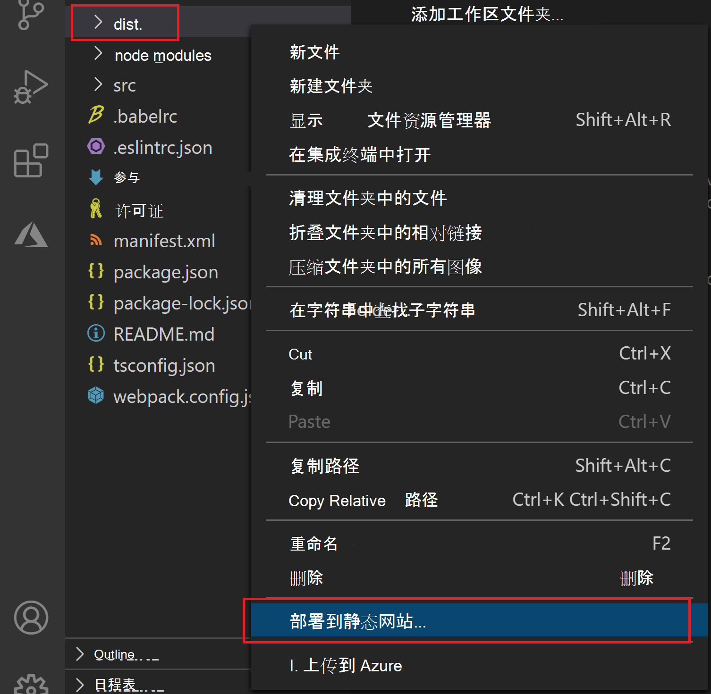

# <a name="publish-an-add-in-developed-with-visual-studio-code"></a>发布使用 Visual Studio Code 开发的加载项

本文介绍如何发布使用 Yeoman 生成器创建并使用 [Visual Studio Code (VS Code)](https://code.visualstudio.com) 或任何其他编辑器开发的 Office 加载项。

> [!NOTE]
> 要了解如何发布使用 Visual Studio 创建的 Office 加载项，请参阅[使用 Visual Studio 发布加载项](package-your-add-in-using-visual-studio.md)。

## <a name="publishing-an-add-in-for-other-users-to-access"></a>发布加载项供其他人用户访问

Office 加载项 包含 Web 应用程序和清单文件。Web 应用程序定义加载项的用户界面和功能，清单指定 Web 应用程序的位置并定义加载项的设置和功能。

在开发时，可以在本地 Web 服务器上运行加载项 `localhost` ， () 。 准备好发布它供其他用户访问时，需要部署 Web 应用程序并更新清单以指定已部署应用程序的 URL。

当加载项根据需要运行时，可以使用 Visual Studio Code 扩展直接Azure 存储它。

## <a name="using-visual-studio-code-to-publish"></a>使用Visual Studio Code发布

>[!NOTE]
> 这些步骤仅适用于使用 Yeoman 生成器创建的项目。

1. 从项目根文件夹中打开项目，Visual Studio Code (VS Code) 。
2. 从应用程序扩展VS Code，搜索并Azure 存储扩展。
3. 安装后，Azure 图标将添加到活动栏。 选择它以访问扩展。 如果活动栏处于隐藏状态，你将无法访问扩展。 通过选择"显示活动栏 **">">"显示活动栏"。**
4. 在扩展中时，通过选择"登录到 Azure" **登录到 Azure 帐户**。 如果还没有 Azure 帐户，也可以选择"创建免费的 Azure 帐户"来创建 **Azure 帐户**。 按照提供的步骤设置帐户。
5. 登录 Azure 帐户后，你将看到 Azure 存储帐户显示在扩展中。 如果还没有存储帐户，则需要使用"新建存储帐户"选项 **创建一** 个存储帐户。 将存储帐户命名为全局唯一名称，仅使用"a-z"和"0-9"。 请注意，默认情况下，这将创建一个存储帐户和一个同名的资源组。 它会自动将存储帐户置于美国西部。 这可以通过 Azure 帐户 [在线调整](https://portal.azure.com/)。
6. 选择并按住 (右键单击) 存储帐户"，选择"**配置静态网站"。** 将要求您输入索引文档名称和 404 文档名称。 将索引文档名称从默认更改为 `index.html` **`taskpane.html`** 。 您也可以决定更改 404 文档名称，但不要求更改。
7. 选择并按住 (右键单击) 存储"，这次选择"浏览静态 **网站"。** 从打开的浏览器窗口中，复制网站 URL。
8. 在 VS Code 中，打开项目的清单文件 () ，将本地主机 URL (（如) ）的任何引用更改为已复制的 `manifest.xml` `https://localhost:3000` URL。 此终结点是新创建的存储帐户的静态网站 URL。 保存对清单文件所做的更改。
9. 打开命令行提示符并导航到加载项项目的根目录。 然后运行以下命令以准备用于生产部署的所有文件。

    ```command&nbsp;line
    npm run build
    ```

    生成完成后，加载项项目的根目录中的 **dist** 文件夹将包含要在后续步骤中部署的文件。

10. 若要部署，请选择文件资源管理器，选择并按住 (右键) **dist** 文件夹，然后选择部署到静态 **网站**。 当系统提示时，选择之前创建的存储帐户。



11. 部署完成后 **，将显示"** 浏览到网站"消息，您可以选择该消息打开已部署应用代码的主终结点。

## <a name="see-also"></a>另请参阅

- [使用 Visual Studio Code 开发 Office 加载项](../develop/develop-add-ins-vscode.md)
- [部署和发布 Office 外接程序](../publish/publish.md)
