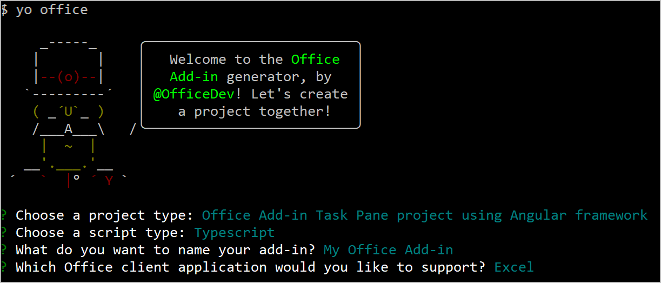

# <a name="build-an-excel-task-pane-add-in-using-angular"></a><span data-ttu-id="eb462-103">使用 Angular 生成 Excel 任务窗格加载项</span><span class="sxs-lookup"><span data-stu-id="eb462-103">Build an Excel task pane add-in using Angular</span></span>

<span data-ttu-id="eb462-104">本文将逐步介绍如何使用 Angular 和 Excel JavaScript API 生成 Excel 任务加载项。</span><span class="sxs-lookup"><span data-stu-id="eb462-104">In this article, you'll walk through the process of building an Excel task pane add-in using Angular and the Excel JavaScript API.</span></span>

## <a name="prerequisites"></a><span data-ttu-id="eb462-105">先决条件</span><span class="sxs-lookup"><span data-stu-id="eb462-105">Prerequisites</span></span>

[!include[Set up requirements](../includes/set-up-dev-environment-beforehand.md)]
[!include[Yeoman generator prerequisites](../includes/quickstart-yo-prerequisites.md)]

## <a name="create-the-add-in-project"></a><span data-ttu-id="eb462-106">创建加载项项目</span><span class="sxs-lookup"><span data-stu-id="eb462-106">Create the add-in project</span></span>

[!include[Yeoman generator create project guidance](../includes/yo-office-command-guidance.md)]

- <span data-ttu-id="eb462-107">**选择项目类型:** `Office Add-in Task Pane project using Angular framework`</span><span class="sxs-lookup"><span data-stu-id="eb462-107">**Choose a project type:** `Office Add-in Task Pane project using Angular framework`</span></span>
- <span data-ttu-id="eb462-108">**选择脚本类型:** `TypeScript`</span><span class="sxs-lookup"><span data-stu-id="eb462-108">**Choose a script type:** `TypeScript`</span></span>
- <span data-ttu-id="eb462-109">**要如何命名加载项?**</span><span class="sxs-lookup"><span data-stu-id="eb462-109">**What do you want to name your add-in?**</span></span> `My Office Add-in`
- <span data-ttu-id="eb462-110">**要支持哪一个 Office 客户端应用程序?**</span><span class="sxs-lookup"><span data-stu-id="eb462-110">**Which Office client application would you like to support?**</span></span> `Excel`



<span data-ttu-id="eb462-112">完成此向导后，生成器会创建项目，并安装支持的 Node 组件。</span><span class="sxs-lookup"><span data-stu-id="eb462-112">After you complete the wizard, the generator creates the project and installs supporting Node components.</span></span>

[!include[Yeoman generator next steps](../includes/yo-office-next-steps.md)]

## <a name="explore-the-project"></a><span data-ttu-id="eb462-113">浏览项目</span><span class="sxs-lookup"><span data-stu-id="eb462-113">Explore the project</span></span>

<span data-ttu-id="eb462-114">使用 Yeoman 生成器创建的加载项项目包含适合于基础任务窗格加载项的示例代码。</span><span class="sxs-lookup"><span data-stu-id="eb462-114">The add-in project that you've created with the Yeoman generator contains sample code for a very basic task pane add-in.</span></span> <span data-ttu-id="eb462-115">如果想要浏览加载项项目的主要组件，请在代码编辑器中打开项目并检查下面列出的文件。</span><span class="sxs-lookup"><span data-stu-id="eb462-115">If you'd like to explore the key components of your add-in project, open the project in your code editor and review the files listed below.</span></span> <span data-ttu-id="eb462-116">准备好试用加载项时，请转至下一部分。</span><span class="sxs-lookup"><span data-stu-id="eb462-116">When you're ready to try out your add-in, proceed to the next section.</span></span>

- <span data-ttu-id="eb462-117">项目根目录中的 **manifest.xml** 文件定义加载项的设置和功能。</span><span class="sxs-lookup"><span data-stu-id="eb462-117">The **manifest.xml** file in the root directory of the project defines the settings and capabilities of the add-in.</span></span>
- <span data-ttu-id="eb462-118">**./src/taskpane/app/app.component.html** 文件包含组成任务窗格的 HTML。</span><span class="sxs-lookup"><span data-stu-id="eb462-118">The **./src/taskpane/app/app.component.html** file contains the HTML markup for the task pane.</span></span>
- <span data-ttu-id="eb462-119">**./src/taskpane/taskpane.css** 文件包含应用于任务窗格中的内容的 CSS。</span><span class="sxs-lookup"><span data-stu-id="eb462-119">The **./src/taskpane/taskpane.css** file contains the CSS that's applied to content in the task pane.</span></span>
- <span data-ttu-id="eb462-120">**./src/taskpane/app/app.component.ts** 文件包含用于加快任务窗格与 Excel 之间的交互的 Office JavaScript API 代码。</span><span class="sxs-lookup"><span data-stu-id="eb462-120">The **./src/taskpane/app/app.component.ts** file contains the Office JavaScript API code that facilitates interaction between the task pane and Excel.</span></span>

## <a name="try-it-out"></a><span data-ttu-id="eb462-121">试用</span><span class="sxs-lookup"><span data-stu-id="eb462-121">Try it out</span></span>

1. <span data-ttu-id="eb462-122">导航到项目的根文件夹。</span><span class="sxs-lookup"><span data-stu-id="eb462-122">Navigate to the root folder of the project.</span></span>

    ```command&nbsp;line
    cd "My Office Add-in"
    ```

2. [!include[Start server section](../includes/quickstart-yo-start-server-excel.md)] 

3. <span data-ttu-id="eb462-123">在 Excel 中，依次选择的“**开始**”选项卡和功能区中的“**显示任务窗格**”按钮，以打开加载项任务窗格。</span><span class="sxs-lookup"><span data-stu-id="eb462-123">In Excel, choose the **Home** tab, and then choose the **Show Taskpane** button in the ribbon to open the add-in task pane.</span></span>

    

4. <span data-ttu-id="eb462-125">选择工作表中的任何一系列单元格。</span><span class="sxs-lookup"><span data-stu-id="eb462-125">Select any range of cells in the worksheet.</span></span>

5. <span data-ttu-id="eb462-126">在任务窗格的底部，选择“**运行**”链接，价格选定范围的颜色设为黄色。</span><span class="sxs-lookup"><span data-stu-id="eb462-126">At the bottom of the task pane, choose the **Run** link to set the color of the selected range to yellow.</span></span>

    

## <a name="next-steps"></a><span data-ttu-id="eb462-128">后续步骤</span><span class="sxs-lookup"><span data-stu-id="eb462-128">Next steps</span></span>

<span data-ttu-id="eb462-129">祝贺，你已使用 Angular 成功创建了 Excel 任务窗格加载项！</span><span class="sxs-lookup"><span data-stu-id="eb462-129">Congratulations, you've successfully created an Excel task pane add-in using Angular!</span></span> <span data-ttu-id="eb462-130">接下来，请详细了解 Excel 加载项功能，并跟着 Excel 加载项教程一起操作，生成更复杂的加载项。</span><span class="sxs-lookup"><span data-stu-id="eb462-130">Next, learn more about the capabilities of an Excel add-in and build a more complex add-in by following along with the Excel add-in tutorial.</span></span>

> [!div class="nextstepaction"]
> [<span data-ttu-id="eb462-131">Excel 加载项教程</span><span class="sxs-lookup"><span data-stu-id="eb462-131">Excel add-in tutorial</span></span>](../tutorials/excel-tutorial.md)

## <a name="see-also"></a><span data-ttu-id="eb462-132">另请参阅</span><span class="sxs-lookup"><span data-stu-id="eb462-132">See also</span></span>

* [<span data-ttu-id="eb462-133">Office 加载项平台概述</span><span class="sxs-lookup"><span data-stu-id="eb462-133">Office Add-ins platform overview</span></span>](../overview/office-add-ins.md)
* [<span data-ttu-id="eb462-134">构建 Office 加载项</span><span class="sxs-lookup"><span data-stu-id="eb462-134">Building Office Add-ins</span></span>](../overview/office-add-ins-fundamentals.md)
* [<span data-ttu-id="eb462-135">开发 Office 加载项</span><span class="sxs-lookup"><span data-stu-id="eb462-135">Develop Office Add-ins</span></span>](../develop/develop-overview.md)
* [<span data-ttu-id="eb462-136">Excel JavaScript API 基本编程概念</span><span class="sxs-lookup"><span data-stu-id="eb462-136">Fundamental programming concepts with the Excel JavaScript API</span></span>](../excel/excel-add-ins-core-concepts.md)
* [<span data-ttu-id="eb462-137">Excel 加载项代码示例</span><span class="sxs-lookup"><span data-stu-id="eb462-137">Excel add-in code samples</span></span>](https://developer.microsoft.com/office/gallery/?filterBy=Samples,Excel)
* [<span data-ttu-id="eb462-138">Excel JavaScript API 参考</span><span class="sxs-lookup"><span data-stu-id="eb462-138">Excel JavaScript API reference</span></span>](../reference/overview/excel-add-ins-reference-overview.md)
