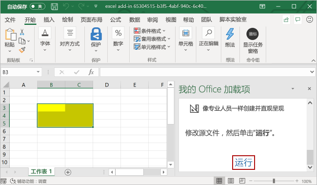

# <a name="build-an-excel-task-pane-add-in"></a><span data-ttu-id="dd0f7-103">生成 Excel 任务窗格加载项</span><span class="sxs-lookup"><span data-stu-id="dd0f7-103">Build an Excel task pane add-in</span></span>

<span data-ttu-id="dd0f7-104">本文将逐步介绍如何生成 Excel 任务窗格加载项。</span><span class="sxs-lookup"><span data-stu-id="dd0f7-104">In this article, you'll walk through the process of building an Excel task pane add-in.</span></span>

## <a name="create-the-add-in"></a><span data-ttu-id="dd0f7-105">创建加载项</span><span class="sxs-lookup"><span data-stu-id="dd0f7-105">Create the add-in</span></span>

[!include[Choose your editor](../includes/quickstart-choose-editor.md)]
# <a name="yeoman-generator"></a>[<span data-ttu-id="dd0f7-106">Yeoman 生成器</span><span class="sxs-lookup"><span data-stu-id="dd0f7-106">Yeoman generator</span></span>](#tab/yeomangenerator)

[!include[Redirect to the single sign-on (SSO) quick start](../includes/sso-quickstart-reference.md)]

## <a name="prerequisites"></a><span data-ttu-id="dd0f7-107">先决条件</span><span class="sxs-lookup"><span data-stu-id="dd0f7-107">Prerequisites</span></span>

[!include[Set up requirements](../includes/set-up-dev-environment-beforehand.md)]
[!include[Yeoman generator prerequisites](../includes/quickstart-yo-prerequisites.md)]

### <a name="create-the-add-in-project"></a><span data-ttu-id="dd0f7-108">创建加载项项目</span><span class="sxs-lookup"><span data-stu-id="dd0f7-108">Create the add-in project</span></span>

[!include[Yeoman generator create project guidance](../includes/yo-office-command-guidance.md)]

- <span data-ttu-id="dd0f7-109">**选择项目类型:** `Office Add-in Task Pane project`</span><span class="sxs-lookup"><span data-stu-id="dd0f7-109">**Choose a project type:** `Office Add-in Task Pane project`</span></span>
- <span data-ttu-id="dd0f7-110">**选择脚本类型:** `Javascript`</span><span class="sxs-lookup"><span data-stu-id="dd0f7-110">**Choose a script type:** `Javascript`</span></span>
- <span data-ttu-id="dd0f7-111">**要如何命名加载项?**</span><span class="sxs-lookup"><span data-stu-id="dd0f7-111">**What do you want to name your add-in?**</span></span> `My Office Add-in`
- <span data-ttu-id="dd0f7-112">**要支持哪一个 Office 客户端应用程序?**</span><span class="sxs-lookup"><span data-stu-id="dd0f7-112">**Which Office client application would you like to support?**</span></span> `Excel`


<span data-ttu-id="dd0f7-114">完成此向导后，生成器会创建项目，并安装支持的 Node 组件。</span><span class="sxs-lookup"><span data-stu-id="dd0f7-114">After you complete the wizard, the generator creates the project and installs supporting Node components.</span></span>

[!include[Yeoman generator next steps](../includes/yo-office-next-steps.md)]

### <a name="explore-the-project"></a><span data-ttu-id="dd0f7-115">浏览项目</span><span class="sxs-lookup"><span data-stu-id="dd0f7-115">Explore the project</span></span>

[!include[Yeoman generator add-in project components](../includes/yo-task-pane-project-components-js.md)]

### <a name="try-it-out"></a><span data-ttu-id="dd0f7-116">试用</span><span class="sxs-lookup"><span data-stu-id="dd0f7-116">Try it out</span></span>

1. <span data-ttu-id="dd0f7-117">导航到项目的根文件夹。</span><span class="sxs-lookup"><span data-stu-id="dd0f7-117">Navigate to the root folder of the project.</span></span>

    ```command&nbsp;line
    cd "My Office Add-in"
    ```

2. [!include[Start server section](../includes/quickstart-yo-start-server-excel.md)]

3. <span data-ttu-id="dd0f7-118">在 Excel 中，依次选择的“**开始**”选项卡和功能区中的“**显示任务窗格**”按钮，以打开加载项任务窗格。</span><span class="sxs-lookup"><span data-stu-id="dd0f7-118">In Excel, choose the **Home** tab, and then choose the **Show Taskpane** button in the ribbon to open the add-in task pane.</span></span>

    

4. <span data-ttu-id="dd0f7-120">选择工作表中的任何一系列单元格。</span><span class="sxs-lookup"><span data-stu-id="dd0f7-120">Select any range of cells in the worksheet.</span></span>

5. <span data-ttu-id="dd0f7-121">在任务窗格的底部，选择“**运行**”链接，价格选定范围的颜色设为黄色。</span><span class="sxs-lookup"><span data-stu-id="dd0f7-121">At the bottom of the task pane, choose the **Run** link to set the color of the selected range to yellow.</span></span>

    

### <a name="next-steps"></a><span data-ttu-id="dd0f7-123">后续步骤</span><span class="sxs-lookup"><span data-stu-id="dd0f7-123">Next steps</span></span>

<span data-ttu-id="dd0f7-124">恭喜，你已成功创建 Excel 任务窗格加载项！</span><span class="sxs-lookup"><span data-stu-id="dd0f7-124">Congratulations, you've successfully created an Excel task pane add-in!</span></span> <span data-ttu-id="dd0f7-125">接下来，请详细了解 Excel 加载项功能，并跟着 [Excel 加载项教程](../tutorials/excel-tutorial.md)一起操作，生成更复杂的加载项。</span><span class="sxs-lookup"><span data-stu-id="dd0f7-125">Next, learn more about the capabilities of an Excel add-in and build a more complex add-in by following along with the [Excel add-in tutorial](../tutorials/excel-tutorial.md).</span></span>

# <a name="visual-studio"></a>[<span data-ttu-id="dd0f7-126">Visual Studio</span><span class="sxs-lookup"><span data-stu-id="dd0f7-126">Visual Studio</span></span>](#tab/visualstudio)

### <a name="prerequisites"></a><span data-ttu-id="dd0f7-127">先决条件</span><span class="sxs-lookup"><span data-stu-id="dd0f7-127">Prerequisites</span></span>

[!include[Quick Start prerequisites](../includes/quickstart-vs-prerequisites.md)]

### <a name="create-the-add-in-project"></a><span data-ttu-id="dd0f7-128">创建加载项项目</span><span class="sxs-lookup"><span data-stu-id="dd0f7-128">Create the add-in project</span></span>

1. <span data-ttu-id="dd0f7-129">在 Visual Studio 中，选择“**新建项目**”。</span><span class="sxs-lookup"><span data-stu-id="dd0f7-129">In Visual Studio, choose **Create a new project**.</span></span>

2. <span data-ttu-id="dd0f7-130">使用搜索框，输入“**加载项**”。</span><span class="sxs-lookup"><span data-stu-id="dd0f7-130">Using the search box, enter **add-in**.</span></span> <span data-ttu-id="dd0f7-131">选择“**Excel Web 加载项**”，然后选择“**下一步**”。</span><span class="sxs-lookup"><span data-stu-id="dd0f7-131">Choose **Excel Web Add-in**, then select **Next**.</span></span>

3. <span data-ttu-id="dd0f7-132">命名项目为 **ExcelWebAddIn1** 并选择“**创建**”。</span><span class="sxs-lookup"><span data-stu-id="dd0f7-132">Name your project **ExcelWebAddIn1** and select **Create**.</span></span>

4. <span data-ttu-id="dd0f7-133">在“创建 Office 加载项”对话框窗口中，选择“将新功能添加到 Excel”，再选择“完成”以创建项目。</span><span class="sxs-lookup"><span data-stu-id="dd0f7-133">In the **Create Office Add-in** dialog window, choose **Add new functionalities to Excel**, and then choose **Finish** to create the project.</span></span>

5. <span data-ttu-id="dd0f7-p103">此时，Visual Studio 创建解决方案，且它的两个项目显示在“解决方案资源管理器”中。**Home.html** 文件在 Visual Studio 中打开。</span><span class="sxs-lookup"><span data-stu-id="dd0f7-p103">Visual Studio creates a solution and its two projects appear in **Solution Explorer**. The **Home.html** file opens in Visual Studio.</span></span>

### <a name="explore-the-visual-studio-solution"></a><span data-ttu-id="dd0f7-136">探索 Visual Studio 解决方案</span><span class="sxs-lookup"><span data-stu-id="dd0f7-136">Explore the Visual Studio solution</span></span>

[!include[Description of Visual Studio projects](../includes/quickstart-vs-solution.md)]

### <a name="update-the-code"></a><span data-ttu-id="dd0f7-137">更新代码</span><span class="sxs-lookup"><span data-stu-id="dd0f7-137">Update the code</span></span>

1. <span data-ttu-id="dd0f7-p104">**Home.html** 指定在加载项的任务窗格中呈现的 HTML。 在 **Home.html** 中，将 `<body>` 元素替换为以下标记，并保存文件。</span><span class="sxs-lookup"><span data-stu-id="dd0f7-p104">**Home.html** specifies the HTML that will be rendered in the add-in's task pane. In **Home.html**, replace the `<body>` element with the following markup and save the file.</span></span>

    ```html
    <body class="ms-font-m ms-welcome">
        <div id="content-header">
            <div class="padding">
                <h1>Welcome</h1>
            </div>
        </div>
        <div id="content-main">
            <div class="padding">
                <p>Choose the button below to set the color of the selected range to green.</p>
                <br />
                <h3>Try it out</h3>
                <button class="ms-Button" id="set-color">Set color</button>
            </div>
        </div>
    </body>
    ```

2. <span data-ttu-id="dd0f7-p105">打开 Web 应用项目根目录中的文件“Home.js”\*\*\*\*。 此文件指定加载项脚本。 将整个内容替换为以下代码，并保存文件。</span><span class="sxs-lookup"><span data-stu-id="dd0f7-p105">Open the file **Home.js** in the root of the web application project. This file specifies the script for the add-in. Replace the entire contents with the following code and save the file.</span></span>

    ```js
    'use strict';

    (function () {

        Office.onReady(function() {
            // Office is ready
            $(document).ready(function () {
                // The document is ready
                $('#set-color').click(setColor);
            });
        });

        function setColor() {
            Excel.run(function (context) {
                var range = context.workbook.getSelectedRange();
                range.format.fill.color = 'green';

                return context.sync();
            }).catch(function (error) {
                console.log("Error: " + error);
                if (error instanceof OfficeExtension.Error) {
                    console.log("Debug info: " + JSON.stringify(error.debugInfo));
                }
            });
        }
    })();
    ```

3. <span data-ttu-id="dd0f7-p106">打开 Web 应用项目根目录中的文件“Home.css”\*\*\*\*。 此文件指定加载项自定义样式。 将整个内容替换为以下代码，并保存文件。</span><span class="sxs-lookup"><span data-stu-id="dd0f7-p106">Open the file **Home.css** in the root of the web application project. This file specifies the custom styles for the add-in. Replace the entire contents with the following code and save the file.</span></span>

    ```css
    #content-header {
        background: #2a8dd4;
        color: #fff;
        position: absolute;
        top: 0;
        left: 0;
        width: 100%;
        height: 80px;
        overflow: hidden;
    }

    #content-main {
        background: #fff;
        position: fixed;
        top: 80px;
        left: 0;
        right: 0;
        bottom: 0;
        overflow: auto;
    }

    .padding {
        padding: 15px;
    }
    ```

### <a name="update-the-manifest"></a><span data-ttu-id="dd0f7-146">更新清单</span><span class="sxs-lookup"><span data-stu-id="dd0f7-146">Update the manifest</span></span>

1. <span data-ttu-id="dd0f7-147">在 **解决方案资源管理器** 中，转到 **ExcelWebAddIn1** 加载项项目并打开 **ExcelWebAddIn1Manifest** 目录。</span><span class="sxs-lookup"><span data-stu-id="dd0f7-147">In **Solution Explorer**, go to the **ExcelWebAddIn1** add-in project and open the **ExcelWebAddIn1Manifest** directory.</span></span> <span data-ttu-id="dd0f7-148">此目录包含清单文件，即 **ExcelWebAddIn1.xml**。</span><span class="sxs-lookup"><span data-stu-id="dd0f7-148">This directory contains your manifest file, **ExcelWebAddIn1.xml**.</span></span> <span data-ttu-id="dd0f7-149">此文件定义了加载项设置和功能。</span><span class="sxs-lookup"><span data-stu-id="dd0f7-149">The XML manifest file defines the add-in's settings and capabilities.</span></span> <span data-ttu-id="dd0f7-150">请参阅上一节 [探索Visual Studio 解决方案](#explore-the-visual-studio-solution) ，详细了解由 Visual Studio 解决方案创建的两个项目。</span><span class="sxs-lookup"><span data-stu-id="dd0f7-150">See the preceding section [Explore the Visual Studio solution](#explore-the-visual-studio-solution) for more information about the two projects created by your Visual Studio solution.</span></span> 

2. <span data-ttu-id="dd0f7-p108">`ProviderName` 元素具有占位符值。 将其替换为你的姓名。</span><span class="sxs-lookup"><span data-stu-id="dd0f7-p108">The `ProviderName` element has a placeholder value. Replace it with your name.</span></span>

3. <span data-ttu-id="dd0f7-153">`DisplayName` 元素的 `DefaultValue` 属性有占位符。</span><span class="sxs-lookup"><span data-stu-id="dd0f7-153">The `DefaultValue` attribute of the `DisplayName` element has a placeholder.</span></span> <span data-ttu-id="dd0f7-154">将它替换为“My Office Add-in”。</span><span class="sxs-lookup"><span data-stu-id="dd0f7-154">Replace it with **My Office Add-in**.</span></span>

4. <span data-ttu-id="dd0f7-155">`Description` 元素的 `DefaultValue` 属性有占位符。</span><span class="sxs-lookup"><span data-stu-id="dd0f7-155">The `DefaultValue` attribute of the `Description` element has a placeholder.</span></span> <span data-ttu-id="dd0f7-156">将它替换为“A task pane add-in for Excel”。</span><span class="sxs-lookup"><span data-stu-id="dd0f7-156">Replace it with **A task pane add-in for Excel**.</span></span>

5. <span data-ttu-id="dd0f7-157">保存文件。</span><span class="sxs-lookup"><span data-stu-id="dd0f7-157">Save the file.</span></span>

    ```xml
    ...
    <ProviderName>John Doe</ProviderName>
    <DefaultLocale>en-US</DefaultLocale>
    <!-- The display name of your add-in. Used on the store and various places of the Office UI such as the add-ins dialog. -->
    <DisplayName DefaultValue="My Office Add-in" />
    <Description DefaultValue="A task pane add-in for Excel"/>
    ...
    ```

### <a name="try-it-out"></a><span data-ttu-id="dd0f7-158">试用</span><span class="sxs-lookup"><span data-stu-id="dd0f7-158">Try it out</span></span>

1. <span data-ttu-id="dd0f7-159">使用 Visual Studio 时，测试新建的 Excel 加载项，具体方法为按 **F5** 或选择“开始”按钮来启动 Excel，功能区中显示“显示任务窗格”加载项按钮。</span><span class="sxs-lookup"><span data-stu-id="dd0f7-159">Using Visual Studio, test the newly created Excel add-in by pressing **F5** or choosing the **Start** button to launch Excel with the **Show Taskpane** add-in button displayed in the ribbon.</span></span> <span data-ttu-id="dd0f7-160">加载项本地托管在 IIS 上。</span><span class="sxs-lookup"><span data-stu-id="dd0f7-160">The add-in will be hosted locally on IIS.</span></span> <span data-ttu-id="dd0f7-161">如果系统要求你信任证书，请信任证书，这样此加载项才能连接到它的 Office 应用程序。</span><span class="sxs-lookup"><span data-stu-id="dd0f7-161">If you are asked to trust a certificate, do so to allow the add-in to connect to its Office application.</span></span>

2. <span data-ttu-id="dd0f7-162">在 Excel 中，依次选择的“**开始**”选项卡和功能区中的“**显示任务窗格**”按钮，以打开加载项任务窗格。</span><span class="sxs-lookup"><span data-stu-id="dd0f7-162">In Excel, choose the **Home** tab, and then choose the **Show Taskpane** button in the ribbon to open the add-in task pane.</span></span>

    

3. <span data-ttu-id="dd0f7-164">选择工作表中的任何一系列单元格。</span><span class="sxs-lookup"><span data-stu-id="dd0f7-164">Select any range of cells in the worksheet.</span></span>

4. <span data-ttu-id="dd0f7-165">在任务窗格中，选择“**设置颜色**”按钮，将选定区域的颜色设置为绿色。</span><span class="sxs-lookup"><span data-stu-id="dd0f7-165">In the task pane, choose the **Set color** button to set the color of the selected range to green.</span></span>

    

[!include[Console tool note](../includes/console-tool-note.md)]

### <a name="next-steps"></a><span data-ttu-id="dd0f7-167">后续步骤</span><span class="sxs-lookup"><span data-stu-id="dd0f7-167">Next steps</span></span>

<span data-ttu-id="dd0f7-168">恭喜，你已成功创建 Excel 任务窗格加载项！</span><span class="sxs-lookup"><span data-stu-id="dd0f7-168">Congratulations, you've successfully created an Excel task pane add-in!</span></span> <span data-ttu-id="dd0f7-169">接下来，了解有关[使用 Visual Studio 开发 Office 加载项](../develop/develop-add-ins-visual-studio.md)的详细信息。</span><span class="sxs-lookup"><span data-stu-id="dd0f7-169">Next, learn more about [developing Office Add-ins with Visual Studio](../develop/develop-add-ins-visual-studio.md).</span></span>

---

## <a name="see-also"></a><span data-ttu-id="dd0f7-170">另请参阅</span><span class="sxs-lookup"><span data-stu-id="dd0f7-170">See also</span></span>

* [<span data-ttu-id="dd0f7-171">Office 加载项平台概述</span><span class="sxs-lookup"><span data-stu-id="dd0f7-171">Office Add-ins platform overview</span></span>](../overview/office-add-ins.md)
* [<span data-ttu-id="dd0f7-172">开发 Office 加载项</span><span class="sxs-lookup"><span data-stu-id="dd0f7-172">Develop Office Add-ins</span></span>](../develop/develop-overview.md)
* [<span data-ttu-id="dd0f7-173">Excel 加载项中的 Word JavaScript 对象模型</span><span class="sxs-lookup"><span data-stu-id="dd0f7-173">Excel JavaScript object model in Office Add-ins</span></span>](../excel/excel-add-ins-core-concepts.md)
* [<span data-ttu-id="dd0f7-174">Excel 加载项代码示例</span><span class="sxs-lookup"><span data-stu-id="dd0f7-174">Excel add-in code samples</span></span>](https://developer.microsoft.com/office/gallery/?filterBy=Samples,Excel)
* [<span data-ttu-id="dd0f7-175">Excel JavaScript API 参考</span><span class="sxs-lookup"><span data-stu-id="dd0f7-175">Excel JavaScript API reference</span></span>](../reference/overview/excel-add-ins-reference-overview.md)
