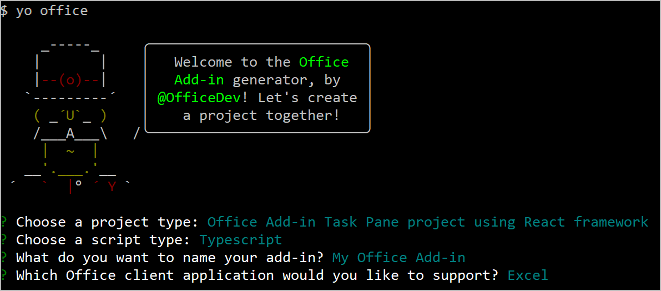

# <a name="use-react-to-build-an-excel-task-pane-add-in"></a>使用 React 生成 Excel 任务窗格加载项

本文将逐步介绍如何使用 React 和 Excel JavaScript API 生成 Excel 任务加载项。

## <a name="prerequisites"></a>先决条件

[!include[Set up requirements](../includes/set-up-dev-environment-beforehand.md)]
[!include[Yeoman generator prerequisites](../includes/quickstart-yo-prerequisites.md)]

## <a name="create-the-add-in-project"></a>创建加载项项目

[!include[Yeoman generator create project guidance](../includes/yo-office-command-guidance.md)]

- **选择项目类型:** `Office Add-in Task Pane project using React framework`
- **选择脚本类型:** `TypeScript`
- **要如何命名加载项?** `My Office Add-in`
- **要支持哪一个 Office 客户端应用程序?** `Excel`



完成此向导后，生成器会创建项目，并安装支持的 Node 组件。

[!include[Yeoman generator next steps](../includes/yo-office-next-steps.md)]

## <a name="explore-the-project"></a>浏览项目

使用 Yeoman 生成器创建的加载项项目包含适合于基础任务窗格加载项的示例代码。 如果想要浏览加载项项目的主要组件，请在代码编辑器中打开项目并检查下面列出的文件。 准备好试用加载项时，请转至下一部分。

- 项目根目录中的 **manifest.xml** 文件定义加载项的设置和功能。 有关 **manifest.xml** 文件的详细信息，请参阅 [ Office 外接程序 XML 清单](../develop/add-in-manifests.md)。
- **./src/taskpane/taskpane.html** 文件定义任务窗格的 HTML 框架，而 **./src/taskpane/components** 文件夹内的文件定义任务窗格 UI 的各个部分。
- **./src/taskpane/taskpane.css** 文件包含应用于任务窗格中的内容的 CSS。
- **./src/taskpane/components/App.tsx** 文件包含用于加快任务窗格与 Excel 之间的交互的 Office JavaScript API 代码。

## <a name="try-it-out"></a>试用

1. 导航到项目的根文件夹。

    ```command&nbsp;line
    cd "My Office Add-in"
    ```

1. [!include[Start server section](../includes/quickstart-yo-start-server-excel.md)] 

1. 在 Excel 中，依次选择的“**开始**”选项卡和功能区中的“**显示任务窗格**”按钮，以打开加载项任务窗格。

    

1. 选择工作表中的任何一系列单元格。

1. 在任务窗格的底部，选择“**运行**”链接，价格选定范围的颜色设为黄色。

    

## <a name="next-steps"></a>后续步骤

恭喜！你已使用 React 成功创建 Excel 任务窗格加载项！接下来，请详细了解 Excel 加载项功能，并跟着 Excel 加载项教程一起操作，以生成更复杂的加载项。

> [!div class="nextstepaction"]
> [Excel 加载项教程](../tutorials/excel-tutorial.md)

## <a name="see-also"></a>另请参阅

- [Excel 加载项教程](../tutorials/excel-tutorial.md)
- [Excel 加载项中的 Word JavaScript 对象模型](../excel/excel-add-ins-core-concepts.md)
- [Excel 加载项代码示例](https://developer.microsoft.com/office/gallery/?filterBy=Samples,Excel)
- [Excel JavaScript API 参考](../reference/overview/excel-add-ins-reference-overview.md)