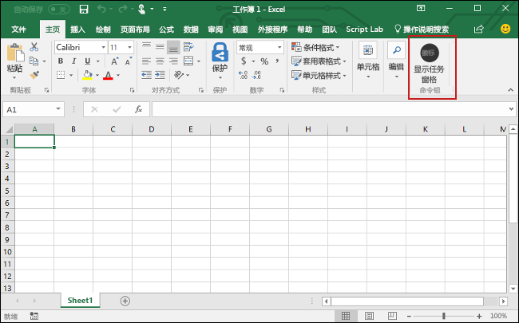

# <a name="build-an-excel-add-in-using-react"></a><span data-ttu-id="273df-102">使用 React 生成 Excel 加载项</span><span class="sxs-lookup"><span data-stu-id="273df-102">Build an Excel add-in using React</span></span>

<span data-ttu-id="273df-103">在本文中，你将完成使用 React 和 Excel JavaScript API 生成 Excel 加载项的过程。</span><span class="sxs-lookup"><span data-stu-id="273df-103">In this article, you'll walk through the process of building an Excel add-in using React and the Excel JavaScript API.</span></span>

## <a name="prerequisites"></a><span data-ttu-id="273df-104">先决条件</span><span class="sxs-lookup"><span data-stu-id="273df-104">Prerequisites</span></span>

- [<span data-ttu-id="273df-105">Node.js</span><span class="sxs-lookup"><span data-stu-id="273df-105">Node.js</span></span>](https://nodejs.org)

- <span data-ttu-id="273df-106">全局安装最新版 [Yeoman](https://github.com/yeoman/yo) 和 [Office 加载项的 Yeoman 生成器](https://github.com/OfficeDev/generator-office)。</span><span class="sxs-lookup"><span data-stu-id="273df-106">Install the latest version of [Yeoman](https://github.com/yeoman/yo) and the [Yeoman generator for Office Add-ins](https://github.com/OfficeDev/generator-office) globally.</span></span>
    ```bash
    npm install -g yo generator-office
    ```

## <a name="create-the-web-app"></a><span data-ttu-id="273df-107">创建 Web 应用</span><span class="sxs-lookup"><span data-stu-id="273df-107">Create the web app</span></span>

1. <span data-ttu-id="273df-108">使用 Yeoman 生成器创建 Excel 加载项项目。</span><span class="sxs-lookup"><span data-stu-id="273df-108">Use the Yeoman generator to create an Excel add-in project.</span></span> <span data-ttu-id="273df-109">运行下面的命令，再回答如下所示的提示问题：</span><span class="sxs-lookup"><span data-stu-id="273df-109">Run the following command and then answer the prompts as follows:</span></span>

    ```bash
    yo office
    ```

    - <span data-ttu-id="273df-110">**选择项目类型:** `Office Add-in project using React framework`</span><span class="sxs-lookup"><span data-stu-id="273df-110">**Choose a project type:** `Office Add-in project using React framework`</span></span>
    - <span data-ttu-id="273df-111">**要如何命名加载项?:** `My Office Add-in`</span><span class="sxs-lookup"><span data-stu-id="273df-111">**What do you want to name your add-in?:** `My Office Add-in`</span></span>
    - <span data-ttu-id="273df-112">**要支持哪一个 Office 客户端应用？：**`Excel`</span><span class="sxs-lookup"><span data-stu-id="273df-112">**Which Office client application would you like to support?:** `Excel`</span></span>

    

    <span data-ttu-id="273df-114">完成此向导后，生成器会创建项目，并安装支持的 Node 组件。</span><span class="sxs-lookup"><span data-stu-id="273df-114">After you complete the wizard, the generator will create the project and install supporting Node components.</span></span>

2. <span data-ttu-id="273df-115">导航到项目的根文件夹。</span><span class="sxs-lookup"><span data-stu-id="273df-115">Navigate to the root folder of the project.</span></span>

    ```bash
    cd "My Office Add-in"
    ```

## <a name="update-the-code"></a><span data-ttu-id="273df-116">更新代码</span><span class="sxs-lookup"><span data-stu-id="273df-116">Update the code</span></span>

1. <span data-ttu-id="273df-117">在代码编辑器中，打开文件 **src/styles.less**，将以下样式添加到文件的末尾，然后保存文件。</span><span class="sxs-lookup"><span data-stu-id="273df-117">In your code editor, open the file **src/styles.less**, add the following styles to the end of the file, and save the file.</span></span>

    ```css
    #content-header {
        background: #2a8dd4;
        color: #fff;
        position: absolute;
        top: 0;
        left: 0;
        width: 100%;
        height: 80px;
        overflow: hidden;
        font-family: Arial;
        padding-top: 25px;
    }

    #content-main {
        background: #fff;
        position: fixed;
        top: 80px;
        left: 0;
        right: 0;
        bottom: 0;
        overflow: auto;
        font-family: Arial;
    }

    .padding {
        padding: 15px;
    }

    .padding-sm {
        padding: 4px;
    }

    .normal-button {
        width: 80px;
        padding: 2px;
    }
    ```

2. <span data-ttu-id="273df-118">Office 加载项 Yeoman 生成器创建的项目模板包含此快速入门不需要的 React 组件。</span><span class="sxs-lookup"><span data-stu-id="273df-118">The project template that the Office Add-ins Yeoman generator created includes a React component that is not needed for this quick start.</span></span> <span data-ttu-id="273df-119">删除文件 **src/components/HeroList.tsx**。</span><span class="sxs-lookup"><span data-stu-id="273df-119">Delete the file **src/components/HeroList.tsx**.</span></span>

3. <span data-ttu-id="273df-120">打开文件 **src/components/Header.tsx**，将全部内容替换为以下代码，然后保存文件。</span><span class="sxs-lookup"><span data-stu-id="273df-120">Open the file **src/components/Header.tsx**, replace the entire contents with the following code, and save the file.</span></span>

    ```typescript
    import * as React from 'react';

    export interface HeaderProps {
        title: string;
    }

    export class Header extends React.Component<HeaderProps, any> {
        constructor(props, context) {
            super(props, context);
        }

        render() {
            return (
                <div id='content-header'>
                    <div className='padding'>
                        <h1>{this.props.title}</h1>
                    </div>
                </div>
            );
        }
    }
    ```

4. <span data-ttu-id="273df-121">在 **src / components** 文件夹中创建一个名为 **Content.tsx** 的新 React 组件，添加以下代码，然后保存文件。</span><span class="sxs-lookup"><span data-stu-id="273df-121">Create a new React component named **Content.tsx** in the **src/components** folder, add the following code, and save the file.</span></span>

    ```typescript
    import * as React from 'react';
    import { Button, ButtonType } from 'office-ui-fabric-react';

    export interface ContentProps {
        message: string;
        buttonLabel: string;
        click: any;
    }

    export class Content extends React.Component<ContentProps, any> {
        constructor(props, context) {
            super(props, context);
        }

        render() {
            return (
                <div id='content-main'>
                    <div className='padding'>
                        <p>{this.props.message}</p>
                        <br />
                        <h3>Try it out</h3>
                        <br/>
                        <Button className='normal-button' buttonType={ButtonType.hero} onClick={this.props.click}>{this.props.buttonLabel}</Button>
                    </div>
                </div>
            );
        }
    }
    ```

5. <span data-ttu-id="273df-122">打开文件 **src/components/App.tsx**，将全部内容替换为以下代码，然后保存文件。</span><span class="sxs-lookup"><span data-stu-id="273df-122">Open the file **src/components/App.tsx**, replace the entire contents with the following code, and save the file.</span></span>

    ```typescript
    /* global Office, Excel */

    import * as React from 'react';
    import { Header } from './Header';
    import { Content } from './Content';
    import Progress from './Progress';

    import * as OfficeHelpers from '@microsoft/office-js-helpers';

    export interface AppProps {
        title: string;
        isOfficeInitialized: boolean;
    }

    export interface AppState {
    }

    export default class App extends React.Component<AppProps, AppState> {
        constructor(props, context) {
            super(props, context);
        }

        setColor = async () => {
            try {
                await Excel.run(async context => {
                    const range = context.workbook.getSelectedRange();
                    range.load('address');
                    range.format.fill.color = 'green';
                    await context.sync();
                    console.log(`The range address was ${range.address}.`);
                });
            } catch (error) {
                OfficeHelpers.UI.notify(error);
                OfficeHelpers.Utilities.log(error);
            }
        }

        render() {
            const {
                title,
                isOfficeInitialized,
            } = this.props;

            if (!isOfficeInitialized) {
                return (
                    <Progress
                        title={title}
                        logo='assets/logo-filled.png'
                        message='Please sideload your add-in to see app body.'
                    />
                );
            }

            return (
                <div className='ms-welcome'>
                    <Header title='Welcome' />
                    <Content message='Choose the button below to set the color of the selected range to green.' buttonLabel='Set color' click={this.setColor} />
                </div>
            );
        }
    }
    ```

## <a name="update-the-manifest"></a><span data-ttu-id="273df-123">更新清单</span><span class="sxs-lookup"><span data-stu-id="273df-123">Update the manifest</span></span>

1. <span data-ttu-id="273df-124">打开文件“**manifest.xml**”以定义加载项的设置和功能。</span><span class="sxs-lookup"><span data-stu-id="273df-124">Open the file **manifest.xml** to define the add-in's settings and capabilities.</span></span> 

2. <span data-ttu-id="273df-p103">`ProviderName` 元素具有占位符值。 将其替换为你的姓名。</span><span class="sxs-lookup"><span data-stu-id="273df-p103">The `ProviderName` element has a placeholder value. Replace it with your name.</span></span>

3. <span data-ttu-id="273df-127">`Description` 元素的 `DefaultValue` 属性有占位符。</span><span class="sxs-lookup"><span data-stu-id="273df-127">The `DefaultValue` attribute of the `Description` element has a placeholder.</span></span> <span data-ttu-id="273df-128">将它替换为“A task pane add-in for Excel”\*\*\*\*。</span><span class="sxs-lookup"><span data-stu-id="273df-128">Replace it with **A task pane add-in for Excel**.</span></span>

4. <span data-ttu-id="273df-129">保存文件。</span><span class="sxs-lookup"><span data-stu-id="273df-129">Save the file.</span></span>

    ```xml
    ...
    <ProviderName>John Doe</ProviderName>
    <DefaultLocale>en-US</DefaultLocale>
    <!-- The display name of your add-in. Used on the store and various places of the Office UI such as the add-ins dialog. -->
    <DisplayName DefaultValue="My Office Add-in" />
    <Description DefaultValue="A task pane add-in for Excel"/>
    ...
    ```

## <a name="start-the-dev-server"></a><span data-ttu-id="273df-130">启动开发人员服务器</span><span class="sxs-lookup"><span data-stu-id="273df-130">Start the dev server</span></span>

[!include[Start server section](../includes/quickstart-yo-start-server.md)]

## <a name="try-it-out"></a><span data-ttu-id="273df-131">试用</span><span class="sxs-lookup"><span data-stu-id="273df-131">Try it out</span></span>

1. <span data-ttu-id="273df-132">请按照运行加载项所用平台对应的说明操作，以在 Excel 中旁加载加载项。</span><span class="sxs-lookup"><span data-stu-id="273df-132">Follow the instructions for the platform you'll use to run your add-in to sideload the add-in within Excel.</span></span>

    - <span data-ttu-id="273df-133">Windows：[在 Windows 上旁加载 Office 加载项](../testing/create-a-network-shared-folder-catalog-for-task-pane-and-content-add-ins.md)</span><span class="sxs-lookup"><span data-stu-id="273df-133">Windows: [Sideload Office Add-ins on Windows](../testing/create-a-network-shared-folder-catalog-for-task-pane-and-content-add-ins.md)</span></span>
    - <span data-ttu-id="273df-134">Excel Online：[在 Office Online 中旁加载 Office 加载项](../testing/sideload-office-add-ins-for-testing.md#sideload-an-office-add-in-in-office-online)</span><span class="sxs-lookup"><span data-stu-id="273df-134">Excel Online: [Sideload Office Add-ins in Office Online](../testing/sideload-office-add-ins-for-testing.md#sideload-an-office-add-in-in-office-online)</span></span>
    - <span data-ttu-id="273df-135">iPad 和 Mac：[在 iPad 和 Mac 上旁加载 Office 加载项](../testing/sideload-an-office-add-in-on-ipad-and-mac.md)</span><span class="sxs-lookup"><span data-stu-id="273df-135">iPad and Mac: [Sideload Office Add-ins on iPad and Mac](../testing/sideload-an-office-add-in-on-ipad-and-mac.md)</span></span>

2. <span data-ttu-id="273df-136">在 Excel 中，依次选择的“**开始**”选项卡和功能区中的“**显示任务窗格**”按钮，以打开加载项任务窗格。</span><span class="sxs-lookup"><span data-stu-id="273df-136">In Excel, choose the **Home** tab, and then choose the **Show Taskpane** button in the ribbon to open the add-in task pane.</span></span>

    

3. <span data-ttu-id="273df-138">选择工作表中的任何一系列单元格。</span><span class="sxs-lookup"><span data-stu-id="273df-138">Select any range of cells in the worksheet.</span></span>

4. <span data-ttu-id="273df-139">在任务窗格中，选择“**设置颜色**”按钮，将选定区域的颜色设置为绿色。</span><span class="sxs-lookup"><span data-stu-id="273df-139">In the task pane, choose the **Set color** button to set the color of the selected range to green.</span></span>

    

## <a name="next-steps"></a><span data-ttu-id="273df-141">后续步骤</span><span class="sxs-lookup"><span data-stu-id="273df-141">Next steps</span></span>

<span data-ttu-id="273df-p105">恭喜！已使用 React 成功创建 Excel 加载项！接下来，请详细了解 Excel 加载项功能，并跟着 Excel 加载项教程一起操作，生成更复杂的加载项。</span><span class="sxs-lookup"><span data-stu-id="273df-p105">Congratulations, you've successfully created an Excel add-in using React! Next, learn more about the capabilities of an Excel add-in and build a more complex add-in by following along with the Excel add-in tutorial.</span></span>

> [!div class="nextstepaction"]
> [<span data-ttu-id="273df-144">Excel 加载项教程</span><span class="sxs-lookup"><span data-stu-id="273df-144">Excel add-in tutorial</span></span>](../tutorials/excel-tutorial.md)

## <a name="see-also"></a><span data-ttu-id="273df-145">另请参阅</span><span class="sxs-lookup"><span data-stu-id="273df-145">See also</span></span>

* [<span data-ttu-id="273df-146">Excel 加载项教程</span><span class="sxs-lookup"><span data-stu-id="273df-146">Excel add-in tutorial</span></span>](../tutorials/excel-tutorial-create-table.md)
* [<span data-ttu-id="273df-147">Excel JavaScript API 基本编程概念</span><span class="sxs-lookup"><span data-stu-id="273df-147">Fundamental programming concepts with the Excel JavaScript API</span></span>](../excel/excel-add-ins-core-concepts.md)
* [<span data-ttu-id="273df-148">Excel 加载项代码示例</span><span class="sxs-lookup"><span data-stu-id="273df-148">Excel add-in code samples</span></span>](https://developer.microsoft.com/office/gallery/?filterBy=Samples,Excel)
* [<span data-ttu-id="273df-149">Excel JavaScript API 参考</span><span class="sxs-lookup"><span data-stu-id="273df-149">Excel JavaScript API reference</span></span>](/office/dev/add-ins/reference/overview/excel-add-ins-reference-overview)
