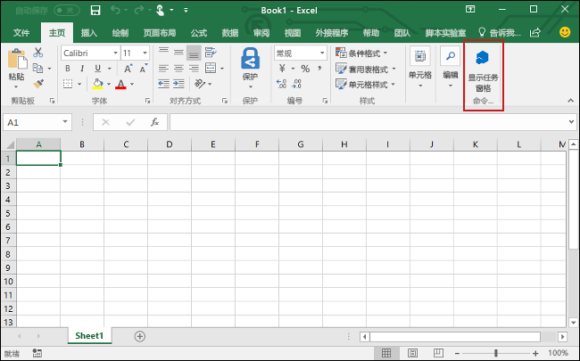
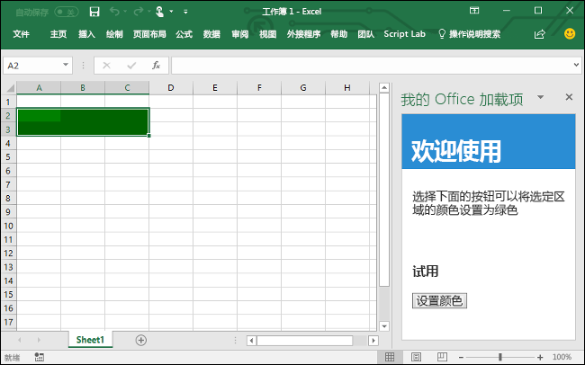

# <a name="build-an-excel-task-pane-add-in-using-vue"></a>使用 Vue 生成 Excel 任务窗格加载项

本文将逐步介绍如何使用 Vue 和 Excel JavaScript API 生成 Excel 任务加载项。

## <a name="prerequisites"></a>先决条件

[!include[Yeoman generator prerequisites](../includes/quickstart-yo-prerequisites.md)]

- 全局安装 [Vue CLI](https://cli.vuejs.org/)。

  ```command&nbsp;line
  npm install -g @vue/cli
  ```

## <a name="generate-a-new-vue-app"></a>生成新 Vue 应用程序

使用 Vue CLI 生成新的 Vue 应用。从终端运行以下命令。

```command&nbsp;line
vue create my-add-in
```

然后，选择 `default` 预设项。 如果系统提示你使用 Yarn 或 NPM 作为包，可任选其一。

## <a name="generate-the-manifest-file"></a>生成清单文件

每个加载项都需要定义自己设置和功能的清单文件。

1. 转到应用程序文件夹。

    ```command&nbsp;line
    cd my-add-in
    ```

2. 通过运行以下命令，使用 Yeoman 生成器生成加载项清单文件：

    ```command&nbsp;line
    yo office
    ```

    > [!NOTE]
    > 运行该`yo office`命令时，可能会收到有关 Yeoman 和 Office 加载项 CLI 工具的数据收集策略的提示。 根据你的需要，使用提供的信息来响应提示。 如果在对第二条提示的响应中选择“**退出**”，则在准备好创建加载项项目时，需要再次运行 `yo office` 命令。

    出现提示时，请提供以下信息来创建加载项项目：

    - **选择项目类型:** `Office Add-in project containing the manifest only`
    - **要如何命名加载项?** `my-office-add-in`
    - **要支持哪一个 Office 客户端应用程序?** `Excel`

    

完成向导后，会创建一个 `my-office-add-in` 文件夹，其中包含一个 `manifest.xml` 文件。 你将在本快速入门结束时使用该清单旁加载和测试你的加载项。

> [!TIP]
> 创建加载项项目后，可忽略 Yeoman 生成器提供的*后续步骤*指南。 本文中的分步说明提供了完成本教程所需的全部指南。

## <a name="secure-the-app"></a>保护应用

[!include[HTTPS guidance](../includes/https-guidance.md)]

要为应用启用 HTTPS，请使用以下内容在 Vue 项目的根文件夹中创建一个 `vue.config.js` 文件：

```js
module.exports = {
  devServer: {
    port: 3000,
    https: true
  }
};
```

## <a name="update-the-app"></a>更新应用

1. 打开 `public/index.html` 文件，在紧靠 `</head>` 标记的前面添加以下 `<script>` 标记：

   ```html
   <script src="https://appsforoffice.microsoft.com/lib/1/hosted/office.js"></script>
   ```

2. 打开 `src/main.js`，将内容替换为以下代码：

   ```js
   import Vue from 'vue';
   import App from './App.vue';

   Vue.config.productionTip = false;

   window.Office.initialize = () => {
     new Vue({
       render: h => h(App)
     }).$mount('#app');
   };
   ```

3. 打开 `src/App.vue`，将文件内容替换为以下代码：

   ```html
   <template>
     <div id="app">
       <div class="content">
         <div class="content-header">
           <div class="padding">
             <h1>Welcome</h1>
           </div>
         </div>
         <div id="content-main">
           <div class="padding">
             <p>
               Choose the button below to set the color of the selected range to
               green.
             </p>
             <br />
             <h3>Try it out</h3>
             <button @click="onSetColor">Set color</button>
           </div>
         </div>
       </div>
     </div>
   </template>

   <script>
     export default {
       name: 'App',
       methods: {
         onSetColor() {
           window.Excel.run(async context => {
             const range = context.workbook.getSelectedRange();
             range.format.fill.color = 'green';
             await context.sync();
           });
         }
       }
     };
   </script>

   <style>
     .content-header {
       background: #2a8dd4;
       color: #fff;
       position: absolute;
       top: 0;
       left: 0;
       width: 100%;
       height: 80px;
       overflow: hidden;
     }

     .content-main {
       background: #fff;
       position: fixed;
       top: 80px;
       left: 0;
       right: 0;
       bottom: 0;
       overflow: auto;
     }

     .padding {
       padding: 15px;
     }
   </style>
   ```

## <a name="start-the-dev-server"></a>启动开发人员服务器

1. 通过终端运行下面的命令，以启动开发人员服务器。

   ```command&nbsp;line
   npm run serve
   ```

2. 在 Web 浏览器中，导航到 `https://localhost:3000`（请注意 `https`）。 如果浏览器指明网站证书不受信任，则需要[将计算机配置为信任此证书](https://github.com/OfficeDev/generator-office/blob/fd600bbe00747e64aa5efb9846295a3f66d428aa/src/docs/ssl.md#add-certification-file-through-ie)。

3. 如果 `https://localhost:3000` 上的页面空白但没有任何证书错误，这表示它正常工作。 Office 初始化后装载 Vue 应用，因此它仅显示 Excel 环境中的内容。

## <a name="try-it-out"></a>试用

1. 请按照运行加载项和在 Excel 中旁加载加载项时所用平台对应的说明操作。

   - Windows：[在 Windows 上旁加载 Office 加载项](../testing/create-a-network-shared-folder-catalog-for-task-pane-and-content-add-ins.md)
   - Web 浏览器：[在 Office 网页版中旁加载 Office 加载项](../testing/sideload-office-add-ins-for-testing.md#sideload-an-office-add-in-in-office-on-the-web)
   - iPad 和 Mac：[在 iPad 和 Mac 上旁加载 Office 加载项](../testing/sideload-an-office-add-in-on-ipad-and-mac.md)

2. 在 Excel 中，依次选择的“**开始**”选项卡和功能区中的“**显示任务窗格**”按钮，以打开加载项任务窗格。

   

3. 选择工作表中的任何一系列单元格。

4. 在任务窗格中，选择“**设置颜色**”按钮，将选定区域的颜色设置为绿色。

   

## <a name="next-steps"></a>后续步骤

祝贺，你已使用 Vue 成功创建了 Excel 任务窗格加载项！ 接下来，请详细了解 Excel 加载项功能，并跟着 Excel 加载项教程一起操作，生成更复杂的加载项。

> [!div class="nextstepaction"]
> [Excel 加载项教程](../tutorials/excel-tutorial.md)

## <a name="see-also"></a>另请参阅

* [Excel 加载项教程](../tutorials/excel-tutorial-create-table.md)
* [Excel JavaScript API 基本编程概念](../excel/excel-add-ins-core-concepts.md)
* [Excel 加载项代码示例](https://developer.microsoft.com/office/gallery/?filterBy=Samples,Excel)
* [Excel JavaScript API 参考](/office/dev/add-ins/reference/overview/excel-add-ins-reference-overview)
