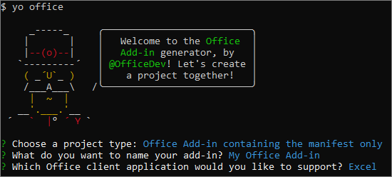

# <a name="build-an-excel-add-in-using-vue"></a>使用 Vue 生成 Excel 加载项

本文将逐步介绍如何使用 Vue 和 Excel JavaScript API 生成 Excel 加载项。

## <a name="prerequisites"></a>先决条件

- [Node.js](https://nodejs.org)

- 全局安装 [Vue CLI](https://github.com/vuejs/vue-cli)。

    ```command&nbsp;line
    npm install -g vue-cli
    ```

- 全局安装最新版 [Yeoman](https://github.com/yeoman/yo) 和[适用于 Office 加载项的 Yeoman 生成器](https://github.com/OfficeDev/generator-office)。

    ```command&nbsp;line
    npm install -g yo generator-office
    ```

## <a name="generate-a-new-vue-app"></a>生成新 Vue 应用程序

使用 Vue CLI 生成新 Vue 应用程序。 通过终端运行以下命令，再回答如下所示的提示问题。

```command&nbsp;line
vue init webpack my-add-in
```

回答上一个命令生成的提示问题时，请覆盖以下 3 个提示问题的默认回答。 可以接受其他所有提示问题的默认回答。

- **是否安装 vue-router?** `No`
- **设置单元测试：**`No`
- **是否设置包含 Nightwatch 的 e2e 测试?** `No`


## <a name="generate-the-manifest-file"></a>生成清单文件

每个加载项都需要定义自己设置和功能的清单文件。

1. 转到应用程序文件夹。

    ```command&nbsp;line
    cd my-add-in
    ```

2. 使用 Yeoman 生成器生成加载项清单文件。 运行下面的命令，再回答如下所示的提示问题。

    ```command&nbsp;line
    yo office
    ```

    - **选择项目类型:** `Office Add-in containing the manifest only`
    - **要如何命名加载项?:** `My Office Add-in`
    - **要支持哪一个 Office 客户端应用？：**`Excel`

    

    该向导完成后，生成器会创建清单文件。

## <a name="secure-the-app"></a>保护应用程序

[!include[HTTPS guidance](../includes/https-guidance.md)]

若要为应用程序启用 HTTPS，请打开 VUE 项目根文件夹中的文件 **package.json**，将 `dev` 脚本修改为添加 `--https` 标记，再保存此文件。

```json
"dev": "webpack-dev-server --https --inline --progress --config build/webpack.dev.conf.js"
```

## <a name="update-the-app"></a>更新应用程序

1. 在代码编辑器中，打开 Yo Office 在 Vue 项目根创建的文件夹 **My Office Add-in**。 在该文件夹中，您将看到定义加载项的设置的清单文件：**manifest.xml**。

2. 打开清单文件，将所有 `https://localhost:3000` 都替换为 `https://localhost:8080`，然后保存文件。

3. 打开文件 **index.html**（位于 Vue 项目的根），紧靠 `</head>` 标记前面添加以下 `<script>` 标记，然后保存文件。

    ```html
    <script src="https://appsforoffice.microsoft.com/lib/1/hosted/office.js"></script>
    ```

3. 打开 **src/main.js**，并*删除*下面的代码块：

    ```js
    new Vue({
        el: '#app',
        components: {App},
        template: '<App/>'
    })
    ```
    
    然后，在相同的位置上添加以下代码，并保存文件。 
                                                         
    ```js
    const Office = window.Office
    Office.initialize = () => {
      new Vue({
        el: '#app',
        components: {App},
        template: '<App/>'
      })
    }
    ```

4. 打开 **src/App.vue**，将文件内容替换为下列代码，在文件末尾（即 `</style>` 标记后）添加换行符，再保存此文件。 

    ```html
    <template>
    <div id="app">
        <div id="content">
        <div id="content-header">
            <div class="padding">
            <h1>Welcome</h1>
            </div>
        </div>
        <div id="content-main">
            <div class="padding">
            <p>Choose the button below to set the color of the selected range to green.</p>
            <br/>
            <h3>Try it out</h3>
            <button @click="onSetColor">Set color</button>
            </div>
        </div>
        </div>
    </div>
    </template>

    <script>
    export default {
      name: 'App',
      methods: {
        onSetColor () {
          window.Excel.run(async (context) => {
            const range = context.workbook.getSelectedRange()
            range.format.fill.color = 'green'
            await context.sync()
          })
        }
      }
    }
    </script>

    <style>
    #content-header {
        background: #2a8dd4;
        color: #fff;
        position: absolute;
        top: 0;
        left: 0;
        width: 100%;
        height: 80px;
        overflow: hidden;
    }

    #content-main {
        background: #fff;
        position: fixed;
        top: 80px;
        left: 0;
        right: 0;
        bottom: 0;
        overflow: auto;
    }

    .padding {
        padding: 15px;
    }
    </style>
    ```

## <a name="start-the-dev-server"></a>启动开发人员服务器

1. 通过终端运行下面的命令，以启动开发人员服务器。

    ```command&nbsp;line
    npm start
    ```

2. 在 Web 浏览器中，转到 `https://localhost:8080`。 如果浏览器指明网站证书不受信任，需要将计算机配置为信任证书。 

3. 如果浏览器在加载加载项页面后没有显示任何证书错误，就可以准备测试加载项了。 

## <a name="try-it-out"></a>试用

1. 请按照运行加载项和在 Excel 中旁加载加载项时所用平台对应的说明操作。

    - Windows：[在 Windows 上旁加载 Office 加载项](../testing/create-a-network-shared-folder-catalog-for-task-pane-and-content-add-ins.md)
    - Excel Online：[在 Office Online 中旁加载 Office 加载项](../testing/sideload-office-add-ins-for-testing.md#sideload-an-office-add-in-in-office-online)
    - iPad 和 Mac：[在 iPad 和 Mac 上旁加载 Office 加载项](../testing/sideload-an-office-add-in-on-ipad-and-mac.md)

2. 在 Excel 中，依次选择的“**开始**”选项卡和功能区中的“**显示任务窗格**”按钮，以打开加载项任务窗格。

    

3. 选择工作表中的任何一系列单元格。

4. 在任务窗格中，选择“**设置颜色**”按钮，将选定区域的颜色设置为绿色。

    

## <a name="next-steps"></a>后续步骤

恭喜！已使用 Vue 成功创建 Excel 加载项！接下来，请详细了解 Excel 加载项功能，并跟着 Excel 加载项教程一起操作，生成更复杂的加载项。

> [!div class="nextstepaction"]
> [Excel 加载项教程](../tutorials/excel-tutorial.md)

## <a name="see-also"></a>另请参阅

* [Excel 加载项教程](../tutorials/excel-tutorial-create-table.md)
* [Excel JavaScript API 基本编程概念](../excel/excel-add-ins-core-concepts.md)
* [Excel 加载项代码示例](https://developer.microsoft.com/office/gallery/?filterBy=Samples,Excel)
* [Excel JavaScript API 参考](/office/dev/add-ins/reference/overview/excel-add-ins-reference-overview)

