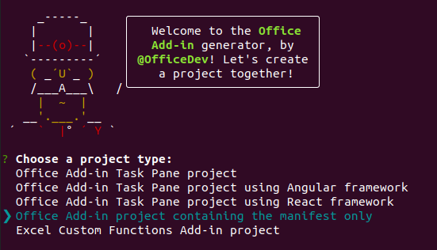

# <a name="use-vue-to-build-an-excel-task-pane-add-in"></a>使用 Vue 生成 Excel 任务窗格加载项

本文将逐步介绍如何使用 Vue 和 Excel JavaScript API 生成 Excel 任务加载项。

## <a name="prerequisites"></a>先决条件

[!include[Set up requirements](../includes/set-up-dev-environment-beforehand.md)]
[!include[Yeoman generator prerequisites](../includes/quickstart-yo-prerequisites.md)]

- 全局安装 [Vue CLI](https://cli.vuejs.org/)。 在终端运行以下命令。

  ```command&nbsp;line
  npm install -g @vue/cli
  ```

## <a name="generate-a-new-vue-app"></a>生成新 Vue 应用

若要生成新的 Vue 应用，请使用 Vue CLI。

```command&nbsp;line
vue create my-add-in
```

然后，选择`Default` 预设"Vue 3"（如果愿意，请选择"Vue 2"）。

## <a name="generate-the-manifest-file"></a>生成清单文件

每个加载项都需要定义自己设置和功能的清单文件。

1. 转到应用程序文件夹。

    ```command&nbsp;line
    cd my-add-in
    ```

1. 使用 Yeoman 生成器生成加载项清单文件。

    ```command&nbsp;line
    yo office
    ```

    > [!NOTE]
    > 运行该`yo office`命令时，可能会收到有关 Yeoman 和 Office 加载项 CLI 工具的数据收集策略的提示。 根据需要，使用提供的信息来响应提示。 如果在对第二条提示的响应中选择“**退出**”，则在准备好创建加载项项目时，需要再次运行 `yo office` 命令。

    出现提示时，请提供以下信息以创建加载项项目。

    - **选择项目类型:** `Office Add-in project containing the manifest only`
    - **要如何命名加载项?** `My Office Add-in`
    - **要支持哪一个 Office 客户端应用程序?** `Excel`

    

完成后，向导创建一个 **My Office 加载项** 文件夹，其中包含一个 **manifest.xml** 文件。 使用该清单旁加载和测试加载项。

> [!TIP]
> 创建加载项项目后，可忽略 Yeoman 生成器提供的 *后续步骤* 指南。 本文中的分步说明提供了完成本教程所需的全部指南。

## <a name="secure-the-app"></a>保护应用

[!include[HTTPS guidance](../includes/https-guidance.md)]

1. 为应用启用 HTTPS。 在 Vue 项目的根文件夹中，创建包含以下内容的 **vue.config.js** 文件。

    ```js
    var fs = require("fs");
    var path = require("path");
    var homedir = require('os').homedir()
  
    module.exports = {
      devServer: {
        port: 3000,
        https: {
          key: fs.readFileSync(path.resolve(`${homedir}/.office-addin-dev-certs/localhost.key`)),
          cert: fs.readFileSync(path.resolve(`${homedir}/.office-addin-dev-certs/localhost.crt`)),
          ca: fs.readFileSync(path.resolve(`${homedir}/.office-addin-dev-certs/ca.crt`)),
         }
       }
    }
    ```

1. 安装加载项的证书。

   ```command&nbsp;line
   npx office-addin-dev-certs install
   ```

## <a name="explore-the-project"></a>浏览项目

使用 Yeoman 生成器创建的加载项项目，包含适合于基础任务窗格加载项的示例代码。 如果想要浏览加载项项目的主要组件，请在代码编辑器中打开项目并检查下面列出的文件。 准备好试用加载项时，请转至下一部分。

- 项目根目录中的 **manifest.xml** 文件定义加载项的设置和功能。 有关 **manifest.xml** 文件的详细信息，请参阅 [ Office 外接程序 XML 清单](../develop/add-in-manifests.md)。
- **./src/App.vue** 文件包含任务窗格的 HTML 标记、应用于任务窗格中内容的 CSS，以及有助于在任务窗格和 Excel 之间进行交互的 Office JavaScript API 代码。

## <a name="update-the-app"></a>更新应用

1. 打开 **./public/index.html** 文件，并在`</head>`标记前面添加以下`<script>`标记。

   ```html
   <script src="https://appsforoffice.microsoft.com/lib/1/hosted/office.js"></script>
   ```

1. 打开 **manifest.xml**，并在 **\<Resources\>** 标记中查找`<bt:Urls>`标记。 找到 ID 为`Taskpane.Url`的`<bt:Url>`标记，并更新其`DefaultValue`属性。 新`DefaultValue`是`https://localhost:3000/index.html`。 整个更新后的标记应与以下行匹配。

   ```html
   <bt:Url id="Taskpane.Url" DefaultValue="https://localhost:3000/index.html" />
   ```

1. 打开 **./src/main.js** 并将内容替换为以下代码。

   ```js
   import { createApp } from 'vue'
   import App from './App.vue'

   window.Office.onReady(() => {
       createApp(App).mount('#app');
   });
   ```

1. 打开 **./src/App.vue** ，并将文件内容替换为以下代码。

   ```html
   <template>
     <div id="app">
       <div class="content">
         <div class="content-header">
           <div class="padding">
             <h1>Welcome</h1>
           </div>
         </div>
         <div class="content-main">
           <div class="padding">
             <p>
               Choose the button below to set the color of the selected range to
               green.
             </p>
             <br />
             <h3>Try it out</h3>
             <button @click="onSetColor">Set color</button>
           </div>
         </div>
       </div>
     </div>
   </template>

   <script>
     export default {
       name: 'App',
       methods: {
         onSetColor() {
           window.Excel.run(async context => {
             const range = context.workbook.getSelectedRange();
             range.format.fill.color = 'green';
             await context.sync();
           });
         }
       }
     };
   </script>

   <style>
     .content-header {
       background: #2a8dd4;
       color: #fff;
       position: absolute;
       top: 0;
       left: 0;
       width: 100%;
       height: 80px;
       overflow: hidden;
     }

     .content-main {
       background: #fff;
       position: fixed;
       top: 80px;
       left: 0;
       right: 0;
       bottom: 0;
       overflow: auto;
     }

     .padding {
       padding: 15px;
     }
   </style>
   ```

## <a name="start-the-dev-server"></a>启动开发人员服务器

1. 启动开发人员服务器。

   ```command&nbsp;line
   npm run serve
   ```

1. 在 Web 浏览器中，导航到 `https://localhost:3000`（请注意 `https`）。 如果 `https://localhost:3000` 上的页面空白，并且没有任何证书错误，则表示正常工作。 Office 初始化后装载 Vue 应用，因此它仅显示 Excel 环境中的内容。

## <a name="try-it-out"></a>试用

1. 在 Excel 中运行加载项并旁加载加载项。 请按照所用平台对应的说明操作：

   - Windows：[在 Windows 上旁加载 Office 加载项](../testing/create-a-network-shared-folder-catalog-for-task-pane-and-content-add-ins.md)
   - Web 浏览器：[在 Office 网页版中旁加载 Office 加载项](../testing/sideload-office-add-ins-for-testing.md#sideload-an-office-add-in-in-office-on-the-web)
   - iPad 和 Mac：[在 iPad 和 Mac 上旁加载 Office 加载项](../testing/sideload-an-office-add-in-on-ipad-and-mac.md)

1. 在 Excel 中打开加载项任务窗格。 在“**主页**”选项卡上，选择“**显示任务窗格**”按钮。

   

1. 选择工作表中的任何一系列单元格。

1. 将选定区域的颜色设置为绿色。 在外接程序的任务窗格中，选择“**设置颜色**”按钮。

   

## <a name="next-steps"></a>后续步骤

恭喜！已使用 Vue 成功创建 Excel 任务窗格！接下来，请详细了解 Excel 加载项功能，并跟着 Excel 加载项教程一起操作，以生成更复杂的加载项。

> [!div class="nextstepaction"]
> [Excel 加载项教程](../tutorials/excel-tutorial.md)

## <a name="see-also"></a>另请参阅

- [Office 加载项平台概述](../overview/office-add-ins.md)
- [开发 Office 加载项](../develop/develop-overview.md)
- [Excel 加载项中的 Word JavaScript 对象模型](../excel/excel-add-ins-core-concepts.md)
- [Excel 加载项代码示例](https://developer.microsoft.com/office/gallery/?filterBy=Samples,Excel)
- [Excel JavaScript API 参考](../reference/overview/excel-add-ins-reference-overview.md)
- [使用 Visual Studio Code 发布](../publish/publish-add-in-vs-code.md#using-visual-studio-code-to-publish)