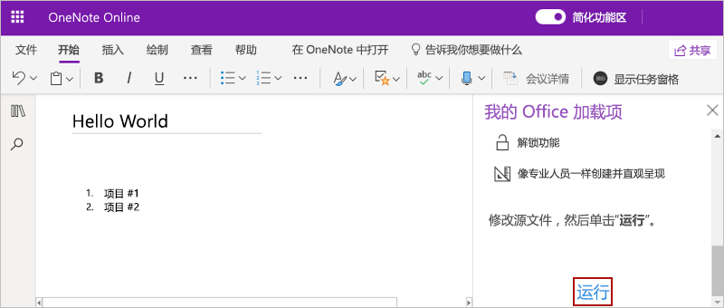

# <a name="build-your-first-onenote-task-pane-add-in"></a>生成首个 OneNote 任务窗格加载项

本文将逐步介绍如何生成 OneNote 任务窗格加载项。

## <a name="prerequisites"></a>先决条件

[!include[Set up requirements](../includes/set-up-dev-environment-beforehand.md)]
[!include[Yeoman generator prerequisites](../includes/quickstart-yo-prerequisites.md)]

## <a name="create-the-add-in-project"></a>创建加载项项目

[!include[Yeoman generator create project guidance](../includes/yo-office-command-guidance.md)]

- **选择项目类型:** `Office Add-in Task Pane project`
- **选择脚本类型:** `Javascript`
- **要如何命名加载项?** `My Office Add-in`
- **要支持哪一个 Office 客户端应用程序?** `OneNote`


完成此向导后，生成器会创建项目，并安装支持的 Node 组件。

[!include[Yeoman generator next steps](../includes/yo-office-next-steps.md)]

## <a name="explore-the-project"></a>浏览项目

使用 Yeoman 生成器创建的加载项项目包含适合于基础任务窗格加载项的示例代码。

- 项目根目录中的 **./manifest.xml** 文件定义加载项的设置和功能。
- **./src/taskpane/taskpane.html** 文件包含组成任务窗格的 HTML。
- **./src/taskpane/taskpane.css** 文件包含应用于任务窗格中的内容的 CSS。
- **./src/taskpane/taskpane.js** 文件包含用于加快任务窗格与 Office 客户端应用程序之间的交互的 Office JavaScript API 代码。

## <a name="update-the-code"></a>更新代码

在代码编辑器中，打开文件 **./src/taskpane/taskpane.js** 并在 `run` 函数中添加以下代码。 此代码使用 OneNote JavaScript API 设置页面标题并在页面正文添加大纲。

```js
try {
    await OneNote.run(async context => {

        // Get the current page.
        var page = context.application.getActivePage();

        // Queue a command to set the page title.
        page.title = "Hello World";

        // Queue a command to add an outline to the page.
        var html = "<p><ol><li>Item #1</li><li>Item #2</li></ol></p>";
        page.addOutline(40, 90, html);

        // Run the queued commands, and return a promise to indicate task completion.
        return context.sync();
    });
} catch (error) {
    console.log("Error: " + error);
}
```

## <a name="try-it-out"></a>试用

1. 导航到项目的根文件夹。

    ```command&nbsp;line
    cd "My Office Add-in"
    ```

1. 启动本地 Web 服务器并旁加载你的加载项。

    > [!NOTE]
    > Office 加载项应使用 HTTPS，而不是 HTTP（即便是在开发时也是如此）。 如果系统在运行以下命令之一后提示你安装证书，请接受提示以安装 Yeoman 生成器提供的证书。 你可能还必须以管理员身份运行命令提示符或终端才能进行更改。

    > [!TIP]
    > 如果在 Mac 上测试加载项，请先运行以下命令，然后再继续。 运行此命令时，本地 Web 服务器将启动。
    >
    > ```command&nbsp;line
    > npm run dev-server
    > ```

    在项目的根目录中运行以下命令。 如果你运行此命令，本地 Web 服务器将启动（如果尚未运行的话）。

    ```command&nbsp;line
    npm run start:web
    ```

1. 在 [OneNote 网页版](https://www.onenote.com/notebooks)中，打开笔记本并新建页面。

1. 依次选择“插入”>“Office 加载项”，打开“Office 加载项”对话框。

    - 如果使用使用者帐户登录，请依次选择“我的加载项”选项卡和“上传我的加载项”。

    - 如果使用工作或教育帐户登录，请依次选择“**我的组织**”选项卡和“**上传我的加载项**”。

    下图展示了使用者笔记本的“**我的加载项**”选项卡。

    

1. 在“**上传加载项**”对话框中，转到项目文件夹中的 manifest.xml，然后选择“**上传**”。

1. 在“**开始**”选项卡上，选择位于功能区的“**显示任务窗格**”按钮。 该加载项窗格在 OneNote 页旁的 iFrame 中打开。

1. 在任务窗格底部，选择“**运行**”链接以设置页面标题并在页面正文中添加大纲。

    

## <a name="next-steps"></a>后续步骤

恭喜！已成功创建 OneNote 任务窗格加载项！ 接下来，请详细了解与生成 OneNote 加载项有关的核心概念。

> [!div class="nextstepaction"]
> [OneNote JavaScript API 编程概述](../onenote/onenote-add-ins-programming-overview.md)

## <a name="see-also"></a>另请参阅

- [Office 加载项平台概述](../overview/office-add-ins.md)
- [开发 Office 加载项](../develop/develop-overview.md)
- [OneNote JavaScript API 编程概述](../onenote/onenote-add-ins-programming-overview.md)
- [OneNote JavaScript API 参考](../reference/overview/onenote-add-ins-javascript-reference.md)
- [Rubric Grader 示例](https://github.com/OfficeDev/OneNote-Add-in-Rubric-Grader)
