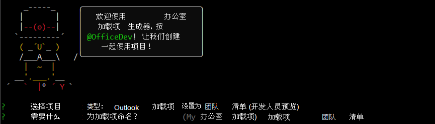

# <a name="build-an-outlook-add-in-with-a-teams-manifest-preview"></a>使用 Teams 清单（预览版）生成 Outlook 加载项

在本文中，你将演练生成 Outlook 任务窗格加载项的过程，此加载项显示所选邮件的属性，在阅读窗格中触发通知，并将文本插入撰写窗格上的邮件中。 此加载项将使用 Teams 扩展（如自定义选项卡和消息传递扩展）使用的 JSON 格式清单预览版本。 有关此清单的详细信息，请参阅 [Office 加载项的 Teams 清单（预览版）](../develop/json-manifest-overview.md)。

> [!NOTE]
> 新清单提供预览版，可能会根据反馈进行更改。 我们鼓励经验丰富的加载项开发人员进行试验。 预览清单不应用于生产加载项。

预览版仅在 Windows 上的 Microsoft 365 订阅 Office 上受支持。

> [!TIP]
> 如果要使用 XML 清单生成 Outlook 加载项，请参阅[生成第一个 Outlook 加载项](outlook-quickstart.md)。

## <a name="create-the-add-in"></a>创建加载项

可以使用[适用于 Office 加载项的 Yeoman 生成器](../develop/yeoman-generator-overview.md)创建具有 JSON 清单的 Office 加载项。Yeoman 生成器创建一个 Node.js 项目，可以使用 Visual Studio Code 或任何其他编辑器进行管理。

### <a name="prerequisites"></a>先决条件

[!include[Set up requirements](../includes/set-up-dev-environment-beforehand.md)]

- 适用于 Windows 的 [.NET 运行时](https://dotnet.microsoft.com/download/dotnet/6.0/runtime)。 预览版中使用的工具之一在 .NET 上运行。

[!INCLUDE [Yeoman generator prerequisites](../includes/quickstart-yo-prerequisites.md)]

- [Visual Studio Code (VS Code)](https://code.visualstudio.com/) 或首选代码编辑器

- Windows 版 Outlook（已连接到 Microsoft 365 帐户）

### <a name="create-the-add-in-project"></a>创建加载项项目

1. [!include[Yeoman generator create project guidance](../includes/yo-office-command-guidance.md)]

    - **选择项目类型** - `Outlook Add-in with Teams Manifest (Developer preview)`

    - **要如何命名加载项?** - `Add-in with Teams Manifest`

     

    > [!NOTE]
    > 对于此预览版，加载项名称不能超过 30 个字符。 
    
    完成此向导后，生成器会创建项目，并安装支持的 Node 组件。

    [!include[Yeoman generator next steps](../includes/yo-office-next-steps.md)]

1. 导航到 Web 应用程序项目的根文件夹。

    ```command&nbsp;line
    cd "Add-in with Teams Manifest"
    ```

### <a name="explore-the-project"></a>浏览项目

使用 Yeoman 生成器创建的加载项项目包含适合于基础任务窗格加载项的示例代码。

- 项目根目录中的 **./manifest/manifest.json** 文件定义加载项的设置和功能。
- **./src/taskpane/taskpane.html** 文件包含组成任务窗格的 HTML。
- **./src/taskpane/taskpane.css** 文件包含应用于任务窗格中的内容的 CSS。
- **./src/taskpane/taskpane.ts** 文件包含调用 Office JavaScript 库以加快任务窗格与 Outlook 之间交互的代码。
- **./src/command/command.html** 文件将在生成时由 WebPack 编辑，以插入加载从 command.ts 文件所转译 JavaScript 文件的 HTML `<script>` 标记。
- **./src/command/command.ts** 文件起初几乎没有代码。 本文稍后将向其添加调用 Office JavaScript 库并在选择自定义功能区按钮时执行的代码。

### <a name="update-the-code"></a>更新代码

1. 在 VS Code 或首选代码编辑器中打开项目。

    > [!TIP]
    > 在 Windows 上，可通过命令行导航到项目的根目录，然后输入 `code .`在 VS Code 中打开该文件夹。 

1. 打开文件 **./src/taskpane/taskpane.html** 并将整个 **\<main\>** 元素（在 **\<body\>** 元素中）替换为以下标记。 此新标记将添加标签，其中 **./src/taskpane/taskpane.ts** 中的脚本将写入数据。

    ```html
    <main id="app-body" class="ms-welcome__main" style="display: none;">
        <h2 class="ms-font-xl"> Discover what Office Add-ins can do for you today! </h2>
        <p><label id="item-subject"></label></p>
        <div role="button" id="run" class="ms-welcome__action ms-Button ms-Button--hero ms-font-xl">
            <span class="ms-Button-label">Run</span>
        </div>
    </main>
    ```

1. 在代码编辑器中，打开文件 **./src/taskpane/taskpane.ts** 并在 **run** 函数中添加以下代码。 此代码使用 Office JavaScript API 获取当前邮件的引用并将其 **subject** 属性值写入任务窗格。

    ```typescript
    // Get a reference to the current message.
    let item = Office.context.mailbox.item;

    // Write a message property value to the task pane.
    document.getElementById("item-subject").innerHTML = "<b>Subject:</b> <br/>" + item.subject;
    ```

### <a name="try-it-out"></a>试用

[!INCLUDE [alert use https](../includes/alert-use-https.md)]

1. 在项目的根目录中运行以下命令。 运行此命令时，本地 Web 服务器将启动，并且将[旁加载](../outlook/sideload-outlook-add-ins-for-testing.md)加载项。 

    ```command&nbsp;line
    npm start
    ```

1. 使用 Outlook 中的经典功能区。 这些说明的其余部分假定存在此情况。  

1. 在[阅读窗格](https://support.microsoft.com/office/2fd687ed-7fc4-4ae3-8eab-9f9b8c6d53f0)中查看邮件，或在其自己的窗口中打开邮件。 名为 **Contoso 加载项** 的新控件组将显示在 Outlook **开始** 选项卡（如果在新窗口中打开邮件，则显示在 **邮件** 选项卡上）。 该组有一个名为“**显示任务窗格**”的按钮和一个名为“**执行操作**”的按钮。

    > [!NOTE]
    > 如果新组不存在，则不会自动旁加载加载项。 按照[手动旁加载 - Windows 或 Mac 上的 Outlook 2016 或更高版本](../outlook/sideload-outlook-add-ins-for-testing.md#outlook-2016-or-later-on-windows-or-mac)中的说明 ，在 Outlook 中手动旁加载加载项。 系统提示上传清单文件时，请使用文件 `C:\Users\{your_user_name}\AppData\Local\Temp\manifest.xml`。 文件的扩展名为 `.xml`，因为在预览期间，JSON 格式的清单将转换为 XML 清单，然后旁加载。

1. 选择“**执行操作**”按钮。 它[执行一个命令](../develop/create-addin-commands.md?branch=outlook-json-manifest#step-5-add-the-functionfile-element) ，在消息标头底部的邮件正文正上方生成一个较小的信息通知。

1. 当系统提示“**Web 视图在加载时停止**”对话框时，请选择“**确定**”。

    [!INCLUDE [Cancelling the WebView Stop On Load dialog box](../includes/webview-stop-on-load-cancel-dialog.md)]

1. 若要打开加载项任务窗格，请选择“**显示任务窗格**”。

    > [!NOTE]
    > 如果在任务窗格中收到错误“我们无法从本地主机打开此加载项”，请按照[疑难解答文章中](/office/troubleshoot/office-suite-issues/cannot-open-add-in-from-localhost)中所述步骤进行操作。

1. 当系统提示“**Web 视图在加载时停止**”对话框时，请选择“**确定**”。

    [!INCLUDE [Cancelling the WebView Stop On Load dialog box](../includes/webview-stop-on-load-cancel-dialog.md)]

1. 滚动至任务窗格的底部并选择 **Run** 链接，将邮件主题复制至任务窗格中。

1. 使用以下命令结束调试会话：

    ```command&nbsp;line
    npm stop
    ```

    > [!IMPORTANT]
    > 关闭 Web 服务器窗口并不能可靠地关闭 Web 服务器。 如果未正确关闭，则在更改并重新运行项目时会遇到问题。

1. 关闭 Outlook 的所有实例。

## <a name="add-a-custom-button-to-the-ribbon"></a>向功能区添加自定义按钮

将自定义按钮添加到功能区，用于将文本插入到邮件正文中。

1. 在 VS Code 或首选代码编辑器中打开项目。

    > [!TIP]
    > 在 Windows 上，可通过命令行导航到项目的根目录，然后输入 `code .`在 VS Code 中打开该文件夹。 

1. 在代码编辑器中，打开文件 **./src/command/command.ts**，并将以下代码添加到文件末尾。 此函数将 `Hello World` 插入到邮件正文中的光标点。

    ```typescript
    function insertHelloWorld(event: Office.AddinCommands.Event) {
        Office.context.mailbox.item.body.setSelectedDataAsync("Hello World", {coercionType: Office.CoercionType.Text});

        // Be sure to indicate when the add-in command function is complete
        event.completed();
    }

    // Register the function with Office
    Office.actions.associate("insertHelloWorld", insertHelloWorld);
    ```

1. 打开文件 **./manifest/manifest.json**。

    > [!NOTE]
    > 引用嵌套 JSON 属性时，本文使用点表示法。 引用数组中的项时，将使用此项括号中的从零开始的编号。 

1. 如果写入邮件，需要提高加载项的权限。 滚动到属性 `authorization.permissions.resourceSpecific[0].name` 并将值更改为 `MailboxItem.ReadWrite.User`。

1. 当加载项命令运行代码而不是打开任务窗格时，它必须在与运行任务窗格代码的嵌入式 Web 视图分开的运行时中运行代码。 因此，清单必须指定其他运行时。 滚动到属性 `extension.runtimes` 并将以下对象添加到 `runtimes` 数组。 请务必在数组中已有的对象之后放置逗号。 关于此标记，请注意以下几点。

    - `actions[0].id` 属性的值必须与添加到 **commands.ts** 文件的函数名称完全相同，在此情况中为 `insertHelloWorld`。 在后面的步骤中，将按此 ID 引用项目。

    ```json
    {
        "id": "ComposeCommandsRuntime",
        "type": "general",
        "code": {
            "page": "https://localhost:3000/commands.html",
            "script": "https://localhost:3000/commands.js"
        },
        "lifetime": "short",
        "actions": [
            {
                "id": "insertHelloWorld",
                "type": "executeFunction",
                "displayName": "insertHelloWorld"
            }
        ]
    }
    ```

1. 用户正在阅读电子邮件时，将显示“**显示任务窗格**”按钮，但仅当用户撰写新电子邮件（或答复电子邮件）时，才应显示用于添加文本的按钮。 因此，清单必须指定新的功能区对象。 滚动到属性 `extension.ribbons` 并将以下对象添加到 `ribbons` 数组。 请务必在数组中已有的对象之后放置逗号。 关于此标记，请注意以下几点：

    - `contexts` 数组中的唯一值是“mailCompose”，因此当在撰写（或答复）窗口中时，此按钮将显示，而不是在显示“**显示任务窗格**”和“**执行操作**”按钮的邮件阅读窗口中时。 将此值与 `contexts` 现有功能区对象中的数组进行比较，其值为 `["mailRead"]`。
    - `tabs[0].groups[0].controls[0].actionId` 的值必须与在前面的步骤中创建的运行时对象中 `actions[0].id` 属性的值完全相同。

    ```json
    {
        "contexts": ["mailCompose"],
        "tabs": [
            {
                "builtInTabId": "TabDefault",
                "groups": [
                    {
                        "id": "msgWriteGroup",
                        "label": "Contoso Add-in",
                        "icons": [
                            { "size": 16, "file": "https://localhost:3000/assets/icon-16.png" },
                            { "size": 32, "file": "https://localhost:3000/assets/icon-32.png" },
                            { "size": 80, "file": "https://localhost:3000/assets/icon-80.png" }
                        ],
                        "controls": [
                            {
                                "id": "HelloWorldButton",
                                "type": "button",
                                "label": "Insert text",
                                "icons": [
                                    { "size": 16, "file": "https://localhost:3000/assets/icon-16.png" },
                                    { "size": 32, "file": "https://localhost:3000/assets/icon-32.png" },
                                    { "size": 80, "file": "https://localhost:3000/assets/icon-80.png" }
                                ],
                                "supertip": {
                                    "title": "Insert text",
                                    "description": "Inserts some text."
                                },
                                "actionId": "insertHelloWorld"
                            }                  
                        ]
                    }
                ]
            }
        ]
    }
    ```

### <a name="try-out-the-updated-add-in"></a>试用更新后的加载项

1. 在项目的根目录中运行以下命令。

    ```command&nbsp;line
    npm start
    ```

1. 在 Outlook 中，打开一个新邮件窗口（或答复现有邮件）。 名为 **Contoso 加载程序** 的新控件组将显示在 Outlook **邮件** 选项卡上。该组有一个名为 **插入文本** 的按钮。

    > [!NOTE]
    > 如果新组不存在，则不会自动旁加载加载项。 按照[手动旁加载 - Windows 或 Mac 上的 Outlook 2016 或更高版本](../outlook/sideload-outlook-add-ins-for-testing.md#outlook-2016-or-later-on-windows-or-mac)中的说明 ，在 Outlook 中手动旁加载加载项。 系统提示上传清单文件时，请使用该文件 `C:\Users\{your_user_name}\AppData\Local\Temp\manifest.xml`。 文件的扩展名为 `.xml`，因为在预览期间，JSON 格式的清单将转换为 XML 清单，然后旁加载。

1. 将光标放在邮件正文中的任意位置，然后选择 **插入文本** 按钮。

1. 当系统提示“**Web 视图在加载时停止**”对话框时，请选择“**确定**”。

    [!INCLUDE [Cancelling the WebView Stop On Load dialog box](../includes/webview-stop-on-load-cancel-dialog.md)]

    短语 "Hello World" 将插入光标处。

1. 使用以下命令结束调试会话：

    ```command&nbsp;line
    npm stop
    ```

## <a name="see-also"></a>另请参阅

- [适用于 Office 加载项的 Teams 清单（预览版）](../develop/json-manifest-overview.md)
- [使用Visual Studio Code发布](../publish/publish-add-in-vs-code.md#using-visual-studio-code-to-publish)