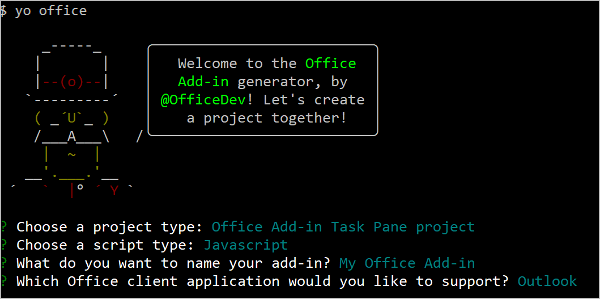
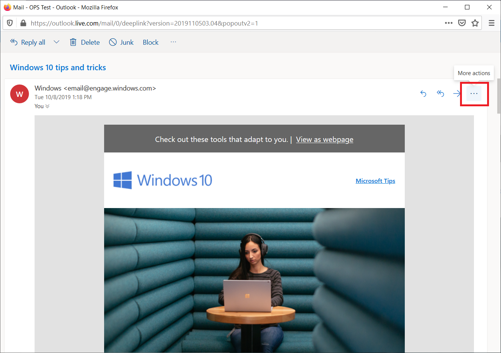

# <a name="build-your-first-outlook-add-in"></a>生成首个 Outlook 加载项

本文将逐步介绍如何生成显示选定邮件的至少一个属性的 Outlook 任务窗格加载项。

## <a name="create-the-add-in"></a>创建加载项

可以使用[适用于 Office 加载项的 Yeoman 生成器](https://github.com/OfficeDev/generator-office)或 Visual Studio 创建 Office 加载项。 Yeoman 生成器将创建一个可通过 Visual Studio Code 或任何其他编辑器管理的 Node.js 项目，而 Visual Studio 将创建一个 Visual Studio 解决方案。  选择适合于想要使用的方法的选项卡，然后按照说明创建加载项并在本地测试。

# <a name="yeoman-generator"></a>[Yeoman 生成器](#tab/yeomangenerator)

### <a name="prerequisites"></a>先决条件

[!include[Set up requirements](../includes/set-up-dev-environment-beforehand.md)]

- [Node.js](https://nodejs.org/)（最新的 [LTS](https://nodejs.org/about/releases) 版本）

- 最新版本的 [Yeoman](https://github.com/yeoman/yo) 和[适用于 Office 外接程序的 Yeoman 生成器](https://github.com/OfficeDev/generator-office)。若要全局安装这些工具，请从命令提示符处运行以下命令：

    ```command&nbsp;line
    npm install -g yo generator-office
    ```

    > [!NOTE]
    > 即便先前已安装了 Yeoman 生成器，我们还是建议你通过 npm 将包更新为最新版本。

### <a name="create-the-add-in-project"></a>创建加载项项目

1. [!include[Yeoman generator create project guidance](../includes/yo-office-command-guidance.md)]

    - **选择项目类型** - `Office Add-in Task Pane project`

    - **选择脚本类型** - `Javascript`

    - **要如何命名加载项?** - `My Office Add-in`

    - **要支持哪一个 Office 客户端应用程序?** - `Outlook`

    
    
    完成此向导后，生成器会创建项目，并安装支持的 Node 组件。

    [!include[Yeoman generator next steps](../includes/yo-office-next-steps.md)]

1. 导航到 Web 应用程序项目的根文件夹。

    ```command&nbsp;line
    cd "My Office Add-in"
    ```

### <a name="explore-the-project"></a>浏览项目

使用 Yeoman 生成器创建的加载项项目包含适合于基础任务窗格加载项的示例代码。 

- 项目根目录中的 **./manifest.xml** 文件定义加载项的设置和功能。
- **./src/taskpane/taskpane.html** 文件包含组成任务窗格的 HTML。
- **./src/taskpane/taskpane.css** 文件包含应用于任务窗格中的内容的 CSS。
- **./src/taskpane/taskpane.js** 文件包含用于加快任务窗格与 Outlook 之间的交互的 Office JavaScript API 代码。

### <a name="update-the-code"></a>更新代码

1. 在代码编辑器中，打开文件 **./src/taskpane/taskpane.html** 并将整个 `<main>` 元素（位于 `<body>` 元素中）替换为以下标记。 此新标记将添加标签，其中 **./src/taskpane/taskpane.js** 中的脚本将写入数据。

    ```html
    <main id="app-body" class="ms-welcome__main" style="display: none;">
        <h2 class="ms-font-xl"> Discover what Office Add-ins can do for you today! </h2>
        <p><label id="item-subject"></label></p>
        <div role="button" id="run" class="ms-welcome__action ms-Button ms-Button--hero ms-font-xl">
            <span class="ms-Button-label">Run</span>
        </div>
    </main>
    ```

1. 在代码编辑器中，打开文件 **./src/taskpane/taskpane.js** 并在 `run` 函数中添加以下代码。 此代码使用 Office JavaScript API 获取当前邮件的引用并将其 `subject` 属性值写入任务窗格。

    ```js
    // Get a reference to the current message
    var item = Office.context.mailbox.item;

    // Write message property value to the task pane
    document.getElementById("item-subject").innerHTML = "<b>Subject:</b> <br/>" + item.subject;
    ```

### <a name="try-it-out"></a>试用

> [!NOTE]
> Office 加载项应使用 HTTPS，而不是 HTTP（即便是在开发时也是如此）。 如果系统在运行以下命令后提示你安装证书，请接受提示以安装 Yeoman 生成器提供的证书。

1. 在项目的根目录中运行以下命令。 运行此命令时，本地 Web 服务器将启动（如果尚未运行）。

    ```command&nbsp;line
    npm run dev-server
    ```

1. 按照[旁加载 Outlook 加载项以供测试](../outlook/sideload-outlook-add-ins-for-testing.md)中的说明操作，旁加载加载项。

1. 在 Outlook 中，选择或打开邮件。

1. 选择“**主页**”选项卡（或“**邮件**”选项卡，如果在新窗口中打开了邮件），然后选择功能区的“**显示任务窗格**”按钮以打开加载项任务窗格。

    

    > [!NOTE]
    > 如果在任务窗格中收到错误“我们无法从本地主机打开此加载项”，请按照[疑难解答文章中](/office/troubleshoot/office-suite-issues/cannot-open-add-in-from-localhost)中所述步骤进行操作。

1. 滚动至任务窗格的底部并选择“**运行**”链接，将邮件主题写入任务窗格。

    

    

### <a name="next-steps"></a>后续步骤

祝贺！已成功创建首个 Outlook 任务窗格加载项！ 接下来，将继续学习 [Outlook 加载项教程](../tutorials/outlook-tutorial.md)，详细了解 Outlook 加载项的功能，以及如何生成更复杂的加载项。

# <a name="visual-studio"></a>[Visual Studio](#tab/visualstudio)

### <a name="prerequisites"></a>先决条件

- 安装了 **Office/SharePoint 开发**工作负载的 [Visual Studio 2019](https://www.visualstudio.com/vs/)

    > [!NOTE]
    > 如果之前已安装 Visual Studio 2019，请[使用 Visual Studio 安装程序](/visualstudio/install/modify-visual-studio)，以确保安装 **Office/SharePoint 开发**工作负载。

- Office 365

    > [!NOTE]
    > 如果没有 Microsoft 365 订阅，可以通过注册 [Microsoft 365 开发人员计划](https://developer.microsoft.com/office/dev-program)获取一个免费订阅。

### <a name="create-the-add-in-project"></a>创建加载项项目

1. 在 Visual Studio 菜单栏中，依次选择“文件”**** > “新建”**** > “项目”****。

1. 在“Visual C#”**** 或“Visual Basic”**** 下的项目类型列表中，展开“Office/SharePoint”****，选择“加载项”****，然后选择“Outlook Web 加载项”**** 作为项目类型。

1. 命名此项目，再选择“确定”****。

1. 此时，Visual Studio 创建解决方案，且它的两个项目显示在“解决方案资源管理器”**** 中。 **MessageRead.html** 文件在 Visual Studio 中打开。

### <a name="explore-the-visual-studio-solution"></a>浏览 Visual Studio 解决方案

在用户完成向导后，Visual Studio 会创建一个包含两个项目的解决方案。

|**项目**|**说明**|
|:-----|:-----|
|加载项项目|仅包含 XML 清单文件，内含描述加载项的所有设置。 这些设置有助于 Office 主机确定应在何时激活加载项，以及应在哪里显示加载项。 Visual Studio 生成了此文件的内容，以便于用户能够立即运行项目并使用外接程序。 可以通过修改 XML 文件随时更改这些设置。|
|Web 应用项目|包含加载项的内容页，包括开发 Office 感知 HTML 和 JavaScript 页面所需的全部文件和文件引用。开发加载项时，Visual Studio 在本地 IIS 服务器上托管 Web 应用。准备好发布加载项后，需要将此 Web 应用项目部署到 Web 服务器。|

### <a name="update-the-code"></a>更新代码

1. **MessageRead.html** 指定将在加载项的任务窗格中呈现的 HTML。 在 **MessageRead.html** 中，将 `<body>` 元素替换为以下标记，并保存文件。
 
    ```HTML
    <body class="ms-font-m ms-welcome">
        <div class="ms-Fabric content-main">
            <h1 class="ms-font-xxl">Message properties</h1>
            <table class="ms-Table ms-Table--selectable">
                <thead>
                    <tr>
                        <th>Property</th>
                        <th>Value</th>
                    </tr>
                </thead>
                <tbody>
                    <tr>
                        <td><strong>Id</strong></td>
                        <td class="prop-val"><code><label id="item-id"></label></code></td>
                    </tr>
                    <tr>
                        <td><strong>Subject</strong></td>
                        <td class="prop-val"><code><label id="item-subject"></label></code></td>
                    </tr>
                    <tr>
                        <td><strong>Message Id</strong></td>
                        <td class="prop-val"><code><label id="item-internetMessageId"></label></code></td>
                    </tr>
                    <tr>
                        <td><strong>From</strong></td>
                        <td class="prop-val"><code><label id="item-from"></label></code></td>
                    </tr>
                </tbody>
            </table>
        </div>
    </body>
    ```

1. 打开 Web 应用项目的根文件夹中的文件“MessageRead.js”****。 此文件指定的是加载项脚本。 将整个内容替换为以下代码，并保存文件。

    ```js
    'use strict';

    (function () {

        Office.onReady(function () {
            // Office is ready
            $(document).ready(function () {
                // The document is ready
                loadItemProps(Office.context.mailbox.item);
            });
        });

        function loadItemProps(item) {
            // Write message property values to the task pane
            $('#item-id').text(item.itemId);
            $('#item-subject').text(item.subject);
            $('#item-internetMessageId').text(item.internetMessageId);
            $('#item-from').html(item.from.displayName + " &lt;" + item.from.emailAddress + "&gt;");
        }
    })();
    ```

1. 打开 Web 应用项目的根文件夹中的文件“MessageRead.css”****。 此文件指定的是加载项自定义样式。 将整个内容替换为以下代码，并保存文件。

    ```CSS
    html,
    body {
        width: 100%;
        height: 100%;
        margin: 0;
        padding: 0;
    }

    td.prop-val {
        word-break: break-all;
    }

    .content-main {
        margin: 10px;
    }
    ```

### <a name="update-the-manifest"></a>更新清单

1. 打开加载项项目中的 XML 清单文件。 此文件定义的是加载项设置和功能。

1. `ProviderName` 元素具有占位符值。 将其替换为你的姓名。

1. `DisplayName` 元素的 `DefaultValue` 属性具有占位符。 将其替换为 `My Office Add-in`。

1. `Description` 元素的 `DefaultValue` 属性具有占位符。 将其替换为 `My First Outlook add-in`。

1. 保存文件。

    ```xml
    ...
    <ProviderName>John Doe</ProviderName>
    <DefaultLocale>en-US</DefaultLocale>
    <!-- The display name of your add-in. Used on the store and various places of the Office UI such as the add-ins dialog. -->
    <DisplayName DefaultValue="My Office Add-in" />
    <Description DefaultValue="My First Outlook add-in"/>
    ...
    ```

### <a name="try-it-out"></a>试用

1. 在 Visual Studio 中，按 F5 或选择“开始”**** 按钮测试新建的 Outlook 加载项。 加载项本地托管在 IIS 上。

1. 在“连接到 Exchange 电子邮件帐户”**** 对话框中，输入你的 [Microsoft 帐户](https://account.microsoft.com/account)的电子邮件地址和密码，然后选择“连接”****。 如果 Outlook.com 登录页是在浏览器中打开，请使用先前输入的相同凭据登录电子邮件帐户。

    > [!NOTE]
    > 如果“**连接到 Exchange 电子邮件帐户**”对话框重复提示你登录，则可能已对你 Microsoft 365 租户上的帐户禁用基本身份验证。 若要测试此加载项，请改用 [Microsoft 帐户](https://account.microsoft.com/account)登录。

1. 在 Outlook 网页版中，选择或打开邮件。

1. 在邮件中，查找包含加载项按钮的溢出菜单的省略号。

    

1. 在 "溢出" 菜单中，找到加载项的按钮。

    

1. 单击此按钮，打开加载项的任务窗格。

    

    > [!NOTE]
    > 如果任务窗格未加载，请尝试通过在同一台计算机上的浏览器中打开它来进行验证。

### <a name="next-steps"></a>后续步骤

祝贺！已成功创建首个 Outlook 任务窗格加载项！ 接下来，了解有关[使用 Visual Studio 开发 Office 加载项](../develop/develop-add-ins-visual-studio.md)的详细信息。

---
