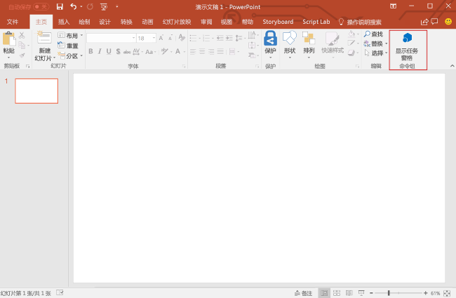
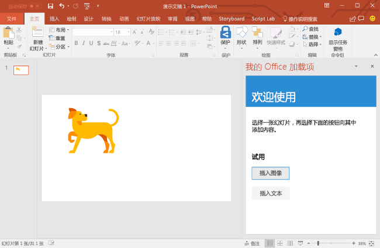
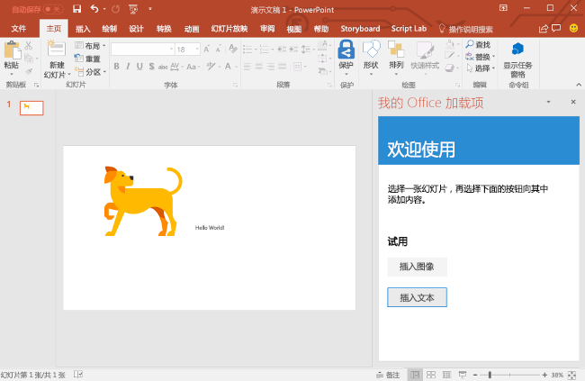
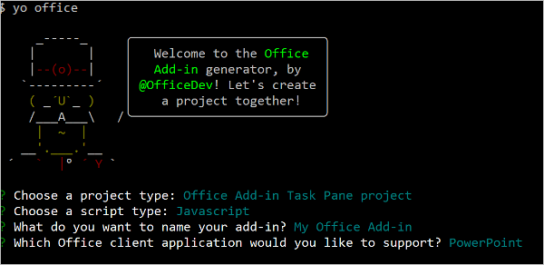
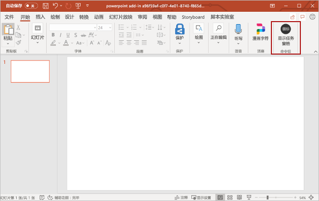
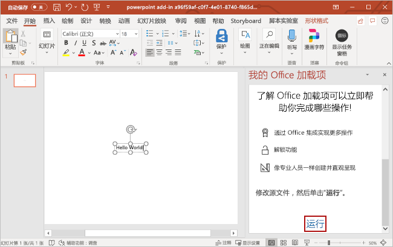

# <a name="build-your-first-powerpoint-task-pane-add-in"></a>生成首个 PowerPoint 任务加载项

本文将逐步介绍如何生成 PowerPoint 任务窗格加载项。

## <a name="create-the-add-in"></a>创建加载项 

[!include[Choose your editor](../includes/quickstart-choose-editor.md)]

# <a name="visual-studiotabvisual-studio"></a>[Visual Studio](#tab/visual-studio)

### <a name="prerequisites"></a>先决条件

[!include[Quick Start prerequisites](../includes/quickstart-vs-prerequisites.md)]

### <a name="create-the-add-in-project"></a>创建加载项项目

1. 在 Visual Studio 菜单栏中，依次选择“文件”**** > “新建”**** > “项目”****。
    
2. 在“Visual C#”**** 或“Visual Basic”**** 下的项目类型列表中，展开“Office/SharePoint”****，选择“加载项”****，再选择“PowerPoint Web 加载项”**** 作为项目类型。 

3. 命名此项目，再选择“确定”****。

4. 在“创建 Office 加载项”**** 对话框窗口中，选择“将新功能添加到 PowerPoint”****，再选择“完成”**** 以创建项目。

5. 此时，Visual Studio 创建解决方案，且它的两个项目显示在“解决方案资源管理器”**** 中。**Home.html** 文件在 Visual Studio 中打开。
    
### <a name="explore-the-visual-studio-solution"></a>探索 Visual Studio 解决方案

[!include[Description of Visual Studio projects](../includes/quickstart-vs-solution.md)]

### <a name="update-the-code"></a>更新代码

1. **Home.html** 指定在加载项的任务窗格中呈现的 HTML。 在 **Home.html** 中，将 `<body>` 元素替换为以下标记，并保存文件。
 
    ```html
    <body class="ms-font-m ms-welcome">
        <div id="content-header">
            <div class="padding">
                <h1>Welcome</h1>
            </div>
        </div>
        <div id="content-main">
            <div class="padding">
                <p>Select a slide and then choose the buttons to below to add content to it.</p>
                <br />
                <h3>Try it out</h3>
                <button class="ms-Button" id="insert-image">Insert Image</button>
                <br/><br/>
                <button class="ms-Button" id="insert-text">Insert Text</button>
            </div>
        </div>
    </body>
    ```

2. 打开 Web 应用项目根目录中的文件“Home.js”****。 此文件指定加载项脚本。 将整个内容替换为以下代码，并保存文件。

    ```js
    'use strict';

    (function () {

        Office.onReady(function() {
            // Office is ready
            $(document).ready(function () {
                // The document is ready
                $('#insert-image').click(insertImage);
                $('#insert-text').click(insertText);
            });
        });

        function insertImage() {
            Office.context.document.setSelectedDataAsync(getImageAsBase64String(), {
                coercionType: Office.CoercionType.Image,
                imageLeft: 50,
                imageTop: 50,
                imageWidth: 400
            },
                function (asyncResult) {
                    if (asyncResult.status === Office.AsyncResultStatus.Failed) {
                        console.log(asyncResult.error.message);
                    }
                });
        }  

        function insertText() {
            Office.context.document.setSelectedDataAsync("Hello World!",
                function (asyncResult) {
                    if (asyncResult.status === Office.AsyncResultStatus.Failed) {
                        console.log(asyncResult.error.message);
                    }
                });
        }

        function getImageAsBase64String() {
            return 'iVBORw0KGgoAAAANSUhEUgAAAZAAAAEFCAIAAABCdiZrAAAACXBIWXMAAAsSAAALEgHS3X78AAAbX0lEQVR42u2da2xb53nH/xIpmpRMkZQs2mZkkb7UV3lifFnmNYnorO3SLYUVpFjQYoloYA3SoZjVZRi2AVtptF+GNTUzbGiwDQu9deg2pCg9FE3aYQ3lDssw2zGNKc5lUUr6ItuULZKiJUoyJe2DFFsXXs6VOpf/D/kS6/Ac6T2Hv/M8z3nf5zTMz8+DEEL0QCOHgBBCYRFCCIVFCKGwCCGEwiKEEAqLEEJhEUIIhUUIIRQWIYTCIoQQCosQQigsQgiFRQghFBYhhFBYhBAKixBC1hArh2CBwtlYaTRV6ac2f7Cx2Q3AsTfEsSKEwlprYQ3Gpt4bFLixfU+vpdltCwTte0JNHQFrR4ADSEgdaGCL5AVGvhkSLqyV1t/gd+wN2feGHHtClBchFJbq3Hq5b+LCGfn7sfl7nI+HWw710VyEUFhqkf1BJPuDkwrusOXgsfW94ZZDfRxb8oBCEpn4yn90BmF1ozUIq5sjVCOb4RCoxMSFMxMXzlg3+D1fjDgfD3NAzE4ph6EwMlWjeKsLziDaQvCE0BbimDHCquyX8/Fb33lapZ3b9/RueD5q8wc5zuYl2VfDVqvx9MLbB28fHCwvUFjLmUknr/3xw6oewvPMNzzPRDjUZmQsgfNHpX/cewzePvgYp1NYS/j4yw1qH8K+p3fTS/GFKV3ERLw/gCuvyN2Jww9fGP4BM5e6ONP9ATZ/j9qHmHpvcOSbobnJHEfbXBSSCuykmMbwSZwNYDiCkkkvIQpryQ1sT6guueclOotIp5Rf1NZIjMIyNfZ6LbuZSV8a/W6YA05kaWvoOM6FlIndKCxdRlh1XCc4ceFM/o0ox9wsqDRHITuItx9G2kQXEoW1ZCya3S0Hj9XtcNkfRJgYmgVfGFaXWjv/4Os4FzJJVYvCWkbz4fpNTJ+bzDPIMk30HsDuqIrOyg7i7aAZ0kNOa1ghkVzqdzx1jOlcgb9jkGUaiimkow+0UkiilFdy/1YXdkeNPV2LwlrJ6KvhwtnT5f1iQYsbdifWNcPmkH2k/SK3X5j37B/gOTIaYwlMpTCeRDaBwiW5e+t+zcDOorBWUnbKu9UGjw/OdkWPtF/SpzY9C18YG57kmTImpRwycWTiotfxmMNZFFYZlvbGarTA44PLq8Jh9sv4rMOPfTGujzW4ua7HcCWKYprOorCqlhouJ2586ygAWzO8ASWyP8WFtUDXCexm2d7w988YhiNStGVEZ1FYFYOsufSgbycaLeocwA58Son9eHrxcJx9lIzPcATpqOgi/ZGLcBqqRwiFVZ7ZD37ccOY31bIVgBZgm0K7cvbgSJKnzASRfwpDYWTFNPK2uvB4ykj3M87DKsd0znL2d1W0FQAF08zCJQyFedKMjyOAwwnsOiXiI6U8zoWMNAYUVjnifRhPq3uIJmUz2NNlGu8SQ+IfwJGLIuagFi5hOEJhGZcLUVwbVP0oihfyh8KmbTliOpxBHEnCKbgb0vBJjCUoLGMmg3i7LrejFqV3WMqbahEs00McTohw1rsGKRpQWKvCq+m86kdpUWe3FJapsLpFOKuYNkZiSGGtCK9O1uNArerstpRnJcuMzhJYz0pHUUxRWMYKr+qDDGEVpiwXPnZe+NhZ/scUFp1V5X6m/yCL87CW8FfueuSDMqaMJi67I68H7k5ZAGx2z7z83PDOzZPLtuCcLHMyEsPQcUFbPvYLXb80jBHWJ7wbq4etAMjoXnPfVgBu5Gwv/eP2VQHYJZ5JM+ILwyus96TOgywK6xM+qlcyJVVYH95ovm+r+87ieSOLdMcEJYYjp3U9/YWvqgcATOfw0Zl6HMgDSJ1AvzL7A9bbZ8ts9/OAkIWyh/7kYJWfbt68+eWXX965cycvDf18ld3YHRWUGKaj2K7XOIsRFgDgaqJOB5LXpuapA3eW/u+XP50ps5GwZf3lZXc/drtx44UXXvjwww95aegsMfT0CgiyYkwJmQ8KC6/k5XAvPXX1qQN3DmwtHNha+MYXUy/82ojkXa2O11Zw9+7db3/727w0dIaQ0KmY1u/TZKaEdYywZHcBdNpnI19MKfK7HNp2951fOKtv88477/DS0BltIXh6a3d0yMTh7dPj38cICxhPqb7UGcAGueGVshzcWuCZNyZCuv7rNsKisICM+hOXLAqEVwoLa1uhehmL6BVvHxz+GtuU8jp9JxiFVRdhdUp/OKiqs3jyjYmQzsj6DLIoLPULWK2qLR6UR2gv29GYWFj6bDhDYQHjKRV33gR0avTv/sKBO8wKjYkjUDsrZEqoW2GpVnG3AAEtJoP3KT+TixiAjloPAUt5PTZvML2wVC1gbQbsmv7rv/TpWwyyjImQd1bqMMgyvbCmVavjdMpa51wfnPZZBlnGRMjbvSgsRlgPYiuPPgaAQZYxEdJD5p7+nrqYfqa7GhFWp25stRBkJf6MLbSMSM0p74ywiL5sRQiFpSsUnIRlAfy0FdEMQuruTAlNih3YovVngoToPSWksJRgA+DV9HwrQspQyuvuV6aw5NEEbFHtPYOEEApLGda54MpjIweC6BbhL47WDHxKKIl9/fhKirYimqbmNCurmxGW0aOqAwM4OIB1bg4G0ToFA06vo7CEseMY9oWxo48jQQiFpUk6erAlhC0heorokpqd3XU4Ucv0wvIuWSNqd6MjiHVueIPYEuIFX7unEtEsQlrHsIalP45GeW1XxENr6ze8StTeRkhHB43Bp4SkMkI67RJtIqQDciuFRYwTXvUacjEaI6wH+b4OU0IKi1RAyDuEiTYpJFGs1fhbh/kghUUq0HWC4ZWOuR4TEEHr8vxSWGQVvn7s5rMIPTMq4J2DfFU9MYitumMcBh2TiQvIB3sE9VDWHpw4Sj7B4ceuqE5vvOQBaQHRsW4nrFBYpsfqQlsI3j5OYjACY4naE9wB+AcoLCKD/1ViJ/uBz81zLE3NcKT2NrrNB8EallZgb2Uin5GYscMrCksz2DgERB6lHN4XYCKrS9e5P4WlDdhkmchkKCyoR7uewysKSzOs5xAQeclg5oyg8IrCIgpgB5o4CkQShSSGjgva0j+gx/WDFJYmcXEIiHiKKZwLCdrS4TfA+lBOa9AMHuC27J38tIEDWSccftgDcAbhCMAZXJull6Uckn1CXy+4ywjLrSgsLWWFdmCKA6GX0CaNYnrZNALvMXhC8PbVaZZTKYdzIRQuCdrYe8wYaxga5uc51VAz4UwWuCbj4/t5SjQSLPfiobC6swcKSZwLCY2trC48ntJ79WoB1rA0lhWy9G4AsoMYOo6fuTEcQSmn/P4zcRG2AtAdM4atKCzt4eMQGIVSHsMncTagsLbeH0DyaRG26jphpAXtTAm1lBIu8DEwwZTQWCjSCWMsgQ8GhBatFnD24IihXqfKCEt7dAIWjoKxKKaRfBrJPomhVjGFoTDOHxVtq8MJgw0kIyztRVgAxoG0+E8xwtI+VheCcRFzIIopjMSQjorIAe8f6HBCp43bKSy9CQvALSBDYRmUXadqL5HJxJGJY+S0RC0a0VbgPCztshG4B2Q5EEbkg6+jkCzTirqUw1gCmTiyidptjs1nKwpL23QCduAGB8KIjJzG9E1s/SOUcigkUUyhkBRXojKfrZgSajglvM84cA2YZUpIarFQZTfKlKuy8Cmh5mkFdgEeDgSpiq/f8LaisGSH3/XBAnRSW6Qyu04ZaTo7haVSBF7fSoEN6AT2Ap1AK+dqkU/SwCMX9d6WT0SQwDOuMyyA55NQaxaYAmaBIsfFlAG+f8AALa4orDpGWEJeUqKqvBaawbfyZJgMXz+2R/T7ti4Kay1ocnMMSL3x9GJ7ZG36BVJYuo+wCGFURWHpA3NfOqRe98Ue+MJ4KGyGh4AUFiMsok/q3HCZwjLL3U/+cgpCltL+6zj4JoehLJyHxSCLaIw7P1GlsTKFRSgsogrXYxwDCovCIjrhSpRjQGGpgFmnwxB1KaZRSHIYKCwV8PRyDIjyZOIcAwpLBQz0DiVCYVFYzAoJEU/hEp8VUlgq4AzC4ecwEOUZZxmLwlIDD4MsogLZBMeAwlIBlrGIKlkhIywKSyVh1a1dMjEP91jDorBUwhfmGBClU8JBjgGFpQ4PUViEUFh6wRmEs4fDQAiFpRNM8+YSQigs/cPSOyEUlm6wull6J4TCYlZICKGwFMcRgK+fw0AIhaUTTPYmXkIoLAZZhBAKi0EWIRQWWRlkdZ3gMBBCYemEHRHOySJEcfgiVcFM5/BRHFcTyCQxKuDlqRuAzRw1QiisOnM1gXei+OiMuE/dBjyAncNHCIVVHzJJvDWAa1K7fIwA2ziIhFBYdeC/Inj7pKw9TAC3gQ0cSkIoLPWYzuFfQoIKVbVjNMAFNHFMCVEAPiUslwYqZSsAs0CKY0oIIyw1GE/hX0OYziu5zykgA3g5uIQwwlI2E4z3KWyrBW4BExxfQigsBXkzrFgmuJo0MMshJoTCUoQL4mdaiWIW+JijTAiFpUgy+HZE9aNMAdc41oRQWDJ5a0CV0tVqssBtDjchFJZkxlN493T9DncDyHLQCaGwpDEUq/cRr/GhISFS4Dws4N3YGhw0DWzj0mgVmZvBzBhmZzAzVuFebcO6NljXw7qeo0Vh6YVMEuPpNTjuwkNDOktRpm6ieBMzYyjexNyMiA86NsHWBvsmODah0caBpLA0y0fxNTs0naUQE1cweQUTV8RJainFmyjeRP7yoryau9DSxchLi5i+hnU1sZZHX3AW61nSaN6J7tfwRLbpsxfh65dsq9XyuvM/uPI6bv0ME1c4ytqiYX5+3tQD8LeBtUkJV9AJeHg1CsayHr/0fXQ8tfTf5iZz+Tei+Teic5NKzlCxrocnCOeONfpLPzfPs01hLeHlBq38JpvZOUsYzh4cTsDqLvtDo2mLwmJKKCMO6lVx5zeAIoe4Fr5+HElWshWAxma355lI11+mnI8r+XbI0l2M/ieu/RumbvIcMMLSS4T10jwAZJIYTSKTRCYpvXtymTQH2MsLsirdr8EXFr558XJi9NVw6bbCKb9rLzzBej1MZIRFYckV1gqU8pcH6OQFWQGHH8E4nEGxn5ubzGVfj+TffEXZX8e6Ht5HYd9EYVFYuhOWUv7yA628IMvhPYbuWJU0sCYT5+Ojr4aVrWoB8AThCar8t1NYFJa6wpLsr72AhRfkikjGhd1RUWlgJUqjqZvf6ZtJK9zvrKULHY+qmR5SWBRWXYUl0F+tgJ9X44oAphfdMTgCSu1vbjI3+t3wxAWFu57Z2rDpCdVmmVJYFNZaCquSvyb+GbZbvBwfBFbdMXj71Nj36KvhwlmFm3M02uB7ErY2Ckt1OK1hTfEGsS+Mo1E0T3EwFuk6gcdTKtkKQMeLMWVnPACYm8HIm4Czh2ePwjIBhSRKeQ4DPL147BfYHZVTX19DZ+Fwgs6isEzA9RhVhUNv4XBCwYpV/Z0Fq5vOorBMwGjcvH/7fVW1hep8ZBWd5eADFArLwPlgMW3GP9zXjyMX10RV92l/PmrzKx0QWd0IxmF18dKmsIzIWEKZ/ez8C30kIw4/dp3CE1l0xyTMXFf46m92+/400distFycQQTjvLQpLCMyElNgJ95jCPwBjiRx5CK6TmgxJbG64OvHobfwWAr+AbXL6mKdpciuZtLJB//TFsL2bygTgBMKSysUUygoMfe6a+DBvX13FI+ltGIuhx++fgR/iCdy6I6tYfZXBZs/2P7cKfn7mZ3ILfv/7RF4j8nd6b0cvyXLbnwcgrUkE1dGCqtFsGCu3VEUU8jEkU1gLFGnyRNWF9pC8ITQFlrzpE8grs8PTF1OKD4JHt0xnA1wzgqFRWEtv5NX01kA/gH4BxYDumwC40kUkgpP/vL0whlEaxDOoF4ktYKOr8aKvxdQeIH0QgH+/FFe6RSW/inlkJXdTsvqEjEp3BGAIwzfkl9gPIlSbrFQcr/8X8qVSVQdftgDD8K3JjccAdgDaA1qpyAlqzjS7O54MXbrO08rvN+2ELpO4MorvN4pLIZXkFXAtroXc8kF5W03+wlpOdTXcvCY5MSwdDtV/gc7IhiNS5y8MpXiF2XZfYVDoG9hKdF6hSxNDCXPciiNpireGHZFJf5CRQqLwtKKsGSXeH39dVvLYpbvQ7Pb80xEYWEtxLAeSS8EoLAoLIZXpAquzw9YN0iZDnJvtKpcumMUFoVlYmF5erU5rckIieGLUuSybOLoahwBdJ0QvVNOHF2RXnMIRCDhJYb7+rFveRzkDWKdWwFhPcTwSi0ce0P2Pb1T74l7hjs3mZ+bzDU2V34GsiOCkZi42SSlPIopJv6MsOp2sw5iS2jZfwu2kjkHyuFnPqgq0ipZxcuJquGBe3FCHIMsCksi61ReVe8tN4tS/oJn2qouQZbCWSEWpqGIvOSUWh5PYRmBr6Rw4ISK+y8rLJkNsKwuKTdqon6QVSPCkhZkZSksCutBhOXG0Sieu4gOFXqzdPRgnbtMhC+zAZa3zxiTy40XZE29Nzg3WWu5stggq3CJzwoprFVx0LMJ7FO6/+TBcvfS6zG5u90e4RmrD5u2lnw74fHB2Q5bs3JBltiMPsPuWhTW6lDryRhCpxTbYat/5fNBRSJ8Ty+fGdXv67HtM3YnPJvREUDnHgSC2LgdznZYK785dfK8ALmIzQoVaZpGYRmQgwN48jVldnW03GoM+Q2wGF7V+XpY+m2xoMWNjgC69qNzL1xeNK56WffE+XjtrNARENcqi1khhVWRfWEF4qx9/djRp3xsX7b1FVEz7p7f9aWyP7E50L5lMeZqWVJRnJvMTwgJssRmhQyyKKxq91U59ayOnvLhlfzLjuFV3Wn45T+svkGLGxu3o2s/nO2LAVdhUMBZ9vaJ6webjvJcUFhVEzppzw07evBsoszDQfn5oKjWV0QpvMF5187aJ8e2mCp6fJj5cLD2hCyxQVYpzyCLwqqWC+BJ8dfHgRN4PlneVpBdbtfSuxvMFWQ9/FWhXycLPJuxaTvybwgIiMRmhcOMrymsqrdWEXNKO3vxW29VzAQXkFnA4uz2taJb3MjbnShdPF2q3rwBgCMgrudMMc3EkMKqyq9Gaqzd6ezFgRN47iKeTWBLqGpIn5PVAIutr9Y03J7f8llRn2jfgsyrAjQndgX7cAQlU79Hh90aaiWGX1Po+mB4peuscN+XcfXfhW9vc6ApNVi8nHDsrXob8/YBx0X8HqU8Popgt3njLEZY9ULOEla2vlpzdoh+3NG+BXf+5vkac7KsbtHvLrzyipmXQ1NY9UJOhMXWVzrMChst8DivZl+P1NhOwpPfd8OmTQwprHrZSnIDLLa+0k5WKJIWN+bOvVJjdaFHfOxcTGPIpJcEhaX58Iq20m1WuJAYZv/6C9WeGDoCcIqf8Zc5Y85ZDhSWtoXF1ldaygrnOg6K/oJZsMl/93b0N6oVs6TNBx4+acKppBSW+sh5KTxbX2nq27Lvt6V8yoI2x3s3v/VYRWdJXsAwdNxszqKw1Oe6jEuKiwc1RfWpdpWxObCheejOqc+Ud5YzKLpvslmdRWGpj+SGyGx9pTW8wXmLXbKz2psuZP/84fLOkjNtZei4eWrwFJb6+aDkhsgMr7TH/MZfkf5ls8A+lypfgJfwrHApI6cpLKIEkuf4sfWVNr8wO4/J+fhMETZ/UOEIa+FqobCIAkiuLzC80iZSy1gLzLZVmMEgp4y18HEKi8hFcgMstr7SLDLKWAAaHzqiinQoLKIAkqdfsfWVhpl37ZL2wdIMmrY+UvHHcrJCmSUwCovIEhZnt2v5O7NLYvBbmsY6f1CVKKmVERaRSSmH7KAkW7H1ldazQokVgrsVKu4yIyyH3zzxOIXF8IrUSVhzLVXvQ1a3xId9pilgUVjaE5azh7MZtE5rQGLdfWOtpYh2SZE1hUWUEJakhshc6qwHJNTd52Zh3fpojY2k3atMU3GnsDQWXrH1lU5o2Pak2I/MTFYtYMmJlVoZYZE1ERZtpRdhbdgt9iPFu6jR3x2Q8rDFTBV3CktjwmI+qBdaRZulRsVdcoRlpgIWhaUOYwkpDbB8/ZwsqhvEL9Bp3LhfaMREYVFYOgivuHhQV8w3rBP3gY0HBG0m9kGhmSruFJY6SGiAxdZXuhOWR0QZa6oA+x5hZhEbMbUywiJykNYAi9Ur3eHsEr7tdBHrAsLM0iSmLGCyijuFpQLXY6I/4vCzN4P+vjm+A8I3LlnaG5uFmUVUiidtoimFRR6QTYj+CKtXekTUAp32/ar8DuZbFEFhKYqEBlhsfaVT1onIxRoDvao4yGSPCCkspZHwfNAX5mwGXeISmo6JqLiLhcIispDQEJnldp0ieO7ovRnBFfdFDQl7EbTVZcInyxSWcpRyovNBtr4yAffu2YVW3BdNJGxj84VXFJYG8kGiW+Zc+wRt5hHZ2kHgzAZTtiGisNZOWGx9pXcsVkFbiW2pLDB0YoRFZOWDYhtgsXqld5rW19yk4osI5UNhkfqFV2x9pX/mW2svVJ6erPriiTK3vThy/117S1NW3AFYedkpg9g3PNNWumXuys9LP33JmnvH0jBbc+N79+zOjoCg6+dKVESQbsrwisJauwiL+aAeQ6r/+9HsT79mnUrbADQIs1vNinshifcHRL9gyazVTwpLIVuJaoDF1le6Yzp374fPNV3/kdgvjPVTVZspD0cwfFLK78MIi1QL1zNxZBMS3zu/Gi4e1BfjqdLfH26avS32c6UZWDZW6EJTyuFin8Q3V1JYpKKqPhhQzFMLsPWVzsLn5Pz3HrHOz0gJyypV3Es5nAtJv67MWnGnsKrcHHMYCkt8VVd1WL3SVWw1/71HGiTZCsBMES1lhTUUlnUXNGt4RWFVtpWcG2AV2PpKR0znZv/h0xaptgIw21ZuVeBwRO6N0MTzjTkPq462AqtXemLuP37fMj0i69v10JGV/1RISqyyL7vtmbekQGGtQj1bsfWVrpLBxvdek3Xjm0HT1kdW/uv7ShQETJwSUlirwnWVbAW2vtITsz9+UW6kPr2q4j6WkP5YkMKisMokg+moivtnuV0/4ZXl+k9k7qN4d9UqQgnt0lbj6TXzmaGwlpCOSnkBqtDwiq2vdMP85e/L30mZVz1Le2ElwysKqzyK3ACr5INEL8Ia+icF9rLx4Mp8UJHbYSuFRSD1fYJC74psfaWrb0X+Xbnh1SysWx9d9k8SXqfECIvCqshYQsWds3qlI8ZT8vcxM7mqgFVIUlgUlnKUcmrtma2v9EVeAWEV78Kxd3lMfU+JC8zcFXcKqy7QVuajTMWd4ZUSNMzPz/PyIoQwwiKEEAqLEEJhEUIIhUUIIRQWIYTCIoQQCosQQigsQgiFRQghFBYhhFBYhBAKixBCKCxCCKGwCCGG4/8BAjn5LoppTCkAAAAASUVORK5CYII=';
        }

    })();
    ```

3. 打开 Web 应用项目根目录中的文件“Home.css”****。 此文件指定加载项自定义样式。 将整个内容替换为以下代码，并保存文件。

    ```css
    #content-header {
        background: #2a8dd4;
        color: #fff;
        position: absolute;
        top: 0;
        left: 0;
        width: 100%;
        height: 80px; 
        overflow: hidden;
    }

    #content-main {
        background: #fff;
        position: fixed;
        top: 80px;
        left: 0;
        right: 0;
        bottom: 0;
        overflow: auto; 
    }

    .padding {
        padding: 15px;
    }
    ```

### <a name="update-the-manifest"></a>更新清单

1. 打开加载项项目中的 XML 清单文件。 此文件定义的是加载项设置和功能。

2. `ProviderName` 元素具有占位符值。 将其替换为你的姓名。

3. `DisplayName` 元素的 `DefaultValue` 属性有占位符。 将它替换为“My Office Add-in”****。

4. `Description` 元素的 `DefaultValue` 属性有占位符。 将它替换为“A task pane add-in for PowerPoint”****。

5. 保存文件。

    ```xml
    ...
    <ProviderName>John Doe</ProviderName>
    <DefaultLocale>en-US</DefaultLocale>
    <!-- The display name of your add-in. Used on the store and various places of the Office UI such as the add-ins dialog. -->
    <DisplayName DefaultValue="My Office Add-in" />
    <Description DefaultValue="A task pane add-in for PowerPoint"/>
    ...
    ```

### <a name="try-it-out"></a>试用

1. 使用 Visual Studio 的同时，按 **F5** 或选择“开始”**** 按钮启动 PowerPoint，以测试新建的 PowerPoint 加载项，功能区中显示有“显示任务窗格”**** 加载项按钮。加载项本地托管在 IIS 上。

2. 在 PowerPoint 中，插入新的空白幻灯片，再依次选择“主页”**** 选项卡和功能区中的“显示任务窗格”**** 按钮，以打开加载项任务窗格。

    

3. 在任务窗格中，选择“插入图像”**** 按钮，以便将图像添加到选定幻灯片。

    

4. 在任务窗格中，选择“插入文本”**** 按钮，以便将文本添加到选定幻灯片。

    

# <a name="any-editortabvisual-studio-code"></a>[任意编辑器](#tab/visual-studio-code)

### <a name="prerequisites"></a>先决条件

[!include[Yeoman generator prerequisites](../includes/quickstart-yo-prerequisites.md)]

### <a name="create-the-add-in-project"></a>创建加载项项目

1. 使用 Yeoman 生成器创建 PowerPoint 加载项项目。 运行下面的命令，再回答如下所示的提示问题：

    ```command&nbsp;line
    yo office
    ```

    - **选择项目类型:** `Office Add-in Task Pane project`
    - **选择脚本类型:** `Javascript`
    - **要如何命名加载项?** `My Office Add-in`
    - **要支持哪一个 Office 客户端应用程序?** `PowerPoint`

    
    
    完成此向导后，生成器会创建项目，并安装支持的 Node 组件。
    
2. 导航到项目的根文件夹。

    ```command&nbsp;line
    cd "My Office Add-in"
    ```

### <a name="explore-the-project"></a>浏览项目

[!include[Yeoman generator add-in project components](../includes/yo-task-pane-project-components-js.md)]

### <a name="try-it-out"></a>试用

1. 启动本地 Web 服务器并旁加载你的加载项。

    > [!NOTE]
    > Office 加载项应使用 HTTPS，而不是 HTTP（即便是在开发时也是如此）。 如果系统在运行以下命令之一后提示你安装证书，请接受提示以安装 Yeoman 生成器提供的证书。 

    - 若要在 PowerPoint 中测试加载项，请运行以下命令。 运行此命令时，本地 Web 服务器将启动，PowerPoint 将打开且加载项已载入。

        ```command&nbsp;line
        npm start
        ```

    - 若要在 PowerPoint Online 中测试加载项，请运行以下命令。 运行此命令时，本地 Web 服务器将启动。

        ```command&nbsp;line
        npm run start:web
        ```

        若要使用加载项，请在 PowerPoint Online 中打开新的文档，然后按照[在 Office Online 中旁加载 Office 加载项](../testing/sideload-office-add-ins-for-testing.md#sideload-an-office-add-in-in-office-online)中的说明旁加载你的加载项。

2. 在 PowerPoint 中，插入新的空白幻灯片，再依次选择“主页”**** 选项卡和功能区中的“显示任务窗格”**** 按钮，以打开加载项任务窗格。

    

3. 在任务窗格底部，选择“**运行**”链接，以将文字“Hello World”插入到当前幻灯片中。

    

---

## <a name="next-steps"></a>后续步骤

恭喜！已成功创建 PowerPoint 任务窗格加载项！ 接下来，请详细了解 PowerPoint 加载项功能，并跟着 PowerPoint 加载项教程一起操作，生成更复杂的加载项。

> [!div class="nextstepaction"]
> [PowerPoint 加载项教程](../tutorials/powerpoint-tutorial.md)

