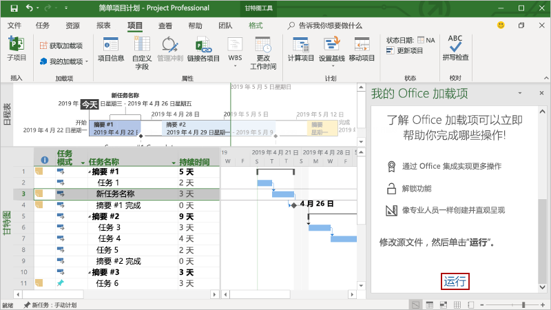

# <a name="build-your-first-project-task-pane-add-in"></a>生成首个 Project 任务窗格加载项

本文将逐步介绍如何生成 Project 任务窗格加载项。

## <a name="prerequisites"></a>先决条件

[!include[Yeoman generator prerequisites](../includes/quickstart-yo-prerequisites.md)]

- Windows 版 Project 2016 或更高版本

## <a name="create-the-add-in"></a>创建加载项

[!include[Yeoman generator create project guidance](../includes/yo-office-command-guidance.md)]

- **选择项目类型:** `Office Add-in Task Pane project`
- **选择脚本类型:** `Javascript`
- **要如何命名加载项?** `My Office Add-in`
- **要支持哪一个 Office 客户端应用程序?** `Project`


完成此向导后，生成器会创建项目，并安装支持的 Node 组件。

[!include[Yeoman generator next steps](../includes/yo-office-next-steps.md)]

## <a name="explore-the-project"></a>浏览项目

使用 Yeoman 生成器创建的加载项项目包含适合于基础任务窗格加载项的示例代码。 

- 项目根目录中的 **./manifest.xml** 文件定义加载项的设置和功能。
- **./src/taskpane/taskpane.html** 文件包含组成任务窗格的 HTML。
- **./src/taskpane/taskpane.css** 文件包含应用于任务窗格中的内容的 CSS。
- **./src/taskpane/taskpane.js** 文件包含用于加快任务窗格与 Office 托管应用程序之间的交互的 Office JavaScript API 代码。

## <a name="update-the-code"></a>更新代码

在代码编辑器中，打开文件 **./src/taskpane/taskpane.js** 并在 **run** 函数中添加以下代码。 此代码使用 Office JavaScript API 设置所选任务的 `Name` 字段和 `Notes` 字段。

```js
var taskGuid;

// Get the GUID of the selected task
Office.context.document.getSelectedTaskAsync(
    function (result) {
        if (result.status === Office.AsyncResultStatus.Succeeded) {
            taskGuid = result.value;

            // Set the specified fields for the selected task.
            var targetFields = [Office.ProjectTaskFields.Name, Office.ProjectTaskFields.Notes];
            var fieldValues = ['New task name', 'Notes for the task.'];

            // Set the field value. If the call is successful, set the next field.
            for (var i = 0; i < targetFields.length; i++) {
                Office.context.document.setTaskFieldAsync(
                    taskGuid,
                    targetFields[i],
                    fieldValues[i],
                    function (result) {
                        if (result.status === Office.AsyncResultStatus.Succeeded) {
                            i++;
                        }
                        else {
                            var err = result.error;
                            console.log(err.name + ' ' + err.code + ' ' + err.message);
                        }
                    }
                );
            }
        } else {
            var err = result.error;
            console.log(err.name + ' ' + err.code + ' ' + err.message);
        }
    }
);
```

## <a name="try-it-out"></a>试用

1. 导航到项目的根文件夹。

    ```command&nbsp;line
    cd "My Office Add-in"
    ```

2. 启动本地 Web 服务器。

    > [!NOTE]
    > Office 加载项应使用 HTTPS，而不是 HTTP（即便是在开发时也是如此）。 如果系统在运行以下命令后提示你安装证书，请接受提示以安装 Yeoman 生成器提供的证书。

    在项目的根目录中运行以下命令。 运行此命令时，本地 Web 服务器将启动。

    ```command&nbsp;line
    npm start
    ```

3. 在 Project 中，创建一个简单的项目计划。

4. 按照[在 Windows 上旁加载 Office 加载项](../testing/create-a-network-shared-folder-catalog-for-task-pane-and-content-add-ins.md)中的说明，在 Project 中加载你的加载项。

5. 在项目中选择单个任务。

6. 在任务窗格的底部，选择“**运行**”链接以重命名所选任务并向所选任务添加备注。

    

## <a name="next-steps"></a>后续步骤

恭喜！已成功创建 Project 任务窗格加载项！ 接下来，请详细了解 Project 加载项功能，并探索常见方案。

> [!div class="nextstepaction"]
> [Project 加载项](../project/project-add-ins.md)

## <a name="see-also"></a>另请参阅

- [构建 Office 加载项](../overview/office-add-ins-fundamentals.md)
- [Office 加载项的核心概念](../overview/core-concepts-office-add-ins.md)
- [开发 Office 加载项](../develop/develop-overview.md)
