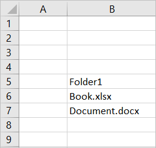
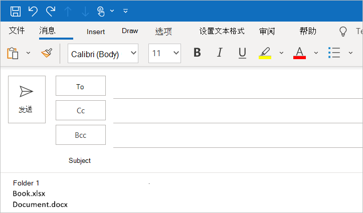

# <a name="customize-your-nodejs-sso-enabled-add-in"></a>自定义启用了 Node.js SSO 的加载项

> [!IMPORTANT]
> 本文基于启用了 SSO 的加载项，这是通过完成[单一登录 (sso) 快速入门](sso-quickstart.md)创建的。 阅读本文之前，请先完成快速入门。

[Sso 快速入门](sso-quickstart.md)创建启用了 sso 的加载项，以获取已登录用户的配置文件信息，并将其写入文档或邮件。 在本文中，您将逐步完成使用 SSO 快速入门中的 Yeoman 生成器来更新创建的外接程序的过程，以添加需要不同权限的新功能。

## <a name="prerequisites"></a>先决条件

* 按照[SSO 快速入门](sso-quickstart.md)中的说明创建的 Office 外接程序。

* 在 Microsoft 365 订阅中至少存储在 OneDrive for Business 上的一些文件和文件夹。

* [Node.js](https://nodejs.org)（最新[LTS](https://nodejs.org/about/releases) 版本）。

[!include[additional prerequisites](../includes/sso-tutorial-prereqs.md)]

## <a name="review-contents-of-the-project"></a>查看项目的内容

首先，先快速查看您先前[使用 Yeoman 生成器创建](sso-quickstart.md)的外接程序项目。

> [!NOTE]
> 在本文引用使用 **.js**文件扩展名的脚本文件的地方，如果您的项目是使用 TypeScript 创建的，则假定为 ts 文件扩展名 **。**

[!include[project structure for an SSO-enabled add-in created with the Yeoman generator](../includes/sso-yeoman-project-structure.md)]

## <a name="add-new-functionality"></a>添加新功能

使用 SSO 快速入门创建的外接程序使用 Microsoft Graph 获取已登录用户的配置文件信息，并将该信息写入文档或邮件。 让我们更改加载项的功能，以便从已登录用户的 OneDrive for Business 中获取前10个文件和文件夹的名称，并将该信息写入文档或邮件。 启用此新功能需要更新 Azure 中的应用程序权限，并更新加载项项目中的代码。

### <a name="update-app-permissions-in-azure"></a>更新 Azure 中的应用程序权限

在外接程序可以成功读取用户的 OneDrive for Business 的内容之前，必须使用适当的权限更新 Azure 中的应用程序注册信息。 完成以下步骤以向应用授予**文件. read. All**权限，并撤销**用户。读取**权限，不再需要该权限。

1. 导航到[Azure 门户](https://ms.portal.azure.com/#home)，并**使用 Microsoft 365 管理员凭据登录**。

2. 导航到 "**应用程序注册**" 页。
    > [!TIP]
    > 为此，可以在 Azure 主页上选择 "**应用注册**" 磁贴，或使用主页上的 "搜索" 框查找并选择 "**应用注册**"。

3. 在 "**应用程序注册**" 页上，选择您在快速启动过程中创建的应用程序。 
    > [!TIP]
    > 应用程序的**显示名称**将与您在使用 Yeoman 生成器创建项目时指定的外接程序名称相匹配。

4. 在 "应用程序概述" 页上，选择页面左侧 "**管理**" 标题下的 " **API 权限**"。

5. 在 "权限" 表的 "**读取**" 行中，选择省略号，然后从出现的菜单中选择 "**撤销管理员同意**"。

6. 选择 **"是"、"删除"** 按钮以响应显示的提示。

7. 在 "权限" 表的 "**读取**" 行中，选择省略号，然后从出现的菜单中选择 "**删除权限**"。

8. 选择 **"是"、"删除"** 按钮以响应显示的提示。

9. 选择 "**添加权限**" 按钮。

10. 在打开的面板中选择 " **Microsoft Graph** "，然后选择 "**委派权限**"。

11. 在 "**请求 API 权限**" 面板上：

    a. 在 "**文件**" 下，选择 "**文件"。**

    b. 选择面板底部的 "**添加权限**" 按钮以保存这些权限更改。

12. 选择 "**授予管理员同意 [租户名称]** " 按钮。

13. 选择 **"是"** 按钮以响应显示的提示。

### <a name="update-code-in-the-add-in-project"></a>更新加载项项目中的代码

若要使加载项能够读取已登录用户的 OneDrive for Business 的内容，需要执行以下操作：

- 更新引用 Microsoft Graph URL、参数和必需的访问作用域的代码。

- 更新定义任务窗格 UI 的代码，以准确描述新功能。 

- 更新解析来自 Microsoft Graph 的响应的代码，并将其写入文档或消息。

以下步骤介绍了这些更新。

### <a name="changes-required-for-any-type-of-add-in"></a>任何类型的外接程序所需的更改

为您的外接程序完成以下步骤，以更改 Microsoft Graph URL、参数和访问作用域，并更新任务窗格 UI。 无论你的外接程序针对哪个 Office 主机，这些步骤都相同。

1. 在 **./。ENV**文件：

    a. 将替换 `GRAPH_URL_SEGMENT=/me` 为以下内容：`GRAPH_URL_SEGMENT=/me/drive/root/children`

    b. 将替换 `QUERY_PARAM_SEGMENT=` 为以下内容：`QUERY_PARAM_SEGMENT=?$select=name&$top=10`

    c. 将替换 `SCOPE=User.Read` 为以下内容：`SCOPE=Files.Read.All`

2. 在 " **./manifest.xml**" 中，找到 `<Scope>User.Read</Scope>` 文件末尾附近的行，并将其替换为行 `<Scope>Files.Read.All</Scope>` 。

3. 在 **/src/helpers/fallbackauthdialog.js** (或 **/src/helpers/fallbackauthdialog.ts**对于 TypeScript 项目) ，找到字符串 `https://graph.microsoft.com/User.Read` 并将其替换为字符串 `https://graph.microsoft.com/Files.Read.All` ，如下所示 `requestObj` 定义：

    ```javascript
    var requestObj = {
      scopes: [`https://graph.microsoft.com/Files.Read.All`]
    };
    ```

    ```typescript
    var requestObj: Object = {
      scopes: [`https://graph.microsoft.com/Files.Read.All`]
    };
    ```

4. 在 **/src/taskpane/taskpane.html**中，查找元素 `<section class="ms-firstrun-instructionstep__header">` 并更新该元素中的文本，以描述外接程序的新功能。

    ```html
    <section class="ms-firstrun-instructionstep__header">
        <h2 class="ms-font-m">This add-in demonstrates how to use single sign-on by making a call to Microsoft
            Graph to read content from OneDrive for Business.</h2>
        <div class="ms-firstrun-instructionstep__header--image"></div>
    </section>
    ```

5. 在 **/src/taskpane/taskpane.html**中，查找并将字符串的这两个匹配项替换 `Get My User Profile Information` 为字符串 `Read my OneDrive for Business` 。

    ```html
    <li class="ms-ListItem">
        <span class="ms-ListItem-primaryText">Click the <b>Read my OneDrive for Business</b>
            button.</span>
        <div class="clearfix"></div>
    </li>
    ```

    ```html
    <p align="center">
        <button id="getGraphDataButton" class="popupButton ms-Button ms-Button--primary"><span
                class="ms-Button-label">Read my OneDrive for Business</span></button>
    </p>
    ```

6. 在 **/src/taskpane/taskpane.html**中，查找并将字符串替换 `Your user profile information will be displayed in the document.` 为字符串 `The names of the top 10 files and folders in your OneDrive for Business will be displayed in the document or message.` 。

    ```html
    <li class="ms-ListItem">
        <span class="ms-ListItem-primaryText">The names of the top 10 files and folders in your OneDrive for Business will be displayed in the document or message.</span>
        <div class="clearfix"></div>
    </li>
    ```

7. 通过遵循与您的外接程序类型对应的部分中的指导，更新分析来自 Microsoft Graph 的响应并将其写入文档或邮件的代码：

    - [ (JavaScript) 的 Excel 外接程序所需的更改](#changes-required-for-an-excel-add-in-javascript)
    - [ (TypeScript) 的 Excel 外接程序所需的更改](#changes-required-for-an-excel-add-in-typescript)
    - [ (JavaScript) 的 Outlook 外接程序所需的更改](#changes-required-for-an-outlook-add-in-javascript)
    - [ (TypeScript) 的 Outlook 外接程序所需的更改](#changes-required-for-an-outlook-add-in-typescript)
    - [ (JavaScript) 的 PowerPoint 加载项所需的更改](#changes-required-for-a-powerpoint-add-in-javascript)
    - [ (TypeScript) 的 PowerPoint 加载项所需的更改](#changes-required-for-a-powerpoint-add-in-typescript)
    - [ (JavaScript) 的 Word 外接程序所需的更改](#changes-required-for-a-word-add-in-javascript)
    - [Word 外接程序 (TypeScript) 所需的更改](#changes-required-for-a-word-add-in-typescript)

### <a name="changes-required-for-an-excel-add-in-javascript"></a> (JavaScript) 的 Excel 外接程序所需的更改

如果外接程序是使用 JavaScript 创建的 Excel 外接程序，请在 **/src/helpers/documentHelper.js**中进行以下更改：

1. 查找 `writeDataToOfficeDocument` 函数并将其替换为以下函数：

    ```javascript
    export function writeDataToOfficeDocument(result) {
      return new OfficeExtension.Promise(function(resolve, reject) {
        try {
          writeDataToExcel(result);
          resolve();
        } catch (error) {
          reject(Error("Unable to write data to document. " + error.toString()));
        }
      });
    }
    ```

2. 查找 `filterUserProfileInfo` 函数并将其替换为以下函数：

    ```javascript
    function filterOneDriveInfo(result) {
      let itemNames = [];
      let oneDriveItems = result['value'];
      for (let item of oneDriveItems) {
        itemNames.push(item['name']);
      }
      return itemNames;
    }
    ```

3. 查找 `writeDataToExcel` 函数并将其替换为以下函数：

    ```javascript
    function writeDataToExcel(result) {
      return Excel.run(function (context) {
        var sheet = context.workbook.worksheets.getActiveWorksheet();
        let data = [];
        let oneDriveInfo = filterOneDriveInfo(result);

        for (let i = 0; i < oneDriveInfo.length; i++) {
          if (oneDriveInfo[i] !== null) {
            let innerArray = [];
            innerArray.push(oneDriveInfo[i]);
            data.push(innerArray);
          }
        }

        const rangeAddress = `B5:B${5 + (data.length - 1)}`;
        const range = sheet.getRange(rangeAddress);
        range.values = data;
        range.format.autofitColumns();

        return context.sync();
      });
    }
    ```

4. 删除 `writeDataToOutlook` 函数。

5. 删除 `writeDataToPowerPoint` 函数。

6. 删除 `writeDataToWord` 函数。

在进行这些更改后，请跳至本文的 "[试用](#try-it-out)本主题" 一节，以试用更新后的外接程序。

### <a name="changes-required-for-an-excel-add-in-typescript"></a> (TypeScript) 的 Excel 外接程序所需的更改

如果外接程序是使用 TypeScript 创建的 Excel 外接程序，请打开 **/src/taskpane/taskpane.ts**，找到该 `writeDataToOfficeDocument` 函数，并将其替换为以下函数：

```typescript
export function writeDataToOfficeDocument(result: Object): Promise<any> {
  return Excel.run(function(context) {
    const sheet = context.workbook.worksheets.getActiveWorksheet();
    let data: string[] = [];

    let itemNames: string[] = [];
    let oneDriveItems = result["value"];
    for (let item of oneDriveItems) {
      itemNames.push(item["name"]);
    }

    for (let i = 0; i < itemNames.length; i++) {
      if (itemNames[i] !== null) {
        let innerArray = [];
        innerArray.push(itemNames[i]);
        data.push(innerArray);
      }
    }
    
    const rangeAddress = `B5:B${5 + (data.length - 1)}`;
    const range = sheet.getRange(rangeAddress);
    range.values = data;
    range.format.autofitColumns();

    return context.sync();
  });
}
```

在进行这些更改后，请跳至本文的 "[试用](#try-it-out)本主题" 一节，以试用更新后的外接程序。

### <a name="changes-required-for-an-outlook-add-in-javascript"></a> (JavaScript) 的 Outlook 外接程序所需的更改

如果你的外接程序是使用 JavaScript 创建的 Outlook 外接程序，请在 **/src/helpers/documentHelper.js**中进行以下更改：

1. 查找 `writeDataToOfficeDocument` 函数并将其替换为以下函数：

    ```javascript
    export function writeDataToOfficeDocument(result) {
      return new OfficeExtension.Promise(function(resolve, reject) {
        try {
          writeDataToOutlook(result);
          resolve();
        } catch (error) {
          reject(Error("Unable to write data to message. " + error.toString()));
        }
      });
    }
    ```

2. 查找 `filterUserProfileInfo` 函数并将其替换为以下函数：

    ```javascript
    function filterOneDriveInfo(result) {
      let itemNames = [];
      let oneDriveItems = result['value'];
      for (let item of oneDriveItems) {
        itemNames.push(item['name']);
      }
      return itemNames;
    }
    ```

3. 查找 `writeDataToOutlook` 函数并将其替换为以下函数：

    ```javascript
    function writeDataToOutlook(result) {
      let data = [];
      let oneDriveInfo = filterOneDriveInfo(result);

      for (let i = 0; i < oneDriveInfo.length; i++) {
        if (oneDriveInfo[i] !== null) {
          data.push(oneDriveInfo[i]);
        }
      }

      let objectNames = "";
      for (let i = 0; i < data.length; i++) {
        objectNames += data[i] + "<br/>";
      }

      Office.context.mailbox.item.body.setSelectedDataAsync(objectNames, { coercionType: Office.CoercionType.Html });
    }
    ```

4. 删除 `writeDataToExcel` 函数。

5. 删除 `writeDataToPowerPoint` 函数。

6. 删除 `writeDataToWord` 函数。

在进行这些更改后，请跳至本文的 "[试用](#try-it-out)本主题" 一节，以试用更新后的外接程序。

### <a name="changes-required-for-an-outlook-add-in-typescript"></a> (TypeScript) 的 Outlook 外接程序所需的更改

如果您的外接程序是使用 TypeScript 创建的 Outlook 外接程序，请打开 **/src/taskpane/taskpane.ts**，找到该 `writeDataToOfficeDocument` 函数，并将其替换为以下函数：

```typescript
export function writeDataToOfficeDocument(result: Object): void {
    let data: string[] = [];

    let itemNames: string[] = [];
    let oneDriveItems = result["value"];
    for (let item of oneDriveItems) {
        itemNames.push(item["name"]);
    };

    for (let i = 0; i < itemNames.length; i++) {
        if (itemNames[i] !== null) {
        data.push(itemNames[i]);
        }
    }

    let objectNames: string = "";
    for (let i = 0; i < data.length; i++) {
        objectNames += data[i] + "<br/>";
    }
    
    Office.context.mailbox.item.body.setSelectedDataAsync(objectNames, { coercionType: Office.CoercionType.Html });
}
```

在进行这些更改后，请跳至本文的 "[试用](#try-it-out)本主题" 一节，以试用更新后的外接程序。

### <a name="changes-required-for-a-powerpoint-add-in-javascript"></a> (JavaScript) 的 PowerPoint 加载项所需的更改

如果你的外接程序是使用 JavaScript 创建的 PowerPoint 加载项，请在 **/src/helpers/documentHelper.js**中进行以下更改：

1. 查找 `writeDataToOfficeDocument` 函数并将其替换为以下函数：

    ```javascript
    export function writeDataToOfficeDocument(result) {
      return new OfficeExtension.Promise(function(resolve, reject) {
        try {
          writeDataToPowerPoint(result);
          resolve();
        } catch (error) {
          reject(Error("Unable to write data to document. " + error.toString()));
        }
      });
    }
    ```

2. 查找 `filterUserProfileInfo` 函数并将其替换为以下函数：

    ```javascript
    function filterOneDriveInfo(result) {
      let itemNames = [];
      let oneDriveItems = result['value'];
      for (let item of oneDriveItems) {
        itemNames.push(item['name']);
      }
      return itemNames;
    }
    ```

3. 查找 `writeDataToPowerPoint` 函数并将其替换为以下函数：

    ```javascript
    function writeDataToPowerPoint(result) {
      let data = [];
      let oneDriveInfo = filterOneDriveInfo(result);

      for (let i = 0; i < oneDriveInfo.length; i++) {
        if (oneDriveInfo[i] !== null) {
          data.push(oneDriveInfo[i]);
        }
      }

      let objectNames = "";
      for (let i = 0; i < data.length; i++) {
        objectNames += data[i] + "\n";
      }

      Office.context.document.setSelectedDataAsync(
        objectNames, 
        function(asyncResult) {
          if (asyncResult.status === Office.AsyncResultStatus.Failed) {
            throw asyncResult.error.message;
          }
      });
    }
    ```

4. 删除 `writeDataToExcel` 函数。

5. 删除 `writeDataToOutlook` 函数。

6. 删除 `writeDataToWord` 函数。

在进行这些更改后，请跳至本文的 "[试用](#try-it-out)本主题" 一节，以试用更新后的外接程序。

### <a name="changes-required-for-a-powerpoint-add-in-typescript"></a> (TypeScript) 的 PowerPoint 加载项所需的更改

如果您的外接程序是使用 TypeScript 创建的 PowerPoint 加载项，请打开 **/src/taskpane/taskpane.ts**，找到该 `writeDataToOfficeDocument` 函数，并将其替换为以下函数：

```typescript
export function writeDataToOfficeDocument(result: Object): void {
  let data: string[] = [];

  let itemNames: string[] = [];
  let oneDriveItems = result["value"];
  for (let item of oneDriveItems) {
    itemNames.push(item["name"]);
  };

  for (let i = 0; i < itemNames.length; i++) {
    if (itemNames[i] !== null) {
      data.push(itemNames[i]);
    }
  }

  let objectNames: string = "";
  for (let i = 0; i < data.length; i++) {
    objectNames += data[i] + "\n";
  }

  Office.context.document.setSelectedDataAsync(objectNames, function(asyncResult) {
    if (asyncResult.status === Office.AsyncResultStatus.Failed) {
      throw asyncResult.error.message;
    }
  });
}
```

在进行这些更改后，请跳至本文的 "[试用](#try-it-out)本主题" 一节，以试用更新后的外接程序。

### <a name="changes-required-for-a-word-add-in-javascript"></a> (JavaScript) 的 Word 外接程序所需的更改

如果你的外接程序是使用 JavaScript 创建的 Word 外接程序，请在 **/src/helpers/documentHelper.js**中进行以下更改：

1. 查找 `writeDataToOfficeDocument` 函数并将其替换为以下函数：

    ```javascript
    export function writeDataToOfficeDocument(result) {
      return new OfficeExtension.Promise(function(resolve, reject) {
        try {
          writeDataToWord(result);
          resolve();
        } catch (error) {
          reject(Error("Unable to write data to document. " + error.toString()));
        }
      });
    }
    ```

2. 查找 `filterUserProfileInfo` 函数并将其替换为以下函数：

    ```javascript
    function filterOneDriveInfo(result) {
      let itemNames = [];
      let oneDriveItems = result['value'];
      for (let item of oneDriveItems) {
        itemNames.push(item['name']);
      }
      return itemNames;
    }
    ```

3. 查找 `writeDataToWord` 函数并将其替换为以下函数：

    ```javascript
    function writeDataToWord(result) {
      return Word.run(function (context) {
        let data = [];
        let oneDriveInfo = filterOneDriveInfo(result);

        for (let i = 0; i < oneDriveInfo.length; i++) {
          if (oneDriveInfo[i] !== null) {
            data.push(oneDriveInfo[i]);
          }
        }

        const documentBody = context.document.body;
        for (let i = 0; i < data.length; i++) {
          if (data[i] !== null) {
            documentBody.insertParagraph(data[i], "End");
          }
        }

        return context.sync();
      });
    }
    ```

4. 删除 `writeDataToExcel` 函数。

5. 删除 `writeDataToOutlook` 函数。

6. 删除 `writeDataToPowerPoint` 函数。

在进行这些更改后，请跳至本文的 "[试用](#try-it-out)本主题" 一节，以试用更新后的外接程序。

### <a name="changes-required-for-a-word-add-in-typescript"></a>Word 外接程序 (TypeScript) 所需的更改

如果你的外接程序是使用 TypeScript 创建的 Word 外接程序，请打开 **/src/taskpane/taskpane.ts**，找到该 `writeDataToOfficeDocument` 函数，并将其替换为以下函数：

```typescript
export function writeDataToOfficeDocument(result: Object): Promise<any> {
  return Word.run(function(context) {
    let data: string[] = [];

    let itemNames: string[] = [];
    let oneDriveItems = result["value"];
    for (let item of oneDriveItems) {
      itemNames.push(item["name"]);
    };

    for (let i = 0; i < itemNames.length; i++) {
      if (itemNames[i] !== null) {
        data.push(itemNames[i]);
      }
    }

    const documentBody: Word.Body = context.document.body;
    for (let i = 0; i < data.length; i++) {
      if (data[i] !== null) {
        documentBody.insertParagraph(data[i], "End");
      }
    }
    return context.sync();
  });
}
```

在进行这些更改后，请继续阅读本文的 "[试用](#try-it-out)本主题" 一节，以试用更新后的外接程序。

## <a name="try-it-out"></a>试用

如果你的外接程序是 Excel、Word 或 PowerPoint 外接程序，请完成以下部分中的步骤以试用。如果你的外接程序是 Outlook 外接程序，请改为完成[outlook](#outlook)部分中的步骤。

### <a name="excel-word-and-powerpoint"></a>Excel、Word 和 PowerPoint

完成以下步骤以试用 Excel、Word 或 PowerPoint 加载项。

1. 在项目的根文件夹中，运行以下命令以生成项目，启动本地 web 服务器，并在以前选择的 Office 客户端应用程序中旁加载您的外接程序。

    > [!NOTE]
    > Office 加载项应使用 HTTPS，而不是 HTTP（即便是在开发时也是如此）。 如果系统在运行以下命令后提示你安装证书，请接受提示以安装 Yeoman 生成器提供的证书。

    ```command&nbsp;line
    npm start
    ```

2. 在运行以前的命令时打开的 Office 客户端应用程序 (例如，Excel、Word 或 PowerPoint) ，请确保您已登录到与您在为应用程序[配置 SSO](sso-quickstart.md#configure-sso)时连接到 Azure 时使用的 microsoft 365 管理员帐户相同的 microsoft 365 组织的成员的用户。 执行此操作，将为成功进行 SSO 建立了相应的条件。 

3. 在 Office 客户端应用程序中，依次选择的“**开始**”选项卡和功能区中的“**显示任务窗格**”按钮，以打开加载项任务窗格。 下图显示 Excel 中的该按钮。

    

4. 在任务窗格底部，选择 "**读取我的 OneDrive For business** " 按钮以启动 SSO 过程。 

5. 如果对话框窗口显示代表加载项请求权限，则表示 你的方案不支持 SSO，并且加载项已退回至替代的用户身份验证方法。 如果租户管理员未向外接程序授予访问 Microsoft Graph 的许可，或者用户未使用有效的 Microsoft 帐户或 Microsoft 365 教育版或工作帐户登录 Office，则可能会发生这种情况。 选择对话框窗口中的“**接受**”按钮以继续。

    

    > [!NOTE]
    > 用户接受此权限请求后，以后将不会再收到提示。

6. 加载项读取已登录用户的 OneDrive for Business 中的数据，并将前10个文件和文件夹的名称写入文档中。 下图显示了写入 Excel 工作表的文件和文件夹名称的示例。

    

### <a name="outlook"></a>Outlook

完成以下步骤以试用 Outlook 加载项。

1. 在项目的根文件夹中，运行以下命令以生成项目并启动本地 web 服务器。

    > [!NOTE]
    > Office 加载项应使用 HTTPS，而不是 HTTP（即便是在开发时也是如此）。 如果系统在运行以下命令后提示你安装证书，请接受提示以安装 Yeoman 生成器提供的证书。

    ```command&nbsp;line
    npm start
    ```

2. 按照[旁加载 Outlook 加载项以供测试](/outlook/add-ins/sideload-outlook-add-ins-for-testing)中的说明操作，旁加载 Outlook 加载项。 确保您登录到 Outlook 时使用的是与 Azure 在为应用程序[配置 SSO](sso-quickstart.md#configure-sso)时使用的 microsoft 365 管理员帐户相同的 microsoft 365 组织的成员。 执行此操作，将为成功进行 SSO 建立了相应的条件。 

3. 在 Outlook 中，撰写一封新邮件。

4. 在“邮件撰写”窗口中，选择功能区中的“显示任务窗格”**** 按钮，以打开加载项任务窗格。

    

5. 在任务窗格底部，选择 "**读取我的 OneDrive For business** " 按钮以启动 SSO 过程。 

6. 如果对话框窗口显示代表加载项请求权限，则表示 你的方案不支持 SSO，并且加载项已退回至替代的用户身份验证方法。 如果租户管理员未向外接程序授予访问 Microsoft Graph 的许可，或者用户未使用有效的 Microsoft 帐户或 Microsoft 365 教育版或工作帐户登录 Office，则可能会发生这种情况。 选择对话框窗口中的“**接受**”按钮以继续。

    

    > [!NOTE]
    > 用户接受此权限请求后，以后将不会再收到提示。

7. 加载项读取已登录用户的 OneDrive for Business 中的数据，并将前10个文件和文件夹的名称写入电子邮件的正文中。

    

## <a name="next-steps"></a>后续步骤

恭喜，你已成功自定义使用[sso 快速入门](sso-quickstart.md)中的 Yeoman 生成器创建的启用 SSO 的外接程序的功能。 若要详细了解有关 Yeoman 生成器自动完成的 SSO 配置步骤，以及有助于 SSO 流程的代码，参见“[创建使用单一登录的 Node.js Office 加载项](../develop/create-sso-office-add-ins-nodejs.md)”教程。

## <a name="see-also"></a>另请参阅

- [为 Office 加载项启用单一登录](../develop/sso-in-office-add-ins.md)
- [单一登录 (SSO) 快速入门](sso-quickstart.md)
- [创建使用单一登录的 Node.js Office 加载项](../develop/create-sso-office-add-ins-nodejs.md)
- [排查单一登录 (SSO) 错误消息](../develop/troubleshoot-sso-in-office-add-ins.md)
