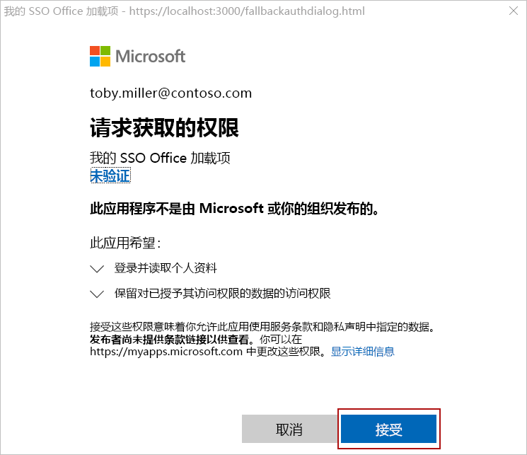

# <a name="customize-your-nodejs-sso-enabled-add-in"></a>自定义启用了 Node.js SSO 的加载项

> [!IMPORTANT]
> 本文基于启用 SSO 的外接程序，该外接程序通过完成 SSO (单一登录) [快速入门。](sso-quickstart.md) 请在阅读本文之前完成快速入门。

[SSO 快速入门](sso-quickstart.md)将创建一个启用 SSO 的外接程序，该外接程序获取已登录用户的配置文件信息，并将其添加到文档或邮件中。 本文将介绍在 SSO 快速入门中更新使用 Yeoman 生成器创建的外接程序的过程，以添加需要不同权限的新功能。

## <a name="prerequisites"></a>先决条件

- 按照 [SSO](sso-quickstart.md)快速入门中的说明创建的 Office 加载项。

- 在 Microsoft 365 订阅中，OneDrive for Business 上至少存储了一些文件和文件夹。

- [Node.js](https://nodejs.org)（最新[LTS](https://nodejs.org/about/releases) 版本）。

[!include[additional prerequisites](../includes/sso-tutorial-prereqs.md)]

## <a name="review-contents-of-the-project"></a>查看项目内容

让我们首先快速回顾一下之前使用 [Yeoman](sso-quickstart.md)生成器创建的加载项项目。

> [!NOTE]
> 在本文引用使用 **.js** 文件扩展名的脚本文件的位置，如果项目是使用 TypeScript 创建的，请改为假定 **.ts** 文件扩展名。

[!include[project structure for an SSO-enabled add-in created with the Yeoman generator](../includes/sso-yeoman-project-structure.md)]

## <a name="add-new-functionality"></a>添加新功能

使用 SSO 快速入门创建的外接程序使用 Microsoft Graph 获取已登录用户的配置文件信息，将该信息写入文档或邮件。 让我们更改外接程序的功能，这样它就会从登录用户的 OneDrive for Business 获取前 10 个文件和文件夹的名称，将该信息写入文档或邮件。 启用此新功能需要在 Azure 中更新应用权限，并更新加载项项目中的代码。

### <a name="update-app-permissions-in-azure"></a>在 Azure 中更新应用权限

在加载项成功读取用户的 OneDrive for Business 内容之前，必须在 Azure 中更新其应用注册信息，并授予相应的权限。 完成以下步骤以向应用授予 **Files.Read.All** 权限，并撤消不再需要的 **User.Read** 权限。

1. 导航到 [Azure](https://ms.portal.azure.com/#home) 门户 **，然后使用 Microsoft 365 管理员凭据登录**。

2. 导航到 **"应用注册"** 页。
    > [!TIP]
    > 为此，可以在 Azure 主页上选择应用注册磁贴，或者使用主页上的搜索框查找并选择 **应用注册**。

3. 在 **"应用注册"** 页上，选择在快速启动期间创建的应用。
    > [!TIP]
    > 应用的 **显示** 名称将匹配使用 Yeoman 生成器创建项目时指定的外接程序名称。

4. 从应用概述页面，在页面左侧的"管理标题"下选择 **API** 权限。

5. 在 **权限表的 User.Read** 行中，选择省略号，然后选择"从出现的菜单撤消管理员同意"。

6. 选择 **"是，** 删除"按钮以响应显示的提示。

7. 在 **权限表的 User.Read** 行中，选择省略号，然后从出现的菜单中选择"删除权限"。

8. 选择 **"是，** 删除"按钮以响应显示的提示。

9. 选择 **"添加权限"** 按钮。

10. 在打开的面板上，选择 **Microsoft Graph，** 然后选择 **"委派权限"。**

11. 在 **"请求 API 权限"面板** 上：

    a. 在 **"文件**"下，**选择"Files.Read.All"。**

    b. 选择 **面板底部的** "添加权限"按钮以保存这些权限更改。

12. 选择 **"授予管理员同意[租户名称]"** 按钮。

13. 选择 **"是** "按钮以响应显示的提示。

### <a name="update-code-in-the-add-in-project"></a>更新加载项项目中的代码

若要使加载项能够读取已登录用户的 OneDrive for Business 的内容，你将需要：

- 更新引用 Microsoft Graph URL、参数和所需访问范围的代码。

- 更新定义任务窗格 UI 的代码，以便准确描述新功能。

- 更新分析 Microsoft Graph 响应的代码，并写入文档或邮件。

以下步骤介绍了这些更新。

### <a name="changes-required-for-any-type-of-add-in"></a>任何类型的外接程序所需的更改

为外接程序完成以下步骤，以更改 Microsoft Graph URL、参数和访问范围，并更新任务窗格 UI。 这些步骤是相同的，无论外接程序面向哪个 Office 应用程序。

1. 在 **./中。ENV** 文件：

    a. 替换为 `GRAPH_URL_SEGMENT=/me` 以下内容： `GRAPH_URL_SEGMENT=/me/drive/root/children`

    b. 替换为 `QUERY_PARAM_SEGMENT=` 以下内容： `QUERY_PARAM_SEGMENT=?$select=name&$top=10`

    c. 替换为 `SCOPE=User.Read` 以下内容： `SCOPE=Files.Read.All`

2. 在 **./manifest.xml** 中，查找文件末尾附近的行， `<Scope>User.Read</Scope>` 并将其替换为该行 `<Scope>Files.Read.All</Scope>` 。

3. 在 TypeScript 项目) 的 **./src/helpers/fallbackauthdialog.js** (或 **./src/helpers/fallbackauthdialog.ts** 中，查找字符串并将其替换为字符串，定义 `https://graph.microsoft.com/User.Read` `https://graph.microsoft.com/Files.Read.All` `requestObj` 如下：

    ```javascript
    var requestObj = {
      scopes: [`https://graph.microsoft.com/Files.Read.All`]
    };
    ```

    ```typescript
    var requestObj: Object = {
      scopes: [`https://graph.microsoft.com/Files.Read.All`]
    };
    ```

4. 在 **./src/taskpane/taskpane.html** 中，查找元素并更新该元素中的文本以描述加载项 `<section class="ms-firstrun-instructionstep__header">` 的新功能。

    ```html
    <section class="ms-firstrun-instructionstep__header">
        <h2 class="ms-font-m">This add-in demonstrates how to use single sign-on by making a call to Microsoft
            Graph to read content from OneDrive for Business.</h2>
        <div class="ms-firstrun-instructionstep__header--image"></div>
    </section>
    ```

5. 在 **./src/taskpane/taskpane.html** 中，查找字符串的两个匹配项并将其 `Get My User Profile Information` 替换为字符串 `Read my OneDrive for Business` 。

    ```html
    <li class="ms-ListItem">
        <span class="ms-ListItem-primaryText">Click the <b>Read my OneDrive for Business</b>
            button.</span>
        <div class="clearfix"></div>
    </li>
    ```

    ```html
    <p align="center">
        <button id="getGraphDataButton" class="popupButton ms-Button ms-Button--primary"><span
                class="ms-Button-label">Read my OneDrive for Business</span></button>
    </p>
    ```

6. 在 **./src/taskpane/taskpane.html** 中，查找字符串并将其 `Your user profile information will be displayed in the document.` 替换为字符串 `The names of the top 10 files and folders in your OneDrive for Business will be displayed in the document or message.` 。

    ```html
    <li class="ms-ListItem">
        <span class="ms-ListItem-primaryText">The names of the top 10 files and folders in your OneDrive for Business will be displayed in the document or message.</span>
        <div class="clearfix"></div>
    </li>
    ```

7. 按照与加载项类型对应的部分中的指导，更新分析 Microsoft Graph 响应的代码，并将其添加到文档或邮件中：

    - [Excel 加载项 JavaScript (所需的) ](#changes-required-for-an-excel-add-in-javascript)
    - [TypeScript (Excel 外接程序) ](#changes-required-for-an-excel-add-in-typescript)
    - [JavaScript (Outlook 外接程序) ](#changes-required-for-an-outlook-add-in-javascript)
    - [使用 TypeScript (Outlook 外接程序) ](#changes-required-for-an-outlook-add-in-typescript)
    - [PowerPoint 加载项 JavaScript (所需的) ](#changes-required-for-a-powerpoint-add-in-javascript)
    - [PowerPoint 外接程序所需的更改 (TypeScript) ](#changes-required-for-a-powerpoint-add-in-typescript)
    - [JavaScript (Word 外接程序) ](#changes-required-for-a-word-add-in-javascript)
    - [TypeScript (Word 外接程序) ](#changes-required-for-a-word-add-in-typescript)

### <a name="changes-required-for-an-excel-add-in-javascript"></a>Excel 加载项 JavaScript (所需的) 

如果加载项是使用 JavaScript 创建的 Excel 加载项，请对 **./src/helpers/documentHelper.js：**

1. 查找 `writeDataToOfficeDocument` 函数并将其替换为以下函数：

    ```javascript
    export function writeDataToOfficeDocument(result) {
      return new OfficeExtension.Promise(function(resolve, reject) {
        try {
          writeDataToExcel(result);
          resolve();
        } catch (error) {
          reject(Error("Unable to write data to document. " + error.toString()));
        }
      });
    }
    ```

2. 查找 `filterUserProfileInfo` 函数并将其替换为以下函数：

    ```javascript
    function filterOneDriveInfo(result) {
      let itemNames = [];
      let oneDriveItems = result['value'];
      for (let item of oneDriveItems) {
        itemNames.push(item['name']);
      }
      return itemNames;
    }
    ```

3. 查找 `writeDataToExcel` 函数并将其替换为以下函数：

    ```javascript
    function writeDataToExcel(result) {
      return Excel.run(function (context) {
        var sheet = context.workbook.worksheets.getActiveWorksheet();
        let data = [];
        let oneDriveInfo = filterOneDriveInfo(result);

        for (let i = 0; i < oneDriveInfo.length; i++) {
          if (oneDriveInfo[i] !== null) {
            let innerArray = [];
            innerArray.push(oneDriveInfo[i]);
            data.push(innerArray);
          }
        }

        const rangeAddress = `B5:B${5 + (data.length - 1)}`;
        const range = sheet.getRange(rangeAddress);
        range.values = data;
        range.format.autofitColumns();

        return context.sync();
      });
    }
    ```

4. 删除 `writeDataToOutlook` 函数。

5. 删除 `writeDataToPowerPoint` 函数。

6. 删除 `writeDataToWord` 函数。

进行这些更改后，跳到本文的"试用"部分[](#try-it-out)以试用更新的外接程序。

### <a name="changes-required-for-an-excel-add-in-typescript"></a>TypeScript (Excel 外接程序) 

如果加载项是使用 TypeScript 创建的 Excel 加载项，请打开 **./src/taskpane/taskpane.ts，** 查找该函数，并将其替换为 `writeDataToOfficeDocument` 以下函数：

```typescript
export function writeDataToOfficeDocument(result: Object): Promise<any> {
  return Excel.run(function(context) {
    const sheet = context.workbook.worksheets.getActiveWorksheet();
    let data: string[] = [];

    let itemNames: string[] = [];
    let oneDriveItems = result["value"];
    for (let item of oneDriveItems) {
      itemNames.push(item["name"]);
    }

    for (let i = 0; i < itemNames.length; i++) {
      if (itemNames[i] !== null) {
        let innerArray = [];
        innerArray.push(itemNames[i]);
        data.push(innerArray);
      }
    }

    const rangeAddress = `B5:B${5 + (data.length - 1)}`;
    const range = sheet.getRange(rangeAddress);
    range.values = data;
    range.format.autofitColumns();

    return context.sync();
  });
}
```

进行这些更改后，跳到本文的"试用"部分[](#try-it-out)以试用更新的外接程序。

### <a name="changes-required-for-an-outlook-add-in-javascript"></a>JavaScript (Outlook 外接程序) 

如果外接程序是使用 JavaScript 创建的 Outlook 外接程序，请对 **./src/helpers/documentHelper.js：**

1. 查找 `writeDataToOfficeDocument` 函数并将其替换为以下函数：

    ```javascript
    export function writeDataToOfficeDocument(result) {
      return new OfficeExtension.Promise(function(resolve, reject) {
        try {
          writeDataToOutlook(result);
          resolve();
        } catch (error) {
          reject(Error("Unable to write data to message. " + error.toString()));
        }
      });
    }
    ```

2. 查找 `filterUserProfileInfo` 函数并将其替换为以下函数：

    ```javascript
    function filterOneDriveInfo(result) {
      let itemNames = [];
      let oneDriveItems = result['value'];
      for (let item of oneDriveItems) {
        itemNames.push(item['name']);
      }
      return itemNames;
    }
    ```

3. 查找 `writeDataToOutlook` 函数并将其替换为以下函数：

    ```javascript
    function writeDataToOutlook(result) {
      let data = [];
      let oneDriveInfo = filterOneDriveInfo(result);

      for (let i = 0; i < oneDriveInfo.length; i++) {
        if (oneDriveInfo[i] !== null) {
          data.push(oneDriveInfo[i]);
        }
      }

      let objectNames = "";
      for (let i = 0; i < data.length; i++) {
        objectNames += data[i] + "<br/>";
      }

      Office.context.mailbox.item.body.setSelectedDataAsync(objectNames, { coercionType: Office.CoercionType.Html });
    }
    ```

4. 删除 `writeDataToExcel` 函数。

5. 删除 `writeDataToPowerPoint` 函数。

6. 删除 `writeDataToWord` 函数。

进行这些更改后，跳到本文的"试用"部分[](#try-it-out)以试用更新的外接程序。

### <a name="changes-required-for-an-outlook-add-in-typescript"></a>使用 TypeScript (Outlook 外接程序) 

如果您的外接程序是使用 TypeScript 创建的 Outlook 外接程序，请打开 **./src/taskpane/taskpane.ts，** 查找该函数，并将其替换为 `writeDataToOfficeDocument` 以下函数：

```typescript
export function writeDataToOfficeDocument(result: Object): void {
    let data: string[] = [];

    let itemNames: string[] = [];
    let oneDriveItems = result["value"];
    for (let item of oneDriveItems) {
        itemNames.push(item["name"]);
    };

    for (let i = 0; i < itemNames.length; i++) {
        if (itemNames[i] !== null) {
        data.push(itemNames[i]);
        }
    }

    let objectNames: string = "";
    for (let i = 0; i < data.length; i++) {
        objectNames += data[i] + "<br/>";
    }

    Office.context.mailbox.item.body.setSelectedDataAsync(objectNames, { coercionType: Office.CoercionType.Html });
}
```

进行这些更改后，跳到本文的"试用"部分[](#try-it-out)以试用更新的外接程序。

### <a name="changes-required-for-a-powerpoint-add-in-javascript"></a>PowerPoint 加载项 JavaScript (所需的) 

如果加载项是使用 JavaScript 创建的 PowerPoint 加载项，请对 **./src/helpers/documentHelper.js：**

1. 查找 `writeDataToOfficeDocument` 函数并将其替换为以下函数：

    ```javascript
    export function writeDataToOfficeDocument(result) {
      return new OfficeExtension.Promise(function(resolve, reject) {
        try {
          writeDataToPowerPoint(result);
          resolve();
        } catch (error) {
          reject(Error("Unable to write data to document. " + error.toString()));
        }
      });
    }
    ```

2. 查找 `filterUserProfileInfo` 函数并将其替换为以下函数：

    ```javascript
    function filterOneDriveInfo(result) {
      let itemNames = [];
      let oneDriveItems = result['value'];
      for (let item of oneDriveItems) {
        itemNames.push(item['name']);
      }
      return itemNames;
    }
    ```

3. 查找 `writeDataToPowerPoint` 函数并将其替换为以下函数：

    ```javascript
    function writeDataToPowerPoint(result) {
      let data = [];
      let oneDriveInfo = filterOneDriveInfo(result);

      for (let i = 0; i < oneDriveInfo.length; i++) {
        if (oneDriveInfo[i] !== null) {
          data.push(oneDriveInfo[i]);
        }
      }

      let objectNames = "";
      for (let i = 0; i < data.length; i++) {
        objectNames += data[i] + "\n";
      }

      Office.context.document.setSelectedDataAsync(
        objectNames, 
        function(asyncResult) {
          if (asyncResult.status === Office.AsyncResultStatus.Failed) {
            throw asyncResult.error.message;
          }
      });
    }
    ```

4. 删除 `writeDataToExcel` 函数。

5. 删除 `writeDataToOutlook` 函数。

6. 删除 `writeDataToWord` 函数。

进行这些更改后，跳到本文的"试用"部分[](#try-it-out)以试用更新的外接程序。

### <a name="changes-required-for-a-powerpoint-add-in-typescript"></a>PowerPoint 外接程序所需的更改 (TypeScript) 

如果您的外接程序是使用 TypeScript 创建的 PowerPoint 加载项，请打开 **./src/taskpane/taskpane.ts，** 查找该函数，并将其替换为 `writeDataToOfficeDocument` 以下函数：

```typescript
export function writeDataToOfficeDocument(result: Object): void {
  let data: string[] = [];

  let itemNames: string[] = [];
  let oneDriveItems = result["value"];
  for (let item of oneDriveItems) {
    itemNames.push(item["name"]);
  };

  for (let i = 0; i < itemNames.length; i++) {
    if (itemNames[i] !== null) {
      data.push(itemNames[i]);
    }
  }

  let objectNames: string = "";
  for (let i = 0; i < data.length; i++) {
    objectNames += data[i] + "\n";
  }

  Office.context.document.setSelectedDataAsync(objectNames, function(asyncResult) {
    if (asyncResult.status === Office.AsyncResultStatus.Failed) {
      throw asyncResult.error.message;
    }
  });
}
```

进行这些更改后，跳到本文的"试用"部分[](#try-it-out)以试用更新的外接程序。

### <a name="changes-required-for-a-word-add-in-javascript"></a>JavaScript (Word 外接程序) 

如果加载项是使用 JavaScript 创建的 Word 加载项，请对 **./src/helpers/documentHelper.js：**

1. 查找 `writeDataToOfficeDocument` 函数并将其替换为以下函数：

    ```javascript
    export function writeDataToOfficeDocument(result) {
      return new OfficeExtension.Promise(function(resolve, reject) {
        try {
          writeDataToWord(result);
          resolve();
        } catch (error) {
          reject(Error("Unable to write data to document. " + error.toString()));
        }
      });
    }
    ```

2. 查找 `filterUserProfileInfo` 函数并将其替换为以下函数：

    ```javascript
    function filterOneDriveInfo(result) {
      let itemNames = [];
      let oneDriveItems = result['value'];
      for (let item of oneDriveItems) {
        itemNames.push(item['name']);
      }
      return itemNames;
    }
    ```

3. 查找 `writeDataToWord` 函数并将其替换为以下函数：

    ```javascript
    function writeDataToWord(result) {
      return Word.run(function (context) {
        let data = [];
        let oneDriveInfo = filterOneDriveInfo(result);

        for (let i = 0; i < oneDriveInfo.length; i++) {
          if (oneDriveInfo[i] !== null) {
            data.push(oneDriveInfo[i]);
          }
        }

        const documentBody = context.document.body;
        for (let i = 0; i < data.length; i++) {
          if (data[i] !== null) {
            documentBody.insertParagraph(data[i], "End");
          }
        }

        return context.sync();
      });
    }
    ```

4. 删除 `writeDataToExcel` 函数。

5. 删除 `writeDataToOutlook` 函数。

6. 删除 `writeDataToPowerPoint` 函数。

进行这些更改后，跳到本文的"试用"部分[](#try-it-out)以试用更新的外接程序。

### <a name="changes-required-for-a-word-add-in-typescript"></a>Word 外接程序所需的更改 (TypeScript) 

如果您的外接程序是使用 TypeScript 创建的 Word 外接程序，请打开 **./src/taskpane/taskpane.ts，** 找到该函数，并将其替换为 `writeDataToOfficeDocument` 以下函数：

```typescript
export function writeDataToOfficeDocument(result: Object): Promise<any> {
  return Word.run(function(context) {
    let data: string[] = [];

    let itemNames: string[] = [];
    let oneDriveItems = result["value"];
    for (let item of oneDriveItems) {
      itemNames.push(item["name"]);
    };

    for (let i = 0; i < itemNames.length; i++) {
      if (itemNames[i] !== null) {
        data.push(itemNames[i]);
      }
    }

    const documentBody: Word.Body = context.document.body;
    for (let i = 0; i < data.length; i++) {
      if (data[i] !== null) {
        documentBody.insertParagraph(data[i], "End");
      }
    }
    return context.sync();
  });
}
```

进行这些更改后，继续阅读本文的"试用"[](#try-it-out)部分以试用更新的外接程序。

## <a name="try-it-out"></a>试用

如果加载项是 Excel、Word 或 PowerPoint 加载项，请完成下一节中的步骤以试用。如果外接程序是 Outlook 外接程序，请改为完成 [Outlook](#outlook) 部分中的步骤。

### <a name="excel-word-and-powerpoint"></a>Excel、Word 和 PowerPoint

完成以下步骤以试用 Excel、Word 或 PowerPoint 加载项。

1. 在项目的根文件夹中，运行以下命令以生成项目、启动本地 Web 服务器，并旁加载之前选择的 Office 客户端应用程序中的外接程序。

    > [!NOTE]
    > Office 加载项应使用 HTTPS，而不是 HTTP（即便是在开发时也是如此）。 如果系统在运行以下命令后提示你安装证书，请接受提示以安装 Yeoman 生成器提供的证书。

    ```command&nbsp;line
    npm start
    ```

2. 在运行上一个命令 (（即 Excel、Word 或 PowerPoint) ）时打开的 Office 客户端应用程序中，确保已使用与 Microsoft 365 管理员帐户相同的 Microsoft 365 组织成员的用户登录，该帐户用于为应用配置 [SSO](sso-quickstart.md#configure-sso) 时连接到 Azure。 执行此操作，将为成功进行 SSO 建立了相应的条件。 

3. 在 Office 客户端应用程序中，依次选择的“**开始**”选项卡和功能区中的“**显示任务窗格**”按钮，以打开加载项任务窗格。 下图显示 Excel 中的该按钮。

    

4. 在任务窗格底部，选择" **读取我的 OneDrive for Business"** 按钮以启动 SSO 进程。

5. 如果对话框窗口显示代表加载项请求权限，则表示 你的方案不支持 SSO，并且加载项已退回至替代的用户身份验证方法。 当租户管理员未授予使用加载项访问 Microsoft Graph 的许可，或者用户未使用有效的 Microsoft 帐户或 Microsoft 365 教育版或工作帐户登录 Office 时，则可能会出现这种情况。 选择对话框窗口中的“**接受**”按钮以继续。

    

    > [!NOTE]
    > 用户接受此权限请求后，以后将不会再收到提示。

6. 加载项从登录用户的 OneDrive for Business 中读取数据，将前 10 个文件和文件夹的名称写入文档。 下图显示了写入 Excel 工作表的文件和文件夹名称的示例。

    

### <a name="outlook"></a>Outlook

完成以下步骤以试用 Outlook 加载项。

1. 在项目的根文件夹中，运行以下命令以生成项目、启动本地 Web 服务器并旁加载加载项。 

    > [!NOTE]
    > Office 加载项应使用 HTTPS，而不是 HTTP（即便是在开发时也是如此）。 如果系统在运行以下命令后提示你安装证书，请接受提示以安装 Yeoman 生成器提供的证书。 你可能还必须以管理员身份运行命令提示符或终端才能进行更改。

    ```command&nbsp;line
    npm start
    ```

2. 请确保你已使用用户登录到 Outlook，该用户是 Microsoft 365 组织的成员，该帐户是你在为应用配置 [SSO](sso-quickstart.md#configure-sso) 时用于连接到 Azure 的 Microsoft 365 管理员帐户。 执行此操作，将为成功进行 SSO 建立了相应的条件。

3. 在 Outlook 中，撰写一封新邮件。

4. 在“邮件撰写”窗口中，选择功能区中的“显示任务窗格”按钮，以打开加载项任务窗格。

    

5. 在任务窗格底部，选择" **读取我的 OneDrive for Business"** 按钮以启动 SSO 进程。

6. 如果对话框窗口显示代表加载项请求权限，则表示 你的方案不支持 SSO，并且加载项已退回至替代的用户身份验证方法。 当租户管理员未授予使用加载项访问 Microsoft Graph 的许可，或者用户未使用有效的 Microsoft 帐户或 Microsoft 365 教育版或工作帐户登录 Office 时，则可能会出现这种情况。 选择对话框窗口中的“**接受**”按钮以继续。

    

    > [!NOTE]
    > 用户接受此权限请求后，以后将不会再收到提示。

7. 加载项从登录用户的 OneDrive for Business 中读取数据，将前 10 个文件和文件夹的名称写入电子邮件正文。

    

## <a name="next-steps"></a>后续步骤

恭喜！已成功自定义在 SSO 快速入门中使用 Yeoman 生成器创建的启用 [SSO 的加载项的功能](sso-quickstart.md)。 若要详细了解有关 Yeoman 生成器自动完成的 SSO 配置步骤，以及有助于 SSO 流程的代码，参见“[创建使用单一登录的 Node.js Office 加载项](../develop/create-sso-office-add-ins-nodejs.md)”教程。

## <a name="see-also"></a>另请参阅

- [为 Office 加载项启用单一登录](../develop/sso-in-office-add-ins.md)
- [单一登录 (SSO) 快速入门](sso-quickstart.md)
- [创建使用单一登录的 Node.js Office 加载项](../develop/create-sso-office-add-ins-nodejs.md)
- [排查单一登录 (SSO) 错误消息](../develop/troubleshoot-sso-in-office-add-ins.md)
