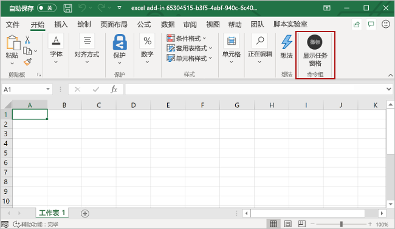

# <a name="customize-your-nodejs-sso-enabled-add-in"></a><span data-ttu-id="c5fcc-103">自定义支持您的 node.js SSO 的外接程序</span><span class="sxs-lookup"><span data-stu-id="c5fcc-103">Customize your Node.js SSO-enabled add-in</span></span>

> [!IMPORTANT]
> <span data-ttu-id="c5fcc-104">本文基于启用了 SSO 的加载项，这是通过完成[单一登录（SSO）快速入门](sso-quickstart.md)创建的。</span><span class="sxs-lookup"><span data-stu-id="c5fcc-104">This article builds upon the SSO-enabled add-in that's created by completing the [single sign-on (SSO) quick start](sso-quickstart.md).</span></span> <span data-ttu-id="c5fcc-105">阅读本文之前，请先完成快速入门。</span><span class="sxs-lookup"><span data-stu-id="c5fcc-105">Please complete the quick start before reading this article.</span></span>

<span data-ttu-id="c5fcc-106">[Sso 快速入门](sso-quickstart.md)创建启用了 sso 的加载项，以获取已登录用户的配置文件信息，并将其写入文档或邮件。</span><span class="sxs-lookup"><span data-stu-id="c5fcc-106">The [SSO quick start](sso-quickstart.md) creates an SSO-enabled add-in that gets the signed-in user's profile information and writes it to the document or message.</span></span> <span data-ttu-id="c5fcc-107">在本文中，您将逐步完成使用 SSO 快速入门中的 Yeoman 生成器来更新创建的外接程序的过程，以添加需要不同权限的新功能。</span><span class="sxs-lookup"><span data-stu-id="c5fcc-107">In this article, you'll walk through the process of updating the add-in that you created with the Yeoman generator in the SSO quick start, to add new functionality that requires different permissions.</span></span>

## <a name="prerequisites"></a><span data-ttu-id="c5fcc-108">先决条件</span><span class="sxs-lookup"><span data-stu-id="c5fcc-108">Prerequisites</span></span>

* <span data-ttu-id="c5fcc-109">按照[SSO 快速入门](sso-quickstart.md)中的说明创建的 Office 外接程序。</span><span class="sxs-lookup"><span data-stu-id="c5fcc-109">An Office Add-in that you created by following the instructions in the [SSO quick start](sso-quickstart.md).</span></span>

* <span data-ttu-id="c5fcc-110">Office 365 订阅中的 OneDrive for Business 上至少存储了一些文件和文件夹。</span><span class="sxs-lookup"><span data-stu-id="c5fcc-110">At least a few files and folders stored on OneDrive for Business in your Office 365 subscription.</span></span>

* <span data-ttu-id="c5fcc-111">[Node.js](https://nodejs.org) （最新的[LTS](https://nodejs.org/about/releases)版本）。</span><span class="sxs-lookup"><span data-stu-id="c5fcc-111">[Node.js](https://nodejs.org) (the latest [LTS](https://nodejs.org/about/releases) version).</span></span>

[!include[additional prerequisites](../includes/sso-tutorial-prereqs.md)]

## <a name="review-contents-of-the-project"></a><span data-ttu-id="c5fcc-112">查看项目的内容</span><span class="sxs-lookup"><span data-stu-id="c5fcc-112">Review contents of the project</span></span>

<span data-ttu-id="c5fcc-113">首先，先快速查看您先前[使用 Yeoman 生成器创建](sso-quickstart.md)的外接程序项目。</span><span class="sxs-lookup"><span data-stu-id="c5fcc-113">Let's begin with a quick review of the add-in project that you previously [created with the Yeoman generator](sso-quickstart.md).</span></span>

> [!NOTE]
> <span data-ttu-id="c5fcc-114">在本文引用使用 **.js**文件扩展名的脚本文件的地方，如果您的项目是使用 TypeScript 创建的，则假定为 ts 文件扩展名 **。**</span><span class="sxs-lookup"><span data-stu-id="c5fcc-114">In places where this article references script files using **.js** file extension, assume the **.ts** file extension instead if your project was created with TypeScript.</span></span>

[!include[project structure for an SSO-enabled add-in created with the Yeoman generator](../includes/sso-yeoman-project-structure.md)]

## <a name="add-new-functionality"></a><span data-ttu-id="c5fcc-115">添加新功能</span><span class="sxs-lookup"><span data-stu-id="c5fcc-115">Add new functionality</span></span> 

<span data-ttu-id="c5fcc-116">使用 SSO 快速入门创建的外接程序使用 Microsoft Graph 获取已登录用户的配置文件信息，并将该信息写入文档或邮件。</span><span class="sxs-lookup"><span data-stu-id="c5fcc-116">The add-in that you created with the SSO quick start uses Microsoft Graph to get the signed-in user's profile information and writes that information to the document or message.</span></span> <span data-ttu-id="c5fcc-117">让我们更改加载项的功能，以便从已登录用户的 OneDrive for Business 中获取前10个文件和文件夹的名称，并将该信息写入文档或邮件。</span><span class="sxs-lookup"><span data-stu-id="c5fcc-117">Let's change the add-in's functionality such that it gets the names of the top 10 files and folders from the signed-in user's OneDrive for Business and writes that information to the document or message.</span></span> <span data-ttu-id="c5fcc-118">启用此新功能需要更新 Azure 中的应用程序权限，并更新加载项项目中的代码。</span><span class="sxs-lookup"><span data-stu-id="c5fcc-118">Enabling this new functionality requires updating app permissions in Azure and updating code within the add-in project.</span></span>

### <a name="update-app-permissions-in-azure"></a><span data-ttu-id="c5fcc-119">更新 Azure 中的应用程序权限</span><span class="sxs-lookup"><span data-stu-id="c5fcc-119">Update app permissions in Azure</span></span>

<span data-ttu-id="c5fcc-120">在外接程序可以成功读取用户的 OneDrive for Business 的内容之前，必须使用适当的权限更新 Azure 中的应用程序注册信息。</span><span class="sxs-lookup"><span data-stu-id="c5fcc-120">Before the add-in can successfully read the contents of the user's OneDrive for Business, its app registration information in Azure must be updated with the appropriate permissions.</span></span> <span data-ttu-id="c5fcc-121">完成以下步骤以向应用授予**文件. read. All**权限，并撤销**用户。读取**权限，不再需要该权限。</span><span class="sxs-lookup"><span data-stu-id="c5fcc-121">Complete the following steps to grant the app the **Files.Read.All** permission and revoke the **User.Read** permission, which is no longer needed.</span></span>

1. <span data-ttu-id="c5fcc-122">导航到[Azure 门户](https://ms.portal.azure.com/#home)，并**使用你的 Office 365 管理员凭据登录**。</span><span class="sxs-lookup"><span data-stu-id="c5fcc-122">Navigate to the [Azure portal](https://ms.portal.azure.com/#home) and **sign in using your Office 365 administrator credentials**.</span></span> 

2. <span data-ttu-id="c5fcc-123">导航到 "**应用程序注册**" 页。</span><span class="sxs-lookup"><span data-stu-id="c5fcc-123">Navigate to the **App registrations** page.</span></span> 
    > [!TIP]
    > <span data-ttu-id="c5fcc-124">为此，可以在 Azure 主页上选择 "**应用注册**" 磁贴，或使用主页上的 "搜索" 框查找并选择 "**应用注册**"。</span><span class="sxs-lookup"><span data-stu-id="c5fcc-124">You can do this either by choosing the **App registrations** tile on the Azure home page or by using the search box on the home page to find and choose **App registrations**.</span></span>

3. <span data-ttu-id="c5fcc-125">在 "**应用程序注册**" 页上，选择您在快速启动过程中创建的应用程序。</span><span class="sxs-lookup"><span data-stu-id="c5fcc-125">On the **App registrations** page, choose the app that you created during the quick start.</span></span> 
    > [!TIP]
    > <span data-ttu-id="c5fcc-126">应用程序的**显示名称**将与您在使用 Yeoman 生成器创建项目时指定的外接程序名称相匹配。</span><span class="sxs-lookup"><span data-stu-id="c5fcc-126">The **Display name** of the app will match the add-in name that you specified when you created the project with the Yeoman generator.</span></span>

4. <span data-ttu-id="c5fcc-127">在 "应用程序概述" 页上，选择页面左侧 "**管理**" 标题下的 " **API 权限**"。</span><span class="sxs-lookup"><span data-stu-id="c5fcc-127">From the app overview page, choose **API permissions** under the **Manage** heading on the left side of the page.</span></span>

5. <span data-ttu-id="c5fcc-128">在 "权限" 表的 "**读取**" 行中，选择省略号，然后从出现的菜单中选择 "**撤销管理员同意**"。</span><span class="sxs-lookup"><span data-stu-id="c5fcc-128">In the **User.Read** row of the permissions table, choose the ellipsis and then select **Revoke admin consent** from the menu that appears.</span></span>

6. <span data-ttu-id="c5fcc-129">选择 **"是"、"删除"** 按钮以响应显示的提示。</span><span class="sxs-lookup"><span data-stu-id="c5fcc-129">Select the **Yes, remove** button in response to the prompt that's displayed.</span></span>

7. <span data-ttu-id="c5fcc-130">在 "权限" 表的 "**读取**" 行中，选择省略号，然后从出现的菜单中选择 "**删除权限**"。</span><span class="sxs-lookup"><span data-stu-id="c5fcc-130">In the **User.Read** row of the permissions table, choose the ellipsis and then select **Remove permission** from the menu that appears.</span></span>

8. <span data-ttu-id="c5fcc-131">选择 **"是"、"删除"** 按钮以响应显示的提示。</span><span class="sxs-lookup"><span data-stu-id="c5fcc-131">Select the **Yes, remove** button in response to the prompt that's displayed.</span></span>

9. <span data-ttu-id="c5fcc-132">选择 "**添加权限**" 按钮。</span><span class="sxs-lookup"><span data-stu-id="c5fcc-132">Select the **Add a permission** button.</span></span>

10. <span data-ttu-id="c5fcc-133">在打开的面板中选择 " **Microsoft Graph** "，然后选择 "**委派权限**"。</span><span class="sxs-lookup"><span data-stu-id="c5fcc-133">On the panel that opens choose **Microsoft Graph** and then choose **Delegated permissions**.</span></span>

11. <span data-ttu-id="c5fcc-134">在 "**请求 API 权限**" 面板上：</span><span class="sxs-lookup"><span data-stu-id="c5fcc-134">On the **Request API permissions** panel:</span></span>

    <span data-ttu-id="c5fcc-135">a.</span><span class="sxs-lookup"><span data-stu-id="c5fcc-135">a.</span></span> <span data-ttu-id="c5fcc-136">在 "**文件**" 下，选择 "**文件"。**</span><span class="sxs-lookup"><span data-stu-id="c5fcc-136">Under **Files**, select **Files.Read.All**.</span></span>

    <span data-ttu-id="c5fcc-137">b.</span><span class="sxs-lookup"><span data-stu-id="c5fcc-137">b.</span></span> <span data-ttu-id="c5fcc-138">选择面板底部的 "**添加权限**" 按钮以保存这些权限更改。</span><span class="sxs-lookup"><span data-stu-id="c5fcc-138">Select the **Add permissions** button at the bottom of the panel to save these permissions changes.</span></span>

12. <span data-ttu-id="c5fcc-139">选择 "**授予管理员同意 [租户名称]** " 按钮。</span><span class="sxs-lookup"><span data-stu-id="c5fcc-139">Select the **Grant admin consent for [tenant name]** button.</span></span>

13. <span data-ttu-id="c5fcc-140">选择 **"是"** 按钮以响应显示的提示。</span><span class="sxs-lookup"><span data-stu-id="c5fcc-140">Select the **Yes** button in response to the prompt that's displayed.</span></span>

### <a name="update-code-in-the-add-in-project"></a><span data-ttu-id="c5fcc-141">更新加载项项目中的代码</span><span class="sxs-lookup"><span data-stu-id="c5fcc-141">Update code in the add-in project</span></span>

<span data-ttu-id="c5fcc-142">若要使加载项能够读取已登录用户的 OneDrive for Business 的内容，需要执行以下操作：</span><span class="sxs-lookup"><span data-stu-id="c5fcc-142">To enable the add-in to read contents of the signed-in user's OneDrive for Business, you'll need to:</span></span>

- <span data-ttu-id="c5fcc-143">更新引用 Microsoft Graph URL、参数和必需的访问作用域的代码。</span><span class="sxs-lookup"><span data-stu-id="c5fcc-143">Update the code that references the Microsoft Graph URL, parameters, and required access scope.</span></span>

- <span data-ttu-id="c5fcc-144">更新定义任务窗格 UI 的代码，以准确描述新功能。</span><span class="sxs-lookup"><span data-stu-id="c5fcc-144">Update the code that defines the task pane UI, so that it accurately describes the new functionality.</span></span> 

- <span data-ttu-id="c5fcc-145">更新解析来自 Microsoft Graph 的响应的代码，并将其写入文档或消息。</span><span class="sxs-lookup"><span data-stu-id="c5fcc-145">Update the code that parses the response from Microsoft Graph and writes it to the document or message.</span></span>

<span data-ttu-id="c5fcc-146">以下步骤介绍了这些更新。</span><span class="sxs-lookup"><span data-stu-id="c5fcc-146">The following steps describe these updates.</span></span>

### <a name="changes-required-for-any-type-of-add-in"></a><span data-ttu-id="c5fcc-147">任何类型的外接程序所需的更改</span><span class="sxs-lookup"><span data-stu-id="c5fcc-147">Changes required for any type of add-in</span></span>

<span data-ttu-id="c5fcc-148">为您的外接程序完成以下步骤，以更改 Microsoft Graph URL、参数和访问作用域，并更新任务窗格 UI。</span><span class="sxs-lookup"><span data-stu-id="c5fcc-148">Complete the following steps for your add-in, to change the Microsoft Graph URL, parameters, and access scope, and update the taskpane UI.</span></span> <span data-ttu-id="c5fcc-149">无论你的外接程序针对哪个 Office 主机，这些步骤都相同。</span><span class="sxs-lookup"><span data-stu-id="c5fcc-149">These steps are the same, regardless of which Office host your add-in targets.</span></span>

1. <span data-ttu-id="c5fcc-150">在 **./。ENV**文件：</span><span class="sxs-lookup"><span data-stu-id="c5fcc-150">In the **./.ENV** file:</span></span>

    <span data-ttu-id="c5fcc-151">a.</span><span class="sxs-lookup"><span data-stu-id="c5fcc-151">a.</span></span> <span data-ttu-id="c5fcc-152">将`GRAPH_URL_SEGMENT=/me`替换为以下内容：`GRAPH_URL_SEGMENT=/me/drive/root/children`</span><span class="sxs-lookup"><span data-stu-id="c5fcc-152">Replace `GRAPH_URL_SEGMENT=/me` with the following: `GRAPH_URL_SEGMENT=/me/drive/root/children`</span></span>

    <span data-ttu-id="c5fcc-153">b.</span><span class="sxs-lookup"><span data-stu-id="c5fcc-153">b.</span></span> <span data-ttu-id="c5fcc-154">将`QUERY_PARAM_SEGMENT=`替换为以下内容：`QUERY_PARAM_SEGMENT=?$select=name&$top=10`</span><span class="sxs-lookup"><span data-stu-id="c5fcc-154">Replace `QUERY_PARAM_SEGMENT=` with the following: `QUERY_PARAM_SEGMENT=?$select=name&$top=10`</span></span>

    <span data-ttu-id="c5fcc-155">c.</span><span class="sxs-lookup"><span data-stu-id="c5fcc-155">c.</span></span> <span data-ttu-id="c5fcc-156">将`SCOPE=User.Read`替换为以下内容：`SCOPE=Files.Read.All`</span><span class="sxs-lookup"><span data-stu-id="c5fcc-156">Replace `SCOPE=User.Read` with the following: `SCOPE=Files.Read.All`</span></span>

2. <span data-ttu-id="c5fcc-157">在 **/manifest.xml**中，找到文件末尾`<Scope>User.Read</Scope>`附近的行，并将其替换为行`<Scope>Files.Read.All</Scope>`。</span><span class="sxs-lookup"><span data-stu-id="c5fcc-157">In **./manifest.xml**, find the line `<Scope>User.Read</Scope>` near the end of the file and replace it with the line `<Scope>Files.Read.All</Scope>`.</span></span>

3. <span data-ttu-id="c5fcc-158">在 **/src/helpers/fallbackauthdialog.js** （或在 TypeScript 项目中为 **/src/helpers/fallbackauthdialog.ts** ）中，找到字符串`https://graph.microsoft.com/User.Read`并将其替换为字符串`https://graph.microsoft.com/Files.Read.All`， `requestObj`如下所示定义：</span><span class="sxs-lookup"><span data-stu-id="c5fcc-158">In **./src/helpers/fallbackauthdialog.js** (or in **./src/helpers/fallbackauthdialog.ts** for a TypeScript project), find the string `https://graph.microsoft.com/User.Read` and replace it with the string `https://graph.microsoft.com/Files.Read.All`, such that `requestObj` is defined as follows:</span></span>

    ```javascript
    var requestObj = {
      scopes: [`https://graph.microsoft.com/Files.Read.All`]
    };
    ```

    ```typescript
    var requestObj: Object = {
      scopes: [`https://graph.microsoft.com/Files.Read.All`]
    };
    ```

4. <span data-ttu-id="c5fcc-159">在 **./src/taskpane/taskpane.html**中，查找元素`<section class="ms-firstrun-instructionstep__header">`并更新该元素中的文本，以描述外接程序的新功能。</span><span class="sxs-lookup"><span data-stu-id="c5fcc-159">In **./src/taskpane/taskpane.html**, find the element `<section class="ms-firstrun-instructionstep__header">` and update the text within that element to describe the add-in's new functionality.</span></span>

    ```html
    <section class="ms-firstrun-instructionstep__header">
        <h2 class="ms-font-m">This add-in demonstrates how to use single sign-on by making a call to Microsoft
            Graph to read content from OneDrive for Business.</h2>
        <div class="ms-firstrun-instructionstep__header--image"></div>
    </section>
    ```

5. <span data-ttu-id="c5fcc-160">在 **./src/taskpane/taskpane.html**中，查找并将字符串`Get My User Profile Information`的这两个实例都`Read my OneDrive for Business`替换为字符串。</span><span class="sxs-lookup"><span data-stu-id="c5fcc-160">In **./src/taskpane/taskpane.html**, find and replace both occurrences of the string `Get My User Profile Information` with the string `Read my OneDrive for Business`.</span></span>

    ```html
    <li class="ms-ListItem">
        <span class="ms-ListItem-primaryText">Click the <b>Read my OneDrive for Business</b>
            button.</span>
        <div class="clearfix"></div>
    </li>
    ```

    ```html
    <p align="center">
        <button id="getGraphDataButton" class="popupButton ms-Button ms-Button--primary"><span
                class="ms-Button-label">Read my OneDrive for Business</span></button>
    </p>
    ```

6. <span data-ttu-id="c5fcc-161">在 **./src/taskpane/taskpane.html**中，查找并将字符串`Your user profile information will be displayed in the document.`替换为字符串`The names of the top 10 files and folders in your OneDrive for Business will be displayed in the document or message.`。</span><span class="sxs-lookup"><span data-stu-id="c5fcc-161">In **./src/taskpane/taskpane.html**, find and replace the string `Your user profile information will be displayed in the document.` with the string `The names of the top 10 files and folders in your OneDrive for Business will be displayed in the document or message.`.</span></span>

    ```html
    <li class="ms-ListItem">
        <span class="ms-ListItem-primaryText">The names of the top 10 files and folders in your OneDrive for Business will be displayed in the document or message.</span>
        <div class="clearfix"></div>
    </li>
    ```

7. <span data-ttu-id="c5fcc-162">通过遵循与您的外接程序类型对应的部分中的指导，更新分析来自 Microsoft Graph 的响应并将其写入文档或邮件的代码：</span><span class="sxs-lookup"><span data-stu-id="c5fcc-162">Update the code that parses the response from Microsoft Graph and writes it to the document or message, by following guidance in the section that corresponds to your type of add-in:</span></span>

    - [<span data-ttu-id="c5fcc-163">Excel 加载项所需的更改（JavaScript）</span><span class="sxs-lookup"><span data-stu-id="c5fcc-163">Changes required for an Excel add-in (JavaScript)</span></span>](#changes-required-for-an-excel-add-in-javascript)
    - [<span data-ttu-id="c5fcc-164">Excel 外接程序（TypeScript）所需的更改</span><span class="sxs-lookup"><span data-stu-id="c5fcc-164">Changes required for an Excel add-in (TypeScript)</span></span>](#changes-required-for-an-excel-add-in-typescript)
    - [<span data-ttu-id="c5fcc-165">Outlook 外接程序（JavaScript）所需的更改</span><span class="sxs-lookup"><span data-stu-id="c5fcc-165">Changes required for an Outlook add-in (JavaScript)</span></span>](#changes-required-for-an-outlook-add-in-javascript)
    - [<span data-ttu-id="c5fcc-166">Outlook 外接程序（TypeScript）所需的更改</span><span class="sxs-lookup"><span data-stu-id="c5fcc-166">Changes required for an Outlook add-in (TypeScript)</span></span>](#changes-required-for-an-outlook-add-in-typescript)
    - [<span data-ttu-id="c5fcc-167">PowerPoint 加载项所需的更改（JavaScript）</span><span class="sxs-lookup"><span data-stu-id="c5fcc-167">Changes required for a PowerPoint add-in (JavaScript)</span></span>](#changes-required-for-a-powerpoint-add-in-javascript)
    - [<span data-ttu-id="c5fcc-168">PowerPoint 加载项（TypeScript）所需的更改</span><span class="sxs-lookup"><span data-stu-id="c5fcc-168">Changes required for a PowerPoint add-in (TypeScript)</span></span>](#changes-required-for-a-powerpoint-add-in-typescript)
    - [<span data-ttu-id="c5fcc-169">Word 加载项所需的更改（JavaScript）</span><span class="sxs-lookup"><span data-stu-id="c5fcc-169">Changes required for a Word add-in (JavaScript)</span></span>](#changes-required-for-a-word-add-in-javascript)
    - [<span data-ttu-id="c5fcc-170">Word 加载项（TypeScript）所需的更改</span><span class="sxs-lookup"><span data-stu-id="c5fcc-170">Changes required for a Word add-in (TypeScript)</span></span>](#changes-required-for-a-word-add-in-typescript)

### <a name="changes-required-for-an-excel-add-in-javascript"></a><span data-ttu-id="c5fcc-171">Excel 加载项所需的更改（JavaScript）</span><span class="sxs-lookup"><span data-stu-id="c5fcc-171">Changes required for an Excel add-in (JavaScript)</span></span>

<span data-ttu-id="c5fcc-172">如果外接程序是使用 JavaScript 创建的 Excel 外接程序，请在 **/src/helpers/documentHelper.js**中进行以下更改：</span><span class="sxs-lookup"><span data-stu-id="c5fcc-172">If your add-in is an Excel add-in that was created with JavaScript, make the following changes in **./src/helpers/documentHelper.js**:</span></span>

1. <span data-ttu-id="c5fcc-173">查找`writeDataToOfficeDocument`函数并将其替换为以下函数：</span><span class="sxs-lookup"><span data-stu-id="c5fcc-173">Find the `writeDataToOfficeDocument` function and replace it with the following function:</span></span>

    ```javascript
    export function writeDataToOfficeDocument(result) {
      return new OfficeExtension.Promise(function(resolve, reject) {
        try {
          writeDataToExcel(result);
          resolve();
        } catch (error) {
          reject(Error("Unable to write data to document. " + error.toString()));
        }
      });
    }
    ```

2. <span data-ttu-id="c5fcc-174">查找`filterUserProfileInfo`函数并将其替换为以下函数：</span><span class="sxs-lookup"><span data-stu-id="c5fcc-174">Find the `filterUserProfileInfo` function and replace it with the following function:</span></span>

    ```javascript
    function filterOneDriveInfo(result) {
      let itemNames = [];
      let oneDriveItems = result['value'];
      for (let item of oneDriveItems) {
        itemNames.push(item['name']);
      }
      return itemNames;
    }
    ```

3. <span data-ttu-id="c5fcc-175">查找`writeDataToExcel`函数并将其替换为以下函数：</span><span class="sxs-lookup"><span data-stu-id="c5fcc-175">Find the `writeDataToExcel` function and replace it with the following function:</span></span>

    ```javascript
    function writeDataToExcel(result) {
      return Excel.run(function (context) {
        var sheet = context.workbook.worksheets.getActiveWorksheet();
        let data = [];
        let oneDriveInfo = filterOneDriveInfo(result);

        for (let i = 0; i < oneDriveInfo.length; i++) {
          if (oneDriveInfo[i] !== null) {
            let innerArray = [];
            innerArray.push(oneDriveInfo[i]);
            data.push(innerArray);
          }
        }

        const rangeAddress = `B5:B${5 + (data.length - 1)}`;
        const range = sheet.getRange(rangeAddress);
        range.values = data;
        range.format.autofitColumns();

        return context.sync();
      });
    }
    ```

4. <span data-ttu-id="c5fcc-176">删除`writeDataToOutlook`函数。</span><span class="sxs-lookup"><span data-stu-id="c5fcc-176">Delete the `writeDataToOutlook` function.</span></span>

5. <span data-ttu-id="c5fcc-177">删除`writeDataToPowerPoint`函数。</span><span class="sxs-lookup"><span data-stu-id="c5fcc-177">Delete the `writeDataToPowerPoint` function.</span></span>

6. <span data-ttu-id="c5fcc-178">删除`writeDataToWord`函数。</span><span class="sxs-lookup"><span data-stu-id="c5fcc-178">Delete the `writeDataToWord` function.</span></span>

<span data-ttu-id="c5fcc-179">在进行这些更改后，请跳至本文的 "[试用](#try-it-out)本主题" 一节，以试用更新后的外接程序。</span><span class="sxs-lookup"><span data-stu-id="c5fcc-179">After you've made these changes, skip ahead to the [Try it out](#try-it-out) section of this article to try out your updated add-in.</span></span>

### <a name="changes-required-for-an-excel-add-in-typescript"></a><span data-ttu-id="c5fcc-180">Excel 外接程序（TypeScript）所需的更改</span><span class="sxs-lookup"><span data-stu-id="c5fcc-180">Changes required for an Excel add-in (TypeScript)</span></span>

<span data-ttu-id="c5fcc-181">如果外接程序是使用 TypeScript 创建的 Excel 外接程序，请打开 **/src/taskpane/taskpane.ts**，找到该`writeDataToOfficeDocument`函数，并将其替换为以下函数：</span><span class="sxs-lookup"><span data-stu-id="c5fcc-181">If your add-in is an Excel add-in that was created with TypeScript, open **./src/taskpane/taskpane.ts**, find the `writeDataToOfficeDocument` function, and replace it with the following function:</span></span>

```typescript
export function writeDataToOfficeDocument(result: Object): Promise<any> {
  return Excel.run(function(context) {
    const sheet = context.workbook.worksheets.getActiveWorksheet();
    let data: string[] = [];

    let itemNames: string[] = [];
    let oneDriveItems = result["value"];
    for (let item of oneDriveItems) {
      itemNames.push(item["name"]);
    }

    for (let i = 0; i < itemNames.length; i++) {
      if (itemNames[i] !== null) {
        let innerArray = [];
        innerArray.push(itemNames[i]);
        data.push(innerArray);
      }
    }
    
    const rangeAddress = `B5:B${5 + (data.length - 1)}`;
    const range = sheet.getRange(rangeAddress);
    range.values = data;
    range.format.autofitColumns();

    return context.sync();
  });
}
```

<span data-ttu-id="c5fcc-182">在进行这些更改后，请跳至本文的 "[试用](#try-it-out)本主题" 一节，以试用更新后的外接程序。</span><span class="sxs-lookup"><span data-stu-id="c5fcc-182">After you've made these changes, skip ahead to the [Try it out](#try-it-out) section of this article to try out your updated add-in.</span></span>

### <a name="changes-required-for-an-outlook-add-in-javascript"></a><span data-ttu-id="c5fcc-183">Outlook 外接程序（JavaScript）所需的更改</span><span class="sxs-lookup"><span data-stu-id="c5fcc-183">Changes required for an Outlook add-in (JavaScript)</span></span>

<span data-ttu-id="c5fcc-184">如果你的外接程序是使用 JavaScript 创建的 Outlook 外接程序，请在 **/src/helpers/documentHelper.js**中进行以下更改：</span><span class="sxs-lookup"><span data-stu-id="c5fcc-184">If your add-in is an Outlook add-in that was created with JavaScript, make the following changes in **./src/helpers/documentHelper.js**:</span></span>

1. <span data-ttu-id="c5fcc-185">查找`writeDataToOfficeDocument`函数并将其替换为以下函数：</span><span class="sxs-lookup"><span data-stu-id="c5fcc-185">Find the `writeDataToOfficeDocument` function and replace it with the following function:</span></span>

    ```javascript
    export function writeDataToOfficeDocument(result) {
      return new OfficeExtension.Promise(function(resolve, reject) {
        try {
          writeDataToOutlook(result);
          resolve();
        } catch (error) {
          reject(Error("Unable to write data to message. " + error.toString()));
        }
      });
    }
    ```

2. <span data-ttu-id="c5fcc-186">查找`filterUserProfileInfo`函数并将其替换为以下函数：</span><span class="sxs-lookup"><span data-stu-id="c5fcc-186">Find the `filterUserProfileInfo` function and replace it with the following function:</span></span>

    ```javascript
    function filterOneDriveInfo(result) {
      let itemNames = [];
      let oneDriveItems = result['value'];
      for (let item of oneDriveItems) {
        itemNames.push(item['name']);
      }
      return itemNames;
    }
    ```

3. <span data-ttu-id="c5fcc-187">查找`writeDataToOutlook`函数并将其替换为以下函数：</span><span class="sxs-lookup"><span data-stu-id="c5fcc-187">Find the `writeDataToOutlook` function and replace it with the following function:</span></span>

    ```javascript
    function writeDataToOutlook(result) {
      let data = [];
      let oneDriveInfo = filterOneDriveInfo(result);

      for (let i = 0; i < oneDriveInfo.length; i++) {
        if (oneDriveInfo[i] !== null) {
          data.push(oneDriveInfo[i]);
        }
      }

      let objectNames = "";
      for (let i = 0; i < data.length; i++) {
        objectNames += data[i] + "<br/>";
      }

      Office.context.mailbox.item.body.setSelectedDataAsync(objectNames, { coercionType: Office.CoercionType.Html });
    }
    ```

4. <span data-ttu-id="c5fcc-188">删除`writeDataToExcel`函数。</span><span class="sxs-lookup"><span data-stu-id="c5fcc-188">Delete the `writeDataToExcel` function.</span></span>

5. <span data-ttu-id="c5fcc-189">删除`writeDataToPowerPoint`函数。</span><span class="sxs-lookup"><span data-stu-id="c5fcc-189">Delete the `writeDataToPowerPoint` function.</span></span>

6. <span data-ttu-id="c5fcc-190">删除`writeDataToWord`函数。</span><span class="sxs-lookup"><span data-stu-id="c5fcc-190">Delete the `writeDataToWord` function.</span></span>

<span data-ttu-id="c5fcc-191">在进行这些更改后，请跳至本文的 "[试用](#try-it-out)本主题" 一节，以试用更新后的外接程序。</span><span class="sxs-lookup"><span data-stu-id="c5fcc-191">After you've made these changes, skip ahead to the [Try it out](#try-it-out) section of this article to try out your updated add-in.</span></span>

### <a name="changes-required-for-an-outlook-add-in-typescript"></a><span data-ttu-id="c5fcc-192">Outlook 外接程序（TypeScript）所需的更改</span><span class="sxs-lookup"><span data-stu-id="c5fcc-192">Changes required for an Outlook add-in (TypeScript)</span></span>

<span data-ttu-id="c5fcc-193">如果您的外接程序是使用 TypeScript 创建的 Outlook 外接程序，请打开 **/src/taskpane/taskpane.ts**，找到该`writeDataToOfficeDocument`函数，并将其替换为以下函数：</span><span class="sxs-lookup"><span data-stu-id="c5fcc-193">If your add-in is an Outlook add-in that was created with TypeScript, open **./src/taskpane/taskpane.ts**, find the `writeDataToOfficeDocument` function, and replace it with the following function:</span></span>

```typescript
export function writeDataToOfficeDocument(result: Object): void {
    let data: string[] = [];

    let itemNames: string[] = [];
    let oneDriveItems = result["value"];
    for (let item of oneDriveItems) {
        itemNames.push(item["name"]);
    };

    for (let i = 0; i < itemNames.length; i++) {
        if (itemNames[i] !== null) {
        data.push(itemNames[i]);
        }
    }

    let objectNames: string = "";
    for (let i = 0; i < data.length; i++) {
        objectNames += data[i] + "<br/>";
    }
    
    Office.context.mailbox.item.body.setSelectedDataAsync(objectNames, { coercionType: Office.CoercionType.Html });
}
```

<span data-ttu-id="c5fcc-194">在进行这些更改后，请跳至本文的 "[试用](#try-it-out)本主题" 一节，以试用更新后的外接程序。</span><span class="sxs-lookup"><span data-stu-id="c5fcc-194">After you've made these changes, skip ahead to the [Try it out](#try-it-out) section of this article to try out your updated add-in.</span></span>

### <a name="changes-required-for-a-powerpoint-add-in-javascript"></a><span data-ttu-id="c5fcc-195">PowerPoint 加载项所需的更改（JavaScript）</span><span class="sxs-lookup"><span data-stu-id="c5fcc-195">Changes required for a PowerPoint add-in (JavaScript)</span></span>

<span data-ttu-id="c5fcc-196">如果你的外接程序是使用 JavaScript 创建的 PowerPoint 加载项，请在 **/src/helpers/documentHelper.js**中进行以下更改：</span><span class="sxs-lookup"><span data-stu-id="c5fcc-196">If your add-in is a PowerPoint add-in that was created with JavaScript, make the following changes in **./src/helpers/documentHelper.js**:</span></span>

1. <span data-ttu-id="c5fcc-197">查找`writeDataToOfficeDocument`函数并将其替换为以下函数：</span><span class="sxs-lookup"><span data-stu-id="c5fcc-197">Find the `writeDataToOfficeDocument` function and replace it with the following function:</span></span>

    ```javascript
    export function writeDataToOfficeDocument(result) {
      return new OfficeExtension.Promise(function(resolve, reject) {
        try {
          writeDataToPowerPoint(result);
          resolve();
        } catch (error) {
          reject(Error("Unable to write data to document. " + error.toString()));
        }
      });
    }
    ```

2. <span data-ttu-id="c5fcc-198">查找`filterUserProfileInfo`函数并将其替换为以下函数：</span><span class="sxs-lookup"><span data-stu-id="c5fcc-198">Find the `filterUserProfileInfo` function and replace it with the following function:</span></span>

    ```javascript
    function filterOneDriveInfo(result) {
      let itemNames = [];
      let oneDriveItems = result['value'];
      for (let item of oneDriveItems) {
        itemNames.push(item['name']);
      }
      return itemNames;
    }
    ```

3. <span data-ttu-id="c5fcc-199">查找`writeDataToPowerPoint`函数并将其替换为以下函数：</span><span class="sxs-lookup"><span data-stu-id="c5fcc-199">Find the `writeDataToPowerPoint` function and replace it with the following function:</span></span>

    ```javascript
    function writeDataToPowerPoint(result) {
      let data = [];
      let oneDriveInfo = filterOneDriveInfo(result);

      for (let i = 0; i < oneDriveInfo.length; i++) {
        if (oneDriveInfo[i] !== null) {
          data.push(oneDriveInfo[i]);
        }
      }

      let objectNames = "";
      for (let i = 0; i < data.length; i++) {
        objectNames += data[i] + "\n";
      }

      Office.context.document.setSelectedDataAsync(
        objectNames, 
        function(asyncResult) {
          if (asyncResult.status === Office.AsyncResultStatus.Failed) {
            throw asyncResult.error.message;
          }
      });
    }
    ```

4. <span data-ttu-id="c5fcc-200">删除`writeDataToExcel`函数。</span><span class="sxs-lookup"><span data-stu-id="c5fcc-200">Delete the `writeDataToExcel` function.</span></span>

5. <span data-ttu-id="c5fcc-201">删除`writeDataToOutlook`函数。</span><span class="sxs-lookup"><span data-stu-id="c5fcc-201">Delete the `writeDataToOutlook` function.</span></span>

6. <span data-ttu-id="c5fcc-202">删除`writeDataToWord`函数。</span><span class="sxs-lookup"><span data-stu-id="c5fcc-202">Delete the `writeDataToWord` function.</span></span>

<span data-ttu-id="c5fcc-203">在进行这些更改后，请跳至本文的 "[试用](#try-it-out)本主题" 一节，以试用更新后的外接程序。</span><span class="sxs-lookup"><span data-stu-id="c5fcc-203">After you've made these changes, skip ahead to the [Try it out](#try-it-out) section of this article to try out your updated add-in.</span></span>

### <a name="changes-required-for-a-powerpoint-add-in-typescript"></a><span data-ttu-id="c5fcc-204">PowerPoint 加载项（TypeScript）所需的更改</span><span class="sxs-lookup"><span data-stu-id="c5fcc-204">Changes required for a PowerPoint add-in (TypeScript)</span></span>

<span data-ttu-id="c5fcc-205">如果您的外接程序是使用 TypeScript 创建的 PowerPoint 加载项，请打开 **/src/taskpane/taskpane.ts**，找到该`writeDataToOfficeDocument`函数，并将其替换为以下函数：</span><span class="sxs-lookup"><span data-stu-id="c5fcc-205">If your add-in is a PowerPoint add-in that was created with TypeScript, open **./src/taskpane/taskpane.ts**, find the `writeDataToOfficeDocument` function, and replace it with the following function:</span></span>

```typescript
export function writeDataToOfficeDocument(result: Object): void {
  let data: string[] = [];

  let itemNames: string[] = [];
  let oneDriveItems = result["value"];
  for (let item of oneDriveItems) {
    itemNames.push(item["name"]);
  };

  for (let i = 0; i < itemNames.length; i++) {
    if (itemNames[i] !== null) {
      data.push(itemNames[i]);
    }
  }

  let objectNames: string = "";
  for (let i = 0; i < data.length; i++) {
    objectNames += data[i] + "\n";
  }

  Office.context.document.setSelectedDataAsync(objectNames, function(asyncResult) {
    if (asyncResult.status === Office.AsyncResultStatus.Failed) {
      throw asyncResult.error.message;
    }
  });
}
```

<span data-ttu-id="c5fcc-206">在进行这些更改后，请跳至本文的 "[试用](#try-it-out)本主题" 一节，以试用更新后的外接程序。</span><span class="sxs-lookup"><span data-stu-id="c5fcc-206">After you've made these changes, skip ahead to the [Try it out](#try-it-out) section of this article to try out your updated add-in.</span></span>

### <a name="changes-required-for-a-word-add-in-javascript"></a><span data-ttu-id="c5fcc-207">Word 加载项所需的更改（JavaScript）</span><span class="sxs-lookup"><span data-stu-id="c5fcc-207">Changes required for a Word add-in (JavaScript)</span></span>

<span data-ttu-id="c5fcc-208">如果你的外接程序是使用 JavaScript 创建的 Word 外接程序，请在 **/src/helpers/documentHelper.js**中进行以下更改：</span><span class="sxs-lookup"><span data-stu-id="c5fcc-208">If your add-in is a Word add-in that was created with JavaScript, make the following changes in **./src/helpers/documentHelper.js**:</span></span>

1. <span data-ttu-id="c5fcc-209">查找`writeDataToOfficeDocument`函数并将其替换为以下函数：</span><span class="sxs-lookup"><span data-stu-id="c5fcc-209">Find the `writeDataToOfficeDocument` function and replace it with the following function:</span></span>

    ```javascript
    export function writeDataToOfficeDocument(result) {
      return new OfficeExtension.Promise(function(resolve, reject) {
        try {
          writeDataToWord(result);
          resolve();
        } catch (error) {
          reject(Error("Unable to write data to document. " + error.toString()));
        }
      });
    }
    ```

2. <span data-ttu-id="c5fcc-210">查找`filterUserProfileInfo`函数并将其替换为以下函数：</span><span class="sxs-lookup"><span data-stu-id="c5fcc-210">Find the `filterUserProfileInfo` function and replace it with the following function:</span></span>

    ```javascript
    function filterOneDriveInfo(result) {
      let itemNames = [];
      let oneDriveItems = result['value'];
      for (let item of oneDriveItems) {
        itemNames.push(item['name']);
      }
      return itemNames;
    }
    ```

3. <span data-ttu-id="c5fcc-211">查找`writeDataToWord`函数并将其替换为以下函数：</span><span class="sxs-lookup"><span data-stu-id="c5fcc-211">Find the `writeDataToWord` function and replace it with the following function:</span></span>

    ```javascript
    function writeDataToWord(result) {
      return Word.run(function (context) {
        let data = [];
        let oneDriveInfo = filterOneDriveInfo(result);

        for (let i = 0; i < oneDriveInfo.length; i++) {
          if (oneDriveInfo[i] !== null) {
            data.push(oneDriveInfo[i]);
          }
        }

        const documentBody = context.document.body;
        for (let i = 0; i < data.length; i++) {
          if (data[i] !== null) {
            documentBody.insertParagraph(data[i], "End");
          }
        }

        return context.sync();
      });
    }
    ```

4. <span data-ttu-id="c5fcc-212">删除`writeDataToExcel`函数。</span><span class="sxs-lookup"><span data-stu-id="c5fcc-212">Delete the `writeDataToExcel` function.</span></span>

5. <span data-ttu-id="c5fcc-213">删除`writeDataToOutlook`函数。</span><span class="sxs-lookup"><span data-stu-id="c5fcc-213">Delete the `writeDataToOutlook` function.</span></span>

6. <span data-ttu-id="c5fcc-214">删除`writeDataToPowerPoint`函数。</span><span class="sxs-lookup"><span data-stu-id="c5fcc-214">Delete the `writeDataToPowerPoint` function.</span></span>

<span data-ttu-id="c5fcc-215">在进行这些更改后，请跳至本文的 "[试用](#try-it-out)本主题" 一节，以试用更新后的外接程序。</span><span class="sxs-lookup"><span data-stu-id="c5fcc-215">After you've made these changes, skip ahead to the [Try it out](#try-it-out) section of this article to try out your updated add-in.</span></span>

### <a name="changes-required-for-a-word-add-in-typescript"></a><span data-ttu-id="c5fcc-216">Word 加载项（TypeScript）所需的更改</span><span class="sxs-lookup"><span data-stu-id="c5fcc-216">Changes required for a Word add-in (TypeScript)</span></span>

<span data-ttu-id="c5fcc-217">如果你的外接程序是使用 TypeScript 创建的 Word 外接程序，请打开 **/src/taskpane/taskpane.ts**，找到该`writeDataToOfficeDocument`函数，并将其替换为以下函数：</span><span class="sxs-lookup"><span data-stu-id="c5fcc-217">If your add-in is a Word add-in that was created with TypeScript, open **./src/taskpane/taskpane.ts**, find the `writeDataToOfficeDocument` function, and replace it with the following function:</span></span>

```typescript
export function writeDataToOfficeDocument(result: Object): Promise<any> {
  return Word.run(function(context) {
    let data: string[] = [];

    let itemNames: string[] = [];
    let oneDriveItems = result["value"];
    for (let item of oneDriveItems) {
      itemNames.push(item["name"]);
    };

    for (let i = 0; i < itemNames.length; i++) {
      if (itemNames[i] !== null) {
        data.push(itemNames[i]);
      }
    }

    const documentBody: Word.Body = context.document.body;
    for (let i = 0; i < data.length; i++) {
      if (data[i] !== null) {
        documentBody.insertParagraph(data[i], "End");
      }
    }
    return context.sync();
  });
}
```

<span data-ttu-id="c5fcc-218">在进行这些更改后，请继续阅读本文的 "[试用](#try-it-out)本主题" 一节，以试用更新后的外接程序。</span><span class="sxs-lookup"><span data-stu-id="c5fcc-218">After you've made these changes, continue to the [Try it out](#try-it-out) section of this article to try out your updated add-in.</span></span>

## <a name="try-it-out"></a><span data-ttu-id="c5fcc-219">试用</span><span class="sxs-lookup"><span data-stu-id="c5fcc-219">Try it out</span></span>

<span data-ttu-id="c5fcc-220">如果你的外接程序是 Excel、Word 或 PowerPoint 外接程序，请完成以下部分中的步骤以试用。如果你的外接程序是 Outlook 外接程序，请改为完成[outlook](#outlook)部分中的步骤。</span><span class="sxs-lookup"><span data-stu-id="c5fcc-220">If your add-in is an Excel, Word, or PowerPoint add-in, complete the steps in the following section to try it out. If your add-in is an Outlook add-in, complete the steps in the [Outlook](#outlook) section instead.</span></span>

### <a name="excel-word-and-powerpoint"></a><span data-ttu-id="c5fcc-221">Excel、Word 和 PowerPoint</span><span class="sxs-lookup"><span data-stu-id="c5fcc-221">Excel, Word, and PowerPoint</span></span>

<span data-ttu-id="c5fcc-222">完成以下步骤以试用 Excel、Word 或 PowerPoint 加载项。</span><span class="sxs-lookup"><span data-stu-id="c5fcc-222">Complete the following steps to try out an Excel, Word, or PowerPoint add-in.</span></span>

1. <span data-ttu-id="c5fcc-223">在项目的根文件夹中，运行以下命令以生成项目，启动本地 web 服务器，并在以前选择的 Office 客户端应用程序中旁加载您的外接程序。</span><span class="sxs-lookup"><span data-stu-id="c5fcc-223">In the root folder of the project, run the following command to build the project, start the local web server, and sideload your add-in in the previously selected Office client application.</span></span>

    > [!NOTE]
    > <span data-ttu-id="c5fcc-224">Office 加载项应使用 HTTPS，而不是 HTTP（即便是在开发时也是如此）。</span><span class="sxs-lookup"><span data-stu-id="c5fcc-224">Office Add-ins should use HTTPS, not HTTP, even when you are developing.</span></span> <span data-ttu-id="c5fcc-225">如果系统在运行以下命令后提示你安装证书，请接受提示以安装 Yeoman 生成器提供的证书。</span><span class="sxs-lookup"><span data-stu-id="c5fcc-225">If you are prompted to install a certificate after you run the following command, accept the prompt to install the certificate that the Yeoman generator provides.</span></span>

    ```command&nbsp;line
    npm start
    ```

2. <span data-ttu-id="c5fcc-226">在运行上一个命令（即 Excel、Word 或 PowerPoint）时打开的 Office 客户端应用程序中，确保您已使用与您在为应用程序[配置 SSO](sso-quickstart.md#configure-sso)时连接到 Azure 时使用的 office 365 管理员帐户相同的 office 365 组织的成员进行登录。</span><span class="sxs-lookup"><span data-stu-id="c5fcc-226">In the Office client application that opens when you run the previous command (i.e., Excel, Word or PowerPoint), make sure that you're signed in with a user that's a member of the same Office 365 organization as the Office 365 administrator account that you used to connect to Azure while [configuring SSO](sso-quickstart.md#configure-sso) for the app.</span></span> <span data-ttu-id="c5fcc-227">执行此操作，将为成功进行 SSO 建立了相应的条件。</span><span class="sxs-lookup"><span data-stu-id="c5fcc-227">Doing so establishes the appropriate conditions for SSO to succeed.</span></span> 

3. <span data-ttu-id="c5fcc-228">在 Office 客户端应用程序中，依次选择的“**开始**”选项卡和功能区中的“**显示任务窗格**”按钮，以打开加载项任务窗格。</span><span class="sxs-lookup"><span data-stu-id="c5fcc-228">In the Office client application, choose the **Home** tab, and then choose the **Show Taskpane** button in the ribbon to open the add-in task pane.</span></span> <span data-ttu-id="c5fcc-229">下图显示 Excel 中的该按钮。</span><span class="sxs-lookup"><span data-stu-id="c5fcc-229">The following image shows this button in Excel.</span></span>

    

4. <span data-ttu-id="c5fcc-231">在任务窗格底部，选择 "**读取我的 OneDrive For business** " 按钮以启动 SSO 过程。</span><span class="sxs-lookup"><span data-stu-id="c5fcc-231">At the bottom of the task pane, choose the **Read my OneDrive for Business** button to initiate the SSO process.</span></span> 

5. <span data-ttu-id="c5fcc-232">如果对话框窗口显示代表加载项请求权限，则表示 你的方案不支持 SSO，并且加载项已退回至替代的用户身份验证方法。</span><span class="sxs-lookup"><span data-stu-id="c5fcc-232">If a dialog window appears to request permissions on behalf of the add-in, this means that SSO is not supported for your scenario and the add-in has instead fallen back to an alternate method of user authentication.</span></span> <span data-ttu-id="c5fcc-233">租户管理员未向用户授予访问 Microsoft Graph 的许可，或未使用有效的 Microsoft 帐户或 Office 365 （“工作或学校”）帐户登录 Office 时，可能会出现这种情况。</span><span class="sxs-lookup"><span data-stu-id="c5fcc-233">This may occur when the tenant administrator hasn't granted consent for the add-in to access Microsoft Graph, or when the user isn't signed into Office with a valid Microsoft Account or Office 365 ("Work or School") account.</span></span> <span data-ttu-id="c5fcc-234">选择对话框窗口中的“**接受**”按钮以继续。</span><span class="sxs-lookup"><span data-stu-id="c5fcc-234">Choose the **Accept** button in the dialog window to continue.</span></span>

    

    > [!NOTE]
    > <span data-ttu-id="c5fcc-236">用户接受此权限请求后，以后将不会再收到提示。</span><span class="sxs-lookup"><span data-stu-id="c5fcc-236">After a user accepts this permissions request, they won't be prompted again in the future.</span></span>

6. <span data-ttu-id="c5fcc-237">加载项读取已登录用户的 OneDrive for Business 中的数据，并将前10个文件和文件夹的名称写入文档中。</span><span class="sxs-lookup"><span data-stu-id="c5fcc-237">The add-in reads data from the signed-in user's OneDrive for Business and writes the names of the top 10 files and folders to the document.</span></span> <span data-ttu-id="c5fcc-238">下图显示了写入 Excel 工作表的文件和文件夹名称的示例。</span><span class="sxs-lookup"><span data-stu-id="c5fcc-238">The following image shows an example of file and folder names written to an Excel worksheet.</span></span>

    

### <a name="outlook"></a><span data-ttu-id="c5fcc-240">Outlook</span><span class="sxs-lookup"><span data-stu-id="c5fcc-240">Outlook</span></span>

<span data-ttu-id="c5fcc-241">完成以下步骤以试用 Outlook 加载项。</span><span class="sxs-lookup"><span data-stu-id="c5fcc-241">Complete the following steps to try out an Outlook add-in.</span></span>

1. <span data-ttu-id="c5fcc-242">在项目的根文件夹中，运行以下命令以生成项目并启动本地 web 服务器。</span><span class="sxs-lookup"><span data-stu-id="c5fcc-242">In the root folder of the project, run the following command to build the project and start the local web server.</span></span>

    > [!NOTE]
    > <span data-ttu-id="c5fcc-243">Office 加载项应使用 HTTPS，而不是 HTTP（即便是在开发时也是如此）。</span><span class="sxs-lookup"><span data-stu-id="c5fcc-243">Office Add-ins should use HTTPS, not HTTP, even when you are developing.</span></span> <span data-ttu-id="c5fcc-244">如果系统在运行以下命令后提示你安装证书，请接受提示以安装 Yeoman 生成器提供的证书。</span><span class="sxs-lookup"><span data-stu-id="c5fcc-244">If you are prompted to install a certificate after you run the following command, accept the prompt to install the certificate that the Yeoman generator provides.</span></span>

    ```command&nbsp;line
    npm start
    ```

2. <span data-ttu-id="c5fcc-245">按照[旁加载 Outlook 加载项以供测试](/outlook/add-ins/sideload-outlook-add-ins-for-testing)中的说明操作，旁加载 Outlook 加载项。</span><span class="sxs-lookup"><span data-stu-id="c5fcc-245">Follow the instructions in [Sideload Outlook add-ins for testing](/outlook/add-ins/sideload-outlook-add-ins-for-testing) to sideload the add-in in Outlook.</span></span> <span data-ttu-id="c5fcc-246">确保您登录到 Outlook 时使用的是与 Azure 在为应用程序[配置 SSO](sso-quickstart.md#configure-sso)时使用的 office 365 管理员帐户相同的 office 365 组织的成员的用户。</span><span class="sxs-lookup"><span data-stu-id="c5fcc-246">Make sure that you're signed in to Outlook with a user that's a member of the same Office 365 organization as the Office 365 administrator account that you used to connect to Azure while [configuring SSO](sso-quickstart.md#configure-sso) for the app.</span></span> <span data-ttu-id="c5fcc-247">执行此操作，将为成功进行 SSO 建立了相应的条件。</span><span class="sxs-lookup"><span data-stu-id="c5fcc-247">Doing so establishes the appropriate conditions for SSO to succeed.</span></span> 

3. <span data-ttu-id="c5fcc-248">在 Outlook 中，撰写一封新邮件。</span><span class="sxs-lookup"><span data-stu-id="c5fcc-248">In Outlook, compose a new message.</span></span>

4. <span data-ttu-id="c5fcc-249">在“邮件撰写”窗口中，选择功能区中的“显示任务窗格”\*\*\*\* 按钮，以打开加载项任务窗格。</span><span class="sxs-lookup"><span data-stu-id="c5fcc-249">In the message compose window, choose the **Show Taskpane** button in the ribbon to open the add-in task pane.</span></span>

    

5. <span data-ttu-id="c5fcc-251">在任务窗格底部，选择 "**读取我的 OneDrive For business** " 按钮以启动 SSO 过程。</span><span class="sxs-lookup"><span data-stu-id="c5fcc-251">At the bottom of the task pane, choose the **Read my OneDrive for Business** button to initiate the SSO process.</span></span> 

6. <span data-ttu-id="c5fcc-252">如果对话框窗口显示代表加载项请求权限，则表示 你的方案不支持 SSO，并且加载项已退回至替代的用户身份验证方法。</span><span class="sxs-lookup"><span data-stu-id="c5fcc-252">If a dialog window appears to request permissions on behalf of the add-in, this means that SSO is not supported for your scenario and the add-in has instead fallen back to an alternate method of user authentication.</span></span> <span data-ttu-id="c5fcc-253">租户管理员未向用户授予访问 Microsoft Graph 的许可，或未使用有效的 Microsoft 帐户或 Office 365 （“工作或学校”）帐户登录 Office 时，可能会出现这种情况。</span><span class="sxs-lookup"><span data-stu-id="c5fcc-253">This may occur when the tenant administrator hasn't granted consent for the add-in to access Microsoft Graph, or when the user isn't signed into Office with a valid Microsoft Account or Office 365 ("Work or School") account.</span></span> <span data-ttu-id="c5fcc-254">选择对话框窗口中的“**接受**”按钮以继续。</span><span class="sxs-lookup"><span data-stu-id="c5fcc-254">Choose the **Accept** button in the dialog window to continue.</span></span>

    

    > [!NOTE]
    > <span data-ttu-id="c5fcc-256">用户接受此权限请求后，以后将不会再收到提示。</span><span class="sxs-lookup"><span data-stu-id="c5fcc-256">After a user accepts this permissions request, they won't be prompted again in the future.</span></span>

7. <span data-ttu-id="c5fcc-257">加载项读取已登录用户的 OneDrive for Business 中的数据，并将前10个文件和文件夹的名称写入电子邮件的正文中。</span><span class="sxs-lookup"><span data-stu-id="c5fcc-257">The add-in reads data from the signed-in user's OneDrive for Business and writes the names of the top 10 files and folders to the body of the email message.</span></span>

    

## <a name="next-steps"></a><span data-ttu-id="c5fcc-259">后续步骤</span><span class="sxs-lookup"><span data-stu-id="c5fcc-259">Next steps</span></span>

<span data-ttu-id="c5fcc-260">恭喜，你已成功自定义使用[sso 快速入门](sso-quickstart.md)中的 Yeoman 生成器创建的启用 SSO 的外接程序的功能。</span><span class="sxs-lookup"><span data-stu-id="c5fcc-260">Congratulations, you've successfully customized the functionality of the SSO-enabled add-in that you created with the Yeoman generator in the [SSO quick start](sso-quickstart.md).</span></span> <span data-ttu-id="c5fcc-261">若要详细了解有关 Yeoman 生成器自动完成的 SSO 配置步骤，以及有助于 SSO 流程的代码，参见“[创建使用单一登录的 Node.js Office 加载项](../develop/create-sso-office-add-ins-nodejs.md)”教程。</span><span class="sxs-lookup"><span data-stu-id="c5fcc-261">To learn more about SSO configuration steps that the Yeoman generator completed automatically, and the code that facilitates the SSO process, see the [Create a Node.js Office Add-in that uses single sign-on](../develop/create-sso-office-add-ins-nodejs.md) tutorial.</span></span>

## <a name="see-also"></a><span data-ttu-id="c5fcc-262">另请参阅</span><span class="sxs-lookup"><span data-stu-id="c5fcc-262">See also</span></span>

- [<span data-ttu-id="c5fcc-263">为 Office 加载项启用单一登录</span><span class="sxs-lookup"><span data-stu-id="c5fcc-263">Enable single sign-on for Office Add-ins</span></span>](../develop/sso-in-office-add-ins.md)
- [<span data-ttu-id="c5fcc-264">单一登录 (SSO) 快速入门</span><span class="sxs-lookup"><span data-stu-id="c5fcc-264">Single sign-on (SSO) quick start</span></span>](sso-quickstart.md)
- [<span data-ttu-id="c5fcc-265">创建使用单一登录的 Node.js Office 加载项</span><span class="sxs-lookup"><span data-stu-id="c5fcc-265">Create a Node.js Office Add-in that uses single sign-on</span></span>](../develop/create-sso-office-add-ins-nodejs.md)
- [<span data-ttu-id="c5fcc-266">排查单一登录 (SSO) 错误消息</span><span class="sxs-lookup"><span data-stu-id="c5fcc-266">Troubleshoot error messages for single sign-on (SSO)</span></span>](../develop/troubleshoot-sso-in-office-add-ins.md)
