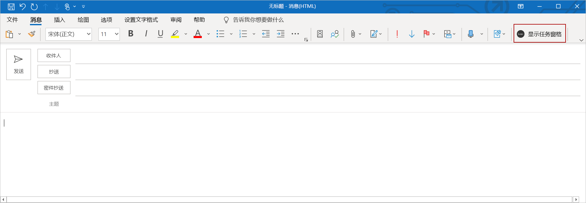

# <a name="add-microsoft-graph-functionality-to-your-sso-quick-start-project"></a>将 Microsoft Graph 功能添加到 SSO 快速入门项目

> [!IMPORTANT]
> 本文基于通过完成单一登录 (SSO 创建的已启用 SSO 的加载项 [) 快速入门](sso-quickstart.md)。 请在阅读本文之前完成快速入门。

[SSO 快速入](sso-quickstart.md)门创建启用了 SSO 的加载项，该加载项获取已登录用户的个人资料信息并将其写入文档或消息。 本文介绍如何在 SSO 快速入门中更新使用 Yeoman 生成器创建的加载项，以添加需要不同权限的新功能。

## <a name="prerequisites"></a>先决条件

- 按照 [SSO 快速入](sso-quickstart.md)门中的说明创建的Office加载项。

- Microsoft 365订阅中至少存储在OneDrive for Business上的几个文件和文件夹。

- [Node.js](https://nodejs.org)（最新[LTS](https://nodejs.org/about/releases) 版本）。

[!include[additional prerequisites](../includes/sso-tutorial-prereqs.md)]

## <a name="review-contents-of-the-project"></a>查看项目内容

让我们从你之前使用 [Yeoman 生成器创建](sso-quickstart.md)的加载项项目快速回顾一下。

> [!NOTE]
> 在本文使用 **.js** 文件扩展名引用脚本文件的地方，如果项目是使用 TypeScript 创建的，则假定 **.ts** 文件扩展名。

[!include[project structure for an SSO-enabled add-in created with the Yeoman generator](../includes/sso-yeoman-project-structure.md)]

## <a name="add-new-functionality"></a>添加新功能

使用 SSO 快速入门创建的加载项使用 Microsoft Graph 获取已登录用户的个人资料信息并将该信息写入文档或消息。 让我们更改加载项的功能，以便从已登录用户的OneDrive for Business中获取前 10 个文件和文件夹的名称，并将该信息写入文档或邮件。 启用此新功能需要更新 Azure 中的应用权限，并在外接程序项目中更新代码。

### <a name="update-app-permissions-in-azure"></a>更新 Azure 中的应用权限

在加载项能够成功读取用户OneDrive for Business的内容之前，必须在 Azure 中使用相应的权限更新其应用注册信息。 完成以下步骤，向应用授予 **Files.Read.All** 权限并撤销用户 **.读** 取权限，不再需要该权限。

1. 使用 [Microsoft 365](https://portal.azure.com)**管理员凭据登录到Azure 门户**。

1. 转到 **应用注册** 页，然后选择在快速入门过程中创建的应用注册。
    > [!TIP]
    > 应用的 **显示名称** 与使用 Yeoman 生成器创建项目时指定的加载项名称匹配。

1. 在 **“管理”** 下，选择 **API 权限**。

1. 在权限表的 **User.Read** 行中，选择省略号，然后从显示的菜单中选择 **“撤销管理员同意** ”。

    :::image type="content" source="../images/app-registration-revoke-admin-consent.png" alt-text="API 权限页上撤消管理员同意按钮的屏幕截图。":::

1. 选择 **“是”，删除** 按钮以响应显示的提示。

1. 在权限表的 **User.Read** 行中，选择省略号，然后从显示的菜单中选择 **“删除权** 限”。

    :::image type="content" source="../images/app-registration-remove-permission.png" alt-text="API 权限页上“删除权限”按钮的屏幕截图。":::

1. 选择 **“是”，删除** 按钮以响应显示的提示。

1. 选择“**添加权限**”按钮。

1. 在打开的面板上，选择 **Microsoft Graph**，然后选择 **委派权限**。

1. 在 **“请求 API 权限** ”面板上：

    a. 在 **“文件**”下，选择 **“Files.Read.All**”。

    b. 选择面板底部的 **“添加权限** ”按钮以保存这些权限更改。

1. 选择 **“授予管理员同意[租户名称]”** 按钮。

1. 选择 **“是** ”按钮以响应显示的提示。

### <a name="update-code-in-the-add-in-project"></a>更新加载项项目中的代码

若要使外接程序能够读取已登录用户OneDrive for Business的内容，需要：

- 更新引用 Microsoft Graph URL、参数和所需访问范围的代码。

- 更新定义任务窗格 UI 的代码，以便准确描述新功能。

- 更新分析来自 Microsoft Graph 的响应并将其写入文档或消息的代码。

以下步骤介绍了这些更新。

### <a name="changes-required-for-any-type-of-add-in"></a>任何类型的外接程序都需要更改

完成加载项的以下步骤，更改 Microsoft Graph URL、参数和访问范围，并更新任务窗格 UI。 无论加载项目标Office应用程序，这些步骤都是相同的。

1. 在 **./.ENV** 文件：

    a. 将 `GRAPH_URL_SEGMENT=/me` 替换为 `GRAPH_URL_SEGMENT=/me/drive/root/children`

    b. 将 `QUERY_PARAM_SEGMENT=` 替换为 `QUERY_PARAM_SEGMENT=?$select=name&$top=10`

    c. 将 `SCOPE=User.Read` 替换为 `SCOPE=Files.Read.All`

1. 在 **./manifest.xml** 中，找到文件末尾附近的行 `<Scope>User.Read</Scope>` ，并将其替换为行 `<Scope>Files.Read.All</Scope>`。

1. 在 **./src/helpers/fallbackauthdialog.js** (或 TypeScript 项目) 的 **./src/helpers/fallbackauthdialog.ts** 中，查找字符串 `https://graph.microsoft.com/User.Read` 并将其替换为字符串 `https://graph.microsoft.com/Files.Read.All`，如下 `requestObj` 所示：

    ```javascript
    var requestObj = {
      scopes: [`https://graph.microsoft.com/Files.Read.All`]
    };
    ```

    ```typescript
    var requestObj: Object = {
      scopes: [`https://graph.microsoft.com/Files.Read.All`]
    };
    ```

1. 在 **./src/taskpane/taskpane.html** 中，找到该元素 `<section class="ms-firstrun-instructionstep__header">` 并更新该元素中的文本以描述加载项的新功能。

    ```html
    <section class="ms-firstrun-instructionstep__header">
        <h2 class="ms-font-m">This add-in demonstrates how to use single sign-on by making a call to Microsoft
            Graph to read content from OneDrive for Business.</h2>
        <div class="ms-firstrun-instructionstep__header--image"></div>
    </section>
    ```

1. 在 **./src/taskpane/taskpane.html** 中，查找字符串 `Get My User Profile Information` 的两个匹配项并将其替换为 `Read my OneDrive for Business`。

    ```html
    <li class="ms-ListItem">
        <span class="ms-ListItem-primaryText">Click the <b>Read my OneDrive for Business</b>
            button.</span>
        <div class="clearfix"></div>
    </li>
    ```

    ```html
    <p align="center">
        <button id="getGraphDataButton" class="popupButton ms-Button ms-Button--primary"><span
                class="ms-Button-label">Read my OneDrive for Business</span></button>
    </p>
    ```

1. 在 **./src/taskpane/taskpane.html** 中，找到字符串 `Your user profile information will be displayed in the document.` 并将其替换为 `The names of the top 10 files and folders in your OneDrive for Business will be displayed in the document or message.`。

    ```html
    <li class="ms-ListItem">
        <span class="ms-ListItem-primaryText">The names of the top 10 files and folders in your OneDrive for Business will be displayed in the document or message.</span>
        <div class="clearfix"></div>
    </li>
    ```

1. 按照与加载项类型相对应的部分中的指导，更新分析来自 Microsoft Graph 的响应并将其写入文档或消息的代码：

    - [Office加载项 (JavaScript) 所需的更改](#changes-required-for-an-office-add-in-javascript)
    - [TypeScript (Office 加载项所需的更改) ](#changes-required-for-an-office-add-in-typescript)

### <a name="changes-required-for-an-office-add-in-javascript"></a>Office加载项 (JavaScript) 所需的更改

如果生成的Office外接程序使用 JavaScript，请在 **./src/helpers/documentHelper.js** 中进行以下更改。

1. 找到该 `filterUserProfileInfo` 函数并将其替换为以下函数。

    ```javascript
    function filterOneDriveInfo(result) {
      let itemNames = [];
      let oneDriveItems = result['value'];
      for (let item of oneDriveItems) {
        itemNames.push(item['name']);
      }
      return itemNames;
    }
    ```

1. `filterUserProfileInfo`搜索并将其替换为 `filterOneDriveInfo`。 应有四个实例要替换。

1. 保存更改。

进行这些更改后，请跳到本文的 [“试用”](#try-it-out) 部分，试用更新后的加载项。

### <a name="changes-required-for-an-office-add-in-typescript"></a>Office加载项 (TypeScript) 所需的更改

如果生成的Office外接程序使用 TypeScript，请打开 **./src/taskpane/taskpane.ts**。

1. 查找该`writeDataToOfficeDocument`函数并将其替换为以下代码，具体取决于加载项使用 (Excel、Outlook、Word 或PowerPoint) Office

#### <a name="excel-code"></a>Excel代码

```typescript
  export function writeDataToOfficeDocument(result: Object): Promise<any> {
  return Excel.run(function (context) {
    const sheet = context.workbook.worksheets.getActiveWorksheet();
    let data: string[][];

    // Get just the filenames from results
    data = result["value"].map((item) => {
      return [item.name];
    });

    const rangeAddress = `B5:B${5 + (data.length - 1)}`;
    const range = sheet.getRange(rangeAddress);
    range.values = data;
    range.format.autofitColumns();

    return context.sync();
  });
}
```

#### <a name="outlook-code"></a>Outlook代码

```typescript
export function writeDataToOfficeDocument(result: Object): void {
  // Get just the filenames from results.
  const data: string[] = result["value"].map((item) => {
    return item.name;
  });

  let userInfo: string = "";
  for (let i = 0; i < data.length; i++) {
    userInfo += data[i] + "</br>";
  }
  Office.context.mailbox.item.body.setSelectedDataAsync(userInfo, { coercionType: Office.CoercionType.Html });
}
```

#### <a name="word-code"></a>Word 代码

```typescript
export function writeDataToOfficeDocument(result: Object): Promise<any> {
  return Word.run(function (context) {
    // Get just the filenames from results.
    const data: string[] = result["value"].map((item) => {
      return item.name;
    });

    const documentBody: Word.Body = context.document.body;
    for (let i = 0; i < data.length; i++) {
      if (data[i] !== null) {
        documentBody.insertParagraph(data[i], "End");
      }
    }
    return context.sync();
  });
}
```

#### <a name="powerpoint-code"></a>PowerPoint代码

```typescript
export function writeDataToOfficeDocument(result: Object): void {
  // Get just the filenames from results.
  const data: string[] = result["value"].map((item) => {
    return item.name;
  });
  let userInfo: string = "";
  for (let i = 0; i < data.length; i++) {
    userInfo += data[i] + "\n";
  }

  Office.context.document.setSelectedDataAsync(userInfo, function (asyncResult) {
    if (asyncResult.status === Office.AsyncResultStatus.Failed) {
      throw asyncResult.error.message;
    }
  });
}
```

## <a name="try-it-out"></a>试用

如果加载项是Excel、Word 或PowerPoint加载项，请完成以下部分中的步骤来试用。如果加载项是Outlook加载项，请改为在[Outlook](#outlook)部分中完成步骤。

### <a name="excel-word-and-powerpoint"></a>Excel、Word 和 PowerPoint

完成以下步骤以试用 Excel、Word 或 PowerPoint 加载项。

1. 在项目的根文件夹中，运行以下命令来生成项目、启动本地 Web 服务器，并在之前选择的Office客户端应用程序中旁加载加载项。

    [!INCLUDE [alert use https](../includes/alert-use-https.md)]

    ```command&nbsp;line
    npm start
    ```

2. 在运行上一个命令 (（Excel、Word 或 PowerPoint) ）时打开的Office客户端应用程序中，请确保你与在配置 SSO 时连接到 Azure 的Microsoft 365管理员帐户属于同一Microsoft 365组织的成员登录[](sso-quickstart.md#configure-sso)对于应用。 执行此操作，将为成功进行 SSO 建立了相应的条件。 

3. 在 Office 客户端应用程序中，选择“**主页**”选项卡，然后选择功能区中的“**显示任务窗格**”按钮以打开加载项任务窗格。下图显示了 Excel 中的此按钮。

    

4. 在任务窗格底部，选择“**读取我的OneDrive for Business**”按钮以启动 SSO 进程。

5. 如果对话框窗口显示代表加载项请求权限，则表示 你的方案不支持 SSO，并且加载项已退回至替代的用户身份验证方法。 当租户管理员未授予使用加载项访问 Microsoft Graph 的许可，或者用户未使用有效的 Microsoft 帐户或 Microsoft 365 教育版或工作帐户登录 Office 时，则可能会出现这种情况。 选择对话框窗口中的“**接受**”按钮以继续。

    

    > [!NOTE]
    > 用户接受此权限请求后，以后将不会再收到提示。

6. 外接程序从登录用户的OneDrive for Business读取数据，并将前 10 个文件和文件夹的名称写入文档。 下图显示了写入Excel工作表的文件和文件夹名称的示例。

    

### <a name="outlook"></a>Outlook

完成以下步骤以试用 Outlook 加载项。

1. 在项目的根文件夹中，运行以下命令来生成项目、启动本地 Web 服务器并旁加载加载项。 

    [!INCLUDE [alert use https](../includes/alert-use-https.md)]

    ```command&nbsp;line
    npm start
    ```

2. 请确保已登录到与在为应用[配置 SSO](sso-quickstart.md#configure-sso) 时连接到 Azure 的Microsoft 365管理员帐户所在的同一Microsoft 365组织成员的用户Outlook。 执行此操作，将为成功进行 SSO 建立了相应的条件。

3. 在 Outlook 中，撰写一封新邮件。

4. 在“邮件撰写”窗口中，选择功能区中的“显示任务窗格”按钮，以打开加载项任务窗格。

    

5. 在任务窗格底部，选择“**读取我的OneDrive for Business**”按钮以启动 SSO 进程。

6. 如果对话框窗口显示代表加载项请求权限，则表示 你的方案不支持 SSO，并且加载项已退回至替代的用户身份验证方法。 当租户管理员未授予使用加载项访问 Microsoft Graph 的许可，或者用户未使用有效的 Microsoft 帐户或 Microsoft 365 教育版或工作帐户登录 Office 时，则可能会出现这种情况。 选择对话框窗口中的“**接受**”按钮以继续。

    

    > [!NOTE]
    > 用户接受此权限请求后，以后将不会再收到提示。

7. 外接程序从登录用户的OneDrive for Business读取数据，并将前 10 个文件和文件夹的名称写入电子邮件正文。

    

## <a name="next-steps"></a>后续步骤

恭喜，你已成功自定义在 [SSO 快速入](sso-quickstart.md)门中使用 Yeoman 生成器创建的已启用 SSO 的加载项的功能。 若要详细了解有关 Yeoman 生成器自动完成的 SSO 配置步骤，以及有助于 SSO 流程的代码，参见“[创建使用单一登录的 Node.js Office 加载项](../develop/create-sso-office-add-ins-nodejs.md)”教程。

## <a name="see-also"></a>另请参阅

- [为 Office 加载项启用单一登录](../develop/sso-in-office-add-ins.md)
- [单一登录 (SSO) 快速入门](sso-quickstart.md)
- [创建使用单一登录的 Node.js Office 加载项](../develop/create-sso-office-add-ins-nodejs.md)
- [排查单一登录 (SSO) 错误消息](../develop/troubleshoot-sso-in-office-add-ins.md)
- [使用Visual Studio Code发布](../publish/publish-add-in-vs-code.md#using-visual-studio-code-to-publish)