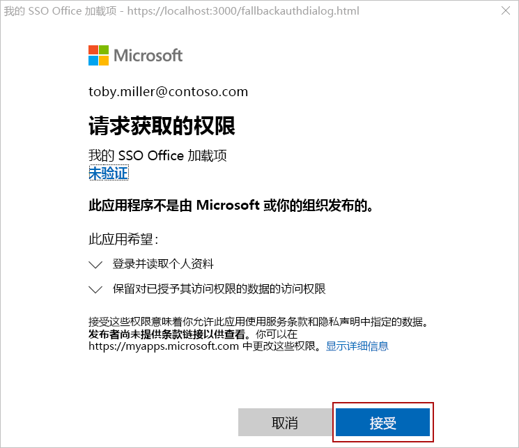
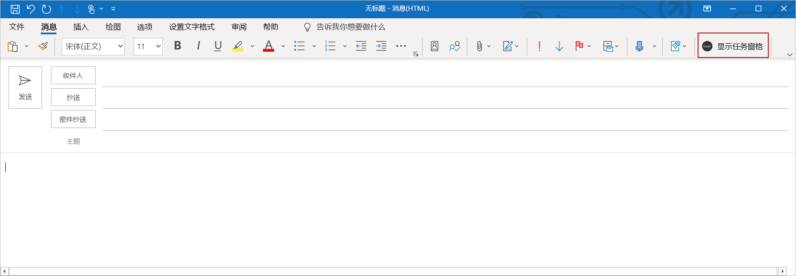
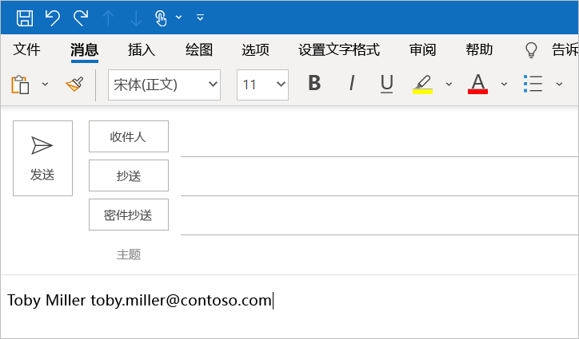

# <a name="use-the-yeoman-generator-to-create-an-office-add-in-that-uses-single-sign-on"></a><span data-ttu-id="e80b4-103">使用 Yeoman 生成器创建使用单一登录的 Node.js Office 加载项</span><span class="sxs-lookup"><span data-stu-id="e80b4-103">Use the Yeoman generator to create an Office Add-in that uses single sign-on</span></span>

<span data-ttu-id="e80b4-104">本文将介绍如何使用 Yeoman 生成器创建适用于 Excel、Outlook、Word 或 PowerPoint，尽可能使用单一登录 (SSO) 的 Office 加载项，并在不支持 SSO 时使用替代的用户身份验证方法。</span><span class="sxs-lookup"><span data-stu-id="e80b4-104">In this article, you'll walk through the process of using the Yeoman generator to create an Office Add-in for Excel, Outlook, Word, or PowerPoint that uses single sign-on (SSO) when possible, and uses an alternate method of user authentication when SSO is not supported.</span></span>

> [!TIP]
> <span data-ttu-id="e80b4-105">尝试完成此快速入门前，请查看“[为 Office 加载项启用单一登录](../develop/sso-in-office-add-ins.md)”了解有关 Office 加载项中 SSO 的基本概念。</span><span class="sxs-lookup"><span data-stu-id="e80b4-105">Before you attempt to complete this quick start, review [Enable single sign-on for Office Add-ins](../develop/sso-in-office-add-ins.md) to learn basic concepts about SSO in Office Add-ins.</span></span> 
 
<span data-ttu-id="e80b4-106">Yeoman 生成器简化了 SSO 加载项的创建流程，能够自动执行在 Azure 内配置所需的步骤，并生成加载项使用 SSO 所需的代码。</span><span class="sxs-lookup"><span data-stu-id="e80b4-106">The Yeoman generator simplifies the process of creating an SSO add-in, by automating the steps required to configure SSO within Azure and generating the code that's necessary for an add-in to use SSO.</span></span> <span data-ttu-id="e80b4-107">有关介绍如何手动完成 Yeoman 生成器自动运行步骤的详细演练，请参阅“[创建使用单一登录的 Node.js Office 加载项](../develop/create-sso-office-add-ins-nodejs.md)”教程。</span><span class="sxs-lookup"><span data-stu-id="e80b4-107">For a detailed walkthrough that describes how to manually complete the steps that the Yeoman generator automates, see the [Create a Node.js Office Add-in that uses single sign-on](../develop/create-sso-office-add-ins-nodejs.md) tutorial.</span></span>

## <a name="prerequisites"></a><span data-ttu-id="e80b4-108">先决条件</span><span class="sxs-lookup"><span data-stu-id="e80b4-108">Prerequisites</span></span>

* <span data-ttu-id="e80b4-109">[Node.js](https://nodejs.org)（最新[LTS](https://nodejs.org/about/releases) 版本）。</span><span class="sxs-lookup"><span data-stu-id="e80b4-109">[Node.js](https://nodejs.org) (the latest [LTS](https://nodejs.org/about/releases) version).</span></span>

* <span data-ttu-id="e80b4-110">最新版本的 [Yeoman](https://github.com/yeoman/yo) 和[适用于 Office 外接程序的 Yeoman 生成器](https://github.com/OfficeDev/generator-office)。若要全局安装这些工具，请从命令提示符处运行以下命令：</span><span class="sxs-lookup"><span data-stu-id="e80b4-110">The latest version of [Yeoman](https://github.com/yeoman/yo) and the [Yeoman generator for Office Add-ins](https://github.com/OfficeDev/generator-office). To install these tools globally, run the following command via the command prompt:</span></span>

    ```command&nbsp;line
    npm install -g yo generator-office
    ```

    [!include[note to update Yeoman generator](../includes/note-yeoman-generator-update.md)]

* <span data-ttu-id="e80b4-111">如果你使用的是 Mac，并且计算机上未安装 Azure CLI，则必须安装 [Homebrew](https://brew.sh/)。</span><span class="sxs-lookup"><span data-stu-id="e80b4-111">If you're using a Mac and don't have the Azure CLI installed on your machine, you must install [Homebrew](https://brew.sh/).</span></span> <span data-ttu-id="e80b4-112">在此快速入门过程中运行的 SSO 配置脚本将使用 Homebrew 来安装 Azure CLI，然后将使用 Azure CLI 在 Azure 中配置 SSO。</span><span class="sxs-lookup"><span data-stu-id="e80b4-112">The SSO configuration script that you'll run during this quick start will use Homebrew to install the Azure CLI, and will then use the Azure CLI to configure SSO within Azure.</span></span>

## <a name="create-the-add-in-project"></a><span data-ttu-id="e80b4-113">创建加载项项目</span><span class="sxs-lookup"><span data-stu-id="e80b4-113">Create the add-in project</span></span>

> [!TIP]
> <span data-ttu-id="e80b4-114">Yeoman 生成器可创建适用于 Excel、Outlook、Word 或 PowerPoint 的启用 SSO 的 Office 加载项，能够使用 JavaScript 或 TypeScript 类型的脚本创建。</span><span class="sxs-lookup"><span data-stu-id="e80b4-114">The Yeoman generator can create an SSO-enabled Office Add-in for Excel, Outlook, Word, or PowerPoint, and can be created with script type of JavaScript or TypeScript.</span></span> <span data-ttu-id="e80b4-115">下列说明指定 `JavaScript` 和 `Excel`，但应选择最适合方案的脚本类型和 Office 客户端应用程序。</span><span class="sxs-lookup"><span data-stu-id="e80b4-115">The following instructions specify `JavaScript` and `Excel`, but you should choose the script type and Office client application that best suits your scenario.</span></span>

[!include[Yeoman generator create project guidance](../includes/yo-office-command-guidance.md)]

- <span data-ttu-id="e80b4-116">**选择项目类型:** `Office Add-in Task Pane project supporting single sign-on`</span><span class="sxs-lookup"><span data-stu-id="e80b4-116">**Choose a project type:** `Office Add-in Task Pane project supporting single sign-on`</span></span>
- <span data-ttu-id="e80b4-117">**选择脚本类型:** `Javascript`</span><span class="sxs-lookup"><span data-stu-id="e80b4-117">**Choose a script type:** `Javascript`</span></span>
- <span data-ttu-id="e80b4-118">**要如何命名加载项?**</span><span class="sxs-lookup"><span data-stu-id="e80b4-118">**What do you want to name your add-in?**</span></span> `My SSO Office Add-in`
- <span data-ttu-id="e80b4-119">**要支持哪一个 Office 客户端应用程序?**</span><span class="sxs-lookup"><span data-stu-id="e80b4-119">**Which Office client application would you like to support?**</span></span> `Excel`


<span data-ttu-id="e80b4-121">完成此向导后，生成器会创建项目，并安装支持的 Node 组件。</span><span class="sxs-lookup"><span data-stu-id="e80b4-121">After you complete the wizard, the generator creates the project and installs supporting Node components.</span></span>

[!include[Yeoman generator next steps](../includes/yo-office-next-steps.md)]

## <a name="explore-the-project"></a><span data-ttu-id="e80b4-122">浏览项目</span><span class="sxs-lookup"><span data-stu-id="e80b4-122">Explore the project</span></span>

<span data-ttu-id="e80b4-123">使用 Yeoman 生成器创建的加载项项目包含适用于启用了 SSO 的任务窗格加载项代码。</span><span class="sxs-lookup"><span data-stu-id="e80b4-123">The add-in project that you've created with the Yeoman generator contains code for an SSO-enabled task pane add-in.</span></span>

[!include[project structure for an SSO-enabled add-in created with the Yeoman generator](../includes/sso-yeoman-project-structure.md)]

## <a name="configure-sso"></a><span data-ttu-id="e80b4-124">配置 SSO</span><span class="sxs-lookup"><span data-stu-id="e80b4-124">Configure SSO</span></span>

<span data-ttu-id="e80b4-125">此时，加载项项目已创建并含有简化 SSO 流程所需的代码。</span><span class="sxs-lookup"><span data-stu-id="e80b4-125">At this point, your add-in project has been created and contains the code that's necessary to facilitate the SSO process.</span></span> <span data-ttu-id="e80b4-126">接下来，完成以下步骤，为你的加载项配置 SSO。</span><span class="sxs-lookup"><span data-stu-id="e80b4-126">Next, complete the following steps to configure SSO for your add-in.</span></span>

1. <span data-ttu-id="e80b4-127">导航到项目的根文件夹。</span><span class="sxs-lookup"><span data-stu-id="e80b4-127">Navigate to the root folder of the project.</span></span>

    ```command&nbsp;line
    cd "My SSO Office Add-in"
    ```

2. <span data-ttu-id="e80b4-128">运行下列命令，为加载项配置 SSO。</span><span class="sxs-lookup"><span data-stu-id="e80b4-128">Run the following command to configure SSO for the add-in.</span></span>

    ```command&nbsp;line
    npm run configure-sso
    ```

    > [!WARNING]
    > <span data-ttu-id="e80b4-129">如果租户已配置为需要双因素验证，则此命令将失败。</span><span class="sxs-lookup"><span data-stu-id="e80b4-129">This command will fail if your tenant is configured to require two-factor authentication.</span></span> <span data-ttu-id="e80b4-130">在此情况中，需要按照“[创建使用单一登录的 Node.js Office 加载项](../develop/create-sso-office-add-ins-nodejs.md)”教程所述，手动完成 Azure 应用程序注册和 SSO 配置步骤。</span><span class="sxs-lookup"><span data-stu-id="e80b4-130">In this scenario, you'll need to manually complete the Azure app registration and SSO configuration steps, as described in the [Create a Node.js Office Add-in that uses single sign-on](../develop/create-sso-office-add-ins-nodejs.md) tutorial.</span></span>

3. <span data-ttu-id="e80b4-131">Web 浏览器窗口将打开，并提示登录 Azure。</span><span class="sxs-lookup"><span data-stu-id="e80b4-131">A web browser window will open and prompt you to sign in to Azure.</span></span> <span data-ttu-id="e80b4-132">使用现有的 Microsoft 365 管理员凭据登录到 Azure。</span><span class="sxs-lookup"><span data-stu-id="e80b4-132">Sign in to Azure using your Microsoft 365 administrator credentials.</span></span> <span data-ttu-id="e80b4-133">这些凭据将用于在 Azure 中注册新的应用程序并配置 SSO 所需的设置。</span><span class="sxs-lookup"><span data-stu-id="e80b4-133">These credentials will be used to register a new application in Azure and configure the settings required by SSO.</span></span>

    > [!NOTE]
    > <span data-ttu-id="e80b4-134">在此步骤中，如果使用非管理员凭据登录 Azure，`configure-sso` 脚本将无法向组织中的用户提供该加载项的管理员许可。</span><span class="sxs-lookup"><span data-stu-id="e80b4-134">If you sign in to Azure using non-administrator credentials during this step, the `configure-sso` script won't be able to provide administrator consent for the add-in to users within your organization.</span></span> <span data-ttu-id="e80b4-135">因此，该加载项的用户无法使用 SSO，系统将提示用户登录。</span><span class="sxs-lookup"><span data-stu-id="e80b4-135">SSO will therefore not be available to users of the add-in and they'll be prompted to sign-in.</span></span>

4. <span data-ttu-id="e80b4-136">输入凭据后，关闭浏览器窗口并返回命令提示符。</span><span class="sxs-lookup"><span data-stu-id="e80b4-136">After you enter your credentials, close the browser window and return to the command prompt.</span></span> <span data-ttu-id="e80b4-137">随着 SSO 配置流程的继续，将看到写入控制台的状态消息。</span><span class="sxs-lookup"><span data-stu-id="e80b4-137">As the SSO configuration process continues, you'll see status messages being written to the console.</span></span> <span data-ttu-id="e80b4-138">正如控制台消息所述，加载项项目中的文件会自动更新 SSO 流程所需的数据。</span><span class="sxs-lookup"><span data-stu-id="e80b4-138">As described in the console messages, files within the add-in project that the Yeoman generator created are automatically updated with data that's required by the SSO process.</span></span>

## <a name="try-it-out"></a><span data-ttu-id="e80b4-139">试用</span><span class="sxs-lookup"><span data-stu-id="e80b4-139">Try it out</span></span>

<span data-ttu-id="e80b4-140">如果已创建 Excel、Word 或 PowerPoint 加载项，请完成以下部分中的步骤进行试用。如果已创建 Outlook 加载项，请改为完成 [Outlook](#outlook) 部分中的步骤。</span><span class="sxs-lookup"><span data-stu-id="e80b4-140">If you've created an Excel, Word, or PowerPoint add-in, complete the steps in the following section to try it out. If you've created an Outlook add-in, complete the steps in the [Outlook](#outlook) section instead.</span></span>

### <a name="excel-word-and-powerpoint"></a><span data-ttu-id="e80b4-141">Excel、Word 和 PowerPoint</span><span class="sxs-lookup"><span data-stu-id="e80b4-141">Excel, Word, and PowerPoint</span></span>

<span data-ttu-id="e80b4-142">完成以下步骤以试用 Excel、Word 或 PowerPoint 加载项。</span><span class="sxs-lookup"><span data-stu-id="e80b4-142">Complete the following steps to try out an Excel, Word, or PowerPoint add-in.</span></span>

1. <span data-ttu-id="e80b4-143">SSO 配置流程完成后，运行以下命令生成项目、启动本地 Web 服务器，并旁加载之前在 Office 客户端应用程序中选定的加载项。</span><span class="sxs-lookup"><span data-stu-id="e80b4-143">When the SSO configuration process completes, run the following command to build the project, start the local web server, and sideload your add-in in the previously selected Office client application.</span></span>

    > [!NOTE]
    > <span data-ttu-id="e80b4-144">Office 加载项应使用 HTTPS，而不是 HTTP（即便是在开发时也是如此）。</span><span class="sxs-lookup"><span data-stu-id="e80b4-144">Office Add-ins should use HTTPS, not HTTP, even when you are developing.</span></span> <span data-ttu-id="e80b4-145">如果系统在运行以下命令后提示你安装证书，请接受提示以安装 Yeoman 生成器提供的证书。</span><span class="sxs-lookup"><span data-stu-id="e80b4-145">If you are prompted to install a certificate after you run the following command, accept the prompt to install the certificate that the Yeoman generator provides.</span></span>

    ```command&nbsp;line
    npm start
    ```

2. <span data-ttu-id="e80b4-146">在运行上一个命令时打开的 Office 客户端应用程序（如 Excel、Word 或 PowerPoint）中，确保登录的用户与在[上一节](#configure-sso)第 3 步中配置 SSO 时用于连接至 Azure 的 Microsoft 365 管理员帐户是同一 Microsoft 365 组织的成员。</span><span class="sxs-lookup"><span data-stu-id="e80b4-146">In the Office client application that opens when you run the previous command (i.e., Excel, Word or PowerPoint), make sure that you're signed in with a user that's a member of the same Microsoft 365 organization as the Microsoft 365 administrator account that you used to connect to Azure while configuring SSO in step 3 of the [previous section](#configure-sso).</span></span> <span data-ttu-id="e80b4-147">执行此操作，将为成功进行 SSO 建立了相应的条件。</span><span class="sxs-lookup"><span data-stu-id="e80b4-147">Doing so establishes the appropriate conditions for SSO to succeed.</span></span> 

3. <span data-ttu-id="e80b4-148">在 Office 客户端应用程序中，依次选择的“**开始**”选项卡和功能区中的“**显示任务窗格**”按钮，以打开加载项任务窗格。</span><span class="sxs-lookup"><span data-stu-id="e80b4-148">In the Office client application, choose the **Home** tab, and then choose the **Show Taskpane** button in the ribbon to open the add-in task pane.</span></span> <span data-ttu-id="e80b4-149">下图显示 Excel 中的该按钮。</span><span class="sxs-lookup"><span data-stu-id="e80b4-149">The following image shows this button in Excel.</span></span>

    

4. <span data-ttu-id="e80b4-151">在任务窗格底部，选择 “**获取我的用户配置文件信息**”按钮以开始 SSO 流程。</span><span class="sxs-lookup"><span data-stu-id="e80b4-151">At the bottom of the task pane, choose the **Get My User Profile Information** button to initiate the SSO process.</span></span> 

5. <span data-ttu-id="e80b4-152">如果对话框窗口显示代表加载项请求权限，则表示 你的方案不支持 SSO，并且加载项已退回至替代的用户身份验证方法。</span><span class="sxs-lookup"><span data-stu-id="e80b4-152">If a dialog window appears to request permissions on behalf of the add-in, this means that SSO is not supported for your scenario and the add-in has instead fallen back to an alternate method of user authentication.</span></span> <span data-ttu-id="e80b4-153">当租户管理员未授予使用加载项访问 Microsoft Graph 的许可，或者用户未使用有效的 Microsoft 帐户或 Microsoft 365 教育版或工作帐户登录 Office 时，则可能会出现这种情况。</span><span class="sxs-lookup"><span data-stu-id="e80b4-153">This may occur when the tenant administrator hasn't granted consent for the add-in to access Microsoft Graph, or when the user isn't signed into Office with a valid Microsoft account or Microsoft 365 Education or Work account.</span></span> <span data-ttu-id="e80b4-154">选择对话框窗口中的“**接受**”按钮以继续。</span><span class="sxs-lookup"><span data-stu-id="e80b4-154">Choose the **Accept** button in the dialog window to continue.</span></span>

    

    > [!NOTE]
    > <span data-ttu-id="e80b4-156">用户接受此权限请求后，以后将不会再收到提示。</span><span class="sxs-lookup"><span data-stu-id="e80b4-156">After a user accepts this permissions request, they won't be prompted again in the future.</span></span>

6. <span data-ttu-id="e80b4-157">加载项检索已登录用户的配置文件信息并写入至文档中。</span><span class="sxs-lookup"><span data-stu-id="e80b4-157">The add-in retrieves profile information for the signed-in user and writes it to the document.</span></span> <span data-ttu-id="e80b4-158">下图显示了写入至 Excel 工作表的配置文件信息的实例。</span><span class="sxs-lookup"><span data-stu-id="e80b4-158">The following image shows an example of profile information written to an Excel worksheet.</span></span>

    

### <a name="outlook"></a><span data-ttu-id="e80b4-160">Outlook</span><span class="sxs-lookup"><span data-stu-id="e80b4-160">Outlook</span></span>

<span data-ttu-id="e80b4-161">完成以下步骤以试用 Outlook 加载项。</span><span class="sxs-lookup"><span data-stu-id="e80b4-161">Complete the following steps to try out an Outlook add-in.</span></span>

1. <span data-ttu-id="e80b4-162">SSO 配置过程完成后，运行以下命令生成项目并启动本地 Web 服务器。</span><span class="sxs-lookup"><span data-stu-id="e80b4-162">When the SSO configuration process completes, run the following command to build the project and start the local web server.</span></span>

    > [!NOTE]
    > <span data-ttu-id="e80b4-163">Office 加载项应使用 HTTPS，而不是 HTTP（即便是在开发时也是如此）。</span><span class="sxs-lookup"><span data-stu-id="e80b4-163">Office Add-ins should use HTTPS, not HTTP, even when you are developing.</span></span> <span data-ttu-id="e80b4-164">如果系统在运行以下命令后提示你安装证书，请接受提示以安装 Yeoman 生成器提供的证书。</span><span class="sxs-lookup"><span data-stu-id="e80b4-164">If you are prompted to install a certificate after you run the following command, accept the prompt to install the certificate that the Yeoman generator provides.</span></span>

    ```command&nbsp;line
    npm start
    ```

2. <span data-ttu-id="e80b4-165">按照[旁加载 Outlook 加载项以供测试](../outlook/sideload-outlook-add-ins-for-testing.md)中的说明操作，旁加载加载项。</span><span class="sxs-lookup"><span data-stu-id="e80b4-165">Follow the instructions in [Sideload Outlook add-ins for testing](../outlook/sideload-outlook-add-ins-for-testing.md) to sideload the add-in in Outlook.</span></span> <span data-ttu-id="e80b4-166">确保用于登录 Outlook 的用户与在[上一节](#configure-sso)第 3 步中配置 SSO 时用于连接至 Azure 的 Microsoft 365 管理员帐户是同一 Microsoft 365 组织的成员。</span><span class="sxs-lookup"><span data-stu-id="e80b4-166">Make sure that you're signed in to Outlook with a user that's a member of the same Microsoft 365 organization as the Microsoft 365 administrator account that you used to connect to Azure while configuring SSO in step 3 of the [previous section](#configure-sso).</span></span> <span data-ttu-id="e80b4-167">执行此操作，将为成功进行 SSO 建立了相应的条件。</span><span class="sxs-lookup"><span data-stu-id="e80b4-167">Doing so establishes the appropriate conditions for SSO to succeed.</span></span> 

3. <span data-ttu-id="e80b4-168">在 Outlook 中，撰写一封新邮件。</span><span class="sxs-lookup"><span data-stu-id="e80b4-168">In Outlook, compose a new message.</span></span>

4. <span data-ttu-id="e80b4-169">在“邮件撰写”窗口中，选择功能区中的“显示任务窗格”\*\*\*\* 按钮，以打开加载项任务窗格。</span><span class="sxs-lookup"><span data-stu-id="e80b4-169">In the message compose window, choose the **Show Taskpane** button in the ribbon to open the add-in task pane.</span></span>

    

5. <span data-ttu-id="e80b4-171">在任务窗格底部，选择“获取我的用户配置文件信息”\*\*\*\* 按钮以开始 SSO 流程。</span><span class="sxs-lookup"><span data-stu-id="e80b4-171">At the bottom of the task pane, choose the **Get My User Profile Information** button to initiate the SSO process.</span></span> 

6. <span data-ttu-id="e80b4-172">如果对话框窗口显示代表加载项请求权限，则表示 你的方案不支持 SSO，并且加载项已退回至替代的用户身份验证方法。</span><span class="sxs-lookup"><span data-stu-id="e80b4-172">If a dialog window appears to request permissions on behalf of the add-in, this means that SSO is not supported for your scenario and the add-in has instead fallen back to an alternate method of user authentication.</span></span> <span data-ttu-id="e80b4-173">当租户管理员未授予使用加载项访问 Microsoft Graph 的许可，或者用户未使用有效的 Microsoft 帐户或 Microsoft 365 教育版或工作帐户登录 Office 时，则可能会出现这种情况。</span><span class="sxs-lookup"><span data-stu-id="e80b4-173">This may occur when the tenant administrator hasn't granted consent for the add-in to access Microsoft Graph, or when the user isn't signed into Office with a valid Microsoft account or Microsoft 365 Education or Work account.</span></span> <span data-ttu-id="e80b4-174">选择对话框窗口中的“**接受**”按钮以继续。</span><span class="sxs-lookup"><span data-stu-id="e80b4-174">Choose the **Accept** button in the dialog window to continue.</span></span>

    

    > [!NOTE]
    > <span data-ttu-id="e80b4-176">用户接受此权限请求后，以后将不会再收到提示。</span><span class="sxs-lookup"><span data-stu-id="e80b4-176">After a user accepts this permissions request, they won't be prompted again in the future.</span></span>

7. <span data-ttu-id="e80b4-177">加载项检索已登录用户的配置文件信息并写入至电子邮件的正文中。</span><span class="sxs-lookup"><span data-stu-id="e80b4-177">The add-in retrieves profile information for the signed-in user and writes it to the body of the email message.</span></span> 

    

## <a name="next-steps"></a><span data-ttu-id="e80b4-179">后续步骤</span><span class="sxs-lookup"><span data-stu-id="e80b4-179">Next steps</span></span>

<span data-ttu-id="e80b4-180">祝贺你成功创建了可能使用 SSO 的任务窗格加载项，并在不支持 SSO 时，使用替代用户身份验证方法。</span><span class="sxs-lookup"><span data-stu-id="e80b4-180">Congratulations, you've successfully created a task pane add-in that uses SSO when possible, and uses an alternate method of user authentication when SSO is not supported.</span></span> <span data-ttu-id="e80b4-181">若要了解如何自定义加载项以添加需要不同权限的新功能，请参阅 “[自定义启用了 Node.js SSO 的加载项](sso-quickstart-customize.md)”。</span><span class="sxs-lookup"><span data-stu-id="e80b4-181">To learn about customizing your add-in to add new functionality that requires different permissions, see [Customize your Node.js SSO-enabled add-in](sso-quickstart-customize.md).</span></span>

## <a name="see-also"></a><span data-ttu-id="e80b4-182">另请参阅</span><span class="sxs-lookup"><span data-stu-id="e80b4-182">See also</span></span>

- [<span data-ttu-id="e80b4-183">为 Office 加载项启用单一登录</span><span class="sxs-lookup"><span data-stu-id="e80b4-183">Enable single sign-on for Office Add-ins</span></span>](../develop/sso-in-office-add-ins.md)
- [<span data-ttu-id="e80b4-184">自定义启用了 Node.js SSO 的加载项</span><span class="sxs-lookup"><span data-stu-id="e80b4-184">Customize your Node.js SSO-enabled add-in</span></span>](sso-quickstart-customize.md)
- [<span data-ttu-id="e80b4-185">创建使用单一登录的 Node.js Office 加载项</span><span class="sxs-lookup"><span data-stu-id="e80b4-185">Create a Node.js Office Add-in that uses single sign-on</span></span>](../develop/create-sso-office-add-ins-nodejs.md)
- [<span data-ttu-id="e80b4-186">排查单一登录 (SSO) 错误消息</span><span class="sxs-lookup"><span data-stu-id="e80b4-186">Troubleshoot error messages for single sign-on (SSO)</span></span>](../develop/troubleshoot-sso-in-office-add-ins.md)