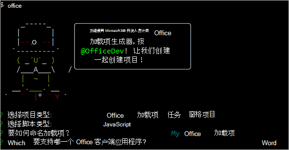
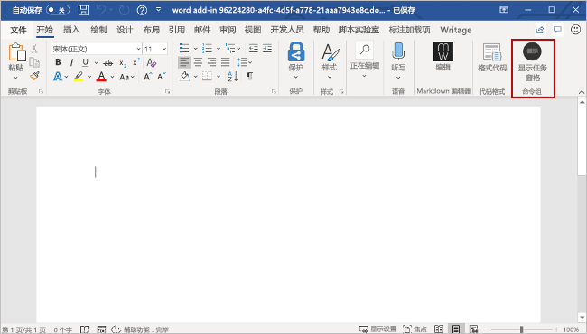
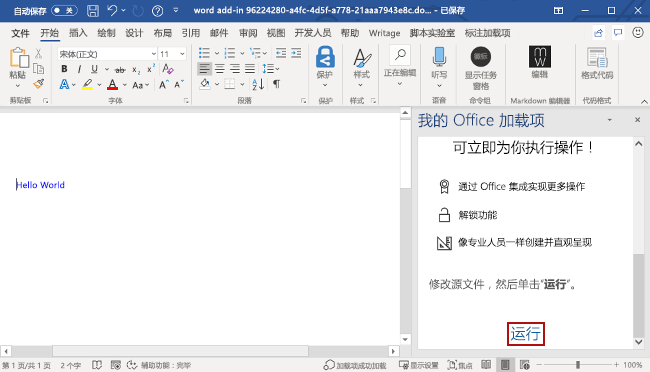
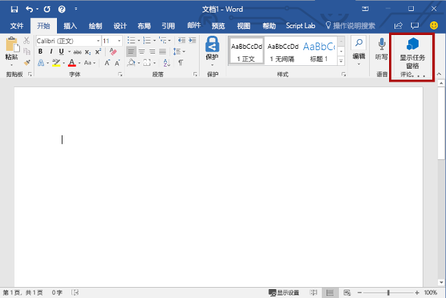
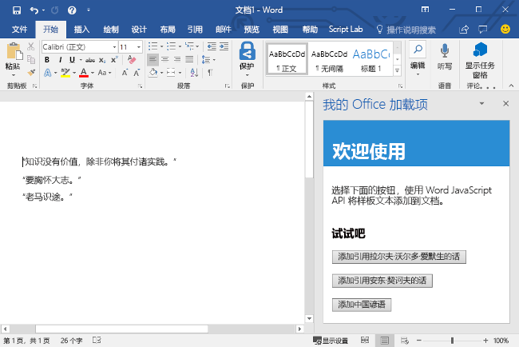

# <a name="build-your-first-word-task-pane-add-in"></a>生成首个 Word 任务窗格加载项

本文将逐步介绍如何生成 Word 任务窗格加载项。

## <a name="create-the-add-in"></a>创建加载项

[!include[Choose your editor](../includes/quickstart-choose-editor.md)]

# <a name="yeoman-generator"></a>[Yeoman 生成器](#tab/yeomangenerator)

### <a name="prerequisites"></a>先决条件

[!include[Set up requirements](../includes/set-up-dev-environment-beforehand.md)]
[!include[Yeoman generator prerequisites](../includes/quickstart-yo-prerequisites.md)]

### <a name="create-the-add-in-project"></a>创建加载项项目

[!include[Yeoman generator create project guidance](../includes/yo-office-command-guidance.md)]

- **选择项目类型:** `Office Add-in Task Pane project`
- **选择脚本类型:** `Javascript`
- **要如何命名加载项?** `My Office Add-in`
- **要支持哪一个 Office 客户端应用程序?** `Word`



完成此向导后，生成器会创建项目，并安装支持的 Node 组件。

[!include[Yeoman generator next steps](../includes/yo-office-next-steps.md)]

### <a name="explore-the-project"></a>浏览项目

[!include[Yeoman generator add-in project components](../includes/yo-task-pane-project-components-js.md)]

### <a name="try-it-out"></a>试用

1. 导航到项目的根文件夹。

    ```command&nbsp;line
    cd "My Office Add-in"
    ```

1. 完成以下步骤，以启动本地 Web 服务器并旁加载你的加载项。

    [!INCLUDE [alert use https](../includes/alert-use-https.md)]

    > [!TIP]
    > 如果在 Mac 上测试加载项，请先运行以下命令，然后再继续。 运行此命令时，本地 Web 服务器将启动。
    >
    > ```command&nbsp;line
    > npm run dev-server
    > ```

    - 若要在 Word 中测试加载项，请在项目的根目录中运行以下命令。 这将启动本地的 Web 服务器（如果尚未运行的话），并使用加载的加载项打开 Word。

        ```command&nbsp;line
        npm start
        ```

    - 若要在浏览器版 Word 中测试加载项，请在项目的根目录中运行以下命令。 运行此命令时，本地 Web 服务器将启动。 将“{url}”替换为你有权访问的 OneDrive 或 SharePoint 库中 Word 文档的 URL。

        [!INCLUDE [npm start:web command syntax](../includes/start-web-sideload-instructions.md)]

1. 在 Word 中，打开新的文档，依次选择“**主页**”选项卡和功能区中的“**显示任务窗格**”按钮，以打开加载项任务窗格。

    

1. 在任务窗格底部，选择“**运行**”链接，以将文本“Hello World”以蓝色字体添加到文档中。

    

### <a name="next-steps"></a>后续步骤

Congratulations, you've successfully created a Word task pane add-in! Next, learn more about the capabilities of a Word add-in and build a more complex add-in by following along with the [Word add-in tutorial](../tutorials/word-tutorial.md).

# <a name="visual-studio"></a>[Visual Studio](#tab/visualstudio)

### <a name="prerequisites"></a>先决条件

[!include[Quick Start prerequisites](../includes/quickstart-vs-prerequisites.md)]

### <a name="create-the-add-in-project"></a>创建加载项项目

1. 在 Visual Studio 中，选择“**新建项目**”。

2. 使用搜索框，输入 **外接程序**。 选择“**Word Web 外接程序**”，然后选择“**下一步**”。

3. 对项目命名，然后选择“**创建**”。

4. Visual Studio creates a solution and its two projects appear in **Solution Explorer**. The **Home.html** file opens in Visual Studio.

### <a name="explore-the-visual-studio-solution"></a>探索 Visual Studio 解决方案

[!include[Description of Visual Studio projects](../includes/quickstart-vs-solution.md)]

### <a name="update-the-code"></a>更新代码

1. **Home.html** specifies the HTML that will be rendered in the add-in's task pane. In **Home.html**, replace the `<body>` element with the following markup and save the file.

    ```html
    <body>
        <div id="content-header">
            <div class="padding">
                <h1>Welcome</h1>
            </div>
        </div>
        <div id="content-main">
            <div class="padding">
                <p>Choose the buttons below to add boilerplate text to the document by using the Word JavaScript API.</p>
                <br />
                <h3>Try it out</h3>
                <button id="emerson">Add quote from Ralph Waldo Emerson</button>
                <br /><br />
                <button id="checkhov">Add quote from Anton Chekhov</button>
                <br /><br />
                <button id="proverb">Add Chinese proverb</button>
            </div>
        </div>
        <br />
        <div id="supportedVersion"/>
    </body>
    ```

2. Open the file **Home.js** in the root of the web application project. This file specifies the script for the add-in. Replace the entire contents with the following code and save the file.

    [!include[Information about the use of ES6 JavaScript](../includes/modern-js-note.md)]

    ```js
    'use strict';

    (function () {

        Office.onReady(function() {
            // Office is ready.
            $(document).ready(function () {
                // The document is ready.
                // Use this to check whether the API is supported in the Word client.
                if (Office.context.requirements.isSetSupported('WordApi', '1.1')) {
                    // Do something that is only available via the new APIs.
                    $('#emerson').click(insertEmersonQuoteAtSelection);
                    $('#checkhov').click(insertChekhovQuoteAtTheBeginning);
                    $('#proverb').click(insertChineseProverbAtTheEnd);
                    $('#supportedVersion').html('This code is using Word 2016 or later.');
                }
                else {
                    // Just letting you know that this code will not work with your version of Word.
                    $('#supportedVersion').html('This code requires Word 2016 or later.');
                }
            });
        });

        async function insertEmersonQuoteAtSelection() {
            await Word.run(async (context) => {

                // Create a proxy object for the document.
                const thisDocument = context.document;

                // Queue a command to get the current selection.
                // Create a proxy range object for the selection.
                const range = thisDocument.getSelection();

                // Queue a command to replace the selected text.
                range.insertText('"Hitch your wagon to a star."\n', Word.InsertLocation.replace);

                // Synchronize the document state by executing the queued commands,
                // and return a promise to indicate task completion.
                await context.sync();
                console.log('Added a quote from Ralph Waldo Emerson.');
            })
            .catch(function (error) {
                console.log('Error: ' + JSON.stringify(error));
                if (error instanceof OfficeExtension.Error) {
                    console.log('Debug info: ' + JSON.stringify(error.debugInfo));
                }
            });
        }

        async function insertChekhovQuoteAtTheBeginning() {
            await Word.run(async (context) => {

                // Create a proxy object for the document body.
                const body = context.document.body;

                // Queue a command to insert text at the start of the document body.
                body.insertText('"Knowledge is of no value unless you put it into practice."\n', Word.InsertLocation.start);

                // Synchronize the document state by executing the queued commands,
                // and return a promise to indicate task completion.
                await context.sync();
                console.log('Added a quote from Anton Chekhov.');
            })
            .catch(function (error) {
                console.log('Error: ' + JSON.stringify(error));
                if (error instanceof OfficeExtension.Error) {
                    console.log('Debug info: ' + JSON.stringify(error.debugInfo));
                }
            });
        }

        async function insertChineseProverbAtTheEnd() {
            await Word.run(async (context) => {

                // Create a proxy object for the document body.
                const body = context.document.body;

                // Queue a command to insert text at the end of the document body.
                body.insertText('"To know the road ahead, ask those coming back."\n', Word.InsertLocation.end);

                // Synchronize the document state by executing the queued commands,
                // and return a promise to indicate task completion.
                await context.sync();
                console.log('Added a quote from a Chinese proverb.');
            })
            .catch(function (error) {
                console.log('Error: ' + JSON.stringify(error));
                if (error instanceof OfficeExtension.Error) {
                    console.log('Debug info: ' + JSON.stringify(error.debugInfo));
                }
            });
        }
    })();
    ```

3. Open the file **Home.css** in the root of the web application project. This file specifies the custom styles for the add-in. Replace the entire contents with the following code and save the file.

    ```css
    #content-header {
        background: #2a8dd4;
        color: #fff;
        position: absolute;
        top: 0;
        left: 0;
        width: 100%;
        height: 80px;
        overflow: hidden;
    }

    #content-main {
        background: #fff;
        position: fixed;
        top: 80px;
        left: 0;
        right: 0;
        bottom: 0;
        overflow: auto;
    }

    .padding {
        padding: 15px;
    }
    ```

### <a name="update-the-manifest"></a>更新清单

1. Open the XML manifest file in the add-in project. This file defines the add-in's settings and capabilities.

2. `ProviderName` 元素具有占位符值。 将其替换为你的姓名。

3. `DisplayName` 元素的 `DefaultValue` 属性有占位符。 将它替换为“My Office Add-in”。

4. `Description` 元素的 `DefaultValue` 属性有占位符。 将它替换为“A task pane add-in for Word”。

5. 保存文件。

    ```xml
    ...
    <ProviderName>John Doe</ProviderName>
    <DefaultLocale>en-US</DefaultLocale>
    <!-- The display name of your add-in. Used on the store and various places of the Office UI such as the add-ins dialog. -->
    <DisplayName DefaultValue="My Office Add-in" />
    <Description DefaultValue="A task pane add-in for Word"/>
    ...
    ```

### <a name="try-it-out"></a>试用

1. Using Visual Studio, test the newly created Word add-in by pressing **F5** or choosing **Debug** > **Start Debugging** to launch Word with the **Show Taskpane** add-in button displayed in the ribbon. The add-in will be hosted locally on IIS.

2. 在 Word 中，依次选择“开始”选项卡和功能区中的“显示任务窗格”按钮，以打开加载项任务窗格。  (如果使用的是批量许可的 Office 永久版本，而不是 Microsoft 365 版本或零售永久版本，则不支持自定义按钮。 相反，任务窗格将立即打开。）

    

3. 选择任务窗格中的任意按钮，将样本文字添加到文档。

    

[!include[Console tool note](../includes/console-tool-note.md)]

### <a name="next-steps"></a>后续步骤

恭喜！已成功创建 Word 任务窗格加载项！ 接下来，了解有关[使用 Visual Studio 开发 Office 加载项](../develop/develop-add-ins-visual-studio.md)的详细信息。

---

## <a name="see-also"></a>另请参阅

- [Office 加载项平台概述](../overview/office-add-ins.md)
- [开发 Office 加载项](../develop/develop-overview.md)
- [Word 加载项概述](../word/word-add-ins-programming-overview.md)
- 
  [Word 加载项代码示例](https://developer.microsoft.com/office/gallery/?filterBy=Samples,Word)
- [Word JavaScript API 参考](../reference/overview/word-add-ins-reference-overview.md)
- [使用 Visual Studio Code 发布](../publish/publish-add-in-vs-code.md#using-visual-studio-code-to-publish)