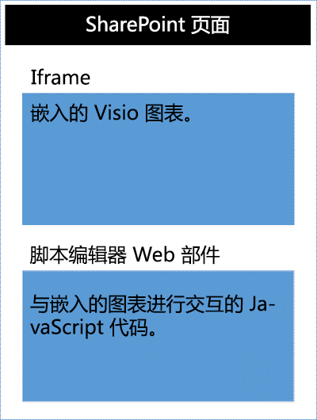
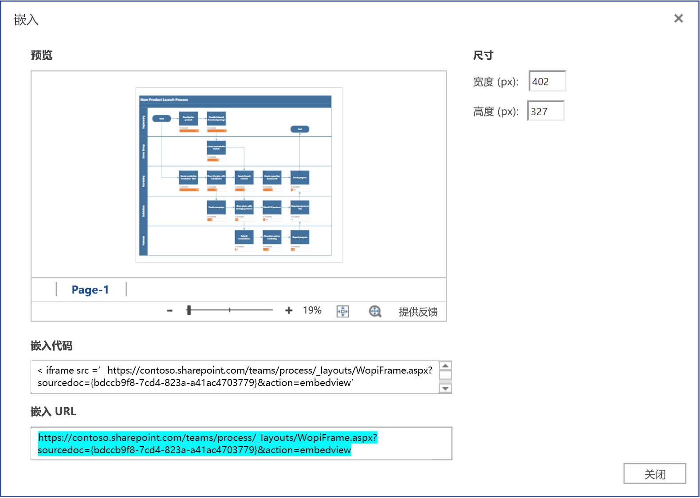

# <a name="visio-javascript-api-overview"></a><span data-ttu-id="e120b-102">Visio JavaScript API 概述</span><span class="sxs-lookup"><span data-stu-id="e120b-102">OneNote JavaScript API overview</span></span>

<span data-ttu-id="e120b-103">可以使用 Visio JavaScript API 在 SharePoint Online 中嵌入 Visio 图表。</span><span class="sxs-lookup"><span data-stu-id="e120b-103">You can use the Visio JavaScript APIs to embed Visio diagrams in SharePoint Online.</span></span> <span data-ttu-id="e120b-104">嵌入的 Visio 图表是存储在 SharePoint 文档库并在 SharePoint 页面上显示的图表。</span><span class="sxs-lookup"><span data-stu-id="e120b-104">An embedded Visio diagram is a diagram that is stored in a SharePoint document library and displayed on a SharePoint page.</span></span> <span data-ttu-id="e120b-105">若要嵌入 Visio 图表，请在 HTML `<iframe>` 元素中显示它。</span><span class="sxs-lookup"><span data-stu-id="e120b-105">To embed a Visio diagram, display it in an HTML `<iframe>`iframe element.</span></span> <span data-ttu-id="e120b-106">然后，可以使用 Visio JavaScript API 以程序化方式处理嵌入的图表。</span><span class="sxs-lookup"><span data-stu-id="e120b-106">Then you can use Visio JavaScript APIs to programmatically work with the embedded diagram.</span></span>




<span data-ttu-id="e120b-108">可以使用 Visio JavaScript API 执行以下操作：</span><span class="sxs-lookup"><span data-stu-id="e120b-108">You can use the Visio JavaScript APIs to:</span></span>

* <span data-ttu-id="e120b-109">与页面、形状等 Visio 图表元素进行交互。</span><span class="sxs-lookup"><span data-stu-id="e120b-109">Interact with Visio diagram elements like pages and shapes</span></span>
* <span data-ttu-id="e120b-110">在 Visio 图表画布上创建视觉标记。</span><span class="sxs-lookup"><span data-stu-id="e120b-110">Create visual markup on the Visio diagram canvas</span></span>
* <span data-ttu-id="e120b-111">为绘图中的鼠标事件编写自定义处理程序。</span><span class="sxs-lookup"><span data-stu-id="e120b-111">Write custom handlers for mouse events within the drawing</span></span>
* <span data-ttu-id="e120b-112">向解决方案公开图表数据，如形状文本、形状数据和超链接。</span><span class="sxs-lookup"><span data-stu-id="e120b-112">Expose diagram data, such as shape text, shape data, and hyperlinks, to your solution.</span></span>

<span data-ttu-id="e120b-p102">本文介绍了如何通过结合使用 Visio JavaScript API 和 Visio Online 来生成 SharePoint Online 解决方案。具体介绍了有关使用 API（如 **EmbeddedSession**、**RequestContext**、JavaScript 代理对象、**sync()**、**Visio.run()** 和 **load()** 方法）的基本概念。下面这些代码示例展示了如何应用这些概念。</span><span class="sxs-lookup"><span data-stu-id="e120b-p102">This article describes how to use the Visio JavaScript APIs with Visio Online to build your solutions for SharePoint Online. It introduces key concepts that are fundamental to using the APIs, such as **EmbeddedSession**, **RequestContext**, and JavaScript proxy objects, and the **sync()**, **Visio.run()**, and **load()** methods. The code examples show you how to apply these concepts.</span></span>

## <a name="embeddedsession"></a><span data-ttu-id="e120b-116">EmbeddedSession</span><span class="sxs-lookup"><span data-stu-id="e120b-116">EmbeddedSession</span></span>

<span data-ttu-id="e120b-117">EmbeddedSession 对象初始化开发者框架和 Visio Online 框架之间的通信。</span><span class="sxs-lookup"><span data-stu-id="e120b-117">The EmbeddedSession object initializes communication between the developer frame and the Visio Online frame.</span></span>

```js
var session = new OfficeExtension.EmbeddedSession(url, { id: "embed-iframe",container: document.getElementById("iframeHost") });
session.init().then(function () {
    window.console.log("Session successfully initialized");
});
```

## <a name="visiorunsession-functioncontext--batch-"></a><span data-ttu-id="e120b-118">Visio.run(session, function(context) { batch })</span><span class="sxs-lookup"><span data-stu-id="e120b-118">Visio.run(session, function(context) { batch })</span></span>

<span data-ttu-id="e120b-119">**Visio.run()** 运行一个对 Visio 对象模型执行操作的批处理脚本。</span><span class="sxs-lookup"><span data-stu-id="e120b-119">**Visio.run()** executes a batch script that performs actions on the Visio object model.</span></span> <span data-ttu-id="e120b-120">批处理命令包括定义本地 JavaScript 代理对象、在本地和 Visio 对象之间同步状态的 **sync()** 方法以及承诺实现。</span><span class="sxs-lookup"><span data-stu-id="e120b-120">The batch commands include definitions of local JavaScript proxy objects and **sync()** methods that synchronize the state between local and Visio objects and promise resolution.</span></span> <span data-ttu-id="e120b-121">**Visio.run()** 中的批处理请求的优势在于，当实现承诺时，在执行期间分配的任何被跟踪的页面对象将会自动释放。</span><span class="sxs-lookup"><span data-stu-id="e120b-121">The advantage of batching requests in **Visio.run()** is that when the promise is resolved, any tracked page objects that were allocated during the execution will be automatically released.</span></span>

<span data-ttu-id="e120b-122">运行方法获取会话和 RequestContext 对象并返回一个承诺（通常就是 **context.sync()** 的结果）。</span><span class="sxs-lookup"><span data-stu-id="e120b-122">The run method takes in RequestContext and returns a promise (typically, just the result of **ctx.sync()**).</span></span> <span data-ttu-id="e120b-123">可以在 **Visio.run()** 之外运行批处理操作。</span><span class="sxs-lookup"><span data-stu-id="e120b-123">It is possible to run the batch operation outside of the **Visio.run()**.</span></span> <span data-ttu-id="e120b-124">不过，在这种情况下，需要手动跟踪和管理任何页面对象引用。</span><span class="sxs-lookup"><span data-stu-id="e120b-124">However, in such a scenario, any page object references needs to be manually tracked and managed.</span></span>

## <a name="requestcontext"></a><span data-ttu-id="e120b-125">RequestContext</span><span class="sxs-lookup"><span data-stu-id="e120b-125">RequestContext</span></span>

<span data-ttu-id="e120b-126">RequestContext 对象可方便对 Visio 应用程序提出请求。</span><span class="sxs-lookup"><span data-stu-id="e120b-126">Request Context: The RequestContext object facilitates requests to the Excel application.</span></span> <span data-ttu-id="e120b-127">由于开发者框架和 Visio Online 应用程序在两个不同的 iframe 中运行，因此 RequestContext 对象（下一个示例中的上下文）必须能够从开发者框架访问 Visio 和相关对象（如页面和形状）。</span><span class="sxs-lookup"><span data-stu-id="e120b-127">The RequestContext object facilitates requests to the Visio application. Because the developer frame and the Visio Online application run in two different iframes, request context is required to get access to Visio and related objects such as pages and shapes, from the developer frame. The following example shows how to create a request context.</span></span>

```js
function hideToolbars() {
    Visio.run(session, function(context){
        var app = context.document.application;
        app.showToolbars = false;
        return context.sync().then(function () {
            window.console.log("Toolbars Hidden");
        });
    }).catch(function(error)
    {
        window.console.log("Error: " + error);
    });
};
```

## <a name="proxy-objects"></a><span data-ttu-id="e120b-128">代理对象</span><span class="sxs-lookup"><span data-stu-id="e120b-128">Proxy objects</span></span>

<span data-ttu-id="e120b-p106">在外接程序中声明和使用的 Visio JavaScript 对象是 Visio 文档中真实对象的代理对象。对代理对象执行的所有操作都不会在 Visio 中实现；在同步文档状态前，Visio 文档的状态不会在代理对象中实现。运行 `context.sync()` 时将同步文档状态。</span><span class="sxs-lookup"><span data-stu-id="e120b-p106">The Visio JavaScript objects declared and used in an add-in are proxy objects for the real objects in a Visio document. All actions taken on proxy objects are not realized in Visio, and the state of the Visio document is not realized in the proxy objects until the document state has been synchronized. The document state is synchronized when `context.sync()` is run.</span></span>

<span data-ttu-id="e120b-132">例如，本地 JavaScript 对象 getActivePage 声明为引用选定页面。</span><span class="sxs-lookup"><span data-stu-id="e120b-132">For example, the local JavaScript object  is declared to reference the selected range.</span></span> <span data-ttu-id="e120b-133">这可用于将属性和调用方法的设置操作排入队列。</span><span class="sxs-lookup"><span data-stu-id="e120b-133">This can be used to queue the setting of its properties and invoking methods.</span></span> <span data-ttu-id="e120b-134">对此类对象执行的操作不会实现，除非运行 **sync()** 方法。</span><span class="sxs-lookup"><span data-stu-id="e120b-134">The actions on such objects are not realized until the sync() method is run.</span></span>

```js
var activePage = context.document.getActivePage();
```

## <a name="sync"></a><span data-ttu-id="e120b-135">sync()</span><span class="sxs-lookup"><span data-stu-id="e120b-135">sync()</span></span>

<span data-ttu-id="e120b-136">**sync()** 方法通过执行在上下文中排队的指令以及检索用于你代码中的已加载 Office 对象的属性，在 JavaScript 代理对象和 Visio 中的真实对象之间同步状态。</span><span class="sxs-lookup"><span data-stu-id="e120b-136">The **sync()** method, available on the request context, synchronizes the state between JavaScript proxy objects and real objects in Visio by executing instructions queued on the context and retrieving properties of loaded Office objects for use in your code.</span></span> <span data-ttu-id="e120b-137">此方法返回一个将在同步完成时实现的承诺。</span><span class="sxs-lookup"><span data-stu-id="e120b-137">This method returns a promise, which is resolved when synchronization is complete.</span></span> 

## <a name="load"></a><span data-ttu-id="e120b-138">load()</span><span class="sxs-lookup"><span data-stu-id="e120b-138">load()</span></span>

<span data-ttu-id="e120b-p109">**load()** 方法用于填充在外接程序 JavaScript 层中创建的代理对象。尝试检索对象（如文档）时，将首先在 JavaScript 层中创建一个本地代理对象。此类对象可用于将属性和调用方法的设置操作排入队列。不过，若要读取对象属性或关系，必须先调用 **load()** 和 **sync()** 方法。load() 方法获取在调用 **sync()** 方法时需要加载的属性和关系。</span><span class="sxs-lookup"><span data-stu-id="e120b-p109">The **load()** method is used to fill in the proxy objects created in the add-in JavaScript layer. When trying to retrieve an object such as a document, a local proxy object is created first in the JavaScript layer. Such an object can be used to queue the setting of its properties and invoking methods. However, for reading object properties or relations, the **load()** and **sync()** methods need to be invoked first. The load() method takes in the properties and relations that need to be loaded when the **sync()** method is called.</span></span>

<span data-ttu-id="e120b-144">下面的示例展示了 **load()** 方法的语法。</span><span class="sxs-lookup"><span data-stu-id="e120b-144">The following shows the syntax for the **load()** method.</span></span>

```js
object.load(string: properties); //or object.load(array: properties); //or object.load({loadOption});
```

1. <span data-ttu-id="e120b-145">**properties** 列出了要加载的属性名称，指定为逗号分隔的字符串或名称数组。</span><span class="sxs-lookup"><span data-stu-id="e120b-145">**properties** is the list of properties and/or relationship names to be loaded, specified as comma-delimited strings or array of names.</span></span> <span data-ttu-id="e120b-146">有关详细信息，请参阅每个对象下的 **.load()** 方法。</span><span class="sxs-lookup"><span data-stu-id="e120b-146">See **.load()** methods under each object for details.</span></span>

2. <span data-ttu-id="e120b-p111">**loadOption** 指定的对象描述了选择、展开、置顶和跳过选项。有关详细信息，请参阅对象加载[选项](/javascript/api/office/officeextension.loadoption)。</span><span class="sxs-lookup"><span data-stu-id="e120b-p111">**loadOption** specifies an object that describes the selection, expansion, top, and skip options. See object load [options](/javascript/api/office/officeextension.loadoption) for details.</span></span>

## <a name="example-printing-all-shapes-text-in-active-page"></a><span data-ttu-id="e120b-149">示例：打印活动页中的所有形状文本</span><span class="sxs-lookup"><span data-stu-id="e120b-149">Example: Printing all shapes text in active page</span></span>

<span data-ttu-id="e120b-150">下面的示例展示了如何打印数组形状对象的形状文本值。</span><span class="sxs-lookup"><span data-stu-id="e120b-150">The following example shows you how to print shape text value from an array shapes object.</span></span>
<span data-ttu-id="e120b-151">**Visio.run()** 方法包含一批指令。</span><span class="sxs-lookup"><span data-stu-id="e120b-151">The **Visio.run()** method contains a batch of instructions.</span></span> <span data-ttu-id="e120b-152">在此次批处理期间，将会创建一个代理对象，引用活动文档中的形状。</span><span class="sxs-lookup"><span data-stu-id="e120b-152">As part of this batch, a proxy object is created that references shapes on the active document.</span></span>

<span data-ttu-id="e120b-153">所有这些命令将在调用 **context.sync()** 时排入队列和运行。</span><span class="sxs-lookup"><span data-stu-id="e120b-153">All these commands are queued and run when **ctx.sync()** is called.</span></span> <span data-ttu-id="e120b-154">**sync()** 方法返回一个承诺，可用于将其与其他操作关联起来。</span><span class="sxs-lookup"><span data-stu-id="e120b-154">The **sync()** method returns a promise that can be used to chain it with other operations.</span></span>

```js
Visio.run(session, function (context) {
    var page = context.document.getActivePage();
    var shapes = page.shapes;
    shapes.load();
    return context.sync().then(function () {
        for(var i=0; i<shapes.items.length;i++) {
            var shape = shapes.items[i];
            window.console.log("Shape Text: " + shape.text );
        }
    });
}).catch(function(error) {
    window.console.log("Error: " + error);
    if (error instanceof OfficeExtension.Error) {
        window.console.log ("Debug info: " + JSON.stringify(error.debugInfo));
    }
});
```

## <a name="error-messages"></a><span data-ttu-id="e120b-155">错误消息</span><span class="sxs-lookup"><span data-stu-id="e120b-155">Error messages</span></span>

<span data-ttu-id="e120b-p114">使用包含代码和消息的错误对象返回错误。下表列出了可能发生的错误情况。</span><span class="sxs-lookup"><span data-stu-id="e120b-p114">Errors are returned using an error object that consists of a code and a message. The following table provides a list of possible error conditions that can occur.</span></span>

| <span data-ttu-id="e120b-158">error.code</span><span class="sxs-lookup"><span data-stu-id="e120b-158">error.code</span></span>            | <span data-ttu-id="e120b-159">error.message</span><span class="sxs-lookup"><span data-stu-id="e120b-159">error.message</span></span> |
|-----------------------|----------------------------------------------------------------|
| <span data-ttu-id="e120b-160">InvalidArgument</span><span class="sxs-lookup"><span data-stu-id="e120b-160">InvalidArgument</span></span>       | <span data-ttu-id="e120b-161">自变量无效、缺少或格式不正确。</span><span class="sxs-lookup"><span data-stu-id="e120b-161">The argument is invalid or missing or has an incorrect format.</span></span> |
| <span data-ttu-id="e120b-162">GeneralException</span><span class="sxs-lookup"><span data-stu-id="e120b-162">GeneralException</span></span>      | <span data-ttu-id="e120b-163">处理请求时出现内部错误。</span><span class="sxs-lookup"><span data-stu-id="e120b-163">There was an internal error while processing the request.</span></span> |
| <span data-ttu-id="e120b-164">NotImplemented</span><span class="sxs-lookup"><span data-stu-id="e120b-164">NotImplemented</span></span>        | <span data-ttu-id="e120b-165">所请求的功能未实现。</span><span class="sxs-lookup"><span data-stu-id="e120b-165">The requested feature isn't implemented.</span></span>  |
| <span data-ttu-id="e120b-166">UnsupportedOperation</span><span class="sxs-lookup"><span data-stu-id="e120b-166">UnsupportedOperation</span></span>  | <span data-ttu-id="e120b-167">不支持正在尝试的操作。</span><span class="sxs-lookup"><span data-stu-id="e120b-167">The operation being attempted is not supported.</span></span> |
| <span data-ttu-id="e120b-168">AccessDenied</span><span class="sxs-lookup"><span data-stu-id="e120b-168">AccessDenied</span></span>          | <span data-ttu-id="e120b-169">无法执行所请求的操作。</span><span class="sxs-lookup"><span data-stu-id="e120b-169">You cannot perform the requested operation.</span></span> |
| <span data-ttu-id="e120b-170">ItemNotFound</span><span class="sxs-lookup"><span data-stu-id="e120b-170">ItemNotFound</span></span>          | <span data-ttu-id="e120b-171">所请求的资源不存在。</span><span class="sxs-lookup"><span data-stu-id="e120b-171">The requested resource doesn't exist.</span></span> |

## <a name="get-started"></a><span data-ttu-id="e120b-172">开始使用</span><span class="sxs-lookup"><span data-stu-id="e120b-172">Get started</span></span>

<span data-ttu-id="e120b-173">可以从本部分中的示例入手。</span><span class="sxs-lookup"><span data-stu-id="e120b-173">You can use the example in this section to get started.</span></span> <span data-ttu-id="e120b-174">此示例展示了如何在 Visio 图表中以编程方式显示选定形状的形状文本。</span><span class="sxs-lookup"><span data-stu-id="e120b-174">This example shows you how to programmatically display the shape text of the selected shape in a Visio diagram.</span></span> <span data-ttu-id="e120b-175">首先，在 SharePoint Online 中创建一个经典页面，或编辑现有页面。</span><span class="sxs-lookup"><span data-stu-id="e120b-175">To begin, create a classic page in SharePoint Online or edit an existing page.</span></span> <span data-ttu-id="e120b-176">在页面上添加脚本编辑器 Web 部件，复制并粘贴下面的代码。</span><span class="sxs-lookup"><span data-stu-id="e120b-176">Add a script editor webpart on the page and copy-paste the following code.</span></span>

```js
<script src='https://appsforoffice.microsoft.com/embedded/1.0/visio-web-embedded.js' type='text/javascript'></script>

Enter Visio File Url:<br/>
<script language="javascript">
document.write("<input type='text' id='fileUrl' size='120'/>");
document.write("<input type='button' value='InitEmbeddedFrame' onclick='initEmbeddedFrame()' />");
document.write("<br />");
document.write("<input type='button' value='SelectedShapeText' onclick='getSelectedShapeText()' />");
document.write("<textarea id='ResultOutput' style='width:350px;height:60px'> </textarea>");
document.write("<div id='iframeHost' />");

let session; // Global variable to store the session and pass it afterwards in Visio.run()
var textArea;
// Loads the Visio application and Initializes communication between developer frame and Visio online frame
function initEmbeddedFrame() {
    textArea = document.getElementById('ResultOutput');
    var url = document.getElementById('fileUrl').value;
    if (!url) {
        window.alert("File URL should not be empty");
    }
    // APIs are enabled for EmbedView action only.
    url = url.replace("action=view","action=embedview");
    url = url.replace("action=interactivepreview","action=embedview");
    url = url.replace("action=default","action=embedview");
    url = url.replace("action=edit","action=embedview");
  
    session = new OfficeExtension.EmbeddedSession(url, { id: "embed-iframe",container: document.getElementById("iframeHost") });
    return session.init().then(function () {
        // Initialization is successful
        textArea.value  = "Initialization is successful";
    });
}

// Code for getting selected Shape Text using the shapes collection object
function getSelectedShapeText() {
    Visio.run(session, function (context) {
        var page = context.document.getActivePage();
        var shapes = page.shapes;
        shapes.load();
        return context.sync().then(function () {
            textArea.value = "Please select a Shape in the Diagram";
            for(var i=0; i<shapes.items.length;i++) {
                var shape = shapes.items[i];
                if ( shape.select == true) {
                    textArea.value = shape.text;
                    return;
                }
            }
        });
    }).catch(function(error) {
        textArea.value = "Error: ";
        if (error instanceof OfficeExtension.Error) {
            textArea.value += "Debug info: " + JSON.stringify(error.debugInfo);
        }
    });
}
</script>
```

<span data-ttu-id="e120b-177">完成此操作之后，只需使用你想要使用的 Visio 图表的 URL。</span><span class="sxs-lookup"><span data-stu-id="e120b-177">After that, all you need is the URL of a Visio diagram that you want to work with.</span></span> <span data-ttu-id="e120b-178">只需将 Visio 图表上传到 SharePoint Online 并在 Visio Online 将其打开。</span><span class="sxs-lookup"><span data-stu-id="e120b-178">Just upload the Visio diagram to SharePoint Online and open it in Visio Online.</span></span> <span data-ttu-id="e120b-179">在这里打开嵌入对话框，然后使用以上示例中的嵌入 URL。</span><span class="sxs-lookup"><span data-stu-id="e120b-179">From there, open the Embed dialog and use the Embed URL in the above example.</span></span>



<span data-ttu-id="e120b-181">如果在编辑模式下使用 Visio Online，请通过选择“文件”\*\*\*\* > “共享”\*\*\*\* > “嵌入”\*\*\*\* 打开嵌入对话框。</span><span class="sxs-lookup"><span data-stu-id="e120b-181">If you are using Visio Online in Edit mode, open the Embed dialog by choosing **File** > **Share** > **Embed**.</span></span> <span data-ttu-id="e120b-182">如果在视图模式下使用 Visio Online，请通过选择“...”和“嵌入”\*\*\*\* 打开嵌入对话框。</span><span class="sxs-lookup"><span data-stu-id="e120b-182">If you are using Visio Online in View mode, open the Embed dialog by choosing '...' and then **Embed**.</span></span>

## <a name="open-api-specifications"></a><span data-ttu-id="e120b-183">开放性 API 规范</span><span class="sxs-lookup"><span data-stu-id="e120b-183">Open API specifications</span></span>

<span data-ttu-id="e120b-p118">在设计和开发新的 API 时，我们会“[开放性 API 规范](../openspec.md)”页面上提供这些 API，以便你向我们提供反馈。了解管道中的新增功能，并提供你对我们的设计规范的宝贵意见。</span><span class="sxs-lookup"><span data-stu-id="e120b-p118">As we design and develop new APIs, we'll make them available for your feedback on our [Open API specifications](../openspec.md) page. Find out what new features are in the pipeline, and provide your input on our design specifications.</span></span>

## <a name="visio-javascript-api-reference"></a><span data-ttu-id="e120b-186">Visio JavaScript API 参考</span><span class="sxs-lookup"><span data-stu-id="e120b-186">OneNote JavaScript API reference</span></span>

<span data-ttu-id="e120b-187">有关 Visio JavaScript API 的详细信息，请参阅 [Visio JavaScript API 参考文档](/javascript/api/visio)。</span><span class="sxs-lookup"><span data-stu-id="e120b-187">For detailed information about the Excel JavaScript API, see the [Excel JavaScript API reference documentation](/javascript/api/visio).</span></span>
