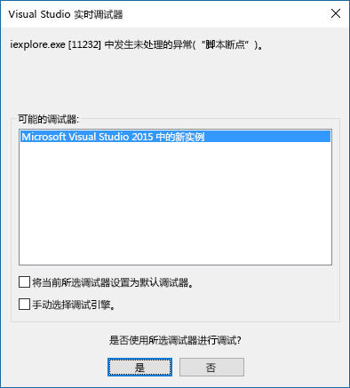

# 从任务窗格附加调试器

在 Windows 版 Office 2016（内部版本 77xx.xxxx 或更高版本）中，可以从任务窗格附加调试器。使用附加调试器功能，可直接将调试器附加到正确的 Internet Explorer 进程中。无论你使用的是 Yeoman 生成器、Visual Studio Code、Node.js、Angular 还是其他任何工具，都可以附加调试器。 

若要启动“**附加调试器**”工具，选择任务窗格右上角来激活“**个性**”菜单，如下图红圈所示。   

> [!NOTE]
> - 目前，唯一受支持的调试器工具是 [Visual Studio 2015](https://www.visualstudio.com/downloads/) [Update 3](https://msdn.microsoft.com/library/mt752379.aspx) 或更高版本。如果没有安装 Visual Studio，选择“附加调试器”**** 选项不会有任何结果。   
> - 只能使用“附加调试器”**** 工具调试客户端 JavaScript。 要调试服务器端代码（例如 Node.js 服务器），可选择多种方式。 有关如何使用 Visual Studio Code 进行调试的信息，请参阅 [VS Code 中的 Node.js 调试](https://code.visualstudio.com/docs/nodejs/nodejs-debugging)。 如果没有使用 Visual Studio Code，请搜索“debug Node.js”或“debug {name-of-server}”。

选择“**附加调试器**”。此操作将启动“**Visual Studio 实时调试器**”对话框，如下图所示。 

Visual Studio 中的“解决方案资源管理器”**** 会显示代码文件。   可以在要使用 Visual Studio 调试的代码行处设置断点。

> [!NOTE]
> 如果你没有看到“个性”菜单，则可以使用 Visual Studio 调试加载项。 确保你的任务窗格加载项已在 Office 中打开，然后按照以下步骤操作：
>
> 1. 在 Visual Studio 中，依次选择“**调试**” > “**附加到进程**”。
> 2. 在“**可用进程**”中，选择**“所有可用 `Iexplore.exe` 进程”或**“所有可用 `MicrosoftEdge*.exe` 进程”（具体取决于[加载项是使用 Internet Explorer 还是 Microsoft Edge](../concepts/browsers-used-by-office-web-add-ins.md)），然后选择“附加”**** 按钮。

若要详细了解如何在 Visual Studio 中进行调试，请参阅以下内容：

-   若要在 Visual Studio 中启动并使用 DOM 资源管理器，请参阅 [Building great-looking apps for Office using the new project templates](https://blogs.msdn.microsoft.com/officeapps/2013/04/16/building-great-looking-apps-for-office-using-the-new-project-templates)（使用新项目模板为 Office 生成漂亮应用）博客文章中[提示和技巧](https://blogs.msdn.microsoft.com/officeapps/2013/04/16/building-great-looking-apps-for-office-using-the-new-project-templates/#tips_tricks)部分的提示 4。
-   若要设置断点，请参阅[使用断点](/visualstudio/debugger/using-breakpoints?view=vs-2015)。
-   若要使用 F12，请参阅[使用 F12 开发人员工具](/previous-versions/windows/internet-explorer/ie-developer/samples/bg182326(v=vs.85))。
-   要使用 Microsoft Edge 开发人员工具，请参阅 [Microsoft Edge DevTools](https://www.microsoft.com/p/microsoft-edge-devtools-preview/9mzbfrmz0mnj?activetab=pivot%3Aoverviewtab)。

## 另请参阅

- [在 Visual Studio 中调试 Office 加载项](../develop/debug-office-add-ins-in-visual-studio.md)
- [发布 Office 外接程序](../publish/publish.md)
