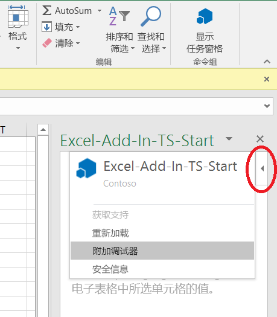

# 从任务窗格附加调试器

在 Office 2016 for Windows 生成号 77xx.xxxx 或更高版本中，可以从任务窗格附加调试器。使用附加调试器功能，可直接将调试器附加到正确的 Internet Explorer 进程中。无论你使用的是 Yeoman 生成器、Visual Studio Code、node.js、Angular 还是其他任何工具，都可以附加调试器。 

若要启动“**附加调试器**”工具，选择任务窗格右上角来激活“**个性**”菜单，如下图红圈所示。   

 >  **注意：**  
   - 目前，仅支持使用 [Visual Studio 2015](https://www.visualstudio.com/downloads/) [Update 3](https://msdn.microsoft.com/en-us/library/mt752379.aspx) 或更高版本作为调试器工具。 如果没有安装 Visual Studio，选择“附加调试器”****选项不会有任何效果。   
   - 只能使用“附加调试器”****工具调试客户端 JavaScript。 要调试服务器端代码（例如 Node.js 服务器），可选择多种方式。 有关如何使用 Visual Studio Code 进行调试的信息，请参阅 [VS Code 中的 Node.js 调试](https://code.visualstudio.com/docs/nodejs/nodejs-debugging)。 如果没有使用 Visual Studio Code，请搜索“debug Node.js”或“debug {name-of-server}”。

选择“附加调试器”****。 这会启动“Visual Studio 实时调试器”****对话框，如下图所示。 

Visual Studio 中的“解决方案资源管理器”****会显示代码文件。   可以在要使用 Visual Studio 调试的代码行处设置断点。

若要详细了解如何在 Visual Studio 中进行调试，请参阅以下内容：

-   若要在 Visual Studio 中启动并使用 DOM 资源管理器，请参阅 [Building great-looking apps for Office using the new project templates](https://blogs.msdn.microsoft.com/officeapps/2013/04/16/building-great-looking-apps-for-office-using-the-new-project-templates)（使用新项目模板为 Office 生成漂亮应用）博客文章中[提示和技巧](https://blogs.msdn.microsoft.com/officeapps/2013/04/16/building-great-looking-apps-for-office-using-the-new-project-templates/#tips_tricks)部分的提示 4。
-   若要设置断点，请参阅[使用断点](https://msdn.microsoft.com/en-US/library/5557y8b4.aspx)。
-   若要使用 F12，请参阅[使用 F12 开发者工具](https://msdn.microsoft.com/en-us/library/bg182326(v=vs.85).aspx)。

## 其他资源

- [在 Visual Studio 中创建和调试 Office 外接程序](../get-started/create-and-debug-office-add-ins-in-visual-studio.md)
- [使用任意编辑器创建 Office 外接程序](../get-started/create-an-office-add-in-using-any-editor.md)
- [发布 Office 外接程序](../publish/publish.md)
