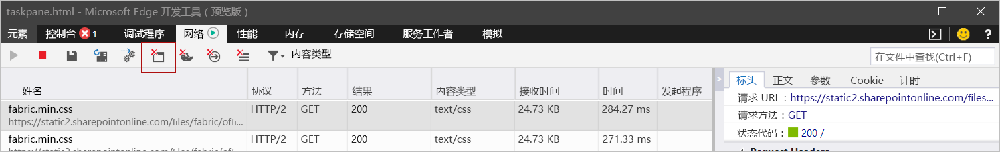
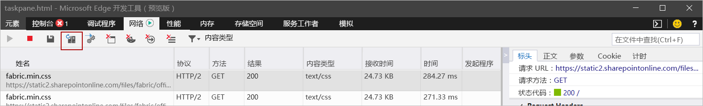

# <a name="clear-the-office-cache"></a><span data-ttu-id="e2806-103">清除 Office 缓存</span><span class="sxs-lookup"><span data-stu-id="e2806-103">Clear the Office cache</span></span>

<span data-ttu-id="e2806-104">你可以通过清除计算机上的 Office 缓存来删除以前在 Windows、Mac 或 iOS 上旁加载的加载项。</span><span class="sxs-lookup"><span data-stu-id="e2806-104">You can remove an add-in that you've previously sideloaded on Windows, Mac, or iOS by clearing the Office cache on your computer.</span></span>

<span data-ttu-id="e2806-p101">此外，如果你对加载项的清单进行了更改（例如，更新图标的文件名或加载项命令的文本），则应清除 Office 缓存，然后使用更新后的清单重新旁加载此加载项。执行此操作后，Office 将按照更新清单中所述的方式呈现该加载项。</span><span class="sxs-lookup"><span data-stu-id="e2806-p101">Additionally, if you make changes to your add-in's manifest (for example, update file names of icons or text of add-in commands), you should clear the Office cache and then re-sideload the add-in using updated manifest. Doing so will allow Office to render the add-in as it's described by the updated manifest.</span></span>

## <a name="clear-the-office-cache-on-windows"></a><span data-ttu-id="e2806-107">清除 Windows 上的 Office 缓存</span><span class="sxs-lookup"><span data-stu-id="e2806-107">Clear the Office cache on Windows</span></span>

<span data-ttu-id="e2806-108">如果要从 Excel、Word 和 PowerPoint 中删除所有旁加载的加载项，请删除以下文件夹的内容：</span><span class="sxs-lookup"><span data-stu-id="e2806-108">To remove all sideloaded add-ins from Excel, Word, and PowerPoint, delete the contents of the folder:</span></span>

```
%LOCALAPPDATA%\Microsoft\Office\16.0\Wef\
```

<span data-ttu-id="e2806-109">如果存在以下文件夹，则也删除其内容：</span><span class="sxs-lookup"><span data-stu-id="e2806-109">If the following folder exists, delete its contents too:</span></span>

```
%userprofile%\AppData\Local\Packages\Microsoft.Win32WebViewHost_cw5n1h2txyewy\AC\#!123\INetCache\
```

<span data-ttu-id="e2806-110">若要从 Outlook 中删除旁加载的加载项，请使用 [旁加载 Outlook 加载项以供测试](../outlook/sideload-outlook-add-ins-for-testing.md)中的步骤，在列出已安装加载项的对话框中查找“**自定义加载项**”部分中的加载项。选择相应加载项所对应的省略号 (`...`)，然后选择“**删除**”以删除这一特定加载项。</span><span class="sxs-lookup"><span data-stu-id="e2806-110">To remove a sideloaded add-in from Outlook, use the steps outlined in [Sideload Outlook add-ins for testing](../outlook/sideload-outlook-add-ins-for-testing.md) to find the add-in in the **Custom add-ins** section of the dialog box that lists your installed add-ins. Choose the ellipsis (`...`) for the add-in and then choose **Remove** to remove that specific add-in.</span></span> <span data-ttu-id="e2806-111">如果此加载项删除不起作用，则像之前针对 Excel、Word 和 PowerPoint 所述的那样，删除 `Wef` 文件夹的内容。</span><span class="sxs-lookup"><span data-stu-id="e2806-111">If this add-in removal doesn't work, then delete the contents of the `Wef` folder as noted previously for Excel, Word, and PowerPoint.</span></span>

<span data-ttu-id="e2806-112">另外，若要在 Microsoft Edge 中运行加载项时清除 Windows 10 上的 Office 缓存，可使用 Microsoft Edge 开发工具。</span><span class="sxs-lookup"><span data-stu-id="e2806-112">Additionally, to clear the Office cache on Windows 10 when the add-in is running in Microsoft Edge, you can use the Microsoft Edge DevTools.</span></span>

> [!TIP]
> <span data-ttu-id="e2806-113">如果只希望旁加载的加载项反映对其 HTML 或 JavaScript 源文件的最新更改，则应该不需要清除缓存。</span><span class="sxs-lookup"><span data-stu-id="e2806-113">If you only want the sideloaded add-in to reflect recent changes to its HTML or JavaScript source files, you shouldn't need to clear the cache.</span></span> <span data-ttu-id="e2806-114">相反，只需将焦点放在加载项的任务窗格中（通过单击任务窗格中的任意位置），然后按 **F5** 以重新加载该加载项。</span><span class="sxs-lookup"><span data-stu-id="e2806-114">Instead, just put focus in the add-in's task pane (by clicking anywhere within the task pane) and then press **F5** to reload the add-in.</span></span>

> [!NOTE]
> <span data-ttu-id="e2806-115">若要使用以下步骤清除 Office 缓存，加载项必须具有任务窗格。</span><span class="sxs-lookup"><span data-stu-id="e2806-115">To clear the Office cache using the following steps, your add-in must have a task pane.</span></span> <span data-ttu-id="e2806-116">如果加载项是无 UI 的加载项（例如，使用 [on-send](../outlook/outlook-on-send-addins.md) 功能的加载项），则需要先为加载项添加一个任务窗格，且该任务窗格使用与 [SourceLocation](../reference/manifest/sourcelocation.md) 相同的域，然后才能使用以下步骤来清除缓存。</span><span class="sxs-lookup"><span data-stu-id="e2806-116">If your add-in is a UI-less add-in -- for example, one that uses the [on-send](../outlook/outlook-on-send-addins.md) feature -- you'll need to add a task pane to your add-in that uses the same domain for [SourceLocation](../reference/manifest/sourcelocation.md), before you can use the following steps to clear the cache.</span></span>

1. <span data-ttu-id="e2806-117">安装 [Microsoft Edge 开发工具](https://www.microsoft.com/p/microsoft-edge-devtools-preview/9mzbfrmz0mnj)。</span><span class="sxs-lookup"><span data-stu-id="e2806-117">Install the [Microsoft Edge DevTools](https://www.microsoft.com/p/microsoft-edge-devtools-preview/9mzbfrmz0mnj).</span></span>

2. <span data-ttu-id="e2806-118">在 Office 客户端中打开加载项。</span><span class="sxs-lookup"><span data-stu-id="e2806-118">Open your add-in in the Office client.</span></span>

3. <span data-ttu-id="e2806-119">运行 Microsoft Edge 开发工具。</span><span class="sxs-lookup"><span data-stu-id="e2806-119">Run the Microsoft Edge DevTools.</span></span>

4. <span data-ttu-id="e2806-120">在 Microsoft Edge 开发工具中，打开“**本地**”选项卡。加载项将按其名称列出。</span><span class="sxs-lookup"><span data-stu-id="e2806-120">In the Microsoft Edge DevTools, open the **Local** tab. Your add-in will be listed by its name.</span></span>

5. <span data-ttu-id="e2806-121">选择加载项名称以将调试器连接到加载项。</span><span class="sxs-lookup"><span data-stu-id="e2806-121">Select the add-in name to attach the debugger to your add-in.</span></span> <span data-ttu-id="e2806-122">当调试器连接到加载项时，将打开一个新的“Microsoft Edge 开发工具”窗口。</span><span class="sxs-lookup"><span data-stu-id="e2806-122">A new Microsoft Edge DevTools window will open when the debugger attaches to your add-in.</span></span>

6. <span data-ttu-id="e2806-123">在新窗口的“**网络**”选项卡上，选择“**清除缓存**”按钮。</span><span class="sxs-lookup"><span data-stu-id="e2806-123">On the **Network** tab of the new window, select the **Clear cache** button.</span></span>

    

7. <span data-ttu-id="e2806-125">如果完成这些步骤后未获得想要的结果，还可以选择“**始终从服务器中刷新**”按钮。</span><span class="sxs-lookup"><span data-stu-id="e2806-125">If completing these steps doesn't produce the desired result, you can also select the **Always refresh from server** button.</span></span>

    

## <a name="clear-the-office-cache-on-mac"></a><span data-ttu-id="e2806-127">清除 Mac 上的 Office 缓存</span><span class="sxs-lookup"><span data-stu-id="e2806-127">Clear the Office cache on Mac</span></span>

[!include[additional cache folders on Mac](../includes/mac-cache-folders.md)]

## <a name="clear-the-office-cache-on-ios"></a><span data-ttu-id="e2806-128">清除 iOS 上的 Office 缓存</span><span class="sxs-lookup"><span data-stu-id="e2806-128">Clear the Office cache on iOS</span></span>

<span data-ttu-id="e2806-129">若要清除 iOS 上的 Office 缓存，请从加载项中的 JavaScript 调用 `window.location.reload(true)` 以强制重新加载。</span><span class="sxs-lookup"><span data-stu-id="e2806-129">To clear the Office cache on iOS, call `window.location.reload(true)` from JavaScript in the add-in to force a reload.</span></span> <span data-ttu-id="e2806-130">或者，可以重新安装 Office。</span><span class="sxs-lookup"><span data-stu-id="e2806-130">Alternatively, you can reinstall Office.</span></span>

## <a name="see-also"></a><span data-ttu-id="e2806-131">另请参阅</span><span class="sxs-lookup"><span data-stu-id="e2806-131">See also</span></span>

- [<span data-ttu-id="e2806-132">调试 Office 加载项</span><span class="sxs-lookup"><span data-stu-id="e2806-132">Debug Office Add-ins</span></span>](debug-add-ins-using-f12-developer-tools-on-windows-10.md)
- [<span data-ttu-id="e2806-133">使用运行时日志记录功能调试加载项</span><span class="sxs-lookup"><span data-stu-id="e2806-133">Debug your add-in with runtime logging</span></span>](runtime-logging.md)
- [<span data-ttu-id="e2806-134">旁加载 Office 外接程序进行测试</span><span class="sxs-lookup"><span data-stu-id="e2806-134">Sideload Office Add-ins for testing</span></span>](sideload-office-add-ins-for-testing.md)
- [<span data-ttu-id="e2806-135">Office 加载项 XML 清单</span><span class="sxs-lookup"><span data-stu-id="e2806-135">Office Add-ins XML manifest</span></span>](../develop/add-in-manifests.md)
- [<span data-ttu-id="e2806-136">验证 Office 加载项的清单</span><span class="sxs-lookup"><span data-stu-id="e2806-136">Validate an Office Add-in's manifest</span></span>](troubleshoot-manifest.md)
