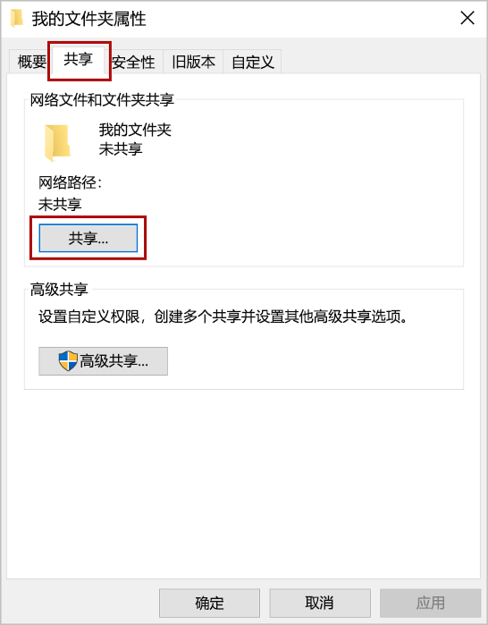
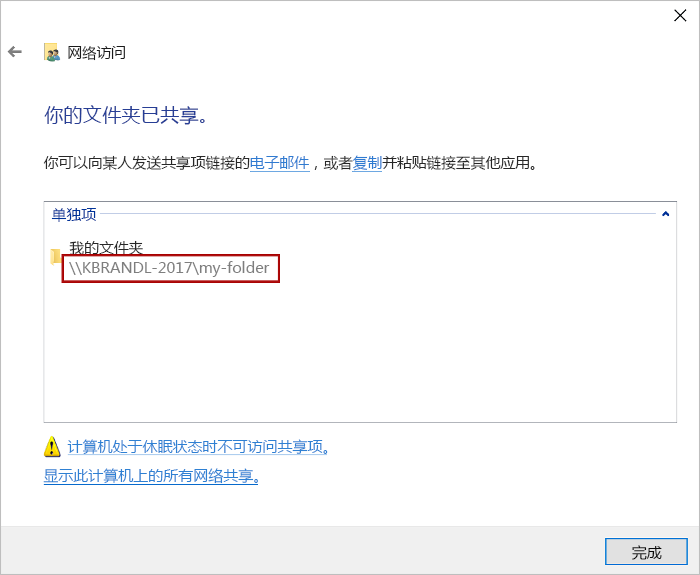
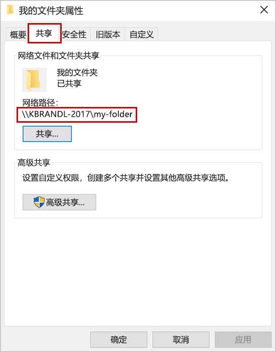
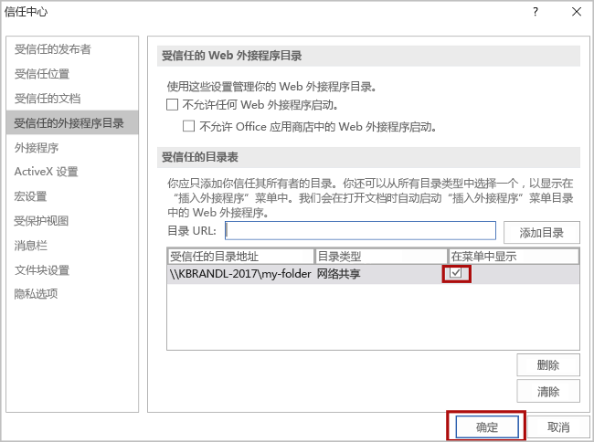

# <a name="sideload-office-add-ins-for-testing-from-a-network-share"></a><span data-ttu-id="ebe21-103">从Office旁加载外接程序以进行测试</span><span class="sxs-lookup"><span data-stu-id="ebe21-103">Sideload Office Add-ins for testing from a network share</span></span>

<span data-ttu-id="ebe21-104">可以通过将 Office清单发布到网络文件共享Windows在 Office 客户端中测试 (外接程序，具体) 。</span><span class="sxs-lookup"><span data-stu-id="ebe21-104">You can test an Office Add-in in an Office client that is on Windows by publishing the manifest to a network file share (instructions below).</span></span> <span data-ttu-id="ebe21-105">此部署选项用于完成对 localhost 的开发和测试，并且希望从非本地服务器或云帐户测试外接程序。</span><span class="sxs-lookup"><span data-stu-id="ebe21-105">This deployment option is intended to be used when you have completed development and testing on a localhost and want to test the add-in from a non-local server or cloud account.</span></span>

> [!IMPORTANT]
> <span data-ttu-id="ebe21-106">生产加载项不支持通过网络共享进行部署。此方法具有以下限制：</span><span class="sxs-lookup"><span data-stu-id="ebe21-106">Deployment by network share is not supported for production add-ins. This method has the following limitations:</span></span>
> 
> - <span data-ttu-id="ebe21-107">加载项只能安装在Windows计算机上。</span><span class="sxs-lookup"><span data-stu-id="ebe21-107">The add-in can only be installed on Windows computers.</span></span>
> - <span data-ttu-id="ebe21-108">如果加载项的新版本更改功能区，每个用户必须重新安装加载项。</span><span class="sxs-lookup"><span data-stu-id="ebe21-108">If a new version of an add-in changes the ribbon, each user will have to reinstall the add-in.</span></span>


> [!NOTE]
> <span data-ttu-id="ebe21-109">如果你的外接程序项目是使用[外接程序的 Yeoman 生成器](https://github.com/OfficeDev/generator-office)的足够使用的版本，运行 `npm start` 时将自动在 Office 桌面客户端中旁加载外接程序。</span><span class="sxs-lookup"><span data-stu-id="ebe21-109">If your add-in project was created with a sufficiently recent version of the [Yeoman generator for Office Add-ins](https://github.com/OfficeDev/generator-office), the add-in will automatically sideload in the Office desktop client when you run `npm start`.</span></span>

<span data-ttu-id="ebe21-110">本文仅适用于测试 Word、Excel、PowerPoint 和 Project 加载项，仅适用于 Windows。</span><span class="sxs-lookup"><span data-stu-id="ebe21-110">This article applies only to testing Word, Excel, PowerPoint, and Project add-ins and only on Windows.</span></span> <span data-ttu-id="ebe21-111">如果要在其他平台上进行测试或要测试 Outlook 加载项，请参阅以下主题之一以旁加载你的加载项：</span><span class="sxs-lookup"><span data-stu-id="ebe21-111">If you want to test on another platform or want to test an Outlook add-in, see one of the following topics to sideload your add-in:</span></span>

- [<span data-ttu-id="ebe21-112">在 Office 网页版中旁加载 Office 加载项进行测试</span><span class="sxs-lookup"><span data-stu-id="ebe21-112">Sideload Office Add-ins in Office on the web for testing</span></span>](sideload-office-add-ins-for-testing.md)
- [<span data-ttu-id="ebe21-113">在 iPad 和 Mac 上旁加载 Office 外接程序进行测试</span><span class="sxs-lookup"><span data-stu-id="ebe21-113">Sideload Office Add-ins on iPad and Mac for testing</span></span>](sideload-an-office-add-in-on-ipad-and-mac.md)
- [<span data-ttu-id="ebe21-114">旁加载 Outlook 加载项以供测试</span><span class="sxs-lookup"><span data-stu-id="ebe21-114">Sideload Outlook add-ins for testing</span></span>](../outlook/sideload-outlook-add-ins-for-testing.md)

<span data-ttu-id="ebe21-115">下面的视频逐步展示了如何使用共享文件夹目录在 Office 网页版或桌面上旁加载加载项。</span><span class="sxs-lookup"><span data-stu-id="ebe21-115">The following video walks you through the process of sideloading your add-in in Office on the web or desktop using a shared folder catalog.</span></span>  

> [!VIDEO https://www.youtube.com/embed/XXsAw2UUiQo]

## <a name="share-a-folder"></a><span data-ttu-id="ebe21-116">共享文件夹</span><span class="sxs-lookup"><span data-stu-id="ebe21-116">Share a folder</span></span>

1. <span data-ttu-id="ebe21-117">在想要托管外接程序的 Windows 计算机上，转到你想用作共享文件夹目录的文件夹的父文件夹或驱动器号。</span><span class="sxs-lookup"><span data-stu-id="ebe21-117">In File Explorer on the Windows computer where you want to host your add-in, go to the parent folder, or drive letter, of the folder you want to use as your shared folder catalog.</span></span>

2. <span data-ttu-id="ebe21-118">打开要用作共享文件夹目录的文件夹的上下文菜单（右键单击该文件夹），然后选择“**属性**”。</span><span class="sxs-lookup"><span data-stu-id="ebe21-118">Open the context menu for the folder you want to use as your shared folder catalog (right-click the folder) and choose **Properties**.</span></span>

3. <span data-ttu-id="ebe21-119">在“**属性**”对话框窗口中，打开“**共享**”选项卡，然后选择“**共享**”按钮。</span><span class="sxs-lookup"><span data-stu-id="ebe21-119">Within the **Properties** dialog window, open the **Sharing** tab and then choose the **Share** button.</span></span>

    

4. <span data-ttu-id="ebe21-121">在 **网络访问** 对话框窗口中，添加你自己以及要与其共享加载项的任何其他用户和/或组。</span><span class="sxs-lookup"><span data-stu-id="ebe21-121">Within the **Network access** dialog window, add yourself and any other users and/or groups with whom you want to share your add-in.</span></span> <span data-ttu-id="ebe21-122">你至少需要对该文件夹的 **读/写** 权限。</span><span class="sxs-lookup"><span data-stu-id="ebe21-122">You will need at least **Read/Write** permission to the folder.</span></span> <span data-ttu-id="ebe21-123">选择要与其共享的人员后，请选择“**共享**”按钮。</span><span class="sxs-lookup"><span data-stu-id="ebe21-123">After you have finished choosing people to share with, choose the **Share** button.</span></span>

5. <span data-ttu-id="ebe21-124">当你看到确认 **你的文件夹已共享** 的消息时，请记下紧跟文件夹名称显示的完整网络路径。</span><span class="sxs-lookup"><span data-stu-id="ebe21-124">When you see confirmation that **Your folder is shared**, make note of the full network path that's displayed immediately following the folder name.</span></span> <span data-ttu-id="ebe21-125">（当你 [将共享文件夹指定为受信任的目录](#specify-the-shared-folder-as-a-trusted-catalog)时，你需要将此值输入为 **目录UR**，如本文下一节所述。）选择“**完成**”按钮以关闭“**网络访问**”对话框窗口。</span><span class="sxs-lookup"><span data-stu-id="ebe21-125">(You will need to enter this value as the **Catalog Url** when you [specify the shared folder as a trusted catalog](#specify-the-shared-folder-as-a-trusted-catalog), as described in the next section of this article.) Choose the **Done** button to close the **Network access** dialog window.</span></span>

   

6. <span data-ttu-id="ebe21-127">选择“**关闭**”按钮以关闭“**属性**”对话框窗口。</span><span class="sxs-lookup"><span data-stu-id="ebe21-127">Choose the **Close** button to close the **Properties** dialog window.</span></span>

## <a name="specify-the-shared-folder-as-a-trusted-catalog"></a><span data-ttu-id="ebe21-128">将共享文件夹指定为受信任的目录</span><span class="sxs-lookup"><span data-stu-id="ebe21-128">Specify the shared folder as a trusted catalog</span></span>

### <a name="configure-the-trust-manually"></a><span data-ttu-id="ebe21-129">手动配置信任</span><span class="sxs-lookup"><span data-stu-id="ebe21-129">Configure the trust manually</span></span>

1. <span data-ttu-id="ebe21-130">在 Excel、Word、PowerPoint 或 Project 中打开一个新的文档。</span><span class="sxs-lookup"><span data-stu-id="ebe21-130">Open a new document in Excel, Word, PowerPoint, or Project.</span></span>

2. <span data-ttu-id="ebe21-131">选择“文件”选项卡，然后选择“选项”。</span><span class="sxs-lookup"><span data-stu-id="ebe21-131">Choose the **File** tab, and then choose **Options**.</span></span>

3. <span data-ttu-id="ebe21-132">选择“**信任中心**”，然后选择“**信任中心设置**”按钮。</span><span class="sxs-lookup"><span data-stu-id="ebe21-132">Choose **Trust Center**, and then choose the **Trust Center Settings** button.</span></span>

4. <span data-ttu-id="ebe21-133">选择“**受信任的加载项目录**”。</span><span class="sxs-lookup"><span data-stu-id="ebe21-133">Choose **Trusted Add-in Catalogs**.</span></span>

5. <span data-ttu-id="ebe21-134">在“**目录 Url**”框中，输入你之前 [共享](#share-a-folder)的文件夹的完整网络路径。</span><span class="sxs-lookup"><span data-stu-id="ebe21-134">In the **Catalog Url** box, enter the full network path to the folder that you [shared](#share-a-folder) previously.</span></span> <span data-ttu-id="ebe21-135">如果在共享文件夹时未能记下文件夹的完整网络路径，则可以从文件夹的“**属性**”对话框窗口中获取它，如以下屏幕截图所示。</span><span class="sxs-lookup"><span data-stu-id="ebe21-135">If you failed to note the folder's full network path when you shared the folder, you can get it from the folder's **Properties** dialog window, as shown in the following screenshot.</span></span>

    

6. <span data-ttu-id="ebe21-137">在“**目录 Url**”框中输入文件夹的完整网络路径后，选择“**添加目录**”按钮。</span><span class="sxs-lookup"><span data-stu-id="ebe21-137">After you've entered the full network path of the folder into the **Catalog Url** box, choose the **Add catalog** button.</span></span>

7. <span data-ttu-id="ebe21-138">选中新添加项目的“**在菜单中显示**”复选框，然后选择“**确定**”按钮以关闭“**信任中心**”对话框窗口。</span><span class="sxs-lookup"><span data-stu-id="ebe21-138">Select the **Show in Menu** check box for the newly-added item, and then choose the **OK** button to close the **Trust Center** dialog window.</span></span> 

    

8. <span data-ttu-id="ebe21-140">选择" **确定"** 按钮以关闭 **"选项** "对话框窗口。</span><span class="sxs-lookup"><span data-stu-id="ebe21-140">Choose the **OK** button to close the **Options** dialog window.</span></span>

9. <span data-ttu-id="ebe21-141">关闭并重新打开 Office 应用程序，以使更改生效。</span><span class="sxs-lookup"><span data-stu-id="ebe21-141">Close and reopen the Office application so your changes will take effect.</span></span>

### <a name="configure-the-trust-with-a-registry-script"></a><span data-ttu-id="ebe21-142">使用注册表脚本配置信任</span><span class="sxs-lookup"><span data-stu-id="ebe21-142">Configure the trust with a Registry script</span></span>

1. <span data-ttu-id="ebe21-143">在文本编辑器中，创建名为 TrustNetworkShareCatalog.reg 的文件。</span><span class="sxs-lookup"><span data-stu-id="ebe21-143">In a text editor, create a file named TrustNetworkShareCatalog.reg.</span></span>

2. <span data-ttu-id="ebe21-144">在文件中添加以下内容：</span><span class="sxs-lookup"><span data-stu-id="ebe21-144">Add the following content to the file:</span></span>

    ```text
    Windows Registry Editor Version 5.00

    [HKEY_CURRENT_USER\Software\Microsoft\Office\16.0\WEF\TrustedCatalogs\{-random-GUID-here-}]
    "Id"="{-random-GUID-here-}"
    "Url"="\\\\-share-\\-folder-"
    "Flags"=dword:00000001
    ```
3. <span data-ttu-id="ebe21-145">在众多在线 GUID 生成工具中选用一个（例如 [GUID 生成器](https://guidgenerator.com/)）来生成一个随机 GUID，并在 TrustNetworkShareCatalog.reg 文件中，将 *两个位置* 的“-random-GUID-here-”字符串都替换为 GUID。</span><span class="sxs-lookup"><span data-stu-id="ebe21-145">Use one of the many online GUID generation tools, such as [GUID Generator](https://guidgenerator.com/), to generate a random GUID, and within the TrustNetworkShareCatalog.reg file, replace the string "-random-GUID-here-" *in both places* with the GUID.</span></span> <span data-ttu-id="ebe21-146">（应保留右侧 `{}` 符号）。</span><span class="sxs-lookup"><span data-stu-id="ebe21-146">(The enclosing `{}` symbols should remain.)</span></span>

4. <span data-ttu-id="ebe21-147">将 `Url` 值替换为你之前[共享](#share-a-folder)的文件夹的完整网络路径。</span><span class="sxs-lookup"><span data-stu-id="ebe21-147">Replace the `Url` value with the full network path to the folder that you [shared](#share-a-folder) previously.</span></span> <span data-ttu-id="ebe21-148">（请注意，URL 中的所有 `\` 字符都必须成双出现。）如果在共享文件夹时未能记下文件夹的完整网络路径，则可从文件夹的“**属性**”对话框窗口中获取它，如以下屏幕截图所示。</span><span class="sxs-lookup"><span data-stu-id="ebe21-148">(Note that any `\` characters in the URL must be doubled.) If you failed to note the folder's full network path when you shared the folder, you can get it from the folder's **Properties** dialog window, as shown in the following screenshot.</span></span>

    

5. <span data-ttu-id="ebe21-150">文件现应如下所示。</span><span class="sxs-lookup"><span data-stu-id="ebe21-150">The file should now look like the following.</span></span> <span data-ttu-id="ebe21-151">将其保存。</span><span class="sxs-lookup"><span data-stu-id="ebe21-151">Save it.</span></span>

    ```text
    Windows Registry Editor Version 5.00

    [HKEY_CURRENT_USER\Software\Microsoft\Office\16.0\WEF\TrustedCatalogs\{01234567-89ab-cedf-0123-456789abcedf}]
    "Id"="{01234567-89ab-cedf-0123-456789abcedf}"
    "Url"="\\\\TestServer\\OfficeAddinManifests"
    "Flags"=dword:00000001
    ```

6. <span data-ttu-id="ebe21-152">关闭 *所有* Office 应用程序。</span><span class="sxs-lookup"><span data-stu-id="ebe21-152">Close *all* Office applications.</span></span>

7. <span data-ttu-id="ebe21-153">如同对任何可执行文件操作一样运行 TrustNetworkShareCatalog.reg，例如双击它。</span><span class="sxs-lookup"><span data-stu-id="ebe21-153">Run the TrustNetworkShareCatalog.reg just as you would any executable, such as double-clicking it.</span></span>

## <a name="sideload-your-add-in"></a><span data-ttu-id="ebe21-154">旁加载加载项</span><span class="sxs-lookup"><span data-stu-id="ebe21-154">Sideload your add-in</span></span>

1. <span data-ttu-id="ebe21-155">放入在共享文件夹目录中进行测试的所有加载项的清单 XML 文件。</span><span class="sxs-lookup"><span data-stu-id="ebe21-155">Put the manifest XML file of any add-in that you are testing in the shared folder catalog.</span></span> <span data-ttu-id="ebe21-156">请务必将 Web 应用程序本身部署到 Web 服务器。</span><span class="sxs-lookup"><span data-stu-id="ebe21-156">Note that you deploy the web application itself to a web server.</span></span> <span data-ttu-id="ebe21-157">务必在清单文件的 **SourceLocation** 元素中指定 URL。</span><span class="sxs-lookup"><span data-stu-id="ebe21-157">Be sure to specify the URL in the **SourceLocation** element of the manifest file.</span></span>

    > [!IMPORTANT]
    > [!include[HTTPS guidance](../includes/https-guidance.md)]

    > [!NOTE]
    > <span data-ttu-id="ebe21-158">对于Visual Studio，请使用 文件夹中的项目所构建的 `{projectfolder}\bin\Debug\OfficeAppManifests` 清单。</span><span class="sxs-lookup"><span data-stu-id="ebe21-158">For Visual Studio projects, use the manifest built by the project in the `{projectfolder}\bin\Debug\OfficeAppManifests` folder.</span></span>

2. <span data-ttu-id="ebe21-159">在 Excel、Word 或 PowerPoint 中，选择功能区上“**插入**”选项卡中的“**我的加载项**”。</span><span class="sxs-lookup"><span data-stu-id="ebe21-159">In Excel, Word, or PowerPoint, select **My Add-ins** on the **Insert** tab of the ribbon.</span></span> <span data-ttu-id="ebe21-160">在 Project 中，选择功能区“**Project**”选项卡上的“**我的加载项**”。</span><span class="sxs-lookup"><span data-stu-id="ebe21-160">In Project, select **My Add-ins** on the **Project** tab of the ribbon.</span></span>

3. <span data-ttu-id="ebe21-161">在“**Office 外接程序**”对话框的顶部，选择“**共享文件夹**”。</span><span class="sxs-lookup"><span data-stu-id="ebe21-161">Choose **SHARED FOLDER** at the top of the **Office Add-ins** dialog box.</span></span>

4. <span data-ttu-id="ebe21-162">选择加载项的名称，然后选择“**添加**”以插入加载项。</span><span class="sxs-lookup"><span data-stu-id="ebe21-162">Select the name of the add-in and choose **Add** to insert the add-in.</span></span>

## <a name="remove-a-sideloaded-add-in"></a><span data-ttu-id="ebe21-163">删除旁加载的外接程序</span><span class="sxs-lookup"><span data-stu-id="ebe21-163">Remove a sideloaded add-in</span></span>

<span data-ttu-id="ebe21-164">可以通过清除计算机上以前旁加载的Office缓存来删除。</span><span class="sxs-lookup"><span data-stu-id="ebe21-164">You can remove a previously sideloaded add-in by clearing the Office cache on your computer.</span></span> <span data-ttu-id="ebe21-165">有关在缓存上清除Windows的详细信息，请参阅清除缓存[Office。](clear-cache.md#clear-the-office-cache-on-windows)</span><span class="sxs-lookup"><span data-stu-id="ebe21-165">Details on how to clear the cache on Windows can be found in the article [Clear the Office cache](clear-cache.md#clear-the-office-cache-on-windows).</span></span>

## <a name="see-also"></a><span data-ttu-id="ebe21-166">另请参阅</span><span class="sxs-lookup"><span data-stu-id="ebe21-166">See also</span></span>

- [<span data-ttu-id="ebe21-167">验证 Office 加载项的清单</span><span class="sxs-lookup"><span data-stu-id="ebe21-167">Validate an Office Add-in's manifest</span></span>](troubleshoot-manifest.md)
- [<span data-ttu-id="ebe21-168">清除 Office 缓存</span><span class="sxs-lookup"><span data-stu-id="ebe21-168">Clear the Office cache</span></span>](clear-cache.md)
- [<span data-ttu-id="ebe21-169">发布 Office 外接程序</span><span class="sxs-lookup"><span data-stu-id="ebe21-169">Publish your Office Add-in</span></span>](../publish/publish.md)
