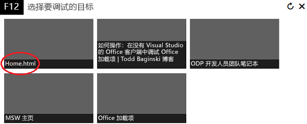
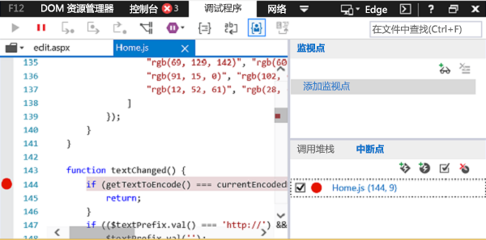
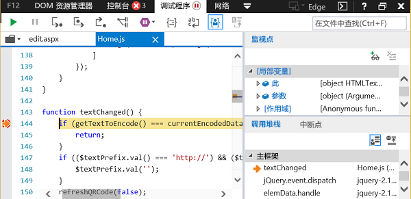

# 使用 Windows 10 上的开发人员工具调试加载项

在 IDE 之外，还有一些开发人员工具可用于帮助你在 Windows 10 上调试加载项。 当你在 IDE 之外运行加载项的同时，需要调查问题时，这些工具非常有用。

所使用的工具取决于加载项是在 Microsoft Edge 还是在 Internet Explorer 中运行。 这取决于计算机上安装的 Windows 10 版本和 Office 版本。 若要确定开发计算机上使用的浏览器，请参阅 [Office 加载项使用的浏览器](../concepts/browsers-used-by-office-web-add-ins.md)。

> [!NOTE]
> 本文中的说明不能用于调试使用 Execute 函数的 Outlook 加载项。 若要调试使用 Execute 函数的 Outlook 加载项，我们建议你在脚本模式下附加到 Visual Studio 或附加到某些其他脚本调试器。

## 当加载项在 Microsoft Edge 中运行时

[!include[Enable debugging on Microsoft Edge DevTools](../includes/enable-debugging-on-edge-devtools.md)]

### 使用 Microsoft Edge DevTools 进行调试

当加载项在 Microsoft Edge 中运行时，可使用 [Microsoft Edge 开发人员工具](https://www.microsoft.com/p/microsoft-edge-devtools-preview/9mzbfrmz0mnj?activetab=pivot%3Aoverviewtab)。

1. 运行加载项。

2. 运行 Microsoft Edge 开发人员工具。

3. 在工具中，打开“**本地**”选项卡。加载项将按其名称列出。

4. 单击加载项名称，将其在工具中打开。

5. 打开“**调试器**”选项卡。 

6. 选择“**脚本**”（左）窗格上方的文件夹图标。 从下拉列表中显示的可用文件列表中，选择要调试的 JavaScript 文件。

7. 若要设置断点，请选择该行。 你将在该行左侧和“**调用堆栈**”（右下角）窗格中的对应行左侧看到一个红点。

8. 根据需要在加载项中执行函数以触发断点。

## 当加载项在 Internet Explorer 中运行时

当加载项在 Internet Explorer 中运行时，可以使用 Windows 10 中 F12 开发人员工具中的调试器来测试加载项。 运行加载项后，可以启动 F12 开发人员工具。 F12 工具显示在单独的窗口中，并不使用 Visual Studio。

> [!NOTE]
> 调试器属于 Windows 10 和 Internet Explorer 上的 F12 开发人员工具。旧版 Windows 不包含调试器。 

此示例使用 Word 和从 AppSource 获取的免费加载项。

1. 打开 Word 并选择空白文档。 
    
2. 在“**插入**”选项卡上的“加载项”组中，依次选择“**存储**”和 **QR4Office** 加载项。 （你可以从应用商店或加载项目录中加载任何加载项。）
    
3. 启动与 Office 版本相对应的 F12 开发工具：
    
   - 对于 32 位版 Office，请使用 C:\Windows\System32\F12\IEChooser.exe
    
   - 对于 64 位版 Office，请使用 C:\Windows\SysWOW64\F12\IEChooser.exe
    
   当你启动 IEChooser 时，一个单独的窗口（名为“选择要调试的目标”）显示要调试的可能的应用程序。 选择你感兴趣的应用程序。 如果你正在编写自己的加载项，请选择你已在其中部署加载项的网站，这可能是本地主机 URL。 
    
   例如，选择 **home.html**。 
    
   

4. 在 F12 窗口中，选择你想要调试的文件。
    
   若要在 F12 窗口中选择文件，请选择“**脚本**”（左）窗格上方的文件夹图标。 从下拉列表中显示的可用文件列表中，选择 **Home.js**。
    
5. 设置断点。
    
   若要在 **Home.js** 中设置断点，请选择第 144 行，它位于 `textChanged` 函数中。 你将在该行左侧和“调用堆栈和断点”（右下角）窗格中的对应行左侧看到一个红点。 有关设置断点的其他方法，请参阅[使用调试器检查正在运行的 JavaScript](/previous-versions/windows/internet-explorer/ie-developer/samples/dn255007(v=vs.85))。 
    
   

6. 运行加载项，以触发断点。
    
   在 Word 中，选择 **QR4Office** 窗格上部的 URL 文本框，然后尝试输入一些文本。 在调试器的“**调用堆栈和断点**”窗格中，你将看到该断点已触发，并显示了各种信息。 你可能需要刷新调试器以查看结果。
    
   

## 另请参阅

- [使用调试器检查正在运行的 JavaScript](/previous-versions/windows/internet-explorer/ie-developer/samples/dn255007(v=vs.85))
- [使用 F12 开发人员工具](/previous-versions/windows/internet-explorer/ie-developer/samples/bg182326(v=vs.85))
