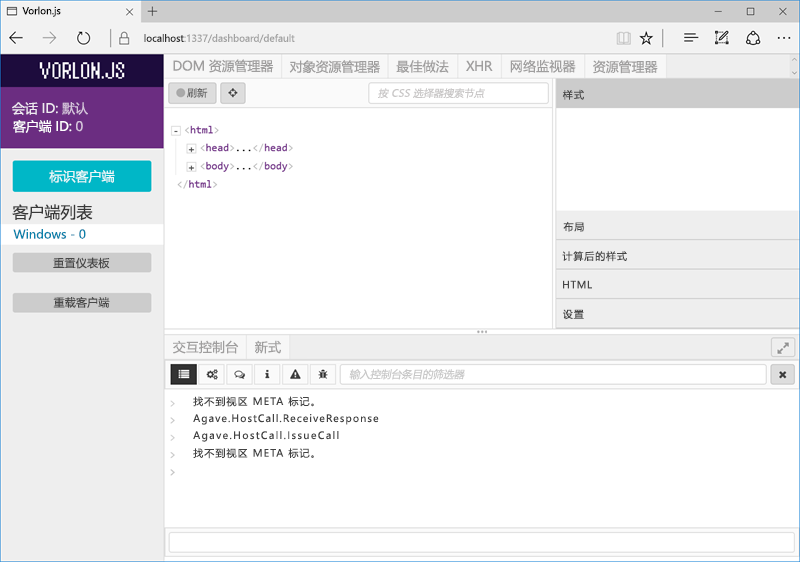

# <a name="debug-office-add-ins-on-ipad-and-mac"></a><span data-ttu-id="17c3c-102">在 iPad 和 Mac 上调试 Office 外接程序</span><span class="sxs-lookup"><span data-stu-id="17c3c-102">Debug Office Add-ins on iPad and Mac</span></span>

<span data-ttu-id="17c3c-p101">您可以使用 Visual Studio 开发和调试 Windows 上的外接程序。但是，无法使用它调试 iPad 或 Mac 上的外接程序。由于外接程序使用 HTML 和 Javascript 开发，它们应旨在跨平台工作，但不同浏览器呈现您的 HTML 的方式可能存在细微差异。本文介绍如何调试在 iPad 或 Mac 上运行的外接程序。</span><span class="sxs-lookup"><span data-stu-id="17c3c-p101">You can use Visual Studio to develop and debug add-ins on Windows, but you can't use it to debug add-ins on the iPad or Mac. Because add-ins are developed using HTML and Javascript, they are designed to work across platforms, but there might be subtle differences in how different browsers render the HTML. This article describes how to debug add-ins running on an iPad or Mac.</span></span>

## <a name="debugging-with-vorlonjs-on-ipad-or-mac"></a><span data-ttu-id="17c3c-106">在 iPad 或 Mac 上使用 Vorlon.JS 进行调试</span><span class="sxs-lookup"><span data-stu-id="17c3c-106">Debugging with Vorlon.JS on iPad or Mac</span></span>

<span data-ttu-id="17c3c-107">若要在 iPad 或 Mac 上调试加载项，可以使用 Vorlon.JS，一个类似于 F12 工具的 Web 页调试程序。</span><span class="sxs-lookup"><span data-stu-id="17c3c-107">To debug an add-in on iPad or Mac, you can use Vorlon.JS, a debugger for web pages that is similar to the F12 tools.</span></span> <span data-ttu-id="17c3c-108">它旨在实现远程工作，使你能够在不同设备上调试网页。</span><span class="sxs-lookup"><span data-stu-id="17c3c-108">It is designed to work remotely and it enables you to debug web pages across different devices.</span></span> <span data-ttu-id="17c3c-109">有关详细信息，请参阅 [Vorlon 网站](http://www.vorlonjs.com)。</span><span class="sxs-lookup"><span data-stu-id="17c3c-109">For more information, see the [Vorlon website](http://www.vorlonjs.com).</span></span>  


### <a name="install-and-set-up-vorlonjs"></a><span data-ttu-id="17c3c-110">安装和设置 Vorlon.JS</span><span class="sxs-lookup"><span data-stu-id="17c3c-110">Install and set up Vorlon.JS</span></span>  

1.  <span data-ttu-id="17c3c-111">以管理员身份登录到设备。</span><span class="sxs-lookup"><span data-stu-id="17c3c-111">Log on to the device as an administrator.</span></span>

2.  <span data-ttu-id="17c3c-112">如果尚未安装 [Node.js](https://nodejs.org)，请执行安装。</span><span class="sxs-lookup"><span data-stu-id="17c3c-112">Install [Node.js](https://nodejs.org) if it isn't already installed.</span></span>

3.  <span data-ttu-id="17c3c-p103">打开“**终端**”窗口，然后输入命令 `npm i -g vorlon`。该工具将安装到 `/usr/local/lib/node_modules/vorlon`。</span><span class="sxs-lookup"><span data-stu-id="17c3c-p103">Open a **Terminal** window and enter the command `npm i -g vorlon`. The tool is installed to `/usr/local/lib/node_modules/vorlon`.</span></span>


### <a name="configure-vorlonjs-to-use-https"></a><span data-ttu-id="17c3c-115">将 Vorlon.JS 配置为使用 HTTPS</span><span class="sxs-lookup"><span data-stu-id="17c3c-115">Configure Vorlon.JS to use HTTPS</span></span>

<span data-ttu-id="17c3c-p104">若要使用 Vorlon.JS 调试应用，请将 `<script>` 标记添加到应用的开始页，以便从已知位置加载 Vorlon.JS 脚本（有关详细信息，请参阅以下过程）。如果加载项受 SSL 保护 (HTTPS)，它使用的任何脚本都必须通过 HTTPS 服务器进行托管，包括 Vorlon.JS 脚本。因此，必须将 Vorlon.JS 配置为使用 SSL，这样才能结合使用 Vorlon.JS 和加载项。</span><span class="sxs-lookup"><span data-stu-id="17c3c-p104">To debug an application using Vorlon.JS, you add a `<script>` tag to the opening page of the application that loads a Vorlon.JS script from a well-known location (for details, see the following procedure). If an add-in is SSL-secured (HTTPS), any scripts that it uses must be hosted from an HTTPS server, including the Vorlon.JS script. Therefore, you must configure Vorlon.JS to use SSL in order to use Vorlon.JS with add-ins.</span></span>

> [!IMPORTANT]
> [!include[HTTPS guidance](../includes/https-guidance.md)]

1.  <span data-ttu-id="17c3c-119">在**查找器**中，转到 `/usr/local/lib/node_modules/vorlon`，打开 `/Server` 文件夹的上下文菜单（右键单击），再选择“获取信息”\*\*\*\*。</span><span class="sxs-lookup"><span data-stu-id="17c3c-119">In **Finder**, go to `/usr/local/lib/node_modules/vorlon`, open the context menu for (right-click) the `/Server` folder, and then select **Get Info**.</span></span>

2.  <span data-ttu-id="17c3c-120">在“**服务器信息**”窗口的右下角选择挂锁图标来解锁该文件夹。</span><span class="sxs-lookup"><span data-stu-id="17c3c-120">Choose the padlock icon in the lower right corner of the **Server info** window to unlock the folder.</span></span>

3. <span data-ttu-id="17c3c-121">在窗口的“**共享和权限**”部分，将“**员工**”组的“**特权**”设置为“**读写**”。</span><span class="sxs-lookup"><span data-stu-id="17c3c-121">In the **Sharing and Permissions** section of the window, set the **Privilege** for the **staff** group to **Read & Write**.</span></span>

4. <span data-ttu-id="17c3c-122">再次选择挂锁图标以***重新锁定***文件夹。</span><span class="sxs-lookup"><span data-stu-id="17c3c-122">Choose the padlock icon again to ***relock*** the folder.</span></span>

5. <span data-ttu-id="17c3c-123">返回**查找器**，展开 `/Server` 子文件夹，右键单击文件 `config.json`，然后选择“**获取信息**”。</span><span class="sxs-lookup"><span data-stu-id="17c3c-123">Back in **Finder**, expand the `/Server` subfolder, right-click the file `config.json`, and then select **Get Info**.</span></span>

6. <span data-ttu-id="17c3c-p105">在“**config.json 信息**”窗口中，完全按照更改 `/Server` 父文件夹的方式来更改文件特权。请务必重新锁定并关闭窗口。</span><span class="sxs-lookup"><span data-stu-id="17c3c-p105">In the **config.json info** window, change the privileges of the file exactly the way you did for its parent `/Server` folder. Be sure to relock and close the window.</span></span>

7. <span data-ttu-id="17c3c-p106">返回**查找器**，右键单击文件 `config.json`，选择“**打开方式**”，然后选择“**文本编辑**”。在文本编辑器中打开该文件。</span><span class="sxs-lookup"><span data-stu-id="17c3c-p106">Back in **Finder**, right-click the file `config.json`, select **Open with**, and then select **TextEdit**. The file opens in a text editor.</span></span>

8. <span data-ttu-id="17c3c-128">将 **useSSL** 属性的值更改为 `true`。</span><span class="sxs-lookup"><span data-stu-id="17c3c-128">Change the value of the **useSSL** property to `true`.</span></span>

9. <span data-ttu-id="17c3c-p107">在“**插件**”部分，使用 `OFFICE` 的 **id** 和 `Office Addin` 的**名称**查找插件。如果插件的“**启用**”属性还不是 `true`，请将其设置为 `true`。</span><span class="sxs-lookup"><span data-stu-id="17c3c-p107">In the **plugins** section, find the plugin with the **id** of `OFFICE` and the **name** of `Office Addin`. If the **enabled** property for the plug-in is not already `true`, set it to `true`.</span></span>

10. <span data-ttu-id="17c3c-131">保存文件并关闭编辑器。</span><span class="sxs-lookup"><span data-stu-id="17c3c-131">Save the file and close the editor.</span></span>

11. <span data-ttu-id="17c3c-132">在**查找器**中，导航到 `/usr/local/lib/node_modules/vorlon`，右键单击 `Server` 子文件夹，然后选择“**文件夹的新终端**”。</span><span class="sxs-lookup"><span data-stu-id="17c3c-132">In **Finder**, navigate to `/usr/local/lib/node_modules/vorlon`, right-click the `Server` subfolder, and select **New terminal at folder**.</span></span>

12. <span data-ttu-id="17c3c-p108">在“**终端**”窗口中，输入 `sudo vorlon`。系统将提示你输入管理员密码。Vorlon 服务器将启动。使“**终端**”窗口保持打开状态。</span><span class="sxs-lookup"><span data-stu-id="17c3c-p108">In the **Terminal** window, enter `sudo vorlon`. You will be prompted to enter your administrator password. The Vorlon server starts. Leave the **Terminal** window open.</span></span>

13. <span data-ttu-id="17c3c-p109">打开浏览器窗口，再转到 Vorlon.JS 界面 `https://localhost:1337`。当出现提示时，选择“始终”\*\*\*\*，以信任安全证书。</span><span class="sxs-lookup"><span data-stu-id="17c3c-p109">Open a browser window and go to `https://localhost:1337`, which is the Vorlon.JS interface. When prompted, choose **Always** to trust the security certificate.</span></span>

    > [!NOTE]
    > <span data-ttu-id="17c3c-p110">如果没有看到提示，可能需要手动信任安全证书。证书文件是 `/usr/local/lib/node_modules/vorlon/Server/cert/server.crt`。请尝试执行以下步骤。如有疑问，请咨询 Macintosh 或 iPad 帮助人员。</span><span class="sxs-lookup"><span data-stu-id="17c3c-p110">If you are not prompted, you might need to trust the certificate manually. The certificate file is `/usr/local/lib/node_modules/vorlon/Server/cert/server.crt`. Try the following steps. If you have trouble, consult Macintosh or iPad help.</span></span>
    >
    > 1. <span data-ttu-id="17c3c-143">关闭浏览器窗口，在运行 Vorlon 服务器的“终端”\*\*\*\* 窗口中，按 Control-C 停止服务器。</span><span class="sxs-lookup"><span data-stu-id="17c3c-143">Close the browser window and in the **Terminal** window that is running the Vorlon server, use Control-C to stop the server.</span></span>
    > 2. <span data-ttu-id="17c3c-p111">在**查找器**中，右键单击 `server.crt` 文件并选择“**钥匙链访问**”。“**钥匙链访问**”窗口将打开。</span><span class="sxs-lookup"><span data-stu-id="17c3c-p111">In **Finder**, right-click the `server.crt` file and select **Keychain Access**. The **Keychain Access** window opens.</span></span>
    > 3. <span data-ttu-id="17c3c-p112">在左侧的“**钥匙链**”列表中，如果尚未选择“**登录**”，请进行选择，然后再选择“**类别**”部分中的“**证书**”。将列出证书 **localhost**。</span><span class="sxs-lookup"><span data-stu-id="17c3c-p112">In the **Keychains** list on the left, select **login** if it is not already selected, and then select **Certificates** in the **Category** section. The certificate **localhost** is listed.</span></span>
    > 4. <span data-ttu-id="17c3c-p113">右键单击证书 **localhost**，并选择“**获取信息**”。**localhost** 窗口将打开。</span><span class="sxs-lookup"><span data-stu-id="17c3c-p113">Right-click the certificate **localhost** and select **Get Info**. A **localhost** window opens.</span></span>
    > 5. <span data-ttu-id="17c3c-150">在“**信任**”部分，打开标记了“**使用此证书时**”的选择器，并选择“**始终相信**”。</span><span class="sxs-lookup"><span data-stu-id="17c3c-150">In the **Trust** section, open the selector labeled **When using this certificate** and select **Always Trust**.</span></span> 
    > 6. <span data-ttu-id="17c3c-p114">关闭 **localhost** 窗口。如果此操作成功，“**钥匙链访问**”窗口中的“**localhost**”证书图标将显示蓝色圆圈中带白色十字图案。</span><span class="sxs-lookup"><span data-stu-id="17c3c-p114">Close the **localhost** window. If the action was successful, the **localhost** certificate in the **Keychain Access** window has a white cross in a blue circle on its icon.</span></span>


### <a name="configure-the-add-in-for-vorlonjs-debugging"></a><span data-ttu-id="17c3c-153">配置外接程序用于 Vorlon.JS 调试</span><span class="sxs-lookup"><span data-stu-id="17c3c-153">Configure the add-in for Vorlon.JS debugging</span></span>

1. <span data-ttu-id="17c3c-154">向外接程序的 home.html 文件（或主 HTML 文件）的 `<head>` 部分添加以下脚本标记：</span><span class="sxs-lookup"><span data-stu-id="17c3c-154">Add the following script tag to the `<head>` section of the home.html file (or main HTML file) of your add-in:</span></span>

    ```html
    <script src="https://localhost:1337/vorlon.js"></script>
    ```  

2. <span data-ttu-id="17c3c-155">将外接程序 Web 应用程序部署到可从 Mac 或 iPad 进行访问的 Web 服务器，如 Azure 网站。</span><span class="sxs-lookup"><span data-stu-id="17c3c-155">Deploy the add-in web application to a web server that is accessible from the Mac or iPad, such as an Azure website.</span></span>

3. <span data-ttu-id="17c3c-156">更新所有位置的外接程序 URL，其中 URL 出现在外接程序清单中。</span><span class="sxs-lookup"><span data-stu-id="17c3c-156">Update the URL of the add-in in all the places where the URL appears in the add-in manifest.</span></span>

4. <span data-ttu-id="17c3c-157">将外接程序清单复制到 Mac 或 iPad 上的以下文件夹：`/Users/{your_name_on_the_device}/Library/Containers/com.microsoft.{host_name}/Data/Documents/wef`，其中 *{host_name}* 为 Word、Excel、PowerPoint 或 Outlook。</span><span class="sxs-lookup"><span data-stu-id="17c3c-157">Copy the add-in manifest to the following folder on the Mac or iPad: `/Users/{your_name_on_the_device}/Library/Containers/com.microsoft.{host_name}/Data/Documents/wef`, where *{host_name}* is Word, Excel, PowerPoint, or Outlook.</span></span>


### <a name="inspect-an-add-in-in-vorlonjs"></a><span data-ttu-id="17c3c-158">检查 Vorlon.JS 中的外接程序</span><span class="sxs-lookup"><span data-stu-id="17c3c-158">Inspect an add-in in Vorlon.JS</span></span>

1. <span data-ttu-id="17c3c-159">如果 Vorlon 服务器未运行，则在**查找器**中，导航到 `/usr/local/lib/node_modules/vorlon`，右键单击 `Server` 子文件夹，然后选择“**文件夹的新终端**”。</span><span class="sxs-lookup"><span data-stu-id="17c3c-159">If the Vorlon server is not running, in **Finder**, navigate to `/usr/local/lib/node_modules/vorlon`, right-click the `Server` subfolder, and select **New terminal at folder**.</span></span> 

2.  <span data-ttu-id="17c3c-p115">在“**终端**”窗口中，输入 `sudo vorlon`。系统将提示你输入管理员密码。Vorlon 服务器将启动。使“**终端**”窗口保持打开状态。</span><span class="sxs-lookup"><span data-stu-id="17c3c-p115">In the **Terminal** window, enter `sudo vorlon`. You will be prompted to enter your administrator password. The Vorlon server starts. Leave the **Terminal** window open.</span></span>

3.  <span data-ttu-id="17c3c-164">打开浏览器窗口，并转到 `https://localhost:1337`（即 Vorlon.JS 界面）。</span><span class="sxs-lookup"><span data-stu-id="17c3c-164">Open a browser window and go to `https://localhost:1337`, which is the Vorlon.JS interface.</span></span>

4. <span data-ttu-id="17c3c-165">旁加载外接程序。</span><span class="sxs-lookup"><span data-stu-id="17c3c-165">Sideload the add-in.</span></span> <span data-ttu-id="17c3c-166">如果是 Excel、PowerPoint 或 Word 加载项，请按照[在 iPad 和 Mac 上旁加载 Office 加载项](sideload-an-office-add-in-on-ipad-and-mac.md)中的说明操作，执行旁加载。</span><span class="sxs-lookup"><span data-stu-id="17c3c-166">If it is for Excel, PowerPoint, or Word, sideload it as described in [Sideload an Office Add-in on iPad and Mac](sideload-an-office-add-in-on-ipad-and-mac.md).</span></span> <span data-ttu-id="17c3c-167">如果是 Outlook 加载项，请按照[旁加载 Outlook 加载项以供测试](/outlook/add-ins/sideload-outlook-add-ins-for-testing)中的说明操作，执行旁加载。</span><span class="sxs-lookup"><span data-stu-id="17c3c-167">If it is an Outlook add-in, sideload it as described in [Sideload Outlook add-ins for testing](/outlook/add-ins/sideload-outlook-add-ins-for-testing).</span></span> <span data-ttu-id="17c3c-168">如果加载项不使用加载项命令，它会立即打开。</span><span class="sxs-lookup"><span data-stu-id="17c3c-168">If the add-in does not use add-in commands, it will open immediately.</span></span> <span data-ttu-id="17c3c-169">否则，请选择用于打开加载项的按钮。</span><span class="sxs-lookup"><span data-stu-id="17c3c-169">Otherwise, choose the button to open the add-in.</span></span> <span data-ttu-id="17c3c-170">按钮位于“**主页**”选项卡或“**外接程序**”选项卡上，具体取决于 Office 主机应用程序版本。</span><span class="sxs-lookup"><span data-stu-id="17c3c-170">Depending on the build of the Office host application, the button will be on either the **Home** tab or an **Add-in** tab.</span></span>

<span data-ttu-id="17c3c-171">外接程序将在 Vorlon.JS（在 Vorlon.JS 界面左侧）的客户端列表中显示为 **{OS} - n**，*n* 代表数字，而 *{OS}* 表示设备类型，例如“Macintosh”。</span><span class="sxs-lookup"><span data-stu-id="17c3c-171">The add-in will show up in the list of Clients in Vorlon.JS (on the left side of the Vorlon.JS interface) as **{OS} - n**, for some number *n*, and where *{OS}* is the device type, such as "Macintosh".</span></span>



<span data-ttu-id="17c3c-173">Vorlon 工具具有多种插件。当前已启用的插件显示为工具顶部的选项卡。</span><span class="sxs-lookup"><span data-stu-id="17c3c-173">The Vorlon tool has a variety of plug-ins. The ones that are currently enabled appear as tabs at the top of the tool.</span></span> <span data-ttu-id="17c3c-174">（可以通过选择左侧的齿轮图标启用更多插件。）这些插件类似于 F12 工具中的功能。</span><span class="sxs-lookup"><span data-stu-id="17c3c-174">(You can enable more plug-ins by choosing the gears icon on the left.) These plug-ins are  similar to the functions in F12 tools.</span></span> <span data-ttu-id="17c3c-175">例如，可以突出显示 DOM 元素，执行命令等。</span><span class="sxs-lookup"><span data-stu-id="17c3c-175">For example, you can highlight DOM elements, execute commands, and more.</span></span> <span data-ttu-id="17c3c-176">有关详细信息，请参阅 [Vorlon 文档核心插件](http://vorlonjs.com/documentation/#console)。</span><span class="sxs-lookup"><span data-stu-id="17c3c-176">For more details, see [Vorlon Documentation Core Plugins](http://vorlonjs.com/documentation/#console).</span></span>

<span data-ttu-id="17c3c-p118">**Office 外接程序**插件为 Office.js 添加额外的功能，例如探索对象模型、执行 Office.js 调用和读取对象属性的值。有关说明，请参阅[调试 Office 外接程序的 VorlonJS 插件](https://blogs.msdn.microsoft.com/mim/2016/02/18/vorlonjs-plugin-for-debugging-office-addin/)。</span><span class="sxs-lookup"><span data-stu-id="17c3c-p118">An **Office Addin** plug-in adds extra capabilities for Office.js, such as exploring the object model, executing Office.js calls, and reading the values of object properties. For instructions, see [VorlonJS plugin for debugging Office Add-in](https://blogs.msdn.microsoft.com/mim/2016/02/18/vorlonjs-plugin-for-debugging-office-addin/).</span></span>

> [!NOTE]
> <span data-ttu-id="17c3c-179">无法在 Vorlon.JS 中设置断点。</span><span class="sxs-lookup"><span data-stu-id="17c3c-179">There is no way to set break points in Vorlon.JS.</span></span>

## <a name="debugging-with-safari-web-inspector-on-a-mac"></a><span data-ttu-id="17c3c-180">在 Mac 上使用 Safari Web 检查器进行调试</span><span class="sxs-lookup"><span data-stu-id="17c3c-180">Debugging with Safari Web Inspector on a Mac</span></span>

> [!IMPORTANT]
> <span data-ttu-id="17c3c-181">请注意，**检查元素**加载项上下文菜单选项是一个实验性功能，我们不能保证在未来的 Office 应用程序版本中保留此功能。</span><span class="sxs-lookup"><span data-stu-id="17c3c-181">Please note that the **Inspect Element** add-in context menu option is an experimental feature and there are no guarantees that we will preserve this functionality in future versions of Office applications.</span></span>

<span data-ttu-id="17c3c-182">如果有在任务窗格或内容加载项中显示 UI 的加载项，可以使用 Safari Web 检查器调试 Office 加载项。</span><span class="sxs-lookup"><span data-stu-id="17c3c-182">If you have add-in that shows UI in a task pane or in a content add-in, you can debug an Office Add-in using Safari Web Inspector.</span></span>

<span data-ttu-id="17c3c-183">要在 Mac 上调试 Office 加载项，必须拥有 Mac OS High Sierra 或更高版本和 Mac Office 版本 16.9.1（内部版本 18012504）或更高版本。</span><span class="sxs-lookup"><span data-stu-id="17c3c-183">To be able to debug Office Add-ins on Mac, you must have Mac OS High Sierra or later AND Mac Office version 16.9.1 (Build 18012504) or later.</span></span> <span data-ttu-id="17c3c-184">如果没有 Office for Mac 内部版本，可以通过加入 [Office 365 开发人员计划](https://aka.ms/o365devprogram)获取一个版本。</span><span class="sxs-lookup"><span data-stu-id="17c3c-184">If you don't have an Office for Mac build, you can get one by joining the [Office 365 Developer program](https://aka.ms/o365devprogram).</span></span>

<span data-ttu-id="17c3c-185">首先，打开终端，设置相关 Office 应用程序的 `OfficeWebAddinDeveloperExtras` 属性，如下所示：</span><span class="sxs-lookup"><span data-stu-id="17c3c-185">To start, open a terminal and set the `OfficeWebAddinDeveloperExtras` property for the relevant Office application as follows:</span></span>

- `defaults write com.microsoft.Word OfficeWebAddinDeveloperExtras -bool true`

- `defaults write com.microsoft.Excel OfficeWebAddinDeveloperExtras -bool true`

- `defaults write com.microsoft.Powerpoint OfficeWebAddinDeveloperExtras -bool true`

- `defaults write com.microsoft.Outlook OfficeWebAddinDeveloperExtras -bool true`

<span data-ttu-id="17c3c-186">然后，打开 Office 应用程序并[旁加载你的加载项](sideload-an-office-add-in-on-ipad-and-mac.md)。</span><span class="sxs-lookup"><span data-stu-id="17c3c-186">Then, open the Office application and [sideload your add-in](sideload-an-office-add-in-on-ipad-and-mac.md).</span></span> <span data-ttu-id="17c3c-187">右键单击加载项，应在上下文菜单中看到一个“**检查元素**”选项。</span><span class="sxs-lookup"><span data-stu-id="17c3c-187">Right-click the add-in and you should see an **Inspect Element** option in the context menu.</span></span>  <span data-ttu-id="17c3c-188">选择该选项，它将弹出检查器，可以在其中设置断点并调试加载项。</span><span class="sxs-lookup"><span data-stu-id="17c3c-188">Select that option and it will pop the Inspector, where you can set breakpoints and debug your add-in.</span></span>

> [!NOTE]
> <span data-ttu-id="17c3c-189">如果试图使用检查器和对话框闪烁，请尝试以下解决方法：</span><span class="sxs-lookup"><span data-stu-id="17c3c-189">If you are trying to use the inspector and the dialog flickers, try the following workaround:</span></span>
> 1. <span data-ttu-id="17c3c-190">缩小对话框大小。</span><span class="sxs-lookup"><span data-stu-id="17c3c-190">Reduce the size of the dialog.</span></span>
> 2. <span data-ttu-id="17c3c-191">选择“检查元素”\*\*\*\*，这将在新窗口中打开。</span><span class="sxs-lookup"><span data-stu-id="17c3c-191">Choose **Inspect Element**, which opens in a new window.</span></span>
> 3. <span data-ttu-id="17c3c-192">将对话框调整为原始大小。</span><span class="sxs-lookup"><span data-stu-id="17c3c-192">Resize the dialog to its original size.</span></span>
> 4. <span data-ttu-id="17c3c-193">根据需要使用检查器。</span><span class="sxs-lookup"><span data-stu-id="17c3c-193">Use the inspector as required.</span></span>


## <a name="clearing-the-office-applications-cache-on-a-mac-or-ipad"></a><span data-ttu-id="17c3c-194">在 Mac 或 iPad 上清除 Office 应用程序缓存</span><span class="sxs-lookup"><span data-stu-id="17c3c-194">Clearing the Office application's cache on a Mac or iPad</span></span>

<span data-ttu-id="17c3c-p121">出于性能方面的考虑，外接程序通常在 Office for Mac 中缓存。通常情况下，将通过重载外接程序清除缓存。如果同一文档中存在多个外接程序，则重载后自动清除缓存的过程可能不可靠。</span><span class="sxs-lookup"><span data-stu-id="17c3c-p121">Add-ins are cached often in Office for Mac, for performance reasons. Normally, the cache is cleared by reloading the add-in. If  more than one add-in exists in the same document, the process of automatically clearing the cache on reload might not be reliable.</span></span>

<span data-ttu-id="17c3c-198">在 Mac 上，通过删除 `/Users/{your_name_on_the_device}/Library/Containers/com.Microsoft.OsfWebHost/Data/` 文件夹中的所有内容可以手动清除缓存。</span><span class="sxs-lookup"><span data-stu-id="17c3c-198">On a Mac, you can clear the cache manually by deleting everything in the `/Users/{your_name_on_the_device}/Library/Containers/com.Microsoft.OsfWebHost/Data/` folder.</span></span>

<span data-ttu-id="17c3c-p122">在 iPad 上，可以从外接程序中的 JavaScript 调用 `window.location.reload(true)` 来强制重载。或者，可以重新安装 Office。</span><span class="sxs-lookup"><span data-stu-id="17c3c-p122">On an iPad, you can call `window.location.reload(true)` from JavaScript in the add-in to force a reload. Alternatively, you can reinstall Office.</span></span>
