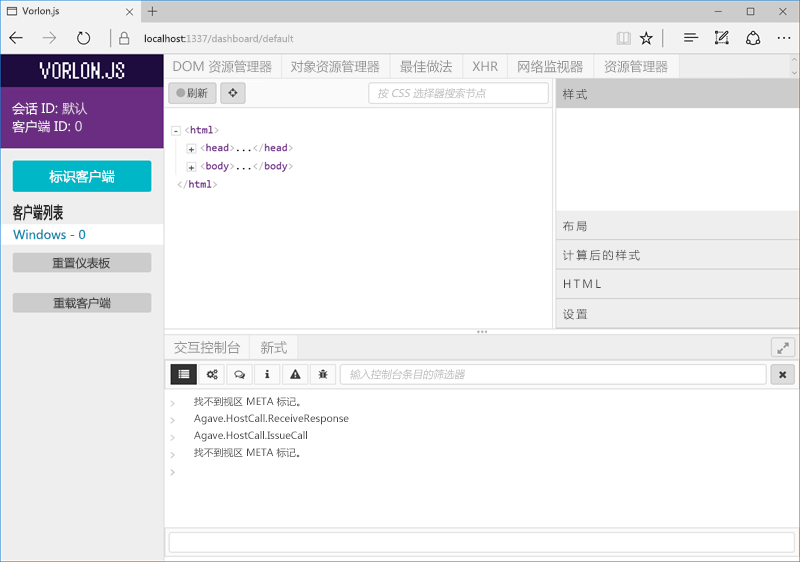

# <a name="debug-office-add-ins-on-ipad-and-mac"></a>在 iPad 和 Mac 上调试 Office 外接程序

您可以使用 Visual Studio 开发和调试 Windows 上的外接程序。但是，无法使用它调试 iPad 或 Mac 上的外接程序。由于外接程序使用 HTML 和 Javascript 开发，它们应旨在跨平台工作，但不同浏览器呈现您的 HTML 的方式可能存在细微差异。本文介绍如何调试在 iPad 或 Mac 上运行的外接程序。 

## <a name="debugging-with-vorlonjs"></a>使用 Vorlon.JS 进行调试 

Vorlon.JS 是网页调试程序，类似于 F12 工具。 它旨在实现远程工作，使你能够在不同设备上调试网页。 有关详细信息，请参阅 [Vorlon 网站](http://www.vorlonjs.com)。  

### <a name="install-and-set-up-up-vorlonjs-on-a-mac-or-ipad"></a>在 Mac 或 iPad 上安装和设置 Vorlon.JS 

1.  以管理员身份登录到设备。

2.  如果尚未安装 [Node.js](https://nodejs.org)，请执行安装。 

2.  打开“终端”****窗口，再输入命令 `npm i -g vorlon`。 此时，工具会安装到 `/usr/local/lib/node_modules/vorlon`。

### <a name="configure-vorlonjs-to-use-https"></a>将 Vorlon.JS 配置为使用 HTTPS

若要使用 Vorlon.JS 调试应用程序，请将 `<script>` 标记添加到应用程序的打开页，该应用程序从已知位置加载 Vorlon.JS 脚本（有关详细信息，请参阅以下过程）。 外接程序需要 HTTPS 协议；即 SSL。 通过扩展，其使用的任何脚本都必须从 HTTPS 服务器进行托管，其中包括 Vorlon.JS 脚本。 因此，必须将 Vorlon.JS 配置为使用 SSL，从而通过外接程序使用 Vorlon.JS。 

4.  在**查找器**上，转到 `/usr/local/lib/node_modules/vorlon`，打开 `/Server` 文件夹的上下文菜单（右键单击），然后选择“**获取信息**”。

5.  在“**服务器信息**”窗口的右下角选择挂锁图标来解锁该文件夹。

6. 在窗口的“**共享和权限**”部分，将“**员工**”组的“**特权**”设置为“**读写**”。

7. 再次选择挂锁图标以***重新锁定***文件夹。

8. 返回**查找器**，展开 `/Server` 子文件夹，右键单击文件 `config.json`，然后选择“**获取信息**”。

9. 在“**config.json 信息**”窗口中，完全按照更改 `/Server` 父文件夹的方式来更改文件特权。 请务必重新锁定并关闭窗口。

10. 返回**查找器**，右键单击文件 `config.json`，选择“**打开方式**”，然后选择“**文本编辑**”。 在文本编辑器中打开该文件。

11. 将 **useSSL** 属性的值更改为 `true`。

12. 在“插件”****部分中，查找 **ID** 为 `OFFICE` 且**名称**为 `Office Addin` 的插件。 如果插件的“已启用”****属性还不是 `true`，请设置为 `true`。

13. 保存文件并关闭编辑器。

5.  在**查找器**中，导航到 `/usr/local/lib/node_modules/vorlon`，右键单击 `Server` 子文件夹，然后选择“**文件夹的新终端**”。 
    
7.  在“**终端**”窗口中，输入 `sudo vorlon`。 系统将提示你输入管理员密码。 此时，Vorlon 服务器启动。 让“终端”****窗口一直处于打开状态。

6.  打开浏览器窗口，并转到 `https://localhost:1337`（即 Vorlon.JS 界面）。 在系统提示时，选择“**始终**”，信任安全证书。 

    >**注意：**如果未看到系统提示，可能需要手动信任证书。 证书文件是 `/usr/local/lib/node_modules/vorlon/Server/cert/server.crt`。 请尝试执行以下步骤。 如果有问题，请咨询 Macintosh 或 iPad 帮助。 
    >
    >1. 关闭浏览器窗口，在运行 Vorlon 服务器的“**终端**”窗口中，使用控件 C 停止该服务器。
    >2. 在“查找器”****中，右键单击“`server.crt`”文件，并选择“密钥链访问”****。 此时，“密钥链访问”****窗口打开。
    >2. 在左侧的“密钥链”****列表中，依次选择“登录”****（如果尚未选择的话）和“类别”****部分中的“证书”****。 此时，证书“localhost”****会列出。
    >3. 右键单击证书“localhost”****，再选择“获取信息”****。 此时，“localhost”****窗口会打开。
    >4. 在“信任”****部分中，打开标记为“使用此证书时”****的选择器，并选择“始终信任”****。 
    >5. 关闭“localhost”****窗口。 如果操作成功，“密钥链访问”****窗口中的“localhost”****证书会在图标中显示内有白叉的蓝色圆圈。

### <a name="configure-the-add-in-for-vorlonjs-debugging"></a>配置加载项以供执行 Vorlon.JS 调试

1. 向外接程序的 home.html 文件（或主 HTML 文件）的 `<head>` 部分添加以下脚本标记：

    ```    
    <script src="https://localhost:1337/vorlon.js"></script>    
    ```  

2. 将外接程序 Web 应用程序部署到可从 Mac 或 iPad 进行访问的 Web 服务器，如 Azure 网站。 

3. 更新所有位置的外接程序 URL，其中 URL 出现在外接程序清单中。

4. 将外接程序清单复制到 Mac 或 iPad 上的以下文件夹：`/Users/{your_name_on_the_device}/Library/Containers/com.microsoft.{host_name}/Data/Documents/wef`，其中 *{host_name}* 为 Word、Excel、PowerPoint 或 Outlook。

### <a name="inspect-an-add-in-in-vorlonjs"></a>检查 Vorlon.JS 中的外接程序

1. 如果 Vorlon 服务器未运行，则在**查找器**中，导航到 `/usr/local/lib/node_modules/vorlon`，右键单击 `Server` 子文件夹，然后选择“**文件夹的新终端**”。 
    
7.  在“**终端**”窗口中，输入 `sudo vorlon`。 系统将提示你输入管理员密码。 此时，Vorlon 服务器启动。 让“终端”****窗口一直处于打开状态。

6.  打开浏览器窗口，并转到 `https://localhost:1337`（即 Vorlon.JS 界面）。

7. 旁加载外接程序。 如果是 Excel、PowerPoint 或 Word 加载项，请按照[在 iPad 和 Mac 上旁加载 Office 加载项](https://dev.office.com/docs/add-ins/testing/sideload-an-office-add-in-on-ipad-and-mac)中的说明操作，执行旁加载。 如果是 Outlook 加载项，请按照[旁加载 Outlook 加载项以供测试](https://dev.office.com/docs/add-ins/testing/sideload-outlook-add-ins-for-testing)中的说明操作，执行旁加载。 如果加载项不使用加载项命令，它会立即打开。 否则，请选择用于打开加载项的按钮。 此按钮位于“开始”****或“加载项”****选项卡上，具体视 Office 主机应用程序生成号而定。

外接程序将在 Vorlon.JS（在 Vorlon.JS 界面左侧）的客户端列表中显示为 **{OS} - n**，*n* 代表数字，而 *{OS}* 表示设备类型，例如“Macintosh”。 



Vorlon 工具具有多种插件。当前已启用的插件显示为工具顶部的选项卡。 （可以通过选择左侧的齿轮图标启用更多插件。）这些插件类似于 F12 工具中的功能。 例如，可以突出显示 DOM 元素，执行命令等。 有关详细信息，请参阅 [Vorlon 文档核心插件](http://vorlonjs.com/documentation/#console) 

**Office 加载项**插件额外增添了适用于 Office.js 的功能，如探索对象模型、执行 Office.js 调用和读取对象属性值。 有关说明，请参阅[用于调试 Office 加载项的 VorlonJS 插件](https://blogs.msdn.microsoft.com/mim/2016/02/18/vorlonjs-plugin-for-debugging-office-addin/)。

>**注意：**无法在 Vorlon.JS 中设置断点。

## <a name="clearing-the-office-applications-cache-on-a-mac-or-ipad"></a>在 Mac 或 iPad 上清除 Office 应用程序缓存

出于性能方面的考虑，外接程序通常在 Office for Mac 中缓存。通常情况下，将通过重载外接程序清除缓存。如果同一文档中存在多个外接程序，则重载后自动清除缓存的过程可能不可靠。 

在 Mac 上，可以删除 `/Users/{your_name_on_the_device}/Library/Containers/com.Microsoft.OsfWebHost/Data/` 文件夹中的所有内容，手动清除缓存。 

在 iPad 上，可以从外接程序中的 JavaScript 调用 `window.location.reload(true)` 来强制重载。 或者，可以重新安装 Office。
