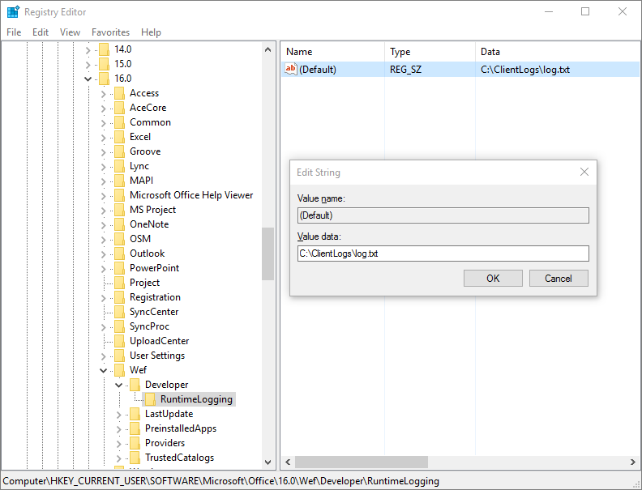

# <a name="debug-your-add-in-with-runtime-logging"></a>使用运行时日志记录功能调试加载项

可以使用运行时日志记录调试加载项的清单以及多个安装错误。 此功能可以帮助你标识并修复清单中未被 XSD 架构验证检测到的问题，例如资源 ID 间的不匹配等。 运行时日志记录对于调试执行加载项命令的加载项和 Excel 自定义功能尤其有用。

> [!NOTE]
> 运行时日志记录功能目前可用于桌面版 Office 2016 或更高版本。

> [!IMPORTANT]
> 运行时日志记录影响性能。 请仅在需要调试外接程序清单中的问题时启用此功能。

## <a name="use-runtime-logging-from-the-command-line"></a>使用命令行中的运行时日志

从命令行启用运行时日志记录是最快的使用此日志记录工具的方式。 这些使用 npx，默认情况下，它作为 npm@5.2.0+ 的一部分提供。 如果使用的是 [npm](https://www.npmjs.com/) 的早期版本，请尝试 [Windows 上的运行时日志记录](#runtime-logging-on-windows)或 [Mac](#runtime-logging-on-mac)说明，或者[安装 npx](https://www.npmjs.com/package/npx)。

[!INCLUDE[Office settings tool not supported on Mac](../includes/tool-nonsupport-mac-note.md)]

- 要启用运行时日志记录，请执行以下操作：

    ```command&nbsp;line
    npx office-addin-dev-settings runtime-log --enable
    ```

- 若要仅对特定文件启用运行时日志记录，请使用包含文件名的相同命令：

    ```command&nbsp;line
    npx office-addin-dev-settings runtime-log --enable [filename.txt]
    ```

- 要禁用运行时日志记录，请执行以下操作：

    ```command&nbsp;line
    npx office-addin-dev-settings runtime-log --disable
    ```

- 要显示是否启用了运行时日志记录，请执行以下操作：

    ```command&nbsp;line
    npx office-addin-dev-settings runtime-log
    ```

- 要在命令行内显示有关运行时日志记录的帮助，请执行以下操作：

    ```command&nbsp;line
    npx office-addin-dev-settings runtime-log --help
    ```

## <a name="runtime-logging-on-windows"></a>Windows 上的运行时日志记录

1. 确保运行的是 Office 2016 桌面版 **16.0.7019** 或更高版本。

2. 在 `HKEY_CURRENT_USER\SOFTWARE\Microsoft\Office\16.0\WEF\Developer\` 下添加 `RuntimeLogging` 注册表项。

    [!include[Developer registry key](../includes/developer-registry-key.md)]

3. 将 **RuntimeLogging** 项的默认值设置为你想要在其中写入日志的文件的完整路径。 有关示例，请参阅 [EnableRuntimeLogging.zip](https://github.com/OfficeDev/Office-Add-in-Commands-Samples/raw/master/Tools/RuntimeLogging/EnableRuntimeLogging.zip)。

    > [!NOTE]
    > 向其中写入日志文件的目录必须已经存在，并且必须拥有对它的写入权限。

注册表应如下图所示。 若要禁用此功能，请从注册表中删除 `RuntimeLogging`。



## <a name="runtime-logging-on-mac"></a>Mac 上的运行时日志记录

1. 请确保运行的是 Office 2016 桌面版本 **16.27.19071500** 或更高版本。

2. 打开 **终端** 并使用 `defaults` 命令设置运行时日志记录首选项：

    ```command&nbsp;line
    defaults write <bundle id> CEFRuntimeLoggingFile -string <file_name>
    ```

    `<bundle id>` 确定了主机要对哪些运行时日志记录。 `<file_name>` 是要将日志写入的文本文件的名称。

    设置为 `<bundle id>` 以下值之一，以启用相应应用程序的运行时日志记录。

    - `com.microsoft.Word`
    - `com.microsoft.Excel`
    - `com.microsoft.Powerpoint`
    - `com.microsoft.Outlook`

以下示例为 Word 启用运行时日志记录，然后打开日志文件。

```command&nbsp;line
defaults write com.microsoft.Word CEFRuntimeLoggingFile -string "runtime_logs.txt"
open ~/library/Containers/com.microsoft.Word/Data/runtime_logs.txt
```

> [!NOTE]
> 运行 `defaults` 命令来启用运行时日志记录后，需要重启 Office。

要关闭运行时日志记录，请使用 `defaults delete` 命令：

```command&nbsp;line
defaults delete <bundle id> CEFRuntimeLoggingFile
```

以下示例将关闭 Word 的运行时日志记录。

```command&nbsp;line
defaults delete com.microsoft.Word CEFRuntimeLoggingFile
```

## <a name="use-runtime-logging-to-troubleshoot-issues-with-your-manifest"></a>使用运行时日志记录功能排查清单问题

若要使用运行时日志记录功能排查加载项的加载问题，请执行以下操作：

1. [旁加载加载项](sideload-office-add-ins-for-testing.md)以供测试。

    > [!NOTE]
    > 建议仅旁加载要测试的加载项，以最大限度地减少日志文件中的消息数。

2. 如果没有任何变化，且看不到加载项（加载项对话框中没有显示），请打开日志文件。

3. Search the log file for your add-in ID, which you define in your manifest. In the log file, this ID is labeled `SolutionId`.

## <a name="known-issues-with-runtime-logging"></a>运行时日志记录已知问题

You might see messages in the log file that are confusing or that are classified incorrectly. For example:

- 后跟 `Unexpected Parsed manifest targeting different host` 的信息 `Medium Current host not in add-in's host list` 是错误分类为错误。

- 如果发现信息 `Unexpected Add-in is missing required manifest fields    DisplayName` 且其不包含 SolutionId，则此错误极可能与你正在调试的外接程序无关。

- Any `Monitorable` messages are expected errors from a system point of view. Sometimes they indicate an issue with your manifest, such as a misspelled element that was skipped but didn't cause the manifest to fail.

## <a name="see-also"></a>另请参阅

- [Office 加载项 XML 清单](../develop/add-in-manifests.md)
- [验证 Office 加载项的清单](troubleshoot-manifest.md)
- [清除 Office 缓存](clear-cache.md)
- [旁加载 Office 外接程序进行测试](sideload-office-add-ins-for-testing.md)
- [使用适用于 Internet Explorer 的开发人员工具调试加载项](debug-add-ins-using-f12-tools-ie.md)
- [使用旧版 Edge 开发人员工具调试加载项](debug-add-ins-using-devtools-edge-legacy.md)
- [使用 Microsoft Edge（基于 Chromium）中的开发人员工具调试加载项](debug-add-ins-using-devtools-edge-chromium.md) 
- [Office 加载项中的运行时](runtimes.md)