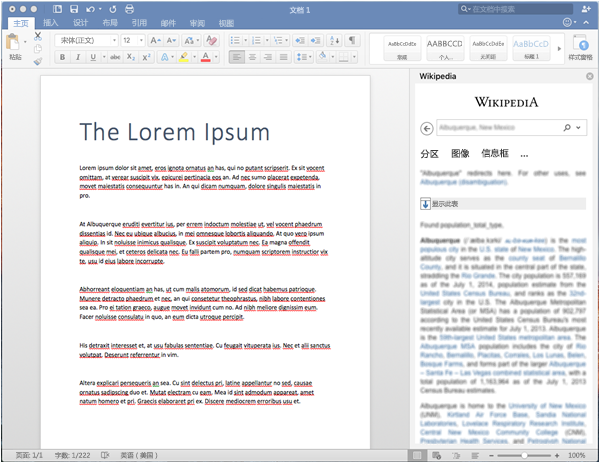

# 在 iPad 和 Mac 上旁加载 Office 加载项以供测试Sideload Office Add-ins on iPad and Mac for testing

若要查看你的外接程序在 Office for iOS 中如何运行，可以使用 iTunes 将你的外接程序的清单旁加载到 iPad，或直接将你的外接程序的清单旁加载到 Office for Mac 中。此操作并不能使你在运行时对其设置断点和调试代码，但你可以查看其行为方式，并验证 UI 可用且正确呈现。To see how your add-in will run in Office for iOS, you can sideload your add-in's manifest onto an iPad using iTunes, or sideload your add-in's manifest directly in Office for Mac. This action won't enable you to set breakpoints and debug your add-in's code while it's running, but you can see how it behaves and verify that the UI is usable and rendering appropriately. 

## Office for iOS 的先决条件Prerequisites for Office for iOS

- 安装了 [iTunes](https://www.apple.com/itunes/download/) 的 Windows 或 Mac 计算机。A Windows or Mac computer with [iTunes](https://www.apple.com/itunes/download/) installed.
    
- 安装了 [Excel for iPad](https://itunes.apple.com/us/app/microsoft-excel/id586683407?mt=8) 的 iPad（运行 iOS 8.2 或更高版本）以及同步电缆。An iPad running iOS 8.2 or later with [Excel for iPad](https://itunes.apple.com/us/app/microsoft-excel/id586683407?mt=8) installed, and a sync cable.
    
- 您要测试的外接程序的清单 .xml 文件。The manifest .xml file for the add-in you want to test.
    

## Office for Mac 的先决条件Prerequisites for Office for Mac

- 在已安装 [Office for Mac](https://products.office.com/buy/compare-microsoft-office-products?tab=omac) 的情况下可运行 OS X v10.10 "Yosemite" 或更高版本的 Mac。A Mac running OS X v10.10 "Yosemite" or later with [Office for Mac](https://products.office.com/buy/compare-microsoft-office-products?tab=omac) installed.
    
- Word for Mac 版本 15.18 (160109)。Word for Mac version 15.18 (160109).
   
- Excel for Mac 版本 15.19 (160206)。Excel for Mac version 15.19 (160206).

- PowerPoint for Mac 版本 15.24 (160614)PowerPoint for Mac version 15.24 (160614)
    
- 你想要测试的外接程序的清单 .xml 文件。The manifest .xml file for the add-in you want to test.
    

## 将外接程序旁加载到 Excel for iPad 或 Word for iPad 上Sideload an add-in on Excel or Word for iPad

1. 使用同步电缆将 iPad 连接到你的计算机。如果是第一次将 iPad 连接到计算机，系统将提示“**信任此计算机？**”。选择“**信任**”继续执行操作。Use a sync cable to connect your iPad to your computer. If you're connecting the iPad to your computer for the first time, you'll be prompted with  **Trust This Computer?**. Choose **Trust** to continue.

2. 在 iTunes 中，选择菜单栏下的“**iPad**”图标。In iTunes, choose the  **iPad** icon below the menu bar.

3. 在 iTunes 左侧的"设置"下，选择"应用程序"。Under  **Settings** on the left side of iTunes, choose **Apps**.

4. 在 iTunes 右侧，向下滚动到"文件共享"，然后在"外接程序"列下选择"Excel"或"Word"。On the right side of iTunes, scroll down to  **File Sharing**, and then choose  **Excel** or **Word** in the **Add-ins** column.

5. 在"Excel"或"Word 文档"列底部，选择"添加文件"，然后选择您要旁加载的外接程序的清单 .xml 文件。At the bottom of the  **Excel** or **Word Documents** column, choose **Add File**, and then select the manifest .xml file of the add-in you want to sideload. 
    
6. 在你的 iPad 上打开 Excel 或 Word 应用。如果 Excel 或 Word 应用已运行，则选择“**首页**”按钮，然后关闭并重新启动该应用。Open the Excel or Word app on your iPad. If the Excel or Word app is already running, choose the  **Home** button, and then close and restart the app.
    
7. 打开一个文档。Open a document.
    
8. 选择“**插入**”选项卡上的“**外接程序**”。旁加载的外接程序可在“**外接程序**”UI 中的“**开发人员**”标题下插入。Choose  **Add-ins** on the **Insert** tab. Your sideloaded add-in is available to insert under the **Developer** heading in the **Add-ins** UI.
    
    

## 在 Office for Mac 上旁加载加载项Sideload an add-in on Office for Mac

> [!NOTE]
> 若要旁加载 Outlook for Mac 加载项，请参阅[旁加载 Outlook 加载项以供测试](https://docs.microsoft.com/outlook/add-ins/sideload-outlook-add-ins-for-testing)。To sideload Outlook for Mac add-in, see [Sideload Outlook add-ins for testing](https://docs.microsoft.com/outlook/add-ins/sideload-outlook-add-ins-for-testing).

1. 打开“**终端**”并转到以下文件夹之一，你将在其中保存外接程序的清单文件。如果 `wef` 文件夹在你的计算机上不存在，请创建它。Open  **Terminal** and go to one of the following folders where you'll save your add-in's manifest file. If the `wef` folder doesn't exist on your computer, create it.
    
    - 对于 Word：`/Users/<username>/Library/Containers/com.microsoft.Word/Data/documents/wef`For Word:  `/Users/<username>/Library/Containers/com.microsoft.Word/Data/documents/wef`    
    - 对于 Excel：`/Users/<username>/Library/Containers/com.microsoft.Excel/Data/documents/wef`For Excel:  `/Users/<username>/Library/Containers/com.microsoft.Excel/Data/documents/wef`
    - 对于 PowerPoint：`/Users/<username>/Library/Containers/com.microsoft.Powerpoint/Data/documents/wef`For PowerPoint: `/Users/<username>/Library/Containers/com.microsoft.Powerpoint/Data/documents/wef`
    
2. 在“**查找程序**”中使用命令 `open .`（包括句点或点）打开该文件夹。将你的外接程序的清单文件复制到该文件夹中。Open the folder in  **Finder** using the command `open .` (including the period or dot). Copy your add-in's manifest file to this folder.
    
    

3. 打开 Word，然后打开一个文档。如果 Word 已运行，则重新启动它。Open Word, and then open a document. Restart Word if it's already running.
    
4. 在 Word 中，选择“**插入**” > “**外接程序**” > “**我的外接程序**”（下拉菜单），然后选择外接程序。In Word, choose  **Insert** > **Add-ins** > **My Add-ins** (drop-down menu), and then choose your add-in.
    
    

    > [!IMPORTANT]
    > 旁加载的加载项不会显示在“我的加载项”对话框中。它们仅显示在下拉菜单中（单击“插入”\*\*\*\* 选项卡上“我的加载项”右侧的向下小箭头）。旁加载的加载项在此菜单中的“开发人员加载项”\*\*\*\* 标题下列出。Sideloaded add-ins will not show up in the My Add-ins dialog box. They are only visible within the drop-down menu (small down-arrow to the right of My Add-ins on the **Insert** tab). Sideloaded add-ins are listed under the **Developer Add-ins** heading in this menu. 
    
5. 验证加载项是否在 Word 中显示。Verify that your add-in is displayed in Word.
    
    
    
    > [!NOTE]
    > 出于性能方面的考虑，加载项通常在 Office for Mac 中缓存。Add-ins are cached often in Office for Mac, for performance reasons. 开发加载项时，如果需要强制对其进行重新加载，则可以清除 `Users/<usr>/Library/Containers/com.Microsoft.OsfWebHost/Data/` 文件夹。If you need to force a reload of your add-in while you're developing it, you can clear the `Users/<usr>/Library/Containers/com.Microsoft.OsfWebHost/Data/` folder. 如果该文件夹不存在，请清除 `com.microsoft.Office365ServiceV2/Data/Caches/com.microsoft.Office365ServiceV2/` 文件夹中的文件。If that folder doesn't exist, clear the files in the `com.microsoft.Office365ServiceV2/Data/Caches/com.microsoft.Office365ServiceV2/` folder.

## 另请参阅See also

- [在 iPad 和 Mac 上调试 Office 加载项Debug Office Add-ins on iPad and Mac](debug-office-add-ins-on-ipad-and-mac.md)
