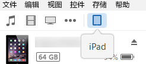
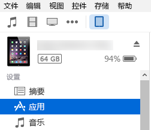
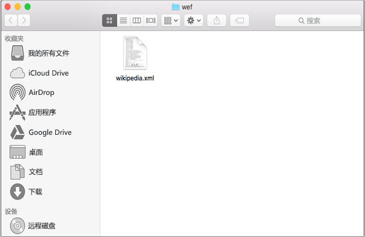
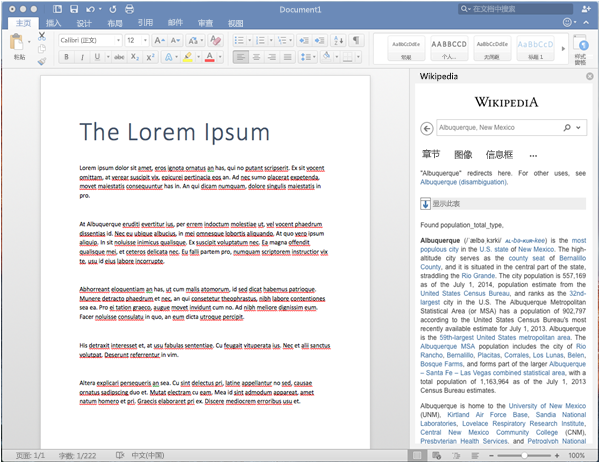

# 在 iPad 和 Mac 上旁加载 Office 外接程序以进行测试

若要查看你的外接程序在 Office for iOS 中如何运行，可以使用 iTunes 将你的外接程序的清单旁加载到 iPad，或直接将你的外接程序的清单旁加载到 Office for Mac 中。此操作并不能使你在运行时对其设置断点和调试代码，但你可以查看其行为方式，并验证 UI 可用且正确呈现。 

## Office for iOS 的先决条件

- 安装了 [iTunes](http://www.apple.com/itunes/download/) 的 Windows 或 Mac 计算机。
    
- 安装了 [Excel for iPad](https://itunes.apple.com/us/app/microsoft-excel/id586683407?mt=8) 的 iPad（运行 iOS 8.2 或更高版本）以及同步电缆。
    
- 您要测试的外接程序的清单 .xml 文件。
    

## Office for Mac 的先决条件

- 在已安装 [Office for Mac](https://products.office.com/en-us/buy/compare-microsoft-office-products?tab=omac) 的情况下可运行 OS X v10.10 "Yosemite" 或更高版本的 Mac。
    
- Word for Mac 版本 15.18 (160109)。
   
- Excel for Mac 版本 15.19 (160206)。

- PowerPoint for Mac 版本 15.24 (160614)
    
- 你想要测试的外接程序的清单 .xml 文件。
    

## 将外接程序旁加载到 Excel for iPad 或 Word for iPad 上

1. 使用同步电缆将 iPad 连接到你的计算机。如果是第一次将 iPad 连接到计算机，系统将提示“**信任此计算机？**”。选择“**信任**”继续执行操作。

2. 在 iTunes 中，选择菜单栏下的“**iPad**”图标。
    
    

3. 在 iTunes 左侧的“**设置**”下，选择“**应用**”。
    
    

4. 在 iTunes 右侧，向下滚动到“**文件共享**”，然后在“**外接程序**”列下选择“**Excel**”或“**Word**”。
    
    

5. 在“**Excel**”或“**Word 文档**”列底部，选择“**添加文件**”，然后选择你要旁加载的外接程序的清单 .xml 文件。 
    
6. 在你的 iPad 上打开 Excel 或 Word 应用。如果 Excel 或 Word 应用已运行，则选择“**首页**”按钮，然后关闭并重新启动该应用。
    
7. 打开一个文档。
    
8. 选择“**插入**”选项卡上的“**外接程序**”。旁加载的外接程序可在“**外接程序**”UI 中的“**开发人员**”标题下插入。
    
    

## 将外接程序旁加载到 Office for Mac 上

> **注意：**若要旁加载 Outlook 2016 for Mac 外接程序，请参阅 [旁加载 Outlook 外接程序以进行测试](sideload-outlook-add-ins-for-testing.md)。

1. 打开“**终端**”并转到以下文件夹之一，你将在其中保存外接程序的清单文件。如果 `wef` 文件夹在你的计算机上不存在，请创建它。
    
    - 对于 Word：`/Users/<username>/Library/Containers/com.microsoft.Word/Data/documents/wef`    
    - 对于 Excel：`/Users/<username>/Library/Containers/com.microsoft.Excel/Data/documents/wef`
    - 对于 PowerPoint：`/Users/<username>/Library/Containers/com.microsoft.Powerpoint/Data/documents/wef`
    
2. 在“**查找程序**”中使用命令 `open .`（包括句点或点）打开该文件夹。将你的外接程序的清单文件复制到该文件夹中。
    
    

3. 打开 Word，然后打开一个文档。如果 Word 已运行，则重新启动它。
    
4. 在 Word 中，选择“**插入**” > “**外接程序**” > “**我的外接程序**”（下拉菜单），然后选择外接程序。
    
    

  > **重要说明：**旁加载的外接程序不会出现在“我的外接程序”对话框中。它们仅在下拉菜单内可见（“插入”****选项卡上“我的外接程序”右侧的小向下箭头）。旁加载的外接程序在本菜单中的“开发人员外接程序”****标题下列出。 
    
5. 验证外接程序是否显示在 Word 中。
    
    
    
> **注意：**出于性能方面考虑，外接程序通常在 Office for Mac 中缓存。开发外接程序时，如果需要强制对其进行重新加载，则可以清除 Users/<usr>/Library/Containers/com.Microsoft.OsfWebHost/Data/ 文件夹。 

## 其他资源

- [在 iPad 和 Mac 上调试 Office 外接程序](../testing/debug-office-add-ins-on-ipad-and-mac.md)
    
