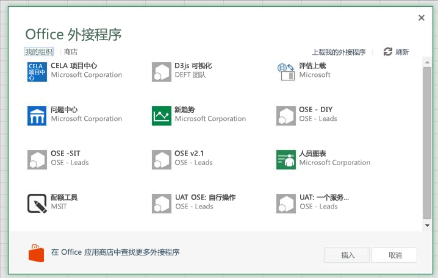
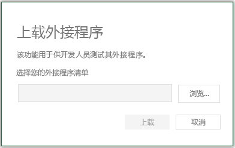
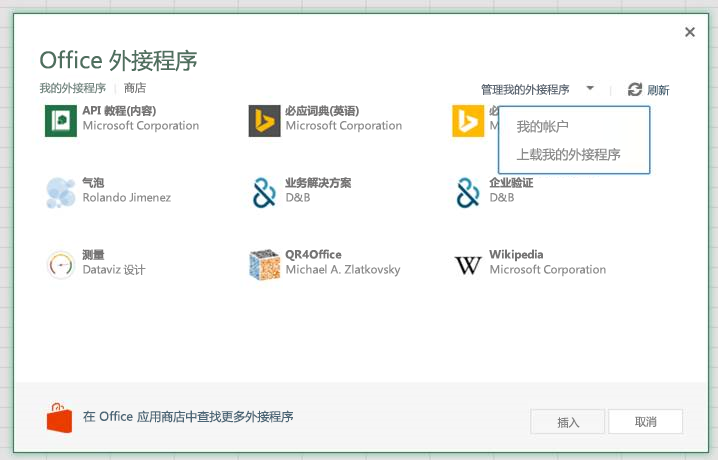

# <a name="sideload-office-add-ins-in-office-online-for-testing"></a>用于测试的 Office Online 中的旁加载 Office 外接程序

您可以安装 Office 外接程序进行测试，而无需首先使用旁加载将其放在外接程序目录中。在 Office 365 或 Office Online 中都可以进行旁加载。该过程对两个平台略有不同。 

当旁加载外接程序时，外接程序清单存储在浏览器的本地存储区中，因此如果清除浏览器的缓存，或切换到另一个浏览器，就必须再次旁加载该外接程序。


 >**注意：**如本文所述，Word、Excel 和 PowerPoint 支持旁加载。若要旁加载 Outlook 外接程序，请参阅[旁加载 Outlook 外接程序并进行测试](sideload-outlook-add-ins-for-testing.md)。

下面的视频演示将外接程序旁加载到 Office 桌面或 Office Online 上的流程。

<iframe width="560" height="315" src="https://www.youtube.com/embed/XXsAw2UUiQo" frameborder="0" allowfullscreen></iframe>

## <a name="sideload-an-office-add-in-on-office-365"></a>在 Office 365 上旁加载 Office 外接程序


1. 登录到您的 Office 365 帐户。
    
2. 打开工具栏最左侧的应用启动器并选择 **Excel**、**Word** 或 **PowerPoint**，然后创建一个新文档。
    
3. 打开功能区上的“**插入**”选项卡，然后在“**外接程序**”部分中，选择“**Office 外接程序**”。
    
4. 在“**Office 外接程序**”对话框中，选择“**我的组织**”选项卡，然后选择“**上载我的外接程序**”。
    
    

5.  “**浏览**”到外接程序清单文件，然后选择“**上载**”。
    
    

6. 验证是否已安装外接程序。例如，如果它是一个外接程序命令，它应显示在功能区或上下文菜单上。如果它是一个任务窗格外接程序，则应显示窗格。
    

## <a name="sideload-an-office-add-in-on-office-online"></a>将 Office 外接程序旁加载在 Office Online 上


1. 打开 [Microsoft Office Online](https://office.live.com/)。
    
2. 在“**立即开始使用在线应用**”中，选择 **Excel**、**Word** 或 **PowerPoint**；然后打开一个新文档。
    
3. 打开功能区上的“**插入**”选项卡，然后在“**外接程序**”部分中，选择“**Office 外接程序**”。
    
4. 在“**Office 外接程序**”对话框中，选择“**我的外接程序**”选项卡，选择“**管理我的外接程序**”，然后选择“**上载我的外接程序**”。
    
    

5.  “**浏览**”到外接程序清单文件，然后选择“**上载**”。
    
    

6. 验证是否已安装外接程序。例如，如果它是一个外接程序命令，它应显示在功能区或上下文菜单上。如果它是一个任务窗格外接程序，则应显示窗格。

## <a name="sideload-an-add-in-when-using-visual-studio"></a>使用 Visual Studio 时旁加载外接程序

如果使用 Visual Studio 来开发外接程序，则旁加载的过程类似。唯一的区别是，必须更新清单中 **SourceURL** 元素的值以包含部署外接程序位置的完整 URL。 

如果当前正在开发外接程序，则找到外接程序 manifest.xml 文件，并更新 **SourceLocation** 元素值以包含绝对 URI。Visual Studio 将放置一个令牌以供 localhost 部署。

例如： 

    ```xml
    <SourceLocation DefaultValue="https://localhost:44300/App/Home/Home.html" />
    ```
