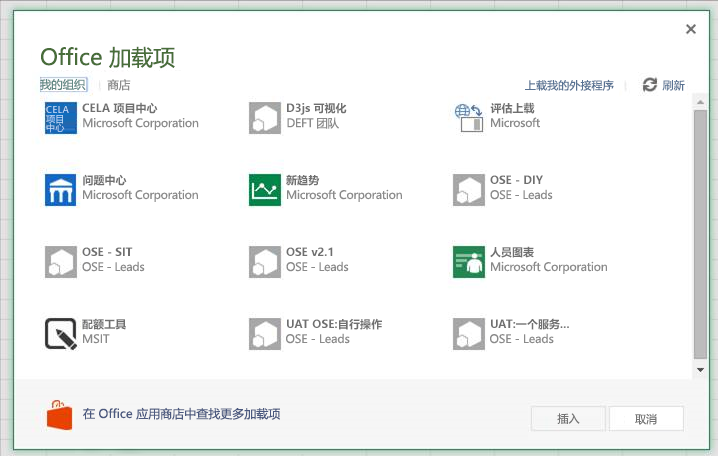

# <a name="sideload-office-add-ins-in-office-online-for-testing"></a>在 Office Online 中旁加载 Office 加载项以供测试

您可以安装 Office 外接程序进行测试，而无需首先使用旁加载将其放在外接程序目录中。在 Office 365 或 Office Online 中都可以进行旁加载。该过程对两个平台略有不同。 

当旁加载外接程序时，外接程序清单存储在浏览器的本地存储区中，因此如果清除浏览器的缓存，或切换到另一个浏览器，就必须再次旁加载该外接程序。


> [!NOTE]
> 如本文所述，Word、Excel 和 PowerPoint 支持旁加载。若要旁加载 Outlook 外接程序，请参阅[旁加载 Outlook 外接程序进行测试](https://docs.microsoft.com/outlook/add-ins/sideload-outlook-add-ins-for-testing)。

下面的视频逐步展示了如何在 Office 桌面或 Office Online 上旁加载加载项。  


> [!VIDEO https://www.youtube.com/embed/XXsAw2UUiQo]

## <a name="sideload-an-office-add-in-on-office-365"></a>在 Office 365 上旁加载 Office 加载项


1. 登录 Office 365 帐户。
    
2. 打开工具栏最左端的应用启动器，选择“Excel”****、“Word”**** 或“PowerPoint”****，再新建文档。
    
3. 打开功能区上的“**插入**”选项卡，然后在“**外接程序**”部分中，选择“**Office 外接程序**”。
    
4. 在“Office 加载项”**** 对话框中，依次选择“我的组织”**** 选项卡和“上传我的加载项”****。
    
    

5.  **转到**加载项清单文件，再选择“上传”****。
    
    

6. 验证是否已安装外接程序。例如，如果它是一个外接程序命令，它应显示在功能区或上下文菜单上。如果它是一个任务窗格外接程序，则应显示窗格。
    

## <a name="sideload-an-office-add-in-on-office-online"></a>将 Office 外接程序旁加载在 Office Online 上


1. 打开 [Microsoft Office Online](https://office.live.com/)。
    
2. 在“**立即开始使用在线应用**”中，选择 **Excel**、**Word** 或 **PowerPoint**；然后打开一个新文档。
    
3. 打开功能区上的“**插入**”选项卡，然后在“**外接程序**”部分中，选择“**Office 外接程序**”。
    
4. 在“Office 加载项”**** 对话框中，依次选择“我的加载项”**** 选项卡、“管理我的加载项”**** 和“上传我的加载项”****。
    
    

5.  **转到**加载项清单文件，再选择“上传”****。
    
    

6. 验证是否已安装外接程序。例如，如果它是一个外接程序命令，它应显示在功能区或上下文菜单上。如果它是一个任务窗格外接程序，则应显示窗格。

> [!NOTE]
>要使用 Edge 测试您的 Office 加载项，请在 Edge 搜索栏中输入 "**about:flags**" 以调出“开发者设置”选项。  选中“** 允许本地主机环回**”选项并重启 Edge。

>    

## <a name="sideload-an-add-in-when-using-visual-studio"></a>使用 Visual Studio 时旁加载外接程序

如果使用 Visual Studio 来开发外接程序，则旁加载的过程类似。唯一的区别是，必须更新清单中 **SourceURL** 元素的值以包含部署外接程序位置的完整 URL。 

如果当前正在开发外接程序，则找到外接程序 manifest.xml 文件，并更新 **SourceLocation** 元素值以包含绝对 URI。Visual Studio 将放置一个令牌以供 localhost 部署。

例如： 

```xml
<SourceLocation DefaultValue="https://localhost:44300/App/Home/Home.html" />
```
