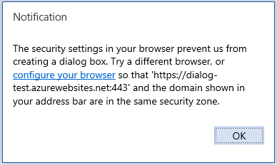

# <a name="troubleshoot-user-errors-with-office-add-ins"></a>排查 Office 加载项中的用户错误

有时，您的用户在使用您开发的 Office 外接程序时可能会遇到问题。例如，外接程序无法加载或无法访问。使用本文中的信息有助于解决您的用户在使用 Office 外接程序时遇到的常见问题。 

还可以使用 [Fiddler](https://www.telerik.com/fiddler) 发现和调试加载项问题。

## <a name="common-errors-and-troubleshooting-steps"></a>常见错误和故障排除步骤

下表列出了用户可能遇到的常见错误消息以及用户可以采取以解决这些错误的步骤。


|**错误消息**|**解决方案**|
|:-----|:-----|
|应用错误：无法访问目录|验证防火墙设置。“目录”是指 AppSource。此消息表明用户无法访问 AppSource。|
|应用错误：无法启动此应用。若要忽略此问题，请关闭这个对话框。若要重试，请单击“重启”。|确认已安装最新的 Office 更新，或下载 [Office 2013 更新](https://support.microsoft.com/kb/2986156/)。|
|错误：对象不 支持此属性或方法 "defineProperty"|确认 Internet Explorer 不是在兼容模式下运行。 转到“工具”>“兼容性视图设置”。|
|很抱歉，我们无法加载 该应用程序，因为您的浏览器 版本不受支持。 单击此处查看 支持的浏览器版本的列表。|确保浏览器支持 HTML5 本地存储，或重置您的 Internet Explorer 设置。有关受支持的浏览器的信息，请参阅 [运行 Office 加载项的要求](../concepts/requirements-for-running-office-add-ins.md)。|

## <a name="when-installing-an-add-in-you-see-error-loading-add-in-in-the-status-bar"></a>安装加载项时，状态栏中会显示“加载加载项时出错”

1. 关闭 Office。
2. 验证清单是否有效
3. 重启加载项
4. 再次安装加载项。

你还可以向我们提供反馈：如果使用 Windows 版 Excel 或 Mac 版 Excel，可以直接从 Excel 向 Office 扩展性团队报告反馈。 若要执行此操作，请选择“**文件**” | “**反馈**” | “**发送哭脸**”。 发送哭脸将提供必要的日志，以帮助我们了解该问题。

## <a name="outlook-add-in-doesnt-work-correctly"></a>Outlook 外接程序不能正常工作

如果在 Windows 上运行并[使用 Internet Explorer](../concepts/browsers-used-by-office-web-add-ins.md) 的 Outlook 加载项不能正常工作，请尝试在 Internet Explorer 中启用脚本调试。 


- 转到工具> **Internet 选项**  >  **高级**。
    
- 在“浏览”下，取消选中“禁用脚本调试 (Internet Explorer)”和“禁用脚本调试 (其他)”。
    
我们建议您仅在解决问题时取消选中这些设置。如果您将其保持未选中状态，您在浏览时将会收到提示。解决此问题后，再次选中“禁用脚本调试 (Internet Explorer)”和“禁用脚本调试 (其他)”。


## <a name="add-in-doesnt-activate-in-office-2013"></a>外接程序在 Office 2013 中无法激活

如果在用户执行下列步骤时外接程序无法激活：


1. 使用 Microsoft 帐户在 Office 2013 中登录。
    
2. 为其 Microsoft 帐户启用两步验证。
    
3. 尝试插入外接程序时在收到提示的时候验证其身份。
    
确认是否已安装最新的 Office 更新程序，或下载 [Office 2013 更新程序](https://support.microsoft.com/kb/2986156/)。

## <a name="add-in-dialog-box-cannot-be-displayed"></a>无法显示外接程序对话框

使用 Office 外接程序时，将要求用户允许显示对话框。用户选择“**允许**”，将出现以下错误消息：

“浏览器中的安全设置阻止创建对话框。请尝试使用其他浏览器，或者配置浏览器，使地址栏中显示的 [URL] 和域处于同一安全区域。”



|**受影响的浏览器**|**受影响的平台**|
|:--------------------|:---------------------|
|Internet Explorer、Microsoft Edge|Office 网页版|

若要解决此问题，最终用户或管理员可以向 Internet Explorer 中的受信任站点列表添加外接程序的域。无论使用的是 Internet Explorer 还是 Microsoft Edge 浏览器，请使用相同过程。

> [!IMPORTANT]
> 请勿将不信任的加载项的 URL 添加到受信任网站列表中。

要将 URL 添加到受信任站点的列表中，请执行以下操作：

1. 在“**控制面板**”中，转到“**Internet 选项**” > “**安全性**”。
2. 选择“**受信任站点**”区域，并选择“**网站**”。
3. 输入错误消息中显示的 URL，然后选择“**添加**”。
4. 再次尝试使用外接程序。如果问题仍然存在，请验证其他安全区域的设置，并确保外接程序域与 Office 应用程序地址栏中显示的 URL 处于同一区域。

在弹出模式中使用对话框 API 时，会出现此问题。若要避免出现此问题，请使用 [displayInFrame](/javascript/api/office/office.ui) 标记。这要求页面支持在 iframe 中进行显示。以下示例演示如何使用此标记。

```js
Office.context.ui.displayDialogAsync(startAddress, {displayInIFrame:true}, callback);
```

## <a name="see-also"></a>另请参阅

- [排查Office加载项的开发错误](troubleshoot-development-errors.md)
