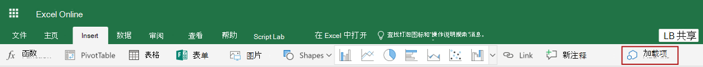
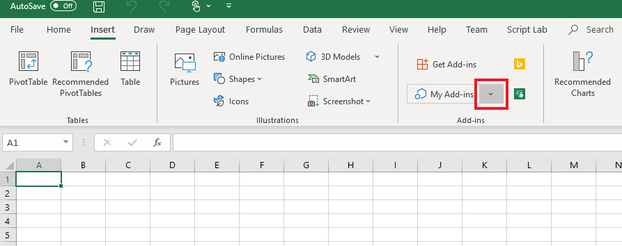

# <a name="tutorial-create-custom-functions-in-excel"></a><span data-ttu-id="99ce1-103">教程：在 Excel 中创建自定义函数</span><span class="sxs-lookup"><span data-stu-id="99ce1-103">Tutorial: Create custom functions in Excel</span></span>

<span data-ttu-id="99ce1-104">用户可以借助自定义函数向 Excel 添加新函数，方法是在 JavaScript 中将这些函数定义为加载项的一部分。</span><span class="sxs-lookup"><span data-stu-id="99ce1-104">Custom functions enable you to add new functions to Excel by defining those functions in JavaScript as part of an add-in.</span></span> <span data-ttu-id="99ce1-105">Excel 中的用户可以访问自定义函数，就像他们访问 Excel 中的任何本机函数一样，比如 `SUM()`。</span><span class="sxs-lookup"><span data-stu-id="99ce1-105">Users within Excel can access custom functions as they would any native function in Excel, such as `SUM()`.</span></span> <span data-ttu-id="99ce1-106">可以创建自定义函数，以执行简单的任务（如计算）或更复杂的任务（如将实时数据从 Web 传送到工作表中）。</span><span class="sxs-lookup"><span data-stu-id="99ce1-106">You can create custom functions that perform simple tasks like calculations or more complex tasks such as streaming real-time data from the web into a worksheet.</span></span>

<span data-ttu-id="99ce1-107">在本教程中，你将：</span><span class="sxs-lookup"><span data-stu-id="99ce1-107">In this tutorial, you will:</span></span>
> [!div class="checklist"]
> * <span data-ttu-id="99ce1-108">使用[适用于 Office 加载项的 Yeoman 生成器](https://www.npmjs.com/package/generator-office)来创建自定义函数加载项。</span><span class="sxs-lookup"><span data-stu-id="99ce1-108">Create a custom function add-in using the [Yeoman generator for Office Add-ins](https://www.npmjs.com/package/generator-office).</span></span> 
> * <span data-ttu-id="99ce1-109">使用预生成的自定义函数来执行简单计算。</span><span class="sxs-lookup"><span data-stu-id="99ce1-109">Use a prebuilt custom function to perform a simple calculation.</span></span>
> * <span data-ttu-id="99ce1-110">创建从 Web 获取数据的自定义函数。</span><span class="sxs-lookup"><span data-stu-id="99ce1-110">Create a custom function that gets data from the web.</span></span>
> * <span data-ttu-id="99ce1-111">创建从 Web 传送实时数据的自定义函数。</span><span class="sxs-lookup"><span data-stu-id="99ce1-111">Create a custom function that streams real-time data from the web.</span></span>

## <a name="prerequisites"></a><span data-ttu-id="99ce1-112">先决条件</span><span class="sxs-lookup"><span data-stu-id="99ce1-112">Prerequisites</span></span>

[!include[Yeoman generator prerequisites](../includes/quickstart-yo-prerequisites.md)]

* <span data-ttu-id="99ce1-113">Windows (版本1904或更高版本, 连接到 Office 365 订阅) 或 web 上的 Excel</span><span class="sxs-lookup"><span data-stu-id="99ce1-113">Excel on Windows (version 1904 or later, connected to Office 365 subscription) or on the web</span></span>

## <a name="create-a-custom-functions-project"></a><span data-ttu-id="99ce1-114">创建自定义函数项目</span><span class="sxs-lookup"><span data-stu-id="99ce1-114">Create a custom functions project</span></span>

 <span data-ttu-id="99ce1-115">首先，创建代码项目以构建自定义函数加载项。</span><span class="sxs-lookup"><span data-stu-id="99ce1-115">To start, you'll create the code project to build your custom function add-in.</span></span> <span data-ttu-id="99ce1-116">[Office 外接程序的 Yeoman 生成器](https://www.npmjs.com/package/generator-office)将使用一些预生成的自定义函数来设置您的项目, 您可以试用这些函数。如果已运行自定义函数 "快速启动" 并生成了一个项目, 请继续使用该项目, 然后跳到[此步骤](#create-a-custom-function-that-requests-data-from-the-web)。</span><span class="sxs-lookup"><span data-stu-id="99ce1-116">The [Yeoman generator for Office Add-ins](https://www.npmjs.com/package/generator-office) will set up your project with some prebuilt custom functions that you can try out. If you have already run the custom functions quick start and generated a project, continue to use that project and skip to [this step](#create-a-custom-function-that-requests-data-from-the-web) instead.</span></span>

1. <span data-ttu-id="99ce1-117">运行下面的命令，再回答如下所示的提示问题。</span><span class="sxs-lookup"><span data-stu-id="99ce1-117">Run the following command and then answer the prompts as follows.</span></span>
    
    ```command&nbsp;line
    yo office
    ```
    
    * <span data-ttu-id="99ce1-118">**选择项目类型:** `Excel Custom Functions Add-in project`</span><span class="sxs-lookup"><span data-stu-id="99ce1-118">**Choose a project type:** `Excel Custom Functions Add-in project`</span></span>
    * <span data-ttu-id="99ce1-119">**选择脚本类型:** `JavaScript`</span><span class="sxs-lookup"><span data-stu-id="99ce1-119">**Choose a script type:** `JavaScript`</span></span>
    * <span data-ttu-id="99ce1-120">**要如何命名加载项?**</span><span class="sxs-lookup"><span data-stu-id="99ce1-120">**What do you want to name your add-in?**</span></span> `starcount`

    
    
    <span data-ttu-id="99ce1-122">Yeoman 生成器将创建项目文件并安装支持的 Node 组件。</span><span class="sxs-lookup"><span data-stu-id="99ce1-122">The Yeoman generator will create the project files and install supporting Node components.</span></span>

2. <span data-ttu-id="99ce1-123">导航到项目的根文件夹。</span><span class="sxs-lookup"><span data-stu-id="99ce1-123">Navigate to the root folder of the project.</span></span>
    
    ```command&nbsp;line
    cd starcount
    ```

3. <span data-ttu-id="99ce1-124">生成项目。</span><span class="sxs-lookup"><span data-stu-id="99ce1-124">Build the project.</span></span>
    
    ```command&nbsp;line
    npm run build
    ```

    > [!NOTE]
    > <span data-ttu-id="99ce1-125">Office 加载项应使用 HTTPS，而不是 HTTP（即便是在开发时也是如此）。</span><span class="sxs-lookup"><span data-stu-id="99ce1-125">Office Add-ins should use HTTPS, not HTTP, even when you are developing.</span></span> <span data-ttu-id="99ce1-126">如果系统在运行 `npm run build` 后提示你安装证书，请接受提示以安装 Yeoman 生成器提供的证书。</span><span class="sxs-lookup"><span data-stu-id="99ce1-126">If you are prompted to install a certificate after you run `npm run build`, accept the prompt to install the certificate that the Yeoman generator provides.</span></span>

4. <span data-ttu-id="99ce1-127">启动在 Node.js 中运行的本地 Web 服务器。</span><span class="sxs-lookup"><span data-stu-id="99ce1-127">Start the local web server, which runs in Node.js.</span></span> <span data-ttu-id="99ce1-128">您可以在 Excel 网页或 Windows 中试用自定义函数加载项。</span><span class="sxs-lookup"><span data-stu-id="99ce1-128">You can try out the custom function add-in in Excel on the web or Windows.</span></span>

# <a name="excel-on-windows-or-mactabexcel-windows"></a>[<span data-ttu-id="99ce1-129">Windows 或 Mac 上的 Excel</span><span class="sxs-lookup"><span data-stu-id="99ce1-129">Excel on Windows or Mac</span></span>](#tab/excel-windows)

<span data-ttu-id="99ce1-130">若要在 Excel 中的 Windows 或 Mac 上测试外接程序, 请运行以下命令。</span><span class="sxs-lookup"><span data-stu-id="99ce1-130">To test your add-in in Excel on Windows or Mac, run the following command.</span></span> <span data-ttu-id="99ce1-131">运行此命令时, 本地 web 服务器将启动, 并且 Excel 将在加载的外接程序中打开。</span><span class="sxs-lookup"><span data-stu-id="99ce1-131">When you run this command, the local web server will start and Excel will open with your add-in loaded.</span></span>

```command&nbsp;line
npm run start:desktop
```

# <a name="excel-on-the-webtabexcel-online"></a>[<span data-ttu-id="99ce1-132">在 web 上的 Excel</span><span class="sxs-lookup"><span data-stu-id="99ce1-132">Excel on the web</span></span>](#tab/excel-online)

<span data-ttu-id="99ce1-133">若要在 Excel 中的浏览器上测试外接程序, 请运行以下命令。</span><span class="sxs-lookup"><span data-stu-id="99ce1-133">To test your add-in in Excel on a browser, run the following command.</span></span> <span data-ttu-id="99ce1-134">运行此命令时，本地 Web 服务器将启动。</span><span class="sxs-lookup"><span data-stu-id="99ce1-134">When you run this command, the local web server will start.</span></span>

```command&nbsp;line
npm run start:web
```

<span data-ttu-id="99ce1-135">若要使用自定义函数外接程序, 请在 web 上的 Excel 中打开一个新工作簿。</span><span class="sxs-lookup"><span data-stu-id="99ce1-135">To use your custom functions add-in, open a new workbook in Excel on the web.</span></span> <span data-ttu-id="99ce1-136">在此工作簿中, 完成以下步骤以旁加载您的外接程序。</span><span class="sxs-lookup"><span data-stu-id="99ce1-136">In this workbook, complete the following steps to sideload your add-in.</span></span>

1. <span data-ttu-id="99ce1-137">在 Excel 中, 选择 "**插入**" 选项卡, 然后选择 "**外接程序**"。</span><span class="sxs-lookup"><span data-stu-id="99ce1-137">In Excel, choose the **Insert** tab and then choose **Add-ins**.</span></span>

   
   
2. <span data-ttu-id="99ce1-139">选择“管理我的加载项”\*\*\*\*，然后选择“上载我的加载项”\*\*\*\*。</span><span class="sxs-lookup"><span data-stu-id="99ce1-139">Choose **Manage My Add-ins** and select **Upload My Add-in**.</span></span>

3. <span data-ttu-id="99ce1-140">选择“浏览...”\*\*\*\*，并导航到 Yeoman 生成器创建的项目的根目录。</span><span class="sxs-lookup"><span data-stu-id="99ce1-140">Choose **Browse...** and navigate to the root directory of the project that the Yeoman generator created.</span></span>

4. <span data-ttu-id="99ce1-141">依次选择文件“manifest.xml”\*\*\*\*，“打开”\*\*\*\*，然后选择“上载”\*\*\*\*。</span><span class="sxs-lookup"><span data-stu-id="99ce1-141">Select the file **manifest.xml** and choose **Open**, then choose **Upload**.</span></span>

--- 
    
## <a name="try-out-a-prebuilt-custom-function"></a><span data-ttu-id="99ce1-142">尝试预生成的自定义函数</span><span class="sxs-lookup"><span data-stu-id="99ce1-142">Try out a prebuilt custom function</span></span>

<span data-ttu-id="99ce1-143">您创建的自定义函数项目包含一些预生成的自定义函数, 这些函数是在 **/src/functions/functions.js**文件中定义的。</span><span class="sxs-lookup"><span data-stu-id="99ce1-143">The custom functions project that you created contains some prebuilt custom functions, defined within the **./src/functions/functions.js** file.</span></span> <span data-ttu-id="99ce1-144">**./manifest.xml** 文件指定所有自定义函数均属于 `CONTOSO` 命名空间。</span><span class="sxs-lookup"><span data-stu-id="99ce1-144">The **./manifest.xml** file specifies that all custom functions belong to the `CONTOSO` namespace.</span></span> <span data-ttu-id="99ce1-145">你将使用 CONTOSO 命名空间来访问 Excel 中的自定义函数。</span><span class="sxs-lookup"><span data-stu-id="99ce1-145">You'll use the CONTOSO namespace to access the custom functions in Excel.</span></span>

<span data-ttu-id="99ce1-146">接下来，通过完成以下步骤来尝试使用 `ADD` 自定义函数：</span><span class="sxs-lookup"><span data-stu-id="99ce1-146">Next you'll try out the `ADD` custom function by completing the following steps:</span></span>

1. <span data-ttu-id="99ce1-147">在 Excel 中，转至任意单元格并输入 `=CONTOSO`。</span><span class="sxs-lookup"><span data-stu-id="99ce1-147">In Excel, go to any cell and enter `=CONTOSO`.</span></span> <span data-ttu-id="99ce1-148">请注意，自动完成菜单将显示 `CONTOSO` 命名空间中所有函数的列表。</span><span class="sxs-lookup"><span data-stu-id="99ce1-148">Notice that the autocomplete menu shows the list of all functions in the `CONTOSO` namespace.</span></span>

2. <span data-ttu-id="99ce1-149">通过在单元格中指定值 `=CONTOSO.ADD(10,200)` 并按 Enter 来运行 `CONTOSO.ADD` 函数，并将数字 `10` 和 `200` 作为输入参数。</span><span class="sxs-lookup"><span data-stu-id="99ce1-149">Run the `CONTOSO.ADD` function, with numbers `10` and `200` as input parameters, by typing the value `=CONTOSO.ADD(10,200)` in the cell and pressing enter.</span></span>

<span data-ttu-id="99ce1-150">`ADD` 自定义函数将计算你提供的两个数字的总和，并返回结果 **210**。</span><span class="sxs-lookup"><span data-stu-id="99ce1-150">The `ADD` custom function computes the sum of the two numbers that you provided and returns the result of **210**.</span></span>

## <a name="create-a-custom-function-that-requests-data-from-the-web"></a><span data-ttu-id="99ce1-151">创建从 Web 请求数据的自定义函数</span><span class="sxs-lookup"><span data-stu-id="99ce1-151">Create a custom function that requests data from the web</span></span>

<span data-ttu-id="99ce1-152">集成来自 Web 的数据是通过自定义函数来扩展 Excel 的好方法。</span><span class="sxs-lookup"><span data-stu-id="99ce1-152">Integrating data from the Web is a great way to extend Excel through custom functions.</span></span> <span data-ttu-id="99ce1-153">接下来, 将创建一个名为`getStarCount`的自定义函数, 该函数显示给定 Github 存储库拥有的星星数。</span><span class="sxs-lookup"><span data-stu-id="99ce1-153">Next you’ll create a custom function named `getStarCount` that shows how many stars a given Github repository possesses.</span></span>

1. <span data-ttu-id="99ce1-154">在**starcount**项目中, 找到 **/src/functions/functions.js**并在代码编辑器中打开该文件。</span><span class="sxs-lookup"><span data-stu-id="99ce1-154">In the **starcount** project, find the file **./src/functions/functions.js** and open it in your code editor.</span></span> 

2. <span data-ttu-id="99ce1-155">在**函数 .js**中, 添加以下代码:</span><span class="sxs-lookup"><span data-stu-id="99ce1-155">In **function.js**, add the following code:</span></span> 

```JS
/**
  * Gets the star count for a given Github repository.
  * @customfunction 
  * @param {string} userName string name of Github user or organization.
  * @param {string} repoName string name of the Github repository.
  * @return {number} number of stars given to a Github repository.
  */
  async function getStarCount(userName, repoName) {
    try {
      //You can change this URL to any web request you want to work with.
      const url = "https://api.github.com/repos/" + userName + "/" + repoName;
      const response = await fetch(url);
      //Expect that status code is in 200-299 range
      if (!response.ok) {
        throw new Error(response.statusText)
      }
        const jsonResponse = await response.json();
        return jsonResponse.watchers_count;
    }
    catch (error) {
      return error;
    }
  }
```

3. <span data-ttu-id="99ce1-156">运行以下命令以重建项目。</span><span class="sxs-lookup"><span data-stu-id="99ce1-156">Run the following command to rebuild the project.</span></span>

    ```command&nbsp;line
    npm run build
    ```

4. <span data-ttu-id="99ce1-157">完成以下步骤 (适用于 web、Windows 或 Mac 上的 Excel), 以便在 Excel 中重新注册加载项。</span><span class="sxs-lookup"><span data-stu-id="99ce1-157">Complete the following steps (for Excel on the web, Windows, or Mac) to re-register the add-in in Excel.</span></span> <span data-ttu-id="99ce1-158">您必须完成这些步骤, 新函数才可用。</span><span class="sxs-lookup"><span data-stu-id="99ce1-158">You must complete these steps before the new function will be available.</span></span>

### <a name="excel-on-windows-or-mactabexcel-windows"></a>[<span data-ttu-id="99ce1-159">Windows 或 Mac 上的 Excel</span><span class="sxs-lookup"><span data-stu-id="99ce1-159">Excel on Windows or Mac</span></span>](#tab/excel-windows)

1. <span data-ttu-id="99ce1-160">关闭 Excel，然后重新打开 Excel。</span><span class="sxs-lookup"><span data-stu-id="99ce1-160">Close Excel and then reopen Excel.</span></span>

2. <span data-ttu-id="99ce1-161">在 Excel 中, 选择 "**插入**" 选项卡, 然后选择位于 **"我的外接程序**" 右侧的向下箭头。 </span><span class="sxs-lookup"><span data-stu-id="99ce1-161">In Excel, choose the **Insert** tab and then choose the down-arrow located to the right of **My Add-ins**.  </span></span>

3. <span data-ttu-id="99ce1-162">在可用加载项列表中, 找到 "**开发人员外**接程序" 部分, 然后选择 " **starcount** " 外接程序进行注册。</span><span class="sxs-lookup"><span data-stu-id="99ce1-162">In the list of available add-ins, find the **Developer Add-ins** section and select the **starcount** add-in to register it.</span></span>
    <span data-ttu-id="99ce1-163"></span><span class="sxs-lookup"><span data-stu-id="99ce1-163"></span></span>


# <a name="excel-on-the-webtabexcel-online"></a>[<span data-ttu-id="99ce1-164">在 web 上的 Excel</span><span class="sxs-lookup"><span data-stu-id="99ce1-164">Excel on the web</span></span>](#tab/excel-online)

1. <span data-ttu-id="99ce1-165">在 Excel 中, 选择 "**插入**" 选项卡, 然后选择 "**外接程序**"。 </span><span class="sxs-lookup"><span data-stu-id="99ce1-165">In Excel, choose the **Insert** tab and then choose **Add-ins**.  </span></span>

2. <span data-ttu-id="99ce1-166">选择“管理我的加载项”\*\*\*\*，然后选择“上载我的加载项”\*\*\*\*。</span><span class="sxs-lookup"><span data-stu-id="99ce1-166">Choose **Manage My Add-ins** and select **Upload My Add-in**.</span></span>

3. <span data-ttu-id="99ce1-167">选择“浏览...”\*\*\*\*，并导航到 Yeoman 生成器创建的项目的根目录。</span><span class="sxs-lookup"><span data-stu-id="99ce1-167">Choose **Browse...** and navigate to the root directory of the project that the Yeoman generator created.</span></span>

4. <span data-ttu-id="99ce1-168">依次选择文件“manifest.xml”\*\*\*\*，“打开”\*\*\*\*，然后选择“上载”\*\*\*\*。</span><span class="sxs-lookup"><span data-stu-id="99ce1-168">Select the file **manifest.xml** and choose **Open**, then choose **Upload**.</span></span>

---

<ol start="5">
<li> <span data-ttu-id="99ce1-169">尝试使用新函数。</span><span class="sxs-lookup"><span data-stu-id="99ce1-169">Try out the new function.</span></span> <span data-ttu-id="99ce1-170">在单元格<strong>B1</strong>中, 键入文本<strong>= CONTOSO。GETSTARCOUNT ("OfficeDev", "Excel-自定义函数")</strong> , 然后按 enter。</span><span class="sxs-lookup"><span data-stu-id="99ce1-170">In cell <strong>B1</strong>, type the text <strong>=CONTOSO.GETSTARCOUNT("OfficeDev", "Excel-Custom-Functions")</strong> and press enter.</span></span> <span data-ttu-id="99ce1-171">您应该会看到单元格<strong>B1</strong>中的结果是为[Excel 自定义函数 Github 存储库](https://github.com/OfficeDev/Excel-Custom-Functions)提供的当前星数。</span><span class="sxs-lookup"><span data-stu-id="99ce1-171">You should see that the result in cell <strong>B1</strong> is the current number of stars given to the [Excel-Custom-Functions Github repository](https://github.com/OfficeDev/Excel-Custom-Functions).</span></span></li>
</ol>

## <a name="create-a-streaming-asynchronous-custom-function"></a><span data-ttu-id="99ce1-172">创建流式处理异步自定义函数</span><span class="sxs-lookup"><span data-stu-id="99ce1-172">Create a streaming asynchronous custom function</span></span>

<span data-ttu-id="99ce1-173">`getStarCount`函数返回存储库在特定时间点的星数。</span><span class="sxs-lookup"><span data-stu-id="99ce1-173">The `getStarCount` function returns the number of stars a repository has at a specific moment in time.</span></span> <span data-ttu-id="99ce1-174">自定义函数还可以返回不断变化的数据。</span><span class="sxs-lookup"><span data-stu-id="99ce1-174">Custom functions can also return data that is continuously changing.</span></span> <span data-ttu-id="99ce1-175">这些函数称为流式处理函数。</span><span class="sxs-lookup"><span data-stu-id="99ce1-175">These functions are called streaming functions.</span></span> <span data-ttu-id="99ce1-176">它们必须包含一个`invocation`参数, 该参数引用函数的调用位置的单元格。</span><span class="sxs-lookup"><span data-stu-id="99ce1-176">They must include an `invocation` parameter which refers to the cell where the function was called from.</span></span> <span data-ttu-id="99ce1-177">此`invocation`参数用于在任何时间更新单元格的内容。</span><span class="sxs-lookup"><span data-stu-id="99ce1-177">The `invocation` parameter is used to update the contents of the cell at any time.</span></span>  

<span data-ttu-id="99ce1-178">在下面的代码示例中, 您会注意到有两个函数`currentTime`和`clock`。</span><span class="sxs-lookup"><span data-stu-id="99ce1-178">In the following code sample, you'll notice that there are two functions, `currentTime` and `clock`.</span></span> <span data-ttu-id="99ce1-179">`currentTime`函数是不使用流式处理的静态函数。</span><span class="sxs-lookup"><span data-stu-id="99ce1-179">The `currentTime` function is a static function that does not use streaming.</span></span> <span data-ttu-id="99ce1-180">它以字符串的形式返回日期。</span><span class="sxs-lookup"><span data-stu-id="99ce1-180">It returns the date as a string.</span></span> <span data-ttu-id="99ce1-181">`clock`函数使用`currentTime`函数在 Excel 中每秒向单元格提供新时间。</span><span class="sxs-lookup"><span data-stu-id="99ce1-181">The `clock` function uses the `currentTime` function to provide the new time every second to a cell in Excel.</span></span> <span data-ttu-id="99ce1-182">它使用`invocation.setResult`将时间传递到 Excel 单元格, 并`invocation.onCanceled`处理取消该函数时发生的情况。</span><span class="sxs-lookup"><span data-stu-id="99ce1-182">It uses `invocation.setResult` to deliver the time to the Excel cell and `invocation.onCanceled` to handle what occurs when the function is canceled.</span></span>

1. <span data-ttu-id="99ce1-183">在 " **starcount** " 项目中, 将以下代码添加到 **./src/functions/functions.js**并保存文件。</span><span class="sxs-lookup"><span data-stu-id="99ce1-183">In the **starcount** project, add the following code to **./src/functions/functions.js** and save the file.</span></span>

```JS
/**
 * Returns the current time
 * @returns {string} String with the current time formatted for the current locale.
 */
function currentTime() {
  return new Date().toLocaleTimeString();
}

 /**
 * Displays the current time once a second
 * @customfunction
 * @param {CustomFunctions.StreamingInvocation<string>} invocation Custom function invocation
 */
function clock(invocation) {
  const timer = setInterval(() => {
    const time = currentTime();
    invocation.setResult(time);
  }, 1000);

  invocation.onCanceled = () => {
    clearInterval(timer);
  };
}
```

2. <span data-ttu-id="99ce1-184">运行以下命令以重建项目。</span><span class="sxs-lookup"><span data-stu-id="99ce1-184">Run the following command to rebuild the project.</span></span>

    ```command&nbsp;line
    npm run build
    ```

3. <span data-ttu-id="99ce1-185">完成以下步骤 (适用于 web、Windows 或 Mac 上的 Excel), 以便在 Excel 中重新注册加载项。</span><span class="sxs-lookup"><span data-stu-id="99ce1-185">Complete the following steps (for Excel on the web, Windows, or Mac) to re-register the add-in in Excel.</span></span> <span data-ttu-id="99ce1-186">您必须完成这些步骤, 新函数才可用。</span><span class="sxs-lookup"><span data-stu-id="99ce1-186">You must complete these steps before the new function will be available.</span></span> 

# <a name="excel-on-windows-or-mactabexcel-windows"></a>[<span data-ttu-id="99ce1-187">Windows 或 Mac 上的 Excel</span><span class="sxs-lookup"><span data-stu-id="99ce1-187">Excel on Windows or Mac</span></span>](#tab/excel-windows)

1. <span data-ttu-id="99ce1-188">关闭 Excel，然后重新打开 Excel。</span><span class="sxs-lookup"><span data-stu-id="99ce1-188">Close Excel and then reopen Excel.</span></span>

2. <span data-ttu-id="99ce1-189">在 Excel 中, 选择 "**插入**" 选项卡, 然后选择位于 **"我的外接程序**" 右侧的向下箭头。 </span><span class="sxs-lookup"><span data-stu-id="99ce1-189">In Excel, choose the **Insert** tab and then choose the down-arrow located to the right of **My Add-ins**.  </span></span>

3. <span data-ttu-id="99ce1-190">在可用加载项列表中, 找到 "**开发人员外**接程序" 部分, 然后选择 " **starcount** " 外接程序进行注册。</span><span class="sxs-lookup"><span data-stu-id="99ce1-190">In the list of available add-ins, find the **Developer Add-ins** section and select the **starcount** add-in to register it.</span></span>
    <span data-ttu-id="99ce1-191"></span><span class="sxs-lookup"><span data-stu-id="99ce1-191"></span></span>

# <a name="excel-on-the-webtabexcel-online"></a>[<span data-ttu-id="99ce1-192">在 web 上的 Excel</span><span class="sxs-lookup"><span data-stu-id="99ce1-192">Excel on the web</span></span>](#tab/excel-online)

1. <span data-ttu-id="99ce1-193">在 Excel 中, 选择 "**插入**" 选项卡, 然后选择 "**外接程序**"。 </span><span class="sxs-lookup"><span data-stu-id="99ce1-193">In Excel, choose the **Insert** tab and then choose **Add-ins**.  </span></span>

2. <span data-ttu-id="99ce1-194">选择“管理我的加载项”\*\*\*\*，然后选择“上载我的加载项”\*\*\*\*。</span><span class="sxs-lookup"><span data-stu-id="99ce1-194">Choose **Manage My Add-ins** and select **Upload My Add-in**.</span></span>

3. <span data-ttu-id="99ce1-195">选择“浏览...”\*\*\*\*，并导航到 Yeoman 生成器创建的项目的根目录。</span><span class="sxs-lookup"><span data-stu-id="99ce1-195">Choose **Browse...** and navigate to the root directory of the project that the Yeoman generator created.</span></span>

4. <span data-ttu-id="99ce1-196">依次选择文件“manifest.xml”\*\*\*\*，“打开”\*\*\*\*，然后选择“上载”\*\*\*\*。</span><span class="sxs-lookup"><span data-stu-id="99ce1-196">Select the file **manifest.xml** and choose **Open**, then choose **Upload**.</span></span>

--- 

<ol start="4">
<li><span data-ttu-id="99ce1-197">尝试使用新函数。</span><span class="sxs-lookup"><span data-stu-id="99ce1-197">Try out the new function.</span></span> <span data-ttu-id="99ce1-198">在单元格<strong>C1</strong>中, 键入文本<strong>= CONTOSO。CLOCK ())</strong> , 然后按 enter。</span><span class="sxs-lookup"><span data-stu-id="99ce1-198">In cell <strong>C1</strong>, type the text <strong>=CONTOSO.CLOCK())</strong> and press enter.</span></span> <span data-ttu-id="99ce1-199">您应看到当前日期, 该日期每秒处理一次更新。</span><span class="sxs-lookup"><span data-stu-id="99ce1-199">You should see the current date, which streams an update every second.</span></span> <span data-ttu-id="99ce1-200">虽然此时钟只是循环中的计时器, 但在对实时数据发出 web 请求的更复杂的函数上设置计时器时, 可以使用相同的想法。</span><span class="sxs-lookup"><span data-stu-id="99ce1-200">While this clock is just a timer on a loop, you can use the same idea of setting a timer on more complex functions that make web requests for real-time data.</span></span></li>
</ol>

## <a name="next-steps"></a><span data-ttu-id="99ce1-201">后续步骤</span><span class="sxs-lookup"><span data-stu-id="99ce1-201">Next steps</span></span>

<span data-ttu-id="99ce1-202">恭喜！</span><span class="sxs-lookup"><span data-stu-id="99ce1-202">Congratulations!</span></span> <span data-ttu-id="99ce1-203">您已创建新的自定义函数项目, 并试用一个预建函数, 创建了一个从 web 请求数据的自定义函数, 并创建了一个流式处理数据的自定义函数。</span><span class="sxs-lookup"><span data-stu-id="99ce1-203">You've created a new custom functions project, tried out a prebuilt function, created a custom function that requests data from the web, and created a custom function that streams data.</span></span> <span data-ttu-id="99ce1-204">您也可以尝试使用[自定义函数调试指令](../excel/custom-functions-debugging.md)来调试此函数。</span><span class="sxs-lookup"><span data-stu-id="99ce1-204">You can also try out debugging this function using [the custom function debugging instructions](../excel/custom-functions-debugging.md).</span></span> <span data-ttu-id="99ce1-205">若要详细了解 Excel 中的自定义函数，请继续阅读以下文章：</span><span class="sxs-lookup"><span data-stu-id="99ce1-205">To learn more about custom functions in Excel, continue to the following article:</span></span>

> [!div class="nextstepaction"]
> [<span data-ttu-id="99ce1-206">在 Excel 中创建自定义函数</span><span class="sxs-lookup"><span data-stu-id="99ce1-206">Create custom functions in Excel</span></span>](../excel/custom-functions-overview.md)
