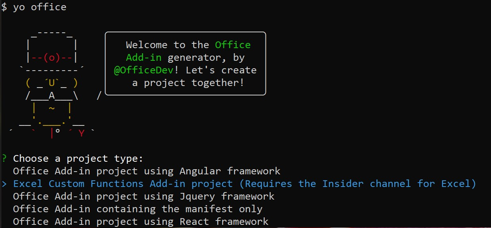
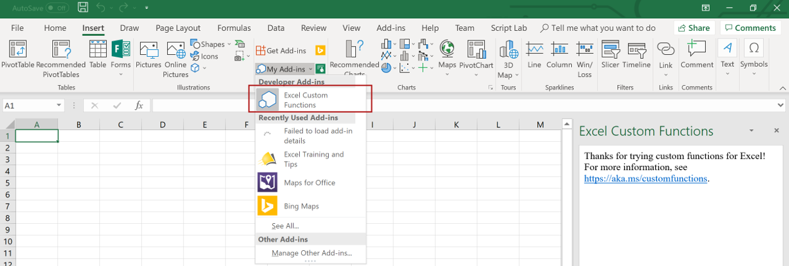

# <a name="tutorial-create-custom-functions-in-excel"></a>教程：在 Excel 中创建自定义函数

用户可以借助自定义函数向 Excel 添加新函数，方法是在 JavaScript 中将这些函数定义为加载项的一部分。 Excel 中的用户可以访问自定义函数，就像他们访问 Excel 中的任何本机函数一样，比如 `SUM()`。 可以创建自定义函数，以执行简单的任务（如计算）或更复杂的任务（如将实时数据从 Web 传送到工作表中）。

在本教程中，你将：
> [!div class="checklist"]
> * 通过使用 Yo Office 生成器创建自定义函数项目
> * 使用预生成的自定义函数来执行简单计算
> * 创建从 Web 请求数据的自定义函数
> * 创建从 Web 传送实时数据的自定义函数

[!include[Excel custom functions note](../includes/excel-custom-functions-note.md)]

## <a name="prerequisites"></a>先决条件

* [Node.js](https://nodejs.org/en/)（版本 8.0.0 或更高版本）

* [Git Bash](https://git-scm.com/downloads)（或其他 Git 客户端）

* 最新版本的 [Yeoman](https://yeoman.io/) 和[适用于 Office 外接程序的 Yeoman 生成器](https://www.npmjs.com/package/generator-office)。若要全局安装这些工具，请从命令提示符处运行以下命令：

    ```
    npm install -g yo generator-office
    ```

    > [!NOTE]
    > 即便先前已安装 Yeoman 生成器，我们仍建议将包更新至最新的 npm 版本。

* Excel for Windows（64 位，版本 1810 或更高版本）或 Excel Online

* 加入 [Office 预览体验计划](https://products.office.com/office-insider)（**预览体验成员**级别 - 以前称为“预览体验成员 - 快”）

## <a name="create-a-custom-functions-project"></a>创建自定义函数项目

 首先，使用 Yeoman 生成器创建自定义函数项目。 这将为你的项目设置开始对自定义函数进行编码所需的正确文件夹结构、源文件和依存关系。

1. 运行下面的命令，再回答如下所示的提示问题。

    ```
    yo office
    ```

    * 选择项目类型：`Excel Custom Functions Add-in project (...)`

    * 选择脚本类型：`JavaScript`

    * 要如何命名加载项？ `stock-ticker`

    

    Yeoman 生成器将创建项目文件并安装支持的 Node 组件。 项目文件来自 [Excel-Custom-Functions](https://github.com/OfficeDev/Excel-Custom-Functions) GitHub 存储库。

2. 转到项目文件夹。

    ```
    cd stock-ticker
    ```

3. 信任运行此项目所需的自签名证书。 有关适用于 Windows 或 Mac 的详细说明，请参阅[将自签名证书添加为受信任的根证书](https://github.com/OfficeDev/generator-office/blob/master/src/docs/ssl.md)。  

4. 生成项目。

    ```
    npm run build
    ```

5. 启动在 Node.js 中运行的本地 Web 服务器。

    * 如果将使用 Excel for Windows 测试自定义函数，请运行以下命令来启动本地 Web 服务器，启动 Excel，并旁加载加载项：

        ```
         npm run start
        ```
        运行此命令之后，命令提示符将显示与已完成项目相关的详细信息，打开的另一个 npm 窗口将显示与版本相关的详细信息，并且 Excel 将启动且加载项将会加载。 如果加载项未加载，请检查是否已正确完成步骤 3。

    * 如果要使用 Excel Online 测试自定义函数，请运行以下命令来启动本地 Web 服务器：

        ```
        npm run start-web
        ```

         运行此命令之后，打开的另一个窗口将向你显示与版本相关的详细信息。 要使用函数，请在 Office Online 中打开一个新的工作簿。

## <a name="try-out-a-prebuilt-custom-function"></a>尝试预生成的自定义函数

使用 Yeoman 生成器创建的自定义函数项目包含一些预生成的自定义函数，这些函数在 **src/customfunction.js** 文件中定义。 项目根目录中的 **manifest.xml** 文件指定所有自定义函数均属于 `CONTOSO` 名称空间。

在 Excel 工作簿中，通过在 Excel 中完成以下步骤来尝试使用 `ADD` 自定义函数：

1. 在单元格内，键入 `=CONTOSO`。 请注意，自动完成菜单将显示 `CONTOSO` 命名空间中所有函数的列表。

2. 通过在单元格中指定值 `=CONTOSO.ADD(10,200)` 并按 Enter 来运行 `CONTOSO.ADD` 函数，并将数字 `10` 和 `200` 作为输入参数。

`ADD` 自定义函数计算指定为输入参数的两个数字的总和。 键入 `=CONTOSO.ADD(10,200)` 应在按下 Enter 后在单元格中生成结果 **210**。

## <a name="create-a-custom-function-that-requests-data-from-the-web"></a>创建从 Web 请求数据的自定义函数

如果需要一个可以从 API 请求股票价格并在工作表单元格中显示结果的函数，该怎么办？ 自定义函数旨在使用户可以轻松地以异步方式从 Web 中请求数据。

完成以下步骤，以创建一个名为 `stockPrice` 的自定义函数，该函数接受股票代码符号（例如，**MSFT**）并返回该股票的价格。 此自定义函数使用 IEX Trading API，该 API 是免费的，并且不需要身份验证。

1. 在 Yeoman 生成器创建的 **stock-ticker** 项目中，找到文件 **src/customfunctions.js** 并在代码编辑器中打开它。

2. 在 **customfunctions.js** 中，找到 `increment` 函数并将以下代码添加到该函数后面。

    ```js
    function stockPrice(ticker) {
        var url = "https://api.iextrading.com/1.0/stock/" + ticker + "/price";
        return fetch(url)
            .then(function(response) {
                return response.text();
            })
            .then(function(text) {
                return parseFloat(text);
            });

        // Note: in case of an error, the returned rejected Promise
        //    will be bubbled up to Excel to indicate an error.
    }

3. In **customfunctions.js**, locate the line`CustomFunctionMappings.INCREMENT = increment;`, add the following line of code immediately after that line, and save the file.

    ```js
    CustomFunctionMappings.STOCKPRICE = stockPrice;
    ```

4. 用户必须指定说明 Excel 函数的元数据，Excel 才能提供此新函数。 打开 **config/customfunctions.json** 文件。 将 JSON 对象添加到“函数”数组中，然后保存该文件。

    此 JSON 说明了 `stockPrice` 函数。

    ```JSON
    {
        "id": "STOCKPRICE",
        "name": "STOCKPRICE",
        "description": "Fetches current stock price",
        "helpUrl": "http://www.contoso.com/help",
        "result": {
            "type": "number",
            "dimensionality": "scalar"
        },  
        "parameters": [
            {
                "name": "ticker",
                "description": "stock symbol",
                "type": "string",
                "dimensionality": "scalar"
            }
        ]
    }
    ```

5. 必须在 Excel 中重新注册加载项，以便最终用户可以使用此新函数。 完成针对本教程中将要使用的平台的下列相应步骤。

    * 如果使用的是 Excel for Windows，请执行以下操作：

        1. 关闭 Excel，然后重新打开 Excel。

        2. 在 Excel 中，选择“插入”**** 选项卡，然后选择位于“我的加载项”**** 右侧的向下箭头。

        3. 在可用加载项列表中，找到“**开发人员加载项**”部分并选择 **stock-ticker** 加载项进行注册。
            

    * 如果使用的是 Excel Online，请执行以下操作：

        1. 在 Excel Online 中，选择“插入”**** 选项卡，然后选择“加载项”****。

        2. 选择“管理我的加载项”****，然后选择“上载我的加载项”****。 

        3. 选择“浏览...”****，并导航到 Yeoman 生成器创建的项目的根目录。 

        4. 依次选择文件“manifest.xml”****，“打开”****，然后选择“上载”****。

6. 现在，让我们尝试使用新函数。 在单元格 **B1** 中，键入文本 `=CONTOSO.STOCKPRICE("MSFT")` 然后按 Enter。 应看到单元格 **B1** 中的结果是 Microsoft 一股股票的当前股票价格。

## <a name="create-a-streaming-asynchronous-custom-function"></a>创建流式处理异步自定义函数

刚刚创建的 `stockPrice` 函数返回特定时刻的股票价格，但股票价格一直在变化。 让我们创建一个自定义函数，它从 API 传送数据，以获取股票价格的实时更新。

完成以下步骤，创建一个名为 `stockPriceStream` 的自定义函数，该函数每 1000 毫秒请求指定股票的价格（假设之前的请求已经完成）。 正在进行初始请求时，用户可能会在调用函数的单元格中看到占位符值 **#GETTING_DATA**。 函数返回一个值后，**#GETTING_DATA** 被替换为单元格中的该值。

1. 在 Yeoman 生成器创建的 **stock-ticker** 项目中，向 **src/customfunctions.js** 添加以下代码并保存文件。

    ```js
    function stockPriceStream(ticker, handler) {
        var updateFrequency = 1000 /* milliseconds*/;
        var isPending = false;

        var timer = setInterval(function() {
            // If there is already a pending request, skip this iteration:
            if (isPending) {
                return;
            }

            var url = "https://api.iextrading.com/1.0/stock/" + ticker + "/price";
            isPending = true;

            fetch(url)
                .then(function(response) {
                    return response.text();
                })
                .then(function(text) {
                    handler.setResult(parseFloat(text));
                })
                .catch(function(error) {
                    handler.setResult(error);
                })
                .then(function() {
                    isPending = false;
                });
        }, updateFrequency);

        handler.onCanceled = () => {
            clearInterval(timer);
        };
    }

    CustomFunctionMappings.STOCKPRICESTREAM = stockPriceStream;
    ```

2. 用户必须指定说明新函数的元数据，Excel 才能为用户提供此新函数。 在 Yeoman 生成器创建的 **stock-ticker** 项目中，向 **config/customfunctions.json** 文件中的 `functions` 数组添加以下对象，并保存文件。

    此 JSON 说明了 `stockPriceStream` 函数。 对于任何流式处理函数，必须在 `options` 对象中将 `stream` 属性和 `cancelable` 属性设置为 `true`，如本代码示例所示。

    ```json
    { 
        "id": "STOCKPRICESTREAM",
        "name": "STOCKPRICESTREAM",
        "description": "Streams real time stock price",
        "helpUrl": "http://www.contoso.com/help",
        "result": {
            "type": "number",
            "dimensionality": "scalar"
        },  
        "parameters": [
            {
                "name": "ticker",
                "description": "stock symbol",
                "type": "string",
                "dimensionality": "scalar"
            }
        ],
        "options": {
            "stream": true,
            "cancelable": true
        }
    }
    ```

3. 必须在 Excel 中重新注册加载项，以便最终用户可以使用此新函数。 完成针对本教程中将要使用的平台的下列相应步骤。

    * 如果使用的是 Excel for Windows，请执行以下操作：

        1. 关闭 Excel，然后重新打开 Excel。
        
        2. 在 Excel 中，选择“插入”**** 选项卡，然后选择位于“我的加载项”**** 右侧的向下箭头。

        3. 在可用加载项列表中，找到“**开发人员加载项**”部分并选择 **stock-ticker** 加载项进行注册。
            

    * 如果使用的是 Excel Online，请执行以下操作：

        1. 在 Excel Online 中，选择“插入”**** 选项卡，然后选择“加载项”****。

        2. 选择“管理我的加载项”****，然后选择“上载我的加载项”****。

        3. 选择“浏览...”****，并导航到 Yeoman 生成器创建的项目的根目录。

        4. 依次选择文件“manifest.xml”****，“打开”****，然后选择“上载”****。

4. 现在，让我们尝试使用新函数。 在单元格 **C1** 中，键入文本 `=CONTOSO.STOCKPRICESTREAM("MSFT")`，然后按 Enter。 假设股票市场开盘，应该会看到单元格 **C1** 中的结果在不断更新，以反映 Microsoft 一股股票的实时价格。

## <a name="next-steps"></a>后续步骤

在本教程中，你已经创建新的自定义函数项目，尝试了预生成的函数，创建了从 Web 请求数据的自定义函数，并创建了从 Web 传送实时数据的自定义函数。 若要详细了解 Excel 中的自定义函数，请继续阅读以下文章：

> [!div class="nextstepaction"]
> [在 Excel 中创建自定义函数](../excel/custom-functions-overview.md)

### <a name="legal-information"></a>法律信息

[IEX](https://iextrading.com/developer/) 免费提供的数据。 查看 [IEX 使用条款](https://iextrading.com/api-exhibit-a/)。 Microsoft 在本教程中使用的 IEX API 仅供教学使用。


