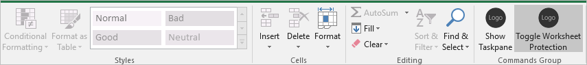

# <a name="tutorial-create-an-excel-task-pane-add-in"></a>教程：创建 Excel 任务窗格加载项

在本教程中，将创建 Excel 任务窗格加载项，该加载项将：

> [!div class="checklist"]
> * 创建表格
> * 筛选和排序表格
> * 创建图表
> * 冻结表格标题
> * 保护工作表
> * 打开对话框

> [!TIP]
> 如果已使用 Yeoman 生成器完成了“[创建 Excel 任务窗格加载项](../quickstarts/excel-quickstart-jquery.md)”快速入门，并希望使用此项目作为该教程的起点，直接转至“[创建表](#create-a-table)”以开始此教程。

## <a name="prerequisites"></a>先决条件

[!include[Yeoman generator prerequisites](../includes/quickstart-yo-prerequisites.md)]

## <a name="create-your-add-in-project"></a>创建加载项项目

[!include[Yeoman generator create project guidance](../includes/yo-office-command-guidance.md)]

- **选择项目类型:** `Office Add-in Task Pane project`
- **选择脚本类型:** `Javascript`
- **要如何命名加载项?** `My Office Add-in`
- **要支持哪一个 Office 客户端应用程序?** `Excel`


完成此向导后，生成器会创建项目，并安装支持的 Node 组件。

[!include[Yeoman generator next steps](../includes/yo-office-next-steps.md)]

## <a name="create-a-table"></a>创建表

本教程的这一步是，以编程方式测试加载项是否支持用户的当前版本 Excel，向工作表中添加表格，使用数据填充表格，并设置格式。

### <a name="code-the-add-in"></a>编码加载项

1. 在代码编辑器中打开项目。

2. 打开 ./src/taskpane/taskpane.html**** 文件。  此文件含有任务窗格的 HTML 标记。

3. 找到 `<main>` 元素并删除在开始 `<main>` 标记后和关闭 `</main>` 标记前出现的所有行。

4. 打开 `<main>` 标记后立即添加下列标记：

    ```html
    <button class="ms-Button" id="create-table">Create Table</button><br/><br/>
    ```

5. 打开 **./src/taskpane/taskpane.js** 文件。 此文件包含用于加快任务窗格与 Office 客户端应用程序之间的交互的 Office JavaScript API 代码。

6. 执行以下操作，删除对 `run` 按钮和 `run()` 函数的所有引用：

    - 查找并删除行 `document.getElementById("run").onclick = run;`。

    - 查找并删除整个 `run()` 函数。

7. 在 `Office.onReady` 方法调用中，找到行 `if (info.host === Office.HostType.Excel) {` 并紧接着行添加下列代码。 注意：

    - 此代码的第一部分用于确定用户的 Excel 版本是否支持包含本系列教程将使用的所有 API 的 Excel.js 版本。 在生产加载项中，若要隐藏或禁用调用不受支持的 API 的 UI，请使用条件块的主体。 这样一来，用户仍可以使用 Excel 版本支持的加载项部分。

    - 此代码的第二部分为 `create-table` 按钮添加了事件处理程序。

    ```js
    // Determine if the user's version of Office supports all the Office.js APIs that are used in the tutorial.
    if (!Office.context.requirements.isSetSupported('ExcelApi', '1.7')) {
        console.log('Sorry. The tutorial add-in uses Excel.js APIs that are not available in your version of Office.');
    }

    // Assign event handlers and other initialization logic.
    document.getElementById("create-table").onclick = createTable;
    ```

8. 将以下函数添加到文件结尾。 注意：

    - Excel.js 业务逻辑将添加到传递给 `Excel.run` 的函数。 此逻辑不立即执行。 相反，它会被添加到挂起的命令队列中。

    - `context.sync` 方法将所有已排入队列的命令发送到 Excel 以供执行。

    - `Excel.run` 后跟 `catch` 块。 这是应始终遵循的最佳做法。 

    ```js
    function createTable() {
        Excel.run(function (context) {

            // TODO1: Queue table creation logic here.

            // TODO2: Queue commands to populate the table with data.

            // TODO3: Queue commands to format the table.

            return context.sync();
        })
        .catch(function (error) {
            console.log("Error: " + error);
            if (error instanceof OfficeExtension.Error) {
                console.log("Debug info: " + JSON.stringify(error.debugInfo));
            }
        });
    }
    ```

9. 在 `createTable()` 函数中，将 `TODO1` 替换为以下代码。 注意：

    - 此代码通过使用工作表的表格集合的 `add` 方法来创建表格，即使是空的，也始终存在。 这是创建 Excel.js 对象的标准方式。 没有类构造函数 API，切勿使用 `new` 运算符创建 Excel 对象。 相反，请添加到父集合对象。

    - `add` 方法的第一个参数仅是表格最上面一行的范围，而不是表格最终使用的整个范围。 这是因为当加载项填充数据行时（在下一步中），它将新行添加到表中，而不是将值写入现有行的单元格。 这是常见的模式，因为在创建表时表的行数通常是未知的。

    - 表名称必须在整个工作簿中都是唯一的，而不仅仅是在工作表一级。

    ```js
    var currentWorksheet = context.workbook.worksheets.getActiveWorksheet();
    var expensesTable = currentWorksheet.tables.add("A1:D1", true /*hasHeaders*/);
    expensesTable.name = "ExpensesTable";
    ```

10. 在 `createTable()` 函数中，将 `TODO2` 替换为以下代码。 注意：

    - 范围的单元格值是通过一组数组进行设置。

    - 表格中的新行是通过调用表格的行集合的 `add` 方法进行创建。 通过在作为第二个参数传递的父数组中添加多个单元格值数组，可以在一次 `add` 调用中添加多个行。

    ```js
    expensesTable.getHeaderRowRange().values =
        [["Date", "Merchant", "Category", "Amount"]];

    expensesTable.rows.add(null /*add at the end*/, [
        ["1/1/2017", "The Phone Company", "Communications", "120"],
        ["1/2/2017", "Northwind Electric Cars", "Transportation", "142.33"],
        ["1/5/2017", "Best For You Organics Company", "Groceries", "27.9"],
        ["1/10/2017", "Coho Vineyard", "Restaurant", "33"],
        ["1/11/2017", "Bellows College", "Education", "350.1"],
        ["1/15/2017", "Trey Research", "Other", "135"],
        ["1/15/2017", "Best For You Organics Company", "Groceries", "97.88"]
    ]);
    ```

11. 在 `createTable()` 函数中，将 `TODO3` 替换为以下代码。 注意：

    - 此代码将从零开始编制的索引传递给表格的列集合的 `getItemAt` 方法，以获取对“金额”**** 列的引用。

        > [!NOTE]
        > Excel.js 集合对象（如 `TableCollection`、`WorksheetCollection` 和 `TableColumnCollection`）有 `items` 属性，此属性是子对象类型的数组（如 `Table`、`Worksheet` 或 `TableColumn`），但 `*Collection` 对象本身并不是数组。

    - 然后，此代码将“金额”**** 列的范围格式化为欧元（精确到小数点后两位）。 

    - 最后，它确保了列宽和行高足以容纳最长（或最高）的数据项。 请注意，此代码必须获取要格式化的 `Range` 对象。 `TableColumn` 和 `TableRow` 对象没有格式属性。

    ```js
    expensesTable.columns.getItemAt(3).getRange().numberFormat = [['\u20AC#,##0.00']];
    expensesTable.getRange().format.autofitColumns();
    expensesTable.getRange().format.autofitRows();
    ```

12. 验证是否已保存了对项目所做的所有更改。

### <a name="test-the-add-in"></a>测试加载项

1. 完成以下步骤，以启动本地 Web 服务器并旁加载你的加载项。

    > [!NOTE]
    > Office 加载项应使用 HTTPS，而不是 HTTP（即便是在开发时也是如此）。 如果系统在运行以下命令之一后提示你安装证书，请接受提示以安装 Yeoman 生成器提供的证书。

    > [!TIP]
    > 如果在 Mac 上测试加载项，请先运行项目根目录中的以下命令，然后再继续。 运行此命令时，本地 Web 服务器将启动。
    >
    > ```command&nbsp;line
    > npm run dev-server
    > ```

    - 若要在 Excel 中测试加载项，请在项目的根目录中运行以下命令。 这将启动本地的 Web 服务器 (如果尚未运行的话), 并使用加载的加载项打开 Excel。

        ```command&nbsp;line
        npm start
        ```

    - 若要在 Excel 网页版中测试加载项，请在项目的根目录中运行以下命令。 运行此命令时，本地 Web 服务器将启动（如果尚未运行）。

        ```command&nbsp;line
        npm run start:web
        ```

        若要使用加载项，请在 Excel 网页版中打开新的文档，并按照[在 Office 网页版中旁加载 Office 加载项](../testing/sideload-office-add-ins-for-testing.md#sideload-an-office-add-in-in-office-on-the-web)中的说明操作，以旁加载你的加载项。

2. 在 Excel 中，依次选择的“**开始**”选项卡和功能区中的“**显示任务窗格**”按钮，以打开加载项任务窗格。

    

3. 在任务窗格中，选择“**创建表**”按钮。

    

## <a name="filter-and-sort-a-table"></a>筛选和排序表格

本教程的这一步是，筛选并排序之前创建的表。

### <a name="filter-the-table"></a>筛选表格

1. 打开 **./src/taskpane/taskpane.html** 文件。

2. 找到 `<button>` 按钮的 `create-table` 元素，并在该行后添加下列标记：

    ```html
    <button class="ms-Button" id="filter-table">Filter Table</button><br/><br/>
    ```

3. 打开 ./src/taskpane/taskpane.js**** 文件。

4. 在 `Office.onReady` 方法调用中，找到用于将单击处理程序分配到 `create-table` 按钮的行，并在该行后添加以下代码：

    ```js
    document.getElementById("filter-table").onclick = filterTable;
    ```

5. 将以下函数添加到文件末端：

    ```js
    function filterTable() {
        Excel.run(function (context) {

            // TODO1: Queue commands to filter out all expense categories except
            //        Groceries and Education.

            return context.sync();
        })
        .catch(function (error) {
            console.log("Error: " + error);
            if (error instanceof OfficeExtension.Error) {
                console.log("Debug info: " + JSON.stringify(error.debugInfo));
            }
        });
    }
    ```

6. 在 `filterTable()` 函数中，将 `TODO1` 替换为以下代码。 注意：

   - 代码先将列名称传递给 `getItem` 方法（而不是像 `getItemAt` 方法一样将列索引传递给 `createTable` 方法），获取对需要筛选的列的引用。 由于用户可以移动表格列，因此给定索引处的列可能会在表格创建后更改。 所以，更安全的做法是，使用列名称获取对列的引用。 上一教程安全地使用了 `getItemAt`，因为是在与创建表格完全相同的方法中使用了它，所以用户没有机会移动列。

   - `applyValuesFilter` 方法是对 `Filter` 对象执行的多种筛选方法之一。

    ```js
    var currentWorksheet = context.workbook.worksheets.getActiveWorksheet();
    var expensesTable = currentWorksheet.tables.getItem('ExpensesTable');
    var categoryFilter = expensesTable.columns.getItem('Category').filter;
    categoryFilter.applyValuesFilter(['Education', 'Groceries']);
    ``` 

### <a name="sort-the-table"></a>排序表格

1. 打开 **./src/taskpane/taskpane.html** 文件。

2. 找到 `<button>` 按钮的 `filter-table` 元素，并在该行后添加下列标记： 

    ```html
    <button class="ms-Button" id="sort-table">Sort Table</button><br/><br/>
    ```

3. 打开 ./src/taskpane/taskpane.js**** 文件。

4. 在 `Office.onReady` 方法调用中，找到用于将单击处理程序分配到 `filter-table` 按钮的行，并在该行后添加以下代码：

    ```js
    document.getElementById("sort-table").onclick = sortTable;
    ```

5. 将以下函数添加到文件末端：

    ```js
    function sortTable() {
        Excel.run(function (context) {

            // TODO1: Queue commands to sort the table by Merchant name.

            return context.sync();
        })
        .catch(function (error) {
            console.log("Error: " + error);
            if (error instanceof OfficeExtension.Error) {
                console.log("Debug info: " + JSON.stringify(error.debugInfo));
            }
        });
    }
    ```

6. 在 `sortTable()` 函数中，将 `TODO1` 替换为以下代码。 注意：

   - 此代码创建一组 `SortField` 对象，其中只有一个成员，因为加载项只对“商家”列进行了排序。

   - `SortField` 对象的 `key` 属性是用于排序的列的从零开始编制索引。 表中的行按照所引用列中的值进行排序。

   - `Table` 的 `sort` 成员是 `TableSort` 对象，并不是方法。 `SortField` 传递到 `TableSort` 对象的 `apply` 方法。

    ```js
    var currentWorksheet = context.workbook.worksheets.getActiveWorksheet();
    var expensesTable = currentWorksheet.tables.getItem('ExpensesTable');
    var sortFields = [
        {
            key: 1,            // Merchant column
            ascending: false,
        }
    ];

    expensesTable.sort.apply(sortFields);
    ```

7. 验证是否已保存了对项目所做的所有更改。

### <a name="test-the-add-in"></a>测试加载项

1. [!include[Start server and sideload add-in instructions](../includes/tutorial-excel-start-server.md)]

2. 如果加载项任务窗格已在 Excel 中打开，转至 **Home** 选项卡并选中功能区中的“**显示任务窗格**”以打开。

3. 如果之前在此教程中添加的表格未在打开的工作表中出现，选择任务窗格中的“**创建表**”按钮。

4. 选择“**筛选表**”按钮和“**排序表**”按钮（按顺序和倒序中的任一顺序排序皆可）。

    

## <a name="create-a-chart"></a>创建图表

本教程的这一步是，使用先前创建的表中的数据创建图表，再设置图表格式。

### <a name="chart-a-chart-using-table-data"></a>使用表格数据绘制图表

1. 打开 **./src/taskpane/taskpane.html** 文件。

2. 找到 `<button>` 按钮的 `sort-table` 元素，并在该行后添加下列标记： 

    ```html
    <button class="ms-Button" id="create-chart">Create Chart</button><br/><br/>
    ```

3. 打开 ./src/taskpane/taskpane.js**** 文件。

4. 在 `Office.onReady` 方法调用中，找到用于将单击处理程序分配到 `sort-table` 按钮的行，并在该行后添加以下代码：

    ```js
    document.getElementById("create-chart").onclick = createChart;
    ```

5. 将以下函数添加到文件末端：

    ```js
    function createChart() {
        Excel.run(function (context) {

            // TODO1: Queue commands to get the range of data to be charted.

            // TODO2: Queue command to create the chart and define its type.

            // TODO3: Queue commands to position and format the chart.

            return context.sync();
        })
        .catch(function (error) {
            console.log("Error: " + error);
            if (error instanceof OfficeExtension.Error) {
                console.log("Debug info: " + JSON.stringify(error.debugInfo));
            }
        });
    }
    ```

6. 在 `createChart()` 函数中，将 `TODO1` 替换为以下代码。 请注意，为了排除标题行，此代码使用 `Table.getDataBodyRange` 方法（而不是 `getRange` 方法），获取要绘制成图表的数据的范围。

    ```js
    var currentWorksheet = context.workbook.worksheets.getActiveWorksheet();
    var expensesTable = currentWorksheet.tables.getItem('ExpensesTable');
    var dataRange = expensesTable.getDataBodyRange();
    ```

7. 在 `createChart()` 函数中，将 `TODO2` 替换为以下代码。 请注意以下参数：

   - `add` 方法的第一个参数指定图表类型。有几十种类型。

   - 第二个参数指定要在图表中添加的数据的范围。

   - 第三个参数确定是按行方向还是按列方向绘制表格中的一系列数据点。 选项 `auto` 指示 Excel 确定最佳方法。

    ```js
    var chart = currentWorksheet.charts.add('ColumnClustered', dataRange, 'auto');
    ```

8. 在 `createChart()` 函数中，将 `TODO3` 替换为以下代码。 此代码的大部分内容非常直观明了。 注意：
   
   - `setPosition` 方法的参数指定应包含图表的工作表区域的左上角和右下角单元格。 Excel 可以调整行宽等设置，以便图表能够适应所提供的空间。
   
   - “系列”是指表格列中的一组数据点。 因为表格中只有一个非字符串列，所以 Excel 推断此列就是要绘制成图表的唯一一列数据点。 它将其他列解释为图表标签。 因此，图表中只有一个系列，它的索引为 0。 这是要标记为“金额（&euro;）”的系列。

    ```js
    chart.setPosition("A15", "F30");
    chart.title.text = "Expenses";
    chart.legend.position = "right"
    chart.legend.format.fill.setSolidColor("white");
    chart.dataLabels.format.font.size = 15;
    chart.dataLabels.format.font.color = "black";
    chart.series.getItemAt(0).name = 'Value in &euro;';
    ```

9. 验证是否已保存了对项目所做的所有更改。

### <a name="test-the-add-in"></a>测试加载项

1. [!include[Start server and sideload add-in instructions](../includes/tutorial-excel-start-server.md)]

2. 如果加载项任务窗格已在 Excel 中打开，转至 **Home** 选项卡并选中功能区中的“**显示任务窗格**”以打开。

3. 如果之前在此教程中添加的表格未在打开的工作表中出现，选择任务窗格中的“**创建表**”按钮，随后选择“**筛选表**”按钮和“**排序表**”按钮（按顺序和倒序中的任一顺序排序皆可）。

4. 选择 **“创建图表”** 按钮。 此时，图表创建完成，其中仅包含筛选出的行中的数据。 底部数据点上的标签按图表的排序顺序进行排序，即按商家名称的字母倒序排序。

    

## <a name="freeze-a-table-header"></a>冻结表格标题

如果表格很长，导致用户必须滚动才能看到一些行，那么标题行可能会在滚动时不可见。 本教程的这一步是，冻结以前创建的表格的标题行，让它在用户向下滚动工作表时依然可见。

### <a name="freeze-the-tables-header-row"></a>冻结表格的标题行

1. 打开 **./src/taskpane/taskpane.html** 文件。

2. 找到 `<button>` 按钮的 `create-chart` 元素，并在该行后添加下列标记： 

    ```html
    <button class="ms-Button" id="freeze-header">Freeze Header</button><br/><br/>
    ```

3. 打开 ./src/taskpane/taskpane.js**** 文件。

4. 在 `Office.onReady` 方法调用中，找到用于将单击处理程序分配到 `create-chart` 按钮的行，并在该行后添加以下代码：

    ```js
    document.getElementById("freeze-header").onclick = freezeHeader;
    ```

5. 将以下函数添加到文件末端：

    ```js
    function freezeHeader() {
        Excel.run(function (context) {

            // TODO1: Queue commands to keep the header visible when the user scrolls.

            return context.sync();
        })
        .catch(function (error) {
            console.log("Error: " + error);
            if (error instanceof OfficeExtension.Error) {
                console.log("Debug info: " + JSON.stringify(error.debugInfo));
            }
        });
    }
    ```

6. 在 `freezeHeader()` 函数中，将 `TODO1` 替换为以下代码。 注意：

   - `Worksheet.freezePanes` 集合是工作表中的一组窗格，在工作表滚动时就地固定或冻结。

   - `freezeRows` 方法需要使用要就地固定的行数（自顶部算起）作为参数。 传递 `1` 以就地固定第一行。

    ```js
    var currentWorksheet = context.workbook.worksheets.getActiveWorksheet();
    currentWorksheet.freezePanes.freezeRows(1);
    ```

7. 验证是否已保存了对项目所做的所有更改。

### <a name="test-the-add-in"></a>测试加载项

1. [!include[Start server and sideload add-in instructions](../includes/tutorial-excel-start-server.md)]

2. 如果加载项任务窗格已在 Excel 中打开，转至 **Home** 选项卡并选中功能区中的“**显示任务窗格**”以打开。

3. 如果之前在此教程中添加的表格出现在此工作表中，将其删除。

4. 在任务窗格中，选择“**创建表**”按钮。

5. 在任务窗格中，选择“**冻结标题**”按钮。

6. 尽量向下滚动工作表，直到在上面的行不可见时表格标题在顶部依然可见。

    

## <a name="protect-a-worksheet"></a>保护工作表

在此教程的此步骤中，将向功能区添加一个按钮，以打开和关闭工作表保护。

### <a name="configure-the-manifest-to-add-a-second-ribbon-button"></a>将清单配置为添加第二个功能区按钮

1. 打开清单文件 **./manifest.xml**。

2. 查找 `<Control>` 元素。 此元素定义了“主页”**** 功能区上一直用于启动加载项的“显示任务窗格”**** 按钮。 将向“主页”**** 功能区上的相同组添加第二个按钮。 在结束 `</Control>` 标记和结束 `</Group>` 标记之间，添加以下标记。

    ```xml
    <Control xsi:type="Button" id="<!--TODO1: Unique (in manifest) name for button -->">
        <Label resid="<!--TODO2: Button label -->" />
        <Supertip>            
            <Title resid="<!-- TODO3: Button tool tip title -->" />
            <Description resid="<!-- TODO4: Button tool tip description -->" />
        </Supertip>
        <Icon>
            <bt:Image size="16" resid="Icon.16x16"/>
            <bt:Image size="32" resid="Icon.32x32"/>
            <bt:Image size="80" resid="Icon.80x80"/>
        </Icon>
        <Action xsi:type="<!-- TODO5: Specify the type of action-->">
            <!-- TODO6: Identify the function.-->
        </Action>
    </Control>
    ```

3. 在刚添加至清单文件的 XML 内，将 `TODO1` 替换为字符串，以便向按钮提供在此清单文件内唯一的 ID。 由于按钮将启用和禁用工作表保护，因此请使用“ToggleProtection”。 完成时，`Control` 元素的开始标记如下所示：

    ```xml
    <Control xsi:type="Button" id="ToggleProtection">
    ```

4. 接下来的三个 `TODO` 设置资源 ID，或 `resid`。 资源是字符串，这三个字符串将在后续步骤中创建。 现在，需要向资源提供 ID。 虽然按钮标签应名为“切换保护”，但此字符串的 *ID* 应为“ProtectionButtonLabel”。因此 `Label` 元素的样式如下：

    ```xml
    <Label resid="ProtectionButtonLabel" />
    ```

5. `SuperTip` 元素定义了按钮的工具提示。 由于工具提示标题应与按钮标签相同，因此使用完全相同的资源 ID，即“ProtectionButtonLabel”。 工具提示说明为“单击即可启用和禁用工作表保护”。 不过，`resid` 应为“ProtectionButtonToolTip”。 完成后，`SuperTip` 元素如下所示： 

    ```xml
    <Supertip>            
        <Title resid="ProtectionButtonLabel" />
        <Description resid="ProtectionButtonToolTip" />
    </Supertip>
    ```

   > [!NOTE] 
   > 在生产加载项中，不建议对两个不同的按钮使用相同的图标；但为了简单起见，本教程将采用这样的做法。 因此，新 `Icon` 中的 `Control` 标记直接就是现有 `Icon` 中 `Control` 元素的副本。 

6. 虽然原始 `Control` 元素内的 `Action` 元素的类型设置为 `ShowTaskpane`，但新按钮不会要打开任务窗格，而是要运行在后续步骤中创建的自定义函数。 因此，将 `TODO5` 替换为 `ExecuteFunction`，即触发自定义函数的按钮的操作类型。 `Action` 元素的开始标记如下所示：
 
    ```xml
    <Action xsi:type="ExecuteFunction">
    ```

7. 原始 `Action` 元素的子元素指定任务窗格 ID，以及应当在任务窗格中打开的页面 URL。 不过，`Action` 类型的 `ExecuteFunction` 元素只有一个子元素，用于命名控件执行的函数。 此函数（名为 `toggleProtection`）将在后续步骤中创建。 因此，将 `TODO6` 替换为以下标记：
 
    ```xml
    <FunctionName>toggleProtection</FunctionName>
    ```

    此时，整个 `Control` 标记应如下所示：

    ```xml
    <Control xsi:type="Button" id="ToggleProtection">
        <Label resid="ProtectionButtonLabel" />
        <Supertip>            
            <Title resid="ProtectionButtonLabel" />
            <Description resid="ProtectionButtonToolTip" />
        </Supertip>
        <Icon>
            <bt:Image size="16" resid="Icon.16x16"/>
            <bt:Image size="32" resid="Icon.32x32"/>
            <bt:Image size="80" resid="Icon.80x80"/>
        </Icon>
        <Action xsi:type="ExecuteFunction">
           <FunctionName>toggleProtection</FunctionName>
        </Action>
    </Control>
    ```

8. 向下滚动到清单的 `Resources` 部分。

9. 将下列标记添加为 `bt:ShortStrings` 元素的子级。

    ```xml
    <bt:String id="ProtectionButtonLabel" DefaultValue="Toggle Worksheet Protection" />
    ```

10. 将下列标记添加为 `bt:LongStrings` 元素的子级。

    ```xml
    <bt:String id="ProtectionButtonToolTip" DefaultValue="Click to protect or unprotect the current worksheet." />
    ```

11. 保存文件。

### <a name="create-the-function-that-protects-the-sheet"></a>创建工作表保护函数

1. 打开文件 **.\commands\commands.js**。

2. 紧接着 `action` 函数添加下列函数。 注意，我们向函数和函数调用 `args.completed` 的最后一行指定了 `args` 参数。 **ExecuteFunction** 类型的所有加载项命令都必须满足这项要求。 它会指示 Office 客户端应用程序，函数已完成，且 UI 可以再次变得可响应。

    ```js
    function toggleProtection(args) {
        Excel.run(function (context) {
            
            // TODO1: Queue commands to reverse the protection status of the current worksheet.

            return context.sync();
        })
        .catch(function (error) {
            console.log("Error: " + error);
            if (error instanceof OfficeExtension.Error) {
                console.log("Debug info: " + JSON.stringify(error.debugInfo));
            }
        });
        args.completed();
    }
    ```

3. 添加下列行至文件结尾：

    ```js
    g.toggleProtection = toggleProtection;
    ```

4. 在 `toggleProtection` 函数中，将 `TODO1` 替换为以下代码。 此代码使用处于标准切换模式的工作表对象 protection 属性。 `TODO2` 将在下一部分中进行介绍。

    ```js
    var sheet = context.workbook.worksheets.getActiveWorksheet();

    // TODO2: Queue command to load the sheet's "protection.protected" property from
    //        the document and re-synchronize the document and task pane.

    if (sheet.protection.protected) {
        sheet.protection.unprotect();
    } else {
        sheet.protection.protect();
    }
    ``` 

### <a name="add-code-to-fetch-document-properties-into-the-task-panes-script-objects"></a>添加代码以将文档属性提取到任务窗格的脚本对象

在此教程中创建的各函数内，通过对命令进行排队来*写入* Office 文档。 每个函数结束时都会调用 `context.sync()` 方法，从而将排入队列的命令发送到文档，以供执行。 但是在上一步中添加的代码调用的是 `sheet.protection.protected property` ， 这与之前编写的函数明显不同，因为 `sheet` 对象只是任务窗格脚本中的代理对象。 代理对象并不了解文档的实际保护状态，因此它的 `protection.protected` 属性无法有实值。 为避免出现异常错误，必须首先从文档中获取保护状态并使用它来设置值 `sheet.protection.protected`。 此提取过程分为三步：

   1. 将命令排入队列，以加载（即提取）代码需要读取的属性。

   2. 调用上下文对象的 `sync`方法，从而向文档发送已排入队列的命令以供执行，并返回请求获取的信息。

   3. 由于 `sync` 是异步方法，因此请先确保它已完成，然后代码才能调用已提取的属性。

只要代码需要从 Office 文档*读取*信息，就必须完成这些步骤。

1. 在 `toggleProtection` 函数中，将 `TODO2` 替换为以下代码。 注意：
   
   - 每个 Excel 对象都有 `load` 方法。 对于要在参数中读取的对象属性，将它们指定为逗号分隔名称字符串。 在此示例中，需要读取的属性为 `protection` 属性的子属性。 引用子属性的方法与在代码中的其他任何地方引用属性几乎完全一样，不同之处在于使用的是正斜杠（“/”）字符，而不是“.”字符。

   - 为了确保切换逻辑 `sheet.protection.protected` 只在 `sync` 完成后且 `sheet.protection.protected` 分配有从文档提取的正确值后才运行，（在下一步中）它会被移到 `then` 函数中，此函数在 `sync` 完成前不会运行。 

    ```js
    sheet.load('protection/protected');
    return context.sync()
        .then(
            function() {
                // TODO3: Move the queued toggle logic here.
            }
        )
        // TODO4: Move the final call of `context.sync` here and ensure that it
        //        does not run until the toggle logic has been queued.
    ``` 

2. 由于不能在同一取消分支代码路径中有两个 `return` 语句，因此请删除 `return context.sync();` 末尾的最后一行代码 `Excel.run`。 新的最后一行代码 `context.sync`将在后续步骤中添加。

3. 剪切并粘贴 `toggleProtection` 函数中的 `if ... else` 结构，以替换 `TODO3`。

4. 将 `TODO4` 替换为以下代码。注意：

   - 将 `sync` 方法传递到 `then` 函数可确保它不会在 `sheet.protection.unprotect()` 或 `sheet.protection.protect()` 已排入队列前运行。

   - 由于 `then` 方法调用传递给它的任何函数，并且也不想调用 `sync` 两次，因此请从 `context.sync` 末尾省略掉“()”。

    ```js
    .then(context.sync);
    ```

   完成后，整个函数应如下所示：

    ```js
    function toggleProtection(args) {
        Excel.run(function (context) {            
          var sheet = context.workbook.worksheets.getActiveWorksheet();          
          sheet.load('protection/protected');

          return context.sync()
              .then(
                  function() {
                    if (sheet.protection.protected) {
                        sheet.protection.unprotect();
                    } else {
                        sheet.protection.protect();
                    }
                  }
              )
              .then(context.sync);
        })
        .catch(function (error) {
            console.log("Error: " + error);
            if (error instanceof OfficeExtension.Error) {
                console.log("Debug info: " + JSON.stringify(error.debugInfo));
            }
        });
        args.completed();
    }
    ```

5. 验证是否已保存了对项目所做的所有更改。

### <a name="test-the-add-in"></a>测试加载项

1. 关闭包括 Excel 在内的所有 Office 应用。

2. 通过删除缓存文件夹的内容（所有文件和子文件夹）来删除 Office 缓存。 若要完全清除应用程序中的旧版加载项，则必须这样做。

    - 对于 Windows：`%LOCALAPPDATA%\Microsoft\Office\16.0\Wef\`。

    - 对于 Mac：`~/Library/Containers/com.Microsoft.OsfWebHost/Data/`。
    
        > [!NOTE]
        > 如果文件夹不存在，查看下列文件夹，如果找到，删除文件夹的内容：
        >    - `~/Library/Containers/com.microsoft.{host}/Data/Library/Caches/`，其中，`{host}` 是 Office 应用程序（例如 `Excel`）
        >    - `~/Library/Containers/com.microsoft.{host}/Data/Library/Application Support/Microsoft/Office/16.0/Wef/`，其中，`{host}` 是 Office 应用程序（例如 `Excel`）
        >    - `com.microsoft.Office365ServiceV2/Data/Caches/com.microsoft.Office365ServiceV2/`
        >    - `com.microsoft.Office365ServiceV2/Data/Library/Caches/com.microsoft.Office365ServiceV2/`

3. 如果本地 web 服务器已在运行，通过关闭节点命令窗口以停止。

4. 因为清单文件已更新，必须使用已更新的清单文件，重新旁加载加载项。 启动本地 Web 服务器并旁加载你的加载项： 

    - 若要在 Excel 中测试加载项，请在项目的根目录中运行以下命令。 这将启动本地的 Web 服务器 (如果尚未运行的话), 并使用加载的加载项打开 Excel。

        ```command&nbsp;line
        npm start
        ```

    - 若要在 Excel 网页版中测试加载项，请在项目的根目录中运行以下命令。 运行此命令时，本地 Web 服务器将启动（如果尚未运行）。

        ```command&nbsp;line
        npm run start:web
        ```

        若要使用加载项，请在 Excel 网页版中打开新的文档，并按照[在 Office 网页版中旁加载 Office 加载项](../testing/sideload-office-add-ins-for-testing.md#sideload-an-office-add-in-in-office-on-the-web)中的说明操作，以旁加载你的加载项。

5. 在 Excel 的 **Home** 选项卡上，选择“**切换工作表保护**”按钮。 请注意，功能区上的大部分控件都处于禁用状态（灰显），如下面的屏幕截图所示。 

    

6. 选择要更改其内容的单元格。 Excel 将显示一条错误消息，指示工作表受保护。

7. 再次选择“**切换工作表保护**”按钮，此时控件重新启用，可以再次更改单元格值。

## <a name="open-a-dialog"></a>打开对话框

本教程的最后一步是，在加载项中打开对话框，将消息从对话框进程传递到任务窗格进程，再关闭对话框。Office 加载项对话框是*非模式*窗口。也就是说，用户可以继续与 Office 应用程序中的文档，以及任务窗格中的主机页进行交互。

### <a name="create-the-dialog-page"></a>创建对话框页面

1. 在项目根目录下的 **./src** 文件夹中，新建文件夹“**dialogs**”。

2. 在 **./src/dialogs** 文件夹中，新建文件“**popup.html**”。

3. 将下面的标记添加到 **popup.html** 中。 注意：

   - 此页面包含可供用户输入用户名的 `<input>` 字段，并包含将此名称发送到将在其中显示的任务窗格的按钮。

   - 此标记加载在后续步骤中创建的 **popup.js** 脚本。

   - 此标记还加载 Office.JS 库，因为 **popup.js** 将使用它们。

    ```html
    <!DOCTYPE html>
    <html>
        <head lang="en">
            <title>Dialog for My Office Add-in</title>
            <meta charset="UTF-8">
            <meta name="viewport" content="width=device-width, initial-scale=1">

            <!-- For more information on Office UI Fabric, visit https://developer.microsoft.com/fabric. -->
            <link rel="stylesheet" href="https://static2.sharepointonline.com/files/fabric/office-ui-fabric-core/9.6.1/css/fabric.min.css"/>

            <script type="text/javascript" src="https://appsforoffice.microsoft.com/lib/1/hosted/office.js"></script>
            <script type="text/javascript" src="popup.js"></script>

        </head>
        <body style="display:flex;flex-direction:column;align-items:center;justify-content:center">
            <p class="ms-font-xl">ENTER YOUR NAME</p>
            <input id="name-box" type="text"/><br/><br/>
            <button id="ok-button" class="ms-Button">OK</button>
        </body>
    </html>
    ```

4. 在 **./src/dialogs** 文件夹中，新建文件“**popup.js**”。

5. 将下面的代码添加到 **popup.js** 中。 关于此代码，请注意以下几点：

   - *每个调用 Office.JS 库中的 API 的页面均必须首先确保该库已完成初始化。* 执行此操作的最佳方法是调用 `Office.onReady()` 方法。 如果加载项具有其自己的初始化任务，则代码应位于链接至 `Office.onReady()` 调用的 `then()` 方法中。 必须在调用 Office.js 之前运行 `Office.onReady()` 调用；因此，作业位于由页面加载的脚本文件中，如同本示例中一样。

    ```js
    (function () {
    "use strict";

        Office.onReady()
            .then(function() {

                // TODO1: Assign handler to the OK button.

            });

        // TODO2: Create the OK button handler

    }());
    ```

6. 将 `TODO1` 替换为下列代码。 将在下一步中创建 `sendStringToParentPage` 函数。

    ```js
    document.getElementById("ok-button").onclick = sendStringToParentPage;
    ```

7. 将 `TODO2` 替换为以下代码。 `messageParent` 方法将它的参数传递到父页面（在此示例中，为任务窗格中的页面）。 参数可以是布尔值或字符串，其中包含可串行化为字符串的任何内容（如 XML 或 JSON）。

    ```js
    function sendStringToParentPage() {
        var userName = document.getElementById("name-box").value;
        Office.context.ui.messageParent(userName);
    }
    ```

> [!NOTE]
> **popup.html** 文件及其加载的 **popup.js** 文件在完全独立于加载项任务窗格的 Microsoft Edge 或 Internet Explorer 11 进程中运行。 如果将 **popup.js** 转换为与 **app.js** 文件相同的 **bundle.js** 文件，加载项必须加载 **bundle.js** 文件的两个副本，这就违背了绑定目的。 所以此加载项根本不会转换 **popup.js**。

### <a name="update-webpack-config-settings"></a>更新 webpack 配置设置

打开项目根目录中的 **webpack.config.js** 文件，并完成以下步骤。

1. 在 `config` 对象内找到 `entry` 对象并为 `popup` 添加新条目。

    ```js
    popup: "./src/dialogs/popup.js"
    ```

    完成此操作之后，新的 `entry` 对象将与此类似：

    ```js
    entry: {
      polyfill: "@babel/polyfill",
      taskpane: "./src/taskpane/taskpane.js",
      commands: "./src/commands/commands.js",
      popup: "./src/dialogs/popup.js"
    },
    ```
  
2. 在 `config` 对象中找到 `plugins` 数组，并添加下列对象至数组的结尾。

    ```js
    new HtmlWebpackPlugin({
      filename: "popup.html",
      template: "./src/dialogs/popup.html",
      chunks: ["polyfill", "popup"]
    })
    ```

    完成此操作之后，新的 `plugins` 数组将与此类似：

    ```js
    plugins: [
      new CleanWebpackPlugin(),
      new HtmlWebpackPlugin({
        filename: "taskpane.html",
        template: "./src/taskpane/taskpane.html",
        chunks: ['polyfill', 'taskpane']
      }),
      new CopyWebpackPlugin([
      {
        to: "taskpane.css",
        from: "./src/taskpane/taskpane.css"
      }
      ]),
      new HtmlWebpackPlugin({
        filename: "commands.html",
        template: "./src/commands/commands.html",
        chunks: ["polyfill", "commands"]
      }),
      new HtmlWebpackPlugin({
        filename: "popup.html",
        template: "./src/dialogs/popup.html",
        chunks: ["polyfill", "popup"]
      })
    ],
    ```

3. 如果本地 web 服务器正在运行，通过关闭节点命令窗口以停止。

4. 运行以下命令以重建项目。

    ```command&nbsp;line
    npm run build
    ```

### <a name="open-the-dialog-from-the-task-pane"></a>从任务窗格打开对话框

1. 打开 **./src/taskpane/taskpane.html** 文件。

2. 定位 `<button>` 按钮的 `freeze-header` 元素，并在行后添加下列标记：

    ```html
    <button class="ms-Button" id="open-dialog">Open Dialog</button><br/><br/>
    ```

3. 对话框会提示用户输入用户名，并将用户名传递到任务窗格。 任务窗格将在标签中显示用户名。 紧接着刚添加的 `button`，添加下列标记：

    ```html
    <label id="user-name"></label><br/><br/>
    ```

4. 打开 **./src/taskpane/taskpane.js** 文件。

5. 在 `Office.onReady` 方法调用中，定位分配点击事件至 `freeze-header` 按钮的行，并在行后添加虾类代码。 将在后续步骤中创建 `openDialog` 方法。

    ```js
    document.getElementById("open-dialog").onclick = openDialog;
    ```

6. 添加下列声明至文件结尾。 此变量用于保留父页面执行上下文中的对象，以用作对话框页面执行上下文的中间对象。

    ```js
    var dialog = null;
    ```

7. 添加下列函数至文件结尾（`dialog` 声明后）。 关于此代码，请务必注意它*不*包含的内容，即不含 `Excel.run` 调用。 这是因为用于打开对话框的 API 跨所有 Office 应用程序共享，所以它属于 Office JavaScript 通用 API，而非 Excel 专用 API。

    ```js
    function openDialog() {
        // TODO1: Call the Office Common API that opens a dialog
    }
    ```

8. 将 `TODO1` 替换为以下代码。注意：

   - `displayDialogAsync` 方法在屏幕中央打开对话框。

   - 第一个参数是要打开的页面 URL。

   - 第二个参数用于传递选项。`height` 和 `width` 是 Office 应用程序窗口大小百分比。

    ```js
    Office.context.ui.displayDialogAsync(
        'https://localhost:3000/popup.html',
        {height: 45, width: 55},

        // TODO2: Add callback parameter.
    );
    ```

### <a name="process-the-message-from-the-dialog-and-close-the-dialog"></a>处理对话框发送的消息并关闭对话框

1. 在 **./src/taskpane/taskpane.js** 文件的 `openDialog` 函数内，将 `TODO2` 替换为下列代码。 注意：

   - 回调在对话框成功打开后和用户在对话框中执行任何操作前立即执行。

   - `result.value` 对象用作父页面执行上下文和对话框页面执行上下文的中介。

   - `processMessage` 函数将在后续步骤中创建。 此处理程序将处理通过 `messageParent` 函数调用从对话框页面发送的任何值。

    ```js
    function (result) {
        dialog = result.value;
        dialog.addEventHandler(Microsoft.Office.WebExtension.EventType.DialogMessageReceived, processMessage);
    }
    ```

2. 在 `openDialog` 函数后面添加以下函数。

    ```js
    function processMessage(arg) {
        document.getElementById("user-name").innerHTML = arg.message;
        dialog.close();
    }
    ```

3. 验证是否已保存了对项目所做的所有更改。

### <a name="test-the-add-in"></a>测试加载项

1. [!include[Start server and sideload add-in instructions](../includes/tutorial-excel-start-server.md)]

2. 如果加载项任务窗格已在 Excel 中打开，转至 **Home** 选项卡并选中功能区中的“**显示任务窗格**”以打开。

3. 选择任务窗格中的“打开对话框”**** 按钮。

4. 对话框打开后，拖动它并重设大小。 请注意，你可以与工作表进行交互并按任务窗格上的其他按钮，但无法从同一任务窗格页面启动第二个对话框。

5. 在对话框中，输入名称并选择“**确定**”。 此时，用户名显示在任务窗格上，且对话框关闭。

6. （可选）注释掉 `processMessage` 函数中的代码行 `dialog.close();`。 然后，重复执行此部分的步骤。 这样一来，对话框便会继续处于打开状态，可供用户更改用户名。 按右上角的“X”**** 按钮，可手动关闭对话框。

    

## <a name="next-steps"></a>后续步骤

在本教程中，你已创建与 Excel 工作簿中的表格、图表、工作表和对话框进行交互的 Excel 任务窗格加载项。 若要了解有关构建 Excel 加载项的详细信息，请继续阅读以下文章：

> [!div class="nextstepaction"]
> [Excel 加载项概述](../excel/excel-add-ins-overview.md)

## <a name="see-also"></a>另请参阅

* [Office 加载项平台概述](../overview/office-add-ins.md)
* [构建 Office 加载项](../overview/office-add-ins-fundamentals.md)
* [开发 Office 加载项](../develop/develop-overview.md)
* [Excel JavaScript API 基本编程概念](../excel/excel-add-ins-core-concepts.md)
