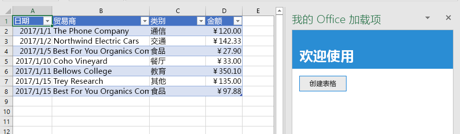
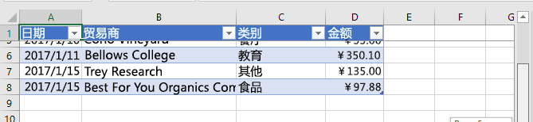

# <a name="tutorial-create-an-excel-task-pane-add-in"></a><span data-ttu-id="74299-103">教程：创建 Excel 任务窗格加载项</span><span class="sxs-lookup"><span data-stu-id="74299-103">Tutorial: Create an Excel task pane add-in</span></span>

<span data-ttu-id="74299-104">在本教程中，将创建 Excel 任务窗格加载项，该加载项将：</span><span class="sxs-lookup"><span data-stu-id="74299-104">In this tutorial, you'll create an Excel task pane add-in that:</span></span>

> [!div class="checklist"]
> * <span data-ttu-id="74299-105">创建表格</span><span class="sxs-lookup"><span data-stu-id="74299-105">Creates a table</span></span>
> * <span data-ttu-id="74299-106">筛选和排序表格</span><span class="sxs-lookup"><span data-stu-id="74299-106">Filters and sorts a table</span></span>
> * <span data-ttu-id="74299-107">创建图表</span><span class="sxs-lookup"><span data-stu-id="74299-107">Creates a chart</span></span>
> * <span data-ttu-id="74299-108">冻结表格标题</span><span class="sxs-lookup"><span data-stu-id="74299-108">Freezes a table header</span></span>
> * <span data-ttu-id="74299-109">保护工作表</span><span class="sxs-lookup"><span data-stu-id="74299-109">Protects a worksheet</span></span>
> * <span data-ttu-id="74299-110">打开对话框</span><span class="sxs-lookup"><span data-stu-id="74299-110">Opens a dialog</span></span>

## <a name="prerequisites"></a><span data-ttu-id="74299-111">先决条件</span><span class="sxs-lookup"><span data-stu-id="74299-111">Prerequisites</span></span>

<span data-ttu-id="74299-112">若要使用本教程，需要安装以下项。</span><span class="sxs-lookup"><span data-stu-id="74299-112">To use this tutorial, you need to have the following installed.</span></span> 

- <span data-ttu-id="74299-113">Excel 2016 版本 1711（生成号 8730.1000 即点即用）或更高版本。</span><span class="sxs-lookup"><span data-stu-id="74299-113">Excel 2016, version 1711 (Build 8730.1000 Click-to-Run) or later.</span></span> <span data-ttu-id="74299-114">可能必须成为 Office 预览体验成员，才能获取此版本。</span><span class="sxs-lookup"><span data-stu-id="74299-114">You might need to be an Office Insider to get this version.</span></span> <span data-ttu-id="74299-115">有关详细信息，请参阅[成为 Office 预览体验成员](https://products.office.com/office-insider?tab=tab-1)。</span><span class="sxs-lookup"><span data-stu-id="74299-115">For more information, see [Be an Office Insider](https://products.office.com/office-insider?tab=tab-1).</span></span>

- [<span data-ttu-id="74299-116">Node</span><span class="sxs-lookup"><span data-stu-id="74299-116">Node</span></span>](https://nodejs.org/en/) 

- <span data-ttu-id="74299-117">[Git Bash](https://git-scm.com/downloads)（或其他 Git 客户端）</span><span class="sxs-lookup"><span data-stu-id="74299-117">[Git Bash](https://git-scm.com/downloads) (or another Git client)</span></span>

## <a name="create-your-add-in-project"></a><span data-ttu-id="74299-118">创建加载项项目</span><span class="sxs-lookup"><span data-stu-id="74299-118">Create your add-in project</span></span>

<span data-ttu-id="74299-119">完成以下步骤以创建将用作本教程基础的 Excel 加载项项目。</span><span class="sxs-lookup"><span data-stu-id="74299-119">Complete the following steps to create the Excel add-in project that you'll use as the basis for this tutorial.</span></span>

1. <span data-ttu-id="74299-120">克隆 GitHub 存储库 [Excel 加载项教程](https://github.com/OfficeDev/Excel-Add-in-Tutorial)。</span><span class="sxs-lookup"><span data-stu-id="74299-120">Clone the GitHub repository [Excel add-in tutorial](https://github.com/OfficeDev/Excel-Add-in-Tutorial).</span></span>

2. <span data-ttu-id="74299-121">打开 Git Bash 窗口或已启用 Node.JS 的系统命令提示符，并转到项目的“开始”\*\*\*\* 文件夹。</span><span class="sxs-lookup"><span data-stu-id="74299-121">Open a Git bash window, or Node.JS-enabled system prompt, and navigate to the **Start** folder of the project.</span></span>

3. <span data-ttu-id="74299-122">运行命令 `npm install`，以安装 package.json 文件中列出的工具和库。</span><span class="sxs-lookup"><span data-stu-id="74299-122">Run the command `npm install` to install the tools and libraries listed in the package.json file.</span></span> 

4. <span data-ttu-id="74299-123">按照[将自签名证书添加为受信任的根证书](https://github.com/OfficeDev/generator-office/blob/master/src/docs/ssl.md)中的步骤操作，信任开发计算机操作系统的证书。</span><span class="sxs-lookup"><span data-stu-id="74299-123">Carry out the steps in [Adding Self-Signed Certificates as Trusted Root Certificate](https://github.com/OfficeDev/generator-office/blob/master/src/docs/ssl.md) to trust the certificate for your development computer's operating system.</span></span>

## <a name="create-a-table"></a><span data-ttu-id="74299-124">创建表格</span><span class="sxs-lookup"><span data-stu-id="74299-124">Create a table</span></span>

<span data-ttu-id="74299-125">本教程的这一步是，以编程方式测试加载项是否支持用户的当前版本 Excel，向工作表中添加表格，使用数据填充表格，并设置格式。</span><span class="sxs-lookup"><span data-stu-id="74299-125">In this step of the tutorial, you'll programmatically test that your add-in supports the user's current version of Excel, add a table to a worksheet, populate the table with data, and format it.</span></span>

### <a name="code-the-add-in"></a><span data-ttu-id="74299-126">编码加载项</span><span class="sxs-lookup"><span data-stu-id="74299-126">Code the add-in</span></span>

1. <span data-ttu-id="74299-127">在代码编辑器中打开项目。</span><span class="sxs-lookup"><span data-stu-id="74299-127">Open the project in your code editor.</span></span>

2. <span data-ttu-id="74299-128">打开文件 index.html。</span><span class="sxs-lookup"><span data-stu-id="74299-128">Open the file index.html.</span></span>

3. <span data-ttu-id="74299-129">将 `TODO1` 替换为以下标记：</span><span class="sxs-lookup"><span data-stu-id="74299-129">Replace the `TODO1` with the following markup:</span></span>

    ```html
    <button class="ms-Button" id="create-table">Create Table</button>
    ```

4. <span data-ttu-id="74299-130">打开 app.js 文件。</span><span class="sxs-lookup"><span data-stu-id="74299-130">Open the app.js file.</span></span>

5. <span data-ttu-id="74299-131">将 `TODO1` 替换为以下代码。</span><span class="sxs-lookup"><span data-stu-id="74299-131">Replace the `TODO1` with the following code.</span></span> <span data-ttu-id="74299-132">此代码用于确定用户的 Excel 版本是否支持包含本系列教程将使用的所有 API 的 Excel.js 版本。</span><span class="sxs-lookup"><span data-stu-id="74299-132">This code determines whether the user's version of Excel supports a version of Excel.js that includes all the APIs that this series of tutorials will use.</span></span> <span data-ttu-id="74299-133">在生产加载项中，若要隐藏或禁用调用不受支持的 API 的 UI，请使用条件块的主体。</span><span class="sxs-lookup"><span data-stu-id="74299-133">In a production add-in, use the body of the conditional block to hide or disable the UI that would call unsupported APIs.</span></span> <span data-ttu-id="74299-134">这样一来，用户仍可以使用 Excel 版本支持的加载项部分。</span><span class="sxs-lookup"><span data-stu-id="74299-134">This will enable the user to still make use of the parts of the add-in that are supported by their version of Excel.</span></span>

    ```js
    if (!Office.context.requirements.isSetSupported('ExcelApi', 1.7)) {
        console.log('Sorry. The tutorial add-in uses Excel.js APIs that are not available in your version of Office.');
    }
    ```

6. <span data-ttu-id="74299-135">将 `TODO2` 替换为以下代码：</span><span class="sxs-lookup"><span data-stu-id="74299-135">Replace the `TODO2` with the following code:</span></span>

    ```js
    $('#create-table').click(createTable);
    ```

7. <span data-ttu-id="74299-136">将 `TODO3` 替换为以下代码。</span><span class="sxs-lookup"><span data-stu-id="74299-136">Replace the `TODO3` with the following code.</span></span> <span data-ttu-id="74299-137">注意：</span><span class="sxs-lookup"><span data-stu-id="74299-137">Note:</span></span>

   - <span data-ttu-id="74299-138">Excel.js 业务逻辑将添加到传递给 `Excel.run` 的函数。</span><span class="sxs-lookup"><span data-stu-id="74299-138">Your Excel.js business logic will be added to the function that is passed to `Excel.run`.</span></span> <span data-ttu-id="74299-139">此逻辑不立即执行。</span><span class="sxs-lookup"><span data-stu-id="74299-139">This logic does not execute immediately.</span></span> <span data-ttu-id="74299-140">相反，它会被添加到挂起的命令队列中。</span><span class="sxs-lookup"><span data-stu-id="74299-140">Instead, it is added to a queue of pending commands.</span></span>

   - <span data-ttu-id="74299-141">`context.sync` 方法将所有已排入队列的命令发送到 Excel 以供执行。</span><span class="sxs-lookup"><span data-stu-id="74299-141">The `context.sync` method sends all queued commands to Excel for execution.</span></span>

   - <span data-ttu-id="74299-142">`Excel.run` 后跟 `catch` 块。</span><span class="sxs-lookup"><span data-stu-id="74299-142">The `Excel.run` is followed by a `catch` block.</span></span> <span data-ttu-id="74299-143">这是应始终遵循的最佳做法。</span><span class="sxs-lookup"><span data-stu-id="74299-143">This is a best practice that you should always follow.</span></span> 

    ```js
    function createTable() {
        Excel.run(function (context) {

            // TODO4: Queue table creation logic here.

            // TODO5: Queue commands to populate the table with data.

            // TODO6: Queue commands to format the table.

            return context.sync();
        })
        .catch(function (error) {
            console.log("Error: " + error);
            if (error instanceof OfficeExtension.Error) {
                console.log("Debug info: " + JSON.stringify(error.debugInfo));
            }
        });
    }
    ```

8. <span data-ttu-id="74299-p106">将 `TODO4` 替换为以下代码。请注意以下几点：</span><span class="sxs-lookup"><span data-stu-id="74299-p106">Replace `TODO4` with the following code. Note:</span></span>

   - <span data-ttu-id="74299-146">此代码通过使用工作表的表格集合的 `add` 方法来创建表格，即使是空的，也始终存在。</span><span class="sxs-lookup"><span data-stu-id="74299-146">The code creates a table by using `add` method of a worksheet's table collection, which always exists even if it is empty.</span></span> <span data-ttu-id="74299-147">这是创建 Excel.js 对象的标准方式。</span><span class="sxs-lookup"><span data-stu-id="74299-147">This is the standard way that Excel.js objects are created.</span></span> <span data-ttu-id="74299-148">没有类构造函数 API，切勿使用 `new` 运算符创建 Excel 对象。</span><span class="sxs-lookup"><span data-stu-id="74299-148">There are no class constructor APIs, and you never use a `new` operator to create an Excel object.</span></span> <span data-ttu-id="74299-149">相反，请添加到父集合对象。</span><span class="sxs-lookup"><span data-stu-id="74299-149">Instead, you add to a parent collection object.</span></span>

   - <span data-ttu-id="74299-150">`add` 方法的第一个参数仅是表格最上面一行的范围，而不是表格最终使用的整个范围。</span><span class="sxs-lookup"><span data-stu-id="74299-150">The first parameter of the `add` method is the range of only the top row of the table, not the entire range the table will ultimately use.</span></span> <span data-ttu-id="74299-151">这是因为当加载项填充数据行时（在下一步中），它将新行添加到表中，而不是将值写入现有行的单元格。</span><span class="sxs-lookup"><span data-stu-id="74299-151">This is because when the add-in populates the data rows (in the next step), it will add new rows to the table instead of writing values to the cells of existing rows.</span></span> <span data-ttu-id="74299-152">这是更为常见的模式，因为在创建表时表的行数通常是未知的。</span><span class="sxs-lookup"><span data-stu-id="74299-152">This is a more common pattern because the number of rows that a table will have is often not known when the table is created.</span></span>

   - <span data-ttu-id="74299-153">表名称必须在整个工作簿中都是唯一的，而不仅仅是在工作表一级。</span><span class="sxs-lookup"><span data-stu-id="74299-153">Table names must be unique across the entire workbook, not just the worksheet.</span></span>

    ```js
    var currentWorksheet = context.workbook.worksheets.getActiveWorksheet();
    var expensesTable = currentWorksheet.tables.add("A1:D1", true /*hasHeaders*/);
    expensesTable.name = "ExpensesTable";
    ```

9. <span data-ttu-id="74299-p109">将 `TODO5` 替换为以下代码。请注意以下几点：</span><span class="sxs-lookup"><span data-stu-id="74299-p109">Replace `TODO5` with the following code. Note:</span></span>

   - <span data-ttu-id="74299-156">范围的单元格值是通过一组数组进行设置。</span><span class="sxs-lookup"><span data-stu-id="74299-156">The cell values of a range are set with an array of arrays.</span></span>

   - <span data-ttu-id="74299-157">表格中的新行是通过调用表格的行集合的 `add` 方法进行创建。</span><span class="sxs-lookup"><span data-stu-id="74299-157">New rows are created in a table by calling the `add` method of the table's row collection.</span></span> <span data-ttu-id="74299-158">通过在作为第二个参数传递的父数组中添加多个单元格值数组，可以在一次 `add` 调用中添加多个行。</span><span class="sxs-lookup"><span data-stu-id="74299-158">You can add multiple rows in a single call of `add` by including multiple cell value arrays in the parent array that is passed as the second parameter.</span></span>

    ```js
    expensesTable.getHeaderRowRange().values =
        [["Date", "Merchant", "Category", "Amount"]];

    expensesTable.rows.add(null /*add at the end*/, [
        ["1/1/2017", "The Phone Company", "Communications", "120"],
        ["1/2/2017", "Northwind Electric Cars", "Transportation", "142.33"],
        ["1/5/2017", "Best For You Organics Company", "Groceries", "27.9"],
        ["1/10/2017", "Coho Vineyard", "Restaurant", "33"],
        ["1/11/2017", "Bellows College", "Education", "350.1"],
        ["1/15/2017", "Trey Research", "Other", "135"],
        ["1/15/2017", "Best For You Organics Company", "Groceries", "97.88"]
    ]);
    ```

10. <span data-ttu-id="74299-p111">将 `TODO6` 替换为以下代码。请注意以下几点：</span><span class="sxs-lookup"><span data-stu-id="74299-p111">Replace `TODO6` with the following code. Note:</span></span>

   - <span data-ttu-id="74299-161">此代码将从零开始编制的索引传递给表格的列集合的 `getItemAt` 方法，以获取对“金额”\*\*\*\* 列的引用。</span><span class="sxs-lookup"><span data-stu-id="74299-161">The code gets a reference to the **Amount** column by passing its zero-based index to the `getItemAt` method of the table's column collection.</span></span>

     > [!NOTE]
     > <span data-ttu-id="74299-162">Excel.js 集合对象（如 `TableCollection`、`WorksheetCollection` 和 `TableColumnCollection`）有 `items` 属性，此属性是子对象类型的数组（如 `Table`、`Worksheet` 或 `TableColumn`），但 `*Collection` 对象本身并不是数组。</span><span class="sxs-lookup"><span data-stu-id="74299-162">Excel.js collection objects, such as `TableCollection`, `WorksheetCollection`, and `TableColumnCollection` have an `items` property that is an array of the child object types, such as `Table` or `Worksheet` or `TableColumn`; but a `*Collection` object is not itself an array.</span></span>

   - <span data-ttu-id="74299-163">然后，此代码将“金额”\*\*\*\* 列的范围格式化为欧元（精确到小数点后两位）。</span><span class="sxs-lookup"><span data-stu-id="74299-163">The code then formats the range of the **Amount** column as Euros to the second decimal.</span></span> 

   - <span data-ttu-id="74299-164">最后，它确保了列宽和行高足以容纳最长（或最高）的数据项。</span><span class="sxs-lookup"><span data-stu-id="74299-164">Finally, it ensures that the width of the columns and height of the rows is big enough to fit the longest (or tallest) data item.</span></span> <span data-ttu-id="74299-165">请注意，此代码必须获取要格式化的 `Range` 对象。</span><span class="sxs-lookup"><span data-stu-id="74299-165">Notice that the code must get `Range` objects to format.</span></span> <span data-ttu-id="74299-166">`TableColumn` 和 `TableRow` 对象没有格式属性。</span><span class="sxs-lookup"><span data-stu-id="74299-166">`TableColumn` and `TableRow` objects do not have format properties.</span></span>

        ```js
        expensesTable.columns.getItemAt(3).getRange().numberFormat = [['€#,##0.00']];
        expensesTable.getRange().format.autofitColumns();
        expensesTable.getRange().format.autofitRows();
        ```

### <a name="test-the-add-in"></a><span data-ttu-id="74299-167">测试加载项</span><span class="sxs-lookup"><span data-stu-id="74299-167">Test the add-in</span></span>

1. <span data-ttu-id="74299-168">打开 Git Bash 窗口或已启用 Node.JS 的系统命令提示符，并转到项目的“开始”\*\*\*\* 文件夹。</span><span class="sxs-lookup"><span data-stu-id="74299-168">Open a Git bash window, or Node.JS-enabled system prompt, and navigate to the **Start** folder of the project.</span></span>

2. <span data-ttu-id="74299-169">运行命令 `npm run build`，将 ES6 源代码转换为 Internet Explorer 支持的旧版 JavaScript（Excel 在后台用来运行 Excel 加载项）。</span><span class="sxs-lookup"><span data-stu-id="74299-169">Run the command `npm run build` to transpile your ES6 source code to an earlier version of JavaScript that is supported by Internet Explorer (which is used under-the-hood by Excel to run Excel add-ins).</span></span>

3. <span data-ttu-id="74299-170">运行命令 `npm start`，启动在 localhost 上运行的 Web 服务器。</span><span class="sxs-lookup"><span data-stu-id="74299-170">Run the command `npm start` to start a web server running on localhost.</span></span>

4. <span data-ttu-id="74299-171">通过以下方法之一旁加载加载项：</span><span class="sxs-lookup"><span data-stu-id="74299-171">Sideload the add-in by using one of the following methods:</span></span>

    - <span data-ttu-id="74299-172">Windows：[在 Windows 上旁加载 Office 加载项](../testing/create-a-network-shared-folder-catalog-for-task-pane-and-content-add-ins.md)</span><span class="sxs-lookup"><span data-stu-id="74299-172">Windows: [Sideload Office Add-ins on Windows](../testing/create-a-network-shared-folder-catalog-for-task-pane-and-content-add-ins.md)</span></span>

    - <span data-ttu-id="74299-173">Excel Online：[在 Office Online 中旁加载 Office 加载项](../testing/sideload-office-add-ins-for-testing.md#sideload-an-office-add-in-in-office-online)</span><span class="sxs-lookup"><span data-stu-id="74299-173">Excel Online: [Sideload Office Add-ins in Office Online](../testing/sideload-office-add-ins-for-testing.md#sideload-an-office-add-in-in-office-online)</span></span>

    - <span data-ttu-id="74299-174">iPad 和 Mac：[在 iPad 和 Mac 上旁加载 Office 加载项](../testing/sideload-an-office-add-in-on-ipad-and-mac.md)</span><span class="sxs-lookup"><span data-stu-id="74299-174">iPad and Mac: [Sideload Office Add-ins on iPad and Mac](../testing/sideload-an-office-add-in-on-ipad-and-mac.md)</span></span>

5. <span data-ttu-id="74299-175">在“**开始**”菜单上，选择“**显示任务窗格**”。</span><span class="sxs-lookup"><span data-stu-id="74299-175">On the **Home** menu, choose **Show Taskpane**.</span></span>

6. <span data-ttu-id="74299-176">在任务窗格中，选择“**创建表**”。</span><span class="sxs-lookup"><span data-stu-id="74299-176">In the task pane, choose **Create Table**.</span></span>

    

## <a name="filter-and-sort-a-table"></a><span data-ttu-id="74299-178">筛选和排序表格</span><span class="sxs-lookup"><span data-stu-id="74299-178">Filter and sort a table</span></span>

<span data-ttu-id="74299-179">本教程的这一步是，筛选并排序之前创建的表。</span><span class="sxs-lookup"><span data-stu-id="74299-179">In this step of the tutorial, you'll filter and sort the table that you created previously.</span></span>

### <a name="filter-the-table"></a><span data-ttu-id="74299-180">筛选表格</span><span class="sxs-lookup"><span data-stu-id="74299-180">Filter the table</span></span>

1. <span data-ttu-id="74299-181">在代码编辑器中打开项目。</span><span class="sxs-lookup"><span data-stu-id="74299-181">Open the project in your code editor.</span></span>

2. <span data-ttu-id="74299-182">打开文件 index.html。</span><span class="sxs-lookup"><span data-stu-id="74299-182">Open the file index.html.</span></span>

3. <span data-ttu-id="74299-183">在包含 `create-table` 按钮的 `div` 正下方，添加下列标记：</span><span class="sxs-lookup"><span data-stu-id="74299-183">Just below the `div` that contains the `create-table` button, add the following markup:</span></span>

    ```html
    <div class="padding">
        <button class="ms-Button" id="filter-table">Filter Table</button>
    </div>
    ```

4. <span data-ttu-id="74299-184">打开 app.js 文件。</span><span class="sxs-lookup"><span data-stu-id="74299-184">Open the app.js file.</span></span>

5. <span data-ttu-id="74299-185">在向 `create-table` 按钮分配单击处理程序的代码行正下方，添加下列代码：</span><span class="sxs-lookup"><span data-stu-id="74299-185">Just below the line that assigns a click handler to the `create-table` button, add the following code:</span></span>

    ```js
    $('#filter-table').click(filterTable);
    ```

6. <span data-ttu-id="74299-186">在 `createTable` 函数正下方，添加下列函数：</span><span class="sxs-lookup"><span data-stu-id="74299-186">Just below the `createTable` function, add the following function:</span></span>

    ```js
    function filterTable() {
        Excel.run(function (context) {

            // TODO1: Queue commands to filter out all expense categories except
            //        Groceries and Education.

            return context.sync();
        })
        .catch(function (error) {
            console.log("Error: " + error);
            if (error instanceof OfficeExtension.Error) {
                console.log("Debug info: " + JSON.stringify(error.debugInfo));
            }
        });
    }
    ```

7. <span data-ttu-id="74299-p113">将 `TODO1` 替换为以下代码。请注意以下几点：</span><span class="sxs-lookup"><span data-stu-id="74299-p113">Replace `TODO1` with the following code. Note:</span></span>

   - <span data-ttu-id="74299-189">代码先将列名称传递给 `getItem` 方法（而不是像 `createTable` 方法一样将列索引传递给 `getItemAt` 方法），获取对需要筛选的列的引用。</span><span class="sxs-lookup"><span data-stu-id="74299-189">The code first gets a reference to the column that needs filtering by passing the column name to the `getItem` method, instead of passing its index to the `getItemAt` method as the `createTable` method does.</span></span> <span data-ttu-id="74299-190">由于用户可以移动表格列，因此给定索引处的列可能会在表格创建后更改。</span><span class="sxs-lookup"><span data-stu-id="74299-190">Since users can move table columns, the column at a given index might change after the table is created.</span></span> <span data-ttu-id="74299-191">所以，更安全的做法是，使用列名称获取对列的引用。</span><span class="sxs-lookup"><span data-stu-id="74299-191">Hence, it is safer to use the column name to get a reference to the column.</span></span> <span data-ttu-id="74299-192">上一教程安全地使用了 `getItemAt`，因为是在与创建表格完全相同的方法中使用了它，所以用户没有机会移动列。</span><span class="sxs-lookup"><span data-stu-id="74299-192">We used `getItemAt` safely in the preceding tutorial, because we used it in the very same method that creates the table, so there is no chance that a user has moved the column.</span></span>

   - <span data-ttu-id="74299-193">`applyValuesFilter` 方法是对 `Filter` 对象执行的多种筛选方法之一。</span><span class="sxs-lookup"><span data-stu-id="74299-193">The `applyValuesFilter` method is one of several filtering methods on the `Filter` object.</span></span>

    ```js
    var currentWorksheet = context.workbook.worksheets.getActiveWorksheet();
    var expensesTable = currentWorksheet.tables.getItem('ExpensesTable');
    var categoryFilter = expensesTable.columns.getItem('Category').filter;
    categoryFilter.applyValuesFilter(["Education", "Groceries"]);
    ``` 

### <a name="sort-the-table"></a><span data-ttu-id="74299-194">排序表格</span><span class="sxs-lookup"><span data-stu-id="74299-194">Sort the table</span></span>

1. <span data-ttu-id="74299-195">打开文件 index.html。</span><span class="sxs-lookup"><span data-stu-id="74299-195">Open the file index.html.</span></span>

2. <span data-ttu-id="74299-196">在包含 `filter-table` 按钮的 `div` 下方，添加下列标记：</span><span class="sxs-lookup"><span data-stu-id="74299-196">Below the `div` that contains the `filter-table` button, add the following markup:</span></span>

    ```html
    <div class="padding">
        <button class="ms-Button" id="sort-table">Sort Table</button>
    </div>
    ```

3. <span data-ttu-id="74299-197">打开 app.js 文件。</span><span class="sxs-lookup"><span data-stu-id="74299-197">Open the app.js file.</span></span>

4. <span data-ttu-id="74299-198">在向 `filter-table` 按钮分配单击处理程序的代码行下方，添加下列代码：</span><span class="sxs-lookup"><span data-stu-id="74299-198">Below the line that assigns a click handler to the `filter-table` button, add the following code:</span></span>

    ```js
    $('#sort-table').click(sortTable);
    ```

5. <span data-ttu-id="74299-199">在 `filterTable` 函数下方，添加下列函数。</span><span class="sxs-lookup"><span data-stu-id="74299-199">Below the `filterTable` function add the following function.</span></span>

    ```js
    function sortTable() {
        Excel.run(function (context) {

            // TODO1: Queue commands to sort the table by Merchant name.

            return context.sync();
        })
        .catch(function (error) {
            console.log("Error: " + error);
            if (error instanceof OfficeExtension.Error) {
                console.log("Debug info: " + JSON.stringify(error.debugInfo));
            }
        });
    }
    ```

6. <span data-ttu-id="74299-p115">将 `TODO1` 替换为以下代码。请注意以下几点：</span><span class="sxs-lookup"><span data-stu-id="74299-p115">Replace `TODO1` with the following code. Note:</span></span>

   - <span data-ttu-id="74299-202">此代码创建一组 `SortField` 对象，其中只有一个成员，因为加载项只对“商家”列进行了排序。</span><span class="sxs-lookup"><span data-stu-id="74299-202">The code creates an array of `SortField` objects which has just one member since the add-in only sorts on the Merchant column.</span></span>

   - <span data-ttu-id="74299-203">`SortField` 对象的 `key` 属性是要排序的列的从零开始编制索引。</span><span class="sxs-lookup"><span data-stu-id="74299-203">The `key` property of a `SortField` object is the zero-based index of the column to sort-on.</span></span>

   - <span data-ttu-id="74299-204">`Table` 的 `sort` 成员是 `TableSort` 对象，并不是方法。</span><span class="sxs-lookup"><span data-stu-id="74299-204">The `sort` member of a `Table` is a `TableSort` object, not a method.</span></span> <span data-ttu-id="74299-205">`SortField` 传递到 `TableSort` 对象的 `apply` 方法。</span><span class="sxs-lookup"><span data-stu-id="74299-205">The `SortField`s are passed to the `TableSort` object's `apply` method.</span></span>

    ```js
    var currentWorksheet = context.workbook.worksheets.getActiveWorksheet();
    var expensesTable = currentWorksheet.tables.getItem('ExpensesTable');
    var sortFields = [
        {
            key: 1,            // Merchant column
            ascending: false,
        }
    ];

    expensesTable.sort.apply(sortFields);
    ```

### <a name="test-the-add-in"></a><span data-ttu-id="74299-206">测试加载项</span><span class="sxs-lookup"><span data-stu-id="74299-206">Test the add-in</span></span>

1. <span data-ttu-id="74299-207">如果上一阶段教程中的 Git Bash 窗口或已启用 Node.JS 的系统命令提示符仍处于打开状态，请按 **Ctrl+C** 两次，停止正在运行的 Web 服务器。</span><span class="sxs-lookup"><span data-stu-id="74299-207">If the Git bash window, or Node.JS-enabled system prompt, from the previous stage tutorial is still open, enter **Ctrl+C** twice to stop the running web server.</span></span> <span data-ttu-id="74299-208">否则，打开 Git Bash 窗口或已启用 Node.JS 的系统命令提示符，并转到项目的“开始”\*\*\*\* 文件夹。</span><span class="sxs-lookup"><span data-stu-id="74299-208">Otherwise, open a Git bash window, or Node.JS-enabled system prompt, and navigate to the **Start** folder of the project.</span></span>

     > [!NOTE]
     > <span data-ttu-id="74299-209">虽然只要更改任意文件（包括 app.js 文件），浏览器同步服务器就会在任务窗格中重新加载加载项，但它不会重新转换 JavaScript。因此，必须重复执行生成命令，这样对 app.js 做出的更改才会生效。</span><span class="sxs-lookup"><span data-stu-id="74299-209">Although the browser-sync server reloads your add-in in the task pane every time you make a change to any file, including the app.js file, it does not retranspile the JavaScript, so you must repeat the build command in order for your changes to app.js to take effect.</span></span> <span data-ttu-id="74299-210">为此，需要终止服务器进程，这样就可以获得提示符来输入生成命令。</span><span class="sxs-lookup"><span data-stu-id="74299-210">In order to do this, you need to kill the server process so that you can get a prompt to enter the build command.</span></span> <span data-ttu-id="74299-211">生成后，重启服务器。</span><span class="sxs-lookup"><span data-stu-id="74299-211">After the build, you restart the server.</span></span> <span data-ttu-id="74299-212">接下来的几步执行的就是此进程。</span><span class="sxs-lookup"><span data-stu-id="74299-212">The next few steps carry out this process.</span></span>

2. <span data-ttu-id="74299-213">运行命令 `npm run build`，将 ES6 源代码转换为 Internet Explorer 支持的旧版 JavaScript（Excel 在后台用来运行 Excel 加载项）。</span><span class="sxs-lookup"><span data-stu-id="74299-213">Run the command `npm run build` to transpile your ES6 source code to an earlier version of JavaScript that is supported by Internet Explorer (which is used under-the-hood by Excel to run Excel add-ins).</span></span>

3. <span data-ttu-id="74299-214">运行命令 `npm start`，启动在 localhost 上运行的 Web 服务器。</span><span class="sxs-lookup"><span data-stu-id="74299-214">Run the command `npm start` to start a web server running on localhost.</span></span>

4. <span data-ttu-id="74299-215">通过关闭任务窗格来重新加载它，再选择“**开始**”菜单上的“**显示任务窗格**”，以重新打开加载项。</span><span class="sxs-lookup"><span data-stu-id="74299-215">Reload the task pane by closing it, and then on the **Home** menu, select **Show Taskpane** to reopen the add-in.</span></span>

5. <span data-ttu-id="74299-216">如果表格因任何原因未在打开的工作表中，请在任务窗格中选择“**创建表**”。</span><span class="sxs-lookup"><span data-stu-id="74299-216">If for any reason the table is not in the open worksheet, in the task pane, choose **Create Table**.</span></span>

6. <span data-ttu-id="74299-217">选择“**筛选表**”和“**排序表**”（按顺序和倒序中的任一顺序排序皆可）。</span><span class="sxs-lookup"><span data-stu-id="74299-217">Choose the **Filter Table** and **Sort Table** buttons, in either order.</span></span>

    

## <a name="create-a-chart"></a><span data-ttu-id="74299-219">创建图表</span><span class="sxs-lookup"><span data-stu-id="74299-219">Create a chart</span></span>

<span data-ttu-id="74299-220">本教程的这一步是，使用先前创建的表中的数据创建图表，再设置图表格式。</span><span class="sxs-lookup"><span data-stu-id="74299-220">In this step of the tutorial, you'll create a chart using data from the table that you created previously, and then format the chart.</span></span>

### <a name="chart-a-chart-using-table-data"></a><span data-ttu-id="74299-221">使用表格数据绘制图表</span><span class="sxs-lookup"><span data-stu-id="74299-221">Chart a chart using table data</span></span>

1. <span data-ttu-id="74299-222">在代码编辑器中打开项目。</span><span class="sxs-lookup"><span data-stu-id="74299-222">Open the project in your code editor.</span></span>

2. <span data-ttu-id="74299-223">打开文件 index.html。</span><span class="sxs-lookup"><span data-stu-id="74299-223">Open the file index.html.</span></span>

3. <span data-ttu-id="74299-224">在包含 `sort-table` 按钮的 `div` 下方，添加下列标记：</span><span class="sxs-lookup"><span data-stu-id="74299-224">Below the `div` that contains the `sort-table` button, add the following markup:</span></span>

    ```html
    <div class="padding">
        <button class="ms-Button" id="create-chart">Create Chart</button>
    </div>
    ```

4. <span data-ttu-id="74299-225">打开 app.js 文件。</span><span class="sxs-lookup"><span data-stu-id="74299-225">Open the app.js file.</span></span>

5. <span data-ttu-id="74299-226">在向 `sort-chart` 按钮分配单击处理程序的代码行下方，添加下列代码：</span><span class="sxs-lookup"><span data-stu-id="74299-226">Below the line that assigns a click handler to the `sort-chart` button, add the following code:</span></span>

    ```js
    $('#create-chart').click(createChart);
    ```

6. <span data-ttu-id="74299-227">在 `sortTable` 函数下方，添加下列函数。</span><span class="sxs-lookup"><span data-stu-id="74299-227">Below the `sortTable` function add the following function.</span></span>

    ```js
    function createChart() {
        Excel.run(function (context) {

            // TODO1: Queue commands to get the range of data to be charted.

            // TODO2: Queue command to create the chart and define its type.

            // TODO3: Queue commands to position and format the chart.

            return context.sync();
        })
        .catch(function (error) {
            console.log("Error: " + error);
            if (error instanceof OfficeExtension.Error) {
                console.log("Debug info: " + JSON.stringify(error.debugInfo));
            }
        });
    }
    ```

7. <span data-ttu-id="74299-p119">将 `TODO1` 替换为下列代码。请注意，为了排除标题行，此代码使用 `Table.getDataBodyRange` 方法（而不是 `getRange` 方法），获取要绘制成图表的数据的范围。</span><span class="sxs-lookup"><span data-stu-id="74299-p119">Replace `TODO1` with the following code. Note that in order to exclude the header row, the code uses the `Table.getDataBodyRange` method to get the range of data you want to chart instead of the `getRange` method.</span></span>

    ```js
    var currentWorksheet = context.workbook.worksheets.getActiveWorksheet();
    var expensesTable = currentWorksheet.tables.getItem('ExpensesTable');
    var dataRange = expensesTable.getDataBodyRange();
    ```

8. <span data-ttu-id="74299-230">将 `TODO2` 替换为下列代码。</span><span class="sxs-lookup"><span data-stu-id="74299-230">Replace `TODO2` with the following code.</span></span> <span data-ttu-id="74299-231">请注意以下参数：</span><span class="sxs-lookup"><span data-stu-id="74299-231">Note the following parameters:</span></span>

   - <span data-ttu-id="74299-p121">`add` 方法的第一个参数指定图表类型。有几十种类型。</span><span class="sxs-lookup"><span data-stu-id="74299-p121">The first parameter to the `add` method specifies the type of chart. There are several dozen types.</span></span>

   - <span data-ttu-id="74299-234">第二个参数指定要在图表中添加的数据的范围。</span><span class="sxs-lookup"><span data-stu-id="74299-234">The second parameter specifies the range of data to include in the chart.</span></span>

   - <span data-ttu-id="74299-235">第三个参数确定是按行方向还是按列方向绘制表格中的一系列数据点。</span><span class="sxs-lookup"><span data-stu-id="74299-235">The third parameter determines whether a series of data points from the table should be charted row-wise or column-wise.</span></span> <span data-ttu-id="74299-236">选项 `auto` 指示 Excel 确定最佳方法。</span><span class="sxs-lookup"><span data-stu-id="74299-236">The option `auto` tells Excel to decide the best method.</span></span>

    ```js
    var chart = currentWorksheet.charts.add('ColumnClustered', dataRange, 'auto');
    ```

9. <span data-ttu-id="74299-237">将 `TODO3` 替换为以下代码。</span><span class="sxs-lookup"><span data-stu-id="74299-237">Replace `TODO3` with the following code.</span></span> <span data-ttu-id="74299-238">此代码的大部分内容非常直观明了。</span><span class="sxs-lookup"><span data-stu-id="74299-238">Most of this code is self-explanatory.</span></span> <span data-ttu-id="74299-239">请注意几下几点：</span><span class="sxs-lookup"><span data-stu-id="74299-239">Note:</span></span>
   
   - <span data-ttu-id="74299-240">`setPosition` 方法的参数指定应包含图表的工作表区域的左上角和右下角单元格。</span><span class="sxs-lookup"><span data-stu-id="74299-240">The parameters to the `setPosition` method specify the upper left and lower right cells of the worksheet area that should contain the chart.</span></span> <span data-ttu-id="74299-241">Excel 可以调整行宽等设置，以便图表能够适应所提供的空间。</span><span class="sxs-lookup"><span data-stu-id="74299-241">Excel can adjust things like line width to make the chart look good in the space it has been given.</span></span>
   
   - <span data-ttu-id="74299-242">“系列”是指表格列中的一组数据点。</span><span class="sxs-lookup"><span data-stu-id="74299-242">A "series" is a set of data points from a column of the table.</span></span> <span data-ttu-id="74299-243">因为表格中只有一个非字符串列，所以 Excel 推断此列就是要绘制成图表的唯一一列数据点。</span><span class="sxs-lookup"><span data-stu-id="74299-243">Since there is only one non-string column in the table, Excel infers that the column is the only column of data points to chart.</span></span> <span data-ttu-id="74299-244">它将其他列解释为图表标签。</span><span class="sxs-lookup"><span data-stu-id="74299-244">It interprets the other columns as chart labels.</span></span> <span data-ttu-id="74299-245">因此，图表中只有一个系列，它的索引为 0。</span><span class="sxs-lookup"><span data-stu-id="74299-245">So there will be just one series in the chart and it will have index 0.</span></span> <span data-ttu-id="74299-246">这是要标记为“金额（欧元）”的系列。</span><span class="sxs-lookup"><span data-stu-id="74299-246">This is the one to label with "Value in €".</span></span>

    ```js
    chart.setPosition("A15", "F30");
    chart.title.text = "Expenses";
    chart.legend.position = "right"
    chart.legend.format.fill.setSolidColor("white");
    chart.dataLabels.format.font.size = 15;
    chart.dataLabels.format.font.color = "black";
    chart.series.getItemAt(0).name = 'Value in €';
    ```

### <a name="test-the-add-in"></a><span data-ttu-id="74299-247">测试加载项</span><span class="sxs-lookup"><span data-stu-id="74299-247">Test the add-in</span></span>

1. <span data-ttu-id="74299-248">如果上一阶段教程中的 Git Bash 窗口或已启用 Node.JS 的系统命令提示符仍处于打开状态，请按 **Ctrl+C** 两次，停止正在运行的 Web 服务器。</span><span class="sxs-lookup"><span data-stu-id="74299-248">If the Git bash window, or Node.JS-enabled system prompt, from the previous stage tutorial is still open, enter **Ctrl+C** twice to stop the running web server.</span></span> <span data-ttu-id="74299-249">否则，打开 Git Bash 窗口或已启用 Node.JS 的系统命令提示符，并转到项目的“开始”\*\*\*\* 文件夹。</span><span class="sxs-lookup"><span data-stu-id="74299-249">Otherwise, open a Git bash window, or Node.JS-enabled system prompt, and navigate to the **Start** folder of the project.</span></span>

     > [!NOTE]
     > <span data-ttu-id="74299-250">虽然只要更改任意文件（包括 app.js 文件），浏览器同步服务器就会在任务窗格中重新加载加载项，但它不会重新转换 JavaScript。因此，必须重复执行生成命令，这样对 app.js 做出的更改才会生效。</span><span class="sxs-lookup"><span data-stu-id="74299-250">Although the browser-sync server reloads your add-in in the task pane every time you make a change to any file, including the app.js file, it does not retranspile the JavaScript, so you must repeat the build command in order for your changes to app.js to take effect.</span></span> <span data-ttu-id="74299-251">为此，需要终止服务器进程，这样就可以通提示符输入生成命令。</span><span class="sxs-lookup"><span data-stu-id="74299-251">In order to do this, you need to kill the server process in so that you can get a prompt to enter the build command.</span></span> <span data-ttu-id="74299-252">生成后，重启服务器。</span><span class="sxs-lookup"><span data-stu-id="74299-252">After the build, you restart the server.</span></span> <span data-ttu-id="74299-253">接下来的几步执行的就是此进程。</span><span class="sxs-lookup"><span data-stu-id="74299-253">The next few steps carry out this process.</span></span>

2. <span data-ttu-id="74299-254">运行命令 `npm run build`，将 ES6 源代码转换为 Internet Explorer 支持的旧版 JavaScript（Excel 在后台用来运行 Excel 加载项）。</span><span class="sxs-lookup"><span data-stu-id="74299-254">Run the command `npm run build` to transpile your ES6 source code to an earlier version of JavaScript that is supported by Internet Explorer (which is used under-the-hood by Excel to run Excel add-ins).</span></span>

3. <span data-ttu-id="74299-255">运行命令 `npm start`，启动在 localhost 上运行的 Web 服务器。</span><span class="sxs-lookup"><span data-stu-id="74299-255">Run the command `npm start` to start a web server running on localhost.</span></span>

4. <span data-ttu-id="74299-256">通过关闭任务窗格来重新加载它，再选择“**开始**”菜单上的“**显示任务窗格**”，以重新打开加载项。</span><span class="sxs-lookup"><span data-stu-id="74299-256">Reload the task pane by closing it, and then on the **Home** menu, select **Show Taskpane** to reopen the add-in.</span></span>

5. <span data-ttu-id="74299-257">如果出于某种原因在工作表中打不开表格，请在任务窗格中依次选择“**创建表**”、“**筛选表**”和“**排序表**”按钮（按顺序和倒序中的任一顺序排序皆可）。</span><span class="sxs-lookup"><span data-stu-id="74299-257">If for any reason the table is not in the open worksheet, in the task pane, choose **Create Table** and then **Filter Table** and **Sort Table** buttons, in either order.</span></span>

6. <span data-ttu-id="74299-258">选择“**创建图表**”按钮。</span><span class="sxs-lookup"><span data-stu-id="74299-258">Choose the **Create Chart** button.</span></span> <span data-ttu-id="74299-259">此时，图表创建完成，其中仅包含筛选出的行中的数据。</span><span class="sxs-lookup"><span data-stu-id="74299-259">A chart is created and only the data from the rows that have been filtered are included.</span></span> <span data-ttu-id="74299-260">底部数据点上的标签按图表的排序顺序进行排序，即按商家名称的字母倒序排序。</span><span class="sxs-lookup"><span data-stu-id="74299-260">The labels on the data points across the bottom are in the sort order of the chart; that is, merchant names in reverse alphabetical order.</span></span>

    

## <a name="freeze-a-table-header"></a><span data-ttu-id="74299-262">冻结表格标题</span><span class="sxs-lookup"><span data-stu-id="74299-262">Freeze a table header</span></span>

<span data-ttu-id="74299-263">如果表格很长，导致用户必须滚动才能看到一些行，那么标题行可能会在滚动时不可见。</span><span class="sxs-lookup"><span data-stu-id="74299-263">When a table is long enough that a user must scroll to see some rows, the header row can scroll out of sight.</span></span> <span data-ttu-id="74299-264">本教程的这一步是，冻结以前创建的表格的标题行，让它在用户向下滚动工作表时依然可见。</span><span class="sxs-lookup"><span data-stu-id="74299-264">In this step of the tutorial, you'll freeze the header row of the table that you created previously, so that it remains visible even as the user scrolls down the worksheet.</span></span>

### <a name="freeze-the-tables-header-row"></a><span data-ttu-id="74299-265">冻结表格的标题行</span><span class="sxs-lookup"><span data-stu-id="74299-265">Freeze the table's header row</span></span>

1. <span data-ttu-id="74299-266">在代码编辑器中打开项目。</span><span class="sxs-lookup"><span data-stu-id="74299-266">Open the project in your code editor.</span></span>

2. <span data-ttu-id="74299-267">打开文件 index.html。</span><span class="sxs-lookup"><span data-stu-id="74299-267">Open the file index.html.</span></span>

3. <span data-ttu-id="74299-268">在包含 `create-chart` 按钮的 `div` 下方，添加下列标记：</span><span class="sxs-lookup"><span data-stu-id="74299-268">Below the `div` that contains the `create-chart` button, add the following markup:</span></span>

    ```html
    <div class="padding">
        <button class="ms-Button" id="freeze-header">Freeze Header</button>
    </div>
    ```

4. <span data-ttu-id="74299-269">打开 app.js 文件。</span><span class="sxs-lookup"><span data-stu-id="74299-269">Open the app.js file.</span></span>

5. <span data-ttu-id="74299-270">在向 `create-chart` 按钮分配单击处理程序的代码行下方，添加下列代码：</span><span class="sxs-lookup"><span data-stu-id="74299-270">Below the line that assigns a click handler to the `create-chart` button, add the following code:</span></span>

    ```js
    $('#freeze-header').click(freezeHeader);
    ```

6. <span data-ttu-id="74299-271">在 `createChart` 函数下方，添加下列函数：</span><span class="sxs-lookup"><span data-stu-id="74299-271">Below the `createChart` function add the following function:</span></span>

    ```js
    function freezeHeader() {
        Excel.run(function (context) {

            // TODO1: Queue commands to keep the header visible when the user scrolls.

            return context.sync();
        })
        .catch(function (error) {
            console.log("Error: " + error);
            if (error instanceof OfficeExtension.Error) {
                console.log("Debug info: " + JSON.stringify(error.debugInfo));
            }
        });
    }
    ```

7. <span data-ttu-id="74299-p130">将 `TODO1` 替换为以下代码。请注意以下几点：</span><span class="sxs-lookup"><span data-stu-id="74299-p130">Replace `TODO1` with the following code. Note:</span></span>

   - <span data-ttu-id="74299-274">`Worksheet.freezePanes` 集合是工作表中的一组窗格，在工作表滚动时就地固定或冻结。</span><span class="sxs-lookup"><span data-stu-id="74299-274">The `Worksheet.freezePanes` collection is a set of panes in the worksheet that are pinned, or frozen, in place when the worksheet is scrolled.</span></span>

   - <span data-ttu-id="74299-p131">`freezeRows` 方法需要使用要就地固定的行数（自顶部算起）作为参数。传递 `1` 可以就地固定第一行。</span><span class="sxs-lookup"><span data-stu-id="74299-p131">The `freezeRows` method takes as a parameter the number of rows, from the top that are to be pinned in place. We pass `1` to pin the first row in place.</span></span>

    ```js
    var currentWorksheet = context.workbook.worksheets.getActiveWorksheet();
    currentWorksheet.freezePanes.freezeRows(1);
    ```

### <a name="test-the-add-in"></a><span data-ttu-id="74299-277">测试加载项</span><span class="sxs-lookup"><span data-stu-id="74299-277">Test the add-in</span></span>

1. <span data-ttu-id="74299-278">如果上一阶段教程中的 Git Bash 窗口或已启用 Node.JS 的系统命令提示符仍处于打开状态，请按 **Ctrl+C** 两次，停止正在运行的 Web 服务器。</span><span class="sxs-lookup"><span data-stu-id="74299-278">If the Git bash window, or Node.JS-enabled system prompt, from the previous stage tutorial is still open, enter **Ctrl+C** twice to stop the running web server.</span></span> <span data-ttu-id="74299-279">否则，打开 Git Bash 窗口或已启用 Node.JS 的系统命令提示符，并转到项目的“开始”\*\*\*\* 文件夹。</span><span class="sxs-lookup"><span data-stu-id="74299-279">Otherwise, open a Git bash window, or Node.JS-enabled system prompt, and navigate to the **Start** folder of the project.</span></span>

     > [!NOTE]
     > <span data-ttu-id="74299-280">虽然只要更改任意文件（包括 app.js 文件），浏览器同步服务器就会在任务窗格中重新加载加载项，但它不会重新转换 JavaScript。因此，必须重复执行生成命令，这样对 app.js 做出的更改才会生效。</span><span class="sxs-lookup"><span data-stu-id="74299-280">Although the browser-sync server reloads your add-in in the task pane every time you make a change to any file, including the app.js file, it does not retranspile the JavaScript, so you must repeat the build command in order for your changes to app.js to take effect.</span></span> <span data-ttu-id="74299-281">为此，需要终止服务器进程，这样就可以通提示符输入生成命令。</span><span class="sxs-lookup"><span data-stu-id="74299-281">In order to do this, you need to kill the server process in so that you can get a prompt to enter the build command.</span></span> <span data-ttu-id="74299-282">生成后，重启服务器。</span><span class="sxs-lookup"><span data-stu-id="74299-282">After the build, you restart the server.</span></span> <span data-ttu-id="74299-283">接下来的几步执行的就是此进程。</span><span class="sxs-lookup"><span data-stu-id="74299-283">The next few steps carry out this process.</span></span>

2. <span data-ttu-id="74299-284">运行命令 `npm run build`，将 ES6 源代码转换为 Internet Explorer 支持的旧版 JavaScript（Excel 在后台用来运行 Excel 加载项）。</span><span class="sxs-lookup"><span data-stu-id="74299-284">Run the command `npm run build` to transpile your ES6 source code to an earlier version of JavaScript that is supported by Internet Explorer (which is used under-the-hood by Excel to run Excel add-ins).</span></span>

3. <span data-ttu-id="74299-285">运行命令 `npm start`，启动在 localhost 上运行的 Web 服务器。</span><span class="sxs-lookup"><span data-stu-id="74299-285">Run the command `npm start` to start a web server running on localhost.</span></span>

4. <span data-ttu-id="74299-286">通过关闭任务窗格来重新加载它，再选择“主页”\*\*\*\* 菜单上的“显示任务窗格”\*\*\*\*，重新打开加载项。</span><span class="sxs-lookup"><span data-stu-id="74299-286">Reload the task pane by closing it, and then on the **Home** menu, select **Show Taskpane** to reopen the add-in.</span></span>

5. <span data-ttu-id="74299-287">如果表格在工作表中，请删除它。</span><span class="sxs-lookup"><span data-stu-id="74299-287">If the table is in the worksheet, delete it.</span></span>

6. <span data-ttu-id="74299-288">在任务窗格中，选择“**创建表**”。</span><span class="sxs-lookup"><span data-stu-id="74299-288">In the task pane, choose **Create Table**.</span></span>

7. <span data-ttu-id="74299-289">选择“**冻结标题**”按钮。</span><span class="sxs-lookup"><span data-stu-id="74299-289">Choose the **Freeze Header** button.</span></span>

8. <span data-ttu-id="74299-290">向下滚动工作表，直到在上面的行不可见时表格标题在顶部依然可见。</span><span class="sxs-lookup"><span data-stu-id="74299-290">Scroll down the worksheet enough to to see that the table header remains visible at the top even when the higher rows scroll out of sight.</span></span>

    

## <a name="protect-a-worksheet"></a><span data-ttu-id="74299-292">保护工作表</span><span class="sxs-lookup"><span data-stu-id="74299-292">Protect a worksheet</span></span>

<span data-ttu-id="74299-293">本教程的这一步是，向功能区添加另一个按钮。如果用户选择此按钮，便会执行所定义的函数，从而启用和禁用工作表保护。</span><span class="sxs-lookup"><span data-stu-id="74299-293">In this step of the tutorial, you'll add another button to the ribbon that, when chosen, executes a function that you'll define to toggle worksheet protection on and off.</span></span>

### <a name="configure-the-manifest-to-add-a-second-ribbon-button"></a><span data-ttu-id="74299-294">将清单配置为添加第二个功能区按钮</span><span class="sxs-lookup"><span data-stu-id="74299-294">Configure the manifest to add a second ribbon button</span></span>

1. <span data-ttu-id="74299-295">打开清单文件 my-office-add-in-manifest.xml。</span><span class="sxs-lookup"><span data-stu-id="74299-295">Open the manifest file my-office-add-in-manifest.xml.</span></span>

2. <span data-ttu-id="74299-296">找到 `<Control>` 元素。</span><span class="sxs-lookup"><span data-stu-id="74299-296">Find the `<Control>` element.</span></span> <span data-ttu-id="74299-297">此元素定义了“主页”\*\*\*\* 功能区上一直用于启动加载项的“显示任务窗格”\*\*\*\* 按钮。</span><span class="sxs-lookup"><span data-stu-id="74299-297">This element defines the **Show Taskpane** button on the **Home** ribbon you have been using to launch the add-in.</span></span> <span data-ttu-id="74299-298">将向“主页”\*\*\*\* 功能区上的相同组添加第二个按钮。</span><span class="sxs-lookup"><span data-stu-id="74299-298">We're going to add a second button to the same group on the **Home** ribbon.</span></span> <span data-ttu-id="74299-299">在结束 Control 标记 (`</Control>`) 和结束 Group 标记 (`</Group>`) 之间，添加下列标记。</span><span class="sxs-lookup"><span data-stu-id="74299-299">In between the end Control tag (`</Control>`) and the end Group tag (`</Group>`), add the following markup.</span></span>

    ```xml
    <Control xsi:type="Button" id="<!--TODO1: Unique (in manifest) name for button -->">
        <Label resid="<!--TODO2: Button label -->" />
        <Supertip>            
            <Title resid="<!-- TODO3: Button tool tip title -->" />
            <Description resid="<!-- TODO4: Button tool tip description -->" />
        </Supertip>
        <Icon>
            <bt:Image size="16" resid="Contoso.tpicon_16x16" />
            <bt:Image size="32" resid="Contoso.tpicon_32x32" />
            <bt:Image size="80" resid="Contoso.tpicon_80x80" />
        </Icon>
        <Action xsi:type="<!-- TODO5: Specify the type of action-->">
            <!-- TODO6: Identify the function.-->
        </Action>
    </Control>
    ```

3. <span data-ttu-id="74299-300">将 `TODO1` 替换为字符串，以便向按钮提供在此清单文件内唯一的 ID。</span><span class="sxs-lookup"><span data-stu-id="74299-300">Replace `TODO1` with a string that gives the button an ID that is unique within this manifest file.</span></span> <span data-ttu-id="74299-301">由于按钮将启用和禁用工作表保护，因此请使用“ToggleProtection”。</span><span class="sxs-lookup"><span data-stu-id="74299-301">Since our button is going to toggle protection of the worksheet on and off, use "ToggleProtection".</span></span> <span data-ttu-id="74299-302">完成后，整个开始 Control 标记应如下所示：</span><span class="sxs-lookup"><span data-stu-id="74299-302">When you are done, the entire start Control tag should look like the following:</span></span>

    ```xml
    <Control xsi:type="Button" id="ToggleProtection">
    ```

4. <span data-ttu-id="74299-303">接下来的三个 `TODO` 设置“resid”（这是资源 ID 的简称）。</span><span class="sxs-lookup"><span data-stu-id="74299-303">The next three `TODO`s set "resid"s, which is short for resource ID.</span></span> <span data-ttu-id="74299-304">资源是字符串，这三个字符串将在后续步骤中创建。</span><span class="sxs-lookup"><span data-stu-id="74299-304">A resource is a string, and you'll create these three strings in a later step.</span></span> <span data-ttu-id="74299-305">现在，需要向资源提供 ID。</span><span class="sxs-lookup"><span data-stu-id="74299-305">For now, you need to give IDs to the resources.</span></span> <span data-ttu-id="74299-306">虽然按钮标签应名为“切换保护”，但此字符串的 *ID* 应为“ProtectionButtonLabel”。因此，完成的 `Label` 元素应如下面的代码所示：</span><span class="sxs-lookup"><span data-stu-id="74299-306">The button label should read "Toggle Protection", but the *ID* of this string should be "ProtectionButtonLabel", so the completed `Label` element should look like the following code:</span></span>

    ```xml
    <Label resid="ProtectionButtonLabel" />
    ```

5. <span data-ttu-id="74299-307">`SuperTip` 元素定义了按钮的工具提示。</span><span class="sxs-lookup"><span data-stu-id="74299-307">The `SuperTip` element defines the tool tip for the button.</span></span> <span data-ttu-id="74299-308">由于工具提示标题应与按钮标签相同，因此使用完全相同的资源 ID，即“ProtectionButtonLabel”。</span><span class="sxs-lookup"><span data-stu-id="74299-308">The tool tip title should be the same as the button label, so we use the very same resource ID: "ProtectionButtonLabel".</span></span> <span data-ttu-id="74299-309">工具提示说明为“单击即可启用和禁用工作表保护”。</span><span class="sxs-lookup"><span data-stu-id="74299-309">The tool tip description will be "Click to turn protection of the worksheet on and off".</span></span> <span data-ttu-id="74299-310">不过，`ID` 应为“ProtectionButtonToolTip”。</span><span class="sxs-lookup"><span data-stu-id="74299-310">But the `ID` should be "ProtectionButtonToolTip".</span></span> <span data-ttu-id="74299-311">因此，完成后，整个 `SuperTip` 标记应如下面的代码所示：</span><span class="sxs-lookup"><span data-stu-id="74299-311">So, when you are done, the whole `SuperTip` markup should look like the following code:</span></span> 

    ```xml
    <Supertip>            
        <Title resid="ProtectionButtonLabel" />
        <Description resid="ProtectionButtonToolTip" />
    </Supertip>
    ```

   > [!NOTE] 
   > <span data-ttu-id="74299-312">在生产加载项中，不建议对两个不同的按钮使用相同的图标；但为了简单起见，本教程将采用这样的做法。</span><span class="sxs-lookup"><span data-stu-id="74299-312">In a production add-in, you would not want to use the same icon for two different buttons; but to simplify this tutorial, we'll do that.</span></span> <span data-ttu-id="74299-313">因此，新 `Control` 中的 `Icon` 标记直接就是现有 `Control` 中 `Icon` 元素的副本。</span><span class="sxs-lookup"><span data-stu-id="74299-313">So the `Icon` markup in our new `Control` is just a copy of the `Icon` element from the existing `Control`.</span></span> 

6. <span data-ttu-id="74299-314">虽然清单中现有原始 `Control` 元素内的 `Action` 元素的类型设置为 `ShowTaskpane`，但新按钮不会要打开任务窗格，而是要运行在后续步骤中创建的自定义函数。</span><span class="sxs-lookup"><span data-stu-id="74299-314">The `Action` element inside the original `Control` element that was already present in the manifest, has its type set to `ShowTaskpane`, but our new button isn't going to open a task pane; it's going to run a custom function that you create in a later step.</span></span> <span data-ttu-id="74299-315">因此，将 `TODO5` 替换为 `ExecuteFunction`，即触发自定义函数的按钮的操作类型。</span><span class="sxs-lookup"><span data-stu-id="74299-315">So replace `TODO5` with `ExecuteFunction` which is the action type for buttons that trigger custom functions.</span></span> <span data-ttu-id="74299-316">开始 `Action` 标记应如下面的代码所示：</span><span class="sxs-lookup"><span data-stu-id="74299-316">The start `Action` tag should look like the following code:</span></span>
 
    ```xml
    <Action xsi:type="ExecuteFunction">
    ```

7. <span data-ttu-id="74299-317">原始 `Action` 元素的子元素指定任务窗格 ID，以及应当在任务窗格中打开的页面 URL。</span><span class="sxs-lookup"><span data-stu-id="74299-317">The original `Action` element has child elements that specify a task pane ID and a URL of the page that should be opened in the task pane.</span></span> <span data-ttu-id="74299-318">不过，`ExecuteFunction` 类型的 `Action` 元素只有一个子元素，用于命名控件执行的函数。</span><span class="sxs-lookup"><span data-stu-id="74299-318">But an `Action` element of the `ExecuteFunction` type has a single child element that names the function that the control executes.</span></span> <span data-ttu-id="74299-319">此函数（名为 `toggleProtection`）将在后续步骤中创建。</span><span class="sxs-lookup"><span data-stu-id="74299-319">You'll create that function in a later step, and it will be called `toggleProtection`.</span></span> <span data-ttu-id="74299-320">因此，将 `TODO6` 替换为以下标记：</span><span class="sxs-lookup"><span data-stu-id="74299-320">So, replace `TODO6` with the following markup:</span></span>
 
    ```xml
    <FunctionName>toggleProtection</FunctionName>
    ```

    <span data-ttu-id="74299-321">此时，整个 `Control` 标记应如下所示：</span><span class="sxs-lookup"><span data-stu-id="74299-321">The entire `Control` markup should now look like the following:</span></span>

    ```xml
    <Control xsi:type="Button" id="ToggleProtection">
        <Label resid="ProtectionButtonLabel" />
        <Supertip>            
            <Title resid="ProtectionButtonLabel" />
            <Description resid="ProtectionButtonToolTip" />
        </Supertip>
        <Icon>
            <bt:Image size="16" resid="Contoso.tpicon_16x16" />
            <bt:Image size="32" resid="Contoso.tpicon_32x32" />
            <bt:Image size="80" resid="Contoso.tpicon_80x80" />
        </Icon>
        <Action xsi:type="ExecuteFunction">
           <FunctionName>toggleProtection</FunctionName>
        </Action>
    </Control>
    ```

8. <span data-ttu-id="74299-322">向下滚动到清单的 `Resources` 部分。</span><span class="sxs-lookup"><span data-stu-id="74299-322">Scroll down to the `Resources` section of the manifest.</span></span>

9. <span data-ttu-id="74299-323">将下列标记添加为 `bt:ShortStrings` 元素的子级。</span><span class="sxs-lookup"><span data-stu-id="74299-323">Add the following markup as a child of the `bt:ShortStrings` element.</span></span>

    ```xml
    <bt:String id="ProtectionButtonLabel" DefaultValue="Toggle Worksheet Protection" />
    ```

10. <span data-ttu-id="74299-324">将下列标记添加为 `bt:LongStrings` 元素的子级。</span><span class="sxs-lookup"><span data-stu-id="74299-324">Add the following markup as a child of the `bt:LongStrings` element.</span></span>

    ```xml
    <bt:String id="ProtectionButtonToolTip" DefaultValue="Click to protect or unprotect the current worksheet." />
    ```

11. <span data-ttu-id="74299-325">保存文件。</span><span class="sxs-lookup"><span data-stu-id="74299-325">Save the file.</span></span>

### <a name="create-the-function-that-protects-the-sheet"></a><span data-ttu-id="74299-326">创建工作表保护函数</span><span class="sxs-lookup"><span data-stu-id="74299-326">Create the function that protects the sheet</span></span>

1. <span data-ttu-id="74299-327">打开文件 \function-file\function-file.js。</span><span class="sxs-lookup"><span data-stu-id="74299-327">Open the file \function-file\function-file.js.</span></span>

2. <span data-ttu-id="74299-328">此文件已有立即调用函数表达式 (IIFE)。</span><span class="sxs-lookup"><span data-stu-id="74299-328">The file already has an Immediately Invoked Function Expression (IFFE).</span></span> <span data-ttu-id="74299-329">由于不需要自定义初始化逻辑，因此分配到 `Office.initialize` 的函数的空主体保留不动。</span><span class="sxs-lookup"><span data-stu-id="74299-329">No custom initialization logic is needed, so leave the function that is assigned to `Office.initialize` with an empty body.</span></span> <span data-ttu-id="74299-330">（不过，请勿删除它。</span><span class="sxs-lookup"><span data-stu-id="74299-330">(But do not delete it.</span></span> <span data-ttu-id="74299-331">`Office.initialize` 属性不得为空值或未定义。）*在 IIFE 之外*，添加下列代码。</span><span class="sxs-lookup"><span data-stu-id="74299-331">The `Office.initialize` property cannot be null or undefined.) *Outside of the IIFE*, add the following code.</span></span> <span data-ttu-id="74299-332">请注意，我们向方法指定了 `args` 参数，因此方法的最后一行为 `args.completed`。</span><span class="sxs-lookup"><span data-stu-id="74299-332">Note that we specify an `args` parameter to the method and the very last line of the method calls `args.completed`.</span></span> <span data-ttu-id="74299-333">**ExecuteFunction** 类型的所有加载项命令都必须满足这项要求。</span><span class="sxs-lookup"><span data-stu-id="74299-333">This is a requirement for all add-in commands of type **ExecuteFunction**.</span></span> <span data-ttu-id="74299-334">它会指示 Office 主机应用，函数已完成，且 UI 可以再次变成响应式。</span><span class="sxs-lookup"><span data-stu-id="74299-334">It signals the Office host application that the function has finished and the UI can become responsive again.</span></span>

    ```js
    function toggleProtection(args) {
        Excel.run(function (context) {
            
            // TODO1: Queue commands to reverse the protection status of the current worksheet.

            return context.sync();
        })
        .catch(function (error) {
            console.log("Error: " + error);
            if (error instanceof OfficeExtension.Error) {
                console.log("Debug info: " + JSON.stringify(error.debugInfo));
            }
        });
        args.completed();
    }
    ```

3. <span data-ttu-id="74299-335">将 `TODO1` 替换为以下代码。</span><span class="sxs-lookup"><span data-stu-id="74299-335">Replace `TODO1` with the following code.</span></span> <span data-ttu-id="74299-336">此代码使用处于标准切换模式的工作表对象 protection 属性。</span><span class="sxs-lookup"><span data-stu-id="74299-336">This code uses the worksheet object's protection property in a standard toggle pattern.</span></span> <span data-ttu-id="74299-337">`TODO2` 将在下一部分中进行介绍。</span><span class="sxs-lookup"><span data-stu-id="74299-337">The `TODO2` will be explained in the next section.</span></span>

    ```js
    var sheet = context.workbook.worksheets.getActiveWorksheet();

    // TODO2: Queue command to load the sheet's "protection.protected" property from
    //        the document and re-synchronize the document and task pane.

     if (sheet.protection.protected) {
        sheet.protection.unprotect();
    } else {
        sheet.protection.protect();
    }
    ``` 

### <a name="add-code-to-fetch-document-properties-into-the-task-panes-script-objects"></a><span data-ttu-id="74299-338">添加代码以将文档属性提取到任务窗格的脚本对象</span><span class="sxs-lookup"><span data-stu-id="74299-338">Add code to fetch document properties into the task pane's script objects</span></span>

<span data-ttu-id="74299-339">在本系列教程前面的所有函数中，都是将命令排入队列，以对 Office 文档执行*写入*操作。</span><span class="sxs-lookup"><span data-stu-id="74299-339">In all the earlier functions in this series of tutorials, you queued commands to *write* to the Office document.</span></span> <span data-ttu-id="74299-340">每个函数结束时都会调用 `context.sync()` 方法，从而将排入队列的命令发送到文档，以供执行。</span><span class="sxs-lookup"><span data-stu-id="74299-340">Each function ended with a call to the `context.sync()` method which sends the queued commands to the document to be executed.</span></span> <span data-ttu-id="74299-341">不过，在上一步中添加的代码调用的是 `sheet.protection.protected` 属性，这与之前编写的函数明显不同，因为 `sheet` 对象只是任务窗格脚本中的代理对象。</span><span class="sxs-lookup"><span data-stu-id="74299-341">But the code you added in the last step calls the `sheet.protection.protected` property, and this is a significant difference from the earlier functions you wrote, because the `sheet` object is only a proxy object that exists in your task pane's script.</span></span> <span data-ttu-id="74299-342">它并不了解文档的实际保护状态，因此它的 `protection.protected` 属性无法有实值。</span><span class="sxs-lookup"><span data-stu-id="74299-342">It doesn't know what the actual protection state of the document is, so its `protection.protected` property can't have a real value.</span></span> <span data-ttu-id="74299-343">必须先从文档提取保护状态，再用它设置 `sheet.protection.protected` 值。</span><span class="sxs-lookup"><span data-stu-id="74299-343">It is necessary to first fetch the protection status from the document and use it set the value of `sheet.protection.protected`.</span></span> <span data-ttu-id="74299-344">只有这样，才能调用 `sheet.protection.protected`，而不导致异常抛出。</span><span class="sxs-lookup"><span data-stu-id="74299-344">Only then can `sheet.protection.protected` be called without causing an exception to be thrown.</span></span> <span data-ttu-id="74299-345">此提取过程分为三步：</span><span class="sxs-lookup"><span data-stu-id="74299-345">This fetching process has three steps:</span></span>

   1. <span data-ttu-id="74299-346">将命令排入队列，以加载（即提取）代码需要读取的属性。</span><span class="sxs-lookup"><span data-stu-id="74299-346">Queue a command to load (that is; fetch) the properties that your code needs to read.</span></span>

   2. <span data-ttu-id="74299-347">调用上下文对象的 `sync`方法，从而向文档发送已排入队列的命令以供执行，并返回请求获取的信息。</span><span class="sxs-lookup"><span data-stu-id="74299-347">Call the context object's `sync` method to send the queued command to the document for execution and return the requested information.</span></span>

   3. <span data-ttu-id="74299-348">由于 `sync` 是异步方法，因此请先确保它已完成，然后代码才能调用已提取的属性。</span><span class="sxs-lookup"><span data-stu-id="74299-348">Because the `sync` method is asynchronous, ensure that it has completed before your code calls the properties that were fetched.</span></span>

<span data-ttu-id="74299-349">只要代码需要从 Office 文档*读取*信息，就必须完成这些步骤。</span><span class="sxs-lookup"><span data-stu-id="74299-349">These steps must be completed whenever your code needs to *read* information from the Office document.</span></span>

1. <span data-ttu-id="74299-p144">在 `toggleProtection` 函数中，将 `TODO2` 替换为下列代码。请注意以下几点：</span><span class="sxs-lookup"><span data-stu-id="74299-p144">In the `toggleProtection` function, replace `TODO2` with the following code. Note:</span></span>
   
   - <span data-ttu-id="74299-352">每个 Excel 对象都有 `load` 方法。</span><span class="sxs-lookup"><span data-stu-id="74299-352">Every Excel object has a `load` method.</span></span> <span data-ttu-id="74299-353">对于要在参数中读取的对象属性，将它们指定为逗号分隔名称字符串。</span><span class="sxs-lookup"><span data-stu-id="74299-353">You specify the properties of the object that you want to read in the parameter as a string of comma-delimited names.</span></span> <span data-ttu-id="74299-354">在此示例中，需要读取的属性为 `protection` 属性的子属性。</span><span class="sxs-lookup"><span data-stu-id="74299-354">In this case, the property you need to read is a subproperty of the `protection` property.</span></span> <span data-ttu-id="74299-355">引用子属性的方法与在代码中的其他任何地方引用属性几乎完全一样，不同之处在于使用的是正斜杠（“/”）字符，而不是“.”字符。</span><span class="sxs-lookup"><span data-stu-id="74299-355">You reference the subproperty almost exactly as you would anywhere else in your code, with the exception that you use a forward slash ('/') character instead of a "." character.</span></span>

   - <span data-ttu-id="74299-356">为了确保切换逻辑 `sheet.protection.protected` 只在 `sync` 完成后且 `sheet.protection.protected` 分配有从文档提取的正确值后才运行，（在下一步中）它会被移到 `then` 函数中，此函数在 `sync` 完成前不会运行。</span><span class="sxs-lookup"><span data-stu-id="74299-356">To ensure that the toggle logic, which reads `sheet.protection.protected`, does not run until after the `sync` is complete and the `sheet.protection.protected` has been assigned the correct value that is fetched from the document, it will be moved (in the next step) into a `then` function that won't run until the `sync` has completed.</span></span> 

    ```js
    sheet.load('protection/protected');
    return context.sync()
        .then(
            function() {
                // TODO3: Move the queued toggle logic here.
            }
        )
        // TODO4: Move the final call of `context.sync` here and ensure that it
        //        does not run until the toggle logic has been queued.
    ``` 

2. <span data-ttu-id="74299-357">由于不能在同一取消分支代码路径中有两个 `return` 语句，因此请删除 `Excel.run` 末尾的最后一行代码 `return context.sync();`。</span><span class="sxs-lookup"><span data-stu-id="74299-357">You can't have two `return` statements in the same unbranching code path, so delete the final line `return context.sync();` at the end of the `Excel.run`.</span></span> <span data-ttu-id="74299-358">新的最后一行代码 `context.sync`将在后续步骤中添加。</span><span class="sxs-lookup"><span data-stu-id="74299-358">You will add a new final `context.sync`, in a later step.</span></span>

3. <span data-ttu-id="74299-359">剪切并粘贴 `toggleProtection` 函数中的 `if ... else` 结构，以替换 `TODO3`。</span><span class="sxs-lookup"><span data-stu-id="74299-359">Cut the `if ... else` structure in the `toggleProtection` function and paste it in place of `TODO3`.</span></span>

4. <span data-ttu-id="74299-p147">将 `TODO4` 替换为以下代码。注意：</span><span class="sxs-lookup"><span data-stu-id="74299-p147">Replace `TODO4` with the following code. Note:</span></span>

   - <span data-ttu-id="74299-362">将 `sync` 方法传递到 `then` 函数可确保它不会在 `sheet.protection.unprotect()` 或 `sheet.protection.protect()` 已排入队列前运行。</span><span class="sxs-lookup"><span data-stu-id="74299-362">Passing the `sync` method to a `then` function ensures that it does not run until either `sheet.protection.unprotect()` or `sheet.protection.protect()` has been queued.</span></span>

   - <span data-ttu-id="74299-363">由于 `then` 方法调用传递给它的任何函数，并且也不想调用 `sync` 两次，因此请从 `context.sync` 末尾省略掉“()”。</span><span class="sxs-lookup"><span data-stu-id="74299-363">The `then` method invokes whatever function is passed to it, and you don't want `sync` to be invoked twice, so leave off the "()" from the end of `context.sync`.</span></span>

    ```js
    .then(context.sync);
    ```

   <span data-ttu-id="74299-364">完成后，整个函数应如下所示：</span><span class="sxs-lookup"><span data-stu-id="74299-364">When you are done, the entire function should look like the following:</span></span>

    ```js
    function toggleProtection(args) {
        Excel.run(function (context) {            
          var sheet = context.workbook.worksheets.getActiveWorksheet();          
          sheet.load('protection/protected');

          return context.sync()
              .then(
                  function() {
                    if (sheet.protection.protected) {
                        sheet.protection.unprotect();
                    } else {
                        sheet.protection.protect();
                    }
                  }
              )
              .then(context.sync);
        })
        .catch(function (error) {
            console.log("Error: " + error);
            if (error instanceof OfficeExtension.Error) {
                console.log("Debug info: " + JSON.stringify(error.debugInfo));
            }
        });
        args.completed();
    }
    ```

### <a name="configure-the-script-loading-html-file"></a><span data-ttu-id="74299-365">配置脚本加载 HTML 文件</span><span class="sxs-lookup"><span data-stu-id="74299-365">Configure the script-loading HTML file</span></span>

<span data-ttu-id="74299-366">打开 /function-file/function-file.html 文件。</span><span class="sxs-lookup"><span data-stu-id="74299-366">Open the /function-file/function-file.html file.</span></span> <span data-ttu-id="74299-367">这是在用户按“切换工作表保护”\*\*\*\* 按钮时调用的无 UI HTML 文件。</span><span class="sxs-lookup"><span data-stu-id="74299-367">This is a UI-less HTML file that is called when the user presses the **Toggle Worksheet Protection** button.</span></span> <span data-ttu-id="74299-368">用于加载应当在按钮按下时运行的 JavaScript 方法。</span><span class="sxs-lookup"><span data-stu-id="74299-368">Its purpose is to load the JavaScript method that should run when the button is pushed.</span></span> <span data-ttu-id="74299-369">将不更改此文件。</span><span class="sxs-lookup"><span data-stu-id="74299-369">You are not going to change this file.</span></span> <span data-ttu-id="74299-370">只需注意，第二个 `<script>` 标记加载 functionfile.js。</span><span class="sxs-lookup"><span data-stu-id="74299-370">Simply note that the second `<script>` tag loads the functionfile.js.</span></span>

   > [!NOTE]
   > <span data-ttu-id="74299-371">function-file.html 文件及其加载的 function-file.js 文件在完全独立于加载项任务窗格的 IE 进程中运行。</span><span class="sxs-lookup"><span data-stu-id="74299-371">The function-file.html file and the function-file.js file that it loads run in an entirely separate IE process from the add-in's task pane.</span></span> <span data-ttu-id="74299-372">如果将 function-file.js 转换为与 app.js 文件相同的 bundle.js 文件，加载项必须加载 bundle.js 文件的两个副本，这就违背了绑定目的。</span><span class="sxs-lookup"><span data-stu-id="74299-372">If the function-file.js was transpiled into the same bundle.js file as the app.js file, then the add-in would have to load two copies of the bundle.js file, which defeats the purpose of bundling.</span></span> <span data-ttu-id="74299-373">此外，function-file.js 文件不包含任何不受 IE 支持的 JavaScript。</span><span class="sxs-lookup"><span data-stu-id="74299-373">In addition, the function-file.js file does not contain any JavaScript that is unsupported by IE.</span></span> <span data-ttu-id="74299-374">出于这两点原因，此加载项根本不会转换 function-file.js。</span><span class="sxs-lookup"><span data-stu-id="74299-374">For these two reasons, this add-in does not transpile the function-file.js at all.</span></span> 

### <a name="test-the-add-in"></a><span data-ttu-id="74299-375">测试加载项</span><span class="sxs-lookup"><span data-stu-id="74299-375">Test the add-in</span></span>

1. <span data-ttu-id="74299-376">关闭包括 Excel 在内的所有 Office 应用。</span><span class="sxs-lookup"><span data-stu-id="74299-376">Close all Office applications, including Excel.</span></span> 

2. <span data-ttu-id="74299-377">通过删除缓存文件夹内容，删除 Office 缓存。</span><span class="sxs-lookup"><span data-stu-id="74299-377">Delete the Office cache by deleting the contents of the cache folder.</span></span> <span data-ttu-id="74299-378">若要完全清除主机中的旧版加载项，必须这样做。</span><span class="sxs-lookup"><span data-stu-id="74299-378">This is necessary to completely clear the old version of the add-in from the host.</span></span> 

    - <span data-ttu-id="74299-379">对于 Windows：`%LOCALAPPDATA%\Microsoft\Office\16.0\Wef\`。</span><span class="sxs-lookup"><span data-stu-id="74299-379">For Windows: `%LOCALAPPDATA%\Microsoft\Office\16.0\Wef\`.</span></span>

    - <span data-ttu-id="74299-380">对于 Mac：`/Users/{your_name_on_the_device}/Library/Containers/com.Microsoft.OsfWebHost/Data/`。</span><span class="sxs-lookup"><span data-stu-id="74299-380">For Mac: `/Users/{your_name_on_the_device}/Library/Containers/com.Microsoft.OsfWebHost/Data/`.</span></span>

3. <span data-ttu-id="74299-381">如果服务器出于任何原因而未运行，请在 Git Bash 窗口或已启用 Node.JS 的系统命令提示符中，转到项目的“开始”\*\*\*\* 文件夹，再运行命令 `npm start`。</span><span class="sxs-lookup"><span data-stu-id="74299-381">If for any reason, your server is not running, then in a Git Bash window, or Node.JS-enabled system prompt, navigate to the **Start** folder of the project and run the command `npm start`.</span></span> <span data-ttu-id="74299-382">无需重新生成项目，因为唯一更改的 JavaScript 文件不属于已生成的 bundle.js。</span><span class="sxs-lookup"><span data-stu-id="74299-382">You do not need to rebuild the project because the only JavaScript file you changed is not part of the built bundle.js.</span></span>

4. <span data-ttu-id="74299-383">使用更改后的新版清单文件，并通过下列方法之一，重复旁加载进程。</span><span class="sxs-lookup"><span data-stu-id="74299-383">Using the new version of the changed manifest file, repeat the sideloading process by using one of the following methods.</span></span> <span data-ttu-id="74299-384">*应覆盖清单文件的旧副本。*</span><span class="sxs-lookup"><span data-stu-id="74299-384">*You should overwrite the previous copy of the manifest file.*</span></span>

    - <span data-ttu-id="74299-385">Windows：[在 Windows 上旁加载 Office 加载项](../testing/create-a-network-shared-folder-catalog-for-task-pane-and-content-add-ins.md)</span><span class="sxs-lookup"><span data-stu-id="74299-385">Windows: [Sideload Office Add-ins on Windows](../testing/create-a-network-shared-folder-catalog-for-task-pane-and-content-add-ins.md)</span></span>

    - <span data-ttu-id="74299-386">Excel Online：[在 Office Online 中旁加载 Office 加载项](../testing/sideload-office-add-ins-for-testing.md#sideload-an-office-add-in-in-office-online)</span><span class="sxs-lookup"><span data-stu-id="74299-386">Excel Online: [Sideload Office Add-ins in Office Online](../testing/sideload-office-add-ins-for-testing.md#sideload-an-office-add-in-in-office-online)</span></span>

    - <span data-ttu-id="74299-387">iPad 和 Mac：[在 iPad 和 Mac 上旁加载 Office 加载项](../testing/sideload-an-office-add-in-on-ipad-and-mac.md)</span><span class="sxs-lookup"><span data-stu-id="74299-387">iPad and Mac: [Sideload Office Add-ins on iPad and Mac](../testing/sideload-an-office-add-in-on-ipad-and-mac.md)</span></span>

5. <span data-ttu-id="74299-388">打开 Excel 中的任意工作表。</span><span class="sxs-lookup"><span data-stu-id="74299-388">Open any worksheet in Excel.</span></span>

6. <span data-ttu-id="74299-p153">在“开始”\*\*\*\* 功能区上，选择“切换工作表保护”\*\*\*\*。请注意，功能区上的大部分控件都处于禁用状态（灰显），如下面的屏幕截图所示。</span><span class="sxs-lookup"><span data-stu-id="74299-p153">On the **Home** ribbon, choose **Toggle Worksheet Protection**. Note that most of the controls on the ribbon are disabled (and visually grayed-out) as seen in screenshot below.</span></span> 

7. <span data-ttu-id="74299-391">选择要更改其内容的单元格。</span><span class="sxs-lookup"><span data-stu-id="74299-391">Choose a cell as you would if you wanted to change its content.</span></span> <span data-ttu-id="74299-392">此时，将会看到一条错误消息，提示工作表受保护。</span><span class="sxs-lookup"><span data-stu-id="74299-392">You get an error telling you that the worksheet is protected.</span></span>

8. <span data-ttu-id="74299-393">再次选择“切换工作表保护”\*\*\*\*，此时控件重新启用，可以再次更改单元格值了。</span><span class="sxs-lookup"><span data-stu-id="74299-393">Choose **Toggle Worksheet Protection** again, and the controls are reenabled, and you can change cell values again.</span></span>

    

## <a name="open-a-dialog"></a><span data-ttu-id="74299-395">打开对话框</span><span class="sxs-lookup"><span data-stu-id="74299-395">Open a dialog</span></span>

<span data-ttu-id="74299-396">本教程的最后一步是，在加载项中打开对话框，将消息从对话框进程传递到任务窗格进程，再关闭对话框。</span><span class="sxs-lookup"><span data-stu-id="74299-396">In this final step of the tutorial, you'll open a dialog in your add-in, pass a message from the dialog process to the task pane process, and close the dialog.</span></span> <span data-ttu-id="74299-397">Office 加载项对话框是*非模式*窗口。也就是说，用户可以继续与主机 Office 应用中的文档，以及与任务窗格中的主机页进行交互。</span><span class="sxs-lookup"><span data-stu-id="74299-397">Office Add-in dialogs are *nonmodal*: a user can continue to interact with both the document in the host Office application and with the host page in the task pane.</span></span>

### <a name="create-the-dialog-page"></a><span data-ttu-id="74299-398">创建对话框页面</span><span class="sxs-lookup"><span data-stu-id="74299-398">Create the dialog page</span></span>

1. <span data-ttu-id="74299-399">在代码编辑器中打开项目。</span><span class="sxs-lookup"><span data-stu-id="74299-399">Open the project in your code editor.</span></span>

2. <span data-ttu-id="74299-400">在项目的根目录（其中包含 index.html）中，创建 popup.html 文件。</span><span class="sxs-lookup"><span data-stu-id="74299-400">Create a file in the root of the project (where index.html is) called popup.html.</span></span>

3. <span data-ttu-id="74299-p156">将下面的标记添加到 popup.html 中。请注意以下几点：</span><span class="sxs-lookup"><span data-stu-id="74299-p156">Add the following markup to popup.html. Note:</span></span>

   - <span data-ttu-id="74299-403">此页面包含可供用户输入用户名的 `<input>`，并包含将用户名发送到任务窗格中用户名显示页面的按钮。</span><span class="sxs-lookup"><span data-stu-id="74299-403">The page has a `<input>` where the user will enter their name and a button that will send the name to the page in the task pane where it will be displayed.</span></span>

   - <span data-ttu-id="74299-404">此标记加载在后续步骤中创建的 popup.js 脚本。</span><span class="sxs-lookup"><span data-stu-id="74299-404">The markup loads a script called popup.js that you will create in a later step.</span></span>

   - <span data-ttu-id="74299-405">此标记还加载 Office.JS 库和 jQuery，因为 popup.js 将使用它们。</span><span class="sxs-lookup"><span data-stu-id="74299-405">It also loads the Office.JS library and jQuery because they will be used in popup.js.</span></span>

    ```html
    <!DOCTYPE html>
    <html>
        <head lang="en">
            <title>Dialog for My Office Add-in</title>
            <meta charset="UTF-8">
            <meta name="viewport" content="width=device-width, initial-scale=1">

            <link rel="stylesheet" href="node_modules/office-ui-fabric-js/dist/css/fabric.min.css" />
            <link rel="stylesheet" href="node_modules/office-ui-fabric-js/dist/css/fabric.components.css" />
            <link rel="stylesheet" href="app.css" />

            <script type="text/javascript" src="https://appsforoffice.microsoft.com/lib/1.1/hosted/office.js"></script>
            <script type="text/javascript" src="https://ajax.aspnetcdn.com/ajax/jQuery/jquery-2.2.1.min.js"></script>
            <script type="text/javascript" src="popup.js"></script>

        </head>
        <body style="display:flex;flex-direction:column;align-items:center;justify-content:center">
            <div class="padding">
                <p class="ms-font-xl">ENTER YOUR NAME</p>
            </div>
            <div class="padding">
                <input id="name-box" type="text"/>
            </div>
            <div class="padding">
                <button id="ok-button" class="ms-Button">OK</button>
            </div>
        </body>
    </html>
    ```

4. <span data-ttu-id="74299-406">在项目的根目录中，创建 popup.js 文件。</span><span class="sxs-lookup"><span data-stu-id="74299-406">Create a file in the root of the project called popup.js.</span></span>

5. <span data-ttu-id="74299-407">将下面的代码添加到 popup.js 中。</span><span class="sxs-lookup"><span data-stu-id="74299-407">Add the following code to popup.js.</span></span> <span data-ttu-id="74299-408">关于此代码，请注意以下几点：</span><span class="sxs-lookup"><span data-stu-id="74299-408">Note the following about this code:</span></span>

   - <span data-ttu-id="74299-409">*每个调用 Office.JS 库中的 API 的页面均必须首先确保该库已完成初始化。*</span><span class="sxs-lookup"><span data-stu-id="74299-409">*Every page that calls APIs in the Office.JS library must first ensure that the library is fully initialized.*</span></span> <span data-ttu-id="74299-410">执行此操作的最佳方法是调用 `Office.onReady()` 方法。</span><span class="sxs-lookup"><span data-stu-id="74299-410">The best way to do that is to call the `Office.onReady()` method.</span></span> <span data-ttu-id="74299-411">如果加载项具有其自己的初始化任务，则代码应位于链接至 `Office.onReady()` 调用的 `then()` 方法中。</span><span class="sxs-lookup"><span data-stu-id="74299-411">If your add-in has its own initialization tasks, the code should go in a `then()` method that is chained to the call of `Office.onReady()`.</span></span> <span data-ttu-id="74299-412">有关示例，请参阅项目根目录中的 app.js 文件。</span><span class="sxs-lookup"><span data-stu-id="74299-412">For an example, see the app.js file in the project root.</span></span> <span data-ttu-id="74299-413">必须在调用 Office.JS 之前运行 `Office.onReady()` 调用；因此，作业位于由页面加载的脚本文件中，如同本示例中一样。</span><span class="sxs-lookup"><span data-stu-id="74299-413">The code that makes the assignment must run before any calls to Office.JS; hence the assignment is in a script file that is loaded by the page, as it is in this case.</span></span>
   - <span data-ttu-id="74299-414">将在 `then()` 方法内调用 jQuery `ready` 函数。</span><span class="sxs-lookup"><span data-stu-id="74299-414">The jQuery `ready` function is called inside the `then()` method.</span></span> <span data-ttu-id="74299-415">在大多数情况下，应在链接至 `Office.onReady()` 调用的 `then()` 方法内加载、初始化或启动其他 JavaScript 库代码。</span><span class="sxs-lookup"><span data-stu-id="74299-415">In most cases, the loading, initializing, or bootstrapping code of other JavaScript libraries should be inside the `then()` method that is chained to the call of `Office.onReady()`.</span></span>

    ```js
    (function () {
    "use strict";

        Office.onReady()
            .then(function() {
                $(document).ready(function () {  

                    // TODO1: Assign handler to the OK button.

                });
            });

        // TODO2: Create the OK button handler

    }());
    ```

6. <span data-ttu-id="74299-416">将 `TODO1` 替换为下面的代码。</span><span class="sxs-lookup"><span data-stu-id="74299-416">Replace `TODO1` with the following code.</span></span> <span data-ttu-id="74299-417">将在下一步中创建 `sendStringToParentPage` 函数。</span><span class="sxs-lookup"><span data-stu-id="74299-417">You'll create the `sendStringToParentPage` function in the next step.</span></span>

    ```js
    $('#ok-button').click(sendStringToParentPage);
    ```

7. <span data-ttu-id="74299-418">将 `TODO2` 替换为以下代码。</span><span class="sxs-lookup"><span data-stu-id="74299-418">Replace `TODO2` with the following code.</span></span> <span data-ttu-id="74299-419">`messageParent` 方法将它的参数传递到父页面（在此示例中，为任务窗格中的页面）。</span><span class="sxs-lookup"><span data-stu-id="74299-419">The `messageParent` method passes its parameter to the parent page, in this case, the page in the task pane.</span></span> <span data-ttu-id="74299-420">参数可以是布尔值或字符串，其中包含可串行化为字符串的任何内容（如 XML 或 JSON）。</span><span class="sxs-lookup"><span data-stu-id="74299-420">The parameter can be a boolean or a string, which includes anything that can be serialized as a string, such as XML or JSON.</span></span>

    ```js
    function sendStringToParentPage() {
        var userName = $('#name-box').val();
        Office.context.ui.messageParent(userName);
    }
    ```

8. <span data-ttu-id="74299-421">保存文件。</span><span class="sxs-lookup"><span data-stu-id="74299-421">Save the file.</span></span>

   > [!NOTE]
   > <span data-ttu-id="74299-422">popup.html 文件及其加载的 popup.js 文件在完全独立于加载项任务窗格的 Internet Explorer 进程中运行。</span><span class="sxs-lookup"><span data-stu-id="74299-422">The popup.html file, and the popup.js file that it loads, run in an entirely separate Internet Explorer process from the add-in's task pane.</span></span> <span data-ttu-id="74299-423">如果将 popup.js 转换为与 app.js 文件相同的 bundle.js 文件，加载项必须加载 bundle.js 文件的两个副本，这就违背了绑定目的。</span><span class="sxs-lookup"><span data-stu-id="74299-423">If the popup.js was transpiled into the same bundle.js file as the app.js file, then the add-in would have to load two copies of the bundle.js file, which defeats the purpose of bundling.</span></span> <span data-ttu-id="74299-424">此外，popup.js 文件不包含任何不受 IE 支持的 JavaScript。</span><span class="sxs-lookup"><span data-stu-id="74299-424">In addition, the popup.js file does not contain any JavaScript that is unsupported by IE.</span></span> <span data-ttu-id="74299-425">出于这两点原因，此加载项根本不会转换 popup.js。</span><span class="sxs-lookup"><span data-stu-id="74299-425">For these two reasons, this add-in does not transpile the popup.js file at all.</span></span>

### <a name="open-the-dialog-from-the-task-pane"></a><span data-ttu-id="74299-426">从任务窗格打开对话框</span><span class="sxs-lookup"><span data-stu-id="74299-426">Open the dialog from the task pane</span></span>

1. <span data-ttu-id="74299-427">打开文件 index.html。</span><span class="sxs-lookup"><span data-stu-id="74299-427">Open the file index.html.</span></span>

2. <span data-ttu-id="74299-428">在包含 `freeze-header` 按钮的 `div` 下方，添加下列标记：</span><span class="sxs-lookup"><span data-stu-id="74299-428">Below the `div` that contains the `freeze-header` button, add the following markup:</span></span>

    ```html
    <div class="padding">
        <button class="ms-Button" id="open-dialog">Open Dialog</button>
    </div>
    ```

3. <span data-ttu-id="74299-429">对话框会提示用户输入用户名，并将用户名传递到任务窗格。</span><span class="sxs-lookup"><span data-stu-id="74299-429">The dialog will prompt the user to enter a name and pass the user's name to the task pane.</span></span> <span data-ttu-id="74299-430">任务窗格将在标签中显示用户名。</span><span class="sxs-lookup"><span data-stu-id="74299-430">The task pane will display it in a label.</span></span> <span data-ttu-id="74299-431">在刚刚添加的 `div` 正下方，添加下列标记：</span><span class="sxs-lookup"><span data-stu-id="74299-431">Immediately below the `div` that you just added, add the following markup:</span></span>

    ```html
    <div class="padding">
        <label id="user-name"></label>
    </div>
    ```

4. <span data-ttu-id="74299-432">打开 app.js 文件。</span><span class="sxs-lookup"><span data-stu-id="74299-432">Open the app.js file.</span></span>

5. <span data-ttu-id="74299-433">在向 `freeze-header` 按钮分配单击处理程序的代码行下方，添加下列代码。</span><span class="sxs-lookup"><span data-stu-id="74299-433">Below the line that assigns a click handler to the `freeze-header` button, add the following code.</span></span> <span data-ttu-id="74299-434">`openDialog` 方法是在后续步骤中创建。</span><span class="sxs-lookup"><span data-stu-id="74299-434">You'll create the `openDialog` method in a later step.</span></span>

    ```js
    $('#open-dialog').click(openDialog);
    ```

6. <span data-ttu-id="74299-p165">在 `freezeHeader` 函数下方，添加下列声明。此变量用于保留父页面执行上下文中的对象，以用作对话框页面执行上下文的中间对象。</span><span class="sxs-lookup"><span data-stu-id="74299-p165">Below the `freezeHeader` function add the following declaration. This variable is used to hold an object in the parent page's execution context that acts as an intermediator to the dialog page's execution context.</span></span>

    ```js
    var dialog = null;
    ```

7. <span data-ttu-id="74299-437">在 `dialog` 声明下方，添加下列函数。</span><span class="sxs-lookup"><span data-stu-id="74299-437">Below the declaration of `dialog`, add the following function.</span></span> <span data-ttu-id="74299-438">关于此代码，请务必注意它*不*包含的内容，即不含 `Excel.run` 调用。</span><span class="sxs-lookup"><span data-stu-id="74299-438">The important thing to notice about this code is what is *not* there: there is no call of `Excel.run`.</span></span> <span data-ttu-id="74299-439">这是因为对话框打开 API 跨所有 Office 主机共享，所以它属于 Office JavaScript 公用 API，而不属于 Excel 专用 API。</span><span class="sxs-lookup"><span data-stu-id="74299-439">This is because the API to open a dialog is shared among all Office hosts, so it is part of the Office JavaScript Common API, not the Excel-specific API.</span></span>

    ```js
    function openDialog() {
        // TODO1: Call the Office Common API that opens a dialog
    }
    ```

8. <span data-ttu-id="74299-p167">将 `TODO1` 替换为以下代码。注意：</span><span class="sxs-lookup"><span data-stu-id="74299-p167">Replace `TODO1` with the following code. Note:</span></span>

   - <span data-ttu-id="74299-442">`displayDialogAsync` 方法在屏幕中央打开对话框。</span><span class="sxs-lookup"><span data-stu-id="74299-442">The `displayDialogAsync` method opens a dialog in the center of the screen.</span></span>

   - <span data-ttu-id="74299-443">第一个参数是要打开的页面 URL。</span><span class="sxs-lookup"><span data-stu-id="74299-443">The first parameter is the URL of the page to open.</span></span>

   - <span data-ttu-id="74299-p168">第二个参数用于传递选项。`height` 和 `width` 是 Office 应用程序窗口大小百分比。</span><span class="sxs-lookup"><span data-stu-id="74299-p168">The second parameter passes options. `height` and `width` are percentages of the size of the Office application's window.</span></span>

    ```js
    Office.context.ui.displayDialogAsync(
        'https://localhost:3000/popup.html',
        {height: 45, width: 55},

        // TODO2: Add callback parameter.
    );
    ```

### <a name="process-the-message-from-the-dialog-and-close-the-dialog"></a><span data-ttu-id="74299-446">处理对话框发送的消息并关闭对话框</span><span class="sxs-lookup"><span data-stu-id="74299-446">Process the message from the dialog and close the dialog</span></span>

1. <span data-ttu-id="74299-p169">继续使用 app.js 文件，将 `TODO2` 替换为下列代码。请注意以下几点：</span><span class="sxs-lookup"><span data-stu-id="74299-p169">Continue in the app.js file, and replace `TODO2` with the following code. Note:</span></span>

   - <span data-ttu-id="74299-449">回调在对话框成功打开后，且当用户在对话框中执行任何操作前立即执行。</span><span class="sxs-lookup"><span data-stu-id="74299-449">The callback is executed immediately after the dialog successfully opens and before the user has taken any action in the dialog.</span></span>

   - <span data-ttu-id="74299-450">`result.value` 对象用作父页面执行上下文和对话框页面执行上下文的中间对象。</span><span class="sxs-lookup"><span data-stu-id="74299-450">The `result.value` is the object that acts as a kind of middleman between the execution contexts of the parent and dialog pages.</span></span>

   - <span data-ttu-id="74299-451">`processMessage` 函数将在后续步骤中创建。</span><span class="sxs-lookup"><span data-stu-id="74299-451">The `processMessage` function will be created in a later step.</span></span> <span data-ttu-id="74299-452">此处理程序将处理通过 `messageParent` 函数调用从对话框页面发送的任何值。</span><span class="sxs-lookup"><span data-stu-id="74299-452">This handler will process any values that are sent from the dialog page with calls of the `messageParent` function.</span></span>

    ```js
    function (result) {
        dialog = result.value;
        dialog.addEventHandler(Microsoft.Office.WebExtension.EventType.DialogMessageReceived, processMessage);
    }
    ```

2. <span data-ttu-id="74299-453">在 `openDialog` 函数下方，添加下列函数。</span><span class="sxs-lookup"><span data-stu-id="74299-453">Below the `openDialog` function, add the following function.</span></span>

    ```js
    function processMessage(arg) {
        $('#user-name').text(arg.message);
        dialog.close();
    }
    ```

### <a name="test-the-add-in"></a><span data-ttu-id="74299-454">测试加载项</span><span class="sxs-lookup"><span data-stu-id="74299-454">Test the add-in</span></span>

1. <span data-ttu-id="74299-455">如果上一阶段教程中的 Git Bash 窗口或已启用 Node.JS 的系统命令提示符仍处于打开状态，请按 **Ctrl+C** 两次，停止正在运行的 Web 服务器。</span><span class="sxs-lookup"><span data-stu-id="74299-455">If the Git bash window, or Node.JS-enabled system prompt, from the previous stage tutorial is still open, enter **Ctrl+C** twice to stop the running web server.</span></span> <span data-ttu-id="74299-456">否则，打开 Git Bash 窗口或已启用 Node.JS 的系统命令提示符，并转到项目的“开始”\*\*\*\* 文件夹。</span><span class="sxs-lookup"><span data-stu-id="74299-456">Otherwise, open a Git bash window, or Node.JS-enabled system prompt, and navigate to the **Start** folder of the project.</span></span>

     > [!NOTE]
     > <span data-ttu-id="74299-457">虽然只要更改任意文件（包括 app.js 文件），浏览器同步服务器就会在任务窗格中重新加载加载项，但它不会重新转换 JavaScript。因此，必须重复执行生成命令，这样对 app.js 做出的更改才会生效。</span><span class="sxs-lookup"><span data-stu-id="74299-457">Although the browser-sync server reloads your add-in in the task pane every time you make a change to any file, including the app.js file, it does not retranspile the JavaScript, so you must repeat the build command in order for your changes to app.js to take effect.</span></span> <span data-ttu-id="74299-458">为此，需要终止服务器进程，这样就可以通提示符输入生成命令。</span><span class="sxs-lookup"><span data-stu-id="74299-458">In order to do this, you need to kill the server process in so that you can get a prompt to enter the build command.</span></span> <span data-ttu-id="74299-459">生成后，重启服务器。</span><span class="sxs-lookup"><span data-stu-id="74299-459">After the build, you restart the server.</span></span> <span data-ttu-id="74299-460">接下来的几步执行的就是此进程。</span><span class="sxs-lookup"><span data-stu-id="74299-460">The next few steps carry out this process.</span></span>

2. <span data-ttu-id="74299-461">运行命令 `npm run build`，将 ES6 源代码转换为 Internet Explorer 支持的旧版 JavaScript（Excel 在后台用来运行 Excel 加载项）。</span><span class="sxs-lookup"><span data-stu-id="74299-461">Run the command `npm run build` to transpile your ES6 source code to an earlier version of JavaScript that is supported by Internet Explorer (which is used under-the-hood by Excel to run Excel add-ins).</span></span>

3. <span data-ttu-id="74299-462">运行命令 `npm start`，启动在 localhost 上运行的 Web 服务器。</span><span class="sxs-lookup"><span data-stu-id="74299-462">Run the command `npm start` to start a web server running on localhost.</span></span>

4. <span data-ttu-id="74299-463">通过关闭任务窗格来重新加载它，再选择“主页”\*\*\*\* 菜单上的“显示任务窗格”\*\*\*\*，重新打开加载项。</span><span class="sxs-lookup"><span data-stu-id="74299-463">Reload the task pane by closing it, and then on the **Home** menu, select **Show Taskpane** to reopen the add-in.</span></span>

5. <span data-ttu-id="74299-464">选择任务窗格中的“打开对话框”\*\*\*\* 按钮。</span><span class="sxs-lookup"><span data-stu-id="74299-464">Choose the **Open Dialog** button in the task pane.</span></span>

6. <span data-ttu-id="74299-465">对话框打开后，拖动它并重设大小。</span><span class="sxs-lookup"><span data-stu-id="74299-465">While the dialog is open, drag it and resize it.</span></span> <span data-ttu-id="74299-466">请注意，你可以与工作表进行交互并按任务窗格上的其他按钮，但无法从同一任务窗格页面启动第二个对话框。</span><span class="sxs-lookup"><span data-stu-id="74299-466">Note that you can interact with the worksheet and press other buttons on the task pane, but you cannot launch a second dialog from the same task pane page.</span></span>

7. <span data-ttu-id="74299-467">在对话框中，输入用户名，再选择“确定”\*\*\*\*。</span><span class="sxs-lookup"><span data-stu-id="74299-467">In the dialog, enter a name and choose **OK**.</span></span> <span data-ttu-id="74299-468">此时，用户名显示在任务窗格上，且对话框关闭。</span><span class="sxs-lookup"><span data-stu-id="74299-468">The name appears on the task pane and the dialog closes.</span></span>

8. <span data-ttu-id="74299-469">（可选）注释掉 `processMessage` 函数中的代码行 `dialog.close();`。</span><span class="sxs-lookup"><span data-stu-id="74299-469">Optionally, comment out the line `dialog.close();` in the `processMessage` function.</span></span> <span data-ttu-id="74299-470">然后，重复执行此部分的步骤。</span><span class="sxs-lookup"><span data-stu-id="74299-470">Then repeat the steps of this section.</span></span> <span data-ttu-id="74299-471">这样一来，对话框便会继续处于打开状态，可供用户更改用户名。</span><span class="sxs-lookup"><span data-stu-id="74299-471">The dialog stays open and you can change the name.</span></span> <span data-ttu-id="74299-472">按右上角的“X”\*\*\*\* 按钮，可手动关闭对话框。</span><span class="sxs-lookup"><span data-stu-id="74299-472">You can close it manually by pressing the **X** button in the upper right corner.</span></span>

    

## <a name="next-steps"></a><span data-ttu-id="74299-474">后续步骤</span><span class="sxs-lookup"><span data-stu-id="74299-474">Next steps</span></span>

<span data-ttu-id="74299-475">在本教程中，你已创建与 Excel 工作簿中的表格、图表、工作表和对话框进行交互的 Excel 任务窗格加载项。</span><span class="sxs-lookup"><span data-stu-id="74299-475">In this tutorial, you've created an Excel task pane add-in that interacts with tables, charts, worksheets, and dialogs in an Excel workbook.</span></span> <span data-ttu-id="74299-476">若要了解有关构建 Excel 加载项的详细信息，请继续阅读以下文章：</span><span class="sxs-lookup"><span data-stu-id="74299-476">To learn more about building Excel add-ins, continue to the following article:</span></span>

> [!div class="nextstepaction"]
> [<span data-ttu-id="74299-477">Excel 加载项概述</span><span class="sxs-lookup"><span data-stu-id="74299-477">Excel add-ins overview</span></span>](../excel/excel-add-ins-overview.md)
