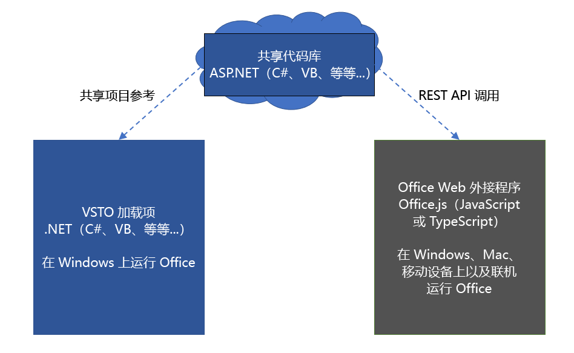
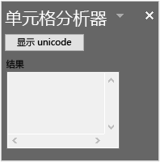

# <a name="tutorial-share-code-between-both-a-vsto-add-in-and-an-office-add-in-with-a-shared-code-library"></a><span data-ttu-id="f5bd6-103">教程：使用共享代码库在 VSTO 加载项与 Office 加载项之间共享代码</span><span class="sxs-lookup"><span data-stu-id="f5bd6-103">Tutorial: Share code between both a VSTO Add-in and an Office add-in with a shared code library</span></span>

<span data-ttu-id="f5bd6-104">Visual Studio Tools for Office (VSTO) 加载项非常适合用于扩展 Office，从而为你的企业或其他企业提供解决方案。</span><span class="sxs-lookup"><span data-stu-id="f5bd6-104">Visual Studio Tools for Office (VSTO) Add-ins are great for extending Office to provide solutions for your business or others.</span></span> <span data-ttu-id="f5bd6-105">这些加载项已问世很长时间，并且已使用 VSTO 构建上千种解决方案。</span><span class="sxs-lookup"><span data-stu-id="f5bd6-105">They've been around for a long time and there are thousands of solutions built with VSTO.</span></span> <span data-ttu-id="f5bd6-106">但是，它们仅在 Windows 版的 Office 中运行。</span><span class="sxs-lookup"><span data-stu-id="f5bd6-106">However, they only run on Office on Windows.</span></span> <span data-ttu-id="f5bd6-107">无法在 Mac、网页和移动平台上运行 VSTO 加载项。</span><span class="sxs-lookup"><span data-stu-id="f5bd6-107">You can't run VSTO Add-ins on Mac, online, or mobile platforms.</span></span>

<span data-ttu-id="f5bd6-108">Office 加载项使用 HTML、JavaScript 和其他 Web 技术来构建所有平台上的 Office 解决方案。</span><span class="sxs-lookup"><span data-stu-id="f5bd6-108">Office Add-ins use HTML, JavaScript, and additional web technologies to build Office solutions on all platforms.</span></span> <span data-ttu-id="f5bd6-109">一种好方法是将现有 VSTO 加载项迁移到 Office 加载项，使你的解决方案在所有平台中可用。</span><span class="sxs-lookup"><span data-stu-id="f5bd6-109">Migrating your existing VSTO Add-in to an Office add-in is a great way to make your solution available across all platforms.</span></span>

<span data-ttu-id="f5bd6-110">你可能想要同时保留具有相同功能的 VSTO 加载项和新 Office 加载项。</span><span class="sxs-lookup"><span data-stu-id="f5bd6-110">You may want to maintain both your VSTO Add-in and a new Office add-in that both have the same functionality.</span></span> <span data-ttu-id="f5bd6-111">这样就能继续为 Windows 版 Office 中使用 VSTO 加载项的客户提供服务。</span><span class="sxs-lookup"><span data-stu-id="f5bd6-111">This enables you to continue servicing your customers that use the VSTO Add-in on Office on Windows.</span></span> <span data-ttu-id="f5bd6-112">此外，还能为所有平台的客户提供相同的 Office 加载项功能。</span><span class="sxs-lookup"><span data-stu-id="f5bd6-112">This also enables you to provide the same functionality in an Office add-in for customers across all platforms.</span></span> <span data-ttu-id="f5bd6-113">你还可以[使 Office 加载项与现有 VSTO 加载项兼容](../develop/make-office-add-in-compatible-with-existing-com-add-in.md)。</span><span class="sxs-lookup"><span data-stu-id="f5bd6-113">You can also [Make your Office add-in compatible with the existing VSTO Add-in](../develop/make-office-add-in-compatible-with-existing-com-add-in.md).</span></span>

<span data-ttu-id="f5bd6-114">但是，最好避免为 Office 加载项重写 VSTO 加载项的所有代码。</span><span class="sxs-lookup"><span data-stu-id="f5bd6-114">However it is best to avoid rewriting all the code from your VSTO Add-in for the Office add-in.</span></span> <span data-ttu-id="f5bd6-115">本教程介绍如何使用这两个加载项的共享代码库来避免重写代码。</span><span class="sxs-lookup"><span data-stu-id="f5bd6-115">This tutorial shows how to avoid rewriting code by using a shared code library for both add-ins.</span></span>

## <a name="shared-code-library"></a><span data-ttu-id="f5bd6-116">共享代码库</span><span class="sxs-lookup"><span data-stu-id="f5bd6-116">Shared code library</span></span>

<span data-ttu-id="f5bd6-117">本教程将指导你完成在 VSTO 加载项和新式 Office 加载项之间确定和共享通用代码的步骤。</span><span class="sxs-lookup"><span data-stu-id="f5bd6-117">This tutorial will walk you through the steps of identifying and sharing common code between your VSTO Add-in and a modern Office add-in.</span></span> <span data-ttu-id="f5bd6-118">本教程使用非常简单的 VSTO 加载项示例来演示这些步骤，以便你可以专注于在处理自己的 VSTO 加载项时所需的技能和方法。</span><span class="sxs-lookup"><span data-stu-id="f5bd6-118">It uses a very simple VSTO Add-in example for the steps so that you can focus on the skills and techniques you will need for working with your own VSTO Add-ins.</span></span>

<span data-ttu-id="f5bd6-119">下图显示了如何将共享代码库用于迁移。</span><span class="sxs-lookup"><span data-stu-id="f5bd6-119">The following diagram shows how the shared code library works for migration.</span></span> <span data-ttu-id="f5bd6-120">通用代码将重构到新的共享代码库中。</span><span class="sxs-lookup"><span data-stu-id="f5bd6-120">Common code is refactored into a new shared code library.</span></span> <span data-ttu-id="f5bd6-121">该代码可保持其原始编写语言（例如 C# 或 VB）。</span><span class="sxs-lookup"><span data-stu-id="f5bd6-121">The code can remain written in its original language, such as C# or VB.</span></span> <span data-ttu-id="f5bd6-122">这意味着你可以创建项目引用，从而继续在现有 VSTO 加载项中使用该代码。</span><span class="sxs-lookup"><span data-stu-id="f5bd6-122">This means you can continue using the code in the existing VSTO Add-in by creating a project reference.</span></span> <span data-ttu-id="f5bd6-123">创建 Office 加载项时，该加载项也将使用共享代码库，即通过 REST API 对其进行调用。</span><span class="sxs-lookup"><span data-stu-id="f5bd6-123">When you create the Office add-in, it will also use the shared code library by calling into it through REST APIs.</span></span>



<span data-ttu-id="f5bd6-125">本教程中的技能和方法：</span><span class="sxs-lookup"><span data-stu-id="f5bd6-125">Skills and techniques in this tutorial:</span></span>

- <span data-ttu-id="f5bd6-126">将代码重构到 .NET 类库中，从而创建共享类库。</span><span class="sxs-lookup"><span data-stu-id="f5bd6-126">Create a shared class library by refactoring code into a .NET class library.</span></span>
- <span data-ttu-id="f5bd6-127">使用 ASP.NET Core 为共享类库创建 REST API 包装器。</span><span class="sxs-lookup"><span data-stu-id="f5bd6-127">Create a REST API wrapper using ASP.NET Core for the shared class library.</span></span>
- <span data-ttu-id="f5bd6-128">从 Office 加载项调用 REST API 来访问共享代码。</span><span class="sxs-lookup"><span data-stu-id="f5bd6-128">Call the REST API from the Office add-in to access shared code.</span></span>

## <a name="prerequisites"></a><span data-ttu-id="f5bd6-129">先决条件</span><span class="sxs-lookup"><span data-stu-id="f5bd6-129">Prerequisites</span></span>

<span data-ttu-id="f5bd6-130">设置开发环境：</span><span class="sxs-lookup"><span data-stu-id="f5bd6-130">To set up your development environment:</span></span>

1. <span data-ttu-id="f5bd6-131">安装 [Visual Studio 2019](https://visualstudio.microsoft.com/downloads/)。</span><span class="sxs-lookup"><span data-stu-id="f5bd6-131">Install [Visual Studio 2019](https://visualstudio.microsoft.com/downloads/).</span></span>
2. <span data-ttu-id="f5bd6-132">安装以下工作负载：</span><span class="sxs-lookup"><span data-stu-id="f5bd6-132">Install the following workloads:</span></span>
    - <span data-ttu-id="f5bd6-133">ASP.NET 和 Web 开发</span><span class="sxs-lookup"><span data-stu-id="f5bd6-133">ASP.NET and web development</span></span>
    - <span data-ttu-id="f5bd6-134">.NET Core 跨平台开发。</span><span class="sxs-lookup"><span data-stu-id="f5bd6-134">.NET Core cross-platform development.</span></span>
    - <span data-ttu-id="f5bd6-135">Office/SharePoint 开发</span><span class="sxs-lookup"><span data-stu-id="f5bd6-135">Office/SharePoint development</span></span>
    - <span data-ttu-id="f5bd6-136">以下**各个**组件。</span><span class="sxs-lookup"><span data-stu-id="f5bd6-136">The following **Individual** components.</span></span>
        - <span data-ttu-id="f5bd6-137">Visual Studio Tools for Office (VSTO)。</span><span class="sxs-lookup"><span data-stu-id="f5bd6-137">Visual Studio Tools for Office (VSTO).</span></span>
        - <span data-ttu-id="f5bd6-138">.NET Core 3.0 Runtime。</span><span class="sxs-lookup"><span data-stu-id="f5bd6-138">.NET Core 3.0 Runtime.</span></span>

<span data-ttu-id="f5bd6-139">还需要：</span><span class="sxs-lookup"><span data-stu-id="f5bd6-139">You also need the following:</span></span>

- <span data-ttu-id="f5bd6-140">Office 365 帐户。</span><span class="sxs-lookup"><span data-stu-id="f5bd6-140">An Office 365 account.</span></span> <span data-ttu-id="f5bd6-141">你可以参加 [Office 365 开发人员计划](https://aka.ms/devprogramsignup)，获取为期 1 年的免费 Office 365 订阅服务。</span><span class="sxs-lookup"><span data-stu-id="f5bd6-141">You can join the [Office 365 Developer Program](https://aka.ms/devprogramsignup) that includes a free 1 year subscription to Office 365.</span></span>
- <span data-ttu-id="f5bd6-142">Microsoft Azure 租户。</span><span class="sxs-lookup"><span data-stu-id="f5bd6-142">A Microsoft Azure Tenant.</span></span> <span data-ttu-id="f5bd6-143">可以从 [Microsoft Azure](https://account.windowsazure.com/SignUp) 获得试用订阅。</span><span class="sxs-lookup"><span data-stu-id="f5bd6-143">A trial subscription can be acquired here: [Microsoft Azure](https://account.windowsazure.com/SignUp).</span></span>

## <a name="the-cell-analyzer-vsto-add-in"></a><span data-ttu-id="f5bd6-144">单元格分析器 VSTO 加载项</span><span class="sxs-lookup"><span data-stu-id="f5bd6-144">The Cell analyzer VSTO Add-in</span></span>

<span data-ttu-id="f5bd6-145">本教程使用 [Office 加载项的 VSTO 加载项共享库](https://github.com/OfficeDev/PnP-OfficeAddins/tree/master/Samples/VSTO-shared-code-migration) PnP 解决方案。</span><span class="sxs-lookup"><span data-stu-id="f5bd6-145">This tutorial uses the [VSTO Add-in shared library for Office add-in](https://github.com/OfficeDev/PnP-OfficeAddins/tree/master/Samples/VSTO-shared-code-migration) PnP solution.</span></span> <span data-ttu-id="f5bd6-146">**/start** 文件夹包含要迁移的 VSTO 加载项解决方案。</span><span class="sxs-lookup"><span data-stu-id="f5bd6-146">The **/start** folder contains the VSTO Add-in solution that you will migrate.</span></span> <span data-ttu-id="f5bd6-147">你的目标是在可能情况下，通过共享代码，将 VSTO 加载项迁移到新式 Office 加载项。</span><span class="sxs-lookup"><span data-stu-id="f5bd6-147">Your goal is to migrate the VSTO Add-in to a modern Office add-in by sharing code when possible.</span></span>

> [!NOTE]
> <span data-ttu-id="f5bd6-148">该示例使用 C#，但你可以将本教程中的方法应用于采用任何 .NET 语言编写的 VSTO 加载项。</span><span class="sxs-lookup"><span data-stu-id="f5bd6-148">The sample uses C# but you can apply the techniques in this tutorial to a VSTO Add-in written in any .NET language.</span></span>

1. <span data-ttu-id="f5bd6-149">将 [Office 加载项的 VSTO 加载项共享库](https://github.com/OfficeDev/PnP-OfficeAddins/tree/master/Samples/VSTO-shared-code-migration) PnP 解决方案下载到计算机上的工作文件夹。</span><span class="sxs-lookup"><span data-stu-id="f5bd6-149">Download the [VSTO Add-in shared library for Office add-in](https://github.com/OfficeDev/PnP-OfficeAddins/tree/master/Samples/VSTO-shared-code-migration) PnP solution to a working folder on your computer.</span></span>
2. <span data-ttu-id="f5bd6-150">启动 Visual Studio 2019 并打开 **/start/Cell-Analyzer.sln** 解决方案。</span><span class="sxs-lookup"><span data-stu-id="f5bd6-150">Start Visual Studio 2019 and open the **/start/Cell-Analyzer.sln** solution.</span></span>
3. <span data-ttu-id="f5bd6-151">在“**调试**”菜单中，选择“**开始调试**”。</span><span class="sxs-lookup"><span data-stu-id="f5bd6-151">On the **Debug** menu, choose **Start Debugging**.</span></span>
3. <span data-ttu-id="f5bd6-152">在“**解决方案资源管理器**”中，右键单击“**单元格分析器**”项目，然后选择“**属性**”。</span><span class="sxs-lookup"><span data-stu-id="f5bd6-152">In **Solution Explorer**, right-click the **Cell-Analyzer** project, and choose **Properties**.</span></span>
4. <span data-ttu-id="f5bd6-153">在属性中选择“**签名**”类别。</span><span class="sxs-lookup"><span data-stu-id="f5bd6-153">Choose the **Signing** category in the properties.</span></span>
5. <span data-ttu-id="f5bd6-154">选择“**为 ClickOnce 清单签名**”，然后选择“**创建测试证书**”。</span><span class="sxs-lookup"><span data-stu-id="f5bd6-154">Choose **Sign the ClickOnce manifests**, and then chose **Create Test Certificate**.</span></span>
6. <span data-ttu-id="f5bd6-155">在“**创建测试证书**”对话框中，输入并确认密码。</span><span class="sxs-lookup"><span data-stu-id="f5bd6-155">In the **Create Test Certificate** dialog, enter and confirm a password.</span></span> <span data-ttu-id="f5bd6-156">然后选择“**确定**”。</span><span class="sxs-lookup"><span data-stu-id="f5bd6-156">Then choose **OK**.</span></span>

<span data-ttu-id="f5bd6-157">该加载项是 Excel 的自定义任务窗格。</span><span class="sxs-lookup"><span data-stu-id="f5bd6-157">The add-in is a custom task pane for Excel.</span></span> <span data-ttu-id="f5bd6-158">你可以选择包含文本的任何单元格，然后选择“**显示 Unicode**”按钮。</span><span class="sxs-lookup"><span data-stu-id="f5bd6-158">You can select any cell with text, and then choose the **Show Unicode** button.</span></span> <span data-ttu-id="f5bd6-159">该加载项将列出文本中的每个字符及其相应 Unicode 编号。</span><span class="sxs-lookup"><span data-stu-id="f5bd6-159">The add-in will display a list of each character in the text along with its corresponding Unicode number.</span></span>



## <a name="analyze-types-of-code-in-the-vsto-add-in"></a><span data-ttu-id="f5bd6-161">分析 VSTO 加载项中的代码类型</span><span class="sxs-lookup"><span data-stu-id="f5bd6-161">Analyze types of code in the VSTO Add-in</span></span>

<span data-ttu-id="f5bd6-162">采用的第一种方法是分析加载项，从而了解可共享代码的哪些部分。</span><span class="sxs-lookup"><span data-stu-id="f5bd6-162">The first technique to apply is to analyze the add-in for which parts of code can be shared.</span></span> <span data-ttu-id="f5bd6-163">通常情况下，项目将分为三种类型的代码。</span><span class="sxs-lookup"><span data-stu-id="f5bd6-163">In general, project will break down into three types of code.</span></span>

### <a name="ui-code"></a><span data-ttu-id="f5bd6-164">UI 代码</span><span class="sxs-lookup"><span data-stu-id="f5bd6-164">UI code</span></span>

<span data-ttu-id="f5bd6-165">UI 代码与用户进行交互。</span><span class="sxs-lookup"><span data-stu-id="f5bd6-165">UI code interacts with the user.</span></span> <span data-ttu-id="f5bd6-166">在 VSTO 中，UI 代码可通过 Windows 窗体运行。</span><span class="sxs-lookup"><span data-stu-id="f5bd6-166">In VSTO UI code works through Windows Forms.</span></span> <span data-ttu-id="f5bd6-167">Office 加载项将 HTML、CSS 和 JavaScript 用于 UI。</span><span class="sxs-lookup"><span data-stu-id="f5bd6-167">Office Add-ins use HTML, CSS, and JavaScript for UI.</span></span> <span data-ttu-id="f5bd6-168">由于这些差异，无法将 UI 代码共享到 Office 加载项。</span><span class="sxs-lookup"><span data-stu-id="f5bd6-168">Because of these differences you cannot share UI code to the Office add-in.</span></span> <span data-ttu-id="f5bd6-169">需要用 JavaScript 来重新创建 UI。</span><span class="sxs-lookup"><span data-stu-id="f5bd6-169">UI will need to be recreated in JavaScript.</span></span>

### <a name="document-code"></a><span data-ttu-id="f5bd6-170">文档代码</span><span class="sxs-lookup"><span data-stu-id="f5bd6-170">Document code</span></span>

<span data-ttu-id="f5bd6-171">在 VSTO 中，代码通过 .NET 对象（例如 `Microsoft.Office.Interop.Excel.Range`）与文档进行交互。</span><span class="sxs-lookup"><span data-stu-id="f5bd6-171">In VSTO code interacts with the document through .NET objects such as `Microsoft.Office.Interop.Excel.Range`.</span></span> <span data-ttu-id="f5bd6-172">但 Office 加载项使用的是 Office.js 库。</span><span class="sxs-lookup"><span data-stu-id="f5bd6-172">But Office Add-ins use the Office.js library.</span></span> <span data-ttu-id="f5bd6-173">虽然它们类似，但是并不完全相同。</span><span class="sxs-lookup"><span data-stu-id="f5bd6-173">Although these are similar, they are not exactly the same.</span></span> <span data-ttu-id="f5bd6-174">同样，不能将文档交互代码共享到 Office 加载项。</span><span class="sxs-lookup"><span data-stu-id="f5bd6-174">So again, you cannot share document interaction code to the Office add-in.</span></span>

### <a name="logic-code"></a><span data-ttu-id="f5bd6-175">逻辑代码</span><span class="sxs-lookup"><span data-stu-id="f5bd6-175">Logic code</span></span>

<span data-ttu-id="f5bd6-176">业务逻辑、算法、helper 函数和类似的代码通常构成 VSTO 加载项的核心。</span><span class="sxs-lookup"><span data-stu-id="f5bd6-176">Business logic, algorithms, helper functions, and similar code often make up the heart of a VSTO Add-in.</span></span> <span data-ttu-id="f5bd6-177">此类代码独立于 UI 代码和文档代码，可用于执行分析、连接到后端服务、运行计算等。</span><span class="sxs-lookup"><span data-stu-id="f5bd6-177">This code works independently of the UI and document code to perform analysis, connect to backend services, run calculations, and more.</span></span> <span data-ttu-id="f5bd6-178">这是可以共享的代码，因此无需用 JavaScript 重写。</span><span class="sxs-lookup"><span data-stu-id="f5bd6-178">This is the code that can be shared so that you don't have to rewrite it in JavaScript.</span></span>

<span data-ttu-id="f5bd6-179">让我们看一看 VSTO 加载项。</span><span class="sxs-lookup"><span data-stu-id="f5bd6-179">Let's examine the VSTO Add-in.</span></span> <span data-ttu-id="f5bd6-180">在以下代码中，每个部分标识为 DOCUMENT、UI 或 ALGORITHM 代码。</span><span class="sxs-lookup"><span data-stu-id="f5bd6-180">In the following code, each section is identified as DOCUMENT, UI, or ALGORITHM code.</span></span>

```csharp
// *** UI CODE ***
private void btnUnicode_Click(object sender, EventArgs e)
{
    // *** DOCUMENT CODE ***
    Microsoft.Office.Interop.Excel.Range rangeCell;
    rangeCell = Globals.ThisAddIn.Application.ActiveCell;

    string cellValue = "";

    if (null != rangeCell.Value)
    {
        cellValue = rangeCell.Value.ToString();
    }

    // *** ALGORITHM CODE ***
    //convert string to Unicode listing
    string result = "";
    foreach (char c in cellValue)
    {
        int unicode = c;

        result += $"{c}: {unicode}\r\n";
    }
    
    // *** UI CODE ***
    //Output the result
    txtResult.Text = result;
}
```

<span data-ttu-id="f5bd6-181">使用此方法就会发现，可以将一个代码段共享到 Office 加载项。</span><span class="sxs-lookup"><span data-stu-id="f5bd6-181">Using this approach you can see that one section of code can be shared to the Office add-in.</span></span> <span data-ttu-id="f5bd6-182">需要将以下代码重构到单独的类库中。</span><span class="sxs-lookup"><span data-stu-id="f5bd6-182">The following code will need to be refactored into a separate class library.</span></span>

```csharp
// *** ALGORITHM CODE ***
//convert string to Unicode listing
string result = "";
foreach (char c in cellValue)
{
    int unicode = c;

    result += $"{c}: {unicode}\r\n";
}
```

## <a name="create-a-shared-class-library"></a><span data-ttu-id="f5bd6-183">创建共享类库</span><span class="sxs-lookup"><span data-stu-id="f5bd6-183">Create a shared class library</span></span>

<span data-ttu-id="f5bd6-184">在 Visual Studio 中，VSTO 加载项会创建为 .NET 项目，因此为简单起见，我们将尽可能重用 .NET。</span><span class="sxs-lookup"><span data-stu-id="f5bd6-184">VSTO Add-ins are created in Visual Studio as .NET projects, so we'll reuse .NET as much as possible to keep things simple.</span></span> <span data-ttu-id="f5bd6-185">下一种方法是创建类库，然后将共享代码重构到该类库中。</span><span class="sxs-lookup"><span data-stu-id="f5bd6-185">Our next technique is to create a class library and refactor shared code into that class library.</span></span>

1. <span data-ttu-id="f5bd6-186">如果尚未启动 Visual Studio 2019 并打开 **\start\Cell-Analyzer.sln** 解决方案，请执行此操作。</span><span class="sxs-lookup"><span data-stu-id="f5bd6-186">If you haven't already, start Visual Studio 2019 and open the **\start\Cell-Analyzer.sln** solution.</span></span>
2. <span data-ttu-id="f5bd6-187">右键单击“**解决方案资源管理器**”中的解决方案，并选择 **“添加”>“新建项目”**。</span><span class="sxs-lookup"><span data-stu-id="f5bd6-187">Right-click the solution in **Solution Explorer** and choose **Add > New Project**.</span></span>
3. <span data-ttu-id="f5bd6-188">在“**添加新项目**”对话框中，选择“**类库(.NET Framework)**”，然后选择“**下一步**”。</span><span class="sxs-lookup"><span data-stu-id="f5bd6-188">In the **Add a new project dialog**, choose **Class Library (.NET Framework)**, and choose **Next**.</span></span>
    > [!NOTE]
    > <span data-ttu-id="f5bd6-189">请勿使用 .NET Core 类库，因为它不能用于你的 VSTO 项目。</span><span class="sxs-lookup"><span data-stu-id="f5bd6-189">Don't use the .NET Core class library because it will not work with your VSTO project.</span></span>
4. <span data-ttu-id="f5bd6-190">在“**配置新项目**”对话框中，设置以下字段。</span><span class="sxs-lookup"><span data-stu-id="f5bd6-190">In the **Configure your new project** dialog, set the following fields.</span></span>
    - <span data-ttu-id="f5bd6-191">将“**项目名称**”设置为“**CellAnalyzerSharedLibrary**”。</span><span class="sxs-lookup"><span data-stu-id="f5bd6-191">Set the  **Project name** to **CellAnalyzerSharedLibrary**.</span></span>
    - <span data-ttu-id="f5bd6-192">保留“**位置**”的默认值。</span><span class="sxs-lookup"><span data-stu-id="f5bd6-192">Leave the **Location** at it's default value.</span></span>
    - <span data-ttu-id="f5bd6-193">将“**框架**”设置为“**4.7.2**”。</span><span class="sxs-lookup"><span data-stu-id="f5bd6-193">Set the **Framework** to **4.7.2**.</span></span>
5. <span data-ttu-id="f5bd6-194">选择“**创建**”。</span><span class="sxs-lookup"><span data-stu-id="f5bd6-194">Choose **Create**.</span></span>
6. <span data-ttu-id="f5bd6-195">创建项目后，将 **Class1.cs** 文件重命名为 **CellOperations.cs**。</span><span class="sxs-lookup"><span data-stu-id="f5bd6-195">After the project is created, rename the **Class1.cs** file to **CellOperations.cs**.</span></span> <span data-ttu-id="f5bd6-196">系统将提示你重命名该类。</span><span class="sxs-lookup"><span data-stu-id="f5bd6-196">A prompt to rename the class appears.</span></span> <span data-ttu-id="f5bd6-197">请重命名该类名，使其与文件名匹配。</span><span class="sxs-lookup"><span data-stu-id="f5bd6-197">Rename the class name so that it matches the file name.</span></span>
7. <span data-ttu-id="f5bd6-198">将以下代码添加到 `CellOperations` 类，从而创建名为 `GetUnicodeFromText` 的方法。</span><span class="sxs-lookup"><span data-stu-id="f5bd6-198">Add the following code to the `CellOperations` class to create a method named `GetUnicodeFromText`.</span></span>

```csharp
public class CellOperations
{
    static public string GetUnicodeFromText(string value)
    {
        string result = "";
        foreach (char c in value)
        {
            int unicode = c;

            result += $"{c}: {unicode}\r\n";
        }
        return result;
    }
}
```

### <a name="use-the-shared-class-library-in-the-vsto-add-in"></a><span data-ttu-id="f5bd6-199">使用 VSTO 加载项中的共享类库</span><span class="sxs-lookup"><span data-stu-id="f5bd6-199">Use the shared class library in the VSTO Add-in</span></span>

<span data-ttu-id="f5bd6-200">现在，需要更新 VSTO 加载项以使用该类库。</span><span class="sxs-lookup"><span data-stu-id="f5bd6-200">Now you need to update the VSTO Add-in to use the class library.</span></span> <span data-ttu-id="f5bd6-201">必须确保 VSTO 加载项和 Office 加载项使用同一共享类库，以便在同一位置创建将来的 bug 修复或功能。</span><span class="sxs-lookup"><span data-stu-id="f5bd6-201">This is important that both the VSTO Add-in and Office add-in use the same shared class library so that future bug fixes or features are made in one location.</span></span>

1. <span data-ttu-id="f5bd6-202">在“**解决方案资源管理器**”中，右键单击“**Cell-Analyzer**”项目，然后选择“**添加引用**”。</span><span class="sxs-lookup"><span data-stu-id="f5bd6-202">In **Solution Explorer** right-click the **Cell-Analyzer** project, and choose **Add Reference**.</span></span>
2. <span data-ttu-id="f5bd6-203">选择“**CellAnalyzerSharedLibrary**”，然后选择“**确定**”。</span><span class="sxs-lookup"><span data-stu-id="f5bd6-203">Select **CellAnalyzerSharedLibrary**, and choose **OK**.</span></span>
3. <span data-ttu-id="f5bd6-204">在“**解决方案资源管理器**”中，展开“**单元格分析器**”项目，右键单击“**CellAnalyzerPane.cs**”文件，然后选择“**查看代码**”。</span><span class="sxs-lookup"><span data-stu-id="f5bd6-204">In **Solution Explorer** expand the **Cell-Analyzer** project, right-click the **CellAnalyzerPane.cs** file, and choose **View Code**.</span></span>
4. <span data-ttu-id="f5bd6-205">在 `btnUnicode_Click` 方法中，删除以下代码行。</span><span class="sxs-lookup"><span data-stu-id="f5bd6-205">In the `btnUnicode_Click` method, delete the following lines of code.</span></span>
    
    ```csharp
    //Convert to Unicode listing
    string result = "";
    foreach (char c in cellValue)
    {
      int unicode = c;
      result += $"{c}: {unicode}\r\n";
    }
    ```
    
5. <span data-ttu-id="f5bd6-206">将 `//Output the result` 注释下的代码行更新为如下代码：</span><span class="sxs-lookup"><span data-stu-id="f5bd6-206">Update the line of code under the `//Output the result` comment to read as follows:</span></span>
    
    ```csharp
    //Output the result
    txtResult.Text = CellAnalyzerSharedLibrary.CellOperations.GetUnicodeFromText(cellValue);
    ```
    
6. <span data-ttu-id="f5bd6-207">在“**调试**”菜单中，选择“**开始调试**”。</span><span class="sxs-lookup"><span data-stu-id="f5bd6-207">On the **Debug** menu, choose **Start Debugging**.</span></span> <span data-ttu-id="f5bd6-208">自定义任务窗格应按预期运行。</span><span class="sxs-lookup"><span data-stu-id="f5bd6-208">The custom task pane should work as expected.</span></span> <span data-ttu-id="f5bd6-209">在单元格中输入一些文本，然后进行测试，以确定可以用加载项将其转换为 Unicode 列表。</span><span class="sxs-lookup"><span data-stu-id="f5bd6-209">Enter some text in a cell, and then test that you can convert it to a Unicode list with the add-in.</span></span>

## <a name="create-a-rest-api-wrapper"></a><span data-ttu-id="f5bd6-210">创建 REST API 包装器</span><span class="sxs-lookup"><span data-stu-id="f5bd6-210">Create a REST API wrapper</span></span>

<span data-ttu-id="f5bd6-211">VSTO 加载项可以直接使用共享类库，因为它们都是 .NET 项目。</span><span class="sxs-lookup"><span data-stu-id="f5bd6-211">The VSTO Add-in can use the shared class library directly since they are both .NET projects.</span></span> <span data-ttu-id="f5bd6-212">但是，Office 加载项无法使用 .NET，因为它使用的是 JavaScript。</span><span class="sxs-lookup"><span data-stu-id="f5bd6-212">However the Office add-in won't be able to use .NET since it uses JavaScript.</span></span> <span data-ttu-id="f5bd6-213">接下来需要创建 REST API 包装器。</span><span class="sxs-lookup"><span data-stu-id="f5bd6-213">Next you will need to create a REST API wrapper.</span></span> <span data-ttu-id="f5bd6-214">这使 Office 加载项可以调用 REST API，进而将此调用传递到共享类库。</span><span class="sxs-lookup"><span data-stu-id="f5bd6-214">This enables the Office add-in to call a REST API, which then passes the call along to the shared class library.</span></span>

1. <span data-ttu-id="f5bd6-215">在“**解决方案资源管理器**”中，右键单击“**单元格分析器**”项目，然后选择 **“添加”>“新建项目”**。</span><span class="sxs-lookup"><span data-stu-id="f5bd6-215">In **Solution Explorer**, right-click the **Cell-Analyzer** project, and choose **Add > New Project**.</span></span>
2. <span data-ttu-id="f5bd6-216">在“**添加新项目**”对话框中，选择“**ASP.NET Core Web 应用程序**”，然后选择“**下一步**”。</span><span class="sxs-lookup"><span data-stu-id="f5bd6-216">In the **Add a new project dialog**, choose **ASP.NET Core Web Application**, and choose **Next**.</span></span>
3. <span data-ttu-id="f5bd6-217">在“**配置新项目**”对话框中，设置以下字段：</span><span class="sxs-lookup"><span data-stu-id="f5bd6-217">In the **Configure your new project** dialog, set the following fields:</span></span>
    - <span data-ttu-id="f5bd6-218">将“**项目名称**”设置为“**CellAnalyzerRESTAPI**”。</span><span class="sxs-lookup"><span data-stu-id="f5bd6-218">Set the **Project name** to **CellAnalyzerRESTAPI**.</span></span>
    - <span data-ttu-id="f5bd6-219">在“**位置**”字段中，保留默认值。</span><span class="sxs-lookup"><span data-stu-id="f5bd6-219">In the **Location** field, leave the default value.</span></span>
4. <span data-ttu-id="f5bd6-220">选择“**创建**”。</span><span class="sxs-lookup"><span data-stu-id="f5bd6-220">Choose **Create**.</span></span>
5. <span data-ttu-id="f5bd6-221">在“**创建新的 ASP.NET Core Web 应用程序**”对话框中，选择“**ASP.NET Core 3.1**”版本，然后在项目列表中选择“**API**”。</span><span class="sxs-lookup"><span data-stu-id="f5bd6-221">In the **Create a new ASP.NET Core web application** dialog, select **ASP.NET Core 3.1** for the version, and select **API** in the list of projects.</span></span>
6. <span data-ttu-id="f5bd6-222">将其他所有字段保留为默认值，然后选择“**创建**”按钮。</span><span class="sxs-lookup"><span data-stu-id="f5bd6-222">Leave all other fields at default values and choose the **Create** button.</span></span>
7. <span data-ttu-id="f5bd6-223">创建项目后，展开“**解决方案资源管理器**”中的“**CellAnalyzerRESTAPI**”项目。</span><span class="sxs-lookup"><span data-stu-id="f5bd6-223">After the project is created, expand the **CellAnalyzerRESTAPI** project in **Solution Explorer**.</span></span>
8. <span data-ttu-id="f5bd6-224">右键单击“**依赖项**”，然后选择“**添加引用**”。</span><span class="sxs-lookup"><span data-stu-id="f5bd6-224">Right-click **Dependencies**, and choose **Add Reference**.</span></span>
9. <span data-ttu-id="f5bd6-225">选择“**CellAnalyzerSharedLibrary**”，然后选择“**确定**”。</span><span class="sxs-lookup"><span data-stu-id="f5bd6-225">Select **CellAnalyzerSharedLibrary**, and choose **OK**.</span></span>
10. <span data-ttu-id="f5bd6-226">右键单击“**控制器**”文件夹，然后选择 **“添加”>“控制器”**。</span><span class="sxs-lookup"><span data-stu-id="f5bd6-226">Right-click the **Controllers** folder, and choose **Add > Controller**.</span></span>
11. <span data-ttu-id="f5bd6-227">在“**添加新搭建基架的项目**”对话框中，选择“**API 控制器 - 空**”，然后选择“**添加**”。</span><span class="sxs-lookup"><span data-stu-id="f5bd6-227">In the **Add New Scaffolded Item** dialog, choose **API Controller - Empty** and then **Add**.</span></span>
12. <span data-ttu-id="f5bd6-228">在“**添加空的 API 控制器**”对话框中，将该控制器命名为“**AnalyzeUnicodeController**”，然后选择“**添加**”。</span><span class="sxs-lookup"><span data-stu-id="f5bd6-228">In the **Add Empty API Controller** dialog, name the controller **AnalyzeUnicodeController**, and then choose **Add**.</span></span>
13. <span data-ttu-id="f5bd6-229">打开“**AnalyzeUnicodeController.cs**”文件，然后将以下代码作为方法添加到 `AnalyzeUnicodeController` 类。</span><span class="sxs-lookup"><span data-stu-id="f5bd6-229">Open the **AnalyzeUnicodeController.cs** file and add the following code as a method to the `AnalyzeUnicodeController` class.</span></span>
    
    ```csharp
    [HttpGet]
    public ActionResult<string> AnalyzeUnicode(string value)
    {
      if (value == null)
      {
        return BadRequest();
      }
      return CellAnalyzerSharedLibrary.CellOperations.GetUnicodeFromText(value);
    }
    ```
    
14. <span data-ttu-id="f5bd6-230">右键单击“**CellAnalyzerRESTAPI**”项目，然后选择“**设为启动项目**”。</span><span class="sxs-lookup"><span data-stu-id="f5bd6-230">Right-click the **CellAnalyzerRESTAPI** project, and choose **Set as Startup Project**.</span></span>
15. <span data-ttu-id="f5bd6-231">在“**调试**”菜单中，选择“**开始调试**”。</span><span class="sxs-lookup"><span data-stu-id="f5bd6-231">On the **Debug** menu, choose **Start Debugging**.</span></span>
16. <span data-ttu-id="f5bd6-232">随后将启动浏览器。</span><span class="sxs-lookup"><span data-stu-id="f5bd6-232">A browser will launch.</span></span> <span data-ttu-id="f5bd6-233">输入以下 URL 以测试 REST API 是否正在运行：`https://localhost:<ssl port number>/api/analyzeunicode?value=test`。</span><span class="sxs-lookup"><span data-stu-id="f5bd6-233">Enter the following URL to test that the REST API is working: `https://localhost:<ssl port number>/api/analyzeunicode?value=test`.</span></span> <span data-ttu-id="f5bd6-234">你可以重用 Visual Studio 启动的浏览器中的 URL 的端口号。</span><span class="sxs-lookup"><span data-stu-id="f5bd6-234">You can reuse the port number from the URL in the browser that Visual Studio launched.</span></span> <span data-ttu-id="f5bd6-235">应该会看到返回一个字符串，其含有每个字符的 Unicode 值。</span><span class="sxs-lookup"><span data-stu-id="f5bd6-235">You should see a string returned with Unicode values for each character.</span></span>

## <a name="create-the-office-add-in"></a><span data-ttu-id="f5bd6-236">创建 Office 加载项</span><span class="sxs-lookup"><span data-stu-id="f5bd6-236">Create the Office add-in</span></span>

<span data-ttu-id="f5bd6-237">创建 Office 加载项时，将调用 REST API。</span><span class="sxs-lookup"><span data-stu-id="f5bd6-237">When you create the Office add-in, it will make a call to the REST API.</span></span> <span data-ttu-id="f5bd6-238">但是，首先需要获取 REST API 服务器的端口号并将其保存供以后使用。</span><span class="sxs-lookup"><span data-stu-id="f5bd6-238">But first, you need to get the port number of the REST API server and save it for later.</span></span>

### <a name="save-the-ssl-port-number"></a><span data-ttu-id="f5bd6-239">保存 SSL 端口号</span><span class="sxs-lookup"><span data-stu-id="f5bd6-239">Save the SSL port number</span></span>

1. <span data-ttu-id="f5bd6-240">如果尚未启动 Visual Studio 2019 并打开 **\start\Cell-Analyzer.sln** 解决方案，请执行此操作。</span><span class="sxs-lookup"><span data-stu-id="f5bd6-240">If you haven't already, start Visual Studio 2019, and open the **\start\Cell-Analyzer.sln** solution.</span></span>
2. <span data-ttu-id="f5bd6-241">在“**CellAnalyzerRESTAPI**”项目中，展开“**属性**”，然后打开 **launchSettings json** 文件。</span><span class="sxs-lookup"><span data-stu-id="f5bd6-241">In the **CellAnalyzerRESTAPI** project, expand **Properties**, and open the **launchSettings.json** file.</span></span>
3. <span data-ttu-id="f5bd6-242">查找带有 **sslPort** 值的代码行，复制端口号，然后将其保存到某个位置。</span><span class="sxs-lookup"><span data-stu-id="f5bd6-242">Find the line of code with the **sslPort** value, copy the port number, and save it somewhere.</span></span>

### <a name="add-the-office-add-in-project"></a><span data-ttu-id="f5bd6-243">添加 Office 加载项项目</span><span class="sxs-lookup"><span data-stu-id="f5bd6-243">Add the Office add-in project</span></span>

<span data-ttu-id="f5bd6-244">为简单起见，请将所有代码保存在一个解决方案中。</span><span class="sxs-lookup"><span data-stu-id="f5bd6-244">To keep things simple, keep all the code in one solution.</span></span> <span data-ttu-id="f5bd6-245">将 Office 加载项项目添加到现有 Visual Studio 解决方案。</span><span class="sxs-lookup"><span data-stu-id="f5bd6-245">Add the Office add-in project to the existing Visual Studio solution.</span></span> <span data-ttu-id="f5bd6-246">但是，如果你熟悉 [Office 加载项的 Yeoman 生成器](https://github.com/OfficeDev/generator-office)和 Visual Studio 代码，也可以运行 `yo office` 来生成项目。</span><span class="sxs-lookup"><span data-stu-id="f5bd6-246">However, if you are familiar with the [Yeoman generator for Office Add-ins](https://github.com/OfficeDev/generator-office) and Visual Studio Code you can also run `yo office` to build the project.</span></span> <span data-ttu-id="f5bd6-247">操作步骤非常相似。</span><span class="sxs-lookup"><span data-stu-id="f5bd6-247">The steps are very similar.</span></span>

1. <span data-ttu-id="f5bd6-248">在“**解决方案资源管理器**”中，右键单击“**单元格分析器**”解决方案，然后选择 **“添加”>“新建项目”**。</span><span class="sxs-lookup"><span data-stu-id="f5bd6-248">In **Solution Explorer**, right-click the **Cell-Analyzer** solution, and choose **Add > New Project**.</span></span>
2. <span data-ttu-id="f5bd6-249">在“**添加新项目**”对话框中，选择“**Excel Web 加载项**”，然后选择“**下一步**”。</span><span class="sxs-lookup"><span data-stu-id="f5bd6-249">In the **Add a new project dialog**, choose **Excel Web Add-in**, and choose **Next**.</span></span>
3. <span data-ttu-id="f5bd6-250">在“**配置新项目**”对话框中，设置以下字段：</span><span class="sxs-lookup"><span data-stu-id="f5bd6-250">In the **Configure your new project** dialog, set the following fields:</span></span>
    - <span data-ttu-id="f5bd6-251">将“**项目名称**”设置为“**CellAnalyzerOfficeAddin**”。</span><span class="sxs-lookup"><span data-stu-id="f5bd6-251">Set the **Project name** to **CellAnalyzerOfficeAddin**.</span></span>
    - <span data-ttu-id="f5bd6-252">保留“**位置**”的默认值。</span><span class="sxs-lookup"><span data-stu-id="f5bd6-252">Leave the **Location** at it's default value.</span></span>
    - <span data-ttu-id="f5bd6-253">将“**框架**”设置为“**4.7.2**”或更高版本。</span><span class="sxs-lookup"><span data-stu-id="f5bd6-253">Set the **Framework** to **4.7.2** or later.</span></span>
4. <span data-ttu-id="f5bd6-254">选择“**创建**”。</span><span class="sxs-lookup"><span data-stu-id="f5bd6-254">Choose **Create**.</span></span>
5. <span data-ttu-id="f5bd6-255">在“**选择加载项类型**”对话框中，选择“**将新功能添加到 Excel**”，然后选择“**完成**”。</span><span class="sxs-lookup"><span data-stu-id="f5bd6-255">In the **Choose the add-in type** dialog, select **Add new functionalities to Excel**, and choose **Finish**.</span></span>

<span data-ttu-id="f5bd6-256">随后将创建两个项目：</span><span class="sxs-lookup"><span data-stu-id="f5bd6-256">Two projects will be created:</span></span>
- <span data-ttu-id="f5bd6-257">**CellAnalyzerOfficeAddin** - 此项目将配置用于描述此加载项的清单 XML 文件，以便 Office 可正确将其加载。</span><span class="sxs-lookup"><span data-stu-id="f5bd6-257">**CellAnalyzerOfficeAddin** - This project configures the manifest XML files that describes the add-in so Office can load it correctly.</span></span> <span data-ttu-id="f5bd6-258">其中包含此加载项的 ID、名称、描述和其他信息。</span><span class="sxs-lookup"><span data-stu-id="f5bd6-258">It contains the ID, name, description, and other information about the add-in.</span></span>
- <span data-ttu-id="f5bd6-259">**CellAnalyzerOfficeAddinWeb** - 此项目包含用于加载项的 Web 资源，如 HTML、CSS 和脚本。</span><span class="sxs-lookup"><span data-stu-id="f5bd6-259">**CellAnalyzerOfficeAddinWeb** - This project contains web resources for your add-in, such as HTML, CSS, and scripts.</span></span> <span data-ttu-id="f5bd6-260">此外，还配置 IIS Express 实例，从而将你的加载项托管为 Web 应用程序。</span><span class="sxs-lookup"><span data-stu-id="f5bd6-260">It also configures an IIS Express instance to host your add-in as a web application.</span></span>

### <a name="add-ui-and-functionality-to-the-office-add-in"></a><span data-ttu-id="f5bd6-261">将 UI 和功能添加到 Office 加载项</span><span class="sxs-lookup"><span data-stu-id="f5bd6-261">Add UI and functionality to the Office add-in</span></span>

1. <span data-ttu-id="f5bd6-262">在“**解决方案资源管理器**”中，展开“**CellAnalyzerOfficeAddinWeb**”项目。</span><span class="sxs-lookup"><span data-stu-id="f5bd6-262">In **Solution Explorer**, expand the **CellAnalyzerOfficeAddinWeb** project.</span></span>
2. <span data-ttu-id="f5bd6-263">打开 **Home. html** 文件，然后将 `<body>` 的内容替换为以下 HTML。</span><span class="sxs-lookup"><span data-stu-id="f5bd6-263">Open the **Home.html** file, and replace the `<body>` contents with the following HTML.</span></span>
    
    ```html
    <button id="btnShowUnicode" onclick="showUnicode()">Show Unicode</button>
    <p>Result:</p>
    <div id="txtResult"></div>
    ```
    
3. <span data-ttu-id="f5bd6-264">打开 **Home.js** 文件并将全部内容替换为以下代码。</span><span class="sxs-lookup"><span data-stu-id="f5bd6-264">Open the **Home.js** file, and replace the entire contents with the following code.</span></span> 
    
    ```js
    (function () {
      "use strict";
      // The initialize function must be run each time a new page is loaded.
      Office.initialize = function (reason) {
        $(document).ready(function () {
        });
      };
    })();
    
    function showUnicode() {
      Excel.run(function (ctx) {
        const range = ctx.workbook.getSelectedRange();
        range.load("values");
        return ctx.sync(range).then(function (range) {
          const url = "https://localhost:<ssl port number>/api/analyzeunicode?value=" + range.values[0][0];
          $.ajax({
            type: "GET",
            url: url,
            success: function (data) {
              let htmlData = data.replace(/\r\n/g, '<br>');
              $("#txtResult").html(htmlData);
            },
            error: function (data) {
                $("#txtResult").html("error occurred in ajax call.");
            }
          });
        });
      });
    }
    ```
    
4. <span data-ttu-id="f5bd6-265">在上面的代码中，输入你先前从 **launchSettings json** 文件保存的**sslPort** 号。</span><span class="sxs-lookup"><span data-stu-id="f5bd6-265">In the previous code, enter the **sslPort** number you saved previously from the **launchSettings.json** file.</span></span>

<span data-ttu-id="f5bd6-266">在上面的代码中将处理返回的字符串，以便将回车换行替换为 `<br>` HTML 标记。</span><span class="sxs-lookup"><span data-stu-id="f5bd6-266">In the previous code the returned string will be processed to replace carriage return line feeds with `<br>` HTML tags.</span></span> <span data-ttu-id="f5bd6-267">偶尔在某些情况下，可能需要在 Office 加载项侧调整 VSTO 加载项中对 .NET 完全适用的返回值，才能使该返回值符合预期。</span><span class="sxs-lookup"><span data-stu-id="f5bd6-267">You may occasionally run into situations where a return value that works perfectly fine for .NET in the VSTO Add-in will need to be adjusted on the Office add-in side to work as expected.</span></span> <span data-ttu-id="f5bd6-268">在此情况下，REST API 和共享类库仅关注返回字符串。</span><span class="sxs-lookup"><span data-stu-id="f5bd6-268">In this case the REST API and shared class library are only concerned with returning the string.</span></span> <span data-ttu-id="f5bd6-269">`showUnicode()` 方法负责正确设置返回值的格式以便显示。</span><span class="sxs-lookup"><span data-stu-id="f5bd6-269">The `showUnicode()` method is responsible for formatting return values correctly for presentation.</span></span>

### <a name="allow-cors-from-the-office-add-in"></a><span data-ttu-id="f5bd6-270">允许来自 Office 加载项的 CORS</span><span class="sxs-lookup"><span data-stu-id="f5bd6-270">Allow CORS from the Office add-in</span></span>

<span data-ttu-id="f5bd6-271">Office.js 库要求对传出调用执行 CORS，例如 REST API 服务器的 `ajax` 调用便是如此。</span><span class="sxs-lookup"><span data-stu-id="f5bd6-271">The Office.js library requires CORS on outgoing calls, such as the one made from the `ajax` call to the REST API server.</span></span> <span data-ttu-id="f5bd6-272">若要允许从 Office 加载项调用 REST API，请执行以下步骤。</span><span class="sxs-lookup"><span data-stu-id="f5bd6-272">Use the following steps to allow calls from the Office add-in to the REST API.</span></span>

1. <span data-ttu-id="f5bd6-273">在“**解决方案资源管理器**”中，选择“**CellAnalyzerOfficeAddinWeb**”项目。</span><span class="sxs-lookup"><span data-stu-id="f5bd6-273">In **Solution Explorer**, select the **CellAnalyzerOfficeAddinWeb** project.</span></span>
2. <span data-ttu-id="f5bd6-274">从“**视图**”菜单，选择“**属性窗口**”（如果尚未显示该窗口）。</span><span class="sxs-lookup"><span data-stu-id="f5bd6-274">From the **View** menu, choose **Properties Window** (if the window is not already displayed).</span></span>
3. <span data-ttu-id="f5bd6-275">在属性窗口中，复制“**SSL URL**”的值，然后将其保存到某个位置。</span><span class="sxs-lookup"><span data-stu-id="f5bd6-275">In the properties window, copy the value of the **SSL URL**, and save it somewhere.</span></span> <span data-ttu-id="f5bd6-276">这是你需要通过 CORS 允许的 URL。</span><span class="sxs-lookup"><span data-stu-id="f5bd6-276">This is the URL that you need to allow through CORS.</span></span>
4. <span data-ttu-id="f5bd6-277">在“**CellAnalyzerRESTAPI**”项目中，打开 **Startup.cs** 文件。</span><span class="sxs-lookup"><span data-stu-id="f5bd6-277">In the **CellAnalyzerRESTAPI** project, open the **Startup.cs** file.</span></span>
5. <span data-ttu-id="f5bd6-278">将以下代码添加到 `ConfigureServices` 方法上方。</span><span class="sxs-lookup"><span data-stu-id="f5bd6-278">Add the following code to the top of the `ConfigureServices` method.</span></span> <span data-ttu-id="f5bd6-279">请务必替换先前为 `builder.WithOrigins` 调用复制的 URL SSL。</span><span class="sxs-lookup"><span data-stu-id="f5bd6-279">Be sure to substitute the URL SSL you copied previously for the `builder.WithOrigins` call.</span></span>
    
    ```csharp
    services.AddCors(options =>
    {
      options.AddPolicy(MyAllowSpecificOrigins,
      builder =>
      {
        builder.WithOrigins("<your URL SSL>")
        .AllowAnyMethod()
        .AllowAnyHeader();
      });
    });
    ```
    
    > [!NOTE]
    > <span data-ttu-id="f5bd6-280">在 **builder.WithOrigins** 方法中使用 URL 时，请保留末尾的 `/`。</span><span class="sxs-lookup"><span data-stu-id="f5bd6-280">Leave the trailing `/` from the end of the URL when you use it in the **builder.WithOrigins** method.</span></span> <span data-ttu-id="f5bd6-281">例如，它应该类似于 `https://localhost:44000`。</span><span class="sxs-lookup"><span data-stu-id="f5bd6-281">For example, it should appear similar to `https://localhost:44000`.</span></span> <span data-ttu-id="f5bd6-282">否则，在运行时将出现 CORS 错误。</span><span class="sxs-lookup"><span data-stu-id="f5bd6-282">Otherwise you will get a CORS error at runtime.</span></span>
    
6. <span data-ttu-id="f5bd6-283">将下列字段添加到 `Startup` 类：</span><span class="sxs-lookup"><span data-stu-id="f5bd6-283">Add the following field to the `Startup` class:</span></span>
    
    ```csharp
    readonly string MyAllowSpecificOrigins = "_myAllowSpecificOrigins";
    ```
    
7. <span data-ttu-id="f5bd6-284">将以下代码添加到 `configure` 方法中的 `app.UseEndpoints` 代码行之前。</span><span class="sxs-lookup"><span data-stu-id="f5bd6-284">Add the following code to the `configure` method just before the line of code for `app.UseEndpoints`.</span></span>
    
    ```csharp
    app.UseCors(MyAllowSpecificOrigins);
    ```

<span data-ttu-id="f5bd6-285">完成后，`Startup` 类应类似于以下代码（你的 localhost URL 可能有所不同）：</span><span class="sxs-lookup"><span data-stu-id="f5bd6-285">When done, your `Startup` class should look similar to the following code (your localhost URL may be different):</span></span>

```csharp
public class Startup
{
  public Startup(IConfiguration configuration)
    {
      Configuration = configuration;
    }

    readonly string MyAllowSpecificOrigins = "_myAllowSpecificOrigins";

    public IConfiguration Configuration { get; }

    // NOTE: The following code configures CORS for the localhost:44397 port.
    // This is for development purposes. In production code you should update this to 
    // use the appropriate allowed domains.
    public void ConfigureServices(IServiceCollection services)
    {
        services.AddCors(options =>
        {
            options.AddPolicy(MyAllowSpecificOrigins,
            builder =>
            {
                builder.WithOrigins("https://localhost:44397")
                .AllowAnyMethod()
                .AllowAnyHeader();
            });
        });
        services.AddControllers();
    }

    // This method gets called by the runtime. Use this method to configure the HTTP request pipeline.
    public void Configure(IApplicationBuilder app, IWebHostEnvironment env)
    {
        if (env.IsDevelopment())
        {
            app.UseDeveloperExceptionPage();
        }
            
        app.UseHttpsRedirection();

        app.UseRouting();

        app.UseAuthorization();

        app.UseCors(MyAllowSpecificOrigins);

        app.UseEndpoints(endpoints =>
        {
            endpoints.MapControllers();
        });
    }
}
```

### <a name="run-the-add-in"></a><span data-ttu-id="f5bd6-286">运行加载项</span><span class="sxs-lookup"><span data-stu-id="f5bd6-286">Run the add-in</span></span>

1. <span data-ttu-id="f5bd6-287">在“**解决方案资源管理器**”中，右键单击顶层节点“**解决方案‘单元格分析器’**”，然后选择“**设置启动项目**”。</span><span class="sxs-lookup"><span data-stu-id="f5bd6-287">In **Solution Explorer**, right-click the top node **Solution 'Cell-Analyzer'**, and choose **Set Startup Projects**.</span></span>
2. <span data-ttu-id="f5bd6-288">在“**解决方案‘单元格分析器’属性页**”对话框中，选择“**多个启动项目**”。</span><span class="sxs-lookup"><span data-stu-id="f5bd6-288">In the **Solution 'Cell-Analyzer' Property Pages** dialog, select **Multiple startup projects**.</span></span>
3. <span data-ttu-id="f5bd6-289">为以下每个项目，将“**操作**”属性设置为“**启动**”。</span><span class="sxs-lookup"><span data-stu-id="f5bd6-289">Set the **Action** property to **Start** for each of the following projects.</span></span>
    
    - <span data-ttu-id="f5bd6-290">CellAnalyzerRESTAPI</span><span class="sxs-lookup"><span data-stu-id="f5bd6-290">CellAnalyzerRESTAPI</span></span>
    - <span data-ttu-id="f5bd6-291">CellAnalyzerOfficeAddin</span><span class="sxs-lookup"><span data-stu-id="f5bd6-291">CellAnalyzerOfficeAddin</span></span>
    - <span data-ttu-id="f5bd6-292">CellAnalyzerOfficeAddinWeb</span><span class="sxs-lookup"><span data-stu-id="f5bd6-292">CellAnalyzerOfficeAddinWeb</span></span>
    
4. <span data-ttu-id="f5bd6-293">选择“**确定**”。</span><span class="sxs-lookup"><span data-stu-id="f5bd6-293">Choose **OK**.</span></span>
5. <span data-ttu-id="f5bd6-294">从“**调试**”菜单中选择“**开始调试**”。</span><span class="sxs-lookup"><span data-stu-id="f5bd6-294">From the **Debug** menu, choose **Start Debugging**.</span></span>

<span data-ttu-id="f5bd6-295">Excel 将运行并旁加载 Office 加载项。</span><span class="sxs-lookup"><span data-stu-id="f5bd6-295">Excel will run and sideload the Office add-in.</span></span> <span data-ttu-id="f5bd6-296">可通过以下方式测试 localhost REST API 服务是否正常工作：将文本值输入单元格，然后在 Office 加载项中选择“**显示 Unicode**”按钮。</span><span class="sxs-lookup"><span data-stu-id="f5bd6-296">You can test that the localhost REST API service is working correctly by entering a text value into a cell, and choosing the **Show Unicode** button in the Office add-in.</span></span> <span data-ttu-id="f5bd6-297">它应该会调用 REST API 并显示文本字符的 Unicode 值。</span><span class="sxs-lookup"><span data-stu-id="f5bd6-297">It should call the REST API and display the unicode values for the text characters.</span></span>

## <a name="publish-to-an-azure-app-service"></a><span data-ttu-id="f5bd6-298">发布到 Azure 应用服务</span><span class="sxs-lookup"><span data-stu-id="f5bd6-298">Publish to an Azure App Service</span></span>

<span data-ttu-id="f5bd6-299">最终希望将 REST API 项目发布到云。</span><span class="sxs-lookup"><span data-stu-id="f5bd6-299">You eventually want to publish the REST API project to the cloud.</span></span> <span data-ttu-id="f5bd6-300">在以下步骤中，你将了解如何将 **CellAnalyzerRESTAPI** 项目发布到 Microsoft Azure 应用服务。</span><span class="sxs-lookup"><span data-stu-id="f5bd6-300">In the following steps you'll see how to publish the **CellAnalyzerRESTAPI** project to a Microsoft Azure App Service.</span></span> <span data-ttu-id="f5bd6-301">有关如何获取 Azure 帐户的信息，请参阅“[先决条件](#prerequisites)”。</span><span class="sxs-lookup"><span data-stu-id="f5bd6-301">See [Prerequisites](#prerequisites) for information on how to get an Azure account.</span></span>

1. <span data-ttu-id="f5bd6-302">在“**解决方案资源管理器**”中，右键单击“**CellAnalyzerRESTAPI**”项目，然后选择“**发布**”。</span><span class="sxs-lookup"><span data-stu-id="f5bd6-302">In **Solution Explorer**, right-click the **CellAnalyzerRESTAPI** project, and choose **Publish**.</span></span>
2. <span data-ttu-id="f5bd6-303">在“**选取发布目标**”对话框中，选择“**新建**”，然后选择“**创建配置文件**”。</span><span class="sxs-lookup"><span data-stu-id="f5bd6-303">In the **Pick a publish target** dialog, select **Create New**, and choose **Create Profile**.</span></span>
3. <span data-ttu-id="f5bd6-304">在“**应用服务**”对话框中，选择正确帐户（如果尚未选择）。</span><span class="sxs-lookup"><span data-stu-id="f5bd6-304">In the **App Service** dialog, select the correct account, if it is not already selected.</span></span>
4. <span data-ttu-id="f5bd6-305">对于你的帐户，“**应用服务**”对话框的字段将设置为默认值。</span><span class="sxs-lookup"><span data-stu-id="f5bd6-305">The fields for the **App Service** dialog will be set to defaults for your account.</span></span> <span data-ttu-id="f5bd6-306">通常情况下，默认值可运行良好，但是如果你更希望使用其他设置，则可以更改默认值。</span><span class="sxs-lookup"><span data-stu-id="f5bd6-306">Generally the defaults work fine, but you can change them if you prefer different settings.</span></span>
5. <span data-ttu-id="f5bd6-307">在“**应用服务**”对话框中，选择“**创建**”。</span><span class="sxs-lookup"><span data-stu-id="f5bd6-307">In the **App Service** dialog, choose **Create**.</span></span>
6. <span data-ttu-id="f5bd6-308">新配置文件将显示在“**发布**”页中。</span><span class="sxs-lookup"><span data-stu-id="f5bd6-308">The new profile will be displayed in a **Publish** page.</span></span> <span data-ttu-id="f5bd6-309">选择“**发布**”以生成代码并将其部署到应用服务。</span><span class="sxs-lookup"><span data-stu-id="f5bd6-309">Choose **Publish** to build and deploy the code to the App Service.</span></span>

<span data-ttu-id="f5bd6-310">现在可以测试该服务。</span><span class="sxs-lookup"><span data-stu-id="f5bd6-310">You can now test the service.</span></span> <span data-ttu-id="f5bd6-311">打开浏览器，输入 URL 直接转至新服务。</span><span class="sxs-lookup"><span data-stu-id="f5bd6-311">Open a browser and enter a URL that goes directly to the new service.</span></span> <span data-ttu-id="f5bd6-312">例如，使用 `https://<myappservice>.azurewebsites.net/api/analyzeunicode?value=test`，其中 *myappservice* 是你为新应用服务创建的唯一名称。</span><span class="sxs-lookup"><span data-stu-id="f5bd6-312">For example, use `https://<myappservice>.azurewebsites.net/api/analyzeunicode?value=test` where *myappservice* is the unique name you created for the new App Service.</span></span>

### <a name="use-the-azure-app-service-from-the-office-add-in"></a><span data-ttu-id="f5bd6-313">在 Office 加载项中使用 Azure 应用服务</span><span class="sxs-lookup"><span data-stu-id="f5bd6-313">Use the Azure App Service from the Office add-in</span></span>

<span data-ttu-id="f5bd6-314">最后一步是更新 Office 加载项中的代码，从而使用 Azure 应用服务，而不是 localhost。</span><span class="sxs-lookup"><span data-stu-id="f5bd6-314">The final step is to update the code in the Office add-in to use the Azure App Service instead of localhost.</span></span>

1. <span data-ttu-id="f5bd6-315">在“**解决方案资源管理器**”中，展开“**CellAnalyzerOfficeAddinWeb**”项目，然后打开“**Home.js**”文件。</span><span class="sxs-lookup"><span data-stu-id="f5bd6-315">In **Solution Explorer**, expand the **CellAnalyzerOfficeAddinWeb** project, and open the **Home.js** file.</span></span>
2. <span data-ttu-id="f5bd6-316">将 `url` 常量更改为使用你的 Azure 应用服务的 URL，如以下代码行所示。</span><span class="sxs-lookup"><span data-stu-id="f5bd6-316">Change the `url` constant to use the URL for your Azure App Service as shown in the following line of code.</span></span> <span data-ttu-id="f5bd6-317">将 `<myappservice>` 替换成你为新应用服务创建的唯一名称。</span><span class="sxs-lookup"><span data-stu-id="f5bd6-317">Replace `<myappservice>` with the unique name you created for the new App Service.</span></span>
    ```JavaScript
    const url = "https://<myappservice>.azurewebsites.net/api/analyzeunicode?value=" + range.values[0][0];
    ```
3. <span data-ttu-id="f5bd6-318">在“**解决方案资源管理器**”中，右键单击顶层节点“**解决方案‘单元格分析器’**”，然后选择“**设置启动项目**”。</span><span class="sxs-lookup"><span data-stu-id="f5bd6-318">In **Solution Explorer**, right-click the top node **Solution 'Cell-Analyzer'**, and choose **Set Startup Projects**.</span></span>
4. <span data-ttu-id="f5bd6-319">在“**解决方案‘单元格分析器’属性页**”对话框中，选择“**多个启动项目**”。</span><span class="sxs-lookup"><span data-stu-id="f5bd6-319">In the **Solution 'Cell-Analyzer' Property Pages** dialog, select **Multiple startup projects**.</span></span>
5. <span data-ttu-id="f5bd6-320">为以下每个项目启用“**启动**”操作：</span><span class="sxs-lookup"><span data-stu-id="f5bd6-320">Enable the **Start** action for each of the following projects:</span></span>
    - <span data-ttu-id="f5bd6-321">CellAnalyzerOfficeAddinWeb</span><span class="sxs-lookup"><span data-stu-id="f5bd6-321">CellAnalyzerOfficeAddinWeb</span></span>
    - <span data-ttu-id="f5bd6-322">CellAnalyzerOfficeAddin</span><span class="sxs-lookup"><span data-stu-id="f5bd6-322">CellAnalyzerOfficeAddin</span></span>
6. <span data-ttu-id="f5bd6-323">选择“**确定**”。</span><span class="sxs-lookup"><span data-stu-id="f5bd6-323">Choose **OK**.</span></span>
7. <span data-ttu-id="f5bd6-324">从“**调试**”菜单中选择“**开始调试**”。</span><span class="sxs-lookup"><span data-stu-id="f5bd6-324">From the **Debug** menu, choose **Start Debugging**.</span></span>

<span data-ttu-id="f5bd6-325">Excel 将运行并旁加载 Office 加载项。</span><span class="sxs-lookup"><span data-stu-id="f5bd6-325">Excel will run and sideload the Office add-in.</span></span> <span data-ttu-id="f5bd6-326">若要测试应用服务是否正常运行，请将文本值输入单元格，然后在 Office 加载项中选择“**显示 Unicode**”。</span><span class="sxs-lookup"><span data-stu-id="f5bd6-326">To test that the App Service is working correctly, enter a text value into a cell, and choose **Show Unicode** in the Office add-in.</span></span> <span data-ttu-id="f5bd6-327">它应该会调用该服务并显示文本字符的 Unicode 值。</span><span class="sxs-lookup"><span data-stu-id="f5bd6-327">It should call the service and display the unicode values for the text characters.</span></span>

## <a name="conclusion"></a><span data-ttu-id="f5bd6-328">总结</span><span class="sxs-lookup"><span data-stu-id="f5bd6-328">Conclusion</span></span>

<span data-ttu-id="f5bd6-329">在本教程中，你学习了如何创建与原始 VSTO 加载项共享代码的 Office 加载项。</span><span class="sxs-lookup"><span data-stu-id="f5bd6-329">In this tutorial you learned how to create an Office add-in that uses shared code with the original VSTO add-in.</span></span> <span data-ttu-id="f5bd6-330">学习了如何维护 Windows 上 Office 的 VSTO 代码以及其他平台上 Office 的 Office 加载项。</span><span class="sxs-lookup"><span data-stu-id="f5bd6-330">You learned how to maintain both VSTO code for Office on Windows, and an Office add-in for Office on other platforms.</span></span> <span data-ttu-id="f5bd6-331">你将 VSTO C# 代码重构到共享库中，并将其部署到 Azure 应用服务。</span><span class="sxs-lookup"><span data-stu-id="f5bd6-331">You refactored VSTO C# code into a shared library and deployed it to an Azure App Service.</span></span> <span data-ttu-id="f5bd6-332">你创建了使用共享库的 Office 加载项，因此无需用 JavaScript 重写代码。</span><span class="sxs-lookup"><span data-stu-id="f5bd6-332">You created an Office add-in that uses the shared library so that you don't have to rewrite the code in JavaScript.</span></span>
