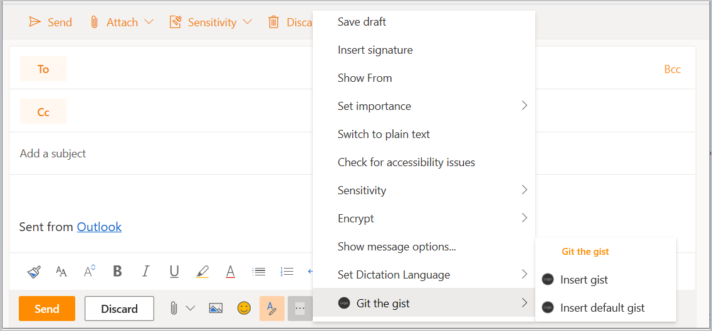

# <a name="tutorial-build-a-message-compose-outlook-add-in"></a><span data-ttu-id="3b1f3-103">教程：生成邮件撰写 Outlook 外接程序</span><span class="sxs-lookup"><span data-stu-id="3b1f3-103">Tutorial: Build a message compose Outlook add-in</span></span>

<span data-ttu-id="3b1f3-104">本教程将教你如何生成一个可用于在邮件撰写模式下将内容插入到邮件正文中的 Outlook 外接程序。</span><span class="sxs-lookup"><span data-stu-id="3b1f3-104">This tutorial teaches you how to build an Outlook add-in that can be used in message compose mode to insert content into the body of a message.</span></span>

<span data-ttu-id="3b1f3-105">在本教程中，你将：</span><span class="sxs-lookup"><span data-stu-id="3b1f3-105">In this tutorial, you will:</span></span>

> [!div class="checklist"]
> * <span data-ttu-id="3b1f3-106">创建 Outlook 外接程序项目</span><span class="sxs-lookup"><span data-stu-id="3b1f3-106">Create an Outlook add-in project</span></span>
> * <span data-ttu-id="3b1f3-107">定义将在“撰写邮件”窗口中呈现的按钮</span><span class="sxs-lookup"><span data-stu-id="3b1f3-107">Define buttons that will render in the compose message window</span></span>
> * <span data-ttu-id="3b1f3-108">实现从用户处收集信息并从外部服务提取数据的首次运行体验</span><span class="sxs-lookup"><span data-stu-id="3b1f3-108">Implement a first-run experience that collects information from the user and fetches data from an external service</span></span>
> * <span data-ttu-id="3b1f3-109">实现可调用函数的无 UI 按钮</span><span class="sxs-lookup"><span data-stu-id="3b1f3-109">Implement a UI-less button that invokes a function</span></span>
> * <span data-ttu-id="3b1f3-110">实现将内容插入到邮件正文中的任务窗格</span><span class="sxs-lookup"><span data-stu-id="3b1f3-110">Implement a task pane that inserts content into the body of a message</span></span>

## <a name="prerequisites"></a><span data-ttu-id="3b1f3-111">先决条件</span><span class="sxs-lookup"><span data-stu-id="3b1f3-111">Prerequisites</span></span>

- <span data-ttu-id="3b1f3-112">[Node.js](https://nodejs.org/)（最新的 [LTS](https://nodejs.org/about/releases) 版本）</span><span class="sxs-lookup"><span data-stu-id="3b1f3-112">[Node.js](https://nodejs.org/) (the latest [LTS](https://nodejs.org/about/releases) version)</span></span>

- <span data-ttu-id="3b1f3-113">最新版本的 [Yeoman](https://github.com/yeoman/yo) 和[适用于 Office 外接程序的 Yeoman 生成器](https://github.com/OfficeDev/generator-office)。若要全局安装这些工具，请从命令提示符处运行以下命令：</span><span class="sxs-lookup"><span data-stu-id="3b1f3-113">The latest version of [Yeoman](https://github.com/yeoman/yo) and the [Yeoman generator for Office Add-ins](https://github.com/OfficeDev/generator-office). To install these tools globally, run the following command via the command prompt:</span></span>

    ```command&nbsp;line
    npm install -g yo generator-office
    ```

    > [!NOTE]
    > <span data-ttu-id="3b1f3-114">即便先前已安装了 Yeoman 生成器，我们还是建议你通过 npm 将包更新为最新版本。</span><span class="sxs-lookup"><span data-stu-id="3b1f3-114">Even if you've previously installed the Yeoman generator, we recommend you update your package to the latest version from npm.</span></span>

- <span data-ttu-id="3b1f3-115">Windows 版 Outlook 2016 或更高版本（关联至 Microsoft 365 帐户）或 Outlook 网页版</span><span class="sxs-lookup"><span data-stu-id="3b1f3-115">Outlook 2016 or later on Windows (connected to a Microsoft 365 account) or Outlook on the web</span></span>

- <span data-ttu-id="3b1f3-116">一个 [GitHub](https://www.github.com) 帐户</span><span class="sxs-lookup"><span data-stu-id="3b1f3-116">A [GitHub](https://www.github.com) account</span></span>

## <a name="setup"></a><span data-ttu-id="3b1f3-117">设置</span><span class="sxs-lookup"><span data-stu-id="3b1f3-117">Setup</span></span>

<span data-ttu-id="3b1f3-118">你将在本教程中创建的外接程序将从用户的 GitHub 帐户读取 [gist](https://gist.github.com)，并将所选 gist 添加到邮件正文中。</span><span class="sxs-lookup"><span data-stu-id="3b1f3-118">The add-in that you'll create in this tutorial will read [gists](https://gist.github.com) from the user's GitHub account and add the selected gist to the body of a message.</span></span> <span data-ttu-id="3b1f3-119">完成以下步骤以创建两个新 gist，你可以使用它们来测试你要生成的外接程序。</span><span class="sxs-lookup"><span data-stu-id="3b1f3-119">Complete the following steps to create two new gists that you can use to test the add-in you're going to build.</span></span>

1. <span data-ttu-id="3b1f3-120">[登录 GitHub](https://github.com/login)。</span><span class="sxs-lookup"><span data-stu-id="3b1f3-120">[Login to GitHub](https://github.com/login).</span></span>

1. <span data-ttu-id="3b1f3-121">[创建一个新 gist](https://gist.github.com)。</span><span class="sxs-lookup"><span data-stu-id="3b1f3-121">[Create a new gist](https://gist.github.com).</span></span>

    - <span data-ttu-id="3b1f3-122">在 **Gist description...** 字段中，输入 **Hello World Markdown**。</span><span class="sxs-lookup"><span data-stu-id="3b1f3-122">In the **Gist description...** field, enter **Hello World Markdown**.</span></span>

    - <span data-ttu-id="3b1f3-123">在 **Filename including extension...** 字段中，输入 **test.md**。</span><span class="sxs-lookup"><span data-stu-id="3b1f3-123">In the **Filename including extension...** field, enter **test.md**.</span></span>

    - <span data-ttu-id="3b1f3-124">将以下 Markdown 添加到多行文本框：</span><span class="sxs-lookup"><span data-stu-id="3b1f3-124">Add the following markdown to the multiline textbox:</span></span>

        ```markdown
        # Hello World

        This is content converted from Markdown!

        Here's a JSON sample:

          ```json
          {
            "foo": "bar"
          }
          ```
        ```

    - <span data-ttu-id="3b1f3-125">选择“**创建公用 gist**”按钮。</span><span class="sxs-lookup"><span data-stu-id="3b1f3-125">Select the **Create public gist** button.</span></span>

1. <span data-ttu-id="3b1f3-126">[创建另一个新 gist](https://gist.github.com)。</span><span class="sxs-lookup"><span data-stu-id="3b1f3-126">[Create another new gist](https://gist.github.com).</span></span>

    - <span data-ttu-id="3b1f3-127">在 **Gist description...** 字段中，输入 **Hello World Html**。</span><span class="sxs-lookup"><span data-stu-id="3b1f3-127">In the **Gist description...** field, enter **Hello World Html**.</span></span>

    - <span data-ttu-id="3b1f3-128">在 **Filename including extension...** 字段中，输入 **test.html**。</span><span class="sxs-lookup"><span data-stu-id="3b1f3-128">In the **Filename including extension...** field, enter **test.html**.</span></span>

    - <span data-ttu-id="3b1f3-129">将以下 Markdown 添加到多行文本框：</span><span class="sxs-lookup"><span data-stu-id="3b1f3-129">Add the following markdown to the multiline textbox:</span></span>

        ```HTML
        <html>
          <head>
            <style>
            h1 {
              font-family: Calibri;
            }
            </style>
          </head>
          <body>
            <h1>Hello World!</h1>
            <p>This is a test</p>
          </body>
        </html>
        ```

    - <span data-ttu-id="3b1f3-130">选择“**创建公用 gist**”按钮。</span><span class="sxs-lookup"><span data-stu-id="3b1f3-130">Select the **Create public gist** button.</span></span>

## <a name="create-an-outlook-add-in-project"></a><span data-ttu-id="3b1f3-131">创建 Outlook 外接程序项目</span><span class="sxs-lookup"><span data-stu-id="3b1f3-131">Create an Outlook add-in project</span></span>

1. [!include[Yeoman generator create project guidance](../includes/yo-office-command-guidance.md)]

    - <span data-ttu-id="3b1f3-132">**选择项目类型** - `Office Add-in Task Pane project`</span><span class="sxs-lookup"><span data-stu-id="3b1f3-132">**Choose a project type** - `Office Add-in Task Pane project`</span></span>

    - <span data-ttu-id="3b1f3-133">**选择脚本类型** - `Javascript`</span><span class="sxs-lookup"><span data-stu-id="3b1f3-133">**Choose a script type** - `Javascript`</span></span>

    - <span data-ttu-id="3b1f3-134">**要如何命名加载项?**</span><span class="sxs-lookup"><span data-stu-id="3b1f3-134">**What do you want to name your add-in?**</span></span> - `Git the gist`

    - <span data-ttu-id="3b1f3-135">**要支持哪一个 Office 客户端应用程序?**</span><span class="sxs-lookup"><span data-stu-id="3b1f3-135">**Which Office client application would you like to support?**</span></span> - `Outlook`

    
    
    <span data-ttu-id="3b1f3-137">完成此向导后，生成器会创建项目，并安装支持的 Node 组件。</span><span class="sxs-lookup"><span data-stu-id="3b1f3-137">After you complete the wizard, the generator will create the project and install supporting Node components.</span></span>

    [!include[Yeoman generator next steps](../includes/yo-office-next-steps.md)]

1. <span data-ttu-id="3b1f3-138">导航到项目的根目录。</span><span class="sxs-lookup"><span data-stu-id="3b1f3-138">Navigate to the root directory of the project.</span></span>

    ```command&nbsp;line
    cd "Git the gist"
    ```

1. <span data-ttu-id="3b1f3-139">此加载项将使用以下库：</span><span class="sxs-lookup"><span data-stu-id="3b1f3-139">This add-in will use the following libraries:</span></span>

    - <span data-ttu-id="3b1f3-140">用于将 Markdown 转换成 HTML 的 [Showdown](https://github.com/showdownjs/showdown) 库</span><span class="sxs-lookup"><span data-stu-id="3b1f3-140">[Showdown](https://github.com/showdownjs/showdown) library to convert Markdown to HTML</span></span>
    - <span data-ttu-id="3b1f3-141">用于生成相关 URL 的 [URI.js](https://github.com/medialize/URI.js) 库。</span><span class="sxs-lookup"><span data-stu-id="3b1f3-141">[URI.js](https://github.com/medialize/URI.js) library to build relative URLs.</span></span>
    - <span data-ttu-id="3b1f3-142">用于简化 DOM 交互的 [jquery](https://jquery.com/) 库。</span><span class="sxs-lookup"><span data-stu-id="3b1f3-142">[jquery](https://jquery.com/) library to simplify DOM interactions.</span></span>

     <span data-ttu-id="3b1f3-143">若要为你的项目安装这些工具，请在项目的根目录中运行以下命令：</span><span class="sxs-lookup"><span data-stu-id="3b1f3-143">To install these tools for your project, run the following command in the root directory of the project:</span></span>

    ```command&nbsp;line
    npm install showdown urijs jquery --save
    ```

### <a name="update-the-manifest"></a><span data-ttu-id="3b1f3-144">更新清单</span><span class="sxs-lookup"><span data-stu-id="3b1f3-144">Update the manifest</span></span>

<span data-ttu-id="3b1f3-145">外接程序的清单控制外接程序在 Outlook 中的显示方式。</span><span class="sxs-lookup"><span data-stu-id="3b1f3-145">The manifest for an add-in controls how it appears in Outlook.</span></span> <span data-ttu-id="3b1f3-146">它定义外接程序在外接程序列表中的显示方式和功能区上显示的按钮，并设置外接程序使用的 HTML 和 JavaScript 文件的 URL。</span><span class="sxs-lookup"><span data-stu-id="3b1f3-146">It defines the way the add-in appears in the add-in list and the buttons that appear on the ribbon, and it sets the URLs for the HTML and JavaScript files used by the add-in.</span></span>

#### <a name="specify-basic-information"></a><span data-ttu-id="3b1f3-147">指定基本信息</span><span class="sxs-lookup"><span data-stu-id="3b1f3-147">Specify basic information</span></span>

<span data-ttu-id="3b1f3-148">请在 **manifest.xml** 文件中进行以下更新，以指定有关该外接程序的一些基本信息：</span><span class="sxs-lookup"><span data-stu-id="3b1f3-148">Make the following updates in the **manifest.xml** file to specify some basic information about the add-in:</span></span>

1. <span data-ttu-id="3b1f3-149">找到 `ProviderName` 元素并将默认值替换为你的公司名称。</span><span class="sxs-lookup"><span data-stu-id="3b1f3-149">Locate the `ProviderName` element and replace the default value with your company name.</span></span>

    ```xml
    <ProviderName>Contoso</ProviderName>
    ```
1. <span data-ttu-id="3b1f3-150">找到 `Description` 元素，将默认值替换为外接程序程序的说明，然后保存文件。</span><span class="sxs-lookup"><span data-stu-id="3b1f3-150">Locate the `Description` element, replace the default value with a description of the add-in, and save the file.</span></span>

    ```xml
    <Description DefaultValue="Allows users to access their GitHub gists."/>
    ```

#### <a name="test-the-generated-add-in"></a><span data-ttu-id="3b1f3-151">测试生成的外接程序</span><span class="sxs-lookup"><span data-stu-id="3b1f3-151">Test the generated add-in</span></span>

<span data-ttu-id="3b1f3-152">在继续之前，让我们测试生成器创建的基本外接程序，以确认项目已正确设置。</span><span class="sxs-lookup"><span data-stu-id="3b1f3-152">Before going any further, let's test the basic add-in that the generator created to confirm that the project is set up correctly.</span></span>

> [!NOTE]
> <span data-ttu-id="3b1f3-153">Office 加载项应使用 HTTPS，而不是 HTTP（即便是在开发时也是如此）。</span><span class="sxs-lookup"><span data-stu-id="3b1f3-153">Office Add-ins should use HTTPS, not HTTP, even when you are developing.</span></span> <span data-ttu-id="3b1f3-154">如果系统在运行以下命令后提示你安装证书，请接受提示以安装 Yeoman 生成器提供的证书。</span><span class="sxs-lookup"><span data-stu-id="3b1f3-154">If you are prompted to install a certificate after you run the following command, accept the prompt to install the certificate that the Yeoman generator provides.</span></span>

1. <span data-ttu-id="3b1f3-155">在项目的根目录中运行以下命令。</span><span class="sxs-lookup"><span data-stu-id="3b1f3-155">Run the following command in the root directory of your project.</span></span> <span data-ttu-id="3b1f3-156">运行此命令时，本地 Web 服务器将启动（如果尚未运行）。</span><span class="sxs-lookup"><span data-stu-id="3b1f3-156">When you run this command, the local web server will start (if it's not already running).</span></span>

    ```command&nbsp;line
    npm start
    ```

    > [!IMPORTANT]
    > <span data-ttu-id="3b1f3-157">如果出现“不支持旁加载”错误，可将其忽略并继续。</span><span class="sxs-lookup"><span data-stu-id="3b1f3-157">If you see a "Sideload is not supported" error, you can ignore it and proceed.</span></span>

1. <span data-ttu-id="3b1f3-158">请按照[旁加载 Outlook 外接程序以供测试](../outlook/sideload-outlook-add-ins-for-testing.md)中的说明，旁加载位于项目根目录中的 **manifest.xml** 文件。</span><span class="sxs-lookup"><span data-stu-id="3b1f3-158">Follow the instructions in [Sideload Outlook add-ins for testing](../outlook/sideload-outlook-add-ins-for-testing.md) to sideload the **manifest.xml** file that's located in the root directory of the project.</span></span>

1. <span data-ttu-id="3b1f3-159">在 Outlook 中，打开现有邮件，然后选择“**显示任务窗格**”按钮。</span><span class="sxs-lookup"><span data-stu-id="3b1f3-159">In Outlook, open an existing message and select the **Show Taskpane** button.</span></span> <span data-ttu-id="3b1f3-160">如果所有内容都已正确设置，则任务窗格将打开并呈现外接程序的欢迎页。</span><span class="sxs-lookup"><span data-stu-id="3b1f3-160">If everything's been set up correctly, the task pane will open and render the add-in's welcome page.</span></span>

    

## <a name="define-buttons"></a><span data-ttu-id="3b1f3-162">定义按钮</span><span class="sxs-lookup"><span data-stu-id="3b1f3-162">Define buttons</span></span>

<span data-ttu-id="3b1f3-163">至此，已经验证基本外接程序可正常运行，你可以对其进行自定义以添加更多功能。</span><span class="sxs-lookup"><span data-stu-id="3b1f3-163">Now that you've verified the base add-in works, you can customize it to add more functionality.</span></span> <span data-ttu-id="3b1f3-164">默认情况下，清单仅定义“读取邮件”窗口的按钮。</span><span class="sxs-lookup"><span data-stu-id="3b1f3-164">By default, the manifest only defines buttons for the read message window.</span></span> <span data-ttu-id="3b1f3-165">让我们更新清单以从“读取邮件”窗口中删除按钮，并为“撰写邮件”窗口定义两个新按钮：</span><span class="sxs-lookup"><span data-stu-id="3b1f3-165">Let's update the manifest to remove the buttons from the read message window and define two new buttons for the compose message window:</span></span>

- <span data-ttu-id="3b1f3-166">**插入 gist**：用于打开任务窗格的按钮</span><span class="sxs-lookup"><span data-stu-id="3b1f3-166">**Insert gist**: a button that opens a task pane</span></span>

- <span data-ttu-id="3b1f3-167">**插入默认 gist**：用于调用函数的按钮</span><span class="sxs-lookup"><span data-stu-id="3b1f3-167">**Insert default gist**: a button that invokes a function</span></span>

### <a name="remove-the-messagereadcommandsurface-extension-point"></a><span data-ttu-id="3b1f3-168">删除 MessageReadCommandSurface 扩展点</span><span class="sxs-lookup"><span data-stu-id="3b1f3-168">Remove the MessageReadCommandSurface extension point</span></span>

<span data-ttu-id="3b1f3-169">打开 **manifest.xml** 文件，并找到具有类型 `MessageReadCommandSurface` 的 `ExtensionPoint` 元素。</span><span class="sxs-lookup"><span data-stu-id="3b1f3-169">Open the **manifest.xml** file and locate the `ExtensionPoint` element with type `MessageReadCommandSurface`.</span></span> <span data-ttu-id="3b1f3-170">删除此 `ExtensionPoint` 元素（包括其结束标记）以从“读取邮件”窗口删除按钮。</span><span class="sxs-lookup"><span data-stu-id="3b1f3-170">Delete this `ExtensionPoint` element (including its closing tag) to remove the buttons from the read message window.</span></span>

### <a name="add-the-messagecomposecommandsurface-extension-point"></a><span data-ttu-id="3b1f3-171">添加 MessageReadCommandSurface 扩展点</span><span class="sxs-lookup"><span data-stu-id="3b1f3-171">Add the MessageComposeCommandSurface extension point</span></span>

<span data-ttu-id="3b1f3-172">在清单中查找显示为 `</DesktopFormFactor>` 的行。</span><span class="sxs-lookup"><span data-stu-id="3b1f3-172">Locate the line in the manifest that reads `</DesktopFormFactor>`.</span></span> <span data-ttu-id="3b1f3-173">紧靠此行前面，插入以下 XML 标记。</span><span class="sxs-lookup"><span data-stu-id="3b1f3-173">Immediately before this line, insert the following XML markup.</span></span> <span data-ttu-id="3b1f3-174">关于此标记，请注意以下几点：</span><span class="sxs-lookup"><span data-stu-id="3b1f3-174">Note the following about this markup:</span></span>

- <span data-ttu-id="3b1f3-175">类型为 `xsi:type="MessageComposeCommandSurface"` 的 `ExtensionPoint` 指示你已将按钮定义为添加到“邮件撰写”窗口。</span><span class="sxs-lookup"><span data-stu-id="3b1f3-175">The `ExtensionPoint` with `xsi:type="MessageComposeCommandSurface"` indicates that you're defining buttons to add to the compose message window.</span></span>

- <span data-ttu-id="3b1f3-176">通过使用类型为 `id="TabDefault"` 的 `OfficeTab` 元素，表明想要将按钮添加到功能区上的默认选项卡。</span><span class="sxs-lookup"><span data-stu-id="3b1f3-176">By using an `OfficeTab` element with `id="TabDefault"`, you're indicating you want to add the buttons to the default tab on the ribbon.</span></span>

- <span data-ttu-id="3b1f3-177">`Group` 元素使用 `groupLabel` 资源设置的标签定义新按钮的分组。</span><span class="sxs-lookup"><span data-stu-id="3b1f3-177">The `Group` element defines the grouping for the new buttons, with a label set by the `groupLabel` resource.</span></span>

- <span data-ttu-id="3b1f3-178">第一个 `Control` 元素包含类型为 `xsi:type="ShowTaskPane"` 的 `Action` 元素，因此此按钮将打开任务窗格。</span><span class="sxs-lookup"><span data-stu-id="3b1f3-178">The first `Control` element contains an `Action` element with `xsi:type="ShowTaskPane"`, so this button opens a task pane.</span></span>

- <span data-ttu-id="3b1f3-179">第二个 `Control` 元素包含类型为 `xsi:type="ExecuteFunction"` 的 `Action` 元素，因此此按钮将调用函数文件中包含的 JavaScript 函数。</span><span class="sxs-lookup"><span data-stu-id="3b1f3-179">The second `Control` element contains an `Action` element with `xsi:type="ExecuteFunction"`, so this button invokes a JavaScript function contained in the function file.</span></span>

```xml
<!-- Message Compose -->
<ExtensionPoint xsi:type="MessageComposeCommandSurface">
  <OfficeTab id="TabDefault">
    <Group id="msgComposeCmdGroup">
      <Label resid="GroupLabel"/>
      <Control xsi:type="Button" id="msgComposeInsertGist">
        <Label resid="TaskpaneButton.Label"/>
        <Supertip>
          <Title resid="TaskpaneButton.Title"/>
          <Description resid="TaskpaneButton.Tooltip"/>
        </Supertip>
        <Icon>
          <bt:Image size="16" resid="Icon.16x16"/>
          <bt:Image size="32" resid="Icon.32x32"/>
          <bt:Image size="80" resid="Icon.80x80"/>
        </Icon>
        <Action xsi:type="ShowTaskpane">
          <SourceLocation resid="Taskpane.Url"/>
        </Action>
      </Control>
      <Control xsi:type="Button" id="msgComposeInsertDefaultGist">
        <Label resid="FunctionButton.Label"/>
        <Supertip>
          <Title resid="FunctionButton.Title"/>
          <Description resid="FunctionButton.Tooltip"/>
        </Supertip>
        <Icon>
          <bt:Image size="16" resid="Icon.16x16"/>
          <bt:Image size="32" resid="Icon.32x32"/>
          <bt:Image size="80" resid="Icon.80x80"/>
        </Icon>
        <Action xsi:type="ExecuteFunction">
          <FunctionName>insertDefaultGist</FunctionName>
        </Action>
      </Control>
    </Group>
  </OfficeTab>
</ExtensionPoint>
```

### <a name="update-resources-in-the-manifest"></a><span data-ttu-id="3b1f3-180">更新清单中的资源</span><span class="sxs-lookup"><span data-stu-id="3b1f3-180">Update resources in the manifest</span></span>

<span data-ttu-id="3b1f3-181">前面的代码引用了需要在清单生效前定义的标签、工具提示和 URL。</span><span class="sxs-lookup"><span data-stu-id="3b1f3-181">The previous code references labels, tooltips, and URLs that you need to define before the manifest will be valid.</span></span> <span data-ttu-id="3b1f3-182">你将在清单的 `Resources` 部分指定此信息。</span><span class="sxs-lookup"><span data-stu-id="3b1f3-182">You'll specify this information in the `Resources` section of the manifest.</span></span>

1. <span data-ttu-id="3b1f3-183">在清单文件中找到 `Resources` 元素并删除整个元素（包括其结束标记）。</span><span class="sxs-lookup"><span data-stu-id="3b1f3-183">Locate the `Resources` element in the manifest file and delete the entire element (including its closing tag).</span></span>

1. <span data-ttu-id="3b1f3-184">在相同的位置，添加以下标记以替换你刚刚删除的 `Resources` 元素：</span><span class="sxs-lookup"><span data-stu-id="3b1f3-184">In that same location, add the following markup to replace the `Resources` element you just removed:</span></span>

    ```xml
    <Resources>
      <bt:Images>
        <bt:Image id="Icon.16x16" DefaultValue="https://localhost:3000/assets/icon-16.png"/>
        <bt:Image id="Icon.32x32" DefaultValue="https://localhost:3000/assets/icon-32.png"/>
        <bt:Image id="Icon.80x80" DefaultValue="https://localhost:3000/assets/icon-80.png"/>
      </bt:Images>
      <bt:Urls>
        <bt:Url id="Commands.Url" DefaultValue="https://localhost:3000/commands.html"/>
        <bt:Url id="Taskpane.Url" DefaultValue="https://localhost:3000/taskpane.html"/>
      </bt:Urls>
      <bt:ShortStrings>
        <bt:String id="GroupLabel" DefaultValue="Git the gist"/>
        <bt:String id="TaskpaneButton.Label" DefaultValue="Insert gist"/>
        <bt:String id="TaskpaneButton.Title" DefaultValue="Insert gist"/>
        <bt:String id="FunctionButton.Label" DefaultValue="Insert default gist"/>
        <bt:String id="FunctionButton.Title" DefaultValue="Insert default gist"/>
      </bt:ShortStrings>
      <bt:LongStrings>
        <bt:String id="TaskpaneButton.Tooltip" DefaultValue="Displays a list of your gists and allows you to insert their contents into the current message."/>
        <bt:String id="FunctionButton.Tooltip" DefaultValue="Inserts the content of the gist you mark as default into the current message."/>
      </bt:LongStrings>
    </Resources>
    ```

1. <span data-ttu-id="3b1f3-185">将更改保存到清单。</span><span class="sxs-lookup"><span data-stu-id="3b1f3-185">Save your changes to the manifest.</span></span>

### <a name="reinstall-the-add-in"></a><span data-ttu-id="3b1f3-186">重新安装外接程序</span><span class="sxs-lookup"><span data-stu-id="3b1f3-186">Reinstall the add-in</span></span>

<span data-ttu-id="3b1f3-187">由于你之前已通过文件安装了此外接程序，因此必需重新安装它才能使清单更改生效。</span><span class="sxs-lookup"><span data-stu-id="3b1f3-187">Since you previously installed the add-in from a file, you must reinstall it in order for the manifest changes to take effect.</span></span>

1. <span data-ttu-id="3b1f3-188">按照[旁加载 Outlook 外接程序以供测试](../outlook/sideload-outlook-add-ins-for-testing.md)中的说明，找到“**我的外接程序**”对话框底部的“**自定义外接程序**”部分。</span><span class="sxs-lookup"><span data-stu-id="3b1f3-188">Follow the instructions in [Sideload Outlook add-ins for testing](../outlook/sideload-outlook-add-ins-for-testing.md) to locate the **Custom add-ins** section at the bottom of the **My add-ins** dialog box.</span></span>

1. <span data-ttu-id="3b1f3-189">选择“**Git the gist**”条目旁边的“**...**”按钮，然后选择“**删除**”。</span><span class="sxs-lookup"><span data-stu-id="3b1f3-189">Select the **...** button next to the **Git the gist** entry and then choose **Remove**.</span></span>

1. <span data-ttu-id="3b1f3-190">关闭“**我的外接程序**”窗口。</span><span class="sxs-lookup"><span data-stu-id="3b1f3-190">Close the **My add-ins** window.</span></span>

1. <span data-ttu-id="3b1f3-191">自定义按钮应从功能区中立即消失。</span><span class="sxs-lookup"><span data-stu-id="3b1f3-191">The custom button should disappear from the ribbon momentarily.</span></span>

1. <span data-ttu-id="3b1f3-192">按照[旁加载 Outlook 外接程序以供测试](../outlook/sideload-outlook-add-ins-for-testing.md)中的说明，使用更新的 **manifest.xml** 文件重新安装外接程序。</span><span class="sxs-lookup"><span data-stu-id="3b1f3-192">Follow the instructions in [Sideload Outlook add-ins for testing](../outlook/sideload-outlook-add-ins-for-testing.md) to reinstall the add-in using the updated **manifest.xml** file.</span></span>

<span data-ttu-id="3b1f3-193">重新安装外接程序后，可以通过在“邮件撰写”窗口中检查“**插入 gist**”和“**插入默认 gist**”命令来验证是否已成功安装。</span><span class="sxs-lookup"><span data-stu-id="3b1f3-193">After you've reinstalled the add-in, you can verify that it installed successfully by checking for the commands **Insert gist** and **Insert default gist** in a compose message window.</span></span> <span data-ttu-id="3b1f3-194">请注意，即使你选择了其中任何一项，系统也不会执行任何操作，因为你尚未完成生成此外接程序的操作。</span><span class="sxs-lookup"><span data-stu-id="3b1f3-194">Note that nothing will happen if you select either of these items, because you haven't yet finished building this add-in.</span></span>

- <span data-ttu-id="3b1f3-195">如果是在 Windows 版 Outlook 2016 或更高版本中运行此外接程序，则应在“邮件撰写”窗口的功能区中看到两个新按钮：“**插入 gist**”和“**插入默认 gist**”。</span><span class="sxs-lookup"><span data-stu-id="3b1f3-195">If you're running this add-in in Outlook 2016 or later on Windows, you should see two new buttons in the ribbon of the compose message window: **Insert gist** and **Insert default gist**.</span></span>

    

- <span data-ttu-id="3b1f3-197">如果在 Outlook 网页版中运行此外接程序，则应该会在“邮件撰写”窗口的底部看到一个新按钮。</span><span class="sxs-lookup"><span data-stu-id="3b1f3-197">If you're running this add-in in Outlook on the web, you should see a new button at the bottom of the compose message window.</span></span> <span data-ttu-id="3b1f3-198">选择该按钮可查看选项“**插入 gist**”和“**插入默认 gist**”。</span><span class="sxs-lookup"><span data-stu-id="3b1f3-198">Select that button to see the options **Insert gist** and **Insert default gist**.</span></span>

    

## <a name="implement-a-first-run-experience"></a><span data-ttu-id="3b1f3-200">实现首次运行体验</span><span class="sxs-lookup"><span data-stu-id="3b1f3-200">Implement a first-run experience</span></span>

<span data-ttu-id="3b1f3-201">此外接程序需要能够从用户的 GitHub 帐户中读取 gist，并确定用户选择哪一个作为默认 gist。</span><span class="sxs-lookup"><span data-stu-id="3b1f3-201">This add-in needs to be able to read gists from the user's GitHub account and identify which one the user has chosen as the default gist.</span></span> <span data-ttu-id="3b1f3-202">为了实现这些目标，外接程序必须提示用户提供其 GitHub 用户名，并从其现有 gist 集合中选择默认 gist。</span><span class="sxs-lookup"><span data-stu-id="3b1f3-202">In order to achieve these goals, the add-in must prompt the user to provide their GitHub username and choose a default gist from their collection of existing gists.</span></span> <span data-ttu-id="3b1f3-203">完成本节中的步骤可实现首次运行体验，该体验将显示用于从用户处收集此信息的对话框。</span><span class="sxs-lookup"><span data-stu-id="3b1f3-203">Complete the steps in this section to implement a first-run experience that will display a dialog to collect this information from the user.</span></span>

### <a name="collect-data-from-the-user"></a><span data-ttu-id="3b1f3-204">从用户处收集数据</span><span class="sxs-lookup"><span data-stu-id="3b1f3-204">Collect data from the user</span></span>

<span data-ttu-id="3b1f3-205">我们先来为对话框本身创建 UI。</span><span class="sxs-lookup"><span data-stu-id="3b1f3-205">Let's start by creating the UI for the dialog itself.</span></span> <span data-ttu-id="3b1f3-206">在 **./src** 文件夹中，创建名为 **settings** 的新子文件夹。</span><span class="sxs-lookup"><span data-stu-id="3b1f3-206">Within the **./src** folder, create a new subfolder named **settings**.</span></span> <span data-ttu-id="3b1f3-207">在 **./src/settings** 文件夹中，创建一个名为 **dialog.html** 的文件，并添加以下标记来定义一个非常基本的表单，其中包含 GitHub 用户名的文本输入和将通过 JavaScript 填充的 gist 的空列表。</span><span class="sxs-lookup"><span data-stu-id="3b1f3-207">In the **./src/settings** folder, create a file named **dialog.html**, and add the following markup to define a very basic form with a text input for a GitHub username and an empty list for gists that'll be populated via JavaScript.</span></span>

```html
<!DOCTYPE html>
<html>

<head>
  <meta charset="UTF-8" />
  <meta http-equiv="X-UA-Compatible" content="IE=Edge" />
  <title>Settings</title>

  <!-- Office JavaScript API -->
  <script type="text/javascript" src="https://appsforoffice.microsoft.com/lib/1.1/hosted/office.js"></script>

  <!-- For more information on Office UI Fabric, visit https://developer.microsoft.com/fabric. -->
  <link rel="stylesheet" href="https://static2.sharepointonline.com/files/fabric/office-ui-fabric-core/9.6.1/css/fabric.min.css"/>

  <!-- Template styles -->
  <link href="dialog.css" rel="stylesheet" type="text/css" />
</head>

<body class="ms-font-l">
  <main>
    <section class="ms-font-m ms-fontColor-neutralPrimary">
      <div class="not-configured-warning ms-MessageBar ms-MessageBar--warning">
        <div class="ms-MessageBar-content">
          <div class="ms-MessageBar-icon">
            <i class="ms-Icon ms-Icon--Info"></i>
          </div>
          <div class="ms-MessageBar-text">
            Oops! It looks like you haven't configured <strong>Git the gist</strong> yet.
            <br/>
            Please configure your GitHub username and select a default gist, then try that action again!
          </div>
        </div>
      </div>
      <div class="ms-font-xxl">Settings</div>
      <div class="ms-Grid">
        <div class="ms-Grid-row">
          <div class="ms-TextField">
            <label class="ms-Label">GitHub Username</label>
            <input class="ms-TextField-field" id="github-user" type="text" value="" placeholder="Please enter your GitHub username">
          </div>
        </div>
        <div class="error-display ms-Grid-row">
          <div class="ms-font-l ms-fontWeight-semibold">An error occurred:</div>
          <pre><code id="error-text"></code></pre>
        </div>
        <div class="gist-list-container ms-Grid-row">
          <div class="list-title ms-font-xl ms-fontWeight-regular">Choose Default Gist</div>
          <form>
            <div id="gist-list">
            </div>
          </form>
        </div>
      </div>
      <div class="ms-Dialog-actions">
        <div class="ms-Dialog-actionsRight">
          <button class="ms-Dialog-action ms-Button ms-Button--primary" id="settings-done" disabled>
            <span class="ms-Button-label">Done</span>
          </button>
        </div>
      </div>
    </section>
  </main>
  <script type="text/javascript" src="../../node_modules/core-js/client/core.js"></script>
  <script type="text/javascript" src="../../node_modules/jquery/dist/jquery.js"></script>
  <script type="text/javascript" src="../helpers/gist-api.js"></script>
  <script type="text/javascript" src="dialog.js"></script>
</body>

</html>
```

<span data-ttu-id="3b1f3-208">接下来，在 **./src/settings** 文件夹中创建一个名为 **dialog.css** 的文件，并添加以下代码以指定 **dialog.html** 使用的样式。</span><span class="sxs-lookup"><span data-stu-id="3b1f3-208">Next, create a file in the **./src/settings** folder named **dialog.css**, and add the following code to specify the styles that are used by **dialog.html**.</span></span>

```CSS
section {
  margin: 10px 20px;
}

.not-configured-warning {
  display: none;
}

.error-display {
  display: none;
}

.gist-list-container {
  margin: 10px -8px;
  display: none;
}

.list-title {
  border-bottom: 1px solid #a6a6a6;
  padding-bottom: 5px;
}

ul {
  margin-top: 10px;
}

.ms-ListItem-secondaryText,
.ms-ListItem-tertiaryText {
  padding-left: 15px;
}
```

<span data-ttu-id="3b1f3-209">现在你已经定义了对话框 UI，可以编写使其实际执行某些操作的代码。</span><span class="sxs-lookup"><span data-stu-id="3b1f3-209">Now that you've defined the dialog UI, you can write the code that makes it actually do something.</span></span> <span data-ttu-id="3b1f3-210">在 **./src/settings** 文件夹中创建一个名为 **dialog.js** 的文件，并添加以下代码。</span><span class="sxs-lookup"><span data-stu-id="3b1f3-210">Create a file in the **./src/settings** folder named **dialog.js** and add the following code.</span></span> <span data-ttu-id="3b1f3-211">请注意，此代码将使用 jQuery 注册事件，并使用 `messageParent` 函数将用户的选择发送回调用方。</span><span class="sxs-lookup"><span data-stu-id="3b1f3-211">Note that this code uses jQuery to register events and uses the `messageParent` function to send the user's choices back to the caller.</span></span>

```js
(function(){
  'use strict';

  // The Office initialize function must be run each time a new page is loaded.
  Office.initialize = function(reason){
    jQuery(document).ready(function(){
      if (window.location.search) {
        // Check if warning should be displayed.
        var warn = getParameterByName('warn');
        if (warn) {
          $('.not-configured-warning').show();
        } else {
          // See if the config values were passed.
          // If so, pre-populate the values.
          var user = getParameterByName('gitHubUserName');
          var gistId = getParameterByName('defaultGistId');

          $('#github-user').val(user);
          loadGists(user, function(success){
            if (success) {
              $('.ms-ListItem').removeClass('is-selected');
              $('input').filter(function() {
                return this.value === gistId;
              }).addClass('is-selected').attr('checked', 'checked');
              $('#settings-done').removeAttr('disabled');
            }
          });
        }
      }

      // When the GitHub username changes,
      // try to load gists.
      $('#github-user').on('change', function(){
        $('#gist-list').empty();
        var ghUser = $('#github-user').val();
        if (ghUser.length > 0) {
          loadGists(ghUser);
        }
      });

      // When the Done button is selected, send the
      // values back to the caller as a serialized
      // object.
      $('#settings-done').on('click', function() {
        var settings = {};

        settings.gitHubUserName = $('#github-user').val();

        var selectedGist = $('.ms-ListItem.is-selected');
        if (selectedGist) {
          settings.defaultGistId = selectedGist.val();

          sendMessage(JSON.stringify(settings));
        }
      });
    });
  };

  // Load gists for the user using the GitHub API
  // and build the list.
  function loadGists(user, callback) {
    getUserGists(user, function(gists, error){
      if (error) {
        $('.gist-list-container').hide();
        $('#error-text').text(JSON.stringify(error, null, 2));
        $('.error-display').show();
        if (callback) callback(false);
      } else {
        $('.error-display').hide();
        buildGistList($('#gist-list'), gists, onGistSelected);
        $('.gist-list-container').show();
        if (callback) callback(true);
      }
    });
  }

  function onGistSelected() {
    $('.ms-ListItem').removeClass('is-selected').removeAttr('checked');
    $(this).children('.ms-ListItem').addClass('is-selected').attr('checked', 'checked');
    $('.not-configured-warning').hide();
    $('#settings-done').removeAttr('disabled');
  }

  function sendMessage(message) {
    Office.context.ui.messageParent(message);
  }

  function getParameterByName(name, url) {
    if (!url) {
      url = window.location.href;
    }
    name = name.replace(/[\[\]]/g, "\\$&");
    var regex = new RegExp("[?&]" + name + "(=([^&#]*)|&|#|$)"),
      results = regex.exec(url);
    if (!results) return null;
    if (!results[2]) return '';
    return decodeURIComponent(results[2].replace(/\+/g, " "));
  }
})();
```

#### <a name="update-webpack-config-settings"></a><span data-ttu-id="3b1f3-212">更新 webpack 配置设置</span><span class="sxs-lookup"><span data-stu-id="3b1f3-212">Update webpack config settings</span></span>

<span data-ttu-id="3b1f3-213">最后，打开项目根目录中的 **webpack.config.js** 文件，并完成以下步骤。</span><span class="sxs-lookup"><span data-stu-id="3b1f3-213">Finally, open the file **webpack.config.js** file in the root directory of the project and complete the following steps.</span></span>

1. <span data-ttu-id="3b1f3-214">在 `config` 对象内找到 `entry` 对象并为 `dialog` 添加新条目。</span><span class="sxs-lookup"><span data-stu-id="3b1f3-214">Locate the `entry` object within the `config` object and add a new entry for `dialog`.</span></span>

    ```js
    dialog: "./src/settings/dialog.js"
    ```

    <span data-ttu-id="3b1f3-215">完成此操作之后，新的 `entry` 对象将与此类似：</span><span class="sxs-lookup"><span data-stu-id="3b1f3-215">After you've done this, the new `entry` object will look like this:</span></span>

    ```js
    entry: {
      polyfill: "@babel/polyfill",
      taskpane: "./src/taskpane/taskpane.js",
      commands: "./src/commands/commands.js",
      dialog: "./src/settings/dialog.js"
    },
    ```
  
2. <span data-ttu-id="3b1f3-216">在 `config` 对象中找到 `plugins` 数组并将这两个新对象添加到该数组末尾。</span><span class="sxs-lookup"><span data-stu-id="3b1f3-216">Locate the `plugins` array within the `config` object and add these two new objects to the end of that array.</span></span>

    ```js
    new HtmlWebpackPlugin({
      filename: "dialog.html",
      template: "./src/settings/dialog.html",
      chunks: ["polyfill", "dialog"]
    }),
    new CopyWebpackPlugin([
      {
        to: "dialog.css",
        from: "./src/settings/dialog.css"
      }
    ])
    ```

    <span data-ttu-id="3b1f3-217">完成此操作之后，新的 `plugins` 数组将与此类似：</span><span class="sxs-lookup"><span data-stu-id="3b1f3-217">After you've done this, the new `plugins` array will look like this:</span></span>

    ```js
    plugins: [
      new CleanWebpackPlugin(),
      new HtmlWebpackPlugin({
        filename: "taskpane.html",
        template: "./src/taskpane/taskpane.html",
        chunks: ['polyfill', 'taskpane']
      }),
      new CopyWebpackPlugin([
      {
        to: "taskpane.css",
        from: "./src/taskpane/taskpane.css"
      }
      ]),
      new HtmlWebpackPlugin({
        filename: "commands.html",
        template: "./src/commands/commands.html",
        chunks: ["polyfill", "commands"]
      }),
      new HtmlWebpackPlugin({
        filename: "dialog.html",
        template: "./src/settings/dialog.html",
        chunks: ['polyfill', 'dialog']
      }),
      new CopyWebpackPlugin([
      {
        to: "dialog.css",
        from: "./src/settings/dialog.css"
      }
      ])
    ],
    ```

3. <span data-ttu-id="3b1f3-218">如果 Web 服务器正在运行，请关闭节点命令窗口。</span><span class="sxs-lookup"><span data-stu-id="3b1f3-218">If the web server is running, close the node command window.</span></span>

4. <span data-ttu-id="3b1f3-219">运行以下命令以重建项目。</span><span class="sxs-lookup"><span data-stu-id="3b1f3-219">Run the following command to rebuild the project.</span></span>

    ```command&nbsp;line
    npm run build
    ```

5. <span data-ttu-id="3b1f3-220">运行以下命令以启动 Web 服务器。</span><span class="sxs-lookup"><span data-stu-id="3b1f3-220">Run the following command to start the web server.</span></span>

    ```command&nbsp;line
    npm start
    ```

    > [!IMPORTANT]
    > <span data-ttu-id="3b1f3-221">如果出现“不支持旁加载”错误，可将其忽略并继续。</span><span class="sxs-lookup"><span data-stu-id="3b1f3-221">If you see a "Sideload is not supported" error, you can ignore it and proceed.</span></span>

### <a name="fetch-data-from-github"></a><span data-ttu-id="3b1f3-222">从 GitHub 提取数据</span><span class="sxs-lookup"><span data-stu-id="3b1f3-222">Fetch data from GitHub</span></span>

<span data-ttu-id="3b1f3-223">你刚刚创建的 **dialog.js** 文件指定外接程序应在 `change` 事件触发时为 GitHub 用户名字段加载 gist。</span><span class="sxs-lookup"><span data-stu-id="3b1f3-223">The **dialog.js** file you just created specifies that the add-in should load gists when the `change` event fires for the GitHub username field.</span></span> <span data-ttu-id="3b1f3-224">若要从 GitHub 检索用户的 gist，需使用 [GitHub Gists API](https://developer.github.com/v3/gists/)。</span><span class="sxs-lookup"><span data-stu-id="3b1f3-224">To retrieve the user's gists from GitHub, you'll use the [GitHub Gists API](https://developer.github.com/v3/gists/).</span></span>

<span data-ttu-id="3b1f3-225">在 **./src** 文件夹中，创建名为 **helpers** 的新子文件夹。</span><span class="sxs-lookup"><span data-stu-id="3b1f3-225">Within the **./src** folder, create a new subfolder named **helpers**.</span></span> <span data-ttu-id="3b1f3-226">在 **./src/helpers** 文件夹中，创建一个名为 **gist-api.js** 的文件，并添加以下代码以从 GitHub 检索用户的 gist，并生成 gist 列表。</span><span class="sxs-lookup"><span data-stu-id="3b1f3-226">In the **./src/helpers** folder, create a file named **gist-api.js**, and add the following code to retrieve the user's gists from GitHub and build the list of gists.</span></span>

```js
function getUserGists(user, callback) {
  var requestUrl = 'https://api.github.com/users/' + user + '/gists';

  $.ajax({
    url: requestUrl,
    dataType: 'json'
  }).done(function(gists){
    callback(gists);
  }).fail(function(error){
    callback(null, error);
  });
}

function buildGistList(parent, gists, clickFunc) {
  gists.forEach(function(gist) {

    var listItem = $('<div/>')
      .appendTo(parent);

    var radioItem = $('<input>')
      .addClass('ms-ListItem')
      .addClass('is-selectable')
      .attr('type', 'radio')
      .attr('name', 'gists')
      .attr('tabindex', 0)
      .val(gist.id)
      .appendTo(listItem);

    var desc = $('<span/>')
      .addClass('ms-ListItem-primaryText')
      .text(gist.description)
      .appendTo(listItem);

    var desc = $('<span/>')
      .addClass('ms-ListItem-secondaryText')
      .text(' - ' + buildFileList(gist.files))
      .appendTo(listItem);

    var updated = new Date(gist.updated_at);

    var desc = $('<span/>')
      .addClass('ms-ListItem-tertiaryText')
      .text(' - Last updated ' + updated.toLocaleString())
      .appendTo(listItem);

    listItem.on('click', clickFunc);
  });  
}

function buildFileList(files) {

  var fileList = '';

  for (var file in files) {
    if (files.hasOwnProperty(file)) {
      if (fileList.length > 0) {
        fileList = fileList + ', ';
      }

      fileList = fileList + files[file].filename + ' (' + files[file].language + ')';
    }
  }

  return fileList;
}
```

> [!NOTE]
> <span data-ttu-id="3b1f3-227">你可能已经注意到，没有按钮可以调用设置对话框。</span><span class="sxs-lookup"><span data-stu-id="3b1f3-227">You may have noticed that there's no button to invoke the settings dialog.</span></span> <span data-ttu-id="3b1f3-228">相反，当用户选择“**插入默认 gist**”按钮或“**插入 gist**”按钮时，外接程序将检查自身是否已完成配置。</span><span class="sxs-lookup"><span data-stu-id="3b1f3-228">Instead, the add-in will check whether it has been configured when the user selects either the **Insert default gist** button or the **Insert gist** button.</span></span> <span data-ttu-id="3b1f3-229">如果尚未配置外接程序，则设置对话框将提示用户先进行配置，然后再继续。</span><span class="sxs-lookup"><span data-stu-id="3b1f3-229">If the add-in has not yet been configured, the settings dialog will prompt the user to configure before proceeding.</span></span>

## <a name="implement-a-ui-less-button"></a><span data-ttu-id="3b1f3-230">实现无 UI 按钮</span><span class="sxs-lookup"><span data-stu-id="3b1f3-230">Implement a UI-less button</span></span>

<span data-ttu-id="3b1f3-231">此外接程序的“**插入默认 gist**”按钮是一个无 UI 按钮，它将调用 JavaScript 函数，而不是像许多外接程序按钮一样打开任务窗格。</span><span class="sxs-lookup"><span data-stu-id="3b1f3-231">This add-in's **Insert default gist** button is a UI-less button that will invoke a JavaScript function, rather than open a task pane like many add-in buttons do.</span></span> <span data-ttu-id="3b1f3-232">当用户选择“**插入默认 gist**”按钮时，相应的 JavaScript 函数将检查是否已配置外接程序。</span><span class="sxs-lookup"><span data-stu-id="3b1f3-232">When the user selects the **Insert default gist** button, the corresponding JavaScript function will check whether the add-in has been configured.</span></span>

- <span data-ttu-id="3b1f3-233">如果已经配置了外接程序，则该函数将加载用户已选择作为默认设置的 gist 的内容，并将其插入到邮件正文中。</span><span class="sxs-lookup"><span data-stu-id="3b1f3-233">If the add-in has already been configured, the function will load the content of the gist that the user has selected as the default and insert it into the body of the message.</span></span>

- <span data-ttu-id="3b1f3-234">如果尚未配置外接程序，则设置对话框将提示用户提供所需信息。</span><span class="sxs-lookup"><span data-stu-id="3b1f3-234">If the add-in hasn't yet been configured, then the settings dialog will prompt the user to provide the required information.</span></span>

### <a name="update-the-function-file-html"></a><span data-ttu-id="3b1f3-235">更新函数文件 (HTML)</span><span class="sxs-lookup"><span data-stu-id="3b1f3-235">Update the function file (HTML)</span></span>

<span data-ttu-id="3b1f3-236">无 UI 按钮调用的函数必须都在对应的外形规格清单的 `FunctionFile` 元素指定的文件中进行定义。</span><span class="sxs-lookup"><span data-stu-id="3b1f3-236">A function that's invoked by a UI-less button must be defined in the file that's specified by the `FunctionFile` element in the manifest for the corresponding form factor.</span></span> <span data-ttu-id="3b1f3-237">此外接程序的清单指定 `https://localhost:3000/commands.html` 作为函数文件。</span><span class="sxs-lookup"><span data-stu-id="3b1f3-237">This add-in's manifest specifies `https://localhost:3000/commands.html` as the function file.</span></span>

<span data-ttu-id="3b1f3-238">打开文件 **./src/commands/commands.html** 并使用以下标记替换全部内容。</span><span class="sxs-lookup"><span data-stu-id="3b1f3-238">Open the file **./src/commands/commands.html** and replace the entire contents with the following markup.</span></span>

```html
<!DOCTYPE html>
<html>

<head>
    <meta charset="UTF-8" />
    <meta http-equiv="X-UA-Compatible" content="IE=Edge" />

    <!-- Office JavaScript API -->
    <script type="text/javascript" src="https://appsforoffice.microsoft.com/lib/1.1/hosted/office.js"></script>

    <script type="text/javascript" src="../node_modules/jquery/dist/jquery.js"></script>
    <script type="text/javascript" src="../node_modules/showdown/dist/showdown.min.js"></script>
    <script type="text/javascript" src="../node_modules/urijs/src/URI.min.js"></script>
    <script type="text/javascript" src="../src/helpers/addin-config.js"></script>
    <script type="text/javascript" src="../src/helpers/gist-api.js"></script>
</head>

<body>
  <!-- NOTE: The body is empty on purpose. Since functions in commands.js are
       invoked via a button, there is no UI to render. -->
</body>

</html>
```

### <a name="update-the-function-file-javascript"></a><span data-ttu-id="3b1f3-239">更新函数文件 (JavaScript)</span><span class="sxs-lookup"><span data-stu-id="3b1f3-239">Update the function file (JavaScript)</span></span>

<span data-ttu-id="3b1f3-240">打开文件 **./src/commands/commands.js** 并使用以下代码替换全部内容。</span><span class="sxs-lookup"><span data-stu-id="3b1f3-240">Open the file **./src/commands/commands.js** and replace the entire contents with the following code.</span></span> <span data-ttu-id="3b1f3-241">请注意，如果 `insertDefaultGist` 函数确定外接程序尚未完成配置，则该函数会将 `?warn=1` 参数添加到对话框 URL。</span><span class="sxs-lookup"><span data-stu-id="3b1f3-241">Note that if the `insertDefaultGist` function determines the add-in has not yet been configured, it adds the `?warn=1` parameter to the dialog URL.</span></span> <span data-ttu-id="3b1f3-242">执行此操作可使设置对话框呈现在.**./settings/dialog.html** 中定义的消息栏，告诉用户他们看到此对话框的原因。</span><span class="sxs-lookup"><span data-stu-id="3b1f3-242">Doing so makes the settings dialog render the message bar that's defined in **./settings/dialog.html**, to tell the user why they're seeing the dialog.</span></span>

```js
var config;
var btnEvent;

// The initialize function must be run each time a new page is loaded.
Office.initialize = function (reason) {
};

// Add any UI-less function here.
function showError(error) {
  Office.context.mailbox.item.notificationMessages.replaceAsync('github-error', {
    type: 'errorMessage',
    message: error
  }, function(result){
  });
}

var settingsDialog;

function insertDefaultGist(event) {

  config = getConfig();

  // Check if the add-in has been configured.
  if (config && config.defaultGistId) {
    // Get the default gist content and insert.
    try {
      getGist(config.defaultGistId, function(gist, error) {
        if (gist) {
          buildBodyContent(gist, function (content, error) {
            if (content) {
              Office.context.mailbox.item.body.setSelectedDataAsync(content,
                {coercionType: Office.CoercionType.Html}, function(result) {
                  event.completed();
              });
            } else {
              showError(error);
              event.completed();
            }
          });
        } else {
          showError(error);
          event.completed();
        }
      });
    } catch (err) {
      showError(err);
      event.completed();
    }

  } else {
    // Save the event object so we can finish up later.
    btnEvent = event;
    // Not configured yet, display settings dialog with
    // warn=1 to display warning.
    var url = new URI('../src/settings/dialog.html?warn=1').absoluteTo(window.location).toString();
    var dialogOptions = { width: 20, height: 40, displayInIframe: true };

    Office.context.ui.displayDialogAsync(url, dialogOptions, function(result) {
      settingsDialog = result.value;
      settingsDialog.addEventHandler(Microsoft.Office.WebExtension.EventType.DialogMessageReceived, receiveMessage);
      settingsDialog.addEventHandler(Microsoft.Office.WebExtension.EventType.DialogEventReceived, dialogClosed);
    });
  }
}

function receiveMessage(message) {
  config = JSON.parse(message.message);
  setConfig(config, function(result) {
    settingsDialog.close();
    settingsDialog = null;
    btnEvent.completed();
    btnEvent = null;
  });
}

function dialogClosed(message) {
  settingsDialog = null;
  btnEvent.completed();
  btnEvent = null;
}

function getGlobal() {
  return (typeof self !== "undefined") ? self :
    (typeof window !== "undefined") ? window :
    (typeof global !== "undefined") ? global :
    undefined;
}

var g = getGlobal();

// The add-in command functions need to be available in global scope.
g.insertDefaultGist = insertDefaultGist;
```

### <a name="create-a-file-to-manage-configuration-settings"></a><span data-ttu-id="3b1f3-243">创建文件以管理配置设置</span><span class="sxs-lookup"><span data-stu-id="3b1f3-243">Create a file to manage configuration settings</span></span>

<span data-ttu-id="3b1f3-244">HTML 函数文件引用一个名为 **addin-config.js** 的文件，该文件尚不存在。</span><span class="sxs-lookup"><span data-stu-id="3b1f3-244">The HTML function file references a file named **addin-config.js**, which doesn't yet exist.</span></span> <span data-ttu-id="3b1f3-245">在 **./src/helpers** 文件夹中创建一个名为 **addin-config.js** 的文件，并添加以下代码。</span><span class="sxs-lookup"><span data-stu-id="3b1f3-245">Create a file named **addin-config.js** in the **./src/helpers** folder and add the following code.</span></span> <span data-ttu-id="3b1f3-246">此代码使用 [RoamingSettings 对象](/javascript/api/outlook/office.RoamingSettings)来获取和设置配置值。</span><span class="sxs-lookup"><span data-stu-id="3b1f3-246">This code uses the [RoamingSettings object](/javascript/api/outlook/office.RoamingSettings) to get and set configuration values.</span></span>

```js
function getConfig() {
  var config = {};

  config.gitHubUserName = Office.context.roamingSettings.get('gitHubUserName');
  config.defaultGistId = Office.context.roamingSettings.get('defaultGistId');

  return config;
}

function setConfig(config, callback) {
  Office.context.roamingSettings.set('gitHubUserName', config.gitHubUserName);
  Office.context.roamingSettings.set('defaultGistId', config.defaultGistId);

  Office.context.roamingSettings.saveAsync(callback);
}
```

### <a name="create-new-functions-to-process-gists"></a><span data-ttu-id="3b1f3-247">创建新函数来处理 gist</span><span class="sxs-lookup"><span data-stu-id="3b1f3-247">Create new functions to process gists</span></span>

<span data-ttu-id="3b1f3-248">接下来，打开 **./src/helpers/gist-api.js** 文件并添加以下函数。</span><span class="sxs-lookup"><span data-stu-id="3b1f3-248">Next, open the **./src/helpers/gist-api.js** file and add the following functions.</span></span> <span data-ttu-id="3b1f3-249">请注意以下事项：</span><span class="sxs-lookup"><span data-stu-id="3b1f3-249">Note the following:</span></span>

- <span data-ttu-id="3b1f3-250">如果 gist 包含 HTML，则外接程序将按原样将 HTML 插入到邮件正文中。</span><span class="sxs-lookup"><span data-stu-id="3b1f3-250">If the gist contains HTML, the add-in will insert the HTML as-is into the body of the message.</span></span>

- <span data-ttu-id="3b1f3-251">如果 gist 包含 Markdown，则外接程序将使用 [Showdown](https://github.com/showdownjs/showdown) 库将 Markdown 转换为 HTML，然后将生成的 HTML 插入到邮件正文中。</span><span class="sxs-lookup"><span data-stu-id="3b1f3-251">If the gist contains Markdown, the add-in will use the [Showdown](https://github.com/showdownjs/showdown) library to convert the Markdown to HTML, and will then insert the resulting HTML into the body of the message.</span></span>

- <span data-ttu-id="3b1f3-252">如果 gist 包含 HTML 或 Markdown 以外的任何内容，则外接程序会将其作为代码片段插入到邮件正文中。</span><span class="sxs-lookup"><span data-stu-id="3b1f3-252">If the gist contains anything other than HTML or Markdown, the add-in will insert it into the body of the message as a code snippet.</span></span>

```js
function getGist(gistId, callback) {
  var requestUrl = 'https://api.github.com/gists/' + gistId;

  $.ajax({
    url: requestUrl,
    dataType: 'json'
  }).done(function(gist){
    callback(gist);
  }).fail(function(error){
    callback(null, error);
  });
}

function buildBodyContent(gist, callback) {
  // Find the first non-truncated file in the gist
  // and use it.
  for (var filename in gist.files) {
    if (gist.files.hasOwnProperty(filename)) {
      var file = gist.files[filename];
      if (!file.truncated) {
        // We have a winner.
        switch (file.language) {
          case 'HTML':
            // Insert as-is.
            callback(file.content);
            break;
          case 'Markdown':
            // Convert Markdown to HTML.
            var converter = new showdown.Converter();
            var html = converter.makeHtml(file.content);
            callback(html);
            break;
          default:
            // Insert contents as a <code> block.
            var codeBlock = '<pre><code>';
            codeBlock = codeBlock + file.content;
            codeBlock = codeBlock + '</code></pre>';
            callback(codeBlock);
        }
        return;
      }
    }
  }
  callback(null, 'No suitable file found in the gist');
}
```

### <a name="test-the-button"></a><span data-ttu-id="3b1f3-253">测试按钮</span><span class="sxs-lookup"><span data-stu-id="3b1f3-253">Test the button</span></span>

<span data-ttu-id="3b1f3-254">请保存所有更改并从命令提示符运行 `npm start`（如果服务器尚未处于运行状态）。</span><span class="sxs-lookup"><span data-stu-id="3b1f3-254">Save all of your changes and run `npm start` from the command prompt, if the server isn't already running.</span></span> <span data-ttu-id="3b1f3-255">然后完成以下步骤以测试“**插入默认 gist**”按钮。</span><span class="sxs-lookup"><span data-stu-id="3b1f3-255">Then complete the following steps to test the **Insert default gist** button.</span></span>

> [!IMPORTANT]
> <span data-ttu-id="3b1f3-256">如果出现“不支持旁加载”错误，可将其忽略并继续。</span><span class="sxs-lookup"><span data-stu-id="3b1f3-256">If you see a "Sideload is not supported" error, you can ignore it and proceed.</span></span>

1. <span data-ttu-id="3b1f3-257">打开 Outlook 并撰写一封新邮件。</span><span class="sxs-lookup"><span data-stu-id="3b1f3-257">Open Outlook and compose a new message.</span></span>

1. <span data-ttu-id="3b1f3-258">在“撰写邮件”窗口中，选择“**插入默认 gist**”。</span><span class="sxs-lookup"><span data-stu-id="3b1f3-258">In the compose message window, select the **Insert default gist** button.</span></span> <span data-ttu-id="3b1f3-259">系统将提示你配置外接程序。</span><span class="sxs-lookup"><span data-stu-id="3b1f3-259">You should be prompted to configure the add-in.</span></span>

    

1. <span data-ttu-id="3b1f3-261">在设置对话框中，输入你的 GitHub 用户名，然后选择“**选项卡**”或单击对话框中的其他位置以调用 `change` 事件，该事件应加载 gist 列表。</span><span class="sxs-lookup"><span data-stu-id="3b1f3-261">In the settings dialog, enter your GitHub username and then either **Tab** or click elsewhere in the dialog to invoke the `change` event, which should load your list of gists.</span></span> <span data-ttu-id="3b1f3-262">选择一个 gist 作为默认设置，然后选择“**完成**”。</span><span class="sxs-lookup"><span data-stu-id="3b1f3-262">Select a gist to be the default, and select **Done**.</span></span>

    

1. <span data-ttu-id="3b1f3-264">重新选择“**插入默认 gist**”按钮。</span><span class="sxs-lookup"><span data-stu-id="3b1f3-264">Select the **Insert default gist** button again.</span></span> <span data-ttu-id="3b1f3-265">此时应看到插入到电子邮件正文中的 gist 的内容。</span><span class="sxs-lookup"><span data-stu-id="3b1f3-265">This time, you should see the contents of the gist inserted into the body of the email.</span></span>

   > [!NOTE]
   > <span data-ttu-id="3b1f3-266">Windows 版 Outlook：若要获取最新设置，可能需要关闭并重新打开“撰写邮件”窗口。</span><span class="sxs-lookup"><span data-stu-id="3b1f3-266">Outlook on Windows: To pick up the latest settings, you may need to close and reopen the compose message window.</span></span>

## <a name="implement-a-task-pane"></a><span data-ttu-id="3b1f3-267">实现任务窗格</span><span class="sxs-lookup"><span data-stu-id="3b1f3-267">Implement a task pane</span></span>

<span data-ttu-id="3b1f3-268">此外接程序的“**插入 gist**”按钮将打开任务窗格并显示用户的 gist。</span><span class="sxs-lookup"><span data-stu-id="3b1f3-268">This add-in's **Insert gist** button will open a task pane and display the user's gists.</span></span> <span data-ttu-id="3b1f3-269">然后，用户可以选择要插入到邮件正文中的其中一个 gist。</span><span class="sxs-lookup"><span data-stu-id="3b1f3-269">The user can then select one of the gists to insert into the body of the message.</span></span> <span data-ttu-id="3b1f3-270">如果用户尚未配置外接程序，系统将提示他们进行配置。</span><span class="sxs-lookup"><span data-stu-id="3b1f3-270">If the user has not yet configured the add-in, they will be prompted to do so.</span></span>

### <a name="specify-the-html-for-the-task-pane"></a><span data-ttu-id="3b1f3-271">为任务窗格创建 HTML</span><span class="sxs-lookup"><span data-stu-id="3b1f3-271">Specify the HTML for the task pane</span></span>

<span data-ttu-id="3b1f3-272">在创建的项目中，任务窗格 HTML 已在文件 **./src/taskpane/taskpane.html** 中指定。</span><span class="sxs-lookup"><span data-stu-id="3b1f3-272">In the project that you've created, the task pane HTML is specified in the file **./src/taskpane/taskpane.html**.</span></span> <span data-ttu-id="3b1f3-273">打开该文件并将全部内容替换为以下标记。</span><span class="sxs-lookup"><span data-stu-id="3b1f3-273">Open that file and replace the entire contents with the following markup.</span></span>

```html
<!DOCTYPE html>
<html>

<head>
    <meta charset="UTF-8" />
    <meta http-equiv="X-UA-Compatible" content="IE=Edge" />
    <meta name="viewport" content="width=device-width, initial-scale=1">
    <title>Contoso Task Pane Add-in</title>

    <!-- Office JavaScript API -->
    <script type="text/javascript" src="https://appsforoffice.microsoft.com/lib/1.1/hosted/office.js"></script>

    <!-- For more information on Office UI Fabric, visit https://developer.microsoft.com/fabric. -->
    <link rel="stylesheet" href="https://static2.sharepointonline.com/files/fabric/office-ui-fabric-core/9.6.1/css/fabric.min.css"/>

    <!-- Template styles -->
    <link href="taskpane.css" rel="stylesheet" type="text/css" />
</head>

<body class="ms-font-l ms-landing-page">
  <main class="ms-landing-page__main">
    <section class="ms-landing-page__content ms-font-m ms-fontColor-neutralPrimary">
      <div id="not-configured" style="display: none;">
        <div class="centered ms-font-xxl ms-u-textAlignCenter">Welcome!</div>
        <div class="ms-font-xl" id="settings-prompt">Please choose the <strong>Settings</strong> icon at the bottom of this window to configure this add-in.</div>
      </div>
      <div id="gist-list-container" style="display: none;">
        <form>
          <div id="gist-list">
          </div>
        </form>
      </div>
      <div id="error-display" style="display: none;" class="ms-u-borderBase ms-fontColor-error ms-font-m ms-bgColor-error ms-borderColor-error">
      </div>
    </section>
    <button class="ms-Button ms-Button--primary" id="insert-button" tabindex=0 disabled>
      <span class="ms-Button-label">Insert</span>
    </button>
  </main>
  <footer class="ms-landing-page__footer ms-bgColor-themePrimary">
    <div class="ms-landing-page__footer--left">
      
      <h1 class="ms-font-xl ms-fontWeight-semilight ms-fontColor-white">Git the gist</h1>
    </div>
    <div id="settings-icon" class="ms-landing-page__footer--right" aria-label="Settings" tabindex=0>
      <i class="ms-Icon enlarge ms-Icon--Settings ms-fontColor-white"></i>
    </div>
  </footer>
  <script type="text/javascript" src="../node_modules/jquery/dist/jquery.js"></script>
  <script type="text/javascript" src="../node_modules/showdown/dist/showdown.min.js"></script>
  <script type="text/javascript" src="../node_modules/urijs/src/URI.min.js"></script>
  <script type="text/javascript" src="../src/helpers/addin-config.js"></script>
  <script type="text/javascript" src="../src/helpers/gist-api.js"></script>
  <script type="text/javascript" src="taskpane.js"></script>
</body>

</html>
```

### <a name="specify-the-css-for-the-task-pane"></a><span data-ttu-id="3b1f3-274">为任务窗格创建 CSS</span><span class="sxs-lookup"><span data-stu-id="3b1f3-274">Specify the CSS for the task pane</span></span>

<span data-ttu-id="3b1f3-275">在创建的项目中，任务窗格 CSS 已在文件 **./src/taskpane/taskpane.css** 中指定。</span><span class="sxs-lookup"><span data-stu-id="3b1f3-275">In the project that you've created, the task pane CSS is specified in the file **./src/taskpane/taskpane.css**.</span></span> <span data-ttu-id="3b1f3-276">打开该文件并将全部内容替换为以下代码。</span><span class="sxs-lookup"><span data-stu-id="3b1f3-276">Open that file and replace the entire contents with the following code.</span></span>

```css
/* Copyright (c) Microsoft. All rights reserved. Licensed under the MIT license. See full license in root of repo. */
html, body {
  width: 100%;
  height: 100%;
  margin: 0;
  padding: 0;
  overflow: auto; }

body {
  position: relative;
  font-size: 16px; }

main {
  height: 100%;
  overflow-y: auto; }

footer {
  width: 100%;
  position: relative;
  bottom: 0;
  margin-top: 10px;}

p, h1, h2, h3, h4, h5, h6 {
  margin: 0;
  padding: 0; }

ul {
  padding: 0; }

#settings-prompt {
  margin: 10px 0;
}

#error-display {
  padding: 10px;
}

#insert-button {
  margin: 0 10px;
}

.clearfix {
  display: block;
  clear: both;
  height: 0; }

.pointerCursor {
  cursor: pointer; }

.invisible {
  visibility: hidden; }

.undisplayed {
  display: none; }

.ms-Icon.enlarge {
  position: relative;
  font-size: 20px;
  top: 4px; }

.ms-ListItem-secondaryText,
.ms-ListItem-tertiaryText {
  padding-left: 15px;
}

.ms-landing-page {
  display: -webkit-flex;
  display: flex;
  -webkit-flex-direction: column;
          flex-direction: column;
  -webkit-flex-wrap: nowrap;
          flex-wrap: nowrap;
  height: 100%; }
  .ms-landing-page__main {
    display: -webkit-flex;
    display: flex;
    -webkit-flex-direction: column;
            flex-direction: column;
    -webkit-flex-wrap: nowrap;
            flex-wrap: nowrap;
    -webkit-flex: 1 1 0;
            flex: 1 1 0;
    height: 100%; }

  .ms-landing-page__content {
    display: -webkit-flex;
    display: flex;
    -webkit-flex-direction: column;
            flex-direction: column;
    -webkit-flex-wrap: nowrap;
            flex-wrap: nowrap;
    height: 100%;
    -webkit-flex: 1 1 0;
            flex: 1 1 0;
    padding: 20px; }
    .ms-landing-page__content h2 {
      margin-bottom: 20px; }
  .ms-landing-page__footer {
    display: -webkit-inline-flex;
    display: inline-flex;
    -webkit-justify-content: center;
            justify-content: center;
    -webkit-align-items: center;
            align-items: center; }
    .ms-landing-page__footer--left {
      transition: background ease 0.1s, color ease 0.1s;
      display: -webkit-inline-flex;
      display: inline-flex;
      -webkit-justify-content: flex-start;
              justify-content: flex-start;
      -webkit-align-items: center;
              align-items: center;
      -webkit-flex: 1 0 0px;
              flex: 1 0 0px;
      padding: 20px; }
      .ms-landing-page__footer--left:active, .ms-landing-page__footer--left:hover {
        background: #005ca4;
        cursor: pointer; }
      .ms-landing-page__footer--left:active {
        background: #005ca4; }
      .ms-landing-page__footer--left--disabled {
        opacity: 0.6;
        pointer-events: none;
        cursor: not-allowed; }
        .ms-landing-page__footer--left--disabled:active, .ms-landing-page__footer--left--disabled:hover {
          background: transparent; }
      .ms-landing-page__footer--left img {
        width: 40px;
        height: 40px; }
      .ms-landing-page__footer--left h1 {
        -webkit-flex: 1 0 0px;
                flex: 1 0 0px;
        margin-left: 15px;
        text-align: left;
        width: auto;
        max-width: auto;
        overflow: hidden;
        white-space: nowrap;
        text-overflow: ellipsis; }
    .ms-landing-page__footer--right {
      transition: background ease 0.1s, color ease 0.1s;
      padding: 29px 20px; }
      .ms-landing-page__footer--right:active, .ms-landing-page__footer--right:hover {
        background: #005ca4;
        cursor: pointer; }
      .ms-landing-page__footer--right:active {
        background: #005ca4; }
      .ms-landing-page__footer--right--disabled {
        opacity: 0.6;
        pointer-events: none;
        cursor: not-allowed; }
        .ms-landing-page__footer--right--disabled:active, .ms-landing-page__footer--right--disabled:hover {
          background: transparent; }
```

### <a name="specify-the-javascript-for-the-task-pane"></a><span data-ttu-id="3b1f3-277">为任务窗格指定 JavaScript</span><span class="sxs-lookup"><span data-stu-id="3b1f3-277">Specify the JavaScript for the task pane</span></span>

<span data-ttu-id="3b1f3-278">在创建的项目中，任务窗格 JavaScript 已在文件 **./src/taskpane/taskpane.js** 中指定。</span><span class="sxs-lookup"><span data-stu-id="3b1f3-278">In the project that you've created, the task pane JavaScript is specified in the file **./src/taskpane/taskpane.js**.</span></span> <span data-ttu-id="3b1f3-279">打开该文件并将全部内容替换为以下代码。</span><span class="sxs-lookup"><span data-stu-id="3b1f3-279">Open that file and replace the entire contents with the following code.</span></span>

```js
(function(){
  'use strict';

  var config;
  var settingsDialog;

  Office.initialize = function(reason){

    jQuery(document).ready(function(){

      config = getConfig();

      // Check if add-in is configured.
      if (config && config.gitHubUserName) {
        // If configured, load the gist list.
        loadGists(config.gitHubUserName);
      } else {
        // Not configured yet.
        $('#not-configured').show();
      }

      // When insert button is selected, build the content
      // and insert into the body.
      $('#insert-button').on('click', function(){
        var gistId = $('.ms-ListItem.is-selected').val();
        getGist(gistId, function(gist, error) {
          if (gist) {
            buildBodyContent(gist, function (content, error) {
              if (content) {
                Office.context.mailbox.item.body.setSelectedDataAsync(content,
                  {coercionType: Office.CoercionType.Html}, function(result) {
                    if (result.status === Office.AsyncResultStatus.Failed) {
                      showError('Could not insert gist: ' + result.error.message);
                    }
                });
              } else {
                showError('Could not create insertable content: ' + error);
              }
            });
          } else {
            showError('Could not retrieve gist: ' + error);
          }
        });
      });

      // When the settings icon is selected, open the settings dialog.
      $('#settings-icon').on('click', function(){
        // Display settings dialog.
        var url = new URI('../src/settings/dialog.html').absoluteTo(window.location).toString();
        if (config) {
          // If the add-in has already been configured, pass the existing values
          // to the dialog.
          url = url + '?gitHubUserName=' + config.gitHubUserName + '&defaultGistId=' + config.defaultGistId;
        }

        var dialogOptions = { width: 20, height: 40, displayInIframe: true };

        Office.context.ui.displayDialogAsync(url, dialogOptions, function(result) {
          settingsDialog = result.value;
          settingsDialog.addEventHandler(Microsoft.Office.WebExtension.EventType.DialogMessageReceived, receiveMessage);
          settingsDialog.addEventHandler(Microsoft.Office.WebExtension.EventType.DialogEventReceived, dialogClosed);
        });
      })
    });
  };

  function loadGists(user) {
    $('#error-display').hide();
    $('#not-configured').hide();
    $('#gist-list-container').show();

    getUserGists(user, function(gists, error) {
      if (error) {

      } else {
        $('#gist-list').empty();
        buildGistList($('#gist-list'), gists, onGistSelected);
      }
    });
  }

  function onGistSelected() {
    $('.ms-ListItem').removeClass('is-selected').removeAttr('checked');
    $(this).children('.ms-ListItem').addClass('is-selected').attr('checked', 'checked');
    $('#insert-button').removeAttr('disabled');
  }

  function showError(error) {
    $('#not-configured').hide();
    $('#gist-list-container').hide();
    $('#error-display').text(error);
    $('#error-display').show();
  }

  function receiveMessage(message) {
    config = JSON.parse(message.message);
    setConfig(config, function(result) {
      settingsDialog.close();
      settingsDialog = null;
      loadGists(config.gitHubUserName);
    });
  }

  function dialogClosed(message) {
    settingsDialog = null;
  }
})();
```

### <a name="test-the-button"></a><span data-ttu-id="3b1f3-280">测试按钮</span><span class="sxs-lookup"><span data-stu-id="3b1f3-280">Test the button</span></span>

<span data-ttu-id="3b1f3-281">请保存所有更改并从命令提示符运行 `npm start`（如果服务器尚未处于运行状态）。</span><span class="sxs-lookup"><span data-stu-id="3b1f3-281">Save all of your changes and run `npm start` from the command prompt, if the server isn't already running.</span></span> <span data-ttu-id="3b1f3-282">然后完成以下步骤以测试“**插入 gist**”按钮。</span><span class="sxs-lookup"><span data-stu-id="3b1f3-282">Then complete the following steps to test the **Insert gist** button.</span></span>

> [!IMPORTANT]
> <span data-ttu-id="3b1f3-283">如果出现“不支持旁加载”错误，可将其忽略并继续。</span><span class="sxs-lookup"><span data-stu-id="3b1f3-283">If you see a "Sideload is not supported" error, you can ignore it and proceed.</span></span>

1. <span data-ttu-id="3b1f3-284">打开 Outlook 并撰写一封新邮件。</span><span class="sxs-lookup"><span data-stu-id="3b1f3-284">Open Outlook and compose a new message.</span></span>

1. <span data-ttu-id="3b1f3-285">在“撰写邮件”窗口中，选择“**插入 gist**”按钮。</span><span class="sxs-lookup"><span data-stu-id="3b1f3-285">In the compose message window, select the **Insert gist** button.</span></span> <span data-ttu-id="3b1f3-286">你应该看到，撰写表单的右侧将打开一个任务窗格。</span><span class="sxs-lookup"><span data-stu-id="3b1f3-286">You should see a task pane open to the right of the compose form.</span></span>

1. <span data-ttu-id="3b1f3-287">在任务窗格中，选择 **Hello World Html** gist 并选择“**插入**”以将该 gist 插入到邮件正文中。</span><span class="sxs-lookup"><span data-stu-id="3b1f3-287">In the task pane, select the **Hello World Html** gist and select **Insert** to insert that gist into the body of the message.</span></span>


## <a name="next-steps"></a><span data-ttu-id="3b1f3-289">后续步骤</span><span class="sxs-lookup"><span data-stu-id="3b1f3-289">Next steps</span></span>

<span data-ttu-id="3b1f3-290">在本教程中，你创建了一个可以用于在邮件撰写模式下将内容插入到邮件正文中的 Outlook 外接程序。</span><span class="sxs-lookup"><span data-stu-id="3b1f3-290">In this tutorial, you've created an Outlook add-in that can be used in message compose mode to insert content into the body of a message.</span></span> <span data-ttu-id="3b1f3-291">若要了解有关开发 Outlook 外接程序的详细信息，请继续阅读以下文章：</span><span class="sxs-lookup"><span data-stu-id="3b1f3-291">To learn more about developing Outlook add-ins, continue to the following article:</span></span>

> [!div class="nextstepaction"]
> [<span data-ttu-id="3b1f3-292">Outlook 外接程序 API</span><span class="sxs-lookup"><span data-stu-id="3b1f3-292">Outlook add-in APIs</span></span>](../outlook/apis.md)
