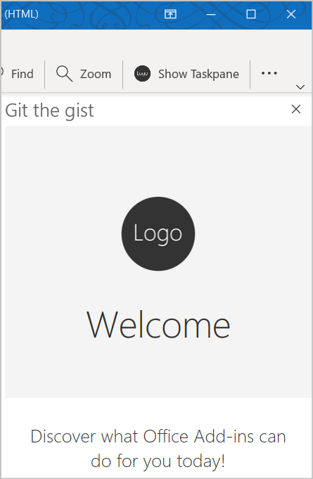
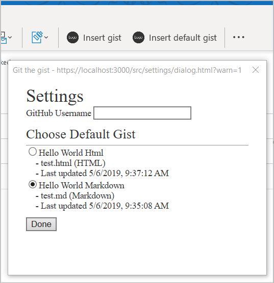

# <a name="tutorial-build-a-message-compose-outlook-add-in"></a>教程：生成邮件撰写 Outlook 外接程序

本教程将教你如何生成一个可用于在邮件撰写模式下将内容插入到邮件正文中的 Outlook 外接程序。

在本教程中，你将：

> [!div class="checklist"]
> * 创建 Outlook 外接程序项目
> * 定义将在“撰写邮件”窗口中呈现的按钮
> * 实现从用户处收集信息并从外部服务提取数据的首次运行体验
> * 实现可调用函数的无 UI 按钮
> * 实现将内容插入到邮件正文中的任务窗格

## <a name="prerequisites"></a>先决条件

- [Node.js](https://nodejs.org/)（最新的 [LTS](https://nodejs.org/about/releases) 版本）

- 最新版本的 [Yeoman](https://github.com/yeoman/yo) 和[适用于 Office 外接程序的 Yeoman 生成器](https://github.com/OfficeDev/generator-office)。若要全局安装这些工具，请从命令提示符处运行以下命令：

    ```command&nbsp;line
    npm install -g yo generator-office
    ```

    > [!NOTE]
    > 即便先前已安装了 Yeoman 生成器，我们还是建议你通过 npm 将包更新为最新版本。

- Windows 版 Outlook 2016 或更高版本（关联至 Microsoft 365 帐户）或 Outlook 网页版

- 一个 [GitHub](https://www.github.com) 帐户

## <a name="setup"></a>设置

你将在本教程中创建的外接程序将从用户的 GitHub 帐户读取 [gist](https://gist.github.com)，并将所选 gist 添加到邮件正文中。 完成以下步骤以创建两个新 gist，你可以使用它们来测试你要生成的外接程序。

1. [登录 GitHub](https://github.com/login)。

1. [创建一个新 gist](https://gist.github.com)。

    - 在 **Gist description...** 字段中，输入 **Hello World Markdown**。

    - 在 **Filename including extension...** 字段中，输入 **test.md**。

    - 将以下 Markdown 添加到多行文本框：

        ```markdown
        # Hello World

        This is content converted from Markdown!

        Here's a JSON sample:

          ```json
          {
            "foo": "bar"
          }
          ```
        ```

    - 选择“**创建公用 gist**”按钮。

1. [创建另一个新 gist](https://gist.github.com)。

    - 在 **Gist description...** 字段中，输入 **Hello World Html**。

    - 在 **Filename including extension...** 字段中，输入 **test.html**。

    - 将以下 Markdown 添加到多行文本框：

        ```HTML
        <html>
          <head>
            <style>
            h1 {
              font-family: Calibri;
            }
            </style>
          </head>
          <body>
            <h1>Hello World!</h1>
            <p>This is a test</p>
          </body>
        </html>
        ```

    - 选择“**创建公用 gist**”按钮。

## <a name="create-an-outlook-add-in-project"></a>创建 Outlook 外接程序项目

1. [!include[Yeoman generator create project guidance](../includes/yo-office-command-guidance.md)]

    - **选择项目类型** - `Office Add-in Task Pane project`

    - **选择脚本类型** - `Javascript`

    - **要如何命名加载项?** - `Git the gist`

    - **要支持哪一个 Office 客户端应用程序?** - `Outlook`

    
    
    完成此向导后，生成器会创建项目，并安装支持的 Node 组件。

    [!include[Yeoman generator next steps](../includes/yo-office-next-steps.md)]

1. 导航到项目的根目录。

    ```command&nbsp;line
    cd "Git the gist"
    ```

1. 此加载项将使用以下库：

    - 用于将 Markdown 转换成 HTML 的 [Showdown](https://github.com/showdownjs/showdown) 库
    - 用于生成相关 URL 的 [URI.js](https://github.com/medialize/URI.js) 库。
    - 用于简化 DOM 交互的 [jquery](https://jquery.com/) 库。

     若要为你的项目安装这些工具，请在项目的根目录中运行以下命令：

    ```command&nbsp;line
    npm install showdown urijs jquery --save
    ```

### <a name="update-the-manifest"></a>更新清单

外接程序的清单控制外接程序在 Outlook 中的显示方式。 它定义外接程序在外接程序列表中的显示方式和功能区上显示的按钮，并设置外接程序使用的 HTML 和 JavaScript 文件的 URL。

#### <a name="specify-basic-information"></a>指定基本信息

请在 **manifest.xml** 文件中进行以下更新，以指定有关该外接程序的一些基本信息：

1. 找到 `ProviderName` 元素并将默认值替换为你的公司名称。

    ```xml
    <ProviderName>Contoso</ProviderName>
    ```
1. 找到 `Description` 元素，将默认值替换为外接程序程序的说明，然后保存文件。

    ```xml
    <Description DefaultValue="Allows users to access their GitHub gists."/>
    ```

#### <a name="test-the-generated-add-in"></a>测试生成的外接程序

在继续之前，让我们测试生成器创建的基本外接程序，以确认项目已正确设置。

> [!NOTE]
> Office 加载项应使用 HTTPS，而不是 HTTP（即便是在开发时也是如此）。 如果系统在运行以下命令后提示你安装证书，请接受提示以安装 Yeoman 生成器提供的证书。

1. 在项目的根目录中运行以下命令。 运行此命令时，本地 Web 服务器将启动（如果尚未运行）。

    ```command&nbsp;line
    npm start
    ```

1. 请按照[旁加载 Outlook 外接程序以供测试](../outlook/sideload-outlook-add-ins-for-testing.md)中的说明，旁加载位于项目根目录中的 **manifest.xml** 文件。

1. 在 Outlook 中，打开现有邮件，然后选择“**显示任务窗格**”按钮。 如果所有内容都已正确设置，则任务窗格将打开并呈现外接程序的欢迎页。

    

## <a name="define-buttons"></a>定义按钮

至此，已经验证基本外接程序可正常运行，你可以对其进行自定义以添加更多功能。 默认情况下，清单仅定义“读取邮件”窗口的按钮。 让我们更新清单以从“读取邮件”窗口中删除按钮，并为“撰写邮件”窗口定义两个新按钮：

- **插入 gist**：用于打开任务窗格的按钮

- **插入默认 gist**：用于调用函数的按钮

### <a name="remove-the-messagereadcommandsurface-extension-point"></a>删除 MessageReadCommandSurface 扩展点

打开 **manifest.xml** 文件，并找到具有类型 `MessageReadCommandSurface` 的 `ExtensionPoint` 元素。 删除此 `ExtensionPoint` 元素（包括其结束标记）以从“读取邮件”窗口删除按钮。

### <a name="add-the-messagecomposecommandsurface-extension-point"></a>添加 MessageReadCommandSurface 扩展点

在清单中查找显示为 `</DesktopFormFactor>` 的行。 紧靠此行前面，插入以下 XML 标记。 关于此标记，请注意以下几点：

- 类型为 `xsi:type="MessageComposeCommandSurface"` 的 `ExtensionPoint` 指示你已将按钮定义为添加到“邮件撰写”窗口。

- 通过使用类型为 `id="TabDefault"` 的 `OfficeTab` 元素，表明想要将按钮添加到功能区上的默认选项卡。

- `Group` 元素使用 `groupLabel` 资源设置的标签定义新按钮的分组。

- 第一个 `Control` 元素包含类型为 `xsi:type="ShowTaskPane"` 的 `Action` 元素，因此此按钮将打开任务窗格。

- 第二个 `Control` 元素包含类型为 `xsi:type="ExecuteFunction"` 的 `Action` 元素，因此此按钮将调用函数文件中包含的 JavaScript 函数。

```xml
<!-- Message Compose -->
<ExtensionPoint xsi:type="MessageComposeCommandSurface">
  <OfficeTab id="TabDefault">
    <Group id="msgComposeCmdGroup">
      <Label resid="GroupLabel"/>
      <Control xsi:type="Button" id="msgComposeInsertGist">
        <Label resid="TaskpaneButton.Label"/>
        <Supertip>
          <Title resid="TaskpaneButton.Title"/>
          <Description resid="TaskpaneButton.Tooltip"/>
        </Supertip>
        <Icon>
          <bt:Image size="16" resid="Icon.16x16"/>
          <bt:Image size="32" resid="Icon.32x32"/>
          <bt:Image size="80" resid="Icon.80x80"/>
        </Icon>
        <Action xsi:type="ShowTaskpane">
          <SourceLocation resid="Taskpane.Url"/>
        </Action>
      </Control>
      <Control xsi:type="Button" id="msgComposeInsertDefaultGist">
        <Label resid="FunctionButton.Label"/>
        <Supertip>
          <Title resid="FunctionButton.Title"/>
          <Description resid="FunctionButton.Tooltip"/>
        </Supertip>
        <Icon>
          <bt:Image size="16" resid="Icon.16x16"/>
          <bt:Image size="32" resid="Icon.32x32"/>
          <bt:Image size="80" resid="Icon.80x80"/>
        </Icon>
        <Action xsi:type="ExecuteFunction">
          <FunctionName>insertDefaultGist</FunctionName>
        </Action>
      </Control>
    </Group>
  </OfficeTab>
</ExtensionPoint>
```

### <a name="update-resources-in-the-manifest"></a>更新清单中的资源

前面的代码引用了需要在清单生效前定义的标签、工具提示和 URL。 你将在清单的 `Resources` 部分指定此信息。

1. 在清单文件中找到 `Resources` 元素并删除整个元素（包括其结束标记）。

1. 在相同的位置，添加以下标记以替换你刚刚删除的 `Resources` 元素：

    ```xml
    <Resources>
      <bt:Images>
        <bt:Image id="Icon.16x16" DefaultValue="https://localhost:3000/assets/icon-16.png"/>
        <bt:Image id="Icon.32x32" DefaultValue="https://localhost:3000/assets/icon-32.png"/>
        <bt:Image id="Icon.80x80" DefaultValue="https://localhost:3000/assets/icon-80.png"/>
      </bt:Images>
      <bt:Urls>
        <bt:Url id="Commands.Url" DefaultValue="https://localhost:3000/commands.html"/>
        <bt:Url id="Taskpane.Url" DefaultValue="https://localhost:3000/taskpane.html"/>
      </bt:Urls>
      <bt:ShortStrings>
        <bt:String id="GroupLabel" DefaultValue="Git the gist"/>
        <bt:String id="TaskpaneButton.Label" DefaultValue="Insert gist"/>
        <bt:String id="TaskpaneButton.Title" DefaultValue="Insert gist"/>
        <bt:String id="FunctionButton.Label" DefaultValue="Insert default gist"/>
        <bt:String id="FunctionButton.Title" DefaultValue="Insert default gist"/>
      </bt:ShortStrings>
      <bt:LongStrings>
        <bt:String id="TaskpaneButton.Tooltip" DefaultValue="Displays a list of your gists and allows you to insert their contents into the current message."/>
        <bt:String id="FunctionButton.Tooltip" DefaultValue="Inserts the content of the gist you mark as default into the current message."/>
      </bt:LongStrings>
    </Resources>
    ```

1. 将更改保存到清单。

### <a name="reinstall-the-add-in"></a>重新安装外接程序

由于你之前已通过文件安装了此外接程序，因此必需重新安装它才能使清单更改生效。

1. 按照[旁加载 Outlook 外接程序以供测试](../outlook/sideload-outlook-add-ins-for-testing.md)中的说明，找到“**我的外接程序**”对话框底部的“**自定义外接程序**”部分。

1. 选择“**Git the gist**”条目旁边的“**...**”按钮，然后选择“**删除**”。

1. 关闭“**我的外接程序**”窗口。

1. 自定义按钮应从功能区中立即消失。

1. 按照[旁加载 Outlook 外接程序以供测试](../outlook/sideload-outlook-add-ins-for-testing.md)中的说明，使用更新的 **manifest.xml** 文件重新安装外接程序。

重新安装外接程序后，可以通过在“邮件撰写”窗口中检查“**插入 gist**”和“**插入默认 gist**”命令来验证是否已成功安装。 请注意，即使你选择了其中任何一项，系统也不会执行任何操作，因为你尚未完成生成此外接程序的操作。

- 如果是在 Windows 版 Outlook 2016 或更高版本中运行此外接程序，则应在“邮件撰写”窗口的功能区中看到两个新按钮：“**插入 gist**”和“**插入默认 gist**”。

    

- 如果在 Outlook 网页版中运行此外接程序，则应该会在“邮件撰写”窗口的底部看到一个新按钮。 选择该按钮可查看选项“**插入 gist**”和“**插入默认 gist**”。

    

## <a name="implement-a-first-run-experience"></a>实现首次运行体验

此外接程序需要能够从用户的 GitHub 帐户中读取 gist，并确定用户选择哪一个作为默认 gist。 为了实现这些目标，外接程序必须提示用户提供其 GitHub 用户名，并从其现有 gist 集合中选择默认 gist。 完成本节中的步骤可实现首次运行体验，该体验将显示用于从用户处收集此信息的对话框。

### <a name="collect-data-from-the-user"></a>从用户处收集数据

我们先来为对话框本身创建 UI。 在 **./src** 文件夹中，创建名为 **settings** 的新子文件夹。 在 **./src/settings** 文件夹中，创建一个名为 **dialog.html** 的文件，并添加以下标记来定义一个非常基本的表单，其中包含 GitHub 用户名的文本输入和将通过 JavaScript 填充的 gist 的空列表。

```html
<!DOCTYPE html>
<html>

<head>
  <meta charset="UTF-8" />
  <meta http-equiv="X-UA-Compatible" content="IE=Edge" />
  <title>Settings</title>

  <!-- Office JavaScript API -->
  <script type="text/javascript" src="https://appsforoffice.microsoft.com/lib/1.1/hosted/office.js"></script>

  <!-- For more information on Office UI Fabric, visit https://developer.microsoft.com/fabric. -->
  <link rel="stylesheet" href="https://static2.sharepointonline.com/files/fabric/office-ui-fabric-core/9.6.1/css/fabric.min.css"/>

  <!-- Template styles -->
  <link href="dialog.css" rel="stylesheet" type="text/css" />
</head>

<body class="ms-font-l">
  <main>
    <section class="ms-font-m ms-fontColor-neutralPrimary">
      <div class="not-configured-warning ms-MessageBar ms-MessageBar--warning">
        <div class="ms-MessageBar-content">
          <div class="ms-MessageBar-icon">
            <i class="ms-Icon ms-Icon--Info"></i>
          </div>
          <div class="ms-MessageBar-text">
            Oops! It looks like you haven't configured <strong>Git the gist</strong> yet.
            <br/>
            Please configure your GitHub username and select a default gist, then try that action again!
          </div>
        </div>
      </div>
      <div class="ms-font-xxl">Settings</div>
      <div class="ms-Grid">
        <div class="ms-Grid-row">
          <div class="ms-TextField">
            <label class="ms-Label">GitHub Username</label>
            <input class="ms-TextField-field" id="github-user" type="text" value="" placeholder="Please enter your GitHub username">
          </div>
        </div>
        <div class="error-display ms-Grid-row">
          <div class="ms-font-l ms-fontWeight-semibold">An error occurred:</div>
          <pre><code id="error-text"></code></pre>
        </div>
        <div class="gist-list-container ms-Grid-row">
          <div class="list-title ms-font-xl ms-fontWeight-regular">Choose Default Gist</div>
          <form>
            <div id="gist-list">
            </div>
          </form>
        </div>
      </div>
      <div class="ms-Dialog-actions">
        <div class="ms-Dialog-actionsRight">
          <button class="ms-Dialog-action ms-Button ms-Button--primary" id="settings-done" disabled>
            <span class="ms-Button-label">Done</span>
          </button>
        </div>
      </div>
    </section>
  </main>
  <script type="text/javascript" src="../../node_modules/core-js/client/core.js"></script>
  <script type="text/javascript" src="../../node_modules/jquery/dist/jquery.js"></script>
  <script type="text/javascript" src="../helpers/gist-api.js"></script>
  <script type="text/javascript" src="dialog.js"></script>
</body>

</html>
```

接下来，在 **./src/settings** 文件夹中创建一个名为 **dialog.css** 的文件，并添加以下代码以指定 **dialog.html** 使用的样式。

```CSS
section {
  margin: 10px 20px;
}

.not-configured-warning {
  display: none;
}

.error-display {
  display: none;
}

.gist-list-container {
  margin: 10px -8px;
  display: none;
}

.list-title {
  border-bottom: 1px solid #a6a6a6;
  padding-bottom: 5px;
}

ul {
  margin-top: 10px;
}

.ms-ListItem-secondaryText,
.ms-ListItem-tertiaryText {
  padding-left: 15px;
}
```

现在你已经定义了对话框 UI，可以编写使其实际执行某些操作的代码。 在 **./src/settings** 文件夹中创建一个名为 **dialog.js** 的文件，并添加以下代码。 请注意，此代码将使用 jQuery 注册事件，并使用 `messageParent` 函数将用户的选择发送回调用方。

```js
(function(){
  'use strict';

  // The Office initialize function must be run each time a new page is loaded.
  Office.initialize = function(reason){
    jQuery(document).ready(function(){
      if (window.location.search) {
        // Check if warning should be displayed.
        var warn = getParameterByName('warn');
        if (warn) {
          $('.not-configured-warning').show();
        } else {
          // See if the config values were passed.
          // If so, pre-populate the values.
          var user = getParameterByName('gitHubUserName');
          var gistId = getParameterByName('defaultGistId');

          $('#github-user').val(user);
          loadGists(user, function(success){
            if (success) {
              $('.ms-ListItem').removeClass('is-selected');
              $('input').filter(function() {
                return this.value === gistId;
              }).addClass('is-selected').attr('checked', 'checked');
              $('#settings-done').removeAttr('disabled');
            }
          });
        }
      }

      // When the GitHub username changes,
      // try to load gists.
      $('#github-user').on('change', function(){
        $('#gist-list').empty();
        var ghUser = $('#github-user').val();
        if (ghUser.length > 0) {
          loadGists(ghUser);
        }
      });

      // When the Done button is selected, send the
      // values back to the caller as a serialized
      // object.
      $('#settings-done').on('click', function() {
        var settings = {};

        settings.gitHubUserName = $('#github-user').val();

        var selectedGist = $('.ms-ListItem.is-selected');
        if (selectedGist) {
          settings.defaultGistId = selectedGist.val();

          sendMessage(JSON.stringify(settings));
        }
      });
    });
  };

  // Load gists for the user using the GitHub API
  // and build the list.
  function loadGists(user, callback) {
    getUserGists(user, function(gists, error){
      if (error) {
        $('.gist-list-container').hide();
        $('#error-text').text(JSON.stringify(error, null, 2));
        $('.error-display').show();
        if (callback) callback(false);
      } else {
        $('.error-display').hide();
        buildGistList($('#gist-list'), gists, onGistSelected);
        $('.gist-list-container').show();
        if (callback) callback(true);
      }
    });
  }

  function onGistSelected() {
    $('.ms-ListItem').removeClass('is-selected').removeAttr('checked');
    $(this).children('.ms-ListItem').addClass('is-selected').attr('checked', 'checked');
    $('.not-configured-warning').hide();
    $('#settings-done').removeAttr('disabled');
  }

  function sendMessage(message) {
    Office.context.ui.messageParent(message);
  }

  function getParameterByName(name, url) {
    if (!url) {
      url = window.location.href;
    }
    name = name.replace(/[\[\]]/g, "\\$&");
    var regex = new RegExp("[?&]" + name + "(=([^&#]*)|&|#|$)"),
      results = regex.exec(url);
    if (!results) return null;
    if (!results[2]) return '';
    return decodeURIComponent(results[2].replace(/\+/g, " "));
  }
})();
```

#### <a name="update-webpack-config-settings"></a>更新 webpack 配置设置

最后，打开项目根目录中的 **webpack.config.js** 文件，并完成以下步骤。

1. 在 `config` 对象内找到 `entry` 对象并为 `dialog` 添加新条目。

    ```js
    dialog: "./src/settings/dialog.js"
    ```

    完成此操作之后，新的 `entry` 对象将与此类似：

    ```js
    entry: {
      polyfill: "@babel/polyfill",
      taskpane: "./src/taskpane/taskpane.js",
      commands: "./src/commands/commands.js",
      dialog: "./src/settings/dialog.js"
    },
    ```
  
2. 在 `config` 对象中找到 `plugins` 数组并将这两个新对象添加到该数组末尾。

    ```js
    new HtmlWebpackPlugin({
      filename: "dialog.html",
      template: "./src/settings/dialog.html",
      chunks: ["polyfill", "dialog"]
    }),
    new CopyWebpackPlugin([
      {
        to: "dialog.css",
        from: "./src/settings/dialog.css"
      }
    ])
    ```

    完成此操作之后，新的 `plugins` 数组将与此类似：

    ```js
    plugins: [
      new CleanWebpackPlugin(),
      new HtmlWebpackPlugin({
        filename: "taskpane.html",
        template: "./src/taskpane/taskpane.html",
        chunks: ['polyfill', 'taskpane']
      }),
      new CopyWebpackPlugin([
      {
        to: "taskpane.css",
        from: "./src/taskpane/taskpane.css"
      }
      ]),
      new HtmlWebpackPlugin({
        filename: "commands.html",
        template: "./src/commands/commands.html",
        chunks: ["polyfill", "commands"]
      }),
      new HtmlWebpackPlugin({
        filename: "dialog.html",
        template: "./src/settings/dialog.html",
        chunks: ['polyfill', 'dialog']
      }),
      new CopyWebpackPlugin([
      {
        to: "dialog.css",
        from: "./src/settings/dialog.css"
      }
      ])
    ],
    ```

3. 如果 Web 服务器正在运行，请关闭节点命令窗口。

4. 运行以下命令以重建项目。

    ```command&nbsp;line
    npm run build
    ```

5. 运行以下命令以启动 Web 服务器。

    ```command&nbsp;line
    npm run dev-server
    ```

### <a name="fetch-data-from-github"></a>从 GitHub 提取数据

你刚刚创建的 **dialog.js** 文件指定外接程序应在 `change` 事件触发时为 GitHub 用户名字段加载 gist。 若要从 GitHub 检索用户的 gist，需使用 [GitHub Gists API](https://developer.github.com/v3/gists/)。

在 **./src** 文件夹中，创建名为 **helpers** 的新子文件夹。 在 **./src/helpers** 文件夹中，创建一个名为 **gist-api.js** 的文件，并添加以下代码以从 GitHub 检索用户的 gist，并生成 gist 列表。

```js
function getUserGists(user, callback) {
  var requestUrl = 'https://api.github.com/users/' + user + '/gists';

  $.ajax({
    url: requestUrl,
    dataType: 'json'
  }).done(function(gists){
    callback(gists);
  }).fail(function(error){
    callback(null, error);
  });
}

function buildGistList(parent, gists, clickFunc) {
  gists.forEach(function(gist) {

    var listItem = $('<div/>')
      .appendTo(parent);

    var radioItem = $('<input>')
      .addClass('ms-ListItem')
      .addClass('is-selectable')
      .attr('type', 'radio')
      .attr('name', 'gists')
      .attr('tabindex', 0)
      .val(gist.id)
      .appendTo(listItem);

    var desc = $('<span/>')
      .addClass('ms-ListItem-primaryText')
      .text(gist.description)
      .appendTo(listItem);

    var desc = $('<span/>')
      .addClass('ms-ListItem-secondaryText')
      .text(' - ' + buildFileList(gist.files))
      .appendTo(listItem);

    var updated = new Date(gist.updated_at);

    var desc = $('<span/>')
      .addClass('ms-ListItem-tertiaryText')
      .text(' - Last updated ' + updated.toLocaleString())
      .appendTo(listItem);

    listItem.on('click', clickFunc);
  });  
}

function buildFileList(files) {

  var fileList = '';

  for (var file in files) {
    if (files.hasOwnProperty(file)) {
      if (fileList.length > 0) {
        fileList = fileList + ', ';
      }

      fileList = fileList + files[file].filename + ' (' + files[file].language + ')';
    }
  }

  return fileList;
}
```

> [!NOTE]
> 你可能已经注意到，没有按钮可以调用设置对话框。 相反，当用户选择“**插入默认 gist**”按钮或“**插入 gist**”按钮时，外接程序将检查自身是否已完成配置。 如果尚未配置外接程序，则设置对话框将提示用户先进行配置，然后再继续。

## <a name="implement-a-ui-less-button"></a>实现无 UI 按钮

此外接程序的“**插入默认 gist**”按钮是一个无 UI 按钮，它将调用 JavaScript 函数，而不是像许多外接程序按钮一样打开任务窗格。 当用户选择“**插入默认 gist**”按钮时，相应的 JavaScript 函数将检查是否已配置外接程序。

- 如果已经配置了外接程序，则该函数将加载用户已选择作为默认设置的 gist 的内容，并将其插入到邮件正文中。

- 如果尚未配置外接程序，则设置对话框将提示用户提供所需信息。

### <a name="update-the-function-file-html"></a>更新函数文件 (HTML)

无 UI 按钮调用的函数必须都在对应的外形规格清单的 `FunctionFile` 元素指定的文件中进行定义。 此外接程序的清单指定 `https://localhost:3000/commands.html` 作为函数文件。

打开文件 **./src/commands/commands.html** 并使用以下标记替换全部内容。

```html
<!DOCTYPE html>
<html>

<head>
    <meta charset="UTF-8" />
    <meta http-equiv="X-UA-Compatible" content="IE=Edge" />

    <!-- Office JavaScript API -->
    <script type="text/javascript" src="https://appsforoffice.microsoft.com/lib/1.1/hosted/office.js"></script>

    <script type="text/javascript" src="../node_modules/jquery/dist/jquery.js"></script>
    <script type="text/javascript" src="../node_modules/showdown/dist/showdown.min.js"></script>
    <script type="text/javascript" src="../node_modules/urijs/src/URI.min.js"></script>
    <script type="text/javascript" src="../src/helpers/addin-config.js"></script>
    <script type="text/javascript" src="../src/helpers/gist-api.js"></script>
</head>

<body>
  <!-- NOTE: The body is empty on purpose. Since functions in commands.js are
       invoked via a button, there is no UI to render. -->
</body>

</html>
```

### <a name="update-the-function-file-javascript"></a>更新函数文件 (JavaScript)

打开文件 **./src/commands/commands.js** 并使用以下代码替换全部内容。 请注意，如果 `insertDefaultGist` 函数确定外接程序尚未完成配置，则该函数会将 `?warn=1` 参数添加到对话框 URL。 执行此操作可使设置对话框呈现在.**./settings/dialog.html** 中定义的消息栏，告诉用户他们看到此对话框的原因。

```js
var config;
var btnEvent;

// The initialize function must be run each time a new page is loaded.
Office.initialize = function (reason) {
};

// Add any UI-less function here.
function showError(error) {
  Office.context.mailbox.item.notificationMessages.replaceAsync('github-error', {
    type: 'errorMessage',
    message: error
  }, function(result){
  });
}

var settingsDialog;

function insertDefaultGist(event) {

  config = getConfig();

  // Check if the add-in has been configured.
  if (config && config.defaultGistId) {
    // Get the default gist content and insert.
    try {
      getGist(config.defaultGistId, function(gist, error) {
        if (gist) {
          buildBodyContent(gist, function (content, error) {
            if (content) {
              Office.context.mailbox.item.body.setSelectedDataAsync(content,
                {coercionType: Office.CoercionType.Html}, function(result) {
                  event.completed();
              });
            } else {
              showError(error);
              event.completed();
            }
          });
        } else {
          showError(error);
          event.completed();
        }
      });
    } catch (err) {
      showError(err);
      event.completed();
    }

  } else {
    // Save the event object so we can finish up later.
    btnEvent = event;
    // Not configured yet, display settings dialog with
    // warn=1 to display warning.
    var url = new URI('../src/settings/dialog.html?warn=1').absoluteTo(window.location).toString();
    var dialogOptions = { width: 20, height: 40, displayInIframe: true };

    Office.context.ui.displayDialogAsync(url, dialogOptions, function(result) {
      settingsDialog = result.value;
      settingsDialog.addEventHandler(Microsoft.Office.WebExtension.EventType.DialogMessageReceived, receiveMessage);
      settingsDialog.addEventHandler(Microsoft.Office.WebExtension.EventType.DialogEventReceived, dialogClosed);
    });
  }
}

function receiveMessage(message) {
  config = JSON.parse(message.message);
  setConfig(config, function(result) {
    settingsDialog.close();
    settingsDialog = null;
    btnEvent.completed();
    btnEvent = null;
  });
}

function dialogClosed(message) {
  settingsDialog = null;
  btnEvent.completed();
  btnEvent = null;
}

function getGlobal() {
  return (typeof self !== "undefined") ? self :
    (typeof window !== "undefined") ? window :
    (typeof global !== "undefined") ? global :
    undefined;
}

var g = getGlobal();

// The add-in command functions need to be available in global scope.
g.insertDefaultGist = insertDefaultGist;
```

### <a name="create-a-file-to-manage-configuration-settings"></a>创建文件以管理配置设置

HTML 函数文件引用一个名为 **addin-config.js** 的文件，该文件尚不存在。 在 **./src/helpers** 文件夹中创建一个名为 **addin-config.js** 的文件，并添加以下代码。 此代码使用 [RoamingSettings 对象](/javascript/api/outlook/office.RoamingSettings)来获取和设置配置值。

```js
function getConfig() {
  var config = {};

  config.gitHubUserName = Office.context.roamingSettings.get('gitHubUserName');
  config.defaultGistId = Office.context.roamingSettings.get('defaultGistId');

  return config;
}

function setConfig(config, callback) {
  Office.context.roamingSettings.set('gitHubUserName', config.gitHubUserName);
  Office.context.roamingSettings.set('defaultGistId', config.defaultGistId);

  Office.context.roamingSettings.saveAsync(callback);
}
```

### <a name="create-new-functions-to-process-gists"></a>创建新函数来处理 gist

接下来，打开 **./src/helpers/gist-api.js** 文件并添加以下函数。 请注意以下事项：

- 如果 gist 包含 HTML，则外接程序将按原样将 HTML 插入到邮件正文中。

- 如果 gist 包含 Markdown，则外接程序将使用 [Showdown](https://github.com/showdownjs/showdown) 库将 Markdown 转换为 HTML，然后将生成的 HTML 插入到邮件正文中。

- 如果 gist 包含 HTML 或 Markdown 以外的任何内容，则外接程序会将其作为代码片段插入到邮件正文中。

```js
function getGist(gistId, callback) {
  var requestUrl = 'https://api.github.com/gists/' + gistId;

  $.ajax({
    url: requestUrl,
    dataType: 'json'
  }).done(function(gist){
    callback(gist);
  }).fail(function(error){
    callback(null, error);
  });
}

function buildBodyContent(gist, callback) {
  // Find the first non-truncated file in the gist
  // and use it.
  for (var filename in gist.files) {
    if (gist.files.hasOwnProperty(filename)) {
      var file = gist.files[filename];
      if (!file.truncated) {
        // We have a winner.
        switch (file.language) {
          case 'HTML':
            // Insert as-is.
            callback(file.content);
            break;
          case 'Markdown':
            // Convert Markdown to HTML.
            var converter = new showdown.Converter();
            var html = converter.makeHtml(file.content);
            callback(html);
            break;
          default:
            // Insert contents as a <code> block.
            var codeBlock = '<pre><code>';
            codeBlock = codeBlock + file.content;
            codeBlock = codeBlock + '</code></pre>';
            callback(codeBlock);
        }
        return;
      }
    }
  }
  callback(null, 'No suitable file found in the gist');
}
```

### <a name="test-the-button"></a>测试按钮

请保存所有更改并从命令提示符运行 `npm run dev-server`（如果服务器尚未处于运行状态）。 然后完成以下步骤以测试“**插入默认 gist**”按钮。

1. 打开 Outlook 并撰写一封新邮件。

1. 在“撰写邮件”窗口中，选择“**插入默认 gist**”。 系统将提示你配置外接程序。

    

1. 在设置对话框中，输入你的 GitHub 用户名，然后选择“**选项卡**”或单击对话框中的其他位置以调用 `change` 事件，该事件应加载 gist 列表。 选择一个 gist 作为默认设置，然后选择“**完成**”。

    

1. 重新选择“**插入默认 gist**”按钮。 此时应看到插入到电子邮件正文中的 gist 的内容。

   > [!NOTE]
   > Windows 版 Outlook：若要获取最新设置，可能需要关闭并重新打开“撰写邮件”窗口。

## <a name="implement-a-task-pane"></a>实现任务窗格

此外接程序的“**插入 gist**”按钮将打开任务窗格并显示用户的 gist。 然后，用户可以选择要插入到邮件正文中的其中一个 gist。 如果用户尚未配置外接程序，系统将提示他们进行配置。

### <a name="specify-the-html-for-the-task-pane"></a>为任务窗格创建 HTML

在创建的项目中，任务窗格 HTML 已在文件 **./src/taskpane/taskpane.html** 中指定。 打开该文件并将全部内容替换为以下标记。

```html
<!DOCTYPE html>
<html>

<head>
    <meta charset="UTF-8" />
    <meta http-equiv="X-UA-Compatible" content="IE=Edge" />
    <meta name="viewport" content="width=device-width, initial-scale=1">
    <title>Contoso Task Pane Add-in</title>

    <!-- Office JavaScript API -->
    <script type="text/javascript" src="https://appsforoffice.microsoft.com/lib/1.1/hosted/office.js"></script>

    <!-- For more information on Office UI Fabric, visit https://developer.microsoft.com/fabric. -->
    <link rel="stylesheet" href="https://static2.sharepointonline.com/files/fabric/office-ui-fabric-core/9.6.1/css/fabric.min.css"/>

    <!-- Template styles -->
    <link href="taskpane.css" rel="stylesheet" type="text/css" />
</head>

<body class="ms-font-l ms-landing-page">
  <main class="ms-landing-page__main">
    <section class="ms-landing-page__content ms-font-m ms-fontColor-neutralPrimary">
      <div id="not-configured" style="display: none;">
        <div class="centered ms-font-xxl ms-u-textAlignCenter">Welcome!</div>
        <div class="ms-font-xl" id="settings-prompt">Please choose the <strong>Settings</strong> icon at the bottom of this window to configure this add-in.</div>
      </div>
      <div id="gist-list-container" style="display: none;">
        <form>
          <div id="gist-list">
          </div>
        </form>
      </div>
      <div id="error-display" style="display: none;" class="ms-u-borderBase ms-fontColor-error ms-font-m ms-bgColor-error ms-borderColor-error">
      </div>
    </section>
    <button class="ms-Button ms-Button--primary" id="insert-button" tabindex=0 disabled>
      <span class="ms-Button-label">Insert</span>
    </button>
  </main>
  <footer class="ms-landing-page__footer ms-bgColor-themePrimary">
    <div class="ms-landing-page__footer--left">
      
      <h1 class="ms-font-xl ms-fontWeight-semilight ms-fontColor-white">Git the gist</h1>
    </div>
    <div id="settings-icon" class="ms-landing-page__footer--right" aria-label="Settings" tabindex=0>
      <i class="ms-Icon enlarge ms-Icon--Settings ms-fontColor-white"></i>
    </div>
  </footer>
  <script type="text/javascript" src="../node_modules/jquery/dist/jquery.js"></script>
  <script type="text/javascript" src="../node_modules/showdown/dist/showdown.min.js"></script>
  <script type="text/javascript" src="../node_modules/urijs/src/URI.min.js"></script>
  <script type="text/javascript" src="../src/helpers/addin-config.js"></script>
  <script type="text/javascript" src="../src/helpers/gist-api.js"></script>
  <script type="text/javascript" src="taskpane.js"></script>
</body>

</html>
```

### <a name="specify-the-css-for-the-task-pane"></a>为任务窗格创建 CSS

在创建的项目中，任务窗格 CSS 已在文件 **./src/taskpane/taskpane.css** 中指定。 打开该文件并将全部内容替换为以下代码。

```css
/* Copyright (c) Microsoft. All rights reserved. Licensed under the MIT license. See full license in root of repo. */
html, body {
  width: 100%;
  height: 100%;
  margin: 0;
  padding: 0;
  overflow: auto; }

body {
  position: relative;
  font-size: 16px; }

main {
  height: 100%;
  overflow-y: auto; }

footer {
  width: 100%;
  position: relative;
  bottom: 0;
  margin-top: 10px;}

p, h1, h2, h3, h4, h5, h6 {
  margin: 0;
  padding: 0; }

ul {
  padding: 0; }

#settings-prompt {
  margin: 10px 0;
}

#error-display {
  padding: 10px;
}

#insert-button {
  margin: 0 10px;
}

.clearfix {
  display: block;
  clear: both;
  height: 0; }

.pointerCursor {
  cursor: pointer; }

.invisible {
  visibility: hidden; }

.undisplayed {
  display: none; }

.ms-Icon.enlarge {
  position: relative;
  font-size: 20px;
  top: 4px; }

.ms-ListItem-secondaryText,
.ms-ListItem-tertiaryText {
  padding-left: 15px;
}

.ms-landing-page {
  display: -webkit-flex;
  display: flex;
  -webkit-flex-direction: column;
          flex-direction: column;
  -webkit-flex-wrap: nowrap;
          flex-wrap: nowrap;
  height: 100%; }
  .ms-landing-page__main {
    display: -webkit-flex;
    display: flex;
    -webkit-flex-direction: column;
            flex-direction: column;
    -webkit-flex-wrap: nowrap;
            flex-wrap: nowrap;
    -webkit-flex: 1 1 0;
            flex: 1 1 0;
    height: 100%; }

  .ms-landing-page__content {
    display: -webkit-flex;
    display: flex;
    -webkit-flex-direction: column;
            flex-direction: column;
    -webkit-flex-wrap: nowrap;
            flex-wrap: nowrap;
    height: 100%;
    -webkit-flex: 1 1 0;
            flex: 1 1 0;
    padding: 20px; }
    .ms-landing-page__content h2 {
      margin-bottom: 20px; }
  .ms-landing-page__footer {
    display: -webkit-inline-flex;
    display: inline-flex;
    -webkit-justify-content: center;
            justify-content: center;
    -webkit-align-items: center;
            align-items: center; }
    .ms-landing-page__footer--left {
      transition: background ease 0.1s, color ease 0.1s;
      display: -webkit-inline-flex;
      display: inline-flex;
      -webkit-justify-content: flex-start;
              justify-content: flex-start;
      -webkit-align-items: center;
              align-items: center;
      -webkit-flex: 1 0 0px;
              flex: 1 0 0px;
      padding: 20px; }
      .ms-landing-page__footer--left:active, .ms-landing-page__footer--left:hover {
        background: #005ca4;
        cursor: pointer; }
      .ms-landing-page__footer--left:active {
        background: #005ca4; }
      .ms-landing-page__footer--left--disabled {
        opacity: 0.6;
        pointer-events: none;
        cursor: not-allowed; }
        .ms-landing-page__footer--left--disabled:active, .ms-landing-page__footer--left--disabled:hover {
          background: transparent; }
      .ms-landing-page__footer--left img {
        width: 40px;
        height: 40px; }
      .ms-landing-page__footer--left h1 {
        -webkit-flex: 1 0 0px;
                flex: 1 0 0px;
        margin-left: 15px;
        text-align: left;
        width: auto;
        max-width: auto;
        overflow: hidden;
        white-space: nowrap;
        text-overflow: ellipsis; }
    .ms-landing-page__footer--right {
      transition: background ease 0.1s, color ease 0.1s;
      padding: 29px 20px; }
      .ms-landing-page__footer--right:active, .ms-landing-page__footer--right:hover {
        background: #005ca4;
        cursor: pointer; }
      .ms-landing-page__footer--right:active {
        background: #005ca4; }
      .ms-landing-page__footer--right--disabled {
        opacity: 0.6;
        pointer-events: none;
        cursor: not-allowed; }
        .ms-landing-page__footer--right--disabled:active, .ms-landing-page__footer--right--disabled:hover {
          background: transparent; }
```

### <a name="specify-the-javascript-for-the-task-pane"></a>为任务窗格指定 JavaScript

在创建的项目中，任务窗格 JavaScript 已在文件 **./src/taskpane/taskpane.js** 中指定。 打开该文件并将全部内容替换为以下代码。

```js
(function(){
  'use strict';

  var config;
  var settingsDialog;

  Office.initialize = function(reason){

    jQuery(document).ready(function(){

      config = getConfig();

      // Check if add-in is configured.
      if (config && config.gitHubUserName) {
        // If configured, load the gist list.
        loadGists(config.gitHubUserName);
      } else {
        // Not configured yet.
        $('#not-configured').show();
      }

      // When insert button is selected, build the content
      // and insert into the body.
      $('#insert-button').on('click', function(){
        var gistId = $('.ms-ListItem.is-selected').val();
        getGist(gistId, function(gist, error) {
          if (gist) {
            buildBodyContent(gist, function (content, error) {
              if (content) {
                Office.context.mailbox.item.body.setSelectedDataAsync(content,
                  {coercionType: Office.CoercionType.Html}, function(result) {
                    if (result.status === Office.AsyncResultStatus.Failed) {
                      showError('Could not insert gist: ' + result.error.message);
                    }
                });
              } else {
                showError('Could not create insertable content: ' + error);
              }
            });
          } else {
            showError('Could not retrieve gist: ' + error);
          }
        });
      });

      // When the settings icon is selected, open the settings dialog.
      $('#settings-icon').on('click', function(){
        // Display settings dialog.
        var url = new URI('../src/settings/dialog.html').absoluteTo(window.location).toString();
        if (config) {
          // If the add-in has already been configured, pass the existing values
          // to the dialog.
          url = url + '?gitHubUserName=' + config.gitHubUserName + '&defaultGistId=' + config.defaultGistId;
        }

        var dialogOptions = { width: 20, height: 40, displayInIframe: true };

        Office.context.ui.displayDialogAsync(url, dialogOptions, function(result) {
          settingsDialog = result.value;
          settingsDialog.addEventHandler(Microsoft.Office.WebExtension.EventType.DialogMessageReceived, receiveMessage);
          settingsDialog.addEventHandler(Microsoft.Office.WebExtension.EventType.DialogEventReceived, dialogClosed);
        });
      })
    });
  };

  function loadGists(user) {
    $('#error-display').hide();
    $('#not-configured').hide();
    $('#gist-list-container').show();

    getUserGists(user, function(gists, error) {
      if (error) {

      } else {
        $('#gist-list').empty();
        buildGistList($('#gist-list'), gists, onGistSelected);
      }
    });
  }

  function onGistSelected() {
    $('.ms-ListItem').removeClass('is-selected').removeAttr('checked');
    $(this).children('.ms-ListItem').addClass('is-selected').attr('checked', 'checked');
    $('#insert-button').removeAttr('disabled');
  }

  function showError(error) {
    $('#not-configured').hide();
    $('#gist-list-container').hide();
    $('#error-display').text(error);
    $('#error-display').show();
  }

  function receiveMessage(message) {
    config = JSON.parse(message.message);
    setConfig(config, function(result) {
      settingsDialog.close();
      settingsDialog = null;
      loadGists(config.gitHubUserName);
    });
  }

  function dialogClosed(message) {
    settingsDialog = null;
  }
})();
```

### <a name="test-the-button"></a>测试按钮

请保存所有更改并从命令提示符运行 `npm run dev-server`（如果服务器尚未处于运行状态）。 然后完成以下步骤以测试“**插入 gist**”按钮。

1. 打开 Outlook 并撰写一封新邮件。

1. 在“撰写邮件”窗口中，选择“**插入 gist**”按钮。 你应该看到，撰写表单的右侧将打开一个任务窗格。

1. 在任务窗格中，选择 **Hello World Html** gist 并选择“**插入**”以将该 gist 插入到邮件正文中。


## <a name="next-steps"></a>后续步骤

在本教程中，你创建了一个可以用于在邮件撰写模式下将内容插入到邮件正文中的 Outlook 外接程序。 若要了解有关开发 Outlook 外接程序的详细信息，请继续阅读以下文章：

> [!div class="nextstepaction"]
> [Outlook 外接程序 API](../outlook/apis.md)
