# <a name="tutorial-create-a-powerpoint-task-pane-add-in"></a>教程：创建 PowerPoint 任务窗格加载项

在本教程中，将使用 Visual Studio 创建 PowerPoint 任务窗格加载项：

> [!div class="checklist"]
> * 向幻灯片添加一天中的[必应](https://www.bing.com)照片
> * 向幻灯片添加文本
> * 获取幻灯片元数据
> * 在幻灯片之间导航

## <a name="prerequisites"></a>先决条件

[!include[Quick Start prerequisites](../includes/quickstart-vs-prerequisites.md)]

## <a name="create-your-add-in-project"></a>创建加载项项目

完成以下步骤以使用 Visual Studio 创建 PowerPoint 加载项项目。

1. 选择“**创建新项目**”。

2. 使用搜索框，输入“**加载项**”。 选择“**PowerPoint 外接程序**”，然后选择“**下一步**”。

3. 将项目命名为“`HelloWorld`”，然后选择“**创建**”。

4. 在“创建 Office 加载项”**** 对话框窗口中，选择“将新功能添加到 PowerPoint”****，再选择“完成”**** 以创建项目。

5. 此时，Visual Studio 创建解决方案，且它的两个项目显示在“解决方案资源管理器”**** 中。**Home.html** 文件在 Visual Studio 中打开。

     

### <a name="explore-the-visual-studio-solution"></a>探索 Visual Studio 解决方案

[!include[Description of Visual Studio projects](../includes/quickstart-vs-solution.md)]

### <a name="update-code"></a>更新代码 

请按照下面的步骤编辑加载项代码，以创建在本教程后续步骤中实现加载项功能的框架。

1. **Home.html** 指定在加载项任务窗格中呈现的 HTML。 在 **Home.html** 文件中，查找包含 **** 的 `id="content-main"`，并将找到的整个 **div** 替换为以下标记，再保存此文件。

    ```html
    <!-- TODO2: Create the content-header div. -->
    <div id="content-main">
        <div class="padding">
            <!-- TODO1: Create the insert-image button. -->
            <!-- TODO3: Create the insert-text button. -->
            <!-- TODO4: Create the get-slide-metadata button. -->
            <!-- TODO5: Create the go-to-slide buttons. -->
        </div>
    </div>
    ```

2. 打开 Web 应用项目根目录中的文件**Home.js**。 此文件指定加载项脚本。 将整个内容替换为以下代码，并保存文件。

    ```js
    (function () {
        "use strict";

        var messageBanner;

        Office.onReady(function () {
            $(document).ready(function () {
                // Initialize the FabricUI notification mechanism and hide it
                var element = document.querySelector('.MessageBanner');
                messageBanner = new components.MessageBanner(element);
                messageBanner.hideBanner();

                // TODO1: Assign event handler for insert-image button.
                // TODO4: Assign event handler for insert-text button.
                // TODO6: Assign event handler for get-slide-metadata button.
                // TODO8: Assign event handlers for the four navigation buttons.
            });
        });

        // TODO2: Define the insertImage function. 

        // TODO3: Define the insertImageFromBase64String function.

        // TODO5: Define the insertText function.

        // TODO7: Define the getSlideMetadata function.

        // TODO9: Define the navigation functions.

        // Helper function for displaying notifications
        function showNotification(header, content) {
            $("#notification-header").text(header);
            $("#notification-body").text(content);
            messageBanner.showBanner();
            messageBanner.toggleExpansion();
        }
    })();
    ```

## <a name="insert-an-image"></a>插入图像

完成以下步骤以添加用于检索一天中的[必应](https://www.bing.com)照片的代码，并将该图像插入幻灯片中。

1. 使用解决方案资源管理器，将 **Controllers** 新文件夹添加到 **HelloWorldWeb** 项目。

    

2. 右键单击“Controllers”**** 文件夹，并依次选择“添加”>“新基架项...”****。

3. 在“添加基架”**** 对话框窗口中，依次选择“Web API 2 控制器 - 空”**** 和“添加”**** 按钮。 

4. 在“添加控制器”**** 对话框窗口中，输入“PhotoController”**** 作为控制器名称，再选择“添加”**** 按钮。 此时，Visual Studio 创建并打开 **PhotoController.cs** 文件。

5. 将 **PhotoController.cs** 文件的全部内容替换为下列代码，以调用必应服务来检索 Base64 编码字符串形式的一天中照片。 使用 Office JavaScript API 将图像插入文档时，必须将图像数据指定为 Base64 编码字符串。

    ```csharp
    using System;
    using System.IO;
    using System.Net;
    using System.Text;
    using System.Web.Http;
    using System.Xml;

    namespace HelloWorldWeb.Controllers
    {
        public class PhotoController : ApiController
        {
            public string Get()
            {
                string url = "http://www.bing.com/HPImageArchive.aspx?format=xml&idx=0&n=1";

                // Create the request.
                HttpWebRequest request = (HttpWebRequest)WebRequest.Create(url);
                WebResponse response = request.GetResponse();

                using (Stream responseStream = response.GetResponseStream())
                {
                    // Process the result.
                    StreamReader reader = new StreamReader(responseStream, Encoding.UTF8);
                    string result = reader.ReadToEnd();

                    // Parse the xml response and to get the URL.
                    XmlDocument doc = new XmlDocument();
                    doc.LoadXml(result);
                    string photoURL = "http://bing.com" + doc.SelectSingleNode("/images/image/url").InnerText;

                    // Fetch the photo and return it as a Base64 encoded string.
                    return getPhotoFromURL(photoURL);
                }
            }

            private string getPhotoFromURL(string imageURL)
            {
                var webClient = new WebClient();
                byte[] imageBytes = webClient.DownloadData(imageURL);
                return Convert.ToBase64String(imageBytes);
            }
        }
    }
    ```

6. 在 **Home.html** 文件中，将 `TODO1` 替换为以下标记。 此标记定义在加载项任务窗格内显示的“插入图像”**** 按钮。

    ```html
    <button class="Button Button--primary" id="insert-image">
        <span class="Button-icon"><i class="ms-Icon ms-Icon--plus"></i></span>
        <span class="Button-label">Insert Image</span>
        <span class="Button-description">Gets the photo of the day that shows on the Bing home page and adds it to the slide.</span>
    </button>
    ```

7. 在 **Home.js** 文件中，将 `TODO1` 替换为下列代码，以分配“插入图像”**** 按钮的事件处理程序。

    ```js
    $('#insert-image').click(insertImage);
    ```

8. 在 **Home.js** 文件中，将 `TODO2` 替换为下列代码，以定义 **insertImage** 函数。 此函数从必应 Web 服务提取图像，再调用 `insertImageFromBase64String` 函数将相应图像插入文档。

    ```js
    function insertImage() {
        // Get image from from web service (as a Base64 encoded string).
        $.ajax({
            url: "/api/Photo/", success: function (result) {
                insertImageFromBase64String(result);
            }, error: function (xhr, status, error) {
                showNotification("Error", "Oops, something went wrong.");
            }
        });
    }
    ```

9. 在 **Home.js** 文件中，将 `TODO3` 替换为下列代码，以定义 `insertImageFromBase64String` 函数。 此函数使用 Office JavaScript API 将图像插入文档。 注意： 

    - `coercionType` 选项被指定为 `setSelectedDataAsyc` 请求的第二个参数，指明了要插入的数据的类型。 

    - `asyncResult` 对象封装 `setSelectedDataAsync` 请求的结果，包括状态和错误消息（如果请求失败的话）。

    ```js
    function insertImageFromBase64String(image) {
        // Call Office.js to insert the image into the document.
        Office.context.document.setSelectedDataAsync(image, {
            coercionType: Office.CoercionType.Image
        },
            function (asyncResult) {
                if (asyncResult.status === Office.AsyncResultStatus.Failed) {
                    showNotification("Error", asyncResult.error.message);
                }
            });
    }
    ```

### <a name="test-the-add-in"></a>测试加载项

1. 使用 Visual Studio 的同时，按 **F5** 或选择“开始”**** 按钮启动 PowerPoint，以测试新建的 PowerPoint 加载项，功能区中显示有“显示任务窗格”**** 加载项按钮。加载项本地托管在 IIS 上。

    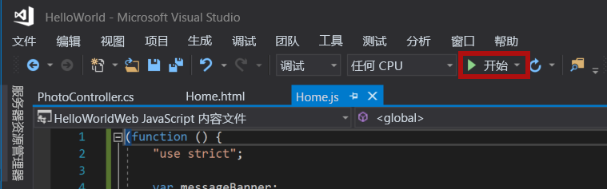

2. 在 PowerPoint 中，选择功能区中的“显示任务窗格”**** 按钮，以打开加载项任务窗格。

    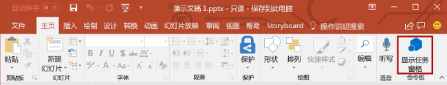

3. 在任务窗格中，选择“插入图像”**** 按钮，将一天中的必应照片添加到当前幻灯片。

    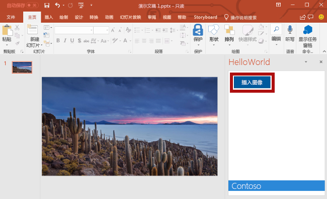

4. 在 Visual Studio 中，按 **Shift + F5** 或选择“停止”**** 按钮，以停止加载项。 PowerPoint 在加载项停止时自动关闭。

    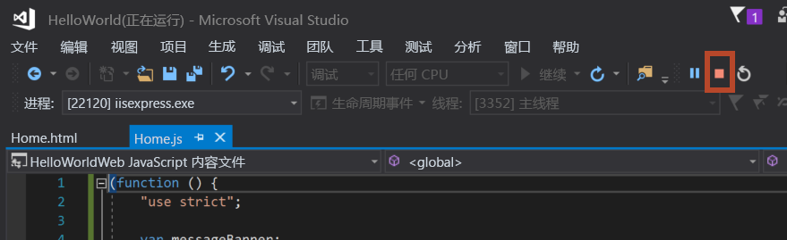

## <a name="customize-user-interface-ui-elements"></a>自定义用户界面 (UI) 元素

完成以下步骤以添加用于自定义任务窗格 UI 的标记。

1. 在 **Home.html** 文件中，将 `TODO2` 替换为以下标记，以将页眉部分和标题添加到任务窗格。 注意：

    - 以 `ms-` 开头的样式由 [Office UI Fabric](../design/office-ui-fabric.md) 进行定义，后者是用于生成 Office 和 Office 365 用户体验的 JavaScript 前端框架。 **Home.html** 文件包含对 Fabric 样式表的引用。

    ```html
    <div id="content-header">
        <div class="ms-Grid ms-bgColor-neutralPrimary">
            <div class="ms-Grid-row">
                <div class="padding ms-Grid-col ms-u-sm12 ms-u-md12 ms-u-lg12"> <div class="ms-font-xl ms-fontColor-white ms-fontWeight-semibold">My PowerPoint add-in</div></div>
            </div>
        </div>
    </div>
    ```

2. 在 **Home.html** 文件中，查找包含 `class="footer"` 的 **div**，并删除找到的整个 **div**，以从任务窗格中删除页脚部分。

### <a name="test-the-add-in"></a>测试加载项

1. 使用 Visual Studio 的同时，按 **F5** 或选择“开始”**** 按钮启动 PowerPoint，以测试 PowerPoint 加载项，功能区中显示有“显示任务窗格”**** 加载项按钮。 加载项本地托管在 IIS 上。

    

2. 在 PowerPoint 中，选择功能区中的“显示任务窗格”**** 按钮，以打开加载项任务窗格。

    

3. 请注意，任务窗格现在包含页眉部分和标题，并且不再包含页脚部分。

    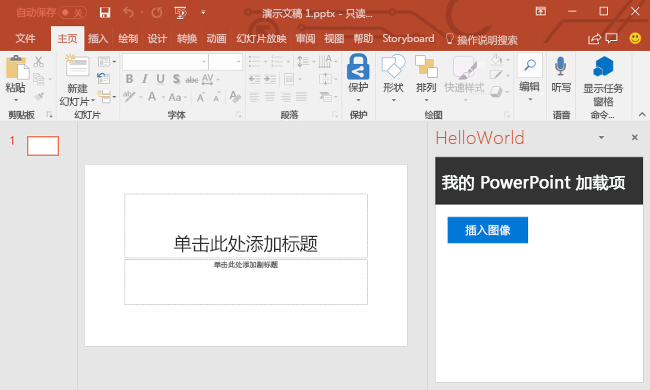

4. 在 Visual Studio 中，按 **Shift + F5** 或选择“停止”**** 按钮，以停止加载项。 PowerPoint 在加载项停止时自动关闭。

    

## <a name="insert-text"></a>插入文本

完成以下步骤以添加用于将文本插入到标题幻灯片的代码，该幻灯片包含一天中的[必应](https://www.bing.com)照片。

1. 在 **Home.html** 文件中，将 `TODO3` 替换为以下标记。 此标记定义在加载项任务窗格内显示的“插入文本”**** 按钮。

    ```html
        <br /><br />
        <button class="Button Button--primary" id="insert-text">
            <span class="Button-icon"><i class="ms-Icon ms-Icon--plus"></i></span>
            <span class="Button-label">Insert Text</span>
            <span class="Button-description">Inserts text into the slide.</span>
        </button>
    ```

2. 在 **Home.js** 文件中，将 `TODO4` 替换为下列代码，以分配“插入文本”**** 按钮的事件处理程序。

    ```js
    $('#insert-text').click(insertText);
    ```

3. 在 **Home.js** 文件中，将 `TODO5` 替换为下列代码，以定义 **insertText** 函数。 此函数将文本插入当前幻灯片。

    ```js
    function insertText() {
        Office.context.document.setSelectedDataAsync('Hello World!',
            function (asyncResult) {
                if (asyncResult.status === Office.AsyncResultStatus.Failed) {
                    showNotification("Error", asyncResult.error.message);
                }
            });
    }
    ```

### <a name="test-the-add-in"></a>测试加载项

1. 使用 Visual Studio 的同时，按 **F5** 或选择“开始”**** 按钮启动 PowerPoint，以测试加载项，功能区中显示有“显示任务窗格”**** 加载项按钮。 加载项本地托管在 IIS 上。

    

2. 在 PowerPoint 中，选择功能区中的“显示任务窗格”**** 按钮，以打开加载项任务窗格。

    

3. 在任务窗格中，选择“插入图像”**** 按钮，将一天中的必应照片添加到当前幻灯片，再为包含标题文本框的幻灯片选择一种设计。

    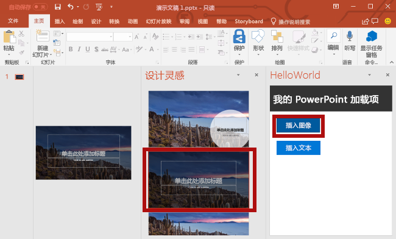

4. 将光标置于标题幻灯片上的文本框中，再选择任务窗格中的“插入文本”**** 按钮，向幻灯片添加文本。

    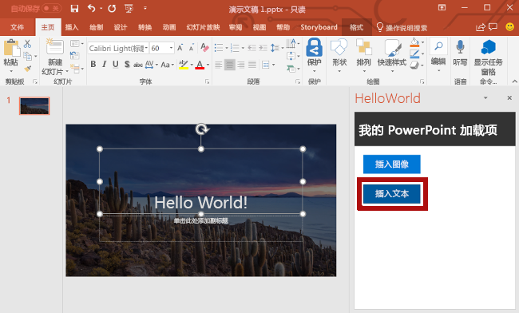


5. 在 Visual Studio 中，按 **Shift + F5** 或选择“停止”**** 按钮，以停止加载项。 PowerPoint 在加载项停止时自动关闭。

    

## <a name="get-slide-metadata"></a>获取幻灯片元数据

完成以下步骤以添加用于检索所选幻灯片的元数据的代码。

1. 在 **Home.html** 文件中，将 `TODO4` 替换为以下标记。 此标记定义在加载项任务窗格内显示的“获取幻灯片元数据”**** 按钮。

    ```html
    <br /><br />
    <button class="Button Button--primary" id="get-slide-metadata">
        <span class="Button-icon"><i class="ms-Icon ms-Icon--plus"></i></span>
        <span class="Button-label">Get Slide Metadata</span>
        <span class="Button-description">Gets metadata for the selected slide(s).</span>
    </button>
    ```

2. 在 **Home.js** 文件中，将 `TODO6` 替换为下列代码，以分配“获取幻灯片元数据”**** 按钮的事件处理程序。

    ```js
    $('#get-slide-metadata').click(getSlideMetadata);
    ```

3. 在 **Home.js** 文件中，将 `TODO7` 替换为下列代码，以定义 **getSlideMetadata** 函数。 此函数检索选定一张或多张幻灯片的元数据，并将它写入加载项任务窗格内的弹出对话框窗口。

    ```js
    function getSlideMetadata() {
        Office.context.document.getSelectedDataAsync(Office.CoercionType.SlideRange,
            function (asyncResult) {
                if (asyncResult.status === Office.AsyncResultStatus.Failed) {
                    showNotification("Error", asyncResult.error.message);
                } else {
                    showNotification("Metadata for selected slide(s):", JSON.stringify(asyncResult.value), null, 2);
                }
            }
        );
    }
    ```

### <a name="test-the-add-in"></a>测试加载项

1. 使用 Visual Studio 的同时，按 **F5** 或选择“开始”**** 按钮启动 PowerPoint，以测试加载项，功能区中显示有“显示任务窗格”**** 加载项按钮。 加载项本地托管在 IIS 上。

    

2. 在 PowerPoint 中，选择功能区中的“显示任务窗格”**** 按钮，以打开加载项任务窗格。

    

3. 在任务窗格中，选择“获取幻灯片元数据”**** 按钮，以获取选定幻灯片的元数据。 此时，幻灯片元数据写入到任务窗格底部的弹出对话框窗口。 在此示例中，JSON 元数据中的 `slides` 数组包含一个对象，用于指定选定幻灯片的 `id`、`title` 和 `index`。 如果在检索幻灯片元数据时选择了多张幻灯片，JSON 元数据中的 `slides` 数组会对每张选定幻灯片都包含一个对象。

    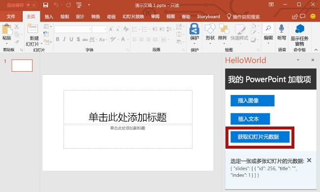

4. 在 Visual Studio 中，按 **Shift + F5** 或选择“停止”**** 按钮，以停止加载项。 PowerPoint 在加载项停止时自动关闭。

    

## <a name="navigate-between-slides"></a>在幻灯片之间导航

完成以下步骤以添加用于在文档幻灯片之间导航的代码。

1. 在 **Home.html** 文件中，将 `TODO5` 替换为以下标记。 此标记定义在加载项任务窗格内显示的四个导航按钮。

    ```html
    <br /><br />
    <button class="Button Button--primary" id="go-to-first-slide">
        <span class="Button-icon"><i class="ms-Icon ms-Icon--plus"></i></span>
        <span class="Button-label">Go to First Slide</span>
        <span class="Button-description">Go to the first slide.</span>
    </button>
    <br /><br />
    <button class="Button Button--primary" id="go-to-next-slide">
        <span class="Button-icon"><i class="ms-Icon ms-Icon--plus"></i></span>
        <span class="Button-label">Go to Next Slide</span>
        <span class="Button-description">Go to the next slide.</span>
    </button>
    <br /><br />
    <button class="Button Button--primary" id="go-to-previous-slide">
        <span class="Button-icon"><i class="ms-Icon ms-Icon--plus"></i></span>
        <span class="Button-label">Go to Previous Slide</span>
        <span class="Button-description">Go to the previous slide.</span>
    </button>
    <br /><br />
    <button class="Button Button--primary" id="go-to-last-slide">
        <span class="Button-icon"><i class="ms-Icon ms-Icon--plus"></i></span>
        <span class="Button-label">Go to Last Slide</span>
        <span class="Button-description">Go to the last slide.</span>
    </button>
    ```

2. 在 **Home.js** 文件中，将 `TODO8` 替换为下列代码，以分配四个导航按钮的事件处理程序。

    ```js
    $('#go-to-first-slide').click(goToFirstSlide);
    $('#go-to-next-slide').click(goToNextSlide);
    $('#go-to-previous-slide').click(goToPreviousSlide);
    $('#go-to-last-slide').click(goToLastSlide);
    ```

3. 在 **Home.js** 文件中，将 `TODO9` 替换为下列代码，以定义导航函数。 以下各函数均使用 `goToByIdAsync` 函数，以根据幻灯片在文档中的位置（第一张、最后一张、上一张和下一张）选择幻灯片。

    ```js
    function goToFirstSlide() {
        Office.context.document.goToByIdAsync(Office.Index.First, Office.GoToType.Index,
            function (asyncResult) {
                if (asyncResult.status == "failed") {
                    showNotification("Error", asyncResult.error.message);
                }
            });
    }

    function goToLastSlide() {
        Office.context.document.goToByIdAsync(Office.Index.Last, Office.GoToType.Index,
            function (asyncResult) {
                if (asyncResult.status == "failed") {
                    showNotification("Error", asyncResult.error.message);
                }
            });
    }

    function goToPreviousSlide() {
        Office.context.document.goToByIdAsync(Office.Index.Previous, Office.GoToType.Index,
            function (asyncResult) {
                if (asyncResult.status == "failed") {
                    showNotification("Error", asyncResult.error.message);
                }
            });
    }

    function goToNextSlide() {
        Office.context.document.goToByIdAsync(Office.Index.Next, Office.GoToType.Index,
            function (asyncResult) {
                if (asyncResult.status == "failed") {
                    showNotification("Error", asyncResult.error.message);
                }
            });
    }
    ```

### <a name="test-the-add-in"></a>测试加载项

1. 使用 Visual Studio 的同时，按 **F5** 或选择“开始”**** 按钮启动 PowerPoint，以测试加载项，功能区中显示有“显示任务窗格”**** 加载项按钮。 加载项本地托管在 IIS 上。

    

2. 在 PowerPoint 中，选择功能区中的“显示任务窗格”**** 按钮，以打开加载项任务窗格。

    


3. 使用“开始”**** 选项卡功能区中的“新建幻灯片”**** 按钮，将两张新幻灯片添加到文档中。 

4. 在任务窗格中，选择 **“前往第一张幻灯片”** 按钮。 此时，选择并显示文档中的第一张幻灯片。

    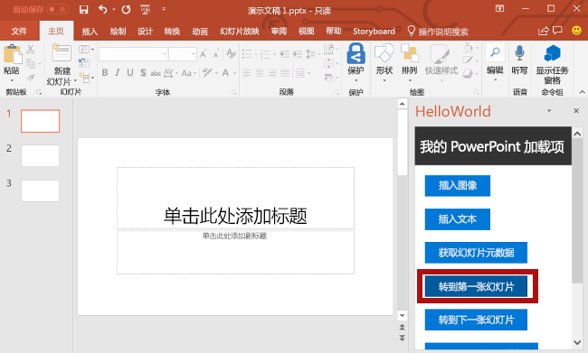

5. 在任务窗格中，选择 **“前往下一张幻灯片”** 按钮。 此时，选择并显示文档中的下一张幻灯片。

    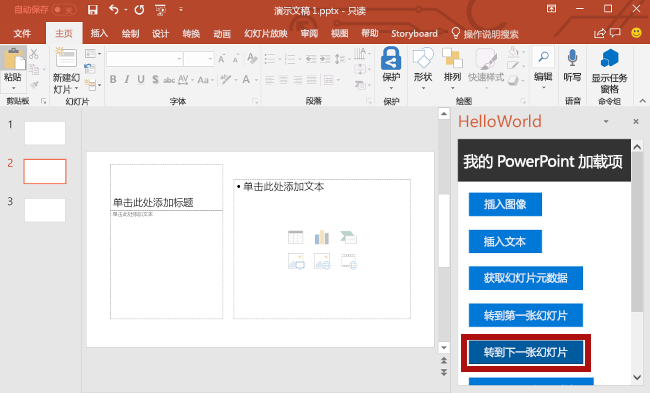

6. 在任务窗格中，选择 **“前往上一张幻灯片”** 按钮。 此时，选择并显示文档中的上一张幻灯片。

    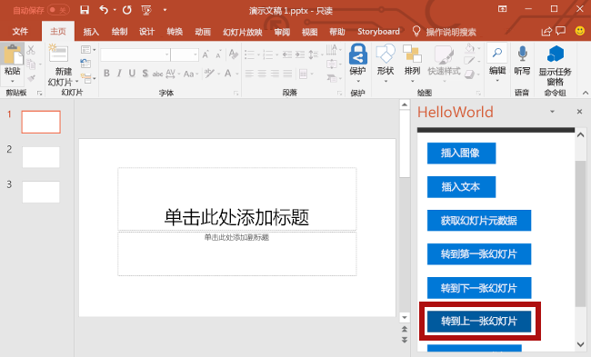

7. 在任务窗格中，选择 **“前往最后一张幻灯片”** 按钮。 此时，选择并显示文档中的最后一张幻灯片。

    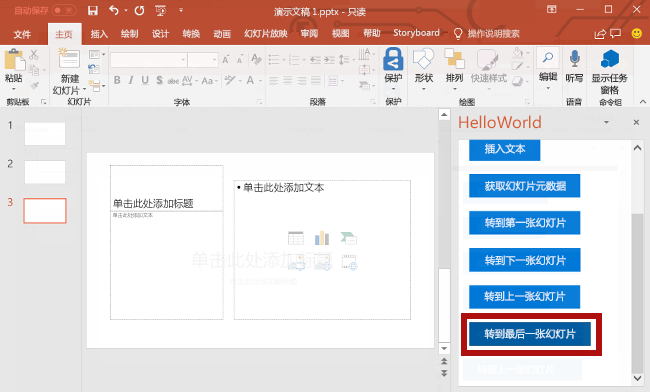

8. 在 Visual Studio 中，按 **Shift + F5** 或选择“停止”**** 按钮，以停止加载项。 PowerPoint 在加载项停止时自动关闭。

    

## <a name="next-steps"></a>后续步骤

在本教程中，你已创建 PowerPoint 加载项，用于插入图像、插入文本、获取幻灯片元数据，以及在幻灯片之间导航。 若要了解有关构建 PowerPoint 加载项的详细信息，请继续阅读以下文章：

> [!div class="nextstepaction"]
> [PowerPoint 加载项概述](../powerpoint/powerpoint-add-ins.md)

## <a name="see-also"></a>另请参阅

* [Office 加载项平台概述](../overview/office-add-ins.md)
* [构建 Office 加载项](../overview/office-add-ins-fundamentals.md)
* [开发 Office 加载项](../develop/develop-overview.md)