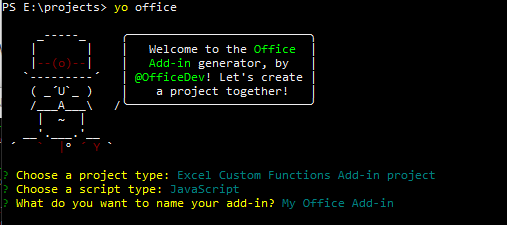

# <a name="tutorial-share-data-and-events-between-excel-custom-functions-and-the-task-pane-preview"></a>教程：在 Excel 自定义函数和任务窗格之间共享数据和事件（预览）

Excel 自定义函数和任务窗格共享全局数据，并可实现相互之间的函数调用。 若要配置项目以便自定义函数可与任务窗格配合使用，请按照本文中的说明进行操作。

> [!NOTE]
> 本文中所述的功能目前处于预览阶段，可能会发生更改。 暂不支持在生产环境中使用。 本文中的预览功能仅适用于 Windows 上的 Excel。 若要试用预览功能，需[加入 Office 预览体验计划](https://insider.office.com/join)。  试用预览版功能的好方法是使用 Office 365 订阅。 如果还没有 Office 365 订阅，可以通过加入 [Office 365 开发人员计划](https://developer.microsoft.com/office/dev-program)获取一个订阅。

## <a name="create-the-add-in-project"></a>创建加载项项目

使用 Yeoman 生成器创建 Excel 加载项项目。 运行下面的命令，使用下面的答案回答提示问题：

```command&nbsp;line
yo office
```

- 选择项目类型： **Excel 自定义函数加载项项目**
- 选择脚本类型： **JavaScript**
- 你想要如何命名加载项？ **我的 Office 加载项**



完成此向导后，生成器会创建项目，并安装支持的 Node 组件。

## <a name="configure-the-manifest"></a>配置清单

1. 启动 Visual Studio Code 并打开“**我的 Office 加载项**”项目。
2. 打开 **manifest.xml** 文件。
3. 更改 `<Requirements>` 部分以使用 **CustomFunctionsRuntime** 版本 **1.2**，如以下代码所示。
    
    ```xml
    <Requirements> 
    <Sets DefaultMinVersion="1.1">
    <Set Name="CustomFunctionsRuntime" MinVersion="1.2"/>
    </Sets>
    </Requirements>
    ```
    
4. 在工作簿的 `<Host>` 元素下，添加以下 `<Runtimes>` 部分。 生存期需要**较长**，以便在关闭任务窗格时自定义函数仍可正常工作。
    
    ```xml
    <Hosts>
    <Host xsi:type="Workbook">
    <Runtimes>
    <Runtime resid="TaskPaneAndCustomFunction.Url" lifetime="long" />
    </Runtimes>
    ```
    
5. 在 `<Page>` 元素中，将源位置从 **Functions.Page.Url** 更改为 **TaskPaneAndCustomFunction.Url**。

    ```xml
    <AllFormFactors>
    ...
    <Page>
    <SourceLocation resid="TaskPaneAndCustomFunction.Url"/>
    </Page>
    ...
    ```

6. 在 `<DesktopFormFactor>` 部分中，将 **FunctionFile** 从 **Commands.Url** 更改为使用 **TaskPaneAndCustomFunction.Url**。
    
    ```xml
    <DesktopFormFactor>
    <GetStarted>
    ...
    </GetStarted>
    <FunctionFile resid="TaskPaneAndCustomFunction.Url"/>
    ```
    
7. 在 `<Action>` 部分中，将源位置从 **Taskpane.Url** 更改为 **TaskPaneAndCustomFunction.Url**。
    
    ```xml
    <Action xsi:type="ShowTaskpane">
    <TaskpaneId>ButtonId1</TaskpaneId>
    <SourceLocation resid="TaskPaneAndCustomFunction.Url"/>
    </Action>
    ```
    
8. 为 **TaskPaneAndCustomFunction.Url** 添加新的 **Url id**，它指向 **taskpane.html**。
     
    ```xml
    <bt:Urls>
    <bt:Url id="Functions.Script.Url" DefaultValue="https://localhost:3000/dist/functions.js"/>
    ...
    <bt:Url id="TaskPaneAndCustomFunction.Url" DefaultValue="https://localhost:3000/taskpane.html"/>
    ...
    ```
    
9. 保存更改并重新生成项目。
    
    ```command&nbsp;line
    npm run build
    ```

## <a name="share-state-between-custom-function-and-task-pane-code"></a>共享自定义函数和任务窗格代码之间的状态 

由于自定义函数在与任务窗格代码相同的上下文中运行，因此可以直接共享状态，无需使用 **Storage** 对象。 以下说明介绍了如何在自定义函数和任务窗格代码之间共享全局变量。

### <a name="create-custom-functions-to-get-or-store-shared-state"></a>创建用于获取或存储共享状态的自定义函数

1. 在 Visual Studio Code 中，打开文件 **src/functions/functions.js**。
2. 在第 1 行，将以下代码插入到最顶部。 这将初始化一个名为 **sharedState** 的全局变量。
    
    ```js
    window.sharedState = "empty";
    ```
    
3. 添加以下代码，创建将值存储到 **sharedState** 变量的自定义函数。
    
    ```js
    /**
    * Saves a string value to shared state with the task pane
    * @customfunction STOREVALUE
    * @param {string} value String to write to shared state with task pane.
    * @return {string} A success value
    */
    function storeValue(sharedValue) {
    window.sharedState = sharedValue;
    return "value stored";
    }
    ```
    
4. 添加以下代码，创建获取 **sharedState** 变量的当前值的自定义函数。

    ```js
    /**
    * Gets a string value from shared state with the task pane
    * @customfunction GETVALUE
    * @returns {string} String value of the shared state with task pane.
    */
    function getValue() {
    return window.sharedState;
    }
    ```
    
5. 保存文件。

### <a name="create-task-pane-controls-to-work-with-global-data"></a>创建任务窗格控件以处理全局数据 

1. 打开 file**src/taskpane/taskpane.html**。
2. 关闭 `</main>` 元素后，添加以下 HTML。 该 HTML 创建两个用于获取或存储全局数据的文本框和按钮。

    ```html
    <ol>
    <li>Enter a value to send to the custom function and select <strong>Store</strong>.</li>
    <li>Enter <strong>=CONTOSO.GETVALUE()</strong>strong> into a cell to retrieve it.</li>
    <li>To send data to the task pane, in a cell, enter <strong>=CONTOSO.STOREVALUE("new value")</strong></li>
    <li>Select <strong>Get</strong> to display the value in the task pane.</li>
    </ol>
    <p>Store new value to shared state</p>
    <div>
    <input type="text" id="storeBox" />
    <button onclick="storeSharedValue()">Store</button>
    </div>
     
    <p>Get shared state value</p>
    <div>
    <input type="text" id="getBox" />
    <button onclick="getSharedValue()">Get</button>
    </div>
    ```
    
3. 在 `<body>` 元素前，添加以下脚本。 当用户想存储或获取全局数据时，此代码将处理按钮单击事件。
    
    ```js
    <script>
    function storeSharedValue() {
    let sharedValue = document.getElementById('storeBox').value;
    window.sharedState = sharedValue;
    }
    
    function getSharedValue() {
    document.getElementById('getBox').value = window.sharedState;
    }</script>
    ```
    
4. 保存文件。
5. 生成项目
    
    ```command&nbsp;line
    npm run build 
    ```

### <a name="try-sharing-data-between-the-custom-functions-and-task-pane"></a>在自定义函数和任务窗格之间尝试共享数据

- 使用以下命令启动项目。

    ```command&nbsp;line
    npm run start
    ```

Excel 启动后，可使用“任务窗格”按钮来存储或获取共享数据。 在自定义函数的单元格中输入 `=CONTOSO.GETVALUE()`，以检索相同的共享数据。 或使用 `=CONTOSO.STOREVALUE(“new value”)` 将共享数据更改为新值。

> [!NOTE]
> 如本文所示配置项目，可在自定义函数和任务窗格之间共享上下文。 不支持从自定义函数调用 Office API。 如果需要与文档交互，在 [onCalculated 事件](https://docs.microsoft.com/javascript/api/excel/excel.worksheet?view=excel-js-preview#event-details)中实现对 Office API 的调用。

