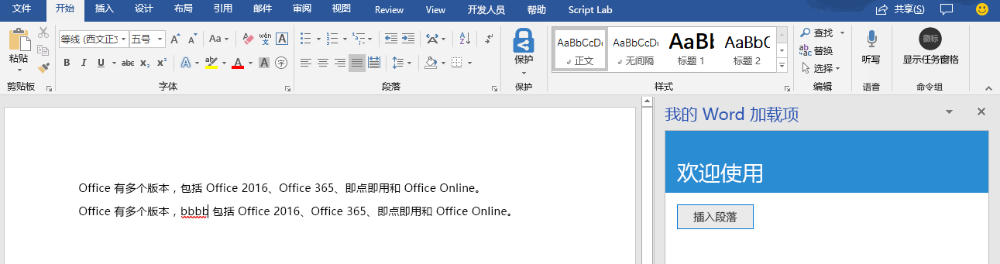
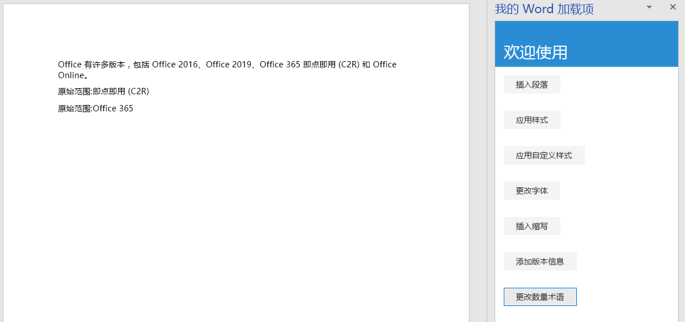
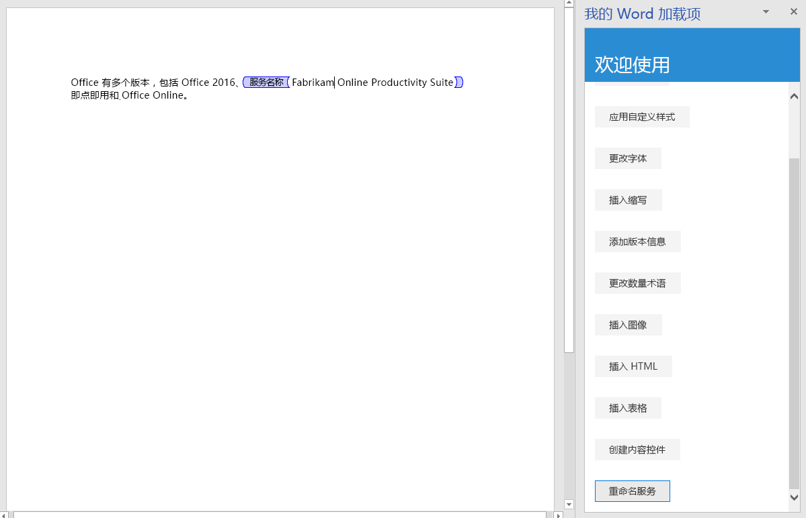

# <a name="tutorial-create-a-word-task-pane-add-in"></a>教程：创建 Word 任务窗格加载项

在本教程中，将创建 Word 任务窗格加载项，该加载项将：

> [!div class="checklist"]
> * 插入文本区域
> * 设置文本格式
> * 替换文本并在各个位置插入文本
> * 插入图像、HTML 和表格
> * 创建和更新内容控件 

## <a name="prerequisites"></a>先决条件

若要学习本教程，需要安装以下各项。 

- Word 2016 版本 1711（生成号 8730.1000 即点即用）或更高版本。 可能必须成为 Office 预览体验成员，才能获取此版本。 有关详细信息，请参阅[成为 Office 预览体验成员](https://products.office.com/office-insider?tab=tab-1)。

- [Node](https://nodejs.org/en/) 

- [Git Bash](https://git-scm.com/downloads)（或其他 Git 客户端）

## <a name="create-your-add-in-project"></a>创建加载项项目

完成以下步骤以创建将用作本教程基础的 Word 加载项项目。

1. 克隆 GitHub 存储库 [Word 加载项教程](https://github.com/OfficeDev/Word-Add-in-Tutorial)。

2. 打开 Git Bash 窗口或已启用 Node.JS 的系统命令提示符，并转到项目的“开始”**** 文件夹。

3. 运行命令 `npm install`，以安装 package.json 文件中列出的工具和库。 

4. 按照[将自签名证书添加为受信任的根证书](https://github.com/OfficeDev/generator-office/blob/master/src/docs/ssl.md)中的步骤操作，信任开发计算机操作系统的证书。

## <a name="insert-a-range-of-text"></a>插入文本区域

本教程的这一步是，先以编程方式测试加载项是否支持用户的当前版本 Word，再在文档中插入段落。

### <a name="code-the-add-in"></a>编码加载项

1. 在代码编辑器中打开项目。

2. 打开文件 index.html。

3. 将 `TODO1` 替换为以下标记：

    ```html
    <button class="ms-Button" id="insert-paragraph">Insert Paragraph</button>
    ```

4. 打开 app.js 文件。

5. 将 `TODO1` 替换为下面的代码。 此代码用于确定用户的 Word 版本是否支持包含本教程所有阶段使用的全部 API 的 Word.js 版本。 在生产加载项中，若要隐藏或禁用调用不受支持的 API 的 UI，请使用条件块的主体。 这样一来，用户仍可以使用 Word 版本支持的加载项部分。

    ```js
    if (!Office.context.requirements.isSetSupported('WordApi', 1.3)) {
        console.log('Sorry. The tutorial add-in uses Word.js APIs that are not available in your version of Office.');
    }
    ```

6. 将 `TODO2` 替换为下面的代码：

    ```js
    $('#insert-paragraph').click(insertParagraph);
    ```

7. 将 `TODO3` 替换为以下代码。 注意：

   - Word.js 业务逻辑会添加到传递给 `Word.run` 的函数中。 此逻辑不会立即执行， 而是添加到挂起命令队列中。

   - `context.sync` 方法将所有已排入队列的命令都发送到 Word 以供执行。

   - `Word.run` 后跟 `catch` 块。 这是应始终遵循的最佳做法。 

    ```js
    function insertParagraph() {
        Word.run(function (context) {

            // TODO4: Queue commands to insert a paragraph into the document.

            return context.sync();
        })
        .catch(function (error) {
            console.log("Error: " + error);
            if (error instanceof OfficeExtension.Error) {
                console.log("Debug info: " + JSON.stringify(error.debugInfo));
            }
        });
    }
    ```

8. 将 `TODO4` 替换为以下代码。 请注意以下几点：

   - `insertParagraph` 方法的第一个参数是新段落的文本。

   - 第二个参数是应在正文中的什么位置插入段落。 如果父对象为正文，其他段落插入选项包括“End”和“Replace”。

    ```js
    var docBody = context.document.body;
    docBody.insertParagraph("Office has several versions, including Office 2016, Office 365 Click-to-Run, and Office Online.",
                            "Start");
    ```

### <a name="test-the-add-in"></a>测试加载项

1. 打开 Git Bash 窗口或已启用 Node.JS 的系统命令提示符，并转到项目的“开始”**** 文件夹。

2. 运行命令 `npm run build`，以将 ES6 源代码转换为所有可运行 Office 加载项的主机支持的旧版 JavaScript。

3. 运行命令 `npm start`，以启动在 localhost 上运行的 Web 服务器。

4. 通过以下方法之一旁加载加载项：

    - Windows：[在 Windows 上旁加载 Office 加载项](../testing/create-a-network-shared-folder-catalog-for-task-pane-and-content-add-ins.md)

    - Word Online：[在 Office Online 中旁加载 Office 加载项](../testing/sideload-office-add-ins-for-testing.md#sideload-an-office-add-in-in-office-online)

    - iPad 和 Mac：[在 iPad 和 Mac 上旁加载 Office 加载项](../testing/sideload-an-office-add-in-on-ipad-and-mac.md)

5. 在 Word 的“开始”**** 菜单中，选择“显示任务窗格”****。

6. 在任务窗格中，选择“插入段落”****。

7. 在段落中进行一些更改。

8. 再次选择“插入段落”****。 观察新段落是否位于上一段落之上，因为 `insertParagraph` 方法要在文档正文的“开头”插入内容。

    

## <a name="format-text"></a>设置文本格式

在本教程的此步骤中，你将向文本应用嵌入样式、向文本应用自定义样式并更改文本字体。

### <a name="apply-a-built-in-style-to-text"></a>向文本应用嵌入样式

1. 在代码编辑器中打开项目。 

2. 打开文件 index.html。

3. 在包含 `insert-paragraph` 按钮的 `div` 正下方，添加下列标记：

    ```html
    <div class="padding">            
        <button class="ms-Button" id="apply-style">Apply Style</button>            
    </div>
    ```

4. 打开 app.js 文件。

5. 在向 `insert-paragraph` 按钮分配单击处理程序的代码行正下方，添加下列代码：

    ```js
    $('#apply-style').click(applyStyle);
    ```

6. 在 `insertParagraph` 函数正下方，添加下列函数：

    ```js
    function applyStyle() {
        Word.run(function (context) {
            
            // TODO1: Queue commands to style text.

            return context.sync();
        })
        .catch(function (error) {
            console.log("Error: " + error);
            if (error instanceof OfficeExtension.Error) {
                console.log("Debug info: " + JSON.stringify(error.debugInfo));
            }
        });
    }
    ``` 

7. 将 `TODO1` 替换为下面的代码。 请注意，此代码向段落应用样式，但也可以向文本区域应用样式。

    ```js
    var firstParagraph = context.document.body.paragraphs.getFirst();
    firstParagraph.styleBuiltIn = Word.Style.intenseReference;
    ``` 

### <a name="apply-a-custom-style-to-text"></a>向文本应用自定义样式

1. 打开文件 index.html。

2. 在包含 `apply-style` 按钮的 `div` 下方，添加下列标记：

    ```html
    <div class="padding">            
        <button class="ms-Button" id="apply-custom-style">Apply Custom Style</button>            
    </div>
    ```

3. 打开 app.js 文件。

4. 在向 `apply-style` 按钮分配单击处理程序的代码行下方，添加下列代码：

    ```js
    $('#apply-custom-style').click(applyCustomStyle);
    ```

5. 在 `applyStyle` 函数下方，添加下列函数：

    ```js
    function applyCustomStyle() {
        Word.run(function (context) {
            
            // TODO1: Queue commands to apply the custom style.

            return context.sync();
        })
        .catch(function (error) {
            console.log("Error: " + error);
            if (error instanceof OfficeExtension.Error) {
                console.log("Debug info: " + JSON.stringify(error.debugInfo));
            }
        });
    }
    ``` 

6. 将 `TODO1` 替换为下面的代码。 请注意，此代码应用的自定义样式尚不存在。 将在**测试加载项**步骤中创建 [MyCustomStyle](#test-the-add-in) 样式。

    ```js
    var lastParagraph = context.document.body.paragraphs.getLast();
    lastParagraph.style = "MyCustomStyle";
    ``` 

### <a name="change-the-font-of-text"></a>更改文本字体

1. 打开文件 index.html。

2. 在包含 `apply-custom-style` 按钮的 `div` 下方，添加下列标记：

    ```html
    <div class="padding">            
        <button class="ms-Button" id="change-font">Change Font</button>            
    </div>
    ```

3. 打开 app.js 文件。

4. 在向 `apply-custom-style` 按钮分配单击处理程序的代码行下方，添加下列代码：

    ```js
    $('#change-font').click(changeFont);
    ```

5. 在 `applyCustomStyle` 函数下方，添加下列函数：

    ```js
    function changeFont() {
        Word.run(function (context) {
            
            // TODO1: Queue commands to apply a different font.

            return context.sync();
        })
        .catch(function (error) {
            console.log("Error: " + error);
            if (error instanceof OfficeExtension.Error) {
                console.log("Debug info: " + JSON.stringify(error.debugInfo));
            }
        });
    }
    ``` 

6. 将 `TODO1` 替换为下面的代码。 请注意，此代码使用链接到 `ParagraphCollection.getFirst` 方法的 `Paragraph.getNext` 方法，获取对第二个段落的引用。

    ```js
    var secondParagraph = context.document.body.paragraphs.getFirst().getNext();
    secondParagraph.font.set({
            name: "Courier New",
            bold: true,
            size: 18
        });
    ``` 

### <a name="test-the-add-in"></a>测试加载项

1. 如果上一阶段教程中的 Git Bash 窗口或已启用 Node.JS 的系统命令提示符仍处于打开状态，请按 Ctrl+C 两次，停止正在运行的 Web 服务器。 否则，打开 Git Bash 窗口或已启用 Node.JS 的系统命令提示符，并转到项目的“开始”**** 文件夹。

     > [!NOTE]
     > 虽然只要更改任意文件（包括 app.js 文件），浏览器同步服务器就会在任务窗格中重新加载加载项，但它不会重新转换 JavaScript。因此，必须重复执行生成命令，这样对 app.js 做出的更改才会生效。 为此，需要终止服务器进程，这样才能看到提示并输入生成命令。 生成后，重启服务器。 接下来的几步操作就是在执行此过程。

2. 运行命令 `npm run build`，以将 ES6 源代码转换为所有可运行 Office 加载项的主机支持的旧版 JavaScript。

3. 运行命令 `npm start`，以启动在 localhost 上运行的 Web 服务器。   

4. 通过关闭任务窗格来重新加载它，再选择“开始”**** 菜单上的“显示任务窗格”****，以重新打开加载项。

5. 请确保文档中至少有三个段落。 可以选择“插入段落”**** 三次。 *仔细检查文档末尾是否没有空白段落。若有，请予以删除。*

6. 在 Word 中，创建自定义样式“MyCustomStyle”。 其中可以包含所需的任何格式。

7. 选择“应用样式”**** 按钮。 第一个段落将采用嵌入样式“明显参考”****。

8. 选择“应用自定义样式”**** 按钮。 最后一个段落将采用自定义样式。 （如果好像什么都没有发生，很可能是因为最后一个段落是空白段落。 如果是这样，请向其中添加某文本。）

9. 选择“更改字体”**** 按钮。 第二个段落的字体更改为 18 磅的粗体 Courier New。

    

## <a name="replace-text-and-insert-text"></a>替换文本和插入文本

本教程的这一步是，在选定文本区域内外添加文本，并替换选定区域的文本。

### <a name="add-text-inside-a-range"></a>在区域内添加文本

1. 在代码编辑器中打开项目。

2. 打开文件 index.html。

3. 在包含 `change-font` 按钮的 `div` 下方，添加下列标记：

    ```html
    <div class="padding">
        <button class="ms-Button" id="insert-text-into-range">Insert Abbreviation</button>
    </div>
    ```

4. 打开 app.js 文件。

5. 在向 `change-font` 按钮分配单击处理程序的代码行下方，添加下列代码：

    ```js
    $('#insert-text-into-range').click(insertTextIntoRange);
    ```

6. 在 `changeFont` 函数下方，添加下列函数：

    ```js
    function insertTextIntoRange() {
        Word.run(function (context) {

            // TODO1: Queue commands to insert text into a selected range.

            // TODO2: Load the text of the range and sync so that the
            //        current range text can be read.

            // TODO3: Queue commands to repeat the text of the original
            //        range at the end of the document.

            return context.sync();
        })
        .catch(function (error) {
            console.log("Error: " + error);
            if (error instanceof OfficeExtension.Error) {
                console.log("Debug info: " + JSON.stringify(error.debugInfo));
            }
        });
    }
    ``` 

7. 将 `TODO1` 替换为以下代码。请注意以下几点：

   - 此方法用于在“即点即用”文本区域末尾插入缩写 ["(C2R)"]。 它做了一个简化假设，即存在字符串，且用户已选择它。

   - `Range.insertText` 方法的第一个参数是要插入到 `Range` 对象的字符串。

   - 第二个参数指定了应在区域中的什么位置插入其他文本。 除了“End”外，其他可用选项包括“Start”、“Before”、“After”和“Replace”。 

   - “End”和“After”的区别在于，“End”在现有区域末尾插入新文本，而“After”则是新建包含字符串的区域，并在现有区域后面插入新区域。 同样，“Start”是在现有区域的开头位置插入文本，而“Before”插入的是新区域。 “Replace”将现有区域文本替换为第一个参数中的字符串。

   - 在本教程之前阶段步骤中，正文对象的 insert* 方法没有“Before”和“After”选项。 这是因为不能将内容置于文档正文外。

    ```js
    var doc = context.document;
    var originalRange = doc.getSelection();
    originalRange.insertText(" (C2R)", "End");
    ```

8. 在下一部分前，将跳过 `TODO2`。 将 `TODO3` 替换为下面的代码。 此代码类似于在本教程第一阶段中创建的代码，区别在于现在是要在文档末尾（而不是开头）插入新段落。 这一新段落将说明，新文本现属于原始区域。

    ```js
    doc.body.insertParagraph("Original range: " + originalRange.text, "End");
    ```

### <a name="add-code-to-fetch-document-properties-into-the-task-panes-script-objects"></a>添加代码以将文档属性提取到任务窗格的脚本对象

在本系列教程前面的所有函数中，都是将命令排入队列，以对 Office 文档执行*写入*操作。 每个函数结束时都会调用 `context.sync()` 方法，从而将排入队列的命令发送到文档，以供执行。 不过，在上一步中添加的代码调用的是 `originalRange.text` 属性，这与之前编写的函数明显不同，因为 `originalRange` 对象只是任务窗格脚本中的代理对象。 由于它并不了解文档中区域的实际文本，因此它的 `text` 属性无法有实值。 有必要先从文档中提取区域的文本值，再用它设置 `originalRange.text` 的值。 只有这样才能调用 `originalRange.text`，而又不会导致异常抛出。 此提取过程分为三步：

   1. 将命令排入队列，以加载（即提取）代码需要读取的属性。

   2. 调用上下文对象的 `sync`方法，从而向文档发送已排入队列的命令以供执行，并返回请求获取的信息。

   3. 由于 `sync` 是异步方法，因此请先确保它已完成，然后代码才能调用已提取的属性。

只要代码需要从 Office 文档*读取*信息，就必须完成这些步骤。

1. 将 `TODO2` 替换为下面的代码。
  
    ```js
    originalRange.load("text");
    return context.sync()
        .then(function() {

                // TODO4: Move the doc.body.insertParagraph line here.

            }
        )
            // TODO5: Move the final call of context.sync here and ensure
            //        that it does not run until the insertParagraph has
            //        been queued.
    ```

2. 由于不能在同一取消分支代码路径中有两个 `return` 语句，因此请删除 `Word.run` 末尾的最后一行代码 `return context.sync();`。本教程稍后将添加最后一个新 `context.sync` 语句。

3. 剪切并粘贴 `doc.body.insertParagraph` 代码行，以替代 `TODO4`。

4. 将 `TODO5` 替换为下面的代码。请注意以下几点：

   - 将 `sync` 方法传递到 `then` 函数可确保它不会在 `insertParagraph` 逻辑已排入队列前运行。

   - 由于 `then` 方法调用传递给它的任何函数，并且也不想调用 `sync` 两次，因此请从 context.sync 末尾省略掉“()”。

    ```js
    .then(context.sync);
    ```

完成后，整个函数应如下所示：

```js
function insertTextIntoRange() {
    Word.run(function (context) {

        var doc = context.document;
        var originalRange = doc.getSelection();
        originalRange.insertText(" (C2R)", "End");

        originalRange.load("text");
        return context.sync()
            .then(function() {
                        doc.body.insertParagraph("Current text of original range: " + originalRange.text,
                                                "End");
                }
            )
            .then(context.sync);
    })
    .catch(function (error) {
        console.log("Error: " + error);
        if (error instanceof OfficeExtension.Error) {
            console.log("Debug info: " + JSON.stringify(error.debugInfo));
        }
    });
}
```

### <a name="add-text-between-ranges"></a>在区域间添加文本

1. 打开文件 index.html。

2. 在包含 `insert-text-into-range` 按钮的 `div` 下方，添加下列标记：

    ```html
    <div class="padding">
        <button class="ms-Button" id="insert-text-outside-range">Add Version Info</button>
    </div>
    ```

3. 打开 app.js 文件。

4. 在向 `insert-text-into-range` 按钮分配单击处理程序的代码行下方，添加下列代码：

    ```js
    $('#insert-text-outside-range').click(insertTextBeforeRange);
    ```

5. 在 `insertTextIntoRange` 函数下方，添加下列函数：

    ```js
    function insertTextBeforeRange() {
        Word.run(function (context) {

            // TODO1: Queue commands to insert a new range before the
            //        selected range.

            // TODO2: Load the text of the original range and sync so that the
            //        range text can be read and inserted.

        })
        .catch(function (error) {
            console.log("Error: " + error);
            if (error instanceof OfficeExtension.Error) {
                console.log("Debug info: " + JSON.stringify(error.debugInfo));
            }
        });
    }
    ```

6. 将 `TODO1` 替换为以下代码。请注意以下几点：

   - 此方法用于在文本为“Office 365”的区域前添加文本为“Office 2019”的区域。 它做了一个简化假设，即存在字符串，且用户已选择它。

   - `Range.insertText` 方法的第一个参数是要添加的字符串。

   - 第二个参数指定了应在区域中的什么位置插入其他文本。 若要详细了解位置选项，请参阅前面介绍的 `insertTextIntoRange` 函数。

    ```js
    var doc = context.document;
    var originalRange = doc.getSelection();
    originalRange.insertText("Office 2019, ", "Before");
    ```

7. 将 `TODO2` 替换为下面的代码。

     ```js
    originalRange.load("text");
    return context.sync()
        .then(function() {

                // TODO3: Queue commands to insert the original range as a
                //        paragraph at the end of the document.

                }
            )

            // TODO4: Make a final call of context.sync here and ensure
            //        that it does not run until the insertParagraph has
            //        been queued.
    ```

8. 将 `TODO3` 替换为下面的代码。 这一新段落将说明，新文本***不***属于原始选定区域。 原始区域中的文本仍与用户选择它时一样。

    ```js
    doc.body.insertParagraph("Current text of original range: " + originalRange.text,
                             "End");
    ```

9. 将 `TODO4` 替换为下面的代码：

    ```js
    .then(context.sync);
    ```

### <a name="replace-the-text-of-a-range"></a>替换区域文本

1. 打开文件 index.html。

2. 在包含 `insert-text-outside-range` 按钮的 `div` 下方，添加下列标记：

    ```html
    <div class="padding">
        <button class="ms-Button" id="replace-text">Change Quantity Term</button>
    </div>
    ```

3. 打开 app.js 文件。

4. 在向 `insert-text-outside-range` 按钮分配单击处理程序的代码行下方，添加下列代码：

    ```js
    $('#replace-text').click(replaceText);
    ```

5. 在 `insertTextBeforeRange` 函数下方，添加下列函数：

    ```js
    function replaceText() {
        Word.run(function (context) {

            // TODO1: Queue commands to replace the text.

            return context.sync();
        })
        .catch(function (error) {
            console.log("Error: " + error);
            if (error instanceof OfficeExtension.Error) {
                console.log("Debug info: " + JSON.stringify(error.debugInfo));
            }
        });
    }
    ```

6. 将 `TODO1` 替换为下面的代码。 请注意，此方法用于将字符串“几个”替换为字符串“许多”。 它做了一个简化假设，即存在字符串，且用户已选择它。

    ```js
    var doc = context.document;
    var originalRange = doc.getSelection();
    originalRange.insertText("many", "Replace");
    ```

### <a name="test-the-add-in"></a>测试加载项

1. 如果上一阶段教程中的 Git Bash 窗口或已启用 Node.JS 的系统命令提示符仍处于打开状态，请按 Ctrl-C 两次，停止正在运行的 Web 服务器。 否则，打开 Git Bash 窗口或已启用 Node.JS 的系统命令提示符，并转到项目的“开始”**** 文件夹。

     > [!NOTE]
     > 虽然只要更改任意文件（包括 app.js 文件），浏览器同步服务器就会在任务窗格中重新加载加载项，但它不会重新转换 JavaScript。因此，必须重复执行生成命令，这样对 app.js 做出的更改才会生效。 为此，需要终止服务器进程，这样才能看到提示并输入生成命令。 生成后，重启服务器。 接下来的几步操作就是在执行此过程。

2. 运行命令 `npm run build`，以将 ES6 源代码转换为所有可运行 Office 加载项的主机支持的旧版 JavaScript。

3. 运行命令 `npm start`，以启动在 localhost 上运行的 Web 服务器。

4. 通过关闭任务窗格来重新加载它，再选择“开始”**** 菜单上的“显示任务窗格”****，以重新打开外接程序。

5. 在任务窗格中，选择“插入段落”****，以确保文档开头有一个段落。

6. 选择某文本。 选择短语“即点即用”最合适。 *请注意，不要在选定区域的前后添加空格。*

7. 选择“插入缩写”**** 按钮。 观察“(C2R)”是否已添加。 此外，还请观察，文档底部是否添加了包含整个扩展文本的新段落，因为新字符串已添加到现有区域中。

8. 选择某文本。 选择短语“Office 365”最合适。 *请注意，不要在选定区域的前后添加空格。*

9. 选择“添加版本信息”**** 按钮。 观察是否已在“Office 2016”和“Office 365”之间插入“Office 2019”。 此外，还请观察，文档底部是否添加了仅包含最初选定文本的新段落，因为新字符串已变成新区域，而不是添加到原始区域中。

10. 选择某文本。 选择字词“几个”最合适。 *请注意，不要在选定区域的前后添加空格。*

11. 选择“更改数量术语”**** 按钮。 观察选定文本是否替换为“多个”。

    

## <a name="insert-images-html-and-tables"></a>插入图像、HTML 和表格

本教程的这一步是，了解如何在文档中插入图像、HTML 和表格。

### <a name="insert-an-image"></a>插入图像

1. 在代码编辑器中打开项目。

2. 打开文件 index.html。

3. 在包含 `replace-text` 按钮的 `div` 下方，添加下列标记：

    ```html
    <div class="padding">
        <button class="ms-Button" id="insert-image">Insert Image</button>
    </div>
    ```

4. 打开 app.js 文件。

5. 在文件顶部附近的 use-strict 代码行正下方，添加下面的代码行。 此代码行导入另一个文件中的变量。 此变量是用于编码图像的 Base64 字符串。 若要查看已编码字符串，请打开项目根目录中的 base64Image.js 文件。

    ```js
    import { base64Image } from "./base64Image";
    ```

6. 在向 `replace-text` 按钮分配单击处理程序的代码行下方，添加下列代码：

    ```js
    $('#insert-image').click(insertImage);
    ```

7. 在 `replaceText` 函数下方，添加下列函数：

    ```js
    function insertImage() {
        Word.run(function (context) {

            // TODO1: Queue commands to insert an image.

            return context.sync();
        })
        .catch(function (error) {
            console.log("Error: " + error);
            if (error instanceof OfficeExtension.Error) {
                console.log("Debug info: " + JSON.stringify(error.debugInfo));
            }
        });
    }
    ```

8. 将 `TODO1` 替换为下面的代码。 请注意，此代码行在文档末尾插入 Base64 编码图像。 （`Paragraph` 对象还包含 `insertInlinePictureFromBase64` 方法和其他 `insert*` 方法。 有关示例，请参阅下面的 insertHTML 部分。）

    ```js
    context.document.body.insertInlinePictureFromBase64(base64Image, "End");
    ```

### <a name="insert-html"></a>插入 HTML

1. 打开文件 index.html。

2. 在包含 `insert-image` 按钮的 `div` 下方，添加下列标记：

    ```html
    <div class="padding">
        <button class="ms-Button" id="insert-html">Insert HTML</button>
    </div>
    ```

3. 打开 app.js 文件。

4. 在向 `insert-image` 按钮分配单击处理程序的代码行下方，添加下列代码：

    ```js
    $('#insert-html').click(insertHTML);
    ```

5. 在 `insertImage` 函数下方，添加下列函数：

    ```js
    function insertHTML() {
        Word.run(function (context) {

            // TODO1: Queue commands to insert a string of HTML.

            return context.sync();
        })
        .catch(function (error) {
            console.log("Error: " + error);
            if (error instanceof OfficeExtension.Error) {
                console.log("Debug info: " + JSON.stringify(error.debugInfo));
            }
        });
    }
    ```

6. 将 `TODO1` 替换为以下代码。请注意以下几点：

   - 第一行代码在文档末尾添加空白段落。 

   - 第二行代码在段落末尾插入 HTML 字符串；具体而言是两个段落，一个设置使用 Verdana 字体格式，另一个采用 Word 文档的默认样式。 （如前面的 `insertImage` 方法一样，`context.document.body` 对象还包含 `insert*` 方法。）

    ```js
    var blankParagraph = context.document.body.paragraphs.getLast().insertParagraph("", "After");
    blankParagraph.insertHtml('<p style="font-family: verdana;">Inserted HTML.</p><p>Another paragraph</p>', "End");
    ```

### <a name="insert-a-table"></a>插入表格

1. 打开文件 index.html。

2. 在包含 `insert-html` 按钮的 `div` 下方，添加下列标记：

    ```html
    <div class="padding">
        <button class="ms-Button" id="insert-table">Insert Table</button>
    </div>
    ```

3. 打开 app.js 文件。

4. 在向 `insert-html` 按钮分配单击处理程序的代码行下方，添加下列代码：

    ```js
    $('#insert-table').click(insertTable);
    ```

5. 在 `insertHTML` 函数下方，添加下列函数：

    ```js
    function insertTable() {
        Word.run(function (context) {

            // TODO1: Queue commands to get a reference to the paragraph
            //        that will proceed the table.

            // TODO2: Queue commands to create a table and populate it with data.

            return context.sync();
        })
        .catch(function (error) {
            console.log("Error: " + error);
            if (error instanceof OfficeExtension.Error) {
                console.log("Debug info: " + JSON.stringify(error.debugInfo));
            }
        });
    }
    ```

6. 将 `TODO1` 替换为下面的代码。 请注意，此代码行先使用 `ParagraphCollection.getFirst` 方法获取对第一个段落的引用，再使用 `Paragraph.getNext` 方法获取对第二个段落的引用。

    ```js
    var secondParagraph = context.document.body.paragraphs.getFirst().getNext();
    ```

7. 将 `TODO2` 替换为以下代码。 请注意以下几点：

   - `insertTable` 方法的前两个参数指定行数和列数。

   - 第三个参数指定要在哪里插入表格（在此示例中，是在段落后面插入）。

   - 第四个参数是用于设置表格单元格值的二维数组。

   - 虽然表格采用普通的默认样式，但 `insertTable` 方法返回的 `Table` 对象包含多个成员，其中部分成员用于设置表格样式。

    ```js
    var tableData = [
            ["Name", "ID", "Birth City"],
            ["Bob", "434", "Chicago"],
            ["Sue", "719", "Havana"],
        ];
    secondParagraph.insertTable(3, 3, "After", tableData);
    ```

### <a name="test-the-add-in"></a>测试加载项

1. 如果上一阶段教程中的 Git Bash 窗口或已启用 Node.JS 的系统命令提示符仍处于打开状态，请按 Ctrl+C 两次，停止正在运行的 Web 服务器。 否则，打开 Git Bash 窗口或已启用 Node.JS 的系统命令提示符，并转到项目的“开始”**** 文件夹。

     > [!NOTE]
     > 虽然只要更改任意文件（包括 app.js 文件），浏览器同步服务器就会在任务窗格中重新加载加载项，但它不会重新转换 JavaScript。因此，必须重复执行生成命令，这样对 app.js 做出的更改才会生效。 为此，需要终止服务器进程，这样才能看到提示并输入生成命令。 生成后，重启服务器。 接下来的几步操作就是在执行此过程。

2. 运行命令 `npm run build`，以将 ES6 源代码转换为所有可运行 Office 加载项的主机支持的旧版 JavaScript。

3. 运行命令 `npm start`，以启动在 localhost 上运行的 Web 服务器。

4. 通过关闭任务窗格来重新加载它，再选择“开始”**** 菜单上的“显示任务窗格”****，以重新打开外接程序。

5. 在任务窗格中，至少选择“插入段落”**** 三次，以确保文档中有多个段落。

6. 选择“插入图像”**** 按钮，观察图像是否插入在文档末尾。

7. 选择“插入 HTML”**** 按钮，观察是否在文档末尾插入了两个段落，第一个段落使用 Verdana 字体。

8. 选择“插入表格”**** 按钮，观察是否在第二个段落后面插入了表格。

    

## <a name="create-and-update-content-controls"></a>创建和更新内容控件

本教程的这一步是，了解如何在文档中创建格式文本内容控件，以及如何插入和替换控件的内容。

> [!NOTE]
> 虽然可通过 UI 添加到 Word 文档的内容控件有好几种，但目前 Word.js 仅支持格式文本内容控件。
>
> 开始执行本教程的这一步之前，建议通过 Word UI 创建和控制格式文本内容控件，以便熟悉此类控件及其属性。 有关详细信息，请参阅[在 Word 中创建用户填写或打印的表单](https://support.office.com/article/create-forms-that-users-complete-or-print-in-word-040c5cc1-e309-445b-94ac-542f732c8c8b)。

### <a name="create-a-content-control"></a>创建内容控件

1. 在代码编辑器中打开项目。

2. 打开文件 index.html。

3. 在包含 `replace-text` 按钮的 `div` 下方，添加下列标记：

    ```html
    <div class="padding">
        <button class="ms-Button" id="create-content-control">Create Content Control</button>
    </div>
    ```

4. 打开 app.js 文件。

5. 在向 `insert-table` 按钮分配单击处理程序的代码行下方，添加下列代码：

    ```js
    $('#create-content-control').click(createContentControl);
    ```

6. 在 `insertTable` 函数下方，添加下列函数：

    ```js
    function createContentControl() {
        Word.run(function (context) {

            // TODO1: Queue commands to create a content control.

            return context.sync();
        })
        .catch(function (error) {
            console.log("Error: " + error);
            if (error instanceof OfficeExtension.Error) {
                console.log("Debug info: " + JSON.stringify(error.debugInfo));
            }
        });
    }
    ```

7. 将 `TODO1` 替换为以下代码。请注意以下几点：

   - 此代码用于在内容控件中包装短语“Office 365”。 它做了一个简化假设，即存在字符串，且用户已选择它。

   - `ContentControl.title` 属性指定内容控件的可见标题。

   - `ContentControl.tag` 属性指定标记，可用于通过 `ContentControlCollection.getByTag` 方法获取对内容控件的引用，将用于稍后出现的函数。

   - `ContentControl.appearance` 属性指定控件的外观。 使用值“Tags”表示，控件包装在开始标记和结束标记中，且开始标记包含内容控件标题。 其他可取值包括“BoundingBox”和“None”。

   - `ContentControl.color` 属性指定标记颜色或边界框的边框。

    ```js
    var serviceNameRange = context.document.getSelection();
    var serviceNameContentControl = serviceNameRange.insertContentControl();
    serviceNameContentControl.title = "Service Name";
    serviceNameContentControl.tag = "serviceName";
    serviceNameContentControl.appearance = "Tags";
    serviceNameContentControl.color = "blue";
    ```

### <a name="replace-the-content-of-the-content-control"></a>替换内容控件的内容

1. 打开文件 index.html。

2. 在包含 `create-content-control` 按钮的 `div` 下方，添加下列标记：

    ```html
    <div class="padding">
        <button class="ms-Button" id="replace-content-in-control">Rename Service</button>
    </div>
    ```

3. 打开 app.js 文件。

4. 在向 `create-content-control` 按钮分配单击处理程序的代码行下方，添加下列代码：

    ```js
    $('#replace-content-in-control').click(replaceContentInControl);
    ```

5. 在 `createContentControl` 函数下方，添加下列函数：

    ```js
    function replaceContentInControl() {
        Word.run(function (context) {

            // TODO1: Queue commands to replace the text in the Service Name
            //        content control.

            return context.sync();
        })
        .catch(function (error) {
            console.log("Error: " + error);
            if (error instanceof OfficeExtension.Error) {
                console.log("Debug info: " + JSON.stringify(error.debugInfo));
            }
        });
    }
    ```

6. 将 `TODO1` 替换为以下代码。请注意以下几点：

    - `ContentControlCollection.getByTag` 方法将返回指定标记的所有内容控件的 `ContentControlCollection`。 我们使用 `getFirst` 来获取对所需控件的引用。

    ```js
    var serviceNameContentControl = context.document.contentControls.getByTag("serviceName").getFirst();
    serviceNameContentControl.insertText("Fabrikam Online Productivity Suite", "Replace");
    ```

### <a name="test-the-add-in"></a>测试外接程序

1. 如果上一阶段教程中的 Git Bash 窗口或已启用 Node.JS 的系统命令提示符仍处于打开状态，请按 Ctrl+C 两次，停止正在运行的 Web 服务器。 否则，打开 Git Bash 窗口或已启用 Node.JS 的系统命令提示符，并转到项目的“开始”**** 文件夹。

     > [!NOTE]
     > 虽然只要更改任意文件（包括 app.js 文件），浏览器同步服务器就会在任务窗格中重新加载加载项，但它不会重新转换 JavaScript。因此，必须重复执行生成命令，这样对 app.js 做出的更改才会生效。 为此，需要终止服务器进程，这样才能看到提示并输入生成命令。 生成后，重启服务器。 接下来的几步操作就是在执行此过程。

2. 运行命令 `npm run build`，以将 ES6 源代码转换为所有可运行 Office 加载项的主机支持的旧版 JavaScript。

3. 运行命令 `npm start`，以启动在 localhost 上运行的 Web 服务器。

4. 通过关闭任务窗格来重新加载它，再选择“开始”**** 菜单上的“显示任务窗格”****，以重新打开外接程序。

5. 在任务窗格中，选择“插入段落”****，以确保文档顶部有包含“Office 365”的段落。

6. 选择刚刚添加的段落中的短语“Office 365”，再选择“创建内容控件”**** 按钮。 观察此短语是否包装在标签为“服务名称”的标记中。

7. 选择“重命名服务”**** 按钮，并观察内容控件的文本是否变成“Fabrikam Online Productivity Suite”。

    

## <a name="next-steps"></a>后续步骤

在本教程中，你已创建 Word 任务窗格加载项，用于在 Word 文档中插入和替换文本、图像和其他内容。 若要了解有关构建 Word 加载项的详细信息，请继续阅读以下文章：

> [!div class="nextstepaction"]
> [Word 加载项概述](../word/word-add-ins-programming-overview.md)
