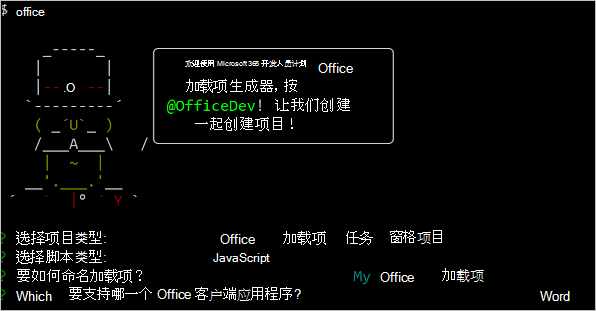

# <a name="tutorial-create-a-word-task-pane-add-in"></a><span data-ttu-id="82bc4-104">教程：创建 Word 任务窗格加载项</span><span class="sxs-lookup"><span data-stu-id="82bc4-104">Tutorial: Create a Word task pane add-in</span></span>

<span data-ttu-id="82bc4-105">在本教程中，将创建 Word 任务窗格加载项，该加载项将：</span><span class="sxs-lookup"><span data-stu-id="82bc4-105">In this tutorial, you'll create a Word task pane add-in that:</span></span>

> [!div class="checklist"]
> * <span data-ttu-id="82bc4-106">插入文本区域</span><span class="sxs-lookup"><span data-stu-id="82bc4-106">Inserts a range of text</span></span>
> * <span data-ttu-id="82bc4-107">设置文本格式</span><span class="sxs-lookup"><span data-stu-id="82bc4-107">Formats text</span></span>
> * <span data-ttu-id="82bc4-108">替换文本并在各个位置插入文本</span><span class="sxs-lookup"><span data-stu-id="82bc4-108">Replaces text and inserts text in various locations</span></span>
> * <span data-ttu-id="82bc4-109">插入图像、HTML 和表格</span><span class="sxs-lookup"><span data-stu-id="82bc4-109">Inserts images, HTML, and tables</span></span>
> * <span data-ttu-id="82bc4-110">创建和更新内容控件</span><span class="sxs-lookup"><span data-stu-id="82bc4-110">Creates and updates content controls</span></span> 

> [!TIP]
> <span data-ttu-id="82bc4-111">如果已完成了[创建首个 Word 任务窗格加载项](../quickstarts/word-quickstart.md)快速入门，并希望使用该项目作为本教程的起点，请直接转到[插入文本区域](#insert-a-range-of-text)以开始此教程。</span><span class="sxs-lookup"><span data-stu-id="82bc4-111">If you've already completed the [Build your first Word task pane add-in](../quickstarts/word-quickstart.md) quick start, and want to use that project as a starting point for this tutorial, go directly to the [Insert a range of text](#insert-a-range-of-text) section to start this tutorial.</span></span>

## <a name="prerequisites"></a><span data-ttu-id="82bc4-112">先决条件</span><span class="sxs-lookup"><span data-stu-id="82bc4-112">Prerequisites</span></span>

[!include[Yeoman generator prerequisites](../includes/quickstart-yo-prerequisites.md)]

## <a name="create-your-add-in-project"></a><span data-ttu-id="82bc4-113">创建加载项项目</span><span class="sxs-lookup"><span data-stu-id="82bc4-113">Create your add-in project</span></span>

[!include[Yeoman generator create project guidance](../includes/yo-office-command-guidance.md)]

- <span data-ttu-id="82bc4-114">**选择项目类型:** `Office Add-in Task Pane project`</span><span class="sxs-lookup"><span data-stu-id="82bc4-114">**Choose a project type:** `Office Add-in Task Pane project`</span></span>
- <span data-ttu-id="82bc4-115">**选择脚本类型:** `Javascript`</span><span class="sxs-lookup"><span data-stu-id="82bc4-115">**Choose a script type:** `Javascript`</span></span>
- <span data-ttu-id="82bc4-116">**要如何命名加载项?**</span><span class="sxs-lookup"><span data-stu-id="82bc4-116">**What do you want to name your add-in?**</span></span> `My Office Add-in`
- <span data-ttu-id="82bc4-117">**要支持哪一个 Office 客户端应用程序?**</span><span class="sxs-lookup"><span data-stu-id="82bc4-117">**Which Office client application would you like to support?**</span></span> `Word`



<span data-ttu-id="82bc4-119">完成此向导后，生成器会创建项目，并安装支持的 Node 组件。</span><span class="sxs-lookup"><span data-stu-id="82bc4-119">After you complete the wizard, the generator creates the project and installs supporting Node components.</span></span>

[!include[Yeoman generator next steps](../includes/yo-office-next-steps.md)]

## <a name="insert-a-range-of-text"></a><span data-ttu-id="82bc4-120">插入文本区域</span><span class="sxs-lookup"><span data-stu-id="82bc4-120">Insert a range of text</span></span>

<span data-ttu-id="82bc4-121">本教程的这一步是，先以编程方式测试加载项是否支持用户的当前版本 Word，再在文档中插入段落。</span><span class="sxs-lookup"><span data-stu-id="82bc4-121">In this step of the tutorial, you'll programmatically test that your add-in supports the user's current version of Word, and then insert a paragraph into the document.</span></span>

### <a name="code-the-add-in"></a><span data-ttu-id="82bc4-122">编码加载项</span><span class="sxs-lookup"><span data-stu-id="82bc4-122">Code the add-in</span></span>

1. <span data-ttu-id="82bc4-123">在代码编辑器中打开项目。</span><span class="sxs-lookup"><span data-stu-id="82bc4-123">Open the project in your code editor.</span></span>

2. <span data-ttu-id="82bc4-124">打开 ./src/taskpane/taskpane.html\*\*\*\* 文件。</span><span class="sxs-lookup"><span data-stu-id="82bc4-124">Open the file **./src/taskpane/taskpane.html**.</span></span> <span data-ttu-id="82bc4-125">此文件含有任务窗格的 HTML 标记。</span><span class="sxs-lookup"><span data-stu-id="82bc4-125">This file contains the HTML markup for the task pane.</span></span>

3. <span data-ttu-id="82bc4-126">找到 `<main>` 元素并删除在开始 `<main>` 标记后和关闭 `</main>` 标记前出现的所有行。</span><span class="sxs-lookup"><span data-stu-id="82bc4-126">Locate the `<main>` element and delete all lines that appear after the opening `<main>` tag and before the closing `</main>` tag.</span></span>

4. <span data-ttu-id="82bc4-127">打开 `<main>` 标记后立即添加下列标记：</span><span class="sxs-lookup"><span data-stu-id="82bc4-127">Add the following markup immediately after the opening `<main>` tag:</span></span>

    ```html
    <button class="ms-Button" id="insert-paragraph">Insert Paragraph</button><br/><br/>
    ```

5. <span data-ttu-id="82bc4-128">打开 ./src/taskpane/taskpane.js\*\*\*\* 文件。</span><span class="sxs-lookup"><span data-stu-id="82bc4-128">Open the file **./src/taskpane/taskpane.js**.</span></span> <span data-ttu-id="82bc4-129">此文件包含用于加快任务窗格与 Office 托管应用程序之间的交互的 Office JavaScript API 代码。</span><span class="sxs-lookup"><span data-stu-id="82bc4-129">This file contains the Office JavaScript API code that facilitates interaction between the task pane and the Office host application.</span></span>

6. <span data-ttu-id="82bc4-130">执行以下操作，删除对 `run` 按钮和 `run()` 函数的所有引用：</span><span class="sxs-lookup"><span data-stu-id="82bc4-130">Remove all references to the `run` button and the `run()` function by doing the following:</span></span>

    - <span data-ttu-id="82bc4-131">查找并删除行 `document.getElementById("run").onclick = run;`。</span><span class="sxs-lookup"><span data-stu-id="82bc4-131">Locate and delete the line `document.getElementById("run").onclick = run;`.</span></span>

    - <span data-ttu-id="82bc4-132">查找并删除整个 `run()` 函数。</span><span class="sxs-lookup"><span data-stu-id="82bc4-132">Locate and delete the entire `run()` function.</span></span>

7. <span data-ttu-id="82bc4-133">在 `Office.onReady` 方法调用中，找到行 `if (info.host === Office.HostType.Word) {` 并紧接着行添加下列代码。</span><span class="sxs-lookup"><span data-stu-id="82bc4-133">Within the `Office.onReady` method call, locate the line `if (info.host === Office.HostType.Word) {` and add the following code immediately after that line.</span></span> <span data-ttu-id="82bc4-134">注意：</span><span class="sxs-lookup"><span data-stu-id="82bc4-134">Note:</span></span>

    - <span data-ttu-id="82bc4-135">此代码的第一部分用于确定用户的 Word 版本是否支持包含本教程所有阶段使用的全部 API 的 Word.js 版本。</span><span class="sxs-lookup"><span data-stu-id="82bc4-135">The first part of this code determines whether the user's version of Word supports a version of Word.js that includes all the APIs that are used in all stages of this tutorial.</span></span> <span data-ttu-id="82bc4-136">在生产加载项中，若要隐藏或禁用调用不受支持的 API 的 UI，请使用条件块的主体。</span><span class="sxs-lookup"><span data-stu-id="82bc4-136">In a production add-in, use the body of the conditional block to hide or disable the UI that would call unsupported APIs.</span></span> <span data-ttu-id="82bc4-137">这样一来，用户仍可以使用 Word 版本支持的加载项部分。</span><span class="sxs-lookup"><span data-stu-id="82bc4-137">This will enable the user to still use the parts of the add-in that are supported by their version of Word.</span></span>
    - <span data-ttu-id="82bc4-138">此代码的第二部分为 `insert-paragraph` 按钮添加了事件处理程序。</span><span class="sxs-lookup"><span data-stu-id="82bc4-138">The second part of this code adds an event handler for the `insert-paragraph` button.</span></span>

    ```js
    // Determine if the user's version of Office supports all the Office.js APIs that are used in the tutorial.
    if (!Office.context.requirements.isSetSupported('WordApi', '1.3')) {
        console.log('Sorry. The tutorial add-in uses Word.js APIs that are not available in your version of Office.');
    }

    // Assign event handlers and other initialization logic.
    document.getElementById("insert-paragraph").onclick = insertParagraph;
    ```

8. <span data-ttu-id="82bc4-139">将以下函数添加到文件结尾。</span><span class="sxs-lookup"><span data-stu-id="82bc4-139">Add the following function to the end of the file.</span></span> <span data-ttu-id="82bc4-140">注意：</span><span class="sxs-lookup"><span data-stu-id="82bc4-140">Note:</span></span>

   - <span data-ttu-id="82bc4-p107">Word.js 业务逻辑会添加到传递给 `Word.run` 的函数中。 此逻辑不会立即执行， 而是添加到挂起命令队列中。</span><span class="sxs-lookup"><span data-stu-id="82bc4-p107">Your Word.js business logic will be added to the function that is passed to `Word.run`. This logic does not execute immediately. Instead, it is added to a queue of pending commands.</span></span>

   - <span data-ttu-id="82bc4-144">`context.sync` 方法将所有已排入队列的命令都发送到 Word 以供执行。</span><span class="sxs-lookup"><span data-stu-id="82bc4-144">The `context.sync` method sends all queued commands to Word for execution.</span></span>

   - <span data-ttu-id="82bc4-p108">`Word.run` 后跟 `catch` 块。 这是应始终遵循的最佳做法。</span><span class="sxs-lookup"><span data-stu-id="82bc4-p108">The `Word.run` is followed by a `catch` block. This is a best practice that you should always follow.</span></span> 

    ```js
    function insertParagraph() {
        Word.run(function (context) {

            // TODO1: Queue commands to insert a paragraph into the document.

            return context.sync();
        })
        .catch(function (error) {
            console.log("Error: " + error);
            if (error instanceof OfficeExtension.Error) {
                console.log("Debug info: " + JSON.stringify(error.debugInfo));
            }
        });
    }
    ```

9. <span data-ttu-id="82bc4-147">在 `insertParagraph()` 函数中，将 `TODO1` 替换为以下代码。</span><span class="sxs-lookup"><span data-stu-id="82bc4-147">Within the `insertParagraph()` function, replace `TODO1` with the following code.</span></span> <span data-ttu-id="82bc4-148">注意：</span><span class="sxs-lookup"><span data-stu-id="82bc4-148">Note:</span></span>

   - <span data-ttu-id="82bc4-149">`insertParagraph` 方法的第一个参数是新段落的文本。</span><span class="sxs-lookup"><span data-stu-id="82bc4-149">The first parameter to the `insertParagraph` method is the text for the new paragraph.</span></span>

   - <span data-ttu-id="82bc4-p110">第二个参数是应在正文中的什么位置插入段落。 如果父对象为正文，其他段落插入选项包括“End”和“Replace”。</span><span class="sxs-lookup"><span data-stu-id="82bc4-p110">The second parameter is the location within the body where the paragraph will be inserted. Other options for insert paragraph, when the parent object is the body, are "End" and "Replace".</span></span>

    ```js
    var docBody = context.document.body;
    docBody.insertParagraph("Office has several versions, including Office 2016, Office 365 Click-to-Run, and Office on the web.",
                            "Start");
    ```

10. <span data-ttu-id="82bc4-152">验证是否已保存了对项目所做的所有更改。</span><span class="sxs-lookup"><span data-stu-id="82bc4-152">Verify that you've saved all of the changes you've made to the project.</span></span>

### <a name="test-the-add-in"></a><span data-ttu-id="82bc4-153">测试加载项</span><span class="sxs-lookup"><span data-stu-id="82bc4-153">Test the add-in</span></span>

1. <span data-ttu-id="82bc4-154">完成以下步骤，以启动本地 Web 服务器并旁加载你的加载项。</span><span class="sxs-lookup"><span data-stu-id="82bc4-154">Complete the following steps to start the local web server and sideload your add-in.</span></span>

    > [!NOTE]
    > <span data-ttu-id="82bc4-155">Office 加载项应使用 HTTPS，而不是 HTTP（即便是在开发时也是如此）。</span><span class="sxs-lookup"><span data-stu-id="82bc4-155">Office Add-ins should use HTTPS, not HTTP, even when you are developing.</span></span> <span data-ttu-id="82bc4-156">如果系统在运行以下命令之一后提示你安装证书，请接受提示以安装 Yeoman 生成器提供的证书。</span><span class="sxs-lookup"><span data-stu-id="82bc4-156">If you are prompted to install a certificate after you run one of the following commands, accept the prompt to install the certificate that the Yeoman generator provides.</span></span>

    > [!TIP]
    > <span data-ttu-id="82bc4-157">如果在 Mac 上测试加载项，请先运行项目根目录中的以下命令，然后再继续。</span><span class="sxs-lookup"><span data-stu-id="82bc4-157">If you're testing your add-in on Mac, run the following command in the root directory of your project before proceeding.</span></span> <span data-ttu-id="82bc4-158">运行此命令时，本地 Web 服务器将启动。</span><span class="sxs-lookup"><span data-stu-id="82bc4-158">When you run this command, the local web server starts.</span></span>
    >
    > ```command&nbsp;line
    > npm run dev-server
    > ```

    - <span data-ttu-id="82bc4-159">若要在 Word 中测试加载项，请在项目的根目录中运行以下命令。</span><span class="sxs-lookup"><span data-stu-id="82bc4-159">To test your add-in in Word, run the following command in the root directory of your project.</span></span> <span data-ttu-id="82bc4-160">这将启动本地的 Web 服务器（如果尚未运行的话），并使用加载的加载项打开 Word。</span><span class="sxs-lookup"><span data-stu-id="82bc4-160">This starts the local web server (if it's not already running) and opens Word with your add-in loaded.</span></span>

        ```command&nbsp;line
        npm start
        ```

    - <span data-ttu-id="82bc4-161">若要在 Word 网页版中测试加载项，请在项目的根目录中运行以下命令。</span><span class="sxs-lookup"><span data-stu-id="82bc4-161">To test your add-in in Word on the web, run the following command in the root directory of your project.</span></span> <span data-ttu-id="82bc4-162">运行此命令时，本地 Web 服务器将启动（如果尚未运行）。</span><span class="sxs-lookup"><span data-stu-id="82bc4-162">When you run this command, the local web server will start (if it's not already running).</span></span>

        ```command&nbsp;line
        npm run start:web
        ```

        <span data-ttu-id="82bc4-163">若要使用加载项，请在 Word 网页版中打开新的文档，并按照[在 Office 网页版中旁加载 Office 加载项](../testing/sideload-office-add-ins-for-testing.md#sideload-an-office-add-in-in-office-on-the-web)中的说明操作，以旁加载你的加载项。</span><span class="sxs-lookup"><span data-stu-id="82bc4-163">To use your add-in, open a new document in Word on the web and then sideload your add-in by following the instructions in [Sideload Office Add-ins in Office on the web](../testing/sideload-office-add-ins-for-testing.md#sideload-an-office-add-in-in-office-on-the-web).</span></span>

2. <span data-ttu-id="82bc4-164">在 Word 中，依次选择“开始”\*\*\*\* 选项卡和功能区中的“显示任务窗格”\*\*\*\* 按钮，以打开加载项任务窗格。</span><span class="sxs-lookup"><span data-stu-id="82bc4-164">In Word, choose the **Home** tab, and then choose the **Show Taskpane** button in the ribbon to open the add-in task pane.</span></span>

    

3. <span data-ttu-id="82bc4-166">在任务窗格中，选择“插入段落”\*\*\*\* 按钮。</span><span class="sxs-lookup"><span data-stu-id="82bc4-166">In the task pane, choose the **Insert Paragraph** button.</span></span>

4. <span data-ttu-id="82bc4-167">在段落中进行一些更改。</span><span class="sxs-lookup"><span data-stu-id="82bc4-167">Make a change in the paragraph.</span></span>

5. <span data-ttu-id="82bc4-168">再次选择“插入段落”\*\*\*\* 按钮。</span><span class="sxs-lookup"><span data-stu-id="82bc4-168">Choose the **Insert Paragraph** button again.</span></span> <span data-ttu-id="82bc4-169">观察新段落是否位于上一段落之上，因为 `insertParagraph` 方法要在文档正文的“开头”插入内容。</span><span class="sxs-lookup"><span data-stu-id="82bc4-169">Note that the new paragraph appears above the previous one because the `insertParagraph` method is inserting at the start of the document's body.</span></span>

    

## <a name="format-text"></a><span data-ttu-id="82bc4-171">设置文本格式</span><span class="sxs-lookup"><span data-stu-id="82bc4-171">Format text</span></span>

<span data-ttu-id="82bc4-172">在本教程的此步骤中，你将向文本应用嵌入样式、向文本应用自定义样式并更改文本字体。</span><span class="sxs-lookup"><span data-stu-id="82bc4-172">In this step of the tutorial, you'll apply a built-in style to text, apply a custom style to text, and change the font of text.</span></span>

### <a name="apply-a-built-in-style-to-text"></a><span data-ttu-id="82bc4-173">向文本应用嵌入样式</span><span class="sxs-lookup"><span data-stu-id="82bc4-173">Apply a built-in style to text</span></span>

1. <span data-ttu-id="82bc4-174">打开 ./src/taskpane/taskpane.html\*\*\*\* 文件。</span><span class="sxs-lookup"><span data-stu-id="82bc4-174">Open the file **./src/taskpane/taskpane.html**.</span></span>

2. <span data-ttu-id="82bc4-175">找到 `<button>` 按钮的 `insert-paragraph` 元素，并在该行后添加下列标记：</span><span class="sxs-lookup"><span data-stu-id="82bc4-175">Locate the `<button>` element for the `insert-paragraph` button, and add the following markup after that line:</span></span>

    ```html
    <button class="ms-Button" id="apply-style">Apply Style</button><br/><br/>
    ```

3. <span data-ttu-id="82bc4-176">打开 ./src/taskpane/taskpane.js\*\*\*\* 文件。</span><span class="sxs-lookup"><span data-stu-id="82bc4-176">Open the file **./src/taskpane/taskpane.js**.</span></span>

4. <span data-ttu-id="82bc4-177">在 `Office.onReady` 方法调用中，找到用于将单击处理程序分配到 `insert-paragraph` 按钮的行，并在该行后添加以下代码：</span><span class="sxs-lookup"><span data-stu-id="82bc4-177">Within the `Office.onReady` method call, locate the line that assigns a click handler to the `insert-paragraph` button, and add the following code after that line:</span></span>

    ```js
    document.getElementById("apply-style").onclick = applyStyle;
    ```

5. <span data-ttu-id="82bc4-178">将以下函数添加到文件末端：</span><span class="sxs-lookup"><span data-stu-id="82bc4-178">Add the following function to the end of the file:</span></span>

    ```js
    function applyStyle() {
        Word.run(function (context) {
            
            // TODO1: Queue commands to style text.

            return context.sync();
        })
        .catch(function (error) {
            console.log("Error: " + error);
            if (error instanceof OfficeExtension.Error) {
                console.log("Debug info: " + JSON.stringify(error.debugInfo));
            }
        });
    }
    ``` 

6. <span data-ttu-id="82bc4-179">在 `applyStyle()` 函数中，将 `TODO1` 替换为以下代码。</span><span class="sxs-lookup"><span data-stu-id="82bc4-179">Within the `applyStyle()` function, replace `TODO1` with the following code.</span></span> <span data-ttu-id="82bc4-180">请注意，此代码向段落应用样式，但也可以向文本区域应用样式。</span><span class="sxs-lookup"><span data-stu-id="82bc4-180">Note that the code applies a style to a paragraph, but styles can also be applied to ranges of text.</span></span>

    ```js
    var firstParagraph = context.document.body.paragraphs.getFirst();
    firstParagraph.styleBuiltIn = Word.Style.intenseReference;
    ``` 

### <a name="apply-a-custom-style-to-text"></a><span data-ttu-id="82bc4-181">向文本应用自定义样式</span><span class="sxs-lookup"><span data-stu-id="82bc4-181">Apply a custom style to text</span></span>

1. <span data-ttu-id="82bc4-182">打开 ./src/taskpane/taskpane.html\*\*\*\* 文件。</span><span class="sxs-lookup"><span data-stu-id="82bc4-182">Open the file **./src/taskpane/taskpane.html**.</span></span>

2. <span data-ttu-id="82bc4-183">找到 `<button>` 按钮的 `apply-style` 元素，并在该行后添加下列标记：</span><span class="sxs-lookup"><span data-stu-id="82bc4-183">Locate the `<button>` element for the `apply-style` button, and add the following markup after that line:</span></span> 

    ```html
    <button class="ms-Button" id="apply-custom-style">Apply Custom Style</button><br/><br/>
    ```

3. <span data-ttu-id="82bc4-184">打开 ./src/taskpane/taskpane.js\*\*\*\* 文件。</span><span class="sxs-lookup"><span data-stu-id="82bc4-184">Open the file **./src/taskpane/taskpane.js**.</span></span>

4. <span data-ttu-id="82bc4-185">在 `Office.onReady` 方法调用中，找到用于将单击处理程序分配到 `apply-style` 按钮的行，并在该行后添加以下代码：</span><span class="sxs-lookup"><span data-stu-id="82bc4-185">Within the `Office.onReady` method call, locate the line that assigns a click handler to the `apply-style` button, and add the following code after that line:</span></span>

    ```js
    document.getElementById("apply-custom-style").onclick = applyCustomStyle;
    ```

5. <span data-ttu-id="82bc4-186">将以下函数添加到文件末端：</span><span class="sxs-lookup"><span data-stu-id="82bc4-186">Add the following function to the end of the file:</span></span>

    ```js
    function applyCustomStyle() {
        Word.run(function (context) {
            
            // TODO1: Queue commands to apply the custom style.

            return context.sync();
        })
        .catch(function (error) {
            console.log("Error: " + error);
            if (error instanceof OfficeExtension.Error) {
                console.log("Debug info: " + JSON.stringify(error.debugInfo));
            }
        });
    }
    ``` 

6. <span data-ttu-id="82bc4-187">在 `applyCustomStyle()` 函数中，将 `TODO1` 替换为以下代码。</span><span class="sxs-lookup"><span data-stu-id="82bc4-187">Within the `applyCustomStyle()` function, replace `TODO1` with the following code.</span></span> <span data-ttu-id="82bc4-188">请注意，此代码应用的自定义样式尚不存在。</span><span class="sxs-lookup"><span data-stu-id="82bc4-188">Note that the code applies a custom style that does not exist yet.</span></span> <span data-ttu-id="82bc4-189">将在[测试加载项](#test-the-add-in-1)步骤中创建 **MyCustomStyle** 样式。</span><span class="sxs-lookup"><span data-stu-id="82bc4-189">You'll create a style with the name **MyCustomStyle** in the [Test the add-in](#test-the-add-in-1) step.</span></span>

    ```js
    var lastParagraph = context.document.body.paragraphs.getLast();
    lastParagraph.style = "MyCustomStyle";
    ``` 

7. <span data-ttu-id="82bc4-190">验证是否已保存了对项目所做的所有更改。</span><span class="sxs-lookup"><span data-stu-id="82bc4-190">Verify that you've saved all of the changes you've made to the project.</span></span>

### <a name="change-the-font-of-text"></a><span data-ttu-id="82bc4-191">更改文本字体</span><span class="sxs-lookup"><span data-stu-id="82bc4-191">Change the font of text</span></span>

1. <span data-ttu-id="82bc4-192">打开 ./src/taskpane/taskpane.html\*\*\*\* 文件。</span><span class="sxs-lookup"><span data-stu-id="82bc4-192">Open the file **./src/taskpane/taskpane.html**.</span></span>

2. <span data-ttu-id="82bc4-193">找到 `<button>` 按钮的 `apply-custom-style` 元素，并在该行后添加下列标记：</span><span class="sxs-lookup"><span data-stu-id="82bc4-193">Locate the `<button>` element for the `apply-custom-style` button, and add the following markup after that line:</span></span> 

    ```html
    <button class="ms-Button" id="change-font">Change Font</button><br/><br/>
    ```

3. <span data-ttu-id="82bc4-194">打开 ./src/taskpane/taskpane.js\*\*\*\* 文件。</span><span class="sxs-lookup"><span data-stu-id="82bc4-194">Open the file **./src/taskpane/taskpane.js**.</span></span>

4. <span data-ttu-id="82bc4-195">在 `Office.onReady` 方法调用中，找到用于将单击处理程序分配到 `apply-custom-style` 按钮的行，并在该行后添加以下代码：</span><span class="sxs-lookup"><span data-stu-id="82bc4-195">Within the `Office.onReady` method call, locate the line that assigns a click handler to the `apply-custom-style` button, and add the following code after that line:</span></span>

    ```js
    document.getElementById("change-font").onclick = changeFont;
    ```

5. <span data-ttu-id="82bc4-196">将以下函数添加到文件末端：</span><span class="sxs-lookup"><span data-stu-id="82bc4-196">Add the following function to the end of the file:</span></span>

    ```js
    function changeFont() {
        Word.run(function (context) {
            
            // TODO1: Queue commands to apply a different font.

            return context.sync();
        })
        .catch(function (error) {
            console.log("Error: " + error);
            if (error instanceof OfficeExtension.Error) {
                console.log("Debug info: " + JSON.stringify(error.debugInfo));
            }
        });
    }
    ``` 

6. <span data-ttu-id="82bc4-197">在 `changeFont()` 函数中，将 `TODO1` 替换为以下代码。</span><span class="sxs-lookup"><span data-stu-id="82bc4-197">Within the `changeFont()` function, replace `TODO1` with the following code.</span></span> <span data-ttu-id="82bc4-198">请注意，此代码使用链接到 `Paragraph.getNext` 方法的 `ParagraphCollection.getFirst` 方法，获取对第二个段落的引用。</span><span class="sxs-lookup"><span data-stu-id="82bc4-198">Note that the code gets a reference to the second paragraph by using the `ParagraphCollection.getFirst` method chained to the `Paragraph.getNext` method.</span></span>

    ```js
    var secondParagraph = context.document.body.paragraphs.getFirst().getNext();
    secondParagraph.font.set({
            name: "Courier New",
            bold: true,
            size: 18
        });
    ``` 

7. <span data-ttu-id="82bc4-199">验证是否已保存了对项目所做的所有更改。</span><span class="sxs-lookup"><span data-stu-id="82bc4-199">Verify that you've saved all of the changes you've made to the project.</span></span>

### <a name="test-the-add-in"></a><span data-ttu-id="82bc4-200">测试加载项</span><span class="sxs-lookup"><span data-stu-id="82bc4-200">Test the add-in</span></span>

1. [!include[Start server and sideload add-in instructions](../includes/tutorial-word-start-server.md)]

2. <span data-ttu-id="82bc4-201">如果加载项任务窗格已在 Word 中打开，请转到“开始”\*\*\*\* 选项卡并选择功能区中的“显示任务窗格”\*\*\*\* 按钮以打开它。</span><span class="sxs-lookup"><span data-stu-id="82bc4-201">If the add-in task pane isn't already open in Word, go to the **Home** tab and choose the **Show Taskpane** button in the ribbon to open it.</span></span>

3. <span data-ttu-id="82bc4-202">请确保文档中至少有三个段落。</span><span class="sxs-lookup"><span data-stu-id="82bc4-202">Be sure there are at least three paragraphs in the document.</span></span> <span data-ttu-id="82bc4-203">可以选择“插入段落”\*\*\*\* 按钮三次。</span><span class="sxs-lookup"><span data-stu-id="82bc4-203">You can choose the **Insert Paragraph** button three times.</span></span> <span data-ttu-id="82bc4-204">仔细检查文档末尾是否没有空白段落。若有，请删除它。\*\*</span><span class="sxs-lookup"><span data-stu-id="82bc4-204">*Check carefully that there's no blank paragraph at the end of the document. If there is, delete it.*</span></span>

4. <span data-ttu-id="82bc4-205">在 Word 中，创建[自定义样式](https://support.office.com/article/Customize-or-create-new-styles-d38d6e47-f6fc-48eb-a607-1eb120dec563)“MyCustomStyle”。</span><span class="sxs-lookup"><span data-stu-id="82bc4-205">In Word, create a [custom style](https://support.office.com/article/Customize-or-create-new-styles-d38d6e47-f6fc-48eb-a607-1eb120dec563) named "MyCustomStyle".</span></span> <span data-ttu-id="82bc4-206">其中可以包含所需的任何格式。</span><span class="sxs-lookup"><span data-stu-id="82bc4-206">It can have any formatting that you want.</span></span>

5. <span data-ttu-id="82bc4-p121">选择 **“应用样式”** 按钮。 第一个段落将采用嵌入样式 **“明显参考”**。</span><span class="sxs-lookup"><span data-stu-id="82bc4-p121">Choose the **Apply Style** button. The first paragraph will be styled with the built-in style **Intense Reference**.</span></span>

6. <span data-ttu-id="82bc4-p122">选择 **“应用自定义样式”** 按钮。 最后一个段落将采用自定义样式。 （如果好像什么都没有发生，很可能是因为最后一个段落是空白段落。 如果是这样，请向其中添加某文本。）</span><span class="sxs-lookup"><span data-stu-id="82bc4-p122">Choose the **Apply Custom Style** button. The last paragraph will be styled with your custom style. (If nothing seems to happen, the last paragraph might be blank. If so, add some text to it.)</span></span>

7. <span data-ttu-id="82bc4-p123">选择 **“更改字体”** 按钮。 第二个段落的字体更改为 18 磅的粗体 Courier New。</span><span class="sxs-lookup"><span data-stu-id="82bc4-p123">Choose the **Change Font** button. The font of the second paragraph changes to 18 pt., bold, Courier New.</span></span>

    

## <a name="replace-text-and-insert-text"></a><span data-ttu-id="82bc4-216">替换文本和插入文本</span><span class="sxs-lookup"><span data-stu-id="82bc4-216">Replace text and insert text</span></span>

<span data-ttu-id="82bc4-217">本教程的这一步是，在选定文本区域内外添加文本，并替换选定区域的文本。</span><span class="sxs-lookup"><span data-stu-id="82bc4-217">In this step of the tutorial, you'll add text inside and outside of selected ranges of text, and replace the text of a selected range.</span></span>

### <a name="add-text-inside-a-range"></a><span data-ttu-id="82bc4-218">在区域内添加文本</span><span class="sxs-lookup"><span data-stu-id="82bc4-218">Add text inside a range</span></span>

1. <span data-ttu-id="82bc4-219">打开 ./src/taskpane/taskpane.html\*\*\*\* 文件。</span><span class="sxs-lookup"><span data-stu-id="82bc4-219">Open the file **./src/taskpane/taskpane.html**.</span></span>

2. <span data-ttu-id="82bc4-220">找到 `<button>` 按钮的 `change-font` 元素，并在该行后添加下列标记：</span><span class="sxs-lookup"><span data-stu-id="82bc4-220">Locate the `<button>` element for the `change-font` button, and add the following markup after that line:</span></span> 

    ```html
    <button class="ms-Button" id="insert-text-into-range">Insert Abbreviation</button><br/><br/>
    ```

3. <span data-ttu-id="82bc4-221">打开 ./src/taskpane/taskpane.js\*\*\*\* 文件。</span><span class="sxs-lookup"><span data-stu-id="82bc4-221">Open the file **./src/taskpane/taskpane.js**.</span></span>

4. <span data-ttu-id="82bc4-222">在 `Office.onReady` 方法调用中，找到用于将单击处理程序分配到 `change-font` 按钮的行，并在该行后添加以下代码：</span><span class="sxs-lookup"><span data-stu-id="82bc4-222">Within the `Office.onReady` method call, locate the line that assigns a click handler to the `change-font` button, and add the following code after that line:</span></span>

    ```js
    document.getElementById("insert-text-into-range").onclick = insertTextIntoRange;
    ```
5. <span data-ttu-id="82bc4-223">将以下函数添加到文件末端：</span><span class="sxs-lookup"><span data-stu-id="82bc4-223">Add the following function to the end of the file:</span></span>

    ```js
    function insertTextIntoRange() {
        Word.run(function (context) {

            // TODO1: Queue commands to insert text into a selected range.

            // TODO2: Load the text of the range and sync so that the
            //        current range text can be read.

            // TODO3: Queue commands to repeat the text of the original
            //        range at the end of the document.

            return context.sync();
        })
        .catch(function (error) {
            console.log("Error: " + error);
            if (error instanceof OfficeExtension.Error) {
                console.log("Debug info: " + JSON.stringify(error.debugInfo));
            }
        });
    }
    ``` 

6. <span data-ttu-id="82bc4-224">在 `insertTextIntoRange()` 函数中，将 `TODO1` 替换为以下代码。</span><span class="sxs-lookup"><span data-stu-id="82bc4-224">Within the `insertTextIntoRange()` function, replace `TODO1` with the following code.</span></span> <span data-ttu-id="82bc4-225">注意：</span><span class="sxs-lookup"><span data-stu-id="82bc4-225">Note:</span></span>

   - <span data-ttu-id="82bc4-p125">此方法用于在“即点即用”文本区域末尾插入缩写 ["(C2R)"]。 它做了一个简化假设，即存在字符串，且用户已选择它。</span><span class="sxs-lookup"><span data-stu-id="82bc4-p125">The method is intended to insert the abbreviation ["(C2R)"] into the end of the Range whose text is "Click-to-Run". It makes a simplifying assumption that the string is present and the user has selected it.</span></span>

   - <span data-ttu-id="82bc4-228">`Range.insertText` 方法的第一个参数是要插入到 `Range` 对象的字符串。</span><span class="sxs-lookup"><span data-stu-id="82bc4-228">The first parameter of the `Range.insertText` method is the string to insert into the `Range` object.</span></span>

   - <span data-ttu-id="82bc4-p126">第二个参数指定了应在区域中的什么位置插入其他文本。 除了“End”外，其他可用选项包括“Start”、“Before”、“After”和“Replace”。</span><span class="sxs-lookup"><span data-stu-id="82bc4-p126">The second parameter specifies where in the range the additional text should be inserted. Besides "End", the other possible options are "Start", "Before", "After", and "Replace".</span></span> 

   - <span data-ttu-id="82bc4-p127">“End”和“After”的区别在于，“End”在现有区域末尾插入新文本，而“After”则是新建包含字符串的区域，并在现有区域后面插入新区域。 同样，“Start”是在现有区域的开头位置插入文本，而“Before”插入的是新区域。 “Replace”将现有区域文本替换为第一个参数中的字符串。</span><span class="sxs-lookup"><span data-stu-id="82bc4-p127">The difference between "End" and "After" is that "End" inserts the new text inside the end of the existing range, but "After" creates a new range with the string and inserts the new range after the existing range. Similarly, "Start" inserts text inside the beginning of the existing range and "Before" inserts a new range. "Replace" replaces the text of the existing range with the string in the first parameter.</span></span>

   - <span data-ttu-id="82bc4-p128">在本教程之前阶段步骤中，正文对象的 insert\* 方法没有“Before”和“After”选项。 这是因为不能将内容置于文档正文外。</span><span class="sxs-lookup"><span data-stu-id="82bc4-p128">You saw in an earlier stage of the tutorial that the insert\* methods of the body object do not have the "Before" and "After" options. This is because you can't put content outside of the document's body.</span></span>

    ```js
    var doc = context.document;
    var originalRange = doc.getSelection();
    originalRange.insertText(" (C2R)", "End");
    ```

7. <span data-ttu-id="82bc4-236">在下一部分前，将跳过 `TODO2`。</span><span class="sxs-lookup"><span data-stu-id="82bc4-236">We'll skip over `TODO2` until the next section.</span></span> <span data-ttu-id="82bc4-237">在 `insertTextIntoRange()` 函数中，将 `TODO3` 替换为以下代码。</span><span class="sxs-lookup"><span data-stu-id="82bc4-237">Within the `insertTextIntoRange()` function, replace `TODO3` with the following code.</span></span> <span data-ttu-id="82bc4-238">此代码类似于在本教程第一阶段中创建的代码，区别在于现在是要在文档末尾（而不是开头）插入新段落。</span><span class="sxs-lookup"><span data-stu-id="82bc4-238">This code is similar to the code you created in the first stage of the tutorial, except that now you are inserting a new paragraph at the end of the document instead of at the start.</span></span> <span data-ttu-id="82bc4-239">这一新段落将说明，新文本现属于原始区域。</span><span class="sxs-lookup"><span data-stu-id="82bc4-239">This new paragraph will demonstrate that the new text is now part of the original range.</span></span>

    ```js
    doc.body.insertParagraph("Original range: " + originalRange.text, "End");
    ```

### <a name="add-code-to-fetch-document-properties-into-the-task-panes-script-objects"></a><span data-ttu-id="82bc4-240">添加代码以将文档属性提取到任务窗格的脚本对象</span><span class="sxs-lookup"><span data-stu-id="82bc4-240">Add code to fetch document properties into the task pane's script objects</span></span>

<span data-ttu-id="82bc4-241">在本系列教程前面的所有函数中，都是将命令排入队列，以对 Office 文档执行写入\*\* 操作。</span><span class="sxs-lookup"><span data-stu-id="82bc4-241">In all previous functions in this series of tutorials, you queued commands to *write* to the Office document.</span></span> <span data-ttu-id="82bc4-242">每个函数结束时都会调用 `context.sync()` 方法，从而将排入队列的命令发送到文档，以供执行。</span><span class="sxs-lookup"><span data-stu-id="82bc4-242">Each function ended with a call to the `context.sync()` method which sends the queued commands to the document to be executed.</span></span> <span data-ttu-id="82bc4-243">不过，在上一步中添加的代码调用的是 `originalRange.text` 属性，这与之前编写的函数明显不同，因为 `originalRange` 对象只是任务窗格脚本中的代理对象。</span><span class="sxs-lookup"><span data-stu-id="82bc4-243">But the code you added in the last step calls the `originalRange.text` property, and this is a significant difference from the earlier functions you wrote, because the `originalRange` object is only a proxy object that exists in your task pane's script.</span></span> <span data-ttu-id="82bc4-244">由于它并不了解文档中区域的实际文本，因此它的 `text` 属性无法有实值。</span><span class="sxs-lookup"><span data-stu-id="82bc4-244">It doesn't know what the actual text of the range in the document is, so its `text` property can't have a real value.</span></span> <span data-ttu-id="82bc4-245">有必要先从文档中提取区域的文本值，再用它设置 `originalRange.text` 的值。</span><span class="sxs-lookup"><span data-stu-id="82bc4-245">It is necessary to first fetch the text value of the range from the document and use it to set the value of `originalRange.text`.</span></span> <span data-ttu-id="82bc4-246">只有这样才能调用 `originalRange.text`，而又不会导致异常抛出。</span><span class="sxs-lookup"><span data-stu-id="82bc4-246">Only then can `originalRange.text` be called without causing an exception to be thrown.</span></span> <span data-ttu-id="82bc4-247">此提取过程分为三步：</span><span class="sxs-lookup"><span data-stu-id="82bc4-247">This fetching process has three steps:</span></span>

   1. <span data-ttu-id="82bc4-248">将命令排入队列，以加载（即提取）代码需要读取的属性。</span><span class="sxs-lookup"><span data-stu-id="82bc4-248">Queue a command to load (that is; fetch) the properties that your code needs to read.</span></span>

   2. <span data-ttu-id="82bc4-249">调用上下文对象的 `sync`方法，从而向文档发送已排入队列的命令以供执行，并返回请求获取的信息。</span><span class="sxs-lookup"><span data-stu-id="82bc4-249">Call the context object's `sync` method to send the queued command to the document for execution and return the requested information.</span></span>

   3. <span data-ttu-id="82bc4-250">由于 `sync` 是异步方法，因此请先确保它已完成，然后代码才能调用已提取的属性。</span><span class="sxs-lookup"><span data-stu-id="82bc4-250">Because the `sync` method is asynchronous, ensure that it has completed before your code calls the properties that were fetched.</span></span>

<span data-ttu-id="82bc4-251">只要代码需要从 Office 文档*读取*信息，就必须完成这些步骤。</span><span class="sxs-lookup"><span data-stu-id="82bc4-251">These steps must be completed whenever your code needs to *read* information from the Office document.</span></span>

1. <span data-ttu-id="82bc4-252">在 `insertTextIntoRange()` 函数中，将 `TODO2` 替换为以下代码。</span><span class="sxs-lookup"><span data-stu-id="82bc4-252">Within the `insertTextIntoRange()` function, replace `TODO2` with the following code.</span></span>
  
    ```js
    originalRange.load("text");
    return context.sync()
        .then(function() {
            // TODO4: Move the doc.body.insertParagraph line here.
        })
        // TODO5: Move the final call of context.sync here and ensure
        //        that it does not run until the insertParagraph has
        //        been queued.
    ```

2. <span data-ttu-id="82bc4-p131">由于不能在同一取消分支代码路径中有两个 `return` 语句，因此请删除 `Word.run` 末尾的最后一行代码 `return context.sync();`。本教程稍后将添加最后一个新 `context.sync` 语句。</span><span class="sxs-lookup"><span data-stu-id="82bc4-p131">You can't have two `return` statements in the same unbranching code path, so delete the final line `return context.sync();` at the end of the `Word.run`. You'll add a new final `context.sync` later in this tutorial.</span></span>

3. <span data-ttu-id="82bc4-255">剪切并粘贴 `doc.body.insertParagraph` 代码行，以替代 `TODO4`。</span><span class="sxs-lookup"><span data-stu-id="82bc4-255">Cut the `doc.body.insertParagraph` line and paste in place of `TODO4`.</span></span>

4. <span data-ttu-id="82bc4-p132">将 `TODO5` 替换为下面的代码。请注意以下几点：</span><span class="sxs-lookup"><span data-stu-id="82bc4-p132">Replace `TODO5` with the following code. Note:</span></span>

   - <span data-ttu-id="82bc4-258">将 `sync` 方法传递到 `then` 函数可确保它不会在 `insertParagraph` 逻辑已排入队列前运行。</span><span class="sxs-lookup"><span data-stu-id="82bc4-258">Passing the `sync` method to a `then` function ensures that it does not run until the `insertParagraph` logic has been queued.</span></span>

   - <span data-ttu-id="82bc4-259">由于 `then` 方法会调用传递给它的任何函数，而你不想调用 `sync` 两次，因此请从 context.sync 末尾省略掉“()”。</span><span class="sxs-lookup"><span data-stu-id="82bc4-259">The `then` method invokes whatever function is passed to it, and you don't want `sync` to be invoked twice, so omit the "()" from the end of context.sync.</span></span>

    ```js
    .then(context.sync);
    ```

<span data-ttu-id="82bc4-260">完成后，整个函数应如下所示：</span><span class="sxs-lookup"><span data-stu-id="82bc4-260">When you're done, the entire function should look like the following:</span></span>

```js
function insertTextIntoRange() {
    Word.run(function (context) {

        var doc = context.document;
        var originalRange = doc.getSelection();
        originalRange.insertText(" (C2R)", "End");

        originalRange.load("text");
        return context.sync()
            .then(function() {
                doc.body.insertParagraph("Current text of original range: " + originalRange.text, "End");
            })
            .then(context.sync);
    })
    .catch(function (error) {
        console.log("Error: " + error);
        if (error instanceof OfficeExtension.Error) {
            console.log("Debug info: " + JSON.stringify(error.debugInfo));
        }
    });
}
```

### <a name="add-text-between-ranges"></a><span data-ttu-id="82bc4-261">在区域间添加文本</span><span class="sxs-lookup"><span data-stu-id="82bc4-261">Add text between ranges</span></span>

1. <span data-ttu-id="82bc4-262">打开 ./src/taskpane/taskpane.html\*\*\*\* 文件。</span><span class="sxs-lookup"><span data-stu-id="82bc4-262">Open the file **./src/taskpane/taskpane.html**.</span></span>

2. <span data-ttu-id="82bc4-263">找到 `<button>` 按钮的 `insert-text-into-range` 元素，并在该行后添加下列标记：</span><span class="sxs-lookup"><span data-stu-id="82bc4-263">Locate the `<button>` element for the `insert-text-into-range` button, and add the following markup after that line:</span></span> 

    ```html
    <button class="ms-Button" id="insert-text-outside-range">Add Version Info</button><br/><br/>
    ```

3. <span data-ttu-id="82bc4-264">打开 ./src/taskpane/taskpane.js\*\*\*\* 文件。</span><span class="sxs-lookup"><span data-stu-id="82bc4-264">Open the file **./src/taskpane/taskpane.js**.</span></span>

4. <span data-ttu-id="82bc4-265">在 `Office.onReady` 方法调用中，找到用于将单击处理程序分配到 `insert-text-into-range` 按钮的行，并在该行后添加以下代码：</span><span class="sxs-lookup"><span data-stu-id="82bc4-265">Within the `Office.onReady` method call, locate the line that assigns a click handler to the `insert-text-into-range` button, and add the following code after that line:</span></span>

    ```js
    document.getElementById("insert-text-outside-range").onclick = insertTextBeforeRange;
    ```

5. <span data-ttu-id="82bc4-266">将以下函数添加到文件末端：</span><span class="sxs-lookup"><span data-stu-id="82bc4-266">Add the following function to the end of the file:</span></span>

    ```js
    function insertTextBeforeRange() {
        Word.run(function (context) {

            // TODO1: Queue commands to insert a new range before the
            //        selected range.

            // TODO2: Load the text of the original range and sync so that the
            //        range text can be read and inserted.

        })
        .catch(function (error) {
            console.log("Error: " + error);
            if (error instanceof OfficeExtension.Error) {
                console.log("Debug info: " + JSON.stringify(error.debugInfo));
            }
        });
    }
    ```

6. <span data-ttu-id="82bc4-267">在 `insertTextBeforeRange()` 函数中，将 `TODO1` 替换为以下代码。</span><span class="sxs-lookup"><span data-stu-id="82bc4-267">Within the `insertTextBeforeRange()` function, replace `TODO1` with the following code.</span></span> <span data-ttu-id="82bc4-268">注意：</span><span class="sxs-lookup"><span data-stu-id="82bc4-268">Note:</span></span>

   - <span data-ttu-id="82bc4-p134">此方法用于在文本为“Office 365”的区域前添加文本为“Office 2019”的区域。 它做了一个简化假设，即存在字符串，且用户已选择它。</span><span class="sxs-lookup"><span data-stu-id="82bc4-p134">The method is intended to add a range whose text is "Office 2019, " before the range with text "Office 365". It makes a simplifying assumption that the string is present and the user has selected it.</span></span>

   - <span data-ttu-id="82bc4-271">`Range.insertText` 方法的第一个参数是要添加的字符串。</span><span class="sxs-lookup"><span data-stu-id="82bc4-271">The first parameter of the `Range.insertText` method is the string to add.</span></span>

   - <span data-ttu-id="82bc4-p135">第二个参数指定了应在区域中的什么位置插入其他文本。 若要详细了解位置选项，请参阅前面介绍的 `insertTextIntoRange` 函数。</span><span class="sxs-lookup"><span data-stu-id="82bc4-p135">The second parameter specifies where in the range the additional text should be inserted. For more details about the location options, see the previous discussion of the `insertTextIntoRange` function.</span></span>

    ```js
    var doc = context.document;
    var originalRange = doc.getSelection();
    originalRange.insertText("Office 2019, ", "Before");
    ```

7. <span data-ttu-id="82bc4-274">在 `insertTextBeforeRange()` 函数中，将 `TODO2` 替换为以下代码。</span><span class="sxs-lookup"><span data-stu-id="82bc4-274">Within the `insertTextBeforeRange()` function, replace `TODO2` with the following code.</span></span>

     ```js
    originalRange.load("text");
    return context.sync()
        .then(function() {
            // TODO3: Queue commands to insert the original range as a
            //        paragraph at the end of the document.
        })
        // TODO4: Make a final call of context.sync here and ensure
        //        that it does not run until the insertParagraph has
        //        been queued.
    ```

8. <span data-ttu-id="82bc4-p136">将 `TODO3` 替换为下面的代码。 这一新段落将说明，新文本***不***属于原始选定区域。 原始区域中的文本仍与用户选择它时一样。</span><span class="sxs-lookup"><span data-stu-id="82bc4-p136">Replace `TODO3` with the following code. This new paragraph will demonstrate the fact that the new text is ***not*** part of the original selected range. The original range still has only the text it had when it was selected.</span></span>

    ```js
    doc.body.insertParagraph("Current text of original range: " + originalRange.text, "End");
    ```

9. <span data-ttu-id="82bc4-278">将 `TODO4` 替换为下面的代码：</span><span class="sxs-lookup"><span data-stu-id="82bc4-278">Replace `TODO4` with the following code:</span></span>

    ```js
    .then(context.sync);
    ```

### <a name="replace-the-text-of-a-range"></a><span data-ttu-id="82bc4-279">替换区域文本</span><span class="sxs-lookup"><span data-stu-id="82bc4-279">Replace the text of a range</span></span>

1. <span data-ttu-id="82bc4-280">打开 ./src/taskpane/taskpane.html\*\*\*\* 文件。</span><span class="sxs-lookup"><span data-stu-id="82bc4-280">Open the file **./src/taskpane/taskpane.html**.</span></span>

2. <span data-ttu-id="82bc4-281">找到 `<button>` 按钮的 `insert-text-outside-range` 元素，并在该行后添加下列标记：</span><span class="sxs-lookup"><span data-stu-id="82bc4-281">Locate the `<button>` element for the `insert-text-outside-range` button, and add the following markup after that line:</span></span> 

    ```html
    <button class="ms-Button" id="replace-text">Change Quantity Term</button><br/><br/>
    ```

3. <span data-ttu-id="82bc4-282">打开 ./src/taskpane/taskpane.js\*\*\*\* 文件。</span><span class="sxs-lookup"><span data-stu-id="82bc4-282">Open the file **./src/taskpane/taskpane.js**.</span></span>

4. <span data-ttu-id="82bc4-283">在 `Office.onReady` 方法调用中，找到用于将单击处理程序分配到 `insert-text-outside-range` 按钮的行，并在该行后添加以下代码：</span><span class="sxs-lookup"><span data-stu-id="82bc4-283">Within the `Office.onReady` method call, locate the line that assigns a click handler to the `insert-text-outside-range` button, and add the following code after that line:</span></span>

    ```js
    document.getElementById("replace-text").onclick = replaceText;
    ```

5. <span data-ttu-id="82bc4-284">将以下函数添加到文件末端：</span><span class="sxs-lookup"><span data-stu-id="82bc4-284">Add the following function to the end of the file:</span></span>

    ```js
    function replaceText() {
        Word.run(function (context) {

            // TODO1: Queue commands to replace the text.

            return context.sync();
        })
        .catch(function (error) {
            console.log("Error: " + error);
            if (error instanceof OfficeExtension.Error) {
                console.log("Debug info: " + JSON.stringify(error.debugInfo));
            }
        });
    }
    ```

6. <span data-ttu-id="82bc4-285">在 `replaceText()` 函数中，将 `TODO1` 替换为以下代码。</span><span class="sxs-lookup"><span data-stu-id="82bc4-285">Within the `replaceText()` function, replace `TODO1` with the following code.</span></span> <span data-ttu-id="82bc4-286">请注意，此方法用于将字符串“几个”替换为字符串“许多”。</span><span class="sxs-lookup"><span data-stu-id="82bc4-286">Note that the method is intended to replace the string "several" with the string "many".</span></span> <span data-ttu-id="82bc4-287">它做了一个简化假设，即存在字符串，且用户已选择它。</span><span class="sxs-lookup"><span data-stu-id="82bc4-287">It makes a simplifying assumption that the string is present and the user has selected it.</span></span>

    ```js
    var doc = context.document;
    var originalRange = doc.getSelection();
    originalRange.insertText("many", "Replace");
    ```

7. <span data-ttu-id="82bc4-288">验证是否已保存了对项目所做的所有更改。</span><span class="sxs-lookup"><span data-stu-id="82bc4-288">Verify that you've saved all of the changes you've made to the project.</span></span>

### <a name="test-the-add-in"></a><span data-ttu-id="82bc4-289">测试加载项</span><span class="sxs-lookup"><span data-stu-id="82bc4-289">Test the add-in</span></span>

1. [!include[Start server and sideload add-in instructions](../includes/tutorial-word-start-server.md)]

2. <span data-ttu-id="82bc4-290">如果加载项任务窗格已在 Word 中打开，请转到“开始”\*\*\*\* 选项卡并选择功能区中的“显示任务窗格”\*\*\*\* 按钮以打开它。</span><span class="sxs-lookup"><span data-stu-id="82bc4-290">If the add-in task pane isn't already open in Word, go to the **Home** tab and choose the **Show Taskpane** button in the ribbon to open it.</span></span>

3. <span data-ttu-id="82bc4-291">在任务窗格中，选择“插入段落”\*\*\*\* 按钮，以确保文档开头有一个段落。</span><span class="sxs-lookup"><span data-stu-id="82bc4-291">In the task pane, choose the **Insert Paragraph** button to ensure that there is a paragraph at the start of the document.</span></span>

4. <span data-ttu-id="82bc4-292">在文档中，选择短语“即点即用”。</span><span class="sxs-lookup"><span data-stu-id="82bc4-292">Within the document, select the phrase "Click-to-Run".</span></span> <span data-ttu-id="82bc4-293">请注意不要包含选定区域前的空格和其后的逗号。\*\*</span><span class="sxs-lookup"><span data-stu-id="82bc4-293">*Be careful not to include the preceding space or following comma in the selection.*</span></span>

5. <span data-ttu-id="82bc4-p139">选择 **“插入缩写”** 按钮。 观察“(C2R)”是否已添加。 此外，还请观察，文档底部是否添加了包含整个扩展文本的新段落，因为新字符串已添加到现有区域中。</span><span class="sxs-lookup"><span data-stu-id="82bc4-p139">Choose the **Insert Abbreviation** button. Note that " (C2R)" is added. Note also that at the bottom of the document a new paragraph is added with the entire expanded text because the new string was added to the existing range.</span></span>

6. <span data-ttu-id="82bc4-297">在文档中，选择短语“Office 365”。</span><span class="sxs-lookup"><span data-stu-id="82bc4-297">Within the document, select the phrase "Office 365".</span></span> <span data-ttu-id="82bc4-298">请注意不要包含选定区域前后的空格。\*\*</span><span class="sxs-lookup"><span data-stu-id="82bc4-298">*Be careful not to include the preceding or following space in the selection.*</span></span>

7. <span data-ttu-id="82bc4-p141">选择 **“添加版本信息”** 按钮。 观察是否已在“Office 2016”和“Office 365”之间插入“Office 2019”。 此外，还请观察，文档底部是否添加了仅包含最初选定文本的新段落，因为新字符串已变成新区域，而不是添加到原始区域中。</span><span class="sxs-lookup"><span data-stu-id="82bc4-p141">Choose the **Add Version Info** button. Note that "Office 2019, " is inserted between "Office 2016" and "Office 365". Note also that at the bottom of the document a new paragraph is added but it contains only the originally selected text because the new string became a new range rather than being added to the original range.</span></span>

8. <span data-ttu-id="82bc4-302">在文档中，选择“几个”一词。</span><span class="sxs-lookup"><span data-stu-id="82bc4-302">Within the document, select the word "several".</span></span> <span data-ttu-id="82bc4-303">*请注意，不要在选定区域的前后添加空格。*</span><span class="sxs-lookup"><span data-stu-id="82bc4-303">*Be careful not to include the preceding or following space in the selection.*</span></span>

9. <span data-ttu-id="82bc4-p143">选择 **“更改数量术语”** 按钮。 观察选定文本是否替换为“多个”。</span><span class="sxs-lookup"><span data-stu-id="82bc4-p143">Choose the **Change Quantity Term** button. Note that "many" replaces the selected text.</span></span>

    

## <a name="insert-images-html-and-tables"></a><span data-ttu-id="82bc4-307">插入图像、HTML 和表格</span><span class="sxs-lookup"><span data-stu-id="82bc4-307">Insert images, HTML, and tables</span></span>

<span data-ttu-id="82bc4-308">本教程的这一步是，了解如何在文档中插入图像、HTML 和表格。</span><span class="sxs-lookup"><span data-stu-id="82bc4-308">In this step of the tutorial, you'll learn how to insert images, HTML, and tables into the document.</span></span>

### <a name="define-an-image"></a><span data-ttu-id="82bc4-309">定义图像</span><span class="sxs-lookup"><span data-stu-id="82bc4-309">Define an image</span></span>

<span data-ttu-id="82bc4-310">完成以下步骤，定义要在本教程的下一部分插入到文档中的图像。</span><span class="sxs-lookup"><span data-stu-id="82bc4-310">Complete the following steps to define the image that you'll insert into the document in the next part of this tutorial.</span></span> 

1. <span data-ttu-id="82bc4-311">在项目的根目录中，创建一个名为 base64Image.js\*\*\*\* 的新文件。</span><span class="sxs-lookup"><span data-stu-id="82bc4-311">In the root of the project, create a new file named **base64Image.js**.</span></span>

2. <span data-ttu-id="82bc4-312">打开文件 base64Image.js\*\*\*\* 并添加以下代码，以指定表示图像的 base64 编码字符串。</span><span class="sxs-lookup"><span data-stu-id="82bc4-312">Open the file **base64Image.js** and add the following code to specify the base64-encoded string that represents an image.</span></span>

    ```js
    export const base64Image =
        "iVBORw0KGgoAAAANSUhEUgAAAZAAAAEFCAIAAABCdiZrAAAACXBIWXMAAAsSAAALEgHS3X78AAAgAElEQVR42u2dzW9bV3rGn0w5wLBTRpSACAUDmDRowGoj1DdAtBA6suksZmtmV3Qj+i8w3XUB00X3pv8CX68Gswq96aKLhI5bCKiM+gpVphIa1qQBcQbyQB/hTJlpOHUXlyEvD885vLxfvCSfH7KIJVuUrnif+z7nPOd933v37h0IIWQe+BEvASGEgkUIIRQsQggFixBCKFiEEELBIoRQsAghhIJFCCEULEIIBYsQQihYhBBCwSKEULAIIYSCRQghFCxCCAWLEEIoWIQQQsEihCwQCV4CEgDdJvYM9C77f9x8gkyJV4UEznvs6U780rvAfgGdg5EPbr9CyuC1IbSEJGa8KopqBWC/gI7Fa0MoWCROHJZw/lxWdl3isITeBa8QoWCRyOk2JR9sVdF+qvwnnQPsF+SaRSEjFCwSCr0LNCo4rYkfb5s4vj/h33YOcFSWy59VlIsgIRQs4pHTGvYMdJvIjupOx5Ir0Tjtp5K/mTKwXsSLq2hUWG0R93CXkKg9oL0+ldnFpil+yhlicIM06NA2cXgXySyuV7Fe5CUnFCziyQO2qmg8BIDUDWzVkUiPfHY8xOCGT77EWkH84FEZbx4DwOotbJpI5nj5CQWLTOMBj8votuRqBWDP8KJWABIr2KpLwlmHpeHKff4BsmXxFQmhYBGlBxzoy7YlljxOcfFAMottS6JH+4Xh69IhEgoWcesBNdVQozLyd7whrdrGbSYdIqFgkQkecMD4epO9QB4I46v4tmbtGeK3QYdIKFhE7gEHjO/odSzsfRzkS1+5h42q+MGOhf2CuPlIh0goWPSAogcccP2RJHI1riP+kQYdVK9Fh0goWPSAk82a5xCDG4zPJaWTxnvSIVKwKFj0gEq1go8QgxtUQQeNZtEhUrB4FZbaA9pIN+98hhhcatbNpqRoGgRKpdAhUrDIMnpAjVrpJSNApK/uRi7pEClYZIk84KDGGQ+IBhhicMP6HRg1ycedgVI6RELBWl4POFCr8VWkszpe3o76G1aFs9ws+dMhUrDIInvAAeMB0ZBCDG6QBh2kgVI6RAoWWRYPqBEI9+oQEtKgg3sNpUOkYJGF8oADxgOioUauXKIKOkxV99EhUrDIgnhAG+mCUQQhBpeaNb4JgOn3AegQKVhkvj2gjXRLLrIQgxtUQYdpNYsOkYJF5tUDarQg4hCDS1u3VZd83IOw0iFSsMiceUCNWp3WYH0Wx59R6ls9W1c6RAoWmQ8PaCNdz55hiMEN4zsDNhMDpXSIFCwylx5Qo1a9C3yVi69a2ajCWZ43NOkQKVgkph5wwHi+KQ4hBs9SC9+RMTpEChaJlwfUFylWEafP5uMKqIIOPv0sHSIFi8TFAzpLiXxF/KCbdetEGutFUSa6TXQsdKypv42UgZQhfrWOhbO6q8nPqqCD/zU4OkQKFpm9B7SRbrTpQwzJHNaL/VHyiRVF0dfC2xpOzMnKlUgjW0amhGRW/ZM+w5sqzuqTNWtb9nKBZDLoEClYZGYe0EYaENWHGDaquHJv5CPnz/H9BToWkjmsFkTdOX0GS22p1ovYNEdUr9vCeR3dJlIG1gojn2o8RKPiRX+D0iw6RAoWmYEH1HioiQZqq47VW32dalUlfi1fQf7ByEdUQpMpYfOJ46UPcFweKaMSaWyaWL8z/Mibxzgqe3G4CC6pT4dIwSLReUCNWrkJMdjh8sMSuk1d3bReRGb3hy97iS/SEl+5bQ0LqM4B9gvytaptC6kbwz++vD3ZG0r3EBDoWUg6RAoWCd0D9isXReTKTYghZbhdUB/UYlKV2TSHitZtYc9QrqynDGy/GnGg+4XJr779ShJ0gNdAKR3i/PAjXoIZe8BGBS+uhqtWAF4VXUWu3G//ORVqdVRiEumhWgFoVHT7gB1LnFAvVaJxYZJ+qx/XRuo1X0+RFqzPsF/QFZuEgrVcHnDPCGbFylnajN/wAZZvqgpR8IzO275tTvjnwl/4sORC6C9xWJLoYCKNrbpuR3Jazp/jxdUJmksoWIvvAfcLsD4LuLfn5hOJhWlVQ+lyNZDFcUl636GY5/Wpyzo3FRZ+WBeT1JhpGDVlIMMbjYfYM3Ba4zuXgkUPGBD5B5Kl6LaJ4/uh/CCDTvDjW4ROxZm4gj7+dwZLY24067AkF9OtesCaRYdIwaIHDIzMrmSzv2NNTgl4fLlSXw6kjs8pWN+FfHu3n8p/xpSBjWrwL0eHSMGiB/TL+h1JnNJ+xTA6MawXh1ogTWA5S5tvLS8vMVUM6s1j+TKZEASjQ6RgkVl6wH4pcUM+zs8qBq9WyRyMGozP+5J0/nzygrrLSkS4ONPmNg/vyr1npiQG9+kQKVhkBh5woFbSI8EuQwxTkS1j2xoG0zsHeBVcRsl/RNMqyoMOG9WRjAUd4pzD4GhoHjDsMIEqchX48JuUgU1zJN+kSa4D+LnjHfXiqqsa5Oejb8J/fs9TAZjFtiXXvgADpaqXZsqUFRY94NRq1agErFbrRWzVR9Tq9JlOrWy75NncCf982n+o+sYCDJTSIVKw6AGnRhoQbZsBv3S+MlyxAtC7xPF9WMUJDsi5M+gmVCWImpvolorOgXzTMPBAKR0iBWvuPWB4+4CiWj2Rz3MPcFSXHb90NmawbWDLRVZAc2pHZTkF2fWDKugQRqBUCvcQKVj0gI6qRxYQtfvGBIUdvHQ2fmk/VR7fk5Q5jr+2fmfygrpTfM+fu8qa6lEFHcIIlGocolWkQwwcLrr79oBB9YRxg7SDXbDjJISue71LHJWnrno+vRh+BX2Xq2QOO6+Hf3TTXsYl43M3BhVcZFNjEyvIluUNvAgrrIX1gINqRdpvM0C1EhatbBvowaM5neOVe/L2VX176/jip88CUysAhyV5SRheoFRSfV+i8RAvckH+XKyweBW8qNWeEelEP1XkKqgQw3j/T3sxyNv6cSKNm02xA3KrOvLV1gq4Xh1u3vUusWcE7KESK7jZlHvSoDqU+q/4CAUrItomWtUoRvup1KpRCWxb0KiNqFXvcoreWCem/ETh+ILRYJnvJzlxz+7wrt/l9qkuHUIIrMk9bxaZEjIltl2mYMWDjoVWFae1sAouVeQq2LUYZwfRaVG1dR9PnKp802EpxG016TCOgZsOb6tk9RayZVZVFKwZ8cff4b/+Htcq8sd17wInJt5UA17SUqnVWR0vbwf5Qn5KgPO6bo0mU0K2LJetbgtvqjgxQw8uqcbthDH+OrHS/5FV19MuJDXreoSCFQC9C3yxisQK8hVk1dteZ3W8qQY2VFm68OF/emj0JNJ430DKQCKN3gU6FrrNSHf9VaMrfI68F+ynXVKpkhxndRyX0TlQzv4hFKyABWuwMPGROWxiJ6kdmmibaJu+7gTpPRbgDbZsqJa9/T8AMrvIlnWx/m4Tx+XhY4yC5RXGGjzRbeHlbd3ZsWQO+Qp2mth84nFtSBoQtS0M1cobqqCD50BpMovrj/Dpufyk1OBXZueKgyq6KVjEI/bZMf3ef6aErTp2XiOzO8UtIe0gCuCoHMWm5MLWyJfK09HTdihdvwPjc+w0J4wvbJv4KhfF2VIKFnHLm8f4KjfhkF0yh00TN5vYfDJ510wVED0qR7ENv7Sa5SZQmlhB/gF2XsOoTdj+O6tjz8Dh3Tlbaow9XMNy/153rGGpDIJ+Ycv5bm6bcvVR5YaiPFCy8Kze6s+4lj4VpIHS1Vv4sORqa09YrlL5fa5hUbBmLFiDd/am6Soi0LtAqzqyMK9Sq8BDDEQVdMBooDSxgvXihAV14RfqxgBSsChYcREsmyv3lImtcU5raJs4q8sjV/MYYpgLrj9SxlP2C/iuiXxFl1EYL4GPym5/TRQsCla8BKu/3qFNbLl80a9yVKuwUIWzpmKQrnIPBcsrXHQPT+AucXzf70l91lahclT2FV7tNmEV8fI2t24jI8FLEC52Ysv9wpbAtsVLGNNy2+VyFWGFNX+4SWyReYHpKgrWUuAmsUXiDNNVFKwlsxJBLGyRGVh7LlfFAq5hzeTd38LL27oo0ABpnykSIG766pzWYH3GS0XBWvJr7yLg8/1F1J18l4pk1lXuhM1CaQkJPixN/jvXKlGMpVpa8u7CvSkj9CGshIIV92e7tOvxeBXGhGFIrN6Sp0ZPa5Jw1gfsdEzBWmbGb4BuE4d3JbdKtszHe1jllZTjsqTBvJtymFCwFpbxpRM77nAouzE+MnnBAiazK++rYZ9Flw4B4mODgrWkpG5I1nHf1gDFrPa1gveRNmQc+5jnOL2L/pDqzoGkN2mArpChFgrWXD3eS5J38KDJjDTKsMG4aaDlrXTjr1UdJkJPTLpCChYBAEmzSqcHOX8utySZXV65AFBFGezjgULBS1dIwaIflDzehVVeVZHFiIN/VFEGoZtVtyUxbtwrpGDNDb3fheUH26Z4Nq3bkhw5TKT9dtciqihDtynpWN2mK6RgzS/vemH5QemU9kZF0tohX6Er8VteSTmWPQlOZa5w4gwRQsFaZD/Yu5APLOhdyvs6XOfqu+faVhFlOKsrfwXjRRZHzFOwlumeKbkqr2xaVUmOdL3IiEPA5ZXmhPn4b2edy1gUrOVh/O2uaY/Vu2TEITi1eiCPMrRNnD9XC9Yz0Zgnc3SFFKxl9YPd5oT+Su2nkgQjIw7TklhR7ldMbOBzQldIwVpOxu+Z8SWScY7K8iKLEQf3bFTlUYZWdZjXVT4zTLrCGD16eAlm6QfdCJZ9WEdYLbYjDmG3FU/mRqoJD90EV3+Ga//o5aUPS77m2QiFrbQm6l24+ok6B+g2R0pj2xWy9SgFa6HV6o74kO9Ykx/vNsdlyficfGVkanRIgpV/4Euw3v/E4xZBMheYYKn2VZ0HcfS0quK6YaaE4/t8U9MSLlN55X4aRedAXouxVZab54Q0ytBtTnH933KvkIJFwdIEGsaRVjeZEiMOHsurRmWKyTfdlrj1wb1CCtZy+cHT2nSjorotuWbFvMj6w6/xhxN81xL/G/zsvY7ks384wfdBDHBURRmkB3EmukIBHpOaBVzDmlF55Wa5ffyeyZZF4VsrILM79e0XGb/5JX7zS8nHt+r92rDz79gvhPPWVkcZpF0S9cgTpHf51maFtQSCpTqOo0d1WCfPQRUyVFGGs7ouKaq5+IJmJdJYv8PLTMFaDj/ojcZDyd5ZMkd7IqKKMsDHqEcGsihYS+oHT0zvX016v3FQhYBqrV1/EGeCKxw7pkPBomAtGokV8W3dbXq/Z6A4rMNpYE5Wb8mjDPA9SZuucOb3Ey9B6OVVUH5wwFEZW3Xxg5kSTkxfUmjj/MrCdz7+ovpvclxYo2HTVKqVz5xtqyo6zfWil+VIQsGaGz/4xnevBelhHQD5Cl7eDqA88fCpcX6cns0Fv3JPHmUQWrZ7Y/yYDvcKaQkX2Q+6P46j5+uS5IN2xCEO9C7xrTWbC36toiyOpgq+KS25SVfICmtpyqsTM5ivbA/7HN8Iy1emjqQKOGu0lIHrj+SfEhD+5mFJ0t85AlQDJrrNwA6Kt01xuZCukIK1sILlIS+qolGRLJDZEQc/N6dmxqfmU85dufbTANbpPKCa3wXfa+3Co6JjIWX4coWzWt2jJSRT+EGftc/4nSNdlMmWo86R5ivDg3XdlryBVwR8ZCrVIdiTACdjrnBaJx7g24CCRcIqrwKvO1pVifNKpCPtoZwyRlrQfD0jM6iJMgQuoEyQUrAWX7B6F8ELVu8S38jMTqYUXS8BZ4ag8VBnGyP7NgQb6z/qMX7ZhV/lepGnoyhYMeP/vouRHxzw5rG80V0008CcZrBzEORS0VSoogxQDBz0D6fpULAWSrAi8IPDukYmE2uF0LfbBTPooQVCIGiiDG0zrEbG7ac8pkPBWiCEwEG3GeLOd/up3IiFXWQ5Xdjx/ZntfKmiDEC4FR9dIQVrQUhmxQXgsLf5pXem0JE9PDN4/jyAELnnS62JMoTa8P7EpCukYC0EH4QZv5JiH9YZJ6SIg9MM9i5nZgY1VWQgB3EmXnNh9ZCCRcGaSz4cvYE7VhQjoaSHdUKKODjNYIDzuKZl9ZZSI76pRJF1oiukYC2CH3TGoBHccRw99mGdcQKPODjN4Omz2YTabVRa3G3izeMovoHxc+wssihYc+8H30Z1Szcq8tBmgKvv8TGDmV3xweC8DtEwPk2HgkXBmm8/eFoLd+lXuH+kCzcBRhycZtAqzibUDiCxoiyvzuqRjuQQyuf1Ilu/UrDm2Q9G7Jikh3WCKrKcZvDN41BC7X/+NzBq+Nk3yurJZnx6UPTllap8/oBFFgVrfv1gxILVu5QfnUvmcOWe3y8+CBB0DuRHgvyI1F//Cp9+i7/6Bdbv4E/zuv5/yayyH3QYB3EmVrXCr/jDEu8DCtZ8+sG2OYNz+e2n8m27a76ngQ3+eYDtrlZv9UXqp3+BRMrVP9FUi1/PQiwEwUoZdIUULPrBaZAeoAtqUEXj4SzbOWmiDG0zuuVC4bcsyDddIQVrDhCO43iblhrMLfRMmSP1+fCP4ITz//4WHUuZ7dpQJ0VndfR6vHkDXSEFa/4E68Sc5Tejuns/Mn3dmVY4tUOvg9//J379C/zbTdQ/wN7HcsHSRBla1dmUV3SFFKy5JHVD7HAS9nEcPefP5YZ0rTDd8BtBBIMKtf/oJwDwP/+N869w/Hf44n3861/iP/4WFy+U/0QTZfB/EGe9qOyo5bKkFa4MXWE4sKd7OOVVtxnFcRw9x2X5cs+miRdXXX2Fb62RwRMB5hga/4Df/2o6+dNEGfwfxLle7ddEnqOwp7WRY9gfliJK27PCIh4f0YJDmTmqwzruIw69C5zVh/8FyG//aTq10nRl8H8QJ1/pq1VmVzKIyCXCpaYrpGDNkx98W4vFN3ZUlucPrlXm7JhueE2vEukRKfS8kdo5EDdPPWsfoWBF6gfP6gEvAKcM5Cv9/zIl5a0rKZEu5bVeUBGHaFi9pbz5/R/E2aiOaHcy611oTkwKVti89+7dO14Fd49QC3sfyz+183qkwjosBXacba2AfEVcJrdlSHUKR9SmFdxsyjXuRW6WO2vu+eRL5USc/YKvaHvKwPYriZV+kfPy1ZJZ7Iz63D1DuZT5c953rLBi4gcDyYsmc9g08cmXkk29xAryD3CzqbyNBXVTzbnyE3GIrnrdVf6YpzW/B3Gc247dVl++PRdZ3Za40qf5OrM6N07Boh8U7yKfO1a2VO28njCeM7GCT750dWupDuv4iThEQ2JFZ119TsRZL478+F+Xhsthnv2ysPSu6TbzLYc/U7BmgvCm9Bm/ShnYtiRS1TlA4yEaD3H+fEQQN5+46imq2q3fqMb62mbLyvld/g/iOM8k2mcDBl/Tc5ElFNfJXHQDIilYxIVa3Rm5o3wex0kZ2KqL+3ftp3hxFXsGGhU0Ktgv4Is0Xt4eytaVe5MrAlXT95Qx9Zj1yNBEGXoXk+c5pwydZR5EGWzXPCjWfBZZvUvxicWldwrWbHjXm1xe+Vy92jRH1KpzgL2P5U3Tz+ojp2TyD5SVyADV9r+wTRYfNFGGVnWC706kYdTwyZfYqktkS4gytKrDKzxw9EEVWexBSsGaDb3fTRYsP3lRofl65wD7BV1fBGFH302RJbWrwt0bEzRRBjcHca79UECt3pLIllOju60RKXd+cW9F1umzkQV1ukIKVoz8oLME8Hkcx6l9vUvsFyZvJDnv29XC5JdQFVlOfxSf8krFUXlCeZXMiWLnlC3BBY+30BqUb56LrBO6QgpWHAUr0OV2Z49NVUJdoGMNb103iqNq+o7wx0RPV2yqowzd5uSMW7eJPUOymDiQLWc1NL6057/Icr9XSChY8ypYmnUQvWYNcBPLUk3WEfb4Z0ggUYZuE1YR1meSWmxgBp1r7SrF8VZkdQ5Glh2TubjHRyhYS+cHO5bfXXan9LhPFTrvBDfHiVWHdRCbiIMmynBWn24T9rSGr3LKo9HfXygX9Z11nLciS7jIbOlHwYpXeeW/PcP3DpHSz4xRlVQu+x84N8WcxCHikFjR7QB4OOdsByBe3pYsLyaz2H6FTVOuj4PX8lZkveVeIQUrzoI10cQl0hNaxDkrLDfbdon0yMKT+0Mqvcv4Rhw2qsqqx89BnLM69gx5CZzZxc5ryev6LLKEGauJdGCjISlYxK8fnHgcZ72Im01dh1+MtsfL7E7OVW1UR/bLT8wpvn/VYZ3ZRhxSN3S1jM+DOGuF4b6EcFoAwJV7uNkUk1+DqtlbkSUU3SyyKFhzU14Zn/crF826eO9iZP9r09S1kcmWR+zb6bOpl/xVh3VmGHHQ7FT6b9k+qJJ6l3hVxJ4h7jYOjpQPtKljDWs6D0UWE6QUrFiQWBl53gpCI7d7Pyyg6B/UDUer39Vb2KpLNCuRxkYV1x+NfHEPjX1Vh3Uwo4jD+h2lmvufiOM85m235ek2cVjCy9uizUysYPMJdn6QLT8rWcI0HbpCCtZ8lFdOd5C6oSuy7LvIaZGcD/y1AjIlbFsjDY57l97HmqpM1kwiDvryymcDDLuNcrclbpKe1bFfwOFd8esns9h80k9s+SmyGMgKGjbwc81ZvT+Rwfh85J3npodcIo2bzb4rPH+O/cIEQRQOFWqe4frjOxPZfCIvHAY/bDTkHyjlwE6BBjVAO5nTLd7lH8i+gdbQIx/endp6f3o+LJN7F/hitf//mq6EhBVWkH7QqVbdpqutK2d4WjO7eFCyfZVD4+GEgz7+1QrqoMBaIbqIw8QoQ1BqBXXyw3adL65KfpvOFT2fK1l0hRSsOfCD475m05zwdLXvnz0DL66i8VByx3YOsGcEMDJeOPo7UvVENahCE2VwcxAnQLpN7Bfw8rZygd/DShb3CilYMRKsN67Xp3sXw/Upu1mopn2KfXzXqGHnNfIPROGwTWVQM01VveGTuSgiDvoog+cpgT69/4scju8HU9kJx3TWi3M2ryhmcA1rmvexVcSnjntbM5ZCxaY5YrXsjaSOhY6FRBopA8kcUoauIUnjod8tM0kxpVhC6l0o85ZBoVnKiXgdTeJV09iojvy+vM2nEC6vPaOEa1gUrNAFq22OpNWPyl5GeAqa5Z7z52hUAh5oOkAY/DOgbeLwbmjl6h0Yak/tcyJOYDWggY1qf9vUw6I7xqbpnNZgfUbBoiWM3A96a89wWJrabpw+w8vb2C+EpVZQr75nSiFGHDRRhrYZC7Wy6+j9AqzPvKRzB3WZc7WRrpAVVhRc/AvSPxOfk37sxnoRawUkc0ikJR6w28J5HWd1nNYiGgm1/Up+cigka3blnq4/xLzMTPT2wx6WkCmxwqJghcnvj/DTDXElItgVk/cNAPjWms3QOjtbr6oKA/5h1eNdAbSqOL6/UG+exMrI6udpDYk0BYuCFSZ//B3+5M/6/9+7wFe5IPNBMUG1sBJsehPA9Ue6iTgLeW2FvHHHcttEiDjgGpZrBmqFIKalxhPVYZ1gIw6a+V0I4iBOPBEie1QrCtbM3nwLQ+dAua6cLQfWxeEjU/mpbhONh4t5bdtPOZ6egjULuk1f01JjjqrpeyLtfYC7k9VburWbwCNmfM5RsFheLbQcqyfrCJMTvaFpu9qxIj2IEz0nJu8eClb0tf2iv+1Uh3Xgu1XWlXu6TqpH5QW/sOfPAztQRcEiruhYvqalzgW9S3yjsGZrBe/9BhIruKZ2fGf1uCRFWZ5TsFjVzxlvHitrAc9FluawN3y3bGd5TsEiEt4uzRNStf6dzMkb3enRRxna5uLXrf0K/SCApkAULOK2nl+k8yITaoGnyqOL2fLUp+E+Mr2II4t0QsHyJVhLhUpH7L4r7pkYZViex8BSFekULApWpGgm60wVcdCom7N59JLQbXHp3TMJXgK3vOvBqKF3gY6FbhPdJr5rLn5p8HVppJeTk+tVV10c9ONjF/UgzshNtoKUgR+nkTKGbRqJJ3j42f8Ds4luEx2rr2XfX6BjLdRNqJqsA8AqTgj967sydJt4cXWh3gypG8M2DKsFAGzJQMGaE2wzdV7v/3/vYl43wpJZbFty0ZmoOJr5XQiha02U1+QnOSRz/ZbWdmsgTWiDULDmkt5Fv93VfPlKje40KsrjykJr4HFBn23Lds9ujoaOgkVfGWtfqXF2mvZVQgcogZi0bKebo2CRBfSVmo7G0gahmv6lsy2v6OYoWMuL7ewiftPPyleqJutA1oJd1SFe9fcXz83ZD5vvmlPPXiUUrBBpm8Pooz1gZmAr7LtlYXylZiqXUDFldnVtZAIfHTZbN6e67IkVZMvIllm+UbDiR6uKRkWuDs5HfTI39CPz6Cs10/QGa1L6KIOf4ayzdXNTFbaZXWxUKVUUrBhjh7bdJyHt289pW+LvKzUrU4OIgz7KoNlVjJub8ybxmV3kK9xJpGDNj2wdlX3Fi2LuKzV7f0dlvK3pogzjW4rxdHOef3H5CvcWKVhzSLeJ43KQrd/j4yuTOeUqsl21ae7YjoXT2tyUk1N51Y9MShUFa845q6NRCTdtNFtfGc9rjgiDIMks8hXuA1KwFojTGo7LUcfZZ+srI3Nz3/3g6aKP2nITkIK1yLRNHJVnHF6fua/06eZsVYrDYaYr93CtQqmiYC00024jRkZMfKUtSQM3B8RxLAU3ASlYSydb31Tw5vEcfKsh+cqZuznPV2OjyhHzFKylpNtEozKXzVXc+8p4ujkPpG7gepWbgBSspSeCbcRoGA+LzkX3GDdmmZuAsXpc8hLMkrUC1uo4q+Pr0nINYpiLQjJb1kX2ySzgEIp4yNZOE5tPkMzyYsSlYLzZpFpRsIiaTAnbFvIPph75R4L8Lexi5/WEIdWEgkUAIJFGvoKbTS+jlYlPVm9h5zU2TUYWKFhketnaeY3MLi9GRFL1yZfYqlOqKFjEK8kcNk1sv+qHoUgoFzmLzSfYqjOyQMEiQZAysFXHJ19OMWaZuCpjV3D9EXbYv5iCRQJnrYBti9uIgUmVvYzBIcUAAAIqSURBVAmYLfNiULBIaGRK2GlyG9HfNdzFtsVNQAoWiYrBNiJlayq4CUjBIjMyNWnkK9i2uI3oVqq4CUjBIjPG3kbcec1tRPUlysL4nJuAFCwSJ9mytxEpWyNF6Ao2n2CnqZyXQShYZGasFbBV5zZiX6rsTUDmFShYJNbY24jXHy3venxmt39omZuAFCwyH2TLy7iNuH6nvwlIqaJgkXmzRcu0jWhvAho1bgJSsMg8M9hGXL+zoD9gtp9X4CYgBYssjmwZtUXbRrQPLe80KVUULLKI2NuIxudzv41obwJuW9wEpGCRRWe92O/FPKfr8VfucROQgkWWjExp/rYR7c7FG1VKFQWLLB+DXszx30a0NwF5aJlQsChb/W3EeMpW6gY3AQkFi4xipx9itY1obwJuW5QqIj5keQkIEJuRrhxfSlhhkSlka4YjXTm+lFCwyNREP9KV40sJBYv4sGY/bCNeuRfuC63ewvYrbgISChYJQrY2qmFtIw46F6cMXmlCwSIBEfhIV44vJRQsEi6BjHTl+FJCwSLR4XmkK8eXEgoWmQ3TjnTl+FJCwSIzZjDSVQPHl5JAee/du3e8CsQX3Sa6Y730pB8khIJFCKElJIQQChYhhFCwCCEULEIIoWARQggFixBCwSKEEAoWIYRQsAghFCxCCKFgEUIIBYsQQsEihBAKFiGEULAIIRQsQgihYBFCCAWLEELBIoQQChYhhILFS0AIoWARQkjA/D87uqZQTj7xTgAAAABJRU5ErkJggg==";
    ```

### <a name="insert-an-image"></a><span data-ttu-id="82bc4-313">插入图像</span><span class="sxs-lookup"><span data-stu-id="82bc4-313">Insert an image</span></span>

1. <span data-ttu-id="82bc4-314">打开 ./src/taskpane/taskpane.html\*\*\*\* 文件。</span><span class="sxs-lookup"><span data-stu-id="82bc4-314">Open the file **./src/taskpane/taskpane.html**.</span></span>

2. <span data-ttu-id="82bc4-315">找到 `<button>` 按钮的 `replace-text` 元素，并在该行后添加下列标记：</span><span class="sxs-lookup"><span data-stu-id="82bc4-315">Locate the `<button>` element for the `replace-text` button, and add the following markup after that line:</span></span> 

    ```html
    <button class="ms-Button" id="insert-image">Insert Image</button><br/><br/>
    ```

3. <span data-ttu-id="82bc4-316">打开 ./src/taskpane/taskpane.js\*\*\*\* 文件。</span><span class="sxs-lookup"><span data-stu-id="82bc4-316">Open the file **./src/taskpane/taskpane.js**.</span></span>

4. <span data-ttu-id="82bc4-317">在文件顶部附近找到 `Office.onReady` 方法调用，然后在该行的前一行添加以下代码。</span><span class="sxs-lookup"><span data-stu-id="82bc4-317">Locate the `Office.onReady` method call near the top of the file and add the following code immediately before that line.</span></span> <span data-ttu-id="82bc4-318">此代码将导入你先前在文件 /base64Image.js\*\*\*\* 中定义的变量。</span><span class="sxs-lookup"><span data-stu-id="82bc4-318">This code imports the variable that you defined previously in the file **./base64Image.js**.</span></span>

    ```js
    import { base64Image } from "../../base64Image";
    ```

5. <span data-ttu-id="82bc4-319">在 `Office.onReady` 方法调用中，找到用于将单击处理程序分配到 `replace-text` 按钮的行，并在该行后添加以下代码：</span><span class="sxs-lookup"><span data-stu-id="82bc4-319">Within the `Office.onReady` method call, locate the line that assigns a click handler to the `replace-text` button, and add the following code after that line:</span></span>

    ```js
    document.getElementById("insert-image").onclick = insertImage;
    ```

6. <span data-ttu-id="82bc4-320">将以下函数添加到文件末端：</span><span class="sxs-lookup"><span data-stu-id="82bc4-320">Add the following function to the end of the file:</span></span>

    ```js
    function insertImage() {
        Word.run(function (context) {

            // TODO1: Queue commands to insert an image.

            return context.sync();
        })
        .catch(function (error) {
            console.log("Error: " + error);
            if (error instanceof OfficeExtension.Error) {
                console.log("Debug info: " + JSON.stringify(error.debugInfo));
            }
        });
    }
    ```

7. <span data-ttu-id="82bc4-321">在 `insertImage()` 函数中，将 `TODO1` 替换为以下代码。</span><span class="sxs-lookup"><span data-stu-id="82bc4-321">Within the `insertImage()` function, replace `TODO1` with the following code.</span></span> <span data-ttu-id="82bc4-322">请注意，此代码行在文档末尾插入 Base64 编码图像。</span><span class="sxs-lookup"><span data-stu-id="82bc4-322">Note that this line inserts the base 64 encoded image at the end of the document.</span></span> <span data-ttu-id="82bc4-323">（`Paragraph` 对象还包含 `insertInlinePictureFromBase64` 方法和其他 `insert*` 方法。</span><span class="sxs-lookup"><span data-stu-id="82bc4-323">(The `Paragraph` object also has an `insertInlinePictureFromBase64` method and other `insert*` methods.</span></span> <span data-ttu-id="82bc4-324">有关示例，请参阅下面的 insertHTML 部分。）</span><span class="sxs-lookup"><span data-stu-id="82bc4-324">See the following insertHTML section for an example.)</span></span>

    ```js
    context.document.body.insertInlinePictureFromBase64(base64Image, "End");
    ```

### <a name="insert-html"></a><span data-ttu-id="82bc4-325">插入 HTML</span><span class="sxs-lookup"><span data-stu-id="82bc4-325">Insert HTML</span></span>

1. <span data-ttu-id="82bc4-326">打开 ./src/taskpane/taskpane.html\*\*\*\* 文件。</span><span class="sxs-lookup"><span data-stu-id="82bc4-326">Open the file **./src/taskpane/taskpane.html**.</span></span>

2. <span data-ttu-id="82bc4-327">找到 `<button>` 按钮的 `insert-image` 元素，并在该行后添加下列标记：</span><span class="sxs-lookup"><span data-stu-id="82bc4-327">Locate the `<button>` element for the `insert-image` button, and add the following markup after that line:</span></span> 

    ```html
    <button class="ms-Button" id="insert-html">Insert HTML</button><br/><br/>
    ```

3. <span data-ttu-id="82bc4-328">打开 ./src/taskpane/taskpane.js\*\*\*\* 文件。</span><span class="sxs-lookup"><span data-stu-id="82bc4-328">Open the file **./src/taskpane/taskpane.js**.</span></span>

4. <span data-ttu-id="82bc4-329">在 `Office.onReady` 方法调用中，找到用于将单击处理程序分配到 `insert-image` 按钮的行，并在该行后添加以下代码：</span><span class="sxs-lookup"><span data-stu-id="82bc4-329">Within the `Office.onReady` method call, locate the line that assigns a click handler to the `insert-image` button, and add the following code after that line:</span></span>

    ```js
    document.getElementById("insert-html").onclick = insertHTML;
    ```
5. <span data-ttu-id="82bc4-330">将以下函数添加到文件末端：</span><span class="sxs-lookup"><span data-stu-id="82bc4-330">Add the following function to the end of the file:</span></span>

    ```js
    function insertHTML() {
        Word.run(function (context) {

            // TODO1: Queue commands to insert a string of HTML.

            return context.sync();
        })
        .catch(function (error) {
            console.log("Error: " + error);
            if (error instanceof OfficeExtension.Error) {
                console.log("Debug info: " + JSON.stringify(error.debugInfo));
            }
        });
    }
    ```

6. <span data-ttu-id="82bc4-331">在 `insertHTML()` 函数中，将 `TODO1` 替换为以下代码。</span><span class="sxs-lookup"><span data-stu-id="82bc4-331">Within the `insertHTML()` function, replace `TODO1` with the following code.</span></span> <span data-ttu-id="82bc4-332">注意：</span><span class="sxs-lookup"><span data-stu-id="82bc4-332">Note:</span></span>

   - <span data-ttu-id="82bc4-333">第一行代码在文档末尾添加空白段落。</span><span class="sxs-lookup"><span data-stu-id="82bc4-333">The first line adds a blank paragraph to the end of the document.</span></span> 

   - <span data-ttu-id="82bc4-p147">第二行代码在段落末尾插入 HTML 字符串；具体而言是两个段落，一个设置使用 Verdana 字体格式，另一个采用 Word 文档的默认样式。 （如前面的 `insertImage` 方法一样，`context.document.body` 对象还包含 `insert*` 方法。）</span><span class="sxs-lookup"><span data-stu-id="82bc4-p147">The second line inserts a string of HTML at the end of the paragraph; specifically two paragraphs, one formatted with Verdana font, the other with the default styling of the Word document. (As you saw in the `insertImage` method earlier, the `context.document.body` object also has the `insert*` methods.)</span></span>

    ```js
    var blankParagraph = context.document.body.paragraphs.getLast().insertParagraph("", "After");
    blankParagraph.insertHtml('<p style="font-family: verdana;">Inserted HTML.</p><p>Another paragraph</p>', "End");
    ```

### <a name="insert-a-table"></a><span data-ttu-id="82bc4-336">插入表格</span><span class="sxs-lookup"><span data-stu-id="82bc4-336">Insert a table</span></span>

1. <span data-ttu-id="82bc4-337">打开 ./src/taskpane/taskpane.html\*\*\*\* 文件。</span><span class="sxs-lookup"><span data-stu-id="82bc4-337">Open the file **./src/taskpane/taskpane.html**.</span></span>

2. <span data-ttu-id="82bc4-338">找到 `<button>` 按钮的 `insert-html` 元素，并在该行后添加下列标记：</span><span class="sxs-lookup"><span data-stu-id="82bc4-338">Locate the `<button>` element for the `insert-html` button, and add the following markup after that line:</span></span> 

    ```html
    <button class="ms-Button" id="insert-table">Insert Table</button><br/><br/>
    ```

3. <span data-ttu-id="82bc4-339">打开 ./src/taskpane/taskpane.js\*\*\*\* 文件。</span><span class="sxs-lookup"><span data-stu-id="82bc4-339">Open the file **./src/taskpane/taskpane.js**.</span></span>

4. <span data-ttu-id="82bc4-340">在 `Office.onReady` 方法调用中，找到用于将单击处理程序分配到 `insert-html` 按钮的行，并在该行后添加以下代码：</span><span class="sxs-lookup"><span data-stu-id="82bc4-340">Within the `Office.onReady` method call, locate the line that assigns a click handler to the `insert-html` button, and add the following code after that line:</span></span>

    ```js
    document.getElementById("insert-table").onclick = insertTable;
    ```

5. <span data-ttu-id="82bc4-341">将以下函数添加到文件末端：</span><span class="sxs-lookup"><span data-stu-id="82bc4-341">Add the following function to the end of the file:</span></span>

    ```js
    function insertTable() {
        Word.run(function (context) {

            // TODO1: Queue commands to get a reference to the paragraph
            //        that will proceed the table.

            // TODO2: Queue commands to create a table and populate it with data.

            return context.sync();
        })
        .catch(function (error) {
            console.log("Error: " + error);
            if (error instanceof OfficeExtension.Error) {
                console.log("Debug info: " + JSON.stringify(error.debugInfo));
            }
        });
    }
    ```

6. <span data-ttu-id="82bc4-342">在 `insertTable()` 函数中，将 `TODO1` 替换为以下代码。</span><span class="sxs-lookup"><span data-stu-id="82bc4-342">Within the `insertTable()` function, replace `TODO1` with the following code.</span></span> <span data-ttu-id="82bc4-343">请注意，此代码行先使用 `ParagraphCollection.getFirst` 方法获取对第一个段落的引用，再使用 `Paragraph.getNext` 方法获取对第二个段落的引用。</span><span class="sxs-lookup"><span data-stu-id="82bc4-343">Note that this line uses the `ParagraphCollection.getFirst` method to get a reference ot the first paragraph and then uses the `Paragraph.getNext` method to get a reference to the second paragraph.</span></span>

    ```js
    var secondParagraph = context.document.body.paragraphs.getFirst().getNext();
    ```

7. <span data-ttu-id="82bc4-344">在 `insertTable()` 函数中，将 `TODO2` 替换为以下代码。</span><span class="sxs-lookup"><span data-stu-id="82bc4-344">Within the `insertTable()` function, replace `TODO2` with the following code.</span></span> <span data-ttu-id="82bc4-345">注意：</span><span class="sxs-lookup"><span data-stu-id="82bc4-345">Note:</span></span>

   - <span data-ttu-id="82bc4-346">`insertTable` 方法的前两个参数指定行数和列数。</span><span class="sxs-lookup"><span data-stu-id="82bc4-346">The first two parameters of the `insertTable` method specify the number of rows and columns.</span></span>

   - <span data-ttu-id="82bc4-347">第三个参数指定要在哪里插入表格（在此示例中，是在段落后面插入）。</span><span class="sxs-lookup"><span data-stu-id="82bc4-347">The third parameter specifies where to insert the table, in this case after the paragraph.</span></span>

   - <span data-ttu-id="82bc4-348">第四个参数是用于设置表格单元格值的二维数组。</span><span class="sxs-lookup"><span data-stu-id="82bc4-348">The fourth parameter is a two-dimensional array that sets the values of the table cells.</span></span>

   - <span data-ttu-id="82bc4-349">虽然表格采用普通的默认样式，但 `insertTable` 方法返回的 `Table` 对象包含多个成员，其中部分成员用于设置表格样式。</span><span class="sxs-lookup"><span data-stu-id="82bc4-349">The table will have plain default styling, but the `insertTable` method returns a `Table` object with many members, some of which are used to style the table.</span></span>

    ```js
    var tableData = [
            ["Name", "ID", "Birth City"],
            ["Bob", "434", "Chicago"],
            ["Sue", "719", "Havana"],
        ];
    secondParagraph.insertTable(3, 3, "After", tableData);
    ```

8. <span data-ttu-id="82bc4-350">验证是否已保存了对项目所做的所有更改。</span><span class="sxs-lookup"><span data-stu-id="82bc4-350">Verify that you've saved all of the changes you've made to the project.</span></span>

### <a name="test-the-add-in"></a><span data-ttu-id="82bc4-351">测试加载项</span><span class="sxs-lookup"><span data-stu-id="82bc4-351">Test the add-in</span></span>

1. [!include[Start server and sideload add-in instructions](../includes/tutorial-word-start-server.md)]

2. <span data-ttu-id="82bc4-352">如果加载项任务窗格已在 Word 中打开，请转到“开始”\*\*\*\* 选项卡并选择功能区中的“显示任务窗格”\*\*\*\* 按钮以打开它。</span><span class="sxs-lookup"><span data-stu-id="82bc4-352">If the add-in task pane isn't already open in Word, go to the **Home** tab and choose the **Show Taskpane** button in the ribbon to open it.</span></span>

3. <span data-ttu-id="82bc4-353">在任务窗格中，至少选择“插入段落”\*\*\*\* 按钮三次，以确保文档中有多个段落。</span><span class="sxs-lookup"><span data-stu-id="82bc4-353">In the task pane, choose the **Insert Paragraph** button at least three times to ensure that there are a few paragraphs in the document.</span></span>

4. <span data-ttu-id="82bc4-354">选择“插入图像”\*\*\*\* 按钮，观察图像是否插入在文档末尾。</span><span class="sxs-lookup"><span data-stu-id="82bc4-354">Choose the **Insert Image** button and note that an image is inserted at the end of the document.</span></span>

5. <span data-ttu-id="82bc4-355">选择“插入 HTML”\*\*\*\* 按钮，观察是否在文档末尾插入了两个段落，第一个段落使用 Verdana 字体。</span><span class="sxs-lookup"><span data-stu-id="82bc4-355">Choose the **Insert HTML** button and note that two paragraphs are inserted at the end of the document, and that the first one has Verdana font.</span></span>

6. <span data-ttu-id="82bc4-356">选择“插入表格”\*\*\*\* 按钮，观察是否在第二个段落后面插入了表格。</span><span class="sxs-lookup"><span data-stu-id="82bc4-356">Choose the **Insert Table** button and note that a table is inserted after the second paragraph.</span></span>

    

## <a name="create-and-update-content-controls"></a><span data-ttu-id="82bc4-358">创建和更新内容控件</span><span class="sxs-lookup"><span data-stu-id="82bc4-358">Create and update content controls</span></span>

<span data-ttu-id="82bc4-359">本教程的这一步是，了解如何在文档中创建格式文本内容控件，以及如何插入和替换控件的内容。</span><span class="sxs-lookup"><span data-stu-id="82bc4-359">In this step of the tutorial, you'll learn how to create Rich Text content controls in the document, and then how to insert and replace content in the controls.</span></span>

> [!NOTE]
> <span data-ttu-id="82bc4-360">虽然可通过 UI 添加到 Word 文档的内容控件有好几种，但目前 Word.js 仅支持格式文本内容控件。</span><span class="sxs-lookup"><span data-stu-id="82bc4-360">There are several types of content controls that can be added to a Word document through the UI, but currently only Rich Text content controls are supported by Word.js.</span></span>
>
> <span data-ttu-id="82bc4-p150">开始执行本教程的这一步之前，建议通过 Word UI 创建和控制格式文本内容控件，以便熟悉此类控件及其属性。 有关详细信息，请参阅[在 Word 中创建用户填写或打印的表单](https://support.office.com/article/create-forms-that-users-complete-or-print-in-word-040c5cc1-e309-445b-94ac-542f732c8c8b)。</span><span class="sxs-lookup"><span data-stu-id="82bc4-p150">Before you start this step of the tutorial, we recommend that you create and manipulate Rich Text content controls through the Word UI, so you can be familiar with the controls and their properties. For details, see [Create forms that users complete or print in Word](https://support.office.com/article/create-forms-that-users-complete-or-print-in-word-040c5cc1-e309-445b-94ac-542f732c8c8b).</span></span>

### <a name="create-a-content-control"></a><span data-ttu-id="82bc4-363">创建内容控件</span><span class="sxs-lookup"><span data-stu-id="82bc4-363">Create a content control</span></span>

1. <span data-ttu-id="82bc4-364">打开 ./src/taskpane/taskpane.html\*\*\*\* 文件。</span><span class="sxs-lookup"><span data-stu-id="82bc4-364">Open the file **./src/taskpane/taskpane.html**.</span></span>

2. <span data-ttu-id="82bc4-365">找到 `<button>` 按钮的 `insert-table` 元素，并在该行后添加下列标记：</span><span class="sxs-lookup"><span data-stu-id="82bc4-365">Locate the `<button>` element for the `insert-table` button, and add the following markup after that line:</span></span> 

    ```html
    <button class="ms-Button" id="create-content-control">Create Content Control</button><br/><br/>
    ```

3. <span data-ttu-id="82bc4-366">打开 ./src/taskpane/taskpane.js\*\*\*\* 文件。</span><span class="sxs-lookup"><span data-stu-id="82bc4-366">Open the file **./src/taskpane/taskpane.js**.</span></span>

4. <span data-ttu-id="82bc4-367">在 `Office.onReady` 方法调用中，找到用于将单击处理程序分配到 `insert-table` 按钮的行，并在该行后添加以下代码：</span><span class="sxs-lookup"><span data-stu-id="82bc4-367">Within the `Office.onReady` method call, locate the line that assigns a click handler to the `insert-table` button, and add the following code after that line:</span></span>

    ```js
    document.getElementById("create-content-control").onclick = createContentControl;
    ```
5. <span data-ttu-id="82bc4-368">将以下函数添加到文件末端：</span><span class="sxs-lookup"><span data-stu-id="82bc4-368">Add the following function to the end of the file:</span></span>

    ```js
    function createContentControl() {
        Word.run(function (context) {

            // TODO1: Queue commands to create a content control.

            return context.sync();
        })
        .catch(function (error) {
            console.log("Error: " + error);
            if (error instanceof OfficeExtension.Error) {
                console.log("Debug info: " + JSON.stringify(error.debugInfo));
            }
        });
    }
    ```

6. <span data-ttu-id="82bc4-369">在 `createContentControl()` 函数中，将 `TODO1` 替换为以下代码。</span><span class="sxs-lookup"><span data-stu-id="82bc4-369">Within the `createContentControl()` function, replace `TODO1` with the following code.</span></span> <span data-ttu-id="82bc4-370">注意：</span><span class="sxs-lookup"><span data-stu-id="82bc4-370">Note:</span></span>

   - <span data-ttu-id="82bc4-p152">此代码用于在内容控件中包装短语“Office 365”。 它做了一个简化假设，即存在字符串，且用户已选择它。</span><span class="sxs-lookup"><span data-stu-id="82bc4-p152">This code is intended to wrap the phrase "Office 365" in a content control. It makes a simplifying assumption that the string is present and the user has selected it.</span></span>

   - <span data-ttu-id="82bc4-373">`ContentControl.title` 属性指定内容控件的可见标题。</span><span class="sxs-lookup"><span data-stu-id="82bc4-373">The `ContentControl.title` property specifies the visible title of the content control.</span></span>

   - <span data-ttu-id="82bc4-374">`ContentControl.tag` 属性指定标记，可用于通过 `ContentControlCollection.getByTag` 方法获取对内容控件的引用，将用于稍后出现的函数。</span><span class="sxs-lookup"><span data-stu-id="82bc4-374">The `ContentControl.tag` property specifies an tag that can be used to get a reference to a content control using the `ContentControlCollection.getByTag` method, which you'll use in a later function.</span></span>

   - <span data-ttu-id="82bc4-p153">`ContentControl.appearance` 属性指定控件的外观。 使用值“Tags”表示，控件包装在开始标记和结束标记中，且开始标记包含内容控件标题。 其他可取值包括“BoundingBox”和“None”。</span><span class="sxs-lookup"><span data-stu-id="82bc4-p153">The `ContentControl.appearance` property specifies the visual look of the control. Using the value "Tags" means that the control will be wrapped in opening and closing tags, and the opening tag will have the content control's title. Other possible values are "BoundingBox" and "None".</span></span>

   - <span data-ttu-id="82bc4-378">`ContentControl.color` 属性指定标记颜色或边界框的边框。</span><span class="sxs-lookup"><span data-stu-id="82bc4-378">The `ContentControl.color` property specifies the color of the tags or the border of the bounding box.</span></span>

    ```js
    var serviceNameRange = context.document.getSelection();
    var serviceNameContentControl = serviceNameRange.insertContentControl();
    serviceNameContentControl.title = "Service Name";
    serviceNameContentControl.tag = "serviceName";
    serviceNameContentControl.appearance = "Tags";
    serviceNameContentControl.color = "blue";
    ```

### <a name="replace-the-content-of-the-content-control"></a><span data-ttu-id="82bc4-379">替换内容控件的内容</span><span class="sxs-lookup"><span data-stu-id="82bc4-379">Replace the content of the content control</span></span>

1. <span data-ttu-id="82bc4-380">打开 ./src/taskpane/taskpane.html\*\*\*\* 文件。</span><span class="sxs-lookup"><span data-stu-id="82bc4-380">Open the file **./src/taskpane/taskpane.html**.</span></span>

2. <span data-ttu-id="82bc4-381">找到 `<button>` 按钮的 `create-content-control` 元素，并在该行后添加下列标记：</span><span class="sxs-lookup"><span data-stu-id="82bc4-381">Locate the `<button>` element for the `create-content-control` button, and add the following markup after that line:</span></span> 

    ```html
    <button class="ms-Button" id="replace-content-in-control">Rename Service</button><br/><br/>
    ```

3. <span data-ttu-id="82bc4-382">打开 ./src/taskpane/taskpane.js\*\*\*\* 文件。</span><span class="sxs-lookup"><span data-stu-id="82bc4-382">Open the file **./src/taskpane/taskpane.js**.</span></span>

4. <span data-ttu-id="82bc4-383">在 `Office.onReady` 方法调用中，找到用于将单击处理程序分配到 `create-content-control` 按钮的行，并在该行后添加以下代码：</span><span class="sxs-lookup"><span data-stu-id="82bc4-383">Within the `Office.onReady` method call, locate the line that assigns a click handler to the `create-content-control` button, and add the following code after that line:</span></span>

    ```js
    document.getElementById("replace-content-in-control").onclick = replaceContentInControl;
    ```

5. <span data-ttu-id="82bc4-384">将以下函数添加到文件末端：</span><span class="sxs-lookup"><span data-stu-id="82bc4-384">Add the following function to the end of the file:</span></span>

    ```js
    function replaceContentInControl() {
        Word.run(function (context) {

            // TODO1: Queue commands to replace the text in the Service Name
            //        content control.

            return context.sync();
        })
        .catch(function (error) {
            console.log("Error: " + error);
            if (error instanceof OfficeExtension.Error) {
                console.log("Debug info: " + JSON.stringify(error.debugInfo));
            }
        });
    }
    ```

6. <span data-ttu-id="82bc4-385">在 `replaceContentInControl()` 函数中，将 `TODO1` 替换为以下代码。</span><span class="sxs-lookup"><span data-stu-id="82bc4-385">Within the `replaceContentInControl()` function, replace `TODO1` with the following code.</span></span> <span data-ttu-id="82bc4-386">注意：</span><span class="sxs-lookup"><span data-stu-id="82bc4-386">Note:</span></span>

    - <span data-ttu-id="82bc4-387">`ContentControlCollection.getByTag` 方法将返回指定标记的所有内容控件的 `ContentControlCollection`。</span><span class="sxs-lookup"><span data-stu-id="82bc4-387">The `ContentControlCollection.getByTag` method returns a `ContentControlCollection` of all content controls of the specified tag.</span></span> <span data-ttu-id="82bc4-388">我们使用 `getFirst` 来获取对所需控件的引用。</span><span class="sxs-lookup"><span data-stu-id="82bc4-388">We use `getFirst` to get a reference to the desired control.</span></span>

    ```js
    var serviceNameContentControl = context.document.contentControls.getByTag("serviceName").getFirst();
    serviceNameContentControl.insertText("Fabrikam Online Productivity Suite", "Replace");
    ```

7. <span data-ttu-id="82bc4-389">验证是否已保存了对项目所做的所有更改。</span><span class="sxs-lookup"><span data-stu-id="82bc4-389">Verify that you've saved all of the changes you've made to the project.</span></span>

### <a name="test-the-add-in"></a><span data-ttu-id="82bc4-390">测试加载项</span><span class="sxs-lookup"><span data-stu-id="82bc4-390">Test the add-in</span></span>

1. [!include[Start server and sideload add-in instructions](../includes/tutorial-word-start-server.md)]

2. <span data-ttu-id="82bc4-391">如果加载项任务窗格已在 Word 中打开，请转到“开始”\*\*\*\* 选项卡并选择功能区中的“显示任务窗格”\*\*\*\* 按钮以打开它。</span><span class="sxs-lookup"><span data-stu-id="82bc4-391">If the add-in task pane isn't already open in Word, go to the **Home** tab and choose the **Show Taskpane** button in the ribbon to open it.</span></span>

3. <span data-ttu-id="82bc4-392">在任务窗格中，选择“插入段落”\*\*\*\* 按钮，以确保文档顶部有包含“Office 365”的段落。</span><span class="sxs-lookup"><span data-stu-id="82bc4-392">In the task pane, choose the **Insert Paragraph** button to ensure that there is a paragraph with "Office 365" at the top of the document.</span></span>

4. <span data-ttu-id="82bc4-393">在文档中，选择文本“Office 365”，然后选择“创建内容控件”\*\*\*\* 按钮。</span><span class="sxs-lookup"><span data-stu-id="82bc4-393">In the document, select the text "Office 365" and then choose the **Create Content Control** button.</span></span> <span data-ttu-id="82bc4-394">观察此短语是否包装在标签为“服务名称”的标记中。</span><span class="sxs-lookup"><span data-stu-id="82bc4-394">Note that the phrase is wrapped in tags labelled "Service Name".</span></span>

7. <span data-ttu-id="82bc4-395">选择“重命名服务”\*\*\*\* 按钮，并观察内容控件的文本是否变成“Fabrikam Online Productivity Suite”。</span><span class="sxs-lookup"><span data-stu-id="82bc4-395">Choose the **Rename Service** button and note that the text of the content control changes to "Fabrikam Online Productivity Suite".</span></span>

    

## <a name="next-steps"></a><span data-ttu-id="82bc4-397">后续步骤</span><span class="sxs-lookup"><span data-stu-id="82bc4-397">Next steps</span></span>

<span data-ttu-id="82bc4-398">在本教程中，你已创建 Word 任务窗格加载项，用于在 Word 文档中插入和替换文本、图像和其他内容。</span><span class="sxs-lookup"><span data-stu-id="82bc4-398">In this tutorial, you've created a Word task pane add-in that inserts and replaces text, images, and other content in a Word document.</span></span> <span data-ttu-id="82bc4-399">若要了解有关构建 Word 加载项的详细信息，请继续阅读以下文章：</span><span class="sxs-lookup"><span data-stu-id="82bc4-399">To learn more about building Word add-ins, continue to the following article:</span></span>

> [!div class="nextstepaction"]
> [<span data-ttu-id="82bc4-400">Word 加载项概述</span><span class="sxs-lookup"><span data-stu-id="82bc4-400">Word add-ins overview</span></span>](../word/word-add-ins-programming-overview.md)

## <a name="see-also"></a><span data-ttu-id="82bc4-401">另请参阅</span><span class="sxs-lookup"><span data-stu-id="82bc4-401">See also</span></span>

* [<span data-ttu-id="82bc4-402">Office 加载项平台概述</span><span class="sxs-lookup"><span data-stu-id="82bc4-402">Office Add-ins platform overview</span></span>](../overview/office-add-ins.md)
* [<span data-ttu-id="82bc4-403">构建 Office 加载项</span><span class="sxs-lookup"><span data-stu-id="82bc4-403">Building Office Add-ins</span></span>](../overview/office-add-ins-fundamentals.md)
* [<span data-ttu-id="82bc4-404">开发 Office 加载项</span><span class="sxs-lookup"><span data-stu-id="82bc4-404">Develop Office Add-ins</span></span>](../develop/develop-overview.md)
