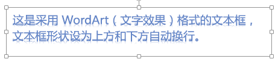
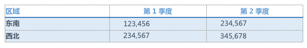
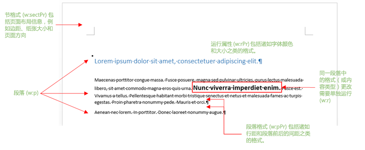
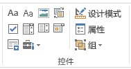

# <a name="create-better-add-ins-for-word-with-office-open-xml"></a>使用 Office Open XML 创建更优质的 Word 加载项

**提供者：** Stephanie Krieger，Microsoft Corporation | Juan Balmori Labra，Microsoft Corporation

如果你要构建Office在 Word 中运行的外接程序，你可能已经知道，Office JavaScript API (Office.js) 提供了多种阅读和写入文档内容的格式。 这些称为强制类型，包括纯文本、表格、HTML 以及 Office Open XML。

因此，当您需要向文档添加多种格式的内容（如图像、格式化表格、图表，甚至仅为格式化文本）时，会进行什么选择？你可以使用 HTML 来插入一些多种格式内容的类型，例如图片。HTML 强制转换可能有一些缺点，例如对内容可用的格式设置和定位选项的限制，具体取决于你的方案。由于 Office Open XML 是用于编写 Word 文档（例如 .docx 和 .dotx）的语言，因此您可以使用用户可以应用的几乎任何类型的格式设置插入用户可以添加到 Word 文档中的几乎任何类型的内容。确定需要完成的 Office Open XML 标记比你想象的容易。

> [!NOTE]
> Office Open XML 也是 PowerPoint 和 Excel（以及 Office 2013 及更高版本中的 Visio）文档的技术支持语言。不过，目前只能在 Office Word 加载项中将内容强制转换为 Office Open XML。若要详细了解 Office Open XML（包括完整语言参考文档），请参阅[其他资源](#see-also)。

开始之前，请查看可以使用 Office Open XML 强制转换插入的内容类型。下载代码示例 [Word-Add-in-Load-and-write-Open-XML](https://github.com/OfficeDev/Word-Add-in-Load-and-write-Open-XML)，其中包含在 Word 中插入以下任何示例所需的 Office Open XML 标记和 Office.js 代码。

> [!NOTE]
> 在整篇文章中，术语 **内容** 类型和 **丰富** 内容指可以插入到 Word 文档中的丰富内容类型。


*图 1：应用了直接格式的文本*


无论用户文档中的现有格式如何，都可以使用直接格式精确指定文本的外观。

*图 2：使用样式格式化的文本*


可以使用样式自动协调插入用户文档的文本的外观。

*图 3：简单图像*


可以使用相同的方法，插入 Office 支持的所有格式图像。

*图 4：使用图片样式和效果格式化的图像*


向图像应用优质格式和效果所需的标记比预期要少。

*图 5：内容控件*


可以结合使用加载项和内容控件，将内容添加到指定（绑定）位置，而不是随意选择的位置。

*图 6：应用了艺术字格式的文本框*




文本效果可用于 Word 中的文本框文本（如此处所示），也可用于常规正文文本。

*图 7：形状*


可以插入带/不带文本和格式效果的内置或自定义绘图形状。

*图 8：应用了直接格式的表格*




可以包括文本格式、边框、阴影、单元格尺寸调整或所需的任何表格格式。

*图 9：使用表格样式格式化的表格*


可以使用内置或自定义表格样式，就像对文本使用段落样式一样简单。

*图 10：SmartArt 图表*


Office提供了各种 SmartArt 图表布局 (并且您可以使用 Office Open XML 创建自己的) 。

*图 11：图表*


你可以在 Word 文档中插入 Excel 图表作为实时图表，这也意味着你可以在 Word 外接程序中使用这些图表。如上述示例中所示，你可以使用 Office Open XML 强制转换，以插入用户可以插入其自己的文档中的几乎任何类型的内容。获取所需的 Office Open XML 标记有两种简单的方法。将多种格式的内容添加到一个原本空白的 Word 文档中，然后将文件保存为 Word XML 文档格式，或通过 [getSelectedDataAsync](/javascript/api/office/office.document#getSelectedDataAsync_coercionType__options__callback_) 方法，使用测试外接程序来捕捉标记。两种方法都可以获得几乎相同的结果。


> [!NOTE]
> Office Open XML 文档实际上是表示文档内容的文件压缩包。 将文件保存为 Word XML 文档格式可为您提供平展到一个 XML 文件的整个Office Open XML 包，这也是使用 检索 Open XML 标记Office `getSelectedDataAsync` 获取的内容。

如果从 Word 中将文件保存为 XML 格式，请注意“另存为”对话框的“另存为类型”列表下有两个适用于 .xml 格式文件的选项。 请确保选择“Word XML 文档”而非“Word 2003”选项。
下载名为 [Word-Add-in-Get-Set-EditOpen-XML](https://github.com/OfficeDev/Word-Add-in-Get-Set-EditOpen-XML) 的代码示例，该示例可以用作检索和测试标记的工具。
这就是全部内容吗？ 并不完全是。 是的，对于很多方案而言，你可以使用通过上述任意方法得到的完整的平展 Office Open XML 结果，且其可行。 好消息是，你可能无需大部分标记。
如果你是首次看到 Office Open XML 标记的众多外接程序开发人员之一，尝试了解为最简单的内容获取的大量标记可能会令人不知所措，但无需如此。
在本主题中，我们将使用从 Office 外接程序开发人员社区听到的一些常见方案向你展示用于简化 Office Open XML 以便在外接程序中使用的技术。 我们将探讨针对之前所述的部分类型的内容的标记以及最大限度减少 Office Open XML 负载所需的信息。 我们还会介绍将多种格式的内容插入文档的活动选择区时所需的代码，以及如何将 Office Open XML 与绑定对象结合使用以在指定位置添加或替换内容。

## <a name="exploring-the-office-open-xml-document-package"></a>探讨 Office Open XML 文档包


在使用 [getSelectedDataAsync](/javascript/api/office/office.document#getSelectedDataAsync_coercionType__options__callback_) 检索选定内容的 Office Open XML 时（或在将文档保存为 Word XML 文档格式时），获取的内容不仅仅是描述选定内容的标记；它是带有您几乎肯定不需要的多个选项和设置的整个文档。事实上，如果对包含任务窗格外接程序的文档使用此方法，则获取的标记甚至包括您的任务窗格。

即使是简单的 Word 文档包，除了实际内容的部件之外，还包括文档属性、样式、主题（格式设置）、Web 设置、字体等的部件。

例如，假设您只想要插入直接格式的文本段落，如前面图 1 中所示。 使用 获取Office格式文本的 Open XML 时 `getSelectedDataAsync` ，会看到大量标记。 这些标记包括表示整个文档的数据包元素，其中包含多个部件（通常称为文档部件，在 Office Open XML 中称为数据包部件），如图 13 中所示。 每个部件表示数据包中的一个单独文件。

> [!TIP]
> 您可以在文本编辑器Office Open XML 标记，如记事本。 如果在 Visual Studio 中打开它，可以使用编辑 >**Advanced > Format Document** (Ctrl+K，Ctrl+D) 设置包的格式，以便更轻松地编辑。 然后可以折叠或展开文档部件或各部分，如图 12 中所示，以便更轻松地查看和编辑 Office Open XML 包的内容。 每个文档部件都以 **pkg:part** 标记开头。


*图 12：折叠和展开包部分以便在 Visual Studio 中更轻松地编辑*


*图 13：基本 Word Office Open XML 文档包中的各部分*


通过所有标记，您会惊奇地发现您真正需要插入格式化文本示例的元素就是 .rels 部件和 document.xml 部件的片段。


> [!NOTE]
> 包标记上方有两行标记（版本 XML 声明和 Office 程序 ID）的前提是，使用 Office Open XML 强制转换类型，因此无需将它们包括在内。若要将编辑过的标记打开为 Word 文档以进行测试，请保留这两行标记。

本主题开始介绍的多个其他类型的内容也需要其他部件（图 13 中所示之外的部件），我们将在本主题中稍后介绍。同时，您将看到图 13 中所示的任何 Word 文档包标记中的大部分部件，因此此处有一个关于每个部件的作用以及何时需要这些部件的快速摘要。


- 数据包标记内部的第一个部件是 .rels 文件，它定义数据包顶级各部件之间的关系（通常为文档属性、缩略图(如果有)，以及主文档正文）。标记中始终需要部件中的一些内容，因为您需要将（内容所在的）主文档部件的关系定义为文档包。

- document.xml.rels 部分定义了 document.xml（正文）部分（若有）所需的其他部分的关系。


   > [!IMPORTANT]
   > 数据包（如顶级 .rels、document.xml.rels 以及其他可以看到的特定内容类型的数据包）中的 .rels 文件是一个非常重要的工具，您可以将其作为指南，帮助您快速编辑 Office Open XML 数据包。若要了解有关详细信息，请参阅本主题后面的[创建您自己的标记：最佳做法](#creating-your-own-markup-best-practices)。


- document.xml 部件是文档正文中的内容。您当然需要此部件的元素，因为它正好是内容显示的位置。但您并不需要在此部件中看到的所有内容。我们将在后面详细介绍。

- 在使用 Office Open XML 强制转换将内容插入到文档中时，很多部件会自动被 Set 方法忽略，因此您可能还要删除它们。这些部件包括 theme1.xml 文件（文档的格式主题）、文档属性部件（核心、外接程序和缩略图），以及设置文件（包括设置、webSettings 和 fontTable）。

- 在图 1 示例中，直接应用文本格式（即单独应用每个字体和段落格式设置）。但是，如果按前面的图 2 中所示使用样式（例如，如果您想让文本在目标文档中自动呈现“Heading 1”样式），则您可能需要部分 styles.xml 部件及其关系定义。有关详细信息，请参阅主题节“[添加使用其他 Office Open XML 部件的对象](#adding-objects-that-use-additional-office-open-xml-parts)”。


## <a name="inserting-document-content-at-the-selection"></a>在选定内容插入文档内容


我们来看看图 1 中所示的格式化文本示例所需的最少的 Office Open XML 标记，以及在文档的活动选定区插入此标记所需的 JavaScript。


### <a name="simplified-office-open-xml-markup"></a>简化的 Office Open XML 标记

如上文所述，我们已经编辑了此处所示的 Office Open XML 示例，以仅保留需要的文档部件以及每个部件中需要的元素。我们将在本主题的下一节中逐步完成自己编辑标记的步骤（并对此处遗留的片段作进一步解释）。


```XML
<pkg:package xmlns:pkg="http://schemas.microsoft.com/office/2006/xmlPackage">
  <pkg:part pkg:name="/_rels/.rels" pkg:contentType="application/vnd.openxmlformats-package.relationships+xml" pkg:padding="512">
    <pkg:xmlData>
      <Relationships xmlns="http://schemas.openxmlformats.org/package/2006/relationships">
        <Relationship Id="rId1" Type="http://schemas.openxmlformats.org/officeDocument/2006/relationships/officeDocument" Target="word/document.xml"/>
      </Relationships>
    </pkg:xmlData>
  </pkg:part>
  <pkg:part pkg:name="/word/document.xml" pkg:contentType="application/vnd.openxmlformats-officedocument.wordprocessingml.document.main+xml">
    <pkg:xmlData>
      <w:document xmlns:w="http://schemas.openxmlformats.org/wordprocessingml/2006/main" >
        <w:body>
          <w:p>
            <w:pPr>
              <w:spacing w:before="360" w:after="0" w:line="480" w:lineRule="auto"/>
              <w:rPr>
                <w:color w:val="70AD47" w:themeColor="accent6"/>
                <w:sz w:val="28"/>
              </w:rPr>
            </w:pPr>
            <w:r>
              <w:rPr>
                <w:color w:val="70AD47" w:themeColor="accent6"/>
                <w:sz w:val="28"/>
              </w:rPr>
              <w:t>This text has formatting directly applied to achieve its font size, color, line spacing, and paragraph spacing.</w:t>
            </w:r>
          </w:p>
        </w:body>
      </w:document>
    </pkg:xmlData>
  </pkg:part>
</pkg:package>
```


> [!NOTE]
> 如果将此处所示的标记与 version XML 声明标记和 mso-application 一起添加到 XML 文件（如图 13 所示，后两行标记位于文件顶部），可以在 Word 中将它打开为 Word 文档。 或者，如果没有这些标记，您仍可以使用"在 Word 中打开> **打开** 它。 You'll see **Compatibility Mode** on the title bar in Word， because you removed the settings that tell Word this is a Word document. 由于要向现有 Word 文档添加此标记，这完全不会影响内容。


### <a name="javascript-for-using-setselecteddataasync"></a>使用 setSelectedDataAsync 所需的 JavaScript


将前面的 Office Open XML 保存为解决方案可访问的 XML 文件后，就可以使用以下函数设置使用 Office Open XML 强制转换的文档中的格式化文本内容。 

在此函数中，请注意，除最后一行外的所有代码都用于获取保存的标记，以用于函数末尾的 [setSelectedDataAsync](/javascript/api/office/office.document#setSelectedDataAsync_data__options__callback_) 方法调用。 `setSelectedDataASync` 仅要求您指定要插入的内容和强制类型。


> [!NOTE]
> 将 _yourXMLfilename_ 替换为在解决方案中保存的 XML 文件的名称和路径。如果不确定将 XML 文件保存到解决方案中的哪个位置，或不确定如何在代码中进行引用，请参阅 [Word-Add-in-Load-and-write-Open-XML](https://github.com/OfficeDev/Word-Add-in-Load-and-write-Open-XML) 代码示例查看相关示例，以及本文展示的有效标记和 JavaScript 示例。


```js
function writeContent() {
    var myOOXMLRequest = new XMLHttpRequest();
    var myXML;
    myOOXMLRequest.open('GET', 'yourXMLfilename', false);
    myOOXMLRequest.send();
    if (myOOXMLRequest.status === 200) {
        myXML = myOOXMLRequest.responseText;
    }
    Office.context.document.setSelectedDataAsync(myXML, { coercionType: 'ooxml' });
}
```


## <a name="creating-your-own-markup-best-practices"></a>创建自己的标记：最佳做法


让我们来仔细看看您插入前面的格式化文本示例需要的标记。

对于此示例，首先只需从数据包（而不是 .rels 和 document.xml）中删除所有文档部件。然后，我们将编辑两个必需的部件以进一步简化。


> [!IMPORTANT]
> 请将 .rels 部分用作地图，以快速判断包中内容，并确定可以完全删除的部分（即与内容不相关或内容未引用的任何部分）。请注意，必须在包中定义每个文档部分的关系，这些关系显示在 .rels 文件中。因此，应该能够看到所有关系在 .rels、document.xml.rels 或内容专用 .rels 文件中列出。

以下标记说明了编辑之前所需的 .rels 部件。我们删除的是外接程序和核心文档属性部件，以及缩略图部件，因此还需要从 .rels 删除这些关系。请注意，这将仅保留 document.xml 的关系（和以下示例中的关系 ID“rID1”）。


```XML
<pkg:part pkg:name="/_rels/.rels" pkg:contentType="application/vnd.openxmlformats-package.relationships+xml" pkg:padding="512">
  <pkg:xmlData>
    <Relationships xmlns="http://schemas.openxmlformats.org/package/2006/relationships">
      <Relationship Id="rId3" Type="http://schemas.openxmlformats.org/package/2006/relationships/metadata/core-properties" Target="docProps/core.xml"/>
      <Relationship Id="rId2" Type="http://schemas.openxmlformats.org/package/2006/relationships/metadata/thumbnail" Target="docProps/thumbnail.emf"/>
      <Relationship Id="rId1" Type="http://schemas.openxmlformats.org/officeDocument/2006/relationships/officeDocument" Target="word/document.xml"/>
      <Relationship Id="rId4" Type="http://schemas.openxmlformats.org/officeDocument/2006/relationships/extended-properties" Target="docProps/app.xml"/>
    </Relationships>
  </pkg:xmlData>
</pkg:part>
```


> [!IMPORTANT]
> 删除从包中完全删除的任何部分的关系（即 **Relationship** 标记）。无论是添加没有定义相应关系的部分，还是删除部分但其关系保留在包中，都会导致错误发生。

下面的标记展示了 document.xml 部分，其中包括编辑前的示例格式化文本内容。

```XML
<pkg:part pkg:name="/word/document.xml" pkg:contentType="application/vnd.openxmlformats-officedocument.wordprocessingml.document.main+xml">
    <pkg:xmlData>
      <w:document mc:Ignorable="w14 w15 wp14" xmlns:wpc="http://schemas.microsoft.com/office/word/2010/wordprocessingCanvas" xmlns:mc="http://schemas.openxmlformats.org/markup-compatibility/2006" xmlns:o="urn:schemas-microsoft-com:office:office" xmlns:r="http://schemas.openxmlformats.org/officeDocument/2006/relationships" xmlns:m="http://schemas.openxmlformats.org/officeDocument/2006/math" xmlns:v="urn:schemas-microsoft-com:vml" xmlns:wp14="http://schemas.microsoft.com/office/word/2010/wordprocessingDrawing" xmlns:wp="http://schemas.openxmlformats.org/drawingml/2006/wordprocessingDrawing" xmlns:w10="urn:schemas-microsoft-com:office:word" xmlns:w="http://schemas.openxmlformats.org/wordprocessingml/2006/main" xmlns:w14="http://schemas.microsoft.com/office/word/2010/wordml" xmlns:w15="http://schemas.microsoft.com/office/word/2012/wordml" xmlns:wpg="http://schemas.microsoft.com/office/word/2010/wordprocessingGroup" xmlns:wpi="http://schemas.microsoft.com/office/word/2010/wordprocessingInk" xmlns:wne="http://schemas.microsoft.com/office/word/2006/wordml" xmlns:wps="http://schemas.microsoft.com/office/word/2010/wordprocessingShape">
        <w:body>
          <w:p>
            <w:pPr>
              <w:spacing w:before="360" w:after="0" w:line="480" w:lineRule="auto"/>
              <w:rPr>
                <w:color w:val="70AD47" w:themeColor="accent6"/>
                <w:sz w:val="28"/>
              </w:rPr>
            </w:pPr>
            <w:r>
              <w:rPr>
                <w:color w:val="70AD47" w:themeColor="accent6"/>
                <w:sz w:val="28"/>
              </w:rPr>
              <w:t>This text has formatting directly applied to achieve its font size, color, line spacing, and paragraph spacing.</w:t>
            </w:r>
            <w:bookmarkStart w:id="0" w:name="_GoBack"/>
            <w:bookmarkEnd w:id="0"/>
          </w:p>
          <w:p/>
          <w:sectPr>
            <w:pgSz w:w="12240" w:h="15840"/>
            <w:pgMar w:top="1440" w:right="1440" w:bottom="1440" w:left="1440" w:header="720" w:footer="720" w:gutter="0"/>
            <w:cols w:space="720"/>
          </w:sectPr>
        </w:body>
      </w:document>
    </pkg:xmlData>
</pkg:part>
```

由于 document.xml 是您放置内容的主要文档部件，我们来快速了解一下此部件的各个方面。（列表后的图 14 提供了可视化参考，说明此处解释的一些相关核心内容和格式标记如何与您在 Word 文档中看到的内容关联。）


- 打开的 **w:document** 标记包括若干个命名空间 (**xmlns**) 列表。其中许多命名空间指的是特定类型的内容，您仅在它们与内容相关时才需要它们。

    请注意，文档部分的标记前缀引用回命名空间。 在此示例中，在整个 document.xml 部分标记中使用的唯一前缀是 **w：**，因此我们需要在打开的 **w：document** 标记中保留的唯一命名空间是 **xmlns：w**。


> [!TIP]
> 若要在 Visual Studio 中编辑标记，请在删除任何部分中的命名空间后，仔细检查相应部分的所有标记。如果删除的是标记的必需命名空间，受影响标记的相关前缀下面会显示红色的弯曲下划线。如果删除 **xmlns:mc** 命名空间，还必须删除命名空间列表前面的 **mc:Ignorable** 属性。


- 可以在打开的正文标记内看到段落标记 (**w:p**)，其中包含此示例的内容。

- **w:pPr** 标记包括直接应用的段落格式的属性，如段落之前或之后的空格、段落对齐方式或缩进。（直接格式指单独应用于内容（而不是作为样式的一部分）的属性。）此标记还包括应用于整个段落的直接字体格式，在嵌套 **w:rPr**（run 属性）标记中，它包括示例中的字体颜色和大小设置。


   > [!NOTE]
   > 可能会注意到，Word Office Open XML 标记中的字号和其他一些格式设置看起来是实际大小的两倍。这是因为段落和行间距以及前面标记所示的一些部分格式属性以缇为单位（磅的二十分之一）。可能还会看到其他多个度量单位，包括用于一些 Office 艺术字 (drawingML) 值的英制单位（914,400 EMU 等于 1 英寸），以及在 drawingML 和 PowerPoint 标记中使用的 100,000 倍实际值，具体视要在 Office Open XML 中使用的内容类型而定。PowerPoint 还将某些值表示为实际值的 100 倍，而 Excel 则通常使用实际值。


- 段落中任何具有相似属性的内容都包括在运行 (**w:r**) 中，如示例文本中的情况。每次格式或内容类型发生更改时，就开始新的运行。（也就是说，如果示例文本中只有一个字是粗体，将会分离到自己的运行中。）本示例中的内容仅包括这一个文本运行。

    请注意，由于本示例中包括的格式是字体格式（即可以应用于一个字符的格式），它还在单独的 run 属性中显示。

- 还要注意，隐藏的“_GoBack”书签（**w:bookmarkStart** 和 **w:bookmarkEnd**）的标记默认显示在 Word 文档中。始终可以从标记中删除 GoBack 书签的起始标记和结束标记。

- 文档正文的最后一部分是 **w:sectPr** 标记或分节属性。此标记包括边距和页面方向等设置。您使用 **setSelectedDataAsync** 插入的内容将默认呈现在目标文档中的活动部分属性上。因此，除非您的内容包括分节符（能看到多个 **w:sectPr** 标记），否则无法删除此标记。


*图 14：document.xml 中的常见标记与 Word 文档内容和布局的对应关系*



> [!TIP]
> 在创建的标记中，可能还会看到多个标记中有另一个属性，其中包含字符 **w:rsid**（本主题使用的示例中没有此属性）。这些是修订标识符，用于 Word 中的“合并文档”功能，且默认处于启用状态。使用加载项插入标记时，无需使用这些标识符，可以禁用它们，从而简化标记。既能轻松删除现有 RSID 标记，也能禁用此功能（如以下过程所述），这样就不会向新内容的标记添加这些标识符了。

请注意，如果您在 Word 中使用“共同创作”功能（例如与他人同时编辑文档的功能），应在为外接程序完成生成标记后，再次启用此功能。

要在 Word 中关闭你创建的文档的 RSID 属性，请执行以下操作： 

1. 在 Word 中，选择“文件”，然后选择“选项”。
2. 在“Word 选项”对话框中，选择“**信任中心**”，然后选择“**信任中心设置**”。
3. 在“信任中心”对话框中，选择“隐私选项”，然后禁用“存储随机数以提高组合精确性”设置。

若要从现有文档中删除 RSID 标记，请尝试在 Open XML 中打开文档时Office快捷方式。


1. 在文档正文中的插入点处按 **Ctrl+Home** 转到文档顶端。
2. 在键盘上依次按“**空格**”、“**Delete**”、“**空格**”。然后保存文档。

从此数据包中删除了大部分标记后，只剩下需要为示例插入的最少标记，如上一节中所述。


## <a name="using-the-same-office-open-xml-structure-for-different-content-types"></a>针对不同内容类型使用相同的 Office Open XML 结构


几种类型的多种格式的内容仅需要前面示例中显示的 .rels 和 document.xml 组件，包括内容控件、Office 绘图形状、文本框及表格（除非将样式应用于表格）。事实上，您可以重用已编辑过的相同数据包部件，并仅为内容标记置换出 document.xml 中的 **body** 内容。

若要查看前面图 5 到图 8 中每个内容类型示例的 Office Open XML 标记，可以浏览“概述”部分中引用的 [Word-Add-in-Load-and-write-Open-XML](https://github.com/OfficeDev/Word-Add-in-Load-and-write-Open-XML) 代码示例。

在继续本主题内容之前，我们来看看几个内容类型要注意的差别，以及如何置换出所需的片段。


### <a name="understanding-drawingml-markup-office-graphics-in-word-what-are-fallbacks"></a>了解 Word 中的 drawingML 标记（Office 图形）：什么是回退？

如果形状或文本框的标记看起来要比预期的复杂得多，这是有原因的。我们看到在 Office 2007 版本中引入了 Office Open XML 格式，以及 PowerPoint 和 Excel 完全采用的新 Office 图形引擎。在 2007 版本中，Word 仅并入部分图形引擎，即采用更新的 Excel 图表引擎、SmartArt 图形，以及高级图片工具。对于形状和文本框，Word 2007 继续使用旧的绘图对象 (VML)。Word 在 2010 版本中使用图形引擎执行了其他步骤，以合并更新的图形和绘图工具。

因此，为了在 Word 2007 中打开 Office Open XML 格式 Word 文档时支持形状和文本框，形状（包括文本框）需要回退 VML 标记。

通常情况下，对于 [Word-Add-in-Load-and-write-Open-XML](https://github.com/OfficeDev/Word-Add-in-Load-and-write-Open-XML) 代码示例中包括的形状和文本框示例，可以删除回退标记。保存文档后，Word 会自动将缺失的回退标记添加到形状中。但是，如果您更想保留回退标记以确保支持所有用户方案，也不会带来危害。

如果内容包括分组绘图对象，您将看到其他（以及明显重复的）标记，但这是必须保留的。当组中包含对象时，绘图形状的标记部分会被复制。


> [!IMPORTANT]
> 若要使用文本框和绘图形状，请务必先仔细检查命名空间，再将它们从 document.xml 中删除。（或者，若要通过另一个对象类型重用标记，请务必添加回之前可能从 document.xml 中删除的任何必需命名空间。）document.xml 中默认包含的命名空间的重要组成部分旨在满足绘图对象要求。


#### <a name="about-graphic-positioning"></a>关于图形位置

在代码示例 [Word-Add-in-Load-and-write-Open-XML](https://github.com/OfficeDev/Word-Add-in-Load-and-write-Open-XML) 和 [Word-Add-in-Get-Set-EditOpen-XML](https://github.com/OfficeDev/Word-Add-in-Get-Set-EditOpen-XML) 中，使用不同类型的文字环绕和位置设置来设置文本框和形状。（还要注意这些代码示例中的图像示例都根据文本格式进行设置，将图形对象置于文本基线上。）

这些代码示例中的形状的位置相对于页面右边距和下边距进行调整。相对位置可让您更容易协调用户的未知文档设置，因为它将调整用户的边距，并降低由于纸张大小、方向或边距设置而带来的外观突兀的风险。若要在插入图形对象时保留相对位置设置，必须保留存储位置（在 Word 中称为“定位标记”）的段落标记 (w:p)。如果将内容插入现有段落标记，而不是包含自己的标记，您可能可以保留相同的初始可视状态，但很多使位置自动调整用户布局的相对引用类型可能会丢失。


### <a name="working-with-content-controls"></a>使用内容控件

内容控件是 Word 中的重要功能，此功能可以通过多种方式大大增强 Word 外接程序的功能，包括使您可以在文档中的指定位置（而不仅仅是选定内容处）插入内容。

在 Word 中，内容控件位于功能区的“开发人员”选项卡上，如图 15 所示。


*图 15：Word 中“开发人员”选项卡上的控件组*



Word 中的内容控件类型包括格式文本、纯文本、图片、构建基块库、复选框、下拉列表、组合框、日期选取器，以及重复节。


- 使用图 15 中所示的“Properties”命令编辑控件标题，并设置首选项（如隐藏控件容器）。

- 启用“设计模式”编辑控件中的占位符内容。

If your add-in works with a Word template, you can include controls in that template to enhance the behavior of the content. You can also use XML data binding in a Word document to bind content controls to data, such as document properties, for easy form completion or similar tasks.  (在"插入"选项卡上的"快速部件.文档"下查找已绑定到 Word中内置文档属性) 

您在通过外接程序使用内容控件时，还可以使用不同类型的绑定大幅扩展外接程序可以进行操作的选项。可以从外接程序中绑定内容控件，然后将内容写入到绑定（而不是活动的选定内容）。


> [!NOTE]
> 请勿将 Word 中的 XML 数据绑定与通过加载项绑定到控件的功能混淆。它们是完全独立的两种功能。不过，可以将命名内容控件添加到通过加载项使用 OOXML 强制转换插入的内容中，再使用加载项中的代码绑定到这些控件。

还要注意 XML 数据绑定和 Office.js 都可以与您应用程序中的自定义 XML 部件交互，因此可以集成这些强大的工具。若要了解有关如何使用 Office JavaScript API 中的自定义 XML 部件的信息，请参阅本主题的[其他资源](#see-also)一节。

本主题的下一节介绍如何在 Word 外接程序中使用绑定。首先，我们来看看插入可以使用外接程序绑定到的格式文本内容控件所需的 Office Open XML 示例。


> [!IMPORTANT]
> RTF 格式文本控件是可用于在加载项中绑定到内容控件的唯一内容控件类型。


```XML
<pkg:package xmlns:pkg="http://schemas.microsoft.com/office/2006/xmlPackage">
  <pkg:part pkg:name="/_rels/.rels" pkg:contentType="application/vnd.openxmlformats-package.relationships+xml" pkg:padding="512">
    <pkg:xmlData>
      <Relationships xmlns="http://schemas.openxmlformats.org/package/2006/relationships">
        <Relationship Id="rId1" Type="http://schemas.openxmlformats.org/officeDocument/2006/relationships/officeDocument" Target="word/document.xml"/>
      </Relationships>
    </pkg:xmlData>
  </pkg:part>
  <pkg:part pkg:name="/word/document.xml" pkg:contentType="application/vnd.openxmlformats-officedocument.wordprocessingml.document.main+xml">
    <pkg:xmlData>
      <w:document xmlns:w="http://schemas.openxmlformats.org/wordprocessingml/2006/main" xmlns:w15="http://schemas.microsoft.com/office/word/2012/wordml" >
        <w:body>
          <w:p/>
          <w:sdt>
              <w:sdtPr>
                <w:alias w:val="MyContentControlTitle"/>
                <w:id w:val="1382295294"/>
                <w15:appearance w15:val="hidden"/>
                <w:showingPlcHdr/>
              </w:sdtPr>
              <w:sdtContent>
                <w:p>
                  <w:r>
                  <w:t>[This text is inside a content control that has its container hidden. You can bind to a content control to add or interact with content at a specified location in the document.]</w:t>
                </w:r>
                </w:p>
              </w:sdtContent>
            </w:sdt>
          </w:body>
      </w:document>
    </pkg:xmlData>
  </pkg:part>
 </pkg:package>
```

如前所述，内容控件（如格式化文本）不需要其他文档部件，因此此处仅包含 .rels 和 document.xml 部件的编辑后版本。

您在 document.xml 正文中看到的 **w:sdt** 标记表示内容控件。如果生成了内容控件的 Office Open XML 标记，则会看到此示例中已删除了多个属性，包括标记和文档部件属性。仅保留了基本的（及几个最佳做法）元素，如下所示：


- 别名 **是** Word 中"内容控件属性"对话框中的标题属性。 如果您计划从外接程序中绑定到控件，则需要此属性（代表项目的名称）。

- 唯一的 **id** 是必需的属性。如果从外接程序中绑定到控件，则 ID 为绑定在文档中用于标识适用的命名内容控件的属性。

- appearance 属性用于隐藏控件容器，使外观更简洁。 此功能在 Word 2013 中引入，通过使用 w15 命名空间可以看到。 由于使用了此属性，w15 命名空间会保留在 document.xml 部件的开头。

- **showingPlcHdr** 属性是一个可选设置，用于设置您包含在此示例中的控件文本 (的默认内容，) 占位符内容。 因此，如果用户在控制区域单击或点按，则选中整个内容，而不是对用户可以更改的可编辑内容进行操作。

- 尽管 **sdt** 标记前面的空段落标记 (**w:p/**) 不是添加内容控件所必需的（并且将在 Word 文档中的控件上方添加垂直间距），它仍确保控件位于其段落中。它的重要性取决于将在控件中添加的内容的类型和格式。

- 如果您想要绑定控件，则控件的默认内容（位于 **sdtContent** 标记中）必须至少包括一个完整的段落（如此示例中所示），以使绑定接受多段落多种格式的内容。


> [!NOTE]
> 从此示例 **w:sdt** 标记中删除的文档部分属性可能显示在内容控件中，以在可以存储占位符内容信息的包中引用单独部分（各部分位于 Office Open XML 包的词汇表目录下）。尽管文档部分是用于 Office Open XML 包中 XML 部分（即文件）的术语，sdt 属性中使用的术语“文档部分”是指 Word 中的相同术语，用于描述一些内容类型，包括构建基块和文档属性快速部分（例如，内置 XML 数据绑定控件）。如果在 Office Open XML 包中的词汇表目录下看到部分，可能需要在插入的内容包含这些功能时保留这些部分。对于要在加载项中绑定到的典型内容控件，它们不是必需的。只需注意，如果确实从包中删除词汇表部分，还必须从 w:sdt 标记中删除文档部分属性。

下一部分将介绍如何在 Word 加载项中创建和使用绑定。


## <a name="inserting-content-at-a-designated-location"></a>在指定位置插入内容


我们已讨论如何在 Word 文档中的活动选定内容处插入内容。如果绑定到文档中的命名内容控件，则可以插入任何同一种内容类型到此控件。 

您何时想要使用此方法？


- 您何时需要在模板中的指定位置添加或替换内容（如从数据库填充文档各个部分）

- 您何时想要替换正插入到活动选定内容处的内容（如为用户提供设计元素选项）的选项

- 您何时想让用户在文档中添加数据，以使您可以访问并与外接程序一起使用（如根据用户在文档中添加的信息在任务窗格中填充字段）

下载代码示例 [Word-Add-in-JavaScript-AddPopulateBindings](https://github.com/OfficeDev/Word-Add-in-JavaScript-AddPopulateBindings)，此代码示例提供了如何插入并绑定到内容控件及如何填充绑定的可用示例。


### <a name="add-and-bind-to-a-named-content-control"></a>添加并绑定到命名内容控件


在检查后面的 JavaScript 时，请考虑以下要求：


- 如前所述，必须使用富文本控件，以从 Word 外接程序绑定到控件。

- 内容控件必须具有名称， ("内容控件属性"对话框中的"标题"字段，该字段对应于 Office Open XML 标记对话框中的 **Alias**) 。 这是代码标识绑定放置位置的方式。

- 可以具有多个命名空间，并按需要绑定它们。使用唯一的内容控件名称、唯一的内容控件 ID，以及唯一的绑定 ID。


```js
function addAndBindControl() {
    Office.context.document.bindings.addFromNamedItemAsync("MyContentControlTitle", "text", { id: 'myBinding' }, function (result) {
        if (result.status == "failed") {
            if (result.error.message == "The named item does not exist.")
                var myOOXMLRequest = new XMLHttpRequest();
                var myXML;
                myOOXMLRequest.open('GET', '../../Snippets_BindAndPopulate/ContentControl.xml', false);
                myOOXMLRequest.send();
                if (myOOXMLRequest.status === 200) {
                    myXML = myOOXMLRequest.responseText;
                }
                Office.context.document.setSelectedDataAsync(myXML, { coercionType: 'ooxml' }, function (result) {
                    Office.context.document.bindings.addFromNamedItemAsync("MyContentControlTitle", "text", { id: 'myBinding' });
                });
        }
    });
}
```

此处显示的代码执行以下步骤。


- 尝试使用 [addFromNamedItemAsync](/javascript/api/office/office.bindings#addFromNamedItemAsync_itemName__bindingType__options__callback_) 绑定到命名内容控件。

  如果你的外接程序有可能出现这样一种情况，在执行代码时，文档中已存在命名控件，那么请先执行此步骤。例如，如果外接程序已插入并使用已设计为与该外接程序一起使用的模板进行保存，其中事先放置了该控件，那么你需要执行此操作。如果你需要绑定到该外接程序之前放置的控件，那么你也需要执行此操作。

- 对方法的第一次调用中的回调将检查结果的状态，以查看绑定是否由于文档 (（即此示例中名为 `addFromNamedItemAsync` MyContentControlTitle 的内容控件）不存在而失败) 。 如果是，则代码使用 (在活动选择点添加) 控件，然后 `setSelectedDataAsync` 绑定它。


> [!NOTE]
> 如前所述，以及如前面的代码中所示，内容控件的名称用于确定创建绑定的位置。但是，在 Office Open XML 标记中，代码使用内容控件的名称和 ID 属性添加绑定到文档。

代码执行之后，如果检查外接程序在其中创建了绑定的文档标记，则会看到每个绑定有两个部件。 在内容控件的标记中， (document.xml) ，你将看到 **属性 w15：webExtensionLinked/**。

在名为 webExtensions1.xml 的文档部件中，你将看到已创建的绑定列表。每个绑定都使用绑定 ID 和适用控件的 ID 属性进行标识，如下所示，**appref** 属性为内容控件 ID：** **we:binding id="myBinding" type="text" appref="1382295294"/**。


> [!IMPORTANT]
> 必须在要对绑定执行操作时添加绑定。请勿在 Office Open XML 中通过添加绑定标记来插入内容控件，因为插入此标记的过程会删除绑定。


### <a name="populate-a-binding"></a>填充绑定


写入内容到绑定的代码与写入内容到选定内容的代码类似


```js
function populateBinding(filename) {
  var myOOXMLRequest = new XMLHttpRequest();
  var myXML;
  myOOXMLRequest.open('GET', filename, false);
  myOOXMLRequest.send();
  if (myOOXMLRequest.status === 200) {
      myXML = myOOXMLRequest.responseText;
  }
  Office.select("bindings#myBinding").setDataAsync(myXML, { coercionType: 'ooxml' });
}
```

与 `setSelectedDataAsync` 一样，指定要插入的内容和强制类型。 写入到绑定的其他唯一要求是通过 ID 标识绑定。 请注意此代码 (bindings#myBinding) 中使用的绑定 ID 如何与之前函数创建绑定时建立的绑定 ID (myBinding) 相对应。


> [!NOTE]
> 无论是初始填充绑定，还是替换绑定内容，只需运行上述代码即可。如果在绑定位置插入新的内容片断，相应绑定中的现有内容会自动被替换掉。有关示例，请查看前面引用的代码示例 [Word-Add-in-JavaScript-AddPopulateBindings](https://github.com/OfficeDev/Word-Add-in-JavaScript-AddPopulateBindings)，其中提供了两个独立内容示例，可以交替使用它们来填充同一个绑定。


## <a name="adding-objects-that-use-additional-office-open-xml-parts"></a>添加使用其他 Office Open XML 部分的对象


很多内容类型都需要 Office Open XML 数据包中的其他文档部件，这意味着它们要么在另一个部件中引用信息，要么将内容本身存储在一个或多个其他部件中，并在 document.xml 中引用。

例如，考虑以下情况：


- 使用格式样式（如前面图 2 中所示的带样式的文本，以及图 9 中所示的带样式的表格）的内容需要 styles.xml 部件。

- 图像（如图 3 和图 4 中所示）包括一个（有时是两个）其他部件中的二进制图像数据。

- SmartArt 图表（如图 10 中所示）需要多个其他部件来说明布局和内容。

- 图表（如图 11 中所示）需要多个其他部件，包括其自身的关系 (.rels) 部件。

您可以在前面引用的代码示例 [Word-Add-in-Load-and-write-Open-XML](https://github.com/OfficeDev/Word-Add-in-Load-and-write-Open-XML) 中看到所有这些内容类型已编辑的标记示例。可以使用前面所述的（以及在引用的代码示例中提供的）同一个 JavaScript 代码插入所有这些内容类型，以在活动选定内容处插入内容，并使用绑定将内容写入到指定的位置。

探索示例前，先来看看使用每个内容类型的一些提示。


> [!IMPORTANT]
> 请注意，若要保留 document.xml 中引用的其他任何部分，需要保留 document.xml.rels 和要保留的适用部分（如 styles.xml 或图像文件）的关系定义。


### <a name="working-with-styles"></a>使用样式

在使用段落样式或表格样式设置内容格式时，适用与编辑如前所示的直接格式文本示例的标记相同的方法。但是，使用段落样式的标记相当简单，因此在此处作为说明的示例。


#### <a name="editing-the-markup-for-content-using-paragraph-styles"></a>使用段落样式编辑内容标记

以下标记表示图 2 中带样式文本示例的正文内容。


```XML
<w:body>
  <w:p>
    <w:pPr>
      <w:pStyle w:val="Heading1"/>
    </w:pPr>
    <w:r>
      <w:t>This text is formatted using the Heading 1 paragraph style.</w:t>
    </w:r>
  </w:p>
</w:body>
```


> [!NOTE]
> 可以看到，使用样式时，document.xml 中格式化文本的标记非常简单，因为样式包含需要单独引用的所有段落和字体格式。不过，如前所述，建议将样式或直接格式用于不同用途：使用直接格式可以指定文本外观，而不考虑用户文档中的格式；使用段落样式（尤其是内置段落样式名称，如此处所示的“标题 1”），可以让文本格式自动与用户文档进行协调。

样式的使用是阅读和了解插入内容标记重要性的一个很好的例子，因为对于此处是否引用另一个文档部件尚不明确。如果此标记中包括样式定义，但不包括 styles.xml 部件，则 document.xml 中的样式信息将会被忽略，不管该样式是否在用户的文档中使用。

但是，如果查看 styles.xml 部件，您将会看到，在编辑用于您的外接程序的标记时，所需要的仅仅是长段标记中的一小部分：


- styles.xml 部件默认包括多个命名空间。如果您仅保留内容必需的样式信息，则在大多数情况下，仅需要保留 **xmlns:w** 命名空间。

- 如果通过外接程序插入标记，并且标记可删除，则样式部件顶部的 **w:docDefaults** 标记内容将被忽略。

- styles.xml 部件中最长的标记是针对 **w:latentStyles** 标记的，显示在 docDefaults 之后，提供每个可用样式的信息（如“样式”窗格和“样式”库的外观属性）。如果通过外接程序插入内容，并且内容可删除，则此信息也将被忽略。

- 在隐藏的样式信息后面，可以看到生成标记的文档中所使用的每个样式的定义。这包括创建新文档时使用的一些可能与内容不相关的默认样式。您可以删除内容未使用的任何样式的定义。


   > [!NOTE]
   > 每个内置标题样式都有关联的字符样式，即相同标题格式的字符样式版本。除非已将标题样式应用为字符样式，否则可以删除它。如果将样式用作字符样式，它显示在 document.xml 中的 run 属性标记 (**w:rPr**)（而不是 paragraph 属性 (**w:pPr**) 标记）内。仅当已将样式应用到部分段落时，才能这么做，但这也会在没有正确应用样式时无意间发生。


- 如果在内容中使用内置样式，则无需包括完整的定义，仅需包括样式名称、样式 ID，以及至少一个格式属性，以使强制转换的 Office Open XML 将此样式应用到插入的内容。

    但是，最佳做法是包含一个完整的样式定义（即使它是内置样式的默认值）。如果样式已在目标文档中使用，你的内容将采用该样式的常驻定义，而不考虑 styles.xml 中包含的内容。如果该样式尚未在目标文档中使用，你的内容将使用标记中提供的样式。

因此，对于图 2 中所示的示例文本（使用标题 1 样式设置格式）的 styles.xml 部件中，我们需要保留的唯一内容如下：


> [!NOTE]
> “Heading 1”样式的完整 Word 定义在本示例中已保留。


```XML
<pkg:part pkg:name="/word/styles.xml" pkg:contentType="application/vnd.openxmlformats-officedocument.wordprocessingml.styles+xml">
  <pkg:xmlData>
    <w:styles xmlns:w="http://schemas.openxmlformats.org/wordprocessingml/2006/main" >
      <w:style w:type="paragraph" w:styleId="Heading1">
        <w:name w:val="heading 1"/>
        <w:basedOn w:val="Normal"/>
        <w:next w:val="Normal"/>
        <w:link w:val="Heading1Char"/>
        <w:uiPriority w:val="9"/>
        <w:qFormat/>
        <w:pPr>
          <w:keepNext/>
          <w:keepLines/>
          <w:spacing w:before="240" w:after="0" w:line="259" w:lineRule="auto"/>
          <w:outlineLvl w:val="0"/>
        </w:pPr>
        <w:rPr>
          <w:rFonts w:asciiTheme="majorHAnsi" w:eastAsiaTheme="majorEastAsia" w:hAnsiTheme="majorHAnsi" w:cstheme="majorBidi"/>
          <w:color w:val="2E74B5" w:themeColor="accent1" w:themeShade="BF"/>
          <w:sz w:val="32"/>
          <w:szCs w:val="32"/>
        </w:rPr>
      </w:style>
    </w:styles>
  </pkg:xmlData>
</pkg:part>
```


#### <a name="editing-the-markup-for-content-using-table-styles"></a>使用表格样式编辑内容标记


当您的内容使用表格样式时，需要与“使用段落样式”中所述的 styles.xml 相关部件相同的部件。也就是说，仅需保留您内容中使用的样式信息，且必须包括名称、ID 以及至少一个格式属性，但如果能包括完整的样式定义以解决所有潜在用户方案将会更好。

然而，当查看同时用于 document.xml 中的表格和 styles.xml 中的表格样式定义的标记时，您会看到比使用段落样式时多得多的标记。


- 在 document.xml 中，即使格式包括在样式内，单元格也会应用该格式。使用表格样式不会减少标记的数量。在内容中使用表格样式的好处是，更新非常简单，且很容易协调多个表格的外观。

- 在 styles.xml 中，您将会看到单个表格样式也会有大量标记，这是由于表格样式针对每个表格区域包括多种可能的格式属性类型，如整个表格、标题行、奇数和偶数带状行和列（单独的）、首列等。


### <a name="working-with-images"></a>使用图像


图像的标记包括一个对至少一个部件的引用，该部件包含用以说明图像的二进制数据。对于复杂的图像，可能有数百页的标记，并且无法进行编辑。由于无需涉及二进制部件，在使用结构化编辑器（如 Visual Studio）时可以简单地将其折叠，因此您仍可以很轻松地查看并编辑数据包的其余部分。

如果查看图 3 中所示简单图像的示例标记（该标记可用于前面引用的示例代码 [Word-Add-in-Load-and-write-Open-XML](https://github.com/OfficeDev/Word-Add-in-Load-and-write-Open-XML) 中），您会看到 document.xml 中的图像标记包括大小和位置信息，以及对包含二进制图像数据的部件的关系引用。该引用包括在 **a:blip** 标记中，如下所示：


```XML
<a:blip r:embed="rId4" cstate="print">
```

请注意，由于关系引用由 (**r:embed="rID4"**) 明确使用，并且为了呈现图像，相关部件是必需的，如果 Office Open XML 数据包中未包括二进制数据，则会出现错误。这与前面所述的 styles.xml 有所不同，在 styles.xml 中不会引发错误，因为没有明确引用关系，且关系是为内容提供属性的部件，而非其本身成为内容的一部分。


> [!NOTE]
> 查看标记时，请注意 a:blip 标记中使用的其他命名空间。 你将在 document.xml 看到 **xlmns：a** 命名空间 (主 drawingML 命名空间) 被动态放置在 drawingML 引用的开头，而不是 document.xml 部件的顶部。 然而，关系命名空间 (r) 必须保留在其所显示的 document.xml 开头位置。 检查其他命名空间要求的图片标记。 请注意，无需记住哪种内容类型需要哪个命名空间，您通过查看整个 document.xml 中的标记前缀就能很容易地分辨出来。


### <a name="understanding-additional-image-parts-and-formatting"></a>了解其他图像部分和格式


在图像上使用某些 Office 图片格式效果时（如图 4 中所示的图像，该图像除使用图片样式之外，还使用已调整的亮度和对比度设置），可能需要针对图像数据的 HD 格式副本的第二个二进制数据部件。考虑分层效果的格式需要这个额外的 HD 格式，并且对该格式的引用显示在 document.xml 中，类似于以下内容：


```XML
<a14:imgLayer r:embed="rId5">
```

请在 [Word-Add-in-Load-and-write-Open-XML](https://github.com/OfficeDev/Word-Add-in-Load-and-write-Open-XML) 代码示例中参阅图 4 中所示的（使用分层效果等）带格式图像所需的标记。


### <a name="working-with-smartart-diagrams"></a>使用 SmartArt 图表


SmartArt 图表具有四个关联的部件，但始终需要的只有两个。您可以检查 [Word-Add-in-Load-and-write-Open-XML](https://github.com/OfficeDev/Word-Add-in-Load-and-write-Open-XML) 代码示例中的 SmartArt 标记示例。首先，了解一下每个部件的简要说明，以及为什么需要/不需要这些部件：


> [!NOTE]
> 如果内容包括多个图表，它们会进行连续编号，替换此处列出的文件名中的“1”。


- layout1.xml：此部件是必需的。它包括布局外观和功能的标记定义。

- data1.xml：此部件是必需的。它包括图表实例中使用的数据。

- drawing1.xml：此部件不是始终必需的，但如果将自定义格式应用到图表实例中的元素（如直接格式化各个形状），则可能需要保留它。

- colors1.xml：此部件不是必需的。它包括颜色样式信息，但图表的颜色会默认与目标文档中活动格式主题的颜色协调，这取决于保存 Office Open XML 标记之前，从 Word 中的“SmartArt 工具设计”选项卡应用的 SmartArt 颜色样式。

- quickStyles1.xml：此部件不是必需的。与颜色部件相似，如果图表将采用已应用 SmartArt 样式（可用于目标文档中）的定义（也就是说，它会自动与目标文档中的格式主题协调），则可以删除此部件。


> [!TIP]
> SmartArt layout1.xml 文件很好地示范了可以进一步修整标记的位置，但额外花时间这样做可能并不值得，因为只会删除与整个包相关的少量标记。若要从标记中清除所有代码行，可以删除 **dgm:sampData** 标记及其内容。此示例数据定义了如何在 SmartArt 样式库中显示图表的缩略图预览。不过，如果省略，使用的是默认示例数据。

请注意，document.xml 中 SmartArt 图表的标记包含对布局、数据、颜色和快速样式部件的关系 ID 引用。 在删除这些部件及其关系定义（由于删除的是这些关系，则确定是此操作的最佳做法）时，可以删除 document.xml 中对颜色和样式部件的引用，但如果保留它们，则不会产生错误，因为它们不是将图表插入文档中所必需的。 在 **dgm:relIds** 标签中的 document.xml 中查找这些引用。 不管是否执行此步骤，都要保留所需的布局和数据部件的关系 ID 引用。


### <a name="working-with-charts"></a>使用图表


类似于 SmartArt 图表，图表包含多个其他部件。 但是，图表的配置与 SmartArt 有所不同，区别在于图表有其自身的关系文件。 以下是图表的必需和可移动文档部件的说明。


> [!NOTE]
> 对于 SmartArt 图表，如果内容包括多个图表，则会将它们连续编号，替换此处列出的文件名称中的“1”。


- document.xml.rels 引用了包含图表 (chart1.xml) 描述数据的必需部分。

- 您还会看到 Office Open XML 数据包中每个图表单独的关系文件，如 chart1.xml.rels。

    chart1.xml.rels 中共引用了三个文件，但只有一个是必需的。其中包括二进制 Excel 工作簿数据（必需）和可以删除的颜色和样式部件（colors1.xml 和 styles1.xml）。

可以在本机 Word 中创建并编辑的图表为 Excel 图表，其数据在作为二进制数据嵌入 Office Open XML 数据包的 Excel 工作簿上进行维护。与图像的二进制数据部件类似，此 Excel 二进制数据也是必需的，但此部件中没有要编辑的内容。因此您只需在编辑器中折叠此部件，从而避免需要手动滚动全部内容来检查 Office Open XML 数据包的剩余部分。

但是，类似于 SmartArt，您可以删除颜色和样式部件。如果使用了可用的图表样式和颜色样式来为图表设置格式，则图表将在插入目标文档时自动呈现为适用的格式。

请在 [Word-Add-in-Load-and-write-Open-XML](https://github.com/OfficeDev/Word-Add-in-Load-and-write-Open-XML) 代码示例中参阅图 11 中所示的示例图表的已编辑标记。


## <a name="editing-the-office-open-xml-for-use-in-your-task-pane-add-in"></a>编辑 Office Open XML 以用于任务窗格外接程序


您已经了解如何标识并编辑标记中的内容。 如果查看为文档生成的大量 Office Open XML 包时任务仍似乎有困难，以下是推荐步骤的快速摘要，可帮助你快速编辑该包。


> [!NOTE]
> 请记住，您可以使用数据包中的所有 .rels 部件作为地图，以快速检查可以删除的文档部件。


1. 在 Visual Studio 中打开平展的 XML 文件，并按 Ctrl+K 和 Ctrl+D 设置文件格式。然后使用左侧的折叠/展开按钮折叠需要删除的部件。您可能还想要折叠需要但无需编辑的长部件（如图像文件的 base64 二进制数据），以使标记可以更快速更容易地进行可视化浏览。

2. 在准备用于加载项的 Office Open XML 标记时，文档包的几个部分几乎总是可以删除。 建议首先删除这些部分（及其关联的关系定义），这将立即大大减少包。 这些包括 theme1、fontTable、设置、webSettings、缩略图以及核心和加载项属性文件以及任何 `taskpane` 或 `webExtension` 部分。

3. 删除与您内容不相关的任何部件，例如，不需要的脚注、页眉或页脚。请记住，还要删除其关联的关系。

4. 查看 document.xml.rels 部件以查看该部件中引用的任何文件（如图像文件、样式部件或 SmartArt 图表部件）是否是您的内容所必需的。删除您的内容不需要的所有部件的关系，并确认还删除了其关联的部件。如果您的内容不需要 document.xml.rels 中引用的任何文档部件，则也可以删除该文件。

5. 如果您的内容具有其他 .rels 部件（如 chart#.xml.rels），则查看是否有可以删除的其他引用部件（如图表的快速样式），并从该文件中和关联的部件中删除关系。

6. 编辑 document.xml 以删除部件中未引用的命名空间、删除内容未包括分节符时的节属性，以及删除与您想要插入的内容不相关的所有标记。如果插入的是形状或文本框，您可能还想删除扩展的回退标记。

7. 对删除大量标记不会影响您内容的情况下，对任何其他所需部件进行编辑，如样式部件。

执行了前面七个步骤之后，您就有可能剪切 90% - 100% 的可删除标记，这取决于您的内容。大多数情况下，可以按照您想要剪裁的多少进行。

无论是保留，还是选择深入内容以查找可以剪切的每一行标记，都请记住，您可以使用前面引用的代码示例 [Word-Add-in-Get-Set-EditOpen-XML](https://github.com/OfficeDev/Word-Add-in-Get-Set-EditOpen-XML) 作为便签簿以快速简单地测试已编辑标记。

> [!TIP]
> 如果在开发期间更新现有解决方案中的 Office Open XML 代码片段，请先清除 Internet 临时文件，再重新运行解决方案，以更新代码使用的 Office Open XML。 解决方案中 XML 文件包含的标记会缓存到计算机。 当然，您可以从默认 Web 浏览器中清除 Internet 临时文件。 若要访问 Internet 选项，并删除 Visual Studio 2019 内的这些设置，在"调试"菜单上，选择"选项 **"。** 然后，在“环境”下，选择“Web 浏览器”，然后选择“Internet Explorer 选项”。

## <a name="creating-an-add-in-for-both-template-and-stand-alone-use"></a>创建用于模板和独立使用的加载项

在本主题中，您了解到外接程序中可以使用 Office Open XML 进行操作的多个示例。我们了解了可以使用 Office Open XML 强制转换类型插入到文档中的各种多种格式的内容类型示例，以及在选定内容或指定（限制）位置插入该内容的 JavaScript 方法。

如果您创建的是可独立使用（即从应用商店或专有服务器位置插入的），也可在预先创建的模板（设计为与外接程序一起使用）中使用的外接程序，您还需要了解什么内容？答案应该是，您已经了解了所有所需的内容。

无论外接程序是设计为独立使用，还是与模板一起使用，给定内容类型和插入方法的标记都相同。如果您使用的模板是设计为与外接程序一起使用，请确保 JavaScript 包括回退，该回退用于说明引用的内容可能存在于文档中的方案（如“[添加并绑定到命名内容控件](#add-and-bind-to-a-named-content-control)”一节中所示的绑定示例中所演示的）。

通过应用使用模板时，无论外接程序是在用户创建文档时常驻在模板中，还是外接程序将插入模板，您都可能还想结合 API 的其他元素，以帮助您创建更可靠的交互式体验。例如，您可能想要在自定义 XML 部件中包括标识数据，以便可以使用此标识数据确定模板类型，从而为用户提供特定于模板的选项。若要了解有关如何在外接程序中使用自定义 XML 的详细信息，请参阅下面的“其他资源”部分。


## <a name="see-also"></a>另请参阅

- [Office JavaScript API](../reference/javascript-api-for-office.md)
- [标准 ECMA-376：Office Open XML 文件格式](https://www.ecma-international.org/publications/standards/Ecma-376.htm)（其中收录了 Open XML 的完整语言参考和相关文档）
- [探索 javaScript API Office：数据绑定和自定义 XML 部件](/archive/msdn-magazine/2013/april/microsoft-office-exploring-the-javascript-api-for-office-data-binding-and-custom-xml-parts)