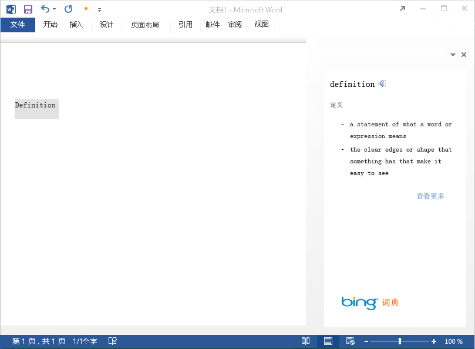
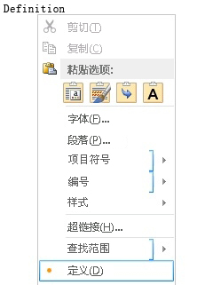
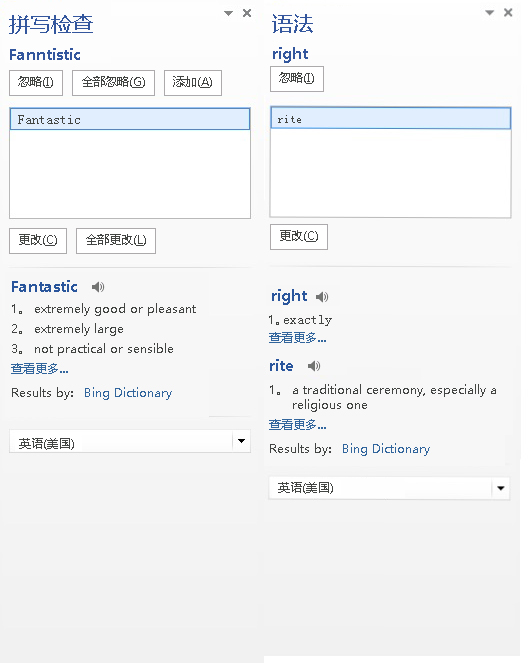
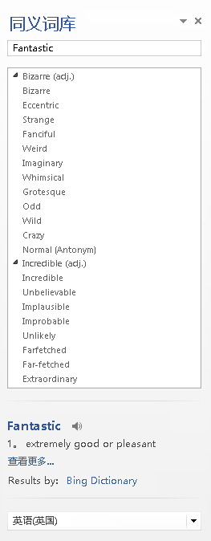
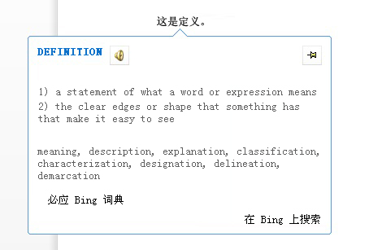
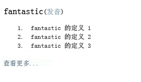

# <a name="create-a-dictionary-task-pane-add-in"></a><span data-ttu-id="a3f09-103">创建字典任务窗格加载项</span><span class="sxs-lookup"><span data-stu-id="a3f09-103">Create a dictionary task pane add-in</span></span>


<span data-ttu-id="a3f09-104">本文中的示例展示了任务窗格加载项和随附 Web 服务，用于提供用户当前在 Word 2013 文档中选择的内容的字典定义或同义词库同义词。</span><span class="sxs-lookup"><span data-stu-id="a3f09-104">This article shows you an example of a task pane add-in with an accompanying web service that provides dictionary definitions or thesaurus synonyms for the user's current selection in a Word 2013 document.</span></span> 

<span data-ttu-id="a3f09-105">字典 Office 外接程序基于标准任务窗格外接程序，它具有附加功能来支持在 Office 应用程序的 UI 中的其他位置查询和显示字典 XML Web 服务的定义。</span><span class="sxs-lookup"><span data-stu-id="a3f09-105">A dictionary Office Add-in is based on the standard task pane add-in with additional features to support querying and displaying definitions from a dictionary XML web service in additional places in the Office application's UI.</span></span> 

<span data-ttu-id="a3f09-p101">在典型的字典任务窗格加载项中，用户在文档中选择某字词或短语，加载项依据的 JavaScript 逻辑将此选定内容传递给字典提供程序的 XML Web 服务。然后，字典提供程序的网页更新为，向用户显示选定内容的定义。XML Web 服务组件最多以 OfficeDefinitions XML 架构定义的格式返回三个定义，然后会在主机 Office 应用的 UI 中的其他位置向用户显示这些定义。图 1 展示了用户选择的内容，以及 Word 2013 中运行的必应品牌字典加载项显示的内容。</span><span class="sxs-lookup"><span data-stu-id="a3f09-p101">In a typical dictionary task pane add-in, a user selects a word or phrase in their document, and the JavaScript logic behind the add-in passes this selection to the dictionary provider's XML web service. The dictionary provider's webpage then updates to show the definitions for the selection to the user. The XML web service component returns up to three definitions in the format defined by the OfficeDefinitions XML schema, which are then displayed to the user in other places in the hosting Office application's UI. Figure 1 shows the selection and display experience for a Bing-branded dictionary add-in that is running in Word 2013.</span></span>

<span data-ttu-id="a3f09-110">*图 1：显示选定字词的定义的字典加载项*</span><span class="sxs-lookup"><span data-stu-id="a3f09-110">*Figure 1. Dictionary add-in displaying definitions for the selected word*</span></span>



<span data-ttu-id="a3f09-112">由你来决定是单击字典外接程序的 HTML  UI 中的"查看更多"链接在任务窗格中显示更多信息，还是打开单独的浏览器窗口来显示选定单词或短语的完整网页。</span><span class="sxs-lookup"><span data-stu-id="a3f09-112">It is up to you to determine if clicking the **See More** link in the dictionary add-in's HTML UI displays more information within the task pane or opens a separate browser window to the full webpage for the selected word or phrase.</span></span>
<span data-ttu-id="a3f09-113">图 2 显示“定义”上下文菜单命令，允许用户快速启动已安装的字典。</span><span class="sxs-lookup"><span data-stu-id="a3f09-113">Figure 2 shows the **Define** context menu command that enables users to quickly launch installed dictionaries.</span></span> <span data-ttu-id="a3f09-114">图 3 至 5 显示了 Office 用户界面中使用字典 XML 服务提供 Word 2013 定义的位置。</span><span class="sxs-lookup"><span data-stu-id="a3f09-114">Figures 3 through 5 show the places in the Office UI where the dictionary XML services are used to provide definitions in Word 2013.</span></span>

<span data-ttu-id="a3f09-115">*图 2.定义上下文菜单中的命令*</span><span class="sxs-lookup"><span data-stu-id="a3f09-115">*Figure 2. Define command in the context menu*</span></span>




<span data-ttu-id="a3f09-117">*图 3.“拼写”和“语法”窗格中的定义*</span><span class="sxs-lookup"><span data-stu-id="a3f09-117">*Figure 3. Definitions in the Spelling and Grammar panes*</span></span>




<span data-ttu-id="a3f09-119">*图 4.“同义词库”窗格中的定义*</span><span class="sxs-lookup"><span data-stu-id="a3f09-119">*Figure 4. Definitions in the Thesaurus pane*</span></span>




<span data-ttu-id="a3f09-121">*图 5.“阅读模式”中的定义*</span><span class="sxs-lookup"><span data-stu-id="a3f09-121">*Figure 5. Definitions in Reading Mode*</span></span>



<span data-ttu-id="a3f09-123&quot;>若要创建可提供字典查找的任务窗格外接程序，需创建两个主要组件：</span><span class=&quot;sxs-lookup&quot;><span data-stu-id=&quot;a3f09-123&quot;>To create a task pane add-in that provides a dictionary lookup, you create two main components:</span></span> 


- <span data-ttu-id=&quot;a3f09-124&quot;>XML Web 服务，该服务从字典服务中查找定义，然后以字典加载项可以使用和显示的 XML 格式返回这些值。</span><span class=&quot;sxs-lookup&quot;><span data-stu-id=&quot;a3f09-124&quot;>An XML web service that looks up definitions from a dictionary service, and then returns those values in an XML format that can be consumed and displayed by the dictionary add-in.</span></span>
    
- <span data-ttu-id=&quot;a3f09-125&quot;>任务窗格加载项，它将用户的当前选择提交至字典 Web 服务，显示定义，还可以选择将这些值插入文档。</span><span class=&quot;sxs-lookup&quot;><span data-stu-id=&quot;a3f09-125&quot;>A task pane add-in that submits the user's current selection to the dictionary web service, displays definitions, and can optionally insert those values into the document.</span></span>
    
<span data-ttu-id=&quot;a3f09-126&quot;>以下各节提供了有关如何创建这些组件的示例。</span><span class=&quot;sxs-lookup&quot;><span data-stu-id=&quot;a3f09-126&quot;>The following sections provide examples of how to create these components.</span></span>

## <a name=&quot;creating-a-dictionary-xml-web-service&quot;></a><span data-ttu-id=&quot;a3f09-127&quot;>创建字典 XML Web 服务</span><span class=&quot;sxs-lookup&quot;><span data-stu-id=&quot;a3f09-127&quot;>Creating a dictionary XML web service</span></span>


<span data-ttu-id=&quot;a3f09-p103&quot;>XML Web 服务必须将对 Web 服务的查询作为符合 OfficeDefinitions XML 架构的 XML 返回。以下两节介绍了 OfficeDefinitions XML 架构，并提供有关如何对返回该 XML 格式查询的 XML Web 服务编码的示例。</span><span class=&quot;sxs-lookup&quot;><span data-stu-id=&quot;a3f09-p103&quot;>The XML web service must return queries to the web service as XML that conforms to the OfficeDefinitions XML schema. The following two sections describe the OfficeDefinitions XML schema, and provide an example of how to code an XML web service that returns queries in that XML format.</span></span>


### <a name=&quot;officedefinitions-xml-schema&quot;></a><span data-ttu-id=&quot;a3f09-130&quot;>OfficeDefinitions XML 架构</span><span class=&quot;sxs-lookup&quot;><span data-stu-id=&quot;a3f09-130&quot;>OfficeDefinitions XML schema</span></span>

<span data-ttu-id=&quot;a3f09-131&quot;>以下代码显示用于 OfficeDefinitions XML 架构的 XSD。</span><span class=&quot;sxs-lookup&quot;><span data-stu-id=&quot;a3f09-131&quot;>The following code shows the XSD for the OfficeDefinitions XML Schema.</span></span>


```XML
<?xml version=&quot;1.0&quot; encoding=&quot;utf-8&quot;?>
<xs:schema
  xmlns:xsi=&quot;http://www.w3.org/2001/XMLSchema-instance&quot;
  xmlns:xs=&quot;https://www.w3.org/2001/XMLSchema&quot;
  targetNamespace=&quot;http://schemas.microsoft.com/NLG/2011/OfficeDefinitions&quot;
  xmlns=&quot;http://schemas.microsoft.com/NLG/2011/OfficeDefinitions&quot;>
  <xs:element name=&quot;Result&quot;>
    <xs:complexType>
      <xs:sequence>
        <xs:element name=&quot;SeeMoreURL&quot; type=&quot;xs:anyURI&quot;/>
        <xs:element name=&quot;Definitions&quot; type=&quot;DefinitionListType&quot;/>
      </xs:sequence>
    </xs:complexType>
  </xs:element>
  <xs:complexType name=&quot;DefinitionListType&quot;>
    <xs:sequence>
      <xs:element name=&quot;Definition&quot; maxOccurs=&quot;3&quot;>
        <xs:simpleType>
          <xs:restriction base=&quot;xs:normalizedString&quot;>
            <xs:maxLength value=&quot;400&quot;/>
          </xs:restriction>
        </xs:simpleType>
      </xs:element>
    </xs:sequence>
  </xs:complexType>
</xs:schema>
```

<span data-ttu-id=&quot;a3f09-132&quot;>返回的符合 OfficeDefinitions 架构的 XML 包含一个根元素，其中包含一个从零到三个子元素的元素，每个子元素包含长度不超过 `Result` `Definitions` `Definition` 400 个字符的定义。</span><span class=&quot;sxs-lookup&quot;><span data-stu-id=&quot;a3f09-132&quot;>Returned XML that conforms to the OfficeDefinitions schema consists of a root `Result` element that contains a `Definitions` element with from zero to three `Definition` child elements, each of which contains definitions that are no more than 400 characters in length.</span></span> <span data-ttu-id=&quot;a3f09-133&quot;>此外，必须在 元素中提供字典网站上完整页面的 `SeeMoreURL` URL。</span><span class=&quot;sxs-lookup&quot;><span data-stu-id=&quot;a3f09-133&quot;>Additionally, the URL to the full page on the dictionary site must be provided in the `SeeMoreURL` element.</span></span> <span data-ttu-id=&quot;a3f09-134&quot;>以下示例演示返回的符合 OfficeDefinitions 架构的 XML 的结构。</span><span class=&quot;sxs-lookup&quot;><span data-stu-id=&quot;a3f09-134&quot;>The following example shows the structure of returned XML that conforms to the OfficeDefinitions schema.</span></span>

```XML
<?xml version=&quot;1.0&quot; encoding=&quot;utf-8&quot;?>
<Result xmlns=&quot;http://schemas.microsoft.com/NLG/2011/OfficeDefinitions&quot;>
  <SeeMoreURL xmlns=&quot;&quot;>www.bing.com/dictionary/search?q=example</SeeMoreURL>
  <Definitions xmlns=&quot;&quot;>
    <Definition>Definition1</Definition>
    <Definition>Definition2</Definition>
    <Definition>Definition3</Definition>
  </Definitions>
 </Result>

```


### <a name=&quot;sample-dictionary-xml-web-service&quot;></a><span data-ttu-id=&quot;a3f09-135&quot;>示例字典 XML Web 服务</span><span class=&quot;sxs-lookup&quot;><span data-stu-id=&quot;a3f09-135&quot;>Sample dictionary XML web service</span></span>

<span data-ttu-id=&quot;a3f09-136&quot;>以下 C# 代码提供了一个有关如何为 XML Web 服务编写代码的简单示例，该服务以 OfficeDefinitions XML 格式返回字典查询的结果。</span><span class=&quot;sxs-lookup&quot;><span data-stu-id=&quot;a3f09-136&quot;>The following C# code provides a simple example of how to write code for an XML web service that returns the result of a dictionary query in the OfficeDefinitions XML format.</span></span>


```cs
using System;
using System.Collections.Generic;
using System.Linq;
using System.Web;
using System.Web.Services;
using System.Xml;
using System.Text;
using System.IO;
using System.Net;

/// <summary>
/// Summary description for _Default
/// </summary>
[WebService(Namespace = &quot;http://tempuri.org/")]
[WebServiceBinding(ConformsTo = WsiProfiles.BasicProfile1_1)]
// To allow this web service to be called from script, using ASP.NET AJAX, uncomment the following line. 
// [System.Web.Script.Services.ScriptService]
public class WebService : System.Web.Services.WebService {

    public WebService () {

        // Uncomment the following line if using designed components 
        // InitializeComponent(); 
    }

    // You can replace this method entirely with your own method that gets definitions
    // from your data source, and then formats it into the OfficeDefinitions XML format. 
    // If you need a reference for constructing the returned XML, you can use this example as a basis.
    [WebMethod]
    public XmlDocument Define(string word)
    {

        StringBuilder sb = new StringBuilder();
        XmlWriter writer = XmlWriter.Create(sb);
        {
            writer.WriteStartDocument();
            
                writer.WriteStartElement("Result", "http://schemas.microsoft.com/NLG/2011/OfficeDefinitions");

            // See More URL should be changed to the dictionary publisher's page for that word on their website.
                    writer.WriteElementString("SeeMoreURL", "http://www.bing.com/search?q=" + word);

                    writer.WriteStartElement("Definitions");
            
                        writer.WriteElementString("Definition", "Definition 1 of " + word);
                        writer.WriteElementString("Definition", "Definition 2 of " + word);
                        writer.WriteElementString("Definition", "Definition 3 of " + word);
                   
                    writer.WriteEndElement();


                writer.WriteEndElement();
            
            writer.WriteEndDocument();
        }
        writer.Close();

        XmlDocument doc = new XmlDocument();
        doc.LoadXml(sb.ToString());

        return doc;
    }
}
```


## <a name="creating-the-components-of-a-dictionary-add-in"></a><span data-ttu-id="a3f09-137">创建字典加载项的组件</span><span class="sxs-lookup"><span data-stu-id="a3f09-137">Creating the components of a dictionary add-in</span></span>


<span data-ttu-id="a3f09-138">字典加载项包含三个主要组件文件：</span><span class="sxs-lookup"><span data-stu-id="a3f09-138">A dictionary add-in consists of three main component files:</span></span>


- <span data-ttu-id="a3f09-139">描述加载项的 XML 清单文件。</span><span class="sxs-lookup"><span data-stu-id="a3f09-139">An XML manifest file that describes the add-in.</span></span>
    
- <span data-ttu-id="a3f09-140">提供加载项 UI 的 HTML 文件。</span><span class="sxs-lookup"><span data-stu-id="a3f09-140">An HTML file that provides the add-in's UI.</span></span>
    
- <span data-ttu-id="a3f09-141">JavaScript 文件，用于提供从文档中获取用户选择的逻辑，将选择作为查询发送给 Web 服务，然后在外接程序的 UI 中显示返回的结果。</span><span class="sxs-lookup"><span data-stu-id="a3f09-141">A JavaScript file that provides logic to get the user's selection from the document, sends the selection as a query to the web service, and then displays returned results in the add-in's UI.</span></span>
    

### <a name="creating-a-dictionary-add-ins-manifest-file"></a><span data-ttu-id="a3f09-142">创建字典加载项的清单文件</span><span class="sxs-lookup"><span data-stu-id="a3f09-142">Creating a dictionary add-in's manifest file</span></span>

<span data-ttu-id="a3f09-143">下面是字典加载项的示例清单文件。</span><span class="sxs-lookup"><span data-stu-id="a3f09-143">The following is an example manifest file for a dictionary add-in.</span></span>


```XML
<?xml version="1.0" encoding="utf-8"?>
<OfficeApp xmlns="http://schemas.microsoft.com/office/appforoffice/1.0" xmlns:xsi="http://www.w3.org/2001/XMLSchema-instance" xsi:type="TaskPaneApp">
  <Id>7164e750-dc86-49c0-b548-1bac57abdc7c</Id>
  <Version>15.0</Version>
  <ProviderName>Microsoft Office Demo Dictionary</ProviderName>
  <DefaultLocale>en-us</DefaultLocale>
  <!--DisplayName is the name that will appear in the user's list of applications.-->
  <DisplayName DefaultValue="Microsoft Office Demo Dictionary" />
  <!--Description is a 2-3 sentence description of this dictionary. -->
  <Description DefaultValue="The Microsoft Office Demo Dictionary is an example built to demonstrate how a publisher could create a dictionary that integrates with Office. It does not return real definitions." />
  <!--IconUrl is the URI for the icon that will appear in the user's list of applications.-->
  <IconUrl DefaultValue="http://officeimg.vo.msecnd.net/_layouts/images/general/office_logo.jpg" />
  <SupportUrl DefaultValue="[Insert the URL of a page that provides support information for the app]" />
  <!--Capabilities specifies the kind of Office application your dictionary add-in will support. You shouldn't have to modify this area.-->
  <Capabilities>
    <Capability Name="Workbook"/>
    <Capability Name="Document"/>
    <Capability Name="Project"/>
  </Capabilities>
  <DefaultSettings>
    <!--SourceLocation is the URL for your dictionary-->
    <SourceLocation DefaultValue="http://christophernlg/ExampleDictionary/DictionaryHome.html" />
  </DefaultSettings>
  <!--Permissions is the set of permissions a user will have to give your dictionary. If you need write access, such as to allow a user to replace the highlighted word with a synonym, use ReadWriteDocument. -->
  <Permissions>ReadDocument</Permissions>
  <Dictionary>
    <!--TargetDialects is the set of regional languages your dictionary contains. For example, if your dictionary applies to Spanish (Mexico) and Spanish (Peru), but not Spanish (Spain), you can specify that here. Do not put more than one language (for example, Spanish and English) here. Publish separate languages as separate dictionaries. -->
    <TargetDialects>
      <TargetDialect>EN-AU</TargetDialect>
      <TargetDialect>EN-BZ</TargetDialect>
      <TargetDialect>EN-CA</TargetDialect>
      <TargetDialect>EN-029</TargetDialect>
      <TargetDialect>EN-HK</TargetDialect>
      <TargetDialect>EN-IN</TargetDialect>
      <TargetDialect>EN-ID</TargetDialect>
      <TargetDialect>EN-IE</TargetDialect>
      <TargetDialect>EN-JM</TargetDialect>
      <TargetDialect>EN-MY</TargetDialect>
      <TargetDialect>EN-NZ</TargetDialect>
      <TargetDialect>EN-PH</TargetDialect>
      <TargetDialect>EN-SG</TargetDialect>
      <TargetDialect>EN-ZA</TargetDialect>
      <TargetDialect>EN-TT</TargetDialect>
      <TargetDialect>EN-GB</TargetDialect>
      <TargetDialect>EN-US</TargetDialect>
      <TargetDialect>EN-ZW</TargetDialect>
    </TargetDialects>
    <!--QueryUri is the address of this dictionary's XML web service (which is used to put definitions in additional contexts, such as the spelling checker.)-->
    <QueryUri DefaultValue="http://christophernlg/ExampleDictionary/WebService.asmx/Define?word="/>
    <!--Citation Text, Dictionary Name, and Dictionary Home Page will be combined to form the citation line (for example, this would produce "Examples by: Microsoft", where "Microsoft" is a hyperlink to http://www.microsoft.com).-->
    <CitationText DefaultValue="Examples by: " />
    <DictionaryName DefaultValue="Microsoft" />
    <DictionaryHomePage DefaultValue="http://www.microsoft.com" />
  </Dictionary>
</OfficeApp>
```

<span data-ttu-id="a3f09-144">以下各节介绍了特定于创建字典加载项清单文件的 元素 `Dictionary` 及其子元素。</span><span class="sxs-lookup"><span data-stu-id="a3f09-144">The `Dictionary` element and its child elements that are specific to creating a dictionary add-in's manifest file are described in the following sections.</span></span> <span data-ttu-id="a3f09-145">有关清单文件中的其他元素的信息，请参阅 [Office 外接程序 XML 清单](../develop/add-in-manifests.md)。</span><span class="sxs-lookup"><span data-stu-id="a3f09-145">For information about the other elements in the manifest file, see [Office Add-ins XML manifest](../develop/add-in-manifests.md).</span></span>


### <a name="dictionary-element"></a><span data-ttu-id="a3f09-146">Dictionary 元素</span><span class="sxs-lookup"><span data-stu-id="a3f09-146">Dictionary element</span></span>


<span data-ttu-id="a3f09-147">指定用于字典外接程序的设置。</span><span class="sxs-lookup"><span data-stu-id="a3f09-147">Specifies settings for dictionary add-ins.</span></span>

 <span data-ttu-id="a3f09-148">**父元素**</span><span class="sxs-lookup"><span data-stu-id="a3f09-148">**Parent element**</span></span>

 `<OfficeApp>`

 <span data-ttu-id="a3f09-149">**子元素**</span><span class="sxs-lookup"><span data-stu-id="a3f09-149">**Child elements**</span></span>

 <span data-ttu-id="a3f09-150">`<TargetDialects>`, `<QueryUri>`, `<CitationText>`, `<DictionaryName>`, `<DictionaryHomePage>`</span><span class="sxs-lookup"><span data-stu-id="a3f09-150">`<TargetDialects>`, `<QueryUri>`, `<CitationText>`, `<DictionaryName>`, `<DictionaryHomePage>`</span></span>

 <span data-ttu-id="a3f09-151">**备注**</span><span class="sxs-lookup"><span data-stu-id="a3f09-151">**Remarks**</span></span>

<span data-ttu-id="a3f09-152">当您创建字典外接程序时，元素及其子元素将添加到任务窗格 `Dictionary` 外接程序的清单中。</span><span class="sxs-lookup"><span data-stu-id="a3f09-152">The `Dictionary` element and its child elements are added to the manifest of a task pane add-in when you create a dictionary add-in.</span></span>


#### <a name="targetdialects-element"></a><span data-ttu-id="a3f09-153">TargetDialects 元素</span><span class="sxs-lookup"><span data-stu-id="a3f09-153">TargetDialects element</span></span>


<span data-ttu-id="a3f09-p106">指定此字典支持的区域语言集。对于字典加载项，此为必需元素。</span><span class="sxs-lookup"><span data-stu-id="a3f09-p106">Specifies the regional languages that this dictionary supports. Required for dictionary add-ins.</span></span>

 <span data-ttu-id="a3f09-156">**父元素**</span><span class="sxs-lookup"><span data-stu-id="a3f09-156">**Parent element**</span></span>

 `<Dictionary>`

 <span data-ttu-id="a3f09-157">**子元素**</span><span class="sxs-lookup"><span data-stu-id="a3f09-157">**Child element**</span></span>

 `<TargetDialect>`

 <span data-ttu-id="a3f09-158">**备注**</span><span class="sxs-lookup"><span data-stu-id="a3f09-158">**Remarks**</span></span>

<span data-ttu-id="a3f09-159">元素 `TargetDialects` 及其子元素指定字典包含的区域语言集。</span><span class="sxs-lookup"><span data-stu-id="a3f09-159">The `TargetDialects` element and its child elements specify the set of regional languages your dictionary contains.</span></span> <span data-ttu-id="a3f09-160">例如，如果字典同时适用于西班牙语（墨西哥）和西班牙语（秘鲁），但不适用于西班牙语（西班牙），可以在此元素中进行指定。</span><span class="sxs-lookup"><span data-stu-id="a3f09-160">For example, if your dictionary applies to both Spanish (Mexico) and Spanish (Peru), but not Spanish (Spain), you can specify that in this element.</span></span> <span data-ttu-id="a3f09-161">请勿在此清单中指定多种语言（例如，西班牙语和英语）。</span><span class="sxs-lookup"><span data-stu-id="a3f09-161">Do not specify more than one language (e.g., Spanish and English) in this manifest.</span></span> <span data-ttu-id="a3f09-162">请将各种语言发布为单独的字典。</span><span class="sxs-lookup"><span data-stu-id="a3f09-162">Publish separate languages as separate dictionaries.</span></span>

 <span data-ttu-id="a3f09-163">**示例**</span><span class="sxs-lookup"><span data-stu-id="a3f09-163">**Example**</span></span>

```XML
<TargetDialects>
  <TargetDialect>EN-AU</TargetDialect>
  <TargetDialect>EN-BZ</TargetDialect>
  <TargetDialect>EN-CA</TargetDialect>
  <TargetDialect>EN-029</TargetDialect>
  <TargetDialect>EN-HK</TargetDialect>
  <TargetDialect>EN-IN</TargetDialect>
  <TargetDialect>EN-ID</TargetDialect>
  <TargetDialect>EN-IE</TargetDialect>
  <TargetDialect>EN-JM</TargetDialect>
  <TargetDialect>EN-MY</TargetDialect>
  <TargetDialect>EN-NZ</TargetDialect>
  <TargetDialect>EN-PH</TargetDialect>
  <TargetDialect>EN-SG</TargetDialect>
  <TargetDialect>EN-ZA</TargetDialect>
  <TargetDialect>EN-TT</TargetDialect>
  <TargetDialect>EN-GB</TargetDialect>
  <TargetDialect>EN-US</TargetDialect>
  <TargetDialect>EN-ZW</TargetDialect>
</TargetDialects>
```


#### <a name="targetdialect-element"></a><span data-ttu-id="a3f09-164">TargetDialect 元素</span><span class="sxs-lookup"><span data-stu-id="a3f09-164">TargetDialect element</span></span>


<span data-ttu-id="a3f09-p108">指定此字典支持的一种区域语言。对于字典加载项，此为必需元素。</span><span class="sxs-lookup"><span data-stu-id="a3f09-p108">Specifies a regional language that this dictionary supports. Required for dictionary add-ins.</span></span>

 <span data-ttu-id="a3f09-167">**父元素**</span><span class="sxs-lookup"><span data-stu-id="a3f09-167">**Parent element**</span></span>

 `<TargetDialects>`

 <span data-ttu-id="a3f09-168">**备注**</span><span class="sxs-lookup"><span data-stu-id="a3f09-168">**Remarks**</span></span>

<span data-ttu-id="a3f09-169">以 RFC1766 `language` 标记格式中指定区域语言的值，如 EN-US。</span><span class="sxs-lookup"><span data-stu-id="a3f09-169">Specify the value for a regional language in the RFC1766  `language` tag format, such as EN-US.</span></span>

 <span data-ttu-id="a3f09-170">**示例**</span><span class="sxs-lookup"><span data-stu-id="a3f09-170">**Example**</span></span>


```XML
<TargetDialect>EN-US</TargetDialect>
```


#### <a name="queryuri-element"></a><span data-ttu-id="a3f09-171">QueryUri 元素</span><span class="sxs-lookup"><span data-stu-id="a3f09-171">QueryUri element</span></span>


<span data-ttu-id="a3f09-p109">指定字典查询服务的终结点。对于字典加载项，此为必需元素。</span><span class="sxs-lookup"><span data-stu-id="a3f09-p109">Specifies the endpoint for the dictionary query service. Required for dictionary add-ins.</span></span>

 <span data-ttu-id="a3f09-174">**父元素**</span><span class="sxs-lookup"><span data-stu-id="a3f09-174">**Parent element**</span></span>

 `<Dictionary>`

 <span data-ttu-id="a3f09-175">**备注**</span><span class="sxs-lookup"><span data-stu-id="a3f09-175">**Remarks**</span></span>

<span data-ttu-id="a3f09-p110">这是字典提供程序的 XML Web 服务的 URI。被正确转义的查询将被追加到此 URI。</span><span class="sxs-lookup"><span data-stu-id="a3f09-p110">This is the URI of the XML web service for the dictionary provider. The properly escaped query will be appended to this URI.</span></span> 

 <span data-ttu-id="a3f09-178">**示例**</span><span class="sxs-lookup"><span data-stu-id="a3f09-178">**Example**</span></span>


```XML
<QueryUri DefaultValue="http://msranlc-lingo1/proof.aspx?q="/>
```


#### <a name="citationtext-element"></a><span data-ttu-id="a3f09-179">CitationText 元素</span><span class="sxs-lookup"><span data-stu-id="a3f09-179">CitationText element</span></span>


<span data-ttu-id="a3f09-p111">指定要在引文中使用的文本。对于字典加载项，此为必需元素。</span><span class="sxs-lookup"><span data-stu-id="a3f09-p111">Specifies the text to use in citations. Required for dictionary add-ins.</span></span>

 <span data-ttu-id="a3f09-182">**父元素**</span><span class="sxs-lookup"><span data-stu-id="a3f09-182">**Parent element**</span></span>

 `<Dictionary>`

 <span data-ttu-id="a3f09-183">**备注**</span><span class="sxs-lookup"><span data-stu-id="a3f09-183">**Remarks**</span></span>

<span data-ttu-id="a3f09-184">此元素指定将在从 Web 服务返回的内容之下的行中显示的引文文本的开头（例如，“Results by:”或“Powered by:”）。</span><span class="sxs-lookup"><span data-stu-id="a3f09-184">This element specifies the beginning of the citation text that will be displayed on a line below the content that is returned from the web service (for example, "Results by: " or "Powered by: ").</span></span>

<span data-ttu-id="a3f09-185">对于此元素，可以使用 元素指定其他区域设置 `Override` 的值。</span><span class="sxs-lookup"><span data-stu-id="a3f09-185">For this element, you can specify values for additional locales by using the `Override` element.</span></span> <span data-ttu-id="a3f09-186">例如，如果用户正在运行 Office 的西班牙语 SKU，但使用的是英语字典，则允许引文行读取“Resultados por: Bing”，而不是“Results by: Bing”。</span><span class="sxs-lookup"><span data-stu-id="a3f09-186">For example, if a user is running the Spanish SKU of Office, but using an English dictionary, this allows the citation line to read "Resultados por: Bing" rather than "Results by: Bing".</span></span> <span data-ttu-id="a3f09-187">有关如何指定其他区域设置的值的详细信息，请参阅 [Office 外接程序 XML 清单](../develop/add-in-manifests.md)中的“为不同区域设置提供设置”一节。</span><span class="sxs-lookup"><span data-stu-id="a3f09-187">For more information about how to specify values for additional locales, see the section "Providing settings for different locales" in [Office Add-ins XML manifest](../develop/add-in-manifests.md).</span></span>

 <span data-ttu-id="a3f09-188">**示例**</span><span class="sxs-lookup"><span data-stu-id="a3f09-188">**Example**</span></span>


```XML
<CitationText DefaultValue="Results by: " />
```


#### <a name="dictionaryname-element"></a><span data-ttu-id="a3f09-189">DictionaryName 元素</span><span class="sxs-lookup"><span data-stu-id="a3f09-189">DictionaryName element</span></span>


<span data-ttu-id="a3f09-p113">指定此字典的名称。对于字典加载项，此为必需元素。</span><span class="sxs-lookup"><span data-stu-id="a3f09-p113">Specifies the name of this dictionary. Required for dictionary add-ins.</span></span>

 <span data-ttu-id="a3f09-192">**父元素**</span><span class="sxs-lookup"><span data-stu-id="a3f09-192">**Parent element**</span></span>

 `<Dictionary>`

 <span data-ttu-id="a3f09-193">**备注**</span><span class="sxs-lookup"><span data-stu-id="a3f09-193">**Remarks**</span></span>

<span data-ttu-id="a3f09-p114">此元素指定引文文本中的链接文本。引文文本显示在从 Web 服务返回的内容之下的行中。</span><span class="sxs-lookup"><span data-stu-id="a3f09-p114">This element specifies the link text in the citation text. Citation text is displayed on a line below the content that is returned from the web service.</span></span>

<span data-ttu-id="a3f09-196">对于此元素，可以指定其他区域设置的值。</span><span class="sxs-lookup"><span data-stu-id="a3f09-196">For this element, you can specify values for additional locales.</span></span>

 <span data-ttu-id="a3f09-197">**示例**</span><span class="sxs-lookup"><span data-stu-id="a3f09-197">**Example**</span></span>

```XML
<DictionaryName DefaultValue="Bing Dictionary" />
```


#### <a name="dictionaryhomepage-element"></a><span data-ttu-id="a3f09-198">DictionaryHomePage 元素</span><span class="sxs-lookup"><span data-stu-id="a3f09-198">DictionaryHomePage element</span></span>


<span data-ttu-id="a3f09-p115">指定字典的主页 URL。对于字典加载项，此为必需元素。</span><span class="sxs-lookup"><span data-stu-id="a3f09-p115">Specifies the URL of the home page for the dictionary. Required for dictionary add-ins.</span></span>

 <span data-ttu-id="a3f09-201">**父元素**</span><span class="sxs-lookup"><span data-stu-id="a3f09-201">**Parent element**</span></span>

 `<Dictionary>`

 <span data-ttu-id="a3f09-202">**备注**</span><span class="sxs-lookup"><span data-stu-id="a3f09-202">**Remarks**</span></span>

<span data-ttu-id="a3f09-p116">此元素指定引文文本中的链接 URL。引文文本显示在从 Web 服务返回的内容之下的行中。</span><span class="sxs-lookup"><span data-stu-id="a3f09-p116">This element specifies the link URL in the citation text. Citation text is displayed on a line below the content that is returned from the web service.</span></span>

<span data-ttu-id="a3f09-205">对于此元素，可以指定其他区域设置的值。</span><span class="sxs-lookup"><span data-stu-id="a3f09-205">For this element, you can specify values for additional locales.</span></span>

 <span data-ttu-id="a3f09-206">**示例**</span><span class="sxs-lookup"><span data-stu-id="a3f09-206">**Example**</span></span>


```XML
<DictionaryHomePage DefaultValue="http://www.bing.com" />
```


### <a name="creating-a-dictionary-add-ins-html-user-interface"></a><span data-ttu-id="a3f09-207">创建字典外接程序的 HTML 用户界面</span><span class="sxs-lookup"><span data-stu-id="a3f09-207">Creating a dictionary add-in's HTML user interface</span></span>

<span data-ttu-id="a3f09-p117">以下两个示例演示用于演示字典外接程序的 UI 的 HTML 和 CSS 文件。若要查看 UI 在外接程序的任务窗格中如何显示，请参阅代码之后的图 6。若要查看 Dictionary.js 文件中 JavaScript 的实现如何为此 HTML UI 提供编程逻辑，请参阅本节后面紧接着的“编写 JavaScript 实现”。</span><span class="sxs-lookup"><span data-stu-id="a3f09-p117">The following two examples show the HTML and CSS files for the UI of the Demo Dictionary add-in. To view how the UI is displayed in the add-in's task pane, see Figure 6 following the code. To see how the implementation of the JavaScript in the Dictionary.js file provides programming logic for this HTML UI, see "Writing the JavaScript implementation" immediately following this section.</span></span>

```HTML
<!DOCTYPE html>
<html>

<head>
<meta http-equiv="X-UA-Compatible" content="IE=Edge"/>

<!--The title will not be shown but is supplied to ensure valid HTML.-->
<title>Example Dictionary</title>

<!--Required library includes.-->
<script type="text/javascript" src="http://ajax.microsoft.com/ajax/4.0/1/MicrosoftAjax.js"></script>
<script type="text/javascript" src="office.js"></script>

<!--Optional library includes.-->
<script type="text/javascript" src="http://ajax.aspnetcdn.com/ajax/jQuery/jquery-1.5.1.js"></script>

<!--App-specific CSS and JS.-->
<link rel="Stylesheet" type="text/css" href="style.css" />
<script type="text/ecmascript" src="dictionary.js"></script>
</head>

<body>
<div id="mainContainer">
    <div id="header">
        <span id="headword"></span>
        <span id="pronunciation">(<a id="pronunciationLink">Pronounce</a>)</span>
    </div>
    <ol id="definitions">
    </ol>
    <div id="SeeMore">
    <a id="SeeMoreLink">See More...</a>
    </div>
</div>
</body>

</html>
```

<span data-ttu-id="a3f09-211">以下示例显示 Style.css 的内容。</span><span class="sxs-lookup"><span data-stu-id="a3f09-211">The following example shows the contents of Style.css.</span></span>

```CSS
#mainContainer
{
    font-family: Segoe UI;
    font-size: 11pt;
}

#headword
{
    font-family: Segoe UI Semibold;
    color: #262626;
}

#pronunciation
{
    margin-left: 2px;
    margin-right: 2px;
}

#definitions
{
    font-size: 8.5pt;
}
a
{
    font-size: 8pt;
    color: #336699;
    text-decoration: none;
}
a:visited
{
    color: #993366;
}
a:hover, a:active
{  
    text-decoration: underline;
}
```

<span data-ttu-id="a3f09-212">*图 6.演示词典 UI*</span><span class="sxs-lookup"><span data-stu-id="a3f09-212">*Figure 6. Demo dictionary UI*</span></span>




### <a name="writing-the-javascript-implementation"></a><span data-ttu-id="a3f09-214">编写 JavaScript 实现</span><span class="sxs-lookup"><span data-stu-id="a3f09-214">Writing the JavaScript implementation</span></span>


<span data-ttu-id="a3f09-p118">以下示例显示 Dictionary.js 文件中的 JavaScript 实现（该文件从外接程序的 HTML 页面调用，以提供演示字典外接程序的编程逻辑）。 该脚本重新使用以前介绍的 XML Web 服务。 脚本作为示例 Web 服务被置于同一目录中时将从该服务获取定义。 它可以通过修改文件顶部的 `xmlServiceURL` 变量来使用符合 XML Web 服务的公用 OfficeDefinitions，然后将拼音的 Bing API 键替换为正确注册的键。</span><span class="sxs-lookup"><span data-stu-id="a3f09-p118">The following example shows the JavaScript implementation in the Dictionary.js file that is called from the add-in's HTML page to provide the programming logic for the Demo Dictionary add-in. This script reuses the XML web service described previously. When placed in the same directory as the example web service, the script will get definitions from that service. It can be used with a public OfficeDefinitions-conforming XML web service by modifying the  `xmlServiceURL` variable at the top of the file, and then replacing the Bing API key for pronunciations with a properly registered one.</span></span>

<span data-ttu-id="a3f09-219">从此实现Office JavaScript API (Office.js) 的主要成员如下：</span><span class="sxs-lookup"><span data-stu-id="a3f09-219">The primary members of the Office JavaScript API (Office.js) that are called from this implementation are as follows:</span></span>


- <span data-ttu-id="a3f09-220">对象的[initialize](/javascript/api/office)事件，在初始化外接程序上下文时引发，并提供对 Document 对象实例的访问权限，该对象实例表示外接程序与之 `Office` 交互的文档。 [](/javascript/api/office/office.document)</span><span class="sxs-lookup"><span data-stu-id="a3f09-220">The [initialize](/javascript/api/office) event of the `Office` object, which is raised when the add-in context is initialized, and provides access to a [Document](/javascript/api/office/office.document) object instance that represents the document the add-in is interacting with.</span></span>
    
- <span data-ttu-id="a3f09-221">[对象的 addHandlerAsync](/javascript/api/office/office.document#addhandlerasync-eventtype--handler--options--callback-)方法，在 函数中调用，为文档的 SelectionChanged 事件添加事件处理程序以 `Document` `initialize` 侦听用户选择更改。 [](/javascript/api/office/office.documentselectionchangedeventargs)</span><span class="sxs-lookup"><span data-stu-id="a3f09-221">The [addHandlerAsync](/javascript/api/office/office.document#addhandlerasync-eventtype--handler--options--callback-) method of the `Document` object, which is called in the `initialize` function to add an event handler for the [SelectionChanged](/javascript/api/office/office.documentselectionchangedeventargs) event of the document to listen for user selection changes.</span></span>
    
- <span data-ttu-id="a3f09-222">对象的 [getSelectedDataAsync](/javascript/api/office/office.document#getselecteddataasync-coerciontype--options--callback-) 方法，当引发事件处理程序以获取用户选择的单词或短语时，在 函数中调用该方法，将其强制转换为 `Document` `tryUpdatingSelectedWord()` `SelectionChanged` 纯 `selectedTextCallback` 文本，然后执行异步回调函数。</span><span class="sxs-lookup"><span data-stu-id="a3f09-222">The [getSelectedDataAsync](/javascript/api/office/office.document#getselecteddataasync-coerciontype--options--callback-) method of the `Document` object, which is called in the `tryUpdatingSelectedWord()` function when the `SelectionChanged` event handler is raised to get the word or phrase the user selected, coerce it to plain text, and then execute the `selectedTextCallback` asynchronous callback function.</span></span>
    
- <span data-ttu-id="a3f09-223">当作为方法的 callback 参数传递的异步回调函数执行时，它将在回调返回时 `selectTextCallback` 获取所选 `getSelectedDataAsync` 文本的值。</span><span class="sxs-lookup"><span data-stu-id="a3f09-223">When the  `selectTextCallback` asynchronous callback function that is passed as the _callback_ argument of the `getSelectedDataAsync` method executes, it gets the value of the selected text when the callback returns.</span></span> <span data-ttu-id="a3f09-224">它从回调的 _selectedText_ 参数 (，该参数的类型为 [AsyncResult](/javascript/api/office/office.asyncresult)) 返回对象的 [value](/javascript/api/office/office.asyncresult#status) `AsyncResult` 属性。</span><span class="sxs-lookup"><span data-stu-id="a3f09-224">It gets that value from the callback's _selectedText_ argument (which is of type [AsyncResult](/javascript/api/office/office.asyncresult)) by using the [value](/javascript/api/office/office.asyncresult#status) property of the returned `AsyncResult` object.</span></span>
    
- <span data-ttu-id="a3f09-p120">`selectedTextCallback` 函数中剩余的代码查询定义的 XML Web 服务。它还调入 Microsoft Translator API，以提供具有所选字词拼音的 .wav 文件的 URL。</span><span class="sxs-lookup"><span data-stu-id="a3f09-p120">The rest of the code in the  `selectedTextCallback` function queries the XML web service for definitions. It also calls into the Microsoft Translator APIs to provide the URL of a .wav file that has the selected word's pronunciation.</span></span>
    
- <span data-ttu-id="a3f09-227">Dictionary.js 中的其余代码会在外接程序的 HTML UI 中显示定义的列表和拼音链接。</span><span class="sxs-lookup"><span data-stu-id="a3f09-227">The remaining code in Dictionary.js displays the list of definitions and the pronunciation link in the add-in's HTML UI.</span></span>
    


```js
// The document the dictionary add-in is interacting with.
var _doc; 
// The last looked-up word, which is also the currently displayed word.
var lastLookup; 
// For demo purposes only!! Get an AppID if you intend to use the Pronunciation service for your feature.
var appID="3D8D4E1888B88B975484F0CA25CDD24AAC457ED8"; 

// The base URL for the OfficeDefinitions-conforming XML web service to query for definitions.
var xmlServiceUrl = "WebService.asmx/Define?Word="; 

// Initialize the add-in. 
// The initialize function is required for all add-ins.
Office.initialize = function (reason) {
    // Checks for the DOM to load using the jQuery ready function.
    $(document).ready(function () {
    // After the DOM is loaded, app-specific code can run.
    // Store a reference to the current document.
    _doc = Office.context.document; 
    // Check whether text is already selected.
    tryUpdatingSelectedWord(); 
    _doc.addHandlerAsync("documentSelectionChanged", tryUpdatingSelectedWord); //Add a handler to refresh when the user changes selection.
    });
}

// Executes when event is raised on user's selection changes, and at initialization time. 
// Gets the current selection and passes that to asynchronous callback method.
function tryUpdatingSelectedWord() {
    _doc.getSelectedDataAsync(Office.CoercionType.Text, selectedTextCallback); 
}

// Async callback that executes when the add-in gets the user's selection.
// Determines whether anything should be done. If so, it makes requests that will be passed to various functions.
function selectedTextCallback(selectedText) {
    selectedText = $.trim(selectedText.value);
    // Be sure user has selected text. The SelectionChanged event is raised every time the user moves the cursor, even if no selection.
    if (selectedText != "") { 
        // Check whether user selected the same word the pane is currently displaying to avoid unnecessary web calls.
        if (selectedText != lastLookup) { 
            // Update the lastLookup variable.
            lastLookup = selectedText; 
            // Set the "headword" span to the word you looked up.
            $("#headword").text(selectedText); 
            // AJAX request to get definitions for the selected word; pass that to refreshDefinitions.
            $.ajax(xmlServiceUrl + selectedText, { dataType: 'xml', success: refreshDefinitions, error: errorHandler }); 
            // AJAX request to the Microsoft Translator APIs. Gets the URL of a WAV file with pronunciation, which is passed to refreshPronunciation. See http://www.microsofttranslator.com/dev for details.
            $.ajax("http://api.microsofttranslator.com/V2/Ajax.svc/Speak?oncomplete=refreshPronunciation&amp;appId=" + appID + "&amp;text=" + selectedText + "&amp;language=en-us", { dataType: 'script', success: null, error: errorHandler }); 
        }
    }
}

// This function is called when the add-in gets back the definitions target word.
// It removes the old definitions and replaces them with the definitions for the current word.
// It also sets the "See More" link.
function refreshDefinitions(data, textStatus, jqXHR) {
    $(".definition").remove();
    // Make a new list item for each returned definition that was returned, set the CSS class, and append it to the definitions div.
    $(data).find("Definition").each(function () {
        $(document.createElement("li")).text($(this).text()).addClass("definition").appendTo($("#definitions"));
    });
    $("#SeeMoreLink").attr("href", $(data).find("SeeMoreURL").text()); //Change the "See More" link to direct to the correct URL.
}

// This function is called when the add-in gets back the link to the pronunciation
// to set the "Pronounce" link to the URL of the .WAV file.
function refreshPronunciation(data) {
    $("#pronunciationLink").attr("href", data);
}

// Basic error handler that writes to a div with id='message'.
function errorHandler(jqXHR, textStatus, errorThrown) {
    document.getElementById('message').innerText += errorThrown;
}

```
