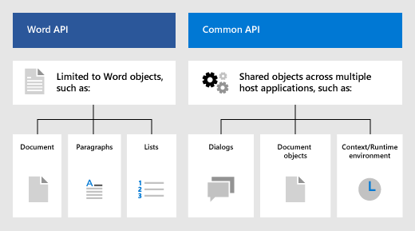

# Office 加载项中的 Word JavaScript 对象模型

本文介绍使用 [Word JavaScript API](../reference/overview/word-add-ins-reference-overview.md) 生成加载项的基本概念。它介绍了使用 API 的基本核心概念。

> [!IMPORTANT]
> 请参阅[使用特定于应用程序的 API 模型](../develop/application-specific-api-model.md)，以了解 Word API 的异步性质以及它们如何与文档协同工作。

## 适用于 Word 的 Office.js API

Word 加载项通过使用 Office JavaScript API 与 Excel 中的对象进行交互，JavaScript API包括两个 JavaScript 对象模型：

* **Word JavaScript API**：[Word JavaScript API](../reference/overview/word-add-ins-reference-overview.md) 提供了强类型的对象，可用于访问文档、范围、表格、列表、格式等。

* **通用 API**：[通用 API](/javascript/api/office) 可用于访问在多种类型的 Office 应用程序中都很常见的 UI、对话框和客户端设置等功能。

你可能会使用 Word JavaScript API 开发面向 Word 的加载项中的大部分功能，同时还可以使用通用 API 中的对象。例如：

* [Context](/javascript/api/office/office.context)：`Context` 对象表示加载项的运行时环境，并提供对 API 的关键对象的访问。 它由文档配置详细信息（如 `contentLanguage` 和 `officeTheme`）组成，并提供有关加载项的运行时环境（如 `host` 和 `platform`）的信息。 此外，它还提供了 `requirements.isSetSupported()` 方法，可用于检查运行加载项的 Excel 应用程序是否支持指定的要求集。
* [Document](/javascript/api/office/office.document)：`Document` 对象提供 `getFileAsync()` 方法，用于下载运行加载项的 Word 文件。

## 特定于 Word 的对象模型

若要了解 Word API，则必须了解文档的各个组件之间如何相互关联。

* **Document** 包含 **Section** 以及设置和自定义 XML 部件等文档级实体。
* **Section** 包含 **Body**。
* 通过 **Body** 可以访问 **Paragraph**、**ContentControl** 和 **Range** 等对象。
* **Range** 表示连续的内容区域，包括文本、空白区域、**Table** 和图像。 此外，它还包含大部分文本操作方法。
* **List** 表示带标号或项目符号的列表中的文本。

## 另请参阅

- [Word JavaScript API 概述](../reference/overview/word-add-ins-reference-overview.md)
- [生成首个 Word 加载项](../quickstarts/word-quickstart.md)
- [Word 加载项教程](../tutorials/word-tutorial.md)
- [Word JavaScript API 参考](/javascript/api/word)
- [了解 Microsoft 365 开发人员计划](https://developer.microsoft.com/microsoft-365/dev-program)
