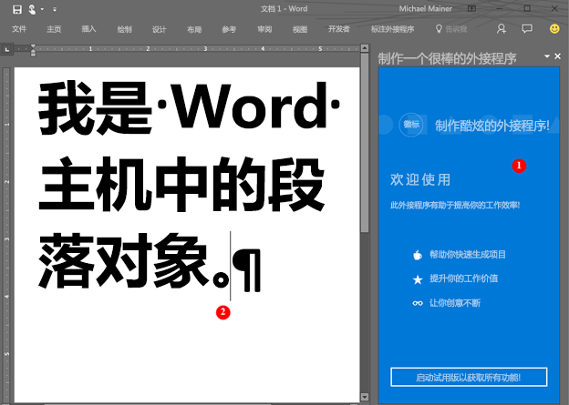

# <a name="word-add-ins-overview"></a>Word 外接程序概述

您想要创建一个解决方案以扩展 Word 功能？例如，涉及自动化文档程序集，或从其他数据源绑定到并访问 Word 文档中的数据。Office 外接程序平台包括 Word JavaScript API 和适用于 Office 的 JavaScript API，可用于扩展在 Windows 桌面、Mac 或云中运行的客户端。

Word 外接程序是 [Office 外接程序平台](../overview/office-add-ins.md)上众多开发选项中的一项。外接程序命令可用于扩展 Word 用户界面并启动运行 JavaScript 并与 Word 文档中内容交互的任务窗格。在浏览器中可以运行的任何代码均可在 Word 外接程序中运行。与 Word 文档内容进行交互的外接程序可创建作用于 Word 对象的请求并同步对象状态。 

>
  **注意：**生成外接程序时，如果计划将外接程序[发布](../publish/publish.md)到 Office 应用商店，请务必遵循 [Office 应用商店验证策略](https://msdn.microsoft.com/en-us/library/jj220035.aspx)。例如，外接程序必须适用于支持你定义的方法的所有平台，才能通过验证（有关详细信息，请参阅[第 4.12 部分](https://msdn.microsoft.com/en-us/library/jj220035.aspx#Anchor_3)以及 [Office 外接程序主机和可用性](https://dev.office.com/add-in-availability)页）。

下图中的示例展示了在任务窗格中运行的 Word 外接程序。

**图 1：在 Word 的任务窗格中运行的外接程序**



Word 外接程序 (1) 可以将请求发送到 Word 文档 (2) 可以使用 JavaScript 来访问段落对象和更新、删除或移动段落。例如，下面的代码演示如何将一个新句子附加到该段落。

```js
Word.run(function (context) {
    var paragraphs = context.document.getSelection().paragraphs;
    paragraphs.load();
    return context.sync().then(function () {
        paragraphs.items[0].insertText(' New sentence in the paragraph.',
                                       Word.InsertLocation.end);
    }).then(context.sync);
});

```

可以使用任何 Web 服务器技术承载 Word 外接程序，如 ASP.NET、NodeJS 或 Python。使用您最喜欢的客户端框架 — Ember、Backbone、Angular、React — 或坚持使用 VanillaJS 开发解决方案，并可以使用类似于 Azure 的服务对应用程序进行[身份验证](../develop/use-the-oauth-authorization-framework-in-an-office-add-in.md)和托管。

通过 Word JavaScript API 可使应用程序访问 Word 文档中的对象和元数据。这些 API 可用于创建面向以下应用程序的外接程序：

* 适用于 Windows 的 Word 2013
* 适用于 Windows 的 Word 2016
* Word Online
* Word 2016 for Mac
* Word for iOS

外接程序只需编写一次，即可跨多个平台在所有版本 Word 中运行。有关详细信息，请参阅 [Office 外接程序主机和平台可用性](https://dev.office.com/add-in-availability)。

## <a name="javascript-apis-for-word"></a>适用于 Word 的 JavaScript API

有两组 JavaScript Api 可用于与 Word 文档中的对象和元数据进行交互。第一组是[适用于 Office 的 JavaScript API](https://dev.office.com/reference/add-ins/javascript-api-for-office?product=word)，在 Office 2013 进行了引入。这是一个共享 API --许多对象可以在由两个或多个 Office 客户端托管的外接程序中使用。此 API 广泛使用回调。 

第二组是 [Word JavaScript API](../../reference/word/word-add-ins-reference-overview.md)。这是强类型对象模型，可用于创建面向适用于 Mac 和 Windows 的 Word 2016 的 Word 外接程序。此对象模型使用承诺模式，并提供对特定于 Word 对象（如[正文](../../reference/word/body.md)、[内容控件](../../reference/word/contentcontrol.md)、[内联图片](../../reference/word/inlinepicture.md)和[段落](../../reference/word/paragraph.md)）的访问权限。Word JavaScript API 包括 TypeScript 定义和 vsdoc 文件，这样，您可以在 IDE 中获得代码提示。

目前，所有 Word 客户端均支持共享的适用于 Office 的 JavaScript API，大多数客户端支持 Word JavaScript API。有关受支持的客户端的详细信息，请参阅 [API 参考文档](https://dev.office.com/reference/add-ins/javascript-api-for-office?product=word)。

我们建议从 Word JavaScript API 开始，因为对象模型更易于使用。如果需要执行以下操作，请使用 Word JavaScript API：

* 访问 Word 文档中的对象。

在需要执行以下操作时，使用共享的适用于 Office 的 JavaScript API：

* 面向 Word 2013。
* 执行应用程序的初始操作。
* 检查支持的要求集。
* 访问文档的元数据、设置和环境信息。
* 绑定到文档中的部分并捕获事件。
* 使用自定义 XML 部件。
* 打开一个对话框。

## <a name="next-steps"></a>后续步骤

准备创建第一个 Word 外接程序？请参阅[构建您的第一个 Word 外接程序](word-add-ins.md)。您也可以尝试我们的交互式[入门体验](http://dev.office.com/getting-started/addins?product=Word)。使用[外接程序清单](../overview/add-in-manifests.md)来描述外接程序托管的位置和显示方式，以及定义权限和其他信息。

若要了解如何设计世界一流的 Word 外接程序来为用户打造具有吸引力的体验，请参阅[设计指南](../design/add-in-design.md)和[最佳实践](../design/add-in-development-best-practices.md)。

开发外接程序后，可以将其[发布](../publish/publish.md)到网络共享、应用目录或 Office 应用商店。

## <a name="whats-coming-up-for-word-add-ins"></a>Word 外接程序未来发展趋势如何？

在我们设计和开发用于 Word 外接程序的新 API 时，我们将使它们可在[开放 API 规范](../../reference/openspec.md)页面上接收您的反馈。了解面向 Word JavaScript API 的管道中的新增功能，并在我们的设计规范中提供您的输入。

您还可以在[更改日志](http://dev.office.com/changelog)页查看 Word JavaScript API 中的新增功能。

## <a name="additional-resources"></a>其他资源

* [Office 外接程序平台概述](../overview/office-add-ins.md)
* [Word JavaScript API 参考](../../reference/word/word-add-ins-reference-overview.md)

