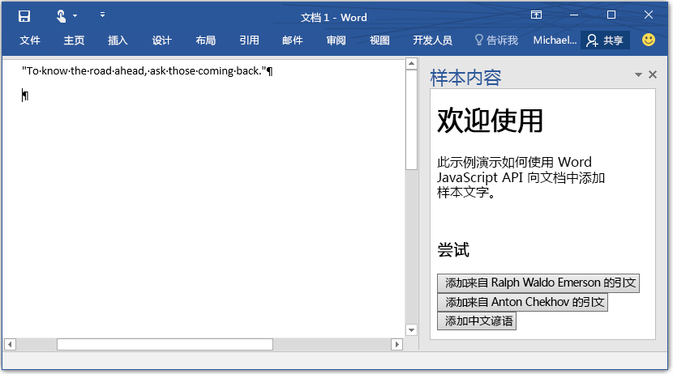

# <a name="build-your-first-word-add-in"></a>构建第一个 Word 外接程序

_适用于：Word 2016、Word for iPad、Word for Mac_

Word 加载项在 Word 中运行，并且可以使用 Word JavaScript API 与文档的内容进行交互，该 API 是用于扩展 Office 应用程序的 Office 加载项编程模型的一部分。 在此加载项编程模型中，可以使用所选的平台和语言来创建将扩展托管到 Word 的 Web 应用程序，然后使用加载项的[清单](../../docs/overview/add-in-manifests.md)来定义其设置和功能。

本文将逐步演示使用 jQuery 和 Word JavaScript API 生成 Word 加载项的过程。 

> **注意**：若要开发 Word 2013 加载项，需要使用共享的 [Office JavaScript API]( https://dev.office.com/docs/add-ins/word/word-add-ins-programming-overview#javascript-apis-for-word)。 若要详细了解可用的平台和不同的 API，请参阅 [Office 加载项主机和平台可用性](https://dev.office.com/add-in-availability)。 

## <a name="create-the-web-app"></a>创建 Web 应用 

1. 在本地驱动器上创建一个文件夹，并将其命名为 **BoilerplateAddin**。 将在此处创建应用程序的相关文件。

2. 在应用程序文件夹中，创建名为 **home.html** 的文件，指定将在加载项的任务窗格中呈现的 HTML。 此加载项将显示三个按钮，当选择任意一个按钮时，样本文字将被添加到文档中。 将以下代码添加到 **home.html**，并保存文件。

    ```html
    <!DOCTYPE html>
    <html>
      <head>
        <meta charset="UTF-8" />
        <meta http-equiv="X-UA-Compatible" content="IE=Edge" />
        <title>Boilerplate text app</title>
        <script src="https://ajax.aspnetcdn.com/ajax/jQuery/jquery-2.1.4.min.js"></script>
        <script src="https://appsforoffice.microsoft.com/lib/1/hosted/office.js" type="text/javascript"></script>
        <script src="home.js" type="text/javascript"></script>
        </head>
        <body>
            <div>
                <h1>Welcome</h1>
            </div>
            <div>
                <p>This sample shows how to add boilerplate text to a document by using the Word JavaScript API.</p>
                <br />
                <h3>Try it out</h3>
                <button id="emerson">Add quote from Ralph Waldo Emerson</button>
                <button id="checkhov">Add quote from Anton Chekhov</button>
                <button id="proverb">Add Chinese proverb</button>
            </div>
            <h3><div id="supportedVersion"/></h3>
        </body>
    </html>
    ```

3. 在应用程序文件夹中，创建名为 **home.js** 的文件，指定加载项的 jQuery 脚本。 此脚本包含初始化代码以及用于更改 Word 文档的代码（具体方法是通过选择某个按钮将文本插入文档）。 将以下代码添加到 **home.js**，并保存文件。

    ```javascript
    (function () {
        "use strict";

        // The initialize function is run each time the page is loaded.
        Office.initialize = function (reason) {
            $(document).ready(function () {

                // Use this to check whether the API is supported in the Word client.
                if (Office.context.requirements.isSetSupported('WordApi', 1.1)) {
                    // Do something that is only available via the new APIs
                    $('#emerson').click(insertEmersonQuoteAtSelection);
                    $('#checkhov').click(insertChekhovQuoteAtTheBeginning);
                    $('#proverb').click(insertChineseProverbAtTheEnd);
                    $('#supportedVersion').html('This code is using Word 2016 or greater.');
                }
                else {
                    // Just letting you know that this code will not work with your version of Word.
                    $('#supportedVersion').html('This code requires Word 2016 or greater.');
                }
            });
        };

        function insertEmersonQuoteAtSelection() {
            Word.run(function (context) {

                // Create a proxy object for the document.
                var thisDocument = context.document;

                // Queue a command to get the current selection.
                // Create a proxy range object for the selection.
                var range = thisDocument.getSelection();

                // Queue a command to replace the selected text.
                range.insertText('"Hitch your wagon to a star."\n', Word.InsertLocation.replace);

                // Synchronize the document state by executing the queued commands,
                // and return a promise to indicate task completion.
                return context.sync().then(function () {
                    console.log('Added a quote from Ralph Waldo Emerson.');
                });
            })
            .catch(function (error) {
                console.log('Error: ' + JSON.stringify(error));
                if (error instanceof OfficeExtension.Error) {
                    console.log('Debug info: ' + JSON.stringify(error.debugInfo));
                }
            });
        }

        function insertChekhovQuoteAtTheBeginning() {
            Word.run(function (context) {

                // Create a proxy object for the document body.
                var body = context.document.body;

                // Queue a command to insert text at the start of the document body.
                body.insertText('"Knowledge is of no value unless you put it into practice."\n', Word.InsertLocation.start);

                // Synchronize the document state by executing the queued commands,
                // and return a promise to indicate task completion.
                return context.sync().then(function () {
                    console.log('Added a quote from Anton Chekhov.');
                });
            })
            .catch(function (error) {
                console.log('Error: ' + JSON.stringify(error));
                if (error instanceof OfficeExtension.Error) {
                    console.log('Debug info: ' + JSON.stringify(error.debugInfo));
                }
            });
        }

        function insertChineseProverbAtTheEnd() {
            Word.run(function (context) {

                // Create a proxy object for the document body.
                var body = context.document.body;

                // Queue a command to insert text at the end of the document body.
                body.insertText('"To know the road ahead, ask those coming back."\n', Word.InsertLocation.end);

                // Synchronize the document state by executing the queued commands,
                // and return a promise to indicate task completion.
                return context.sync().then(function () {
                    console.log('Added a quote from a Chinese proverb.');
                });
            })
            .catch(function (error) {
                console.log('Error: ' + JSON.stringify(error));
                if (error instanceof OfficeExtension.Error) {
                    console.log('Debug info: ' + JSON.stringify(error.debugInfo));
                }
            });
        }
    })();
    ```

## <a name="create-the-manifest-file"></a>创建清单文件

1. 在应用程序文件夹中，创建名为 **BoilerplateManifest.xml** 的文件，定义加载项的设置和功能。 将下列代码添加到此文件。 

    ```xml
    <?xml version="1.0" encoding="UTF-8"?>
        <OfficeApp xmlns="http://schemas.microsoft.com/office/appforoffice/1.1"
                xmlns:xsi="http://www.w3.org/2001/XMLSchema-instance"
                xsi:type="TaskPaneApp">
            <Id>2b88100c-656e-4bab-9f1e-f6731d86e464</Id>
            <Version>1.0.0.0</Version>
            <ProviderName>Microsoft</ProviderName>
            <DefaultLocale>en-US</DefaultLocale>
            <DisplayName DefaultValue="Boilerplate content" />
            <Description DefaultValue="Insert boilerplate content into a Word document." />
            <Hosts>
                <Host Name="Document"/>
            </Hosts>
            <DefaultSettings>
                <SourceLocation DefaultValue="\\MyShare\boilerplate\home.html" />
            </DefaultSettings>
            <Permissions>ReadWriteDocument</Permissions>
        </OfficeApp>
    ```

2. 使用所选的在线生成器生成 GUID。 然后，将上一步中显示的“Id”****元素值替换为 GUID。

3. 保存清单文件。

## <a name="deploy-the-web-app-and-update-the-manifest"></a>部署 Web 应用并更新清单

1. 将 Web 应用程序（即应用程序文件夹的内容）部署到所选的 Web 服务器。

2. 在本地应用程序文件夹中，打开清单文件 (**BoilerplateManifest.xml**)。 编辑 **SourceLocation** 元素中的属性值，以指定 Web 服务器上的 **home.html** 文件的位置并保存该文件。

## <a name="try-it-out"></a>试用

1. 按照用于运行加载项的平台所适用的说明在 Word 中旁加载该加载项。

    - Windows：[在 Windows 上旁加载 Office 加载项以进行测试](../testing/create-a-network-shared-folder-catalog-for-task-pane-and-content-add-ins.md)
    - Word Online：[在 Office Online 中旁加载 Office 加载项](../testing/sideload-office-add-ins-for-testing.md#sideload-an-office-add-in-on-office-online)
    - iPad 和 Mac：[在 iPad 和 Mac 上旁加载 Office 加载项](../testing/sideload-an-office-add-in-on-ipad-and-mac.md)

2. 在右侧任务窗格中，选择任意按钮以将样本文字添加到文档。



## <a name="next-steps"></a>后续步骤

祝贺你，你已使用 jQuery 成功创建了 Word 加载项！ 接下来，请详细了解与生成 Word 加载项有关的[核心概念](word-add-ins-programming-overview.md)。

## <a name="additional-resources"></a>其他资源

* [Word 加载项概述](word-add-ins-programming-overview.md)
* [通过脚本实验室探索代码段](https://store.office.com/en-001/app.aspx?assetid=WA104380862&ui=en-US&rs=en-001&ad=US&appredirect=false)
* [Word 加载项代码示例](http://dev.office.com/code-samples#?filters=word,office%20add-ins)
* [Word JavaScript API 参考](http://dev.office.com/reference/add-ins/word/word-add-ins-reference-overview)